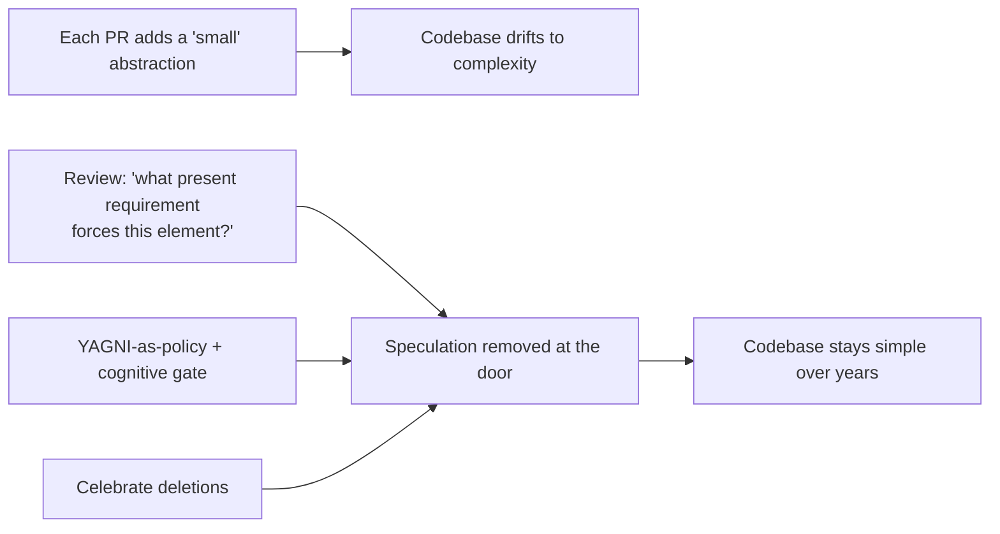
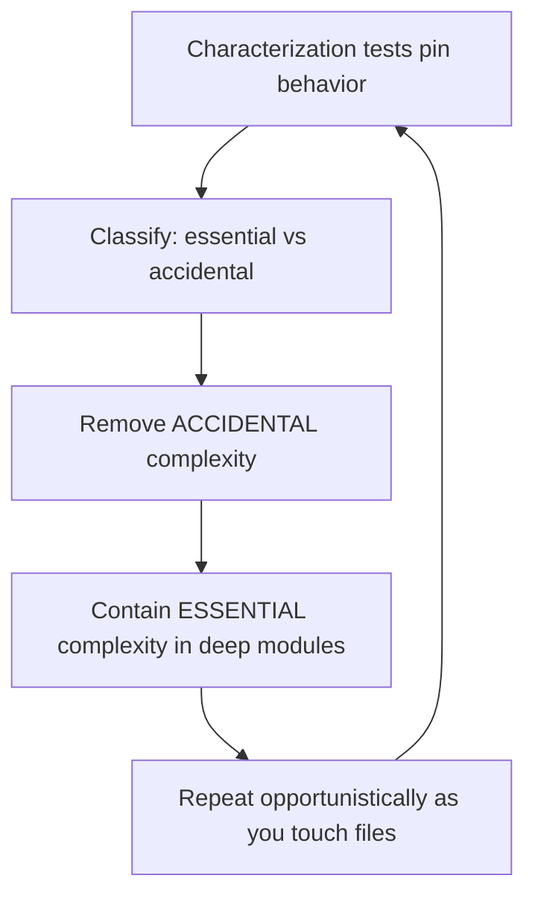

# KISS (Keep It Simple, Stupid) — Professional

> **Category:** [Design Principles](../../README.md) — prefer the simplest solution that fully solves the problem; complexity must earn its place.

> **Prerequisites:** [Junior](junior.md) · [Middle](middle.md) · [Senior](senior.md)
> **Focus:** **Production** — reviews, metrics, team conventions, legacy systems

---

## Introduction

> Focus: **production** — keeping a large, multi-contributor codebase simple over years.

KISS is easy to *agree* with and hard to *sustain*. Every engineer wants clean code in the abstract. Collectively, codebases drift toward complexity: each person adds a "small" abstraction, a "just in case" flag, a layer that matches the framework's tutorial. No single change is unreasonable; the aggregate is a system nobody can change confidently. Complexity is **emergent and incremental** — it arrives one defensible PR at a time.

At the professional level the question is operational: **how do you keep a codebase simple when hundreds of changes land per week from dozens of people with different instincts and different ideas of "simple"?** The answer is a *system*: review standards that name the smells, metrics that make complexity visible without lying, conventions that make the simple path the default, and a disciplined method for clawing back simplicity from legacy code without breaking it.

---

## Enforcing KISS in Code Review

Code review is where simplicity is won or lost, because most over-engineering enters one PR at a time. The professional reviewer pushes back on **additions** as hard as on bugs — which is unnatural, because adding looks like progress and questioning an abstraction looks like obstruction.

### The highest-value review question

> **"What real, present requirement makes this element necessary?"**

Asked of every speculative interface, flag, layer, config option, and generic — this single question prevents most over-engineering. If the honest answer is *"we might need it later,"* the change is a [YAGNI](../02-yagni/professional.md) violation and the element should come out; you can add it the day the need is real. Make this a **normal, non-confrontational** part of review — not an accusation, just the standard bar.

### What to flag

| Smell in the diff | Reviewer response |
|---|---|
| Interface/abstract class with **one** implementation | "What's the second implementation we're anticipating? If hypothetical, use the concrete type." |
| A **generic engine** for one or two concrete cases | "Three named functions would each be clearer. The generality isn't earning its keep." |
| A **clever one-liner** (nested ternary, dense chain) | "Can we name an intermediate or split this? It reads as a puzzle." |
| **Mode flags / `if (caller == X)`** in a shared function | "This braids independent concerns — let's split into clear functions (un-complect)." |
| **Config nobody sets** / hooks nobody calls | "Hard-code it; make it configurable when someone needs to configure it." |
| Deep nesting (4+ levels) | "Guard clauses / extract a helper to flatten this." |

### The crucial caveat: don't reject *essential* complexity

The reviewer's discipline cuts both ways. Before flagging something as "over-engineered," apply the **essential/accidental test** (Brooks): is the complexity coming from the *problem* or the *solution*? A load-bearing seam (a real variation point with two implementations, a persistence boundary that's a one-way door) or irreducible domain logic is **not** over-engineering — flagging it is how you push a team into *under*-engineering. KISS-in-review targets accidental complexity only.

### Review comment templates

> "This `NotificationFactory` has one implementation (email) and one caller. Let's send the email directly and introduce the abstraction when SMS is a real requirement."

> "These two `calculateFee` methods look duplicated, but they encode different rounding rules that happen to share a rate. Merging them couples things that should evolve independently — keep them separate." *(See [DRY](../07-dry/professional.md).)*

> "`process(type, mode, data)` is four jobs behind a switchboard. Three named functions would each be clearer — the generality isn't paying for itself."

> "I'd keep the repository seam here even though it's 'more elements' — storage is a one-way door, and inlining it would make a future migration brutal." *(Essential complexity; see [Senior](senior.md).)*

---

## Fighting Gold-Plating

**Gold-plating** — adding capability beyond requirements — is the production-scale disease KISS exists to treat. Its roots are organizational, not just technical:

| Root cause | What it looks like | Counter |
|---|---|---|
| **"Future-proofing" culture** | Every feature ships with extension points | YAGNI as a *stated* value; require a present requirement per abstraction |
| **Résumé-driven development** | Patterns/frameworks added to impress | Review bar: simplest thing that works; **complexity** must be justified, not simplicity |
| **Misread requirements** | Building the general case for a specific ask | Confirm scope; build exactly what's asked |
| **Boredom / over-capacity** | A simple task "made interesting" with architecture | Channel energy into tests, docs, the next real feature |
| **Fear of looking junior** | Equating more structure with more skill | Reframe: removing an unneeded element is the senior move |

The cultural reframe a professional must drive:

> **Simplicity is the achievement, not complexity.**

In many teams the person who adds a clever abstraction gets praised and the person who *deletes* one is invisible. Flip that incentive. "I removed the strategy pattern and three classes; the feature still works and the module is 200 lines shorter" should earn more respect than adding them did. A proverb worth putting on the team wall: *"It's harder to delete code than to add it, which is exactly why deleting it is worth more."*

---

## Measuring Complexity Honestly

You can't manage what you can't see — but KISS's win is mostly **cognitive**, which naive metrics miss or actively misrepresent. The professional chooses metrics that track simplicity and refuses to be fooled by ones that don't.

| Metric | Tracks simplicity? | Notes |
|---|---|---|
| **Cyclomatic complexity** (McCabe) | Partially | Counts branches; flags god functions, but blind to nesting/naming/over-abstraction |
| **Cognitive complexity** (SonarQube) | **Yes** | Penalizes nesting & hard-to-follow flow — closest single proxy for "is this readable?" |
| **Lines of code per method/file** | Weakly | Useful as a *trend*; low LOC can still be cryptic, high LOC can be clear |
| **Elements (classes/indirections) per feature** | **Yes (over-engineering)** | Rising element-count-per-feature is the gold-plating signal |
| **Duplication %** (PMD/CPD) | Partially | Catches textual duplication; **can't** tell knowledge from coincidence |
| **Change-coupling** (files that change together) | **Yes** | Surfaces *real* shared knowledge that duplication tools miss |
| **DORA: lead time / change-failure rate** | **Yes (outcome)** | Ground truth — simple code is changed quickly and safely |

### The honest-measurement rules

- **Use cognitive complexity, not cyclomatic alone**, as the readability gate. Cyclomatic is blind to the things that actually make code hard to read.
- **Beware the method-shredding trap.** A developer can "pass" a cyclomatic gate by exploding logic into fifteen tiny private methods that each score low but are impossible to follow as a whole. The metric is green; the code is *less* simple. (See [Incident 3](#real-incidents).)
- **Watch element-count-per-feature as a trend.** If a comparable feature now takes twice the classes it did a year ago, the codebase is gold-plating.
- **Treat duplication % with suspicion.** A high score may be coincidental similarity that *shouldn't* be merged; pair it with **change-coupling** (git history) to find *real* duplication.
- **The real metric is outcome.** If lead time and change-failure rate degrade, the design got complex regardless of what static metrics say.

> Never report "we reduced complexity" using cyclomatic complexity alone after a clarity/de-abstraction cleanup — it usually won't move, and quoting it makes the report suspect. Report cognitive complexity, element count, and change-coupling.

---

## Team Conventions for Simplicity

Codify these so simplicity is the default path, not a per-PR fight:

1. **YAGNI is a stated value.** Written in the engineering handbook: *no abstraction without a present requirement.* This gives reviewers explicit license to push back on speculation.
2. **Concrete first; abstraction on the second real case.** No one-implementation interfaces in new code (test seams are the documented exception). Apply the **rule of three** before extracting.
3. **Name after the domain, not the mechanism.** Ban `Manager`/`Helper`/`Util`/`Base`/`Impl`/`Processor` as default names — they signal "I didn't find the concept."
4. **Cognitive-complexity gate in CI**, not cyclomatic-only; cap nesting depth.
5. **Deep modules over shallow wrappers.** A new abstraction must absorb more complexity than it adds; no pass-through layers. (Ousterhout; see [Senior](senior.md).)
6. **Deletions are celebrated.** Track and call out net-negative-LOC PRs that remove complexity safely.
7. **One-way doors get a design note.** Irreversible decisions (schema, public API, protocol, crypto) are reviewed deliberately; everything reversible is allowed to stay minimal and evolve.

These encode the senior reasoning so juniors get it right by default and reviewers cite a *policy*, not a personal taste.

---

## Simplifying Legacy Systems

Greenfield KISS is easy. The professional reality is **introducing simplicity into a system that is already over-engineered, under-tested, and in production.** The approach is incremental, test-guarded, and opportunistic — never a rewrite.

### The sequence

1. **Pin behavior with characterization tests first.** You cannot simplify safely without a net. Write tests that capture *current* behavior (even bugs) so the change can't silently alter it. (See *Working Effectively with Legacy Code*; [Avoid Premature Optimization](../05-avoid-premature-optimization/professional.md) for the same discipline applied to perf.)
2. **Classify before you cut.** For each piece of complexity, ask: **essential** (the problem needs it — keep, contain) or **accidental** (our solution added it — remove)? Only the accidental kind is KISS's target.
3. **Refactor opportunistically (Boy Scout Rule).** Don't schedule a "simplify the codebase" mega-project — it never finishes and it's all risk. Simplify each file *as you touch it for feature work.* Simplicity compounds through normal changes.
4. **Strangle, don't rewrite.** For a genuinely over-engineered subsystem, build the simpler replacement behind the existing interface and migrate callers incrementally (Strangler Fig), rather than a big-bang rewrite that risks everything at once.

### Removing the *wrong* abstraction safely

Legacy systems are full of premature abstractions (the [Senior](senior.md) death spiral, now load-bearing). The safe removal:

```text
1. Characterize: tests around every caller of the over-general abstraction.
2. Inline: push its body back into each caller (now duplicated, but clear).
3. Simplify each caller independently — delete the flags it never used.
4. Re-extract ONLY the parts that are genuinely shared knowledge.
5. Delete the old abstraction.
```

The intermediate state has *more* duplication **on purpose** — that's correct: the wrong abstraction was worse than the duplication (Sandi Metz). This is "re-introduce duplication to escape the wrong abstraction," executed safely with characterization tests as the net.

### What *not* to do in legacy code

- **Don't simplify without tests.** A "harmless cleanup" that flips a subtle behavior is the classic legacy incident.
- **Don't gold-plate the cleanup.** Replacing one over-engineered structure with a *different* one ("now with hexagonal architecture!") is not progress.
- **Don't boil the ocean.** A standalone "simplification initiative" with no feature value rarely survives the first deadline. Tie it to work flowing through the code anyway.

---

## Real Incidents

### Incident 1: The flexible framework nobody used

A team built an internal "rules engine" — generic, configurable, plugin-based — to handle what was, at launch, *three* hard-coded business rules. Two years later it held about five rules, all written by the same team, none by the "third-party plugin authors" the architecture anticipated. The engine was ~8,000 lines; the rules it ran were ~150. Every new rule required learning the engine's DSL. **Postmortem:** textbook gold-plating — built for imagined extensibility that never arrived. **Fix:** the rules were re-expressed as plain functions (~150 lines total); the engine was deleted; onboarding for "add a rule" dropped from days to minutes. **Lesson:** flexibility you don't use is pure cost. The present requirement was three rules; the design should have been three functions.

### Incident 2: The clever one-liner that hid a bug

A pricing calculation was written as a single dense expression — a nested ternary chained with stream operations across three lines — because it was "elegant." It contained an operator-precedence error that mis-applied a discount to a subset of orders. The bug survived review *because nobody could actually read the line to check it.* **Fix:** the expression was broken into four named intermediate variables with the discount step isolated; the bug became obvious and was fixed, and a regression test was added. **Lesson:** cleverness that defeats review is negative value. KISS optimizes the reader — including the reviewer who must verify correctness.

### Incident 3: The cyclomatic gate that rewarded inscrutable code

A team's only quality gate was cyclomatic complexity. A developer "passed" it by exploding deeply nested logic into a chain of fifteen tiny private methods, each scoring low, none readable as a whole (you had to chase all fifteen to understand one operation). The metric was green; the code was inscrutable. **Fix:** added a cognitive-complexity gate and a review norm against pointless method-shredding. **Lesson:** the wrong metric rewards the wrong behavior. Measure cognitive complexity; the goal is comprehension, not a gamed number.

### Incident 4: KISS weaponized into under-engineering

To "keep it simple," a team inlined persistence calls directly throughout the domain instead of behind a repository seam — a defensible call *if* storage were reversible. It wasn't: a compliance requirement forced a database migration, and storage details were entangled in 200 domain files. **Postmortem:** "keep it simple" was applied to an *irreversible* decision (a one-way door) and to *essential* complexity (the persistence boundary). **Lesson:** KISS targets accidental complexity on reversible decisions. The seam was load-bearing; removing it wasn't simplicity, it was under-engineering. (See [Senior](senior.md) on the two failures.)

---

## The Politics of Simplicity

Sustaining KISS is partly a social problem:

- **Complexity signals effort; simplicity can look like under-delivery.** A 3,000-line "platform" *looks* like more work than a 200-line solution, even when the small version is better. Professionals must educate stakeholders that the small solution is the *harder, better* result.
- **Deleting code feels risky and unrewarded.** Make removals safe (tests) and visible (celebrate them) so engineers aren't punished for the most valuable cleanups.
- **"We might need it" is socially hard to refuse.** Arm the team with YAGNI-as-policy and the reversibility test so refusing speculation cites a *standard*, not a colleague.
- **Senior engineers set the example.** If the staff engineer reaches for the framework and the pattern by reflex, everyone does. Model "simplest thing that works," and *explain why you didn't add the abstraction.*
- **"Simple" gets confused with "familiar."** Watch for teammates defending a complected-but-familiar choice as "simple." Re-anchor on un-entanglement (Hickey), not comfort. (See [Senior](senior.md).)

---

## Review Checklist

```text
KISS REVIEW CHECKLIST
[ ] PRESENT REQUIREMENT — every new interface/class/param/config/generic
    is forced by a real, current need (not "might need it later" → YAGNI)
[ ] NO ONE-IMPL INTERFACE / no pass-through wrapper / no unused hook
[ ] NO GENERIC ENGINE for 1–2 concrete cases (prefer named functions)
[ ] NO CLEVER ONE-LINER a reviewer can't verify — name it / split it
[ ] NO MODE-FLAG / if(caller==X) braiding — un-complect into clear functions
[ ] NESTING shallow (guard clauses); cognitive complexity within gate
[ ] DRY targets KNOWLEDGE, not coincidence (no manufactured coupling)
[ ] ESSENTIAL ≠ ACCIDENTAL — don't flag load-bearing seams / domain
    complexity as "over-engineering"
[ ] ONE-WAY DOORS (schema/API/protocol/crypto) reviewed deliberately
[ ] DEEP not shallow — new abstractions absorb more than they add
```

---

## Cheat Sheet

```text
ENFORCE        highest-value question: "what PRESENT requirement
               forces this element?"  (kills most over-engineering)

GOLD-PLATING   capability beyond requirements. Counter: YAGNI-as-policy;
               CELEBRATE deletions, not additions. Simplicity is the win.

MEASURE        cognitive complexity + elements-per-feature + change-coupling.
               NOT cyclomatic-alone, NOT duplication-%-alone.
               Beware method-shredding gaming the metric.

DON'T          weaponize KISS against ESSENTIAL complexity or load-bearing
               seams — that's under-engineering, not simplicity.

LEGACY         characterization tests FIRST → classify essential/accidental
               → simplify the accidental, opportunistically, small commits.
               Strangle; never big-bang rewrite.

WRONG ABSTR.   inline back to callers → simplify each → re-extract only the
               genuinely shared knowledge.
```

---

## Diagrams

### Where complexity enters, and where it's stopped



### Safe legacy simplification



---

## Related Topics

- **Two sides of one coin:** [YAGNI](../02-yagni/professional.md)
- **In tension with:** [DRY](../07-dry/professional.md)
- **Reinforces:** [Avoid Premature Optimization](../05-avoid-premature-optimization/professional.md), [Optimize for Deletion](../06-optimize-for-deletion/professional.md)
- **The practice:** [Simple Design](../../../craftsmanship-disciplines/04-simple-design/professional.md)
- **Tooling:** SonarQube cognitive complexity, PMD/CPD duplication, git change-coupling analysis, DORA metrics.

---


---

## Check your understanding

1. Explain KISS (Keep It Simple, Stupid) — Professional Level in your own words and name the problem it solves.
2. How would you apply the ideas around Table of Contents, Introduction, Enforcing KISS in Code Review in a realistic engineering change?
3. What failure mode or misuse should you look for, and what evidence would reveal it?
4. How would you introduce and govern KISS (Keep It Simple, Stupid) — Professional Level across teams through reversible, measurable increments?
5. What observable result would convince you that the approach improved the system?
