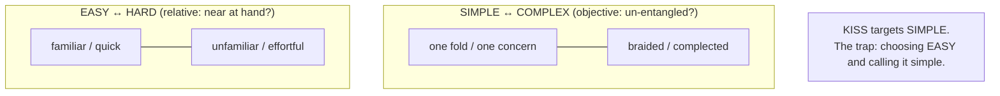
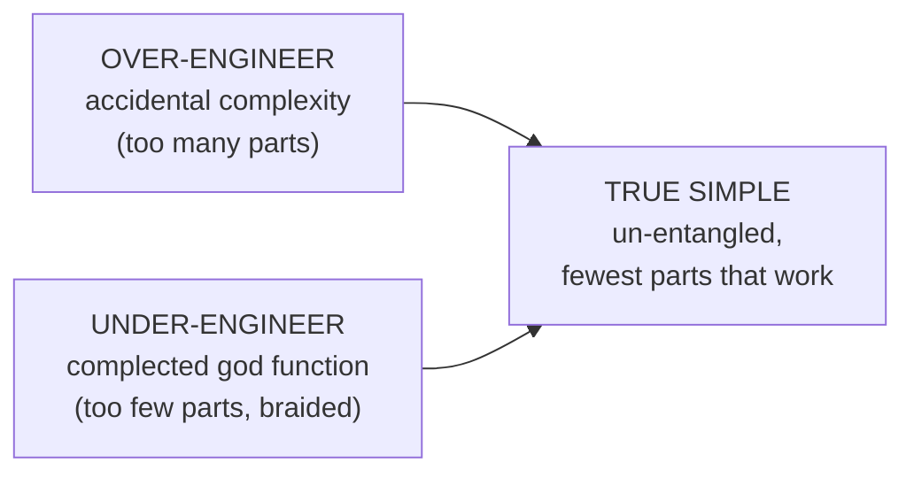

# KISS (Keep It Simple, Stupid) — Senior

> **Category:** [Design Principles](../../README.md) — prefer the simplest solution that fully solves the problem; complexity must earn its place.

> **Prerequisites:** [Junior](junior.md) · [Middle](middle.md)
> **Focus:** **Design trade-offs** and **system-level reasoning**

---

## Table of Contents

1. [Introduction](#introduction)
2. [Simple Is Not Easy: Hickey's Distinction](#simple-is-not-easy-hickeys-distinction)
3. [The Two Ways KISS Fails](#the-two-ways-kiss-fails)
4. [When KISS Is Weaponized](#when-kiss-is-weaponized)
5. [The Wrong Abstraction Is Worse Than Duplication](#the-wrong-abstraction-is-worse-than-duplication)
6. [Worse Is Better](#worse-is-better)
7. [Deep Modules: Where Simplicity Should Live](#deep-modules-where-simplicity-should-live)
8. [Code Examples — Advanced](#code-examples-advanced)
9. [Liabilities](#liabilities)
10. [Pros & Cons at the System Level](#pros-cons-at-the-system-level)
11. [Diagrams](#diagrams)
12. [Related Topics](#related-topics)

---

## Introduction

> Focus: **design trade-offs** and **system-level reasoning**

At junior and middle levels KISS is a working habit. At the senior level it becomes a **stance in two genuinely hard arguments**:

1. **What *is* "simple"?** The word is overloaded. Rich Hickey's distinction between *simple* and *easy* is the senior-grade definition, and without it "keep it simple" collapses into "keep it familiar," which is a different and often worse thing.
2. **When is "keep it simple" *wrong*?** KISS, applied without judgement, becomes a license for under-engineering, missing seams, and a slogan to shut down necessary complexity. The senior skill is knowing exactly where the principle stops applying — which means telling **essential** from **accidental** complexity reliably, every time.

This file is about the failure modes of the principle itself: where simplicity is misdefined, where it's misapplied, and where chasing it produces a *more* complex system.

---

## Simple Is Not Easy: Hickey's Distinction

The most important senior idea about KISS comes from **Rich Hickey's talk *Simple Made Easy*** (2011). Hickey insists *simple* and *easy* are **different axes**, and conflating them is how engineers fool themselves.

> - **Simple** comes from the Latin *simplex* — "one fold." Its opposite is **complex** ("braided together"). Simple means **un-entangled**: one role, one task, one concept, *not interleaved* with others. It's an **objective** property of the design — you can look at a thing and count how many concerns it braids together.
> - **Easy** comes from *adjacent* — "near at hand." Its opposite is *hard*. Easy means **familiar, close to your existing skills, quick to reach for.** It's a **relative** property — easy *for whom?*

The two are orthogonal. Things can be:

| | Easy | Hard |
|---|---|---|
| **Simple** | A pure function you already know | A pure function in an unfamiliar paradigm |
| **Complex** | A familiar framework that braids 10 concerns | An unfamiliar tangle |

Hickey's word for the enemy is **complecting** — to *braid together* things that should be separate (state + identity + time, a function that both computes *and* logs *and* caches). Complecting is what produces complexity, and we do it because the complecting tool is often the *easy* one — the familiar ORM, the framework's magic, the global that's "right there."

### Why this matters for KISS

The naive reading of KISS — "use the thing you find easiest" — is **exactly the trap.** The easy thing (the familiar framework, the quick global, the convenient inheritance) is frequently the *complecting* thing, and therefore the *complex* one. **True KISS chases simplicity (un-entanglement), which is often the *harder* path to find.**

> KISS does not mean "reach for the familiar." It means "reach for the un-entangled" — and that usually takes more thought, not less. *Simple is a property of the result; easy is a property of your relationship to it.*

This is why a senior can say, without contradiction, that the *simplest* design was the *hardest* to arrive at: it took real effort to find the un-braided decomposition instead of bolting concerns together with whatever was near at hand.

---

## The Two Ways KISS Fails

"Keep it simple" has two symmetric failure modes, and a senior must recognize both:

### Failure 1: Over-engineering (the obvious one)

Adding accidental complexity the problem doesn't need — frameworks, layers, speculative abstractions. This is what KISS is *usually* invoked against, and it's the one juniors are taught to fear. Tell: rising moving-parts-per-feature, one-implementation interfaces, config nobody sets.

### Failure 2: Under-engineering (the subtle one)

Pushing "fewest parts" so hard you produce code that is **complected** — concerns braided into one element because separating them "felt like over-engineering." The tell is a single function/class that grows **mode flags, type-switches, and `if (caller == X)` special cases.** That is not simple; it is the opposite of simple, *disguised* as simplicity because it has few named parts.

```python
# Looks "simple" (one function, few elements) but is COMPLECTED:
def handle(request, kind, legacy=False, dry_run=False, v2=False):
    if kind == "order" and not legacy: ...
    elif kind == "refund" and v2: ...
    elif dry_run: ...
    # four independent concerns braided into one element
```

This has *few elements* but *high complexity* — it braids four unrelated behaviors. The fix is to **add** the seams the concerns are asking for (four clear functions), which *increases* the element count and *decreases* the complexity. Under-engineering and over-engineering are symmetric failures; genuine simplicity sits between them, and **element count alone cannot tell you which side you're on** — only un-entanglement can.

> "Fewest parts" is a *heuristic* for simplicity, not a *definition* of it. The definition is un-entanglement (Hickey). A few braided parts are more complex than several un-braided ones.

---

## When KISS Is Weaponized

Because "keep it simple" sounds unarguable, it gets used as a **rhetorical weapon** to shut down necessary work. Seniors must spot and disarm this:

- **"That's over-engineering"** aimed at a *load-bearing seam* (a persistence boundary, a real variation point with two concrete implementations). Here the abstraction isn't speculative — it's required — and removing it is *under*-engineering, not KISS.
- **"Just keep it simple"** used to reject *essential* complexity. Some domains are **irreducibly complex** (distributed consensus, regulatory tax law, real-time scheduling). Demanding they "be simple" yields a *simplistic*, broken system. You cannot KISS away essential complexity; you can only contain it.
- **"We don't need all that"** used to skip genuinely required correctness (idempotency, error handling, security checks) because they add code. That's incurring debt, not simplicity.

The disarming move is always the **essential/accidental test** (Brooks, from [Middle](middle.md)): *Is the complexity being rejected coming from the problem or from the solution?* KISS legitimately attacks only the accidental kind. Invoked against essential complexity, "keep it simple" is not a principle — it's an excuse.

> The skill that defines a senior here is **distinguishing essential from accidental complexity reliably.** That single judgement is what separates KISS-as-discipline from KISS-as-laziness.

---

## The Wrong Abstraction Is Worse Than Duplication

The industry's reflex is that abstraction is always good and duplication always bad. Seniors know the reverse is frequently true — and it's the deepest KISS-vs-[DRY](../07-dry/senior.md) tension. **Sandi Metz:** *"Duplication is far cheaper than the wrong abstraction."* The death spiral:

1. You see two similar bits of code and extract a shared abstraction (DRY).
2. A new requirement makes one caller need slightly different behavior.
3. You add a parameter/flag to the abstraction to handle the difference.
4. More requirements arrive; more flags accrue. The abstraction becomes a maze of conditionals serving callers that no longer share much.
5. The abstraction is now *harder* to understand and change than the duplication would have been — but it's load-bearing for many callers, so it's *risky* to undo.

```python
# The premature-abstraction death spiral — a "DRY" function gone complex
def render(item, mode=None, compact=False, legacy=False, locale="en", inline=None):
    if mode == "summary" and not compact: ...
    elif legacy: ...
    elif inline and locale != "en": ...
    # six callers, none sharing more than ~40% of this logic
```

Each flag was a locally reasonable "don't duplicate" decision. The aggregate is a function nobody can change confidently — **accidental complexity manufactured in the name of DRY.** The recovery is counterintuitive and pure KISS: **re-introduce duplication.** Inline the abstraction back into its callers, let each become clear and independent, *then* re-extract only the genuinely shared knowledge.

The senior rule: **prefer duplication to the wrong abstraction.** Duplication is visible, local, and cheap to fix later; the wrong abstraction is invisible coupling that gets more expensive every day. This is KISS overruling DRY — because the *simpler* (less complected) system has the duplication, not the maze.

---

## Worse Is Better

A senior must know **Richard Gabriel's "Worse Is Better"** (1989–91), the most famous and provocative argument that *simplicity of implementation* can beat *completeness of design* — and why it relates directly to KISS.

Gabriel contrasted two design philosophies:

| | **The "Right Thing" (MIT/Stanford)** | **"Worse Is Better" (New Jersey / Unix-C)** |
|---|---|---|
| **Simplicity** | Interface should be simple, *even if implementation is complex* | **Implementation** should be simple, even if interface suffers |
| **Correctness** | Must be fully correct | Slightly-less-correct is acceptable if simpler |
| **Consistency** | Must be fully consistent | A little inconsistency tolerated for simplicity |
| **Completeness** | Cover as many cases as reasonable | Drop completeness before simplicity |

Gabriel's (half-ironic) thesis: the "Worse Is Better" approach — prioritizing **implementation simplicity** above completeness and even some correctness — **wins in the real world** because such systems are easier to build, port, understand, and adopt, so they spread first and improve later. Unix and C beat "more correct" rivals partly this way.

### The KISS lesson, and its danger

The pro-KISS reading: a **simple thing that ships and spreads** often beats a perfect thing that's too complex to finish or adopt. Simplicity has *survival value*.

But Gabriel himself was ambivalent — the danger is that "worse is better" rationalizes shipping genuinely *worse* software (the simplistic trap at scale). The senior synthesis:

> **Worse Is Better** says implementation simplicity is a *competitive advantage*, not that low quality is a virtue. Use it to justify a *simple, correct, incomplete-but-extensible* first version — **not** to justify a *simplistic, broken* one. The line is the same as always: drop *completeness* (add it later), never *correctness on the cases you ship.*

---

## Deep Modules: Where Simplicity Should Live

John Ousterhout (*A Philosophy of Software Design*) sharpens KISS with a structural rule: **prefer deep modules.** A module's value is its **interface simplicity** relative to the **functionality it provides.**

```
   SHALLOW module                    DEEP module
   ┌──────────────┐                 ┌──┐
   │  big, complex │                 │  │  ← simple, small interface
   │   interface   │                 │  │
   └──────────────┘                 │  │
   │  little logic │                 │  │  ← much functionality
   └──────────────┘                 │  │     absorbed inside
                                     └──┘
   high cost, low value             low cost, high value
```

The connection to KISS: *simplicity is about the **interface** the caller sees, not the absence of complexity inside.* A deep module **absorbs** essential complexity behind a tiny interface — that's the *good* kind of abstraction KISS endorses. A shallow module (a thin wrapper that just forwards calls) adds an interface without absorbing anything — pure accidental complexity, the *bad* kind KISS deletes.

This resolves a junior confusion ("doesn't KISS mean no abstraction?"): **no — KISS means abstractions must *pay for themselves* by absorbing more complexity than they add.** A deep module does; a pass-through wrapper doesn't. Measure an abstraction by *depth*, not by its existence.

---

## Code Examples — Advanced

### Re-introducing duplication to escape the wrong abstraction (Python)

```python
# BEFORE — a "DRY" megafunction serving 3 divergent callers via flags
def export(records, fmt="csv", header=True, gzip=False, redact=()):
    rows = [_redact(r, redact) for r in records] if redact else records
    out = _to_csv(rows, header) if fmt == "csv" else _to_json(rows)
    return _gz(out) if gzip else out

# AFTER — inline to clear callers; keep only genuinely shared helpers
def export_audit_csv(records):
    return _to_csv([_redact(r, PII_FIELDS) for r in records], header=True)

def export_api_json(records):
    return _to_json(records)

def export_archive_csv(records):
    return _gz(_to_csv(records, header=False))
# _to_csv / _to_json / _gz are REAL shared knowledge (deep, reused) — keep them.
# The flag-driven megafunction was the WRONG abstraction — gone.
```

The three exporters now read independently (un-complected); the genuinely shared, *deep* helpers stay DRY. We removed the wrong abstraction, not all abstraction.

### Un-complecting by separating concerns (TypeScript)

```typescript
// COMPLECTED: one function braids fetching, retry, caching, and logging
async function getUser(id: string): Promise<User> {
  log(`fetch ${id}`);
  const cached = cache.get(id);
  if (cached) return cached;
  for (let i = 0; i < 3; i++) {
    try { const u = await http.get(`/users/${id}`); cache.set(id, u); return u; }
    catch { /* retry */ }
  }
  throw new Error("failed");
}

// UN-COMPLECTED: each concern is one fold; compose them at the edge
const getUser = (id: string) => http.get<User>(`/users/${id}`);

const cachedGetUser  = withCache(getUser, cache);   // caching: one concern
const robustGetUser  = withRetry(cachedGetUser, 3); // retry:   one concern
const tracedGetUser  = withLog(robustGetUser);      // logging: one concern
```

The second version has *more* named parts but is *simpler* in Hickey's sense — each concern is un-braided, independently testable, and reusable. This is the senior counter to "fewest elements = simplest": **un-entanglement is the real target, and it sometimes needs more elements, not fewer.**

---

## Liabilities

### Liability 1: "Simple" as a euphemism for "familiar"

The most common senior-level error is reaching for the *easy* (familiar) tool and calling it *simple*. The familiar framework that braids ten concerns is *complex*, not simple, no matter how comfortable it feels. Audit "simple" choices with Hickey's test: *is this un-entangled, or just near-at-hand?*

### Liability 2: KISS as license to under-engineer

Crushing necessary seams to win on element count produces complected, mode-flag god functions. "Fewest parts" is a heuristic, not the definition; the definition is un-entanglement.

### Liability 3: Weaponizing KISS against essential complexity

Using "keep it simple" to reject irreducible domain complexity or load-bearing seams. The defense is the essential/accidental test — KISS attacks only accidental complexity.

### Liability 4: "Worse Is Better" as an excuse for low quality

Misreading Gabriel to justify shipping *simplistic, broken* software. The doctrine drops *completeness*, never *correctness on shipped cases.*

### Liability 5: Pushing complexity onto callers

A module made "simple" by leaking work to its callers (a shallow module) hasn't removed complexity — it relocated it, often multiplying it across many call sites. Measure *total* system complexity; prefer deep modules.

---

## Pros & Cons at the System Level

| Dimension | Lean KISS (simple/minimal) | Lean elaborate (more structure) |
|---|---|---|
| Cost of unneeded machinery | Low — you didn't build it | High — built, tested, maintained, often unused |
| Cost when a need *does* arise | A refactor (cheap behind tests) | Zero *if* guessed right; rework if wrong |
| Readability of internals | High (no speculative indirection) | Lower (indirection for absent reasons) |
| Risk of under-engineering | **Real** — can complect via "fewest parts" | Lower on this axis |
| Adaptability to change | High (less to undo) | Low (structure assumes a fixed future) |
| Handling essential complexity | Must consciously *contain*, not deny it | Sometimes over-models it |
| Adoption / shipping speed | High ("Worse Is Better" edge) | Lower (more to finish) |
| Best domain | Most software (discovered requirements) | Stable, irreducibly complex cores — modeled deeply |

The senior stance the table encodes: KISS wins on most rows *for accidental complexity in reversible internals* — which is most code. It **loses** when "fewest parts" is mistaken for "simplest" (under-engineering) and when invoked against *essential* complexity. The discipline is applying KISS aggressively to accidental complexity while **containing** essential complexity in deep, un-complected modules.

---

## Diagrams

### Simple vs. Easy (Hickey)



### The two failures of 'keep it simple'



---

## Related Topics

- **Two sides of one coin:** [YAGNI](../02-yagni/senior.md)
- **In tension with:** [DRY](../07-dry/senior.md) — the wrong abstraction vs. duplication.
- **Reinforced by:** [Avoid Premature Optimization](../05-avoid-premature-optimization/senior.md), [Optimize for Deletion](../06-optimize-for-deletion/senior.md).
- **The practice:** [Simple Design](../../../craftsmanship-disciplines/04-simple-design/senior.md) — Beck's four rules operationalize KISS.
- **How over-engineering shows as smells:** [SOLID as a Whole](../../04-solid/06-solid-as-a-whole-and-smells/senior.md).

---


---

## Check your understanding

1. Explain KISS (Keep It Simple, Stupid) — Senior Level in your own words and name the problem it solves.
2. How would you apply the ideas around Table of Contents, Introduction, Simple Is Not Easy: Hickey's Distinction in a realistic engineering change?
3. What failure mode or misuse should you look for, and what evidence would reveal it?
4. How would you validate a system-level decision about KISS (Keep It Simple, Stupid) — Senior Level under uncertainty?
5. What observable result would convince you that the approach improved the system?
