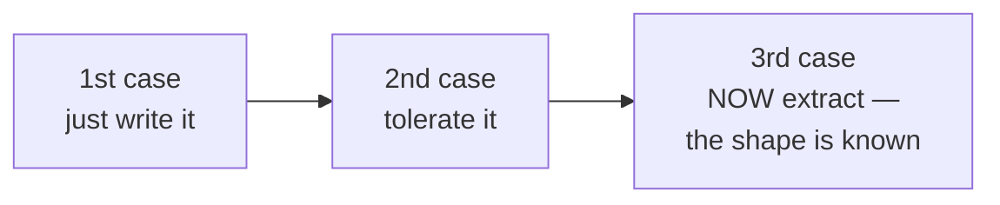
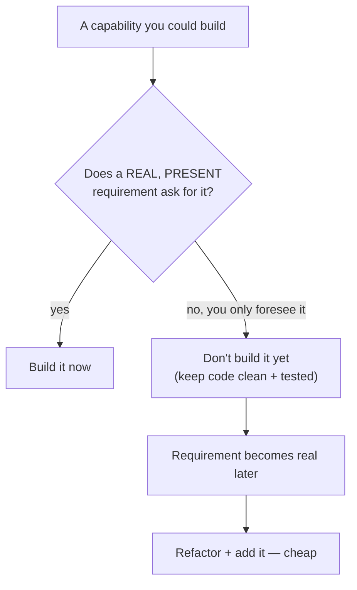

# YAGNI (You Aren't Gonna Need It) — Junior

> **Category:** [Design Principles](../../README.md) — don't build a capability until a real, present requirement demands it.

---

## Table of Contents

1. [Introduction](#introduction)
2. [Prerequisites](#prerequisites)
3. [Glossary](#glossary)
4. [The Rule in One Sentence](#the-rule-in-one-sentence)
5. [Where It Comes From: Extreme Programming](#where-it-comes-from-extreme-programming)
6. [What YAGNI Is *Not*](#what-yagni-is-not)
7. [Real-World Analogies](#real-world-analogies)
8. [Mental Models](#mental-models)
9. [A Worked Example: Building Only What's Asked](#a-worked-example-building-only-whats-asked)
10. [Symptoms YAGNI Fights](#symptoms-yagni-fights)
11. [Code Examples](#code-examples)
12. [The Rule of Three](#the-rule-of-three)
13. [Best Practices](#best-practices)
14. [Common Mistakes](#common-mistakes)
15. [Tricky Points](#tricky-points)
16. [Test Yourself](#test-yourself)
17. [Cheat Sheet](#cheat-sheet)
18. [Summary](#summary)
19. [Further Reading](#further-reading)
20. [Related Topics](#related-topics)
21. [Diagrams](#diagrams)

---

## Introduction

> Focus: **What is it?** and **How to use it?**

**YAGNI** stands for **"You Aren't Gonna Need It."** It is a rule about *timing*: it tells you **when** to build a feature, not how. The whole principle fits in one line from Extreme Programming:

> **"Always implement things when you actually need them, never when you just foresee that you need them."**
> — Ron Jeffries (Extreme Programming)

That is it. When a real, present requirement asks for a capability, build it. When you merely *suspect* you might need something later — a configuration option, a plugin system, an extra layer of abstraction "to be safe" — **don't build it yet.** Wait until the need is real.

### Why this matters

Most code is not too small; it is **too big** for what it actually does. Engineers add abstractions "just in case," interfaces with a single implementation, settings nobody changes, and layers a tutorial used. Every one of those is a cost: more to read, more to test, more to maintain, more places for a bug to hide — and most of it is for a future that never arrives, or arrives looking completely different from the guess.

YAGNI is the discipline of **not paying those costs until you actually need to.** It is one of the broadest, most reused rules in software, which is why it sits in the [Generic](../../README.md) section of design principles, right next to [KISS](../01-kiss/).

---

## Prerequisites

- **Required:** You can write functions, classes, and parameters, and you understand what an *interface* or *abstraction* is.
- **Required:** You can read a requirement and tell what it *does* ask for versus what it *doesn't*.
- **Helpful:** A feel for **[KISS](../01-kiss/)** — "keep it simple" — since YAGNI is the part of "simple" that's about *future* features.
- **Helpful:** Exposure to **refactoring** as behavior-preserving change, because YAGNI works *because* refactoring lets you add the feature later cheaply.

---

## Glossary

| Term | Definition |
|------|-----------|
| **YAGNI** | "You Aren't Gonna Need It" — don't build a capability until a real, present requirement demands it. |
| **Presumptive feature** | A feature you build because you *presume* (guess) it will be needed, not because a requirement asks for it. The exact thing YAGNI targets. |
| **Speculative generality** | Flexibility added for a future that hasn't arrived: extra parameters, hooks, abstract base classes with one subclass, config nobody sets. |
| **Cost of carry** | The ongoing drag a presumptive feature puts on *every* future change to the code around it. |
| **One-way door** | A decision that is expensive or impossible to reverse later (a public API, a data schema, a wire protocol). YAGNI bends here. |
| **Rule of three** | Tolerate duplication or wait on an abstraction until the *third* concrete case; by then you know its real shape. |
| **Refactoring** | Changing the structure of code without changing its behavior — the safety net that makes "add it later" cheap. |

---

## The Rule in One Sentence

> **Build it when you need it, not when you think you might need it.**

The keyword is **need** — a *present, real* requirement, not a *foreseen, possible* one. YAGNI does not say "never plan." It says: don't turn a guess about the future into code *today*. You can think about the future all you like; just don't *encode* the guess in today's structure.

The most common phrasing in code review:

> **"What present requirement makes this necessary?"**

If the honest answer is "we might need it later," that is a YAGNI violation. Build the thing the requirement actually asks for, and add the rest the day the need becomes real.

---

## Where It Comes From: Extreme Programming

YAGNI was named and popularized in the late 1990s by **Kent Beck**, **Ron Jeffries**, and the **Extreme Programming (XP)** community. It is one expression of XP's broader instruction:

> **"Do the simplest thing that could possibly work."**

XP teams worked in very short cycles, adding only what the current story required, and leaning hard on automated tests and refactoring. In that world, building ahead of need was *waste* — you were spending effort now on a guess, and the guess was usually wrong because requirements get discovered as you go, not known up front.

YAGNI is the rule that operationalizes "simplest thing that could possibly work" against the temptation to build for the future. Its companions in XP are **[KISS](../01-kiss/)**, **[Simple Design](../../../craftsmanship-disciplines/04-simple-design/)** (Beck's four rules), and **[avoiding premature optimization](../05-avoid-premature-optimization/)** — they are all facets of the same instinct: *do less, later, only when forced.*

---

## What YAGNI Is *Not*

This is the **single most misunderstood point** about YAGNI, so learn it first and learn it well.

> **YAGNI is about presumptive *features*. It is NOT an excuse to skip good design, tests, refactoring, naming, or modularity.**

YAGNI does **not** mean:

- ❌ "Write sloppy code." Clean, clear, well-named code is *always* needed — that's a present requirement, not a future one.
- ❌ "Skip tests." Tests are what make "add it later" safe and cheap. Dropping them makes YAGNI *dangerous*.
- ❌ "Don't refactor." The opposite — YAGNI and refactoring are **partners**.
- ❌ "Never use abstractions." Use the abstractions the *current* problem needs. Don't add ones only a *future* problem might need.

Here is the key relationship, and it surprises people:

> **YAGNI and refactoring are complementary.** You can safely keep the design simple *now* precisely *because* refactoring lets you add capability *later* cheaply. If adding the feature later were expensive, YAGNI would be reckless. Because refactoring makes it cheap, YAGNI is the smart bet.

So the picture is: write **clean, simple, well-tested** code for what you need today; when tomorrow's requirement arrives, **refactor** to make room and add it. You never "fall behind," because the cost of adding later is low — and you save all the effort of building things you turn out not to need.

---

## Real-World Analogies

| Concept | Analogy |
|---|---|
| **Build only what you need now** | Packing for a one-week trip. You take what you'll use, not everything you *might* use. Every extra item is weight you carry the whole way. |
| **Presumptive feature** | Building a six-lane highway to a village of ten people because it "might grow." You pay for six lanes today; the village may never come — and if it does, it may grow toward a different road. |
| **Cost of carry** | A spare engine bolted to your car "just in case." It doesn't help you drive; it just makes the car heavier and harder to work on every single day. |
| **YAGNI + refactoring** | Renting furniture instead of buying a mansion's worth up front. When you actually need a bigger table, you swap it in — cheaply, on demand. |
| **One-way door (the exception)** | Pouring a building's foundation. *That* you must get right up front, because tearing it up later is enormously expensive. Not everything is reversible. |

---

## Mental Models

**The intuition:** *"Do the simplest thing that works for today's requirement. When tomorrow's arrives, refactor and add it — that's cheap. Building the guess today is what's expensive."*

```
   NEED IS REAL NOW?  ──── yes ──→  BUILD IT (it's a present requirement)
          │
          no  (you only foresee it)
          │
          ▼
      DON'T BUILD IT YET
          │
          ▼
   keep the code simple + tested
          │
          ▼
   later: requirement becomes real  ──→  refactor + add it (cheap)
```

A second model: YAGNI is a **subtraction** discipline applied to the *future*. Most engineering advice tells you what to *add*. YAGNI tells you what *not* to add yet — every speculative feature you decline is effort saved and a future you didn't lock yourself into.

---

## A Worked Example: Building Only What's Asked

The requirement: *"Email users a receipt after they pay."* That's all. One channel, one message.

### The presumptive ("just in case") version

A lot of teams would proudly build this:

```python
class NotificationChannel(ABC):
    @abstractmethod
    def send(self, recipient, message): ...

class EmailChannel(NotificationChannel):
    def send(self, recipient, message): ...

class SmsChannel(NotificationChannel):           # nobody asked for SMS
    def send(self, recipient, message): ...

class NotificationService:
    def __init__(self, channels: dict[str, NotificationChannel],
                 templates: TemplateRegistry, retry_policy: RetryPolicy):
        ...
    def send_receipt(self, order, channel="email"): ...
```

Look at everything here that **no requirement asked for**: an SMS channel, a channel registry, a template registry, a retry policy, a `channel=` parameter. It's built for receipts *and* alerts *and* marketing *and* push notifications — none of which exist. It is *one email*.

### The YAGNI version

```python
def send_receipt(order):
    body = f"Thanks! You paid ${order.total}."
    email.send(to=order.email, subject="Receipt", body=body)
```

Five lines. It does exactly what was asked, it's clear, and you can test it. **Ship it.**

### "But what if we add SMS later?"

Then you'll add SMS *later* — the day SMS receipts are a real requirement. At that point you'll have **two concrete cases** (email and SMS), so you'll know the real shape of the abstraction and can extract it correctly. Built today, the abstraction would be a *guess*, and guesses about shape are wrong far more often than they're right. Worse, when the real SMS requirement arrives, it rarely matches the guess — so you'd refactor *away* from your speculation before building the real thing, which is **slower** than if you'd built nothing.

> The asymmetry that makes YAGNI a good bet: if you **wait** and turn out to need it, you pay *once* to add it. If you **speculate** and turn out wrong, you pay *twice* — once to remove the wrong abstraction, once to build the right one.

---

## Symptoms YAGNI Fights

These are the recognizable shapes of "building for a future that isn't here." Learn to spot them:

| Symptom | What it looks like |
|---|---|
| **Speculative configuration** | A setting, env var, or feature flag with exactly one value in production that nobody ever changes. |
| **"We might need a plugin system"** | A generic extension/hook framework with one built-in plugin and no second one in sight. |
| **Premature abstraction layer** | An interface with a single implementation; an abstract base class with one subclass. |
| **Unused parameters / flags** | A parameter always passed the same value, or a `mode`/`type` flag with one real branch. |
| **Building for imagined scale** | Sharding, caching layers, queues, and microservices for an app with a hundred users. |
| **Generic switchboards** | `process(type, data)` with a big `if type == ...` ladder, when three named functions would do. |

The cure for all of them is the same: **delete the speculation, build the concrete thing the requirement asks for, and add the rest when the need is real.**

---

## Code Examples

### Java — an unused parameter "for flexibility"

```java
// BEFORE — speculative: a "currency" parameter, but the app only handles USD
double total(List<Item> items, String currency, boolean applyTax, Locale locale) {
    // currency, applyTax, and locale are ALWAYS passed "USD", true, US
    double sum = items.stream().mapToDouble(Item::lineTotal).sum();
    return sum * 1.0;   // currency conversion: a TODO that never happens
}

// AFTER — YAGNI: build for the requirement that exists (USD, taxed)
double total(List<Item> items) {
    double sum = items.stream().mapToDouble(Item::lineTotal).sum();
    return sum * (1 + TAX_RATE);
}
```

When multi-currency becomes a real requirement, you add it *then* — with real knowledge of how currencies must be handled, not a `String currency` placeholder that quietly did nothing.

### TypeScript — the one-implementation interface

```typescript
// BEFORE — speculative: an interface "in case we swap storage later"
interface UserStore {
  find(id: string): Promise<User>;
}
class PostgresUserStore implements UserStore {   // the ONLY implementation
  find(id: string): Promise<User> { /* ... */ }
}

// AFTER — YAGNI: use the concrete type until a second store is real
class PostgresUserStore {
  find(id: string): Promise<User> { /* ... */ }
}
// When a second store (or a test fake) is an actual requirement,
// extract the interface THEN — shaped by two concrete cases.
```

### Python — keep the structure flat until a real second case appears

```python
# BEFORE — speculative "rules engine" for what is literally three if-statements
class Rule(ABC):
    @abstractmethod
    def evaluate(self, ctx): ...

class RuleEngine:
    def __init__(self, rules: list[Rule]): ...
    def run(self, ctx): ...

# AFTER — YAGNI: it's three rules; write three rules
def is_eligible(user):
    return (user.age >= 18
            and user.verified
            and not user.banned)
```

The "engine" is flexibility for plugin authors who don't exist. Three boolean checks are clearer, testable, and trivial to change. If a genuine need for *user-configurable* rules arrives, build the engine then — for the real use case.

---

## The Rule of Three

YAGNI's most practical companion is the **rule of three**, the heuristic for *when* to introduce an abstraction:

> Write the first occurrence. Tolerate the second. On the **third** occurrence, extract the abstraction — because by now you can *see* the real shape of what's shared.

Why three? With **one** case you know nothing about variation. With **two** cases you can see *one* way they're alike — but two points fit infinitely many patterns, so extracting now bakes in a *guess*. With **three** cases you can observe what is *truly* common across all of them versus what only *looked* common — so the abstraction's boundary is **observed, not guessed.**



The rule of three is YAGNI applied to abstractions: don't build the general thing on a guess; wait until you have enough concrete cases that it isn't a guess anymore. (More at [Middle](middle.md).)

---

## Best Practices

1. **Build for the requirement that exists today.** Read the ask literally; build exactly that.
2. **Ask "what present requirement forces this?"** of every parameter, interface, flag, and layer. If the answer is "we might need it later," cut it.
3. **Keep code clean and tested anyway.** YAGNI trims *future* features, never *current* quality. Clean code and tests are present requirements.
4. **Lean on refactoring.** Trust that you can add the feature later — that trust is what makes YAGNI safe. Keep your tests green so refactoring stays cheap.
5. **Use the rule of three** for abstractions: tolerate twice, extract on the third when you know the real shape.
6. **Note the future without coding it.** "We'll probably need SMS later" is a fine comment in a ticket. It is *not* a reason to ship the abstraction now.
7. **Watch for the exception.** For one-way doors (public APIs, data schemas, security), a little forethought is worth it — see [Tricky Points](#tricky-points) and [Middle](middle.md).

---

## Common Mistakes

1. **Treating YAGNI as "write sloppy code."** It's about *future features*, not *current quality*. Clean code and tests still required.
2. **Skipping tests in YAGNI's name.** Tests make "add it later" cheap; dropping them makes YAGNI reckless.
3. **Building the abstraction on the *second* occurrence.** That's an abstraction built on a guess — wait for the third (rule of three).
4. **Adding "just in case" parameters, flags, and config.** Classic speculative generality; delete on sight.
5. **Confusing YAGNI with refactoring-avoidance.** YAGNI *relies on* refactoring; the two are partners, not opposites.
6. **Applying YAGNI to one-way doors.** Schemas, public APIs, and security choices are expensive to reverse — those deserve forethought.

---

## Tricky Points

- **YAGNI ≠ "don't think about the future."** You think about it constantly; you just don't *encode* the guess in today's structure. Keeping the design simple is *how* you stay ready for the future cheaply.
- **YAGNI ≠ "skip design."** This is the big one. Good design, naming, tests, and modularity are *present* requirements — YAGNI never trims them. It only trims *presumptive features*.
- **YAGNI and refactoring are a package deal.** YAGNI is only a safe bet *because* refactoring makes "add it later" cheap. They reinforce each other.
- **YAGNI bends for one-way doors.** A few decisions are expensive or impossible to reverse (public API contracts, data formats, security). For those, a little up-front thought beats a painful migration. The test is *reversibility* — covered at [Middle](middle.md) and [Senior](senior.md).

---

## Test Yourself

1. State YAGNI in one sentence. What's the keyword, and why?
2. Where does YAGNI come from, and what XP slogan is it an expression of?
3. Name three things YAGNI is *not* an excuse to skip.
4. Why are YAGNI and refactoring described as "partners"?
5. What is the rule of three, and why three (not two)?
6. Give one kind of decision where YAGNI *bends* and forethought is worth it.

---

## Cheat Sheet

```text
YAGNI = "You Aren't Gonna Need It"
  Build it WHEN you need it, NOT when you THINK you might.
  Origin: Extreme Programming (Beck, Jeffries) —
          "do the simplest thing that could possibly work."

THE TEST (ask of every element you add)
  "What PRESENT requirement forces this?"
  Answer "we might need it later" → cut it; add it when the need is real.

WHAT YAGNI TARGETS (presumptive features / speculative generality)
  one-impl interfaces · unused params/flags · config nobody sets
  "we might need a plugin system" · premature scale · generic switchboards

WHAT YAGNI NEVER TRIMS  (these are PRESENT requirements)
  clean code · tests · refactoring · good names · modularity

WHY IT'S SAFE
  YAGNI + refactoring are PARTNERS. Stay simple now BECAUSE
  refactoring makes "add it later" cheap.

THE EXCEPTION
  one-way doors (public API · data schema · protocol · security)
  → expensive to reverse → a little forethought IS worth it.

COMPANION: rule of three — tolerate twice, extract on the THIRD.
```

---

## Summary

- **YAGNI** = "You Aren't Gonna Need It": *build it when you need it, never when you just foresee that you might.* It's a rule about **timing**.
- It comes from **Extreme Programming** (Beck, Jeffries) and expresses *"do the simplest thing that could possibly work."*
- It targets **presumptive features / speculative generality**: one-impl interfaces, unused params, config nobody sets, "might need a plugin system," building for imagined scale.
- **YAGNI is NOT an excuse to skip design, tests, refactoring, or modularity** — those are *present* requirements. YAGNI only trims *future* features.
- **YAGNI and refactoring are partners:** staying simple now is safe *because* refactoring makes "add it later" cheap.
- The **rule of three** is its companion: tolerate twice, abstract on the third when the shape is known.
- It **bends for one-way doors** — irreversible decisions deserve forethought.

---

## Further Reading

- Martin Fowler, [Yagni](https://martinfowler.com/bliki/Yagni.html) — the canonical essay on the costs of presumptive features.
- Ron Jeffries, [You're NOT Gonna Need It](https://ronjeffries.com/xprog/articles/practices/pracnotneed/) — the XP source.
- Kent Beck, *Extreme Programming Explained* — "do the simplest thing that could possibly work."
- [KISS](../01-kiss/), [Simple Design](../../../craftsmanship-disciplines/04-simple-design/), and [Avoid Premature Optimization](../05-avoid-premature-optimization/) — YAGNI's siblings.

---

## Related Topics

- **Siblings (same instinct):** [KISS](../01-kiss/), [Avoid Premature Optimization](../05-avoid-premature-optimization/).
- **The practice it lives in:** [Simple Design](../../../craftsmanship-disciplines/04-simple-design/) (Beck's four rules; "fewest elements" is YAGNI in rule form).
- **The tension to resolve:** [Open/Closed Principle](../../04-solid/02-ocp-open-closed/), [Encapsulate What Changes](../../03-module-and-class/01-encapsulate-what-changes/) — when *is* anticipating change justified? (See [Senior](senior.md).)

---

## Diagrams




---

## Check your understanding

1. Explain YAGNI (You Aren't Gonna Need It) — Junior Level in your own words and name the problem it solves.
2. How would you apply the ideas around Table of Contents, Introduction, Prerequisites in a realistic engineering change?
3. What failure mode or misuse should you look for, and what evidence would reveal it?
4. What small example would prove that you can apply YAGNI (You Aren't Gonna Need It) — Junior Level correctly?
5. What observable result would convince you that the approach improved the system?
