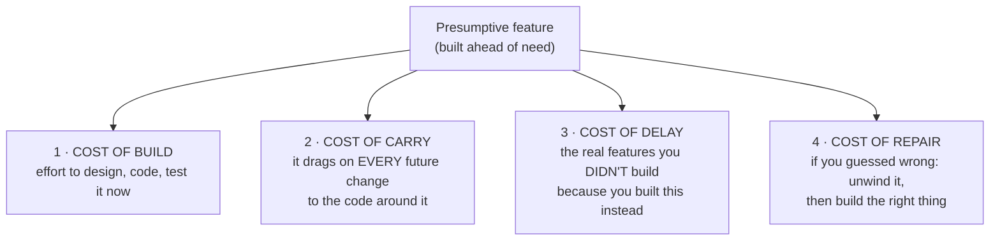
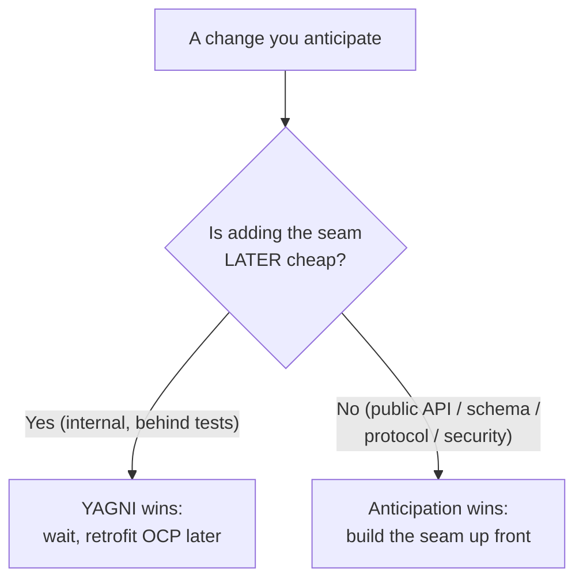
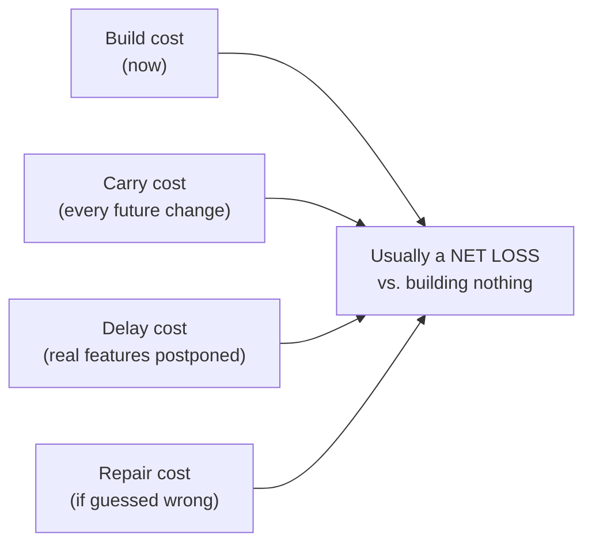
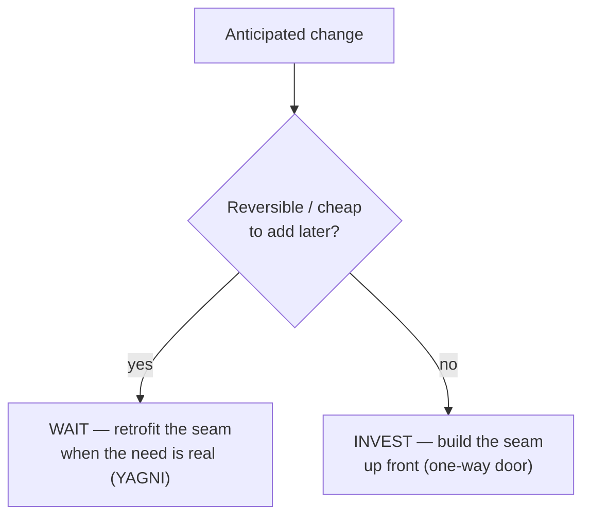

# YAGNI (You Aren't Gonna Need It) — Middle

> **Category:** [Design Principles](../../README.md) — don't build a capability until a real, present requirement demands it.

> **Prerequisite:** [Junior](junior.md)
> **Focus:** **Why** and **When**

---

## Introduction

> Focus: **Why** and **When**

At the junior level YAGNI is a slogan you recite: *build it when you need it.* At the middle level it becomes a **judgement call you make many times a day**: *Is this a present requirement or a guess? Should I add this seam now or wait? Is this abstraction earning its keep, or did I build it for a future that may never come — and if it does, may not look like my guess?*

The hard part is not the easy cases (nobody defends a config option with one value). The hard part is the **legitimately tempting** speculation: the abstraction you're *fairly sure* you'll need, the seam a senior colleague says is "obviously coming." This level gives you the two tools that make YAGNI a *reasoned* decision instead of a reflex:

1. **A precise model of what speculation actually costs** (Martin Fowler's four costs), so "it's cheap to add now" can be argued, not asserted.
2. **A reversibility test** for the one case where YAGNI is *wrong* — when anticipating change is genuinely justified.

---

## The Four Costs of a Presumptive Feature

The deepest argument for YAGNI is **Martin Fowler's**, from his *Yagni* essay. People defend speculation with "it's cheaper to build it now while I'm in here." Fowler shows that even when you *do* eventually need the feature, building it early is **usually a net loss** — because a presumptive feature carries **four distinct costs**, not one.



| Cost | What it is | Why it bites |
|---|---|---|
| **1 · Cost of build** | The effort to design, implement, and test the feature *now*. | Pure outlay against a guess. If the guess is wrong, it was 100% waste. |
| **2 · Cost of carry** | The presumptive feature sits in the code and **drags on every future change** near it. | Every refactor, every read, every new feature must now account for the speculative code — even before it's ever used. This is the cost people forget and the one that compounds. |
| **3 · Cost of delay** | Building the speculative feature **postpones the features you actually need now.** | Time spent on a maybe-feature is time *not* spent shipping real value — and earlier real features can earn value (or feedback) sooner. |
| **4 · Cost of repair** | If you guessed the *shape* wrong, you must **unwind the wrong abstraction first**, then build the right one. | You pay *twice*, and the half-built speculation actively gets in the way of the correct design. |

### The punchline

> Even if you turn out to need the feature, building it early is usually a net loss — because **requirements shift**, so your odds of guessing the right shape are low, and the cost of carry + cost of delay are paid *regardless* of whether the guess was right.

The asymmetry: **defer and turn out to need it** → you pay the build cost *once*, later, with better information. **Speculate and turn out wrong** → you pay build + carry + delay + repair. Deferring is the lower-variance, usually-cheaper bet. That is the entire quantitative case for YAGNI.

> Fowler's sharpening: YAGNI does **not** apply to effort spent making code *easier to change* (clean structure, tests, good names). Those *reduce* the cost of carry and the cost of building later. YAGNI applies only to building the **presumptive feature itself.**

---

## Applying YAGNI to Real Requirements

Here is the menu of speculations and what YAGNI says about each:

| Speculative addition | YAGNI says |
|---|---|
| A config option no requirement asks for | Hard-code the value; make it configurable when someone needs to configure it. |
| A parameter "in case we vary it" | Drop it; add it when a caller actually varies it. |
| An interface with one implementation | Use the concrete type; extract the interface at the *second* implementation. |
| A generic `process(type, data)` switchboard | Write the specific functions; generalize at the third concrete case. |
| A plugin / extension system | Build the one behavior; add the seam when a second plugin is *real*. |
| Sharding / queues / caches for imagined scale | Build for current load; add infrastructure when measured load demands it. |

### Worked example: the payment provider seam

Requirement: *"Charge the customer's card via Stripe."* One provider.

```python
# SPECULATIVE — built for "we'll probably add PayPal/Adyen someday"
class PaymentGateway(ABC):
    @abstractmethod
    def charge(self, amount: Money) -> Receipt: ...

class StripeGateway(PaymentGateway):              # the only implementation
    def charge(self, amount: Money) -> Receipt: ...

class PaymentService:
    def __init__(self, gateways: dict[str, PaymentGateway]):  # registry of one
        self._gateways = gateways
    def charge(self, provider: str, amount: Money) -> Receipt:
        return self._gateways[provider].charge(amount)
```

The interface, the registry, the `provider` parameter — all flexibility for a second gateway **that does not exist.** YAGNI:

```python
# YAGNI — the requirement is "charge via Stripe"
class StripeGateway:
    def charge(self, amount: Money) -> Receipt: ...
```

When Adyen becomes a *real* requirement, you extract `PaymentGateway` **then** — shaped by *two* concrete gateways, so the interface actually fits both. Built today against one gateway plus a fantasy, the interface would likely model Stripe's quirks as if they were universal, and you'd refactor it anyway when Adyen's real API didn't fit.

> The discipline is not "never build the gateway abstraction." It's **build it the day a second gateway is a real requirement, not the day you imagine one.**

---

## YAGNI vs. Anticipated Change: the Honest Tension

This is the section that separates a slogan-chanter from an engineer. YAGNI says *don't build for the future.* But two respected principles say the opposite:

- **[Open/Closed Principle](../../04-solid/02-ocp-open-closed/) (OCP):** design modules so new behavior can be *added* (extension) without *modifying* existing code — which means putting in extension points *ahead* of the new behavior.
- **[Encapsulate What Changes](../../03-module-and-class/01-encapsulate-what-changes/):** find the part of the system likely to change and hide it behind a stable interface — *before* it changes.

Both ask you to **anticipate change** and build a seam for it. YAGNI says **don't build for anticipated needs.** Which wins?

### The resolution: reversibility, not certainty

The naive resolution — "build the seam if you're *sure* the change is coming" — is **wrong**, because certainty about *existence* ("we'll need multiple gateways") is not certainty about *shape* (what the interface should look like), and it's the shape you'd be guessing. The correct test is **how expensive it is to add the seam later:**

> **Cheap to add the seam later → wait (YAGNI). Expensive or irreversible to add it later → sometimes invest early.**

| The change is... | Cost of adding the seam later | Decision |
|---|---|---|
| A second algorithm/strategy inside one module | Cheap — extract an interface behind tests | **Wait (YAGNI).** OCP/encapsulation can be *retrofitted* the day the second case is real. |
| A second implementation of an internal collaborator | Cheap — refactor | **Wait (YAGNI).** |
| A **public/published API** other teams consume | Expensive — you can't change a published contract without breaking clients | **Invest early.** Design the seam up front. |
| A **data/storage schema** with live data | Expensive — a migration | **Invest early.** |
| A **wire protocol / message format** across services | Expensive — version skew | **Invest early.** |
| A **security/crypto** choice | Very expensive — re-encrypt, re-issue | **Invest early.** |

The key insight that dissolves the apparent contradiction:

> **OCP and "Encapsulate What Changes" are usually *retrofittable*.** For most internal code, you can add the extension point the day the variation becomes real — refactoring makes it cheap — so YAGNI wins: *don't* pre-build the seam. They become *up-front* obligations only at **one-way doors**, where retrofitting is expensive or impossible. There, anticipating change is justified and YAGNI bends.

So the honest answer to "OCP vs YAGNI" is: **most of the time YAGNI wins** (because the OCP seam is cheap to add later), and **at one-way doors anticipation wins** (because it isn't). The skill is correctly classifying the decision's reversibility — covered in depth at [Senior](senior.md).



---

## The Rule of Three in Practice

The rule of three (introduced at [Junior](junior.md)) is YAGNI's operational rule for *abstractions*:

> Tolerate the first and second occurrence. Extract the abstraction on the **third.**

The middle-level subtlety is *why two isn't enough*: with two occurrences you can see **one** axis of similarity, but a two-point line fits infinitely many curves — extracting now bakes in a *guess about the shape*. The third occurrence reveals which parts are **truly invariant** (shared by all three) versus **incidental** (varying across them). The abstraction's boundary becomes **observed, not guessed**, which is exactly what avoids the *wrong abstraction* (a far more expensive mistake — see [Senior](senior.md)).

**Caveat — the rule of three is a default, not a law.** If the second occurrence is *provably* the same knowledge (a regulated tax rule duplicated verbatim, a constant mandated by spec), DRY it immediately. The rule of three protects against *guessing*; there's nothing to guess when the knowledge is certainly identical.

---

## Where YAGNI Sits Among Its Siblings

YAGNI is one of a family of "do less" principles. Knowing the boundaries keeps you from conflating them:

| Principle | What it targets | Relationship to YAGNI |
|---|---|---|
| **[KISS](../01-kiss/)** | Complexity in *how* you solve today's problem. | KISS = simple *solution*; YAGNI = don't build *future* features. KISS can apply even with no future in view. |
| **[Avoid Premature Optimization](../05-avoid-premature-optimization/)** | Speculative *performance* work. | A *special case* of YAGNI: don't build speed you don't yet need. "You aren't gonna need that cache." |
| **[Simple Design](../../../craftsmanship-disciplines/04-simple-design/)** | Beck's four rules; rule 4 = "fewest elements." | YAGNI is rule 4 **as you write** — it stops speculative elements before they appear. |
| **[DRY](../07-dry/)** | Duplicated *knowledge*. | Tension: over-eager DRY *adds* speculative abstraction (a YAGNI violation). The rule of three mediates both. |

The unifying idea: **YAGNI is the *future* axis of "keep it simple."** KISS asks "is this solution simple *now*?"; YAGNI asks "are you building for a future you don't have *yet*?"

---

## Trade-offs

| Decision | Lean YAGNI (defer) | Lean anticipation (build the seam now) |
|---|---|---|
| Cost today | Low — less code, ships sooner | High — build + test the abstraction (cost of build) |
| Cost of carry | None — the speculation isn't there | Paid on every future change near it |
| Cost when the need arrives | Refactor to add the seam (cheap behind tests) | Possibly zero — *if* you guessed the shape right |
| Cost if the guess is wrong | None — you built nothing to unwind | Repair: remove the wrong seam, then build the right one |
| Readability now | High — no indirection for absent reasons | Lower — indirection serving nobody yet |
| Best when | The seam is cheap to add later (most internal code) | The seam is at a one-way door (API, schema, protocol, security) |

The asymmetry that favors YAGNI: **defer + need it later = pay once. Speculate + wrong = pay four costs.** Deferring is the lower-variance bet *unless* deferral itself is expensive — which is exactly the one-way-door exception.

---

## Edge Cases

### 1. The "we'll definitely need it" abstraction

You're *nearly certain* a second case is coming. YAGNI **still usually wins**, because near-certainty about *existence* is not certainty about *shape* — and it's the shape you'd be guessing. You may need *something*, but rarely the thing you'd build today. Defer until the second concrete case pins the shape. *Exception:* if the seam is also a one-way door (you'd publish the API now), invest early.

### 2. Test seams

"I need to mock this dependency in tests **right now**" is a **present requirement**, not speculation. An interface introduced so a unit test can substitute a fake is justified — testability is a current need, so it passes YAGNI's "what present requirement forces this?" Don't reflexively flag every interface as speculative; ask *whether a present requirement (including testing) forces it.*

### 3. Cheap, reversible seams you happen to be touching anyway

If you are *already* editing a function and a clean extraction makes *today's* code clearer, do it — that's clarity (a present requirement), not speculation. The line is: are you adding structure for *today's* readability, or for *tomorrow's* hypothetical feature?

### 4. Frameworks that demand structure

Some frameworks force ceremony (a controller, a DTO, a repository) before you've earned it. That's the framework's tax, not your speculation — minimize it, isolate it, but don't blame YAGNI for what the framework mandates.

---

## Tricky Points

- **YAGNI ≠ "don't think ahead."** You think ahead constantly; you just don't *encode* the guess in structure. Noting "SMS is probably coming" in a ticket is thinking ahead. Shipping the `NotificationChannel` interface today is encoding the guess.
- **"Cheap to add now" is the speculator's favorite lie.** It ignores the *cost of carry* and *cost of delay*, which are paid whether or not the guess is right. Fowler's four costs exist precisely to puncture this argument.
- **The wrong abstraction is worse than no abstraction.** Building the seam early and guessing its shape wrong leaves you with a *misleading* structure that's load-bearing and risky to remove — costlier than having built nothing. (Sandi Metz; see [Senior](senior.md).)
- **OCP and YAGNI are not enemies — they operate at different reversibility scales.** Retrofit OCP for cheap internal seams; pre-build it only at one-way doors.
- **Premature optimization is just YAGNI for performance.** "You aren't gonna need that index/cache/queue yet" is the same argument. Measure first.

---

## Best Practices

1. **Argue with the four costs.** When someone says "it's cheap to build now," answer with cost of carry + cost of delay + cost of repair, which they're ignoring.
2. **Default to the concrete solution.** Build the abstraction when the *second real case* (or third occurrence) arrives, not before.
3. **Classify every anticipated change by reversibility.** Cheap-to-add-later → wait. One-way door → invest early. This is the single most useful judgement.
4. **Treat testability as a present requirement.** A seam needed for *today's* test is justified; one needed for *tomorrow's* feature is not.
5. **Apply the rule of three** for abstractions; DRY immediately only when the knowledge is *provably* identical.
6. **Keep code clean and tested.** YAGNI trims future features; it never trims the things that make "add it later" cheap.
7. **Reserve up-front design for one-way doors:** public APIs, data schemas, protocols, security.

---

## Test Yourself

1. List Fowler's four costs of a presumptive feature, and say which one people most often forget.
2. Why is "it's cheap to build it now" usually a flawed argument even when you *do* end up needing the feature?
3. State the reversibility test for resolving YAGNI vs. anticipated change.
4. OCP says "build extension points ahead of need"; YAGNI says "don't." Reconcile them honestly.
5. Why isn't the *second* occurrence enough to justify extracting an abstraction?
6. Why is "avoid premature optimization" describable as a special case of YAGNI?

---

## Summary

- **Fowler's four costs** are the quantitative case for YAGNI: a presumptive feature costs **build + carry + delay + (if wrong) repair** — and carry + delay are paid *regardless* of whether the guess was right.
- Even if you *do* eventually need the feature, building it early is **usually a net loss**, because requirements shift and the guessed *shape* is usually wrong.
- The **YAGNI vs. anticipated change** tension resolves on **reversibility**: cheap-to-add-later seams → wait (YAGNI); one-way doors (API, schema, protocol, security) → invest early.
- **OCP and "Encapsulate What Changes" are mostly retrofittable**, so YAGNI usually wins for internal code; they become up-front only at one-way doors.
- The **rule of three** is YAGNI for abstractions: extract on the third case when the shape is observed; DRY earlier only when the knowledge is *provably* identical.
- YAGNI is the **future axis of "keep it simple"**; *avoid premature optimization* is YAGNI specialized to performance.

---

## Diagrams

### The four costs



### YAGNI vs. anticipation, decided by reversibility




---

## Check your understanding

1. Explain YAGNI (You Aren't Gonna Need It) — Middle Level in your own words and name the problem it solves.
2. How would you apply the ideas around Table of Contents, Introduction, The Four Costs of a Presumptive Feature in a realistic engineering change?
3. What failure mode or misuse should you look for, and what evidence would reveal it?
4. Which local design trade-off would make you choose or reject YAGNI (You Aren't Gonna Need It) — Middle Level in an existing codebase?
5. What observable result would convince you that the approach improved the system?
