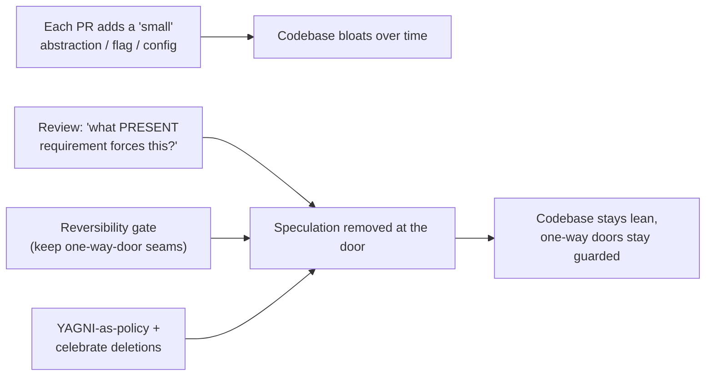
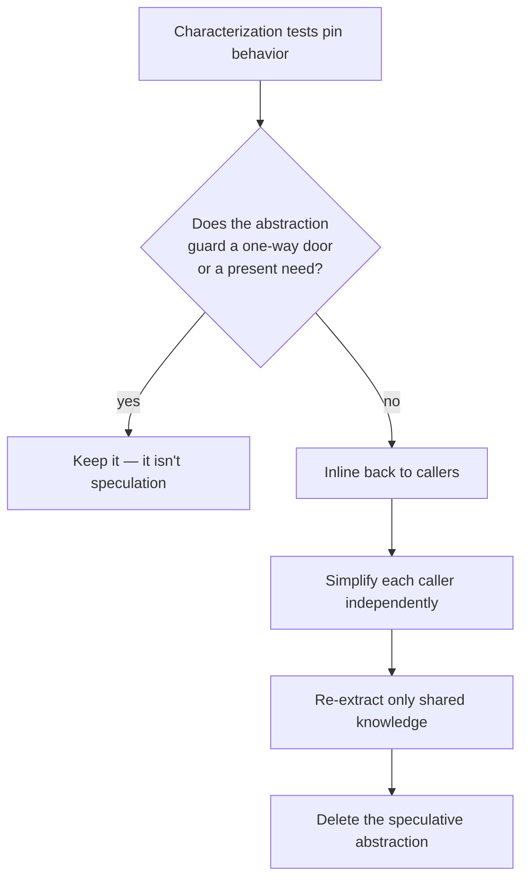

# YAGNI (You Aren't Gonna Need It) — Professional

> **Category:** [Design Principles](../../README.md) — don't build a capability until a real, present requirement demands it.

> **Prerequisites:** [Junior](junior.md) · [Middle](middle.md) · [Senior](senior.md)
> **Focus:** **Production** — reviews, incidents, team conventions, legacy systems

---

## Introduction

> Focus: **production** — keeping speculation out of a large, multi-contributor codebase over years.

YAGNI is easy to *agree* with and hard to *sustain*. Individually, every engineer wants lean code. Collectively, codebases bloat: each person adds a "small" abstraction, a "just in case" flag, a layer matching the framework's tutorial, a config option for a future nobody scheduled. No single change is unreasonable; the aggregate is a system nobody can change confidently.

At the professional level the question is operational: **how do you keep speculation out when hundreds of changes land per week from dozens of people with different instincts — without swinging into the opposite failure of under-engineering one-way doors?** The answer is a system: review standards that name the smell, conventions that make the lean path the default, a disciplined way to claw back speculation from legacy code, and — critically — a reversibility gate so YAGNI doesn't get misapplied to irreversible decisions.

---

## Enforcing YAGNI in Code Review

Code review is where speculation enters, one PR at a time, and therefore where it must be stopped. The reviewer's job is to push back on *additions* as hard as on bugs.

### The highest-value review question

> **"What real, present requirement makes this element necessary?"**

Asked of every new interface, parameter, config option, flag, and abstraction layer, this single question prevents most over-engineering. If the honest answer is **"we might need it later," it's a YAGNI violation** — the element comes out, to be added the day the need is real. "It's more flexible / future-proof / extensible" is a **red flag, not a justification.**

### The mandatory second question

A YAGNI reviewer who only asks the first question will eventually wave through under-engineering at a one-way door. So pair it:

> **"Is this a reversible decision? If not, is the seam justified?"**

For a *removed* abstraction, confirm it isn't guarding a one-way door (schema, public API, protocol, security, persisted identifiers). For an *added* one, confirm a present requirement (including testability) forces it. Both questions together are the professional bar — they catch over-engineering *and* under-engineering.

### Review comment templates

> "This interface has one implementation and one caller. What's the second implementation we're anticipating? If it's hypothetical, let's use the concrete type and extract the interface when the second one is real."

> "`process(type, mode, data)` is a switchboard with one live branch. Three named functions would each be clearer — the generality isn't earning its keep yet (YAGNI)."

> "Agreed this config flag is unused today — but it controls the *storage encryption mode*, which is a one-way door once data is written. This one I'd keep and decide deliberately, not defer."

> "Nice deletion. Just confirm `OrderRepository` wasn't the seam our tests mock — if it is, that's a present requirement and we should keep it."

---

## Fighting Gold-Plating

**Gold-plating** is adding capability beyond requirements — the production-scale form of speculation, and the chronic disease YAGNI exists to treat. Its roots are organizational, not just technical:

| Root cause | What it looks like | Counter |
|---|---|---|
| **"Future-proofing" culture** | Every feature ships with extension points | Make YAGNI a stated value; require a present requirement per abstraction |
| **Résumé-driven development** | Frameworks/patterns added to be impressive | Review bar: simplest thing that works; complexity must be *justified*, not simplicity |
| **Misread requirements** | Building the general case for a specific ask | Confirm scope; build exactly what's asked |
| **Boredom / over-capacity** | A simple task "made interesting" with architecture | Channel energy into tests, docs, or the next real feature |
| **Fear of looking junior** | Equating more structure with more skill | Reframe: removing an unneeded element is the senior move |

The cultural reframe a professional must drive:

> **Simplicity is the achievement, not complexity.** In most teams, the person who adds a clever extensible framework gets praised and the person who *deletes* one is invisible. Flip that. "I deleted the plugin system and three classes; the feature still works and the module is 200 lines shorter" should earn more respect than building it did.

> Team-wall proverb: *"Flexibility you don't use is pure cost."* Every speculative extension point is paid for on every read, every refactor, every onboarding — whether or not it's ever used.

---

## Making Speculation Visible: Signals and Metrics

You can't manage what you can't see, and speculation is sneaky — every instance looked reasonable to its author. You need signals that surface it across a large codebase, while refusing metrics that lie.

| Signal | Tracks speculation? | Notes |
|---|---|---|
| **One-implementation interfaces** (static scan) | **Yes** | A high and *rising* count of interfaces with a single implementer is the cleanest YAGNI signal. Whitelist documented test seams. |
| **Dead/always-default config & flags** | **Yes** | Config keys with one value in every environment, flags never flipped — pure cost of carry. Audit periodically and delete. |
| **Element-count-per-feature trend** | **Yes** | If shipping a comparable feature now takes twice the classes it did a year ago, the codebase is gold-plating. |
| **Unused public surface** (exported but uncalled) | **Yes** | "Extensibility" hooks nobody extends; APIs nobody consumes. Coverage + call-graph analysis surfaces them. |
| **Code coverage of "flexible" branches** | Partially | Speculative branches are often the untested ones — a flag's `else` that no test or caller exercises. |
| **Cyclomatic complexity alone** | **No** | Branch count doesn't capture "interface with one impl" or "config nobody sets." Speculation can be low-complexity. |
| **Lines of code** | **Weakly** | Useful only as a *trend*; a lean solution and a gold-plated one can have similar LOC. |

### The honest-measurement rules

- **Treat a rising one-impl-interface count and a rising element-count-per-feature as your primary YAGNI gauges.** They directly track speculative generality. Most static analyzers (and a short custom script over the AST) can produce both.
- **Run a periodic dead-flag / dead-config audit.** Speculative configuration is invisible in normal review because it "does no harm" — but it accretes branches (see Incident 2). Sweep for keys with a single value across environments and delete them.
- **The ground-truth metric is the outcome:** can the team add a *new* capability quickly, or must every change first navigate layers built for absent requirements? DORA **lead time for changes** degrades when speculation accumulates, because the cost of carry taxes every change. If lead time is climbing while feature scope isn't, suspect gold-plating.
- **Never claim a "simplicity win" with cyclomatic complexity** after deleting a speculative abstraction — removing a one-impl interface or a dead flag often doesn't move it. Report the element-count drop, the deleted interfaces/flags, and the LOC delta instead.

> The cheapest high-signal practice: a recurring "speculation sweep" — grep for one-impl interfaces, always-default flags, and exported-but-uncalled symbols, then delete what no present requirement justifies. It pays back continuously because cost of carry is paid continuously.

---

## Team Conventions

Codify these so the lean path is the default, not a per-PR fight:

1. **YAGNI is a stated value.** Written in the engineering handbook: *no abstraction without a present requirement.* This gives reviewers explicit license to push back on speculation, citing policy instead of opinion.
2. **Concrete first; interface on the second implementation.** No one-implementation interfaces in new code — *except* documented test seams and one-way-door boundaries.
3. **Rule of three for extraction.** No shared abstraction before the third concrete occurrence, unless the knowledge is provably identical.
4. **Reversibility gate for "simplifications."** Removing a seam requires confirming the decision is reversible. One-way doors (schema, public API, protocol, security) get a deliberate design note, never an "it emerged" default.
5. **Name things after the domain, not the mechanism.** Ban `Manager`/`Helper`/`Generic`/`Base`/`Impl` defaults — they signal "I built scaffolding for a concept I hadn't found."
6. **Deletions are celebrated.** Track and call out net-negative-LOC PRs that remove speculation safely.
7. **"Probably later" goes in the backlog, not the code.** Anticipated needs are captured as tickets/notes, never as shipped abstractions.

These conventions encode the senior reasoning so juniors get it right by default and reviewers cite a standard, not a preference.

---

## YAGNI in Legacy Systems

Greenfield YAGNI is easy — just don't build the speculation. The professional reality is the opposite: **a system already drowning in past speculation** — the plugin frameworks, the config no one sets, the abstraction layers serving one caller. Clawing that back is the harder, more common job, and it's the inverse operation: *removing* speculation safely.

### The sequence for removing a speculative abstraction

```text
1. CHARACTERIZE — write tests around every caller of the over-general
   abstraction, pinning CURRENT behavior (even bugs).
2. INLINE — push the abstraction's body back into each caller
   (temporarily MORE duplication, but each caller now clear).
3. SIMPLIFY each caller independently — delete the flags/branches
   that this caller never used.
4. RE-EXTRACT only the parts that are GENUINELY shared knowledge.
5. DELETE the old speculative abstraction.
```

This is "re-introduce duplication to escape the wrong abstraction" (Sandi Metz), executed safely with characterization tests as the net. The intermediate state has *more* duplication on purpose — that's correct; the speculation was worse than the duplication.

### Two hazards specific to legacy YAGNI work

- **Don't remove a seam without checking reversibility.** That "unused" abstraction may be the only thing localizing a one-way door (persistence, a published API adapter). Deleting it to "simplify" can be the under-engineering incident from [Senior](senior.md). Run the reversibility gate before every deletion.
- **Don't replace one speculation with another.** Swapping a bespoke plugin system for "now with hexagonal architecture!" is not progress — it's gold-plating the cleanup. Aim for the concrete, present-requirement design, not a new favorite framework.

### Tie it to flow, never a "simplification project"

Don't schedule a standalone "remove all the over-engineering" initiative — it's all risk, no feature value, and dies at the first deadline. Remove speculation **opportunistically, as you touch files for real work** (the Boy Scout Rule). Leanness compounds through normal changes.

---

## Real Incidents

### Incident 1: The flexible framework nobody used

A team built an internal **rules engine** — generic, configurable, plugin-based — to handle what was, at launch, *three* hard-coded business rules. Two years later it still ran about five rules, all written by the same team, none by the "third-party plugin authors" the architecture anticipated. The engine was ~8,000 lines; the rules it ran were ~150. Every new rule meant learning the engine's DSL. **Postmortem:** textbook gold-plating — built for imagined extensibility that never arrived (cost of build + two years of cost of carry). **Fix:** the rules were re-expressed as plain functions (~150 lines total); the engine was deleted. "Add a rule" dropped from days to minutes. **Lesson:** the present requirement was three rules; the design should have been three functions. *You aren't gonna need it.*

### Incident 2: The config flag that became a fork

A "harmless" `legacy_mode` flag was added "in case we need to support the old behavior." It shipped defaulting to `false`. Over three years, fearful engineers added `if legacy_mode` branches "to be safe," and one customer was quietly switched to `true` to dodge a bug. The flag now gated **40 subtly different code paths**, half-tested, and could not be removed because nobody knew which customers depended on which branch. **Postmortem:** a speculative flag with no present requirement metastasized into a permanent, untestable fork. **Lesson:** an unused configuration option is not free optionality — it's a liability that accretes branches. Build the one behavior you need; add the flag the day a real second behavior is required.

### Incident 3: YAGNI applied to a one-way door (under-engineering)

To "keep it simple," a team inlined persistence calls throughout the domain instead of behind a repository seam. Defensible *if* storage were reversible — it wasn't. A compliance requirement forced a migration to an encrypted, event-sourced store, and storage shape had leaked into **200 domain files**. A swap-behind-an-interface became a multi-month, high-risk rewrite. **Postmortem:** YAGNI misapplied to an irreversible decision. **Lesson:** YAGNI is for *reversible* decisions; the persistence boundary was a one-way door and deserved a seam — which was *also* justified by a present requirement (testability). (See [Senior](senior.md).)

### Incident 4: Premature scale that prevented launch

A pre-launch startup spent four months building a sharded, multi-region, queue-backed architecture for a product with *zero* users, because the founders "didn't want to re-architect later." A competitor shipped a single-Postgres monolith in three weeks, found product-market fit, and won the market. The "scalable" product never reached the load its architecture assumed. **Postmortem:** building for imagined scale is YAGNI's most expensive violation — it pays cost of *delay* with the company's survival. **Lesson:** *avoid premature optimization* (YAGNI for performance) — build for current load; the scaling problem is a *good* problem you earn by shipping. (See [Avoid Premature Optimization](../05-avoid-premature-optimization/).)

---

## The Politics of YAGNI

Sustaining YAGNI is partly a social problem:

- **Complexity signals effort; simplicity can look like under-delivery.** A 3,000-line "platform" *looks* like more work than a 200-line solution, even when the small one is better. Educate stakeholders that the lean solution is the *harder, better* result.
- **"We might need it" is socially hard to refuse.** Refusing a colleague's speculation feels like blocking them. Arm the team with **YAGNI-as-policy and the reversibility test** so refusing speculation is citing a standard, not a personal veto.
- **Deleting feels risky and unrewarded.** Make removals safe (characterization tests) and visible (celebrate net-negative PRs) so engineers aren't punished for the most valuable cleanups.
- **Senior engineers set the reflex.** If the staff engineer reaches for the framework and the extension point by default, everyone does. Model "simplest thing that works," and *explain why you didn't add the abstraction.*

---

## Review Checklist

```text
YAGNI REVIEW CHECKLIST
[ ] PRESENT NEED  — every new interface/class/param/config/flag answers
                    "what REAL, PRESENT requirement forces this?"
[ ] NO SPECULATION — "we might need it later" → remove it, add it when real
[ ] NO ONE-IMPL INTERFACE — concrete type until a 2nd impl is real
                            (test seams + one-way doors are the exception)
[ ] RULE OF THREE — no shared abstraction before the 3rd concrete case
                    (unless the knowledge is provably identical)
[ ] REVERSIBILITY (for ADDED structure) — speculative? cut it.
[ ] REVERSIBILITY (for REMOVED structure) — does it guard a ONE-WAY DOOR
                    (schema/API/protocol/security)? if so, KEEP it.
[ ] TESTABILITY — a seam needed for TODAY'S test is a present requirement, keep
[ ] NO IMAGINED SCALE — no sharding/queue/cache without measured demand
[ ] "PROBABLY LATER" → backlog ticket, NOT shipped code
```

---

## Cheat Sheet

```text
THE QUESTION    "What PRESENT requirement forces this element?"
                "we might need it later" → cut it (add it when real).

THE PAIRED Q    "Is this reversible? If not, is the seam justified?"
                (stops YAGNI being misapplied to one-way doors)

GOLD-PLATING    capability beyond requirements. Counter with YAGNI-as-policy;
                CELEBRATE deletions. "Flexibility you don't use is pure cost."

LEGACY          characterization tests FIRST → inline the speculation →
                simplify each caller → re-extract only shared knowledge →
                delete. Opportunistic, never a "simplification project."

DON'T MISFIRE   keep seams that (a) serve a present need incl. testing, or
                (b) guard a one-way door (schema/API/protocol/security).

INCIDENTS       rules-engine for 3 rules · config flag → 40-branch fork ·
                inlined persistence at a one-way door · premature scale.
```

---

## Diagrams

### Where speculation enters, and where it's stopped



### Removing speculation from legacy code



---

## Related Topics

- **Siblings:** [KISS](../01-kiss/), [Avoid Premature Optimization](../05-avoid-premature-optimization/).
- **The tension, resolved:** [Open/Closed Principle](../../04-solid/02-ocp-open-closed/), [Encapsulate What Changes](../../03-module-and-class/01-encapsulate-what-changes/).
- **The practice:** [Simple Design](../../../craftsmanship-disciplines/04-simple-design/) — "fewest elements" is YAGNI in rule form.

---


---

## Check your understanding

1. Explain YAGNI (You Aren't Gonna Need It) — Professional Level in your own words and name the problem it solves.
2. How would you apply the ideas around Table of Contents, Introduction, Enforcing YAGNI in Code Review in a realistic engineering change?
3. What failure mode or misuse should you look for, and what evidence would reveal it?
4. How would you introduce and govern YAGNI (You Aren't Gonna Need It) — Professional Level across teams through reversible, measurable increments?
5. What observable result would convince you that the approach improved the system?
