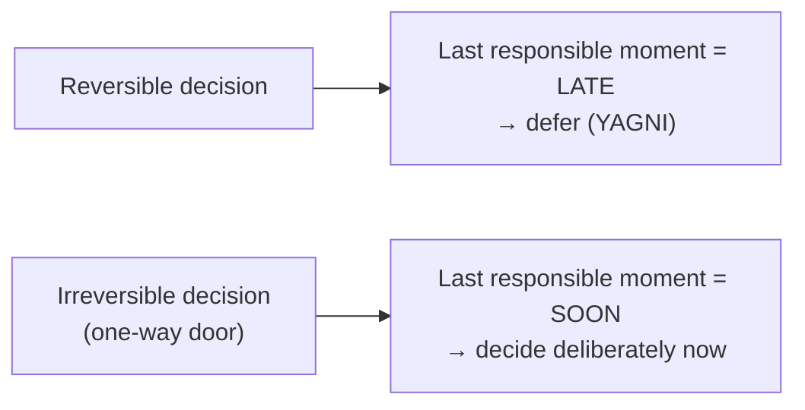
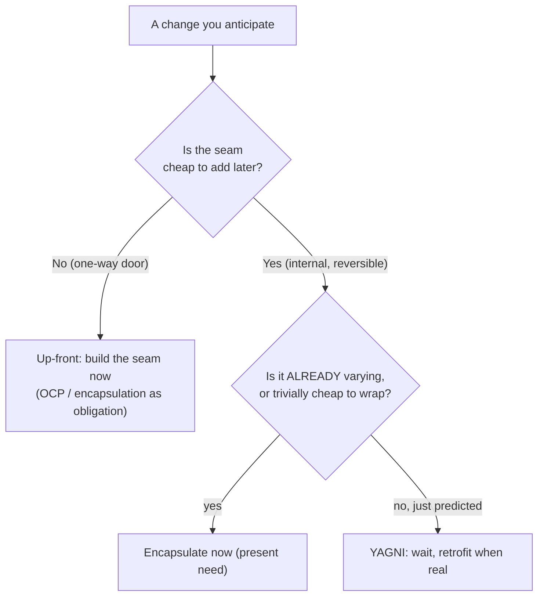
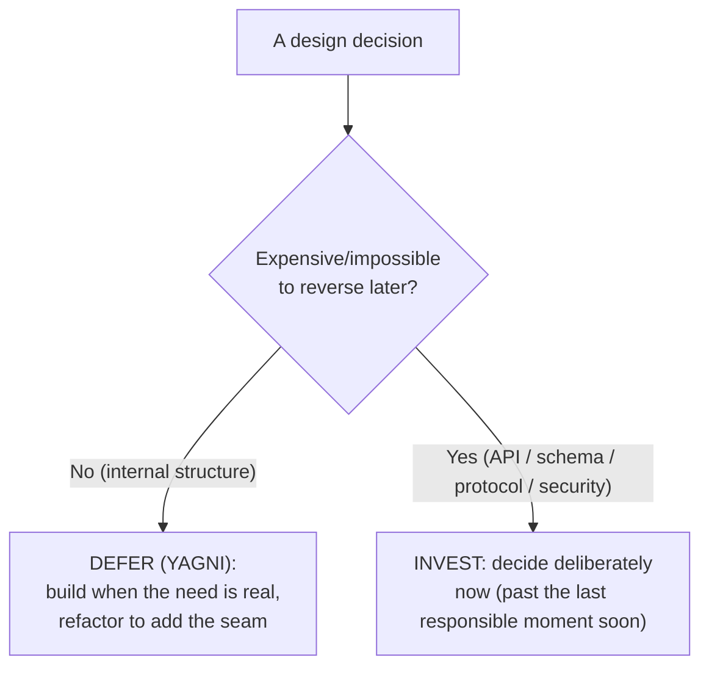
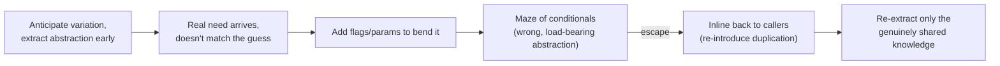

# YAGNI (You Aren't Gonna Need It) — Senior

> **Category:** [Design Principles](../../README.md) — don't build a capability until a real, present requirement demands it.

> **Prerequisites:** [Junior](junior.md) · [Middle](middle.md)
> **Focus:** **Design trade-offs** and **system-level reasoning**

---

## Table of Contents

1. [Introduction](#introduction)
2. [YAGNI as a Stance on Reversibility](#yagni-as-a-stance-on-reversibility)
3. [Architecture vs. Design: Two Different Scales](#architecture-vs-design-two-different-scales)
4. [The Last Responsible Moment](#the-last-responsible-moment)
5. [Reconciling YAGNI with OCP and Encapsulate-What-Changes](#reconciling-yagni-with-ocp-and-encapsulate-what-changes)
6. [The Wrong Abstraction: Why Speculation Is Net-Negative](#the-wrong-abstraction-why-speculation-is-net-negative)
7. [When YAGNI Backfires: A One-Way-Door Failure](#when-yagni-backfires-a-one-way-door-failure)
8. [Code Examples — Advanced](#code-examples-advanced)
9. [Liabilities](#liabilities)
10. [Pros & Cons at the System Level](#pros-cons-at-the-system-level)
11. [Diagrams](#diagrams)
12. [Related Topics](#related-topics)

---

## Introduction

> Focus: **design trade-offs** and **system-level reasoning**

At the senior level YAGNI stops being a coding habit and becomes a **position in an architectural argument**: how much design should be decided up front versus deferred until a requirement forces it. YAGNI is a vote for *deferral* — but applied without judgement it produces under-engineered systems with missing seams, one-way doors slammed shut, and "we'll change it later" promises that were false the moment they were made.

The senior skill is not "apply YAGNI harder." It's knowing **exactly where YAGNI stops applying** and replacing the slogan with a *risk-adjusted* decision rule. This file covers the three hard questions:

1. **Where does deferral (YAGNI) end and up-front investment begin?** (Reversibility is the line.)
2. **When is YAGNI *wrong* — when is the missing seam a real defect?** (One-way doors.)
3. **Why is speculation usually net-negative even when the need materializes?** (The wrong abstraction.)

---

## YAGNI as a Stance on Reversibility

The middle-level reversibility test generalizes into the senior heuristic that governs the entire topic:

> **How expensive is it to change this decision later? Cheap → defer (YAGNI). Expensive → decide deliberately now.**

YAGNI's restraint is **risk-adjusted insurance.** Deferring is cheap insurance when reversal is cheap — you'll simply refactor when the need arrives. Deferring is *dangerous* when reversal is expensive — you'll be stuck. So YAGNI is not an unconditional rule; it is a bet whose payoff depends on the reversibility of the decision it's applied to.

| Decision | Reversibility | YAGNI applies? |
|---|---|---|
| Internal class / module structure | Cheap (a refactor behind tests) | **Yes** — defer aggressively |
| Method signatures within a module | Cheap | **Yes** |
| A second algorithm/strategy inside a module | Cheap (extract a seam later) | **Yes** |
| Public / published API contract | Expensive (clients break) | **No** — design up front |
| Database / storage schema with live data | Expensive (migration) | **No** |
| Wire protocol / message format across services | Expensive (version skew) | **No** |
| Encryption / hashing / key-management choice | Very expensive (re-encrypt, re-key) | **No** |
| Identifiers exposed to users / partners | Expensive (can't recall them) | **No** |

> The dangerous failure is not having *too much* or *too little* design — it is applying the **wrong kind at the wrong scale**: deferring an irreversible decision (paint yourself into a corner) or pre-building a reversible one (speculative generality). YAGNI is the correct rule for the reversible scale and the *wrong* rule for the irreversible one.

---

## Architecture vs. Design: Two Different Scales

A common senior-level confusion is treating YAGNI as a *uniform* rule across all altitudes of decision. It isn't. The principle lands differently at the **design** scale (classes, methods, modules) than at the **architecture** scale (system boundaries, data models, deployment topology), and the difference is exactly reversibility.

| | **Design scale** | **Architecture scale** |
|---|---|---|
| Granularity | Classes, methods, internal modules | Service boundaries, schemas, protocols, data ownership |
| Cost to change later | A refactor, behind tests | A migration, a coordinated multi-team change |
| YAGNI's verdict | **Defer aggressively** — the default | **Defer selectively** — only the reversible parts |
| Failure if misapplied | Speculative generality (over-engineering) | A shut one-way door (under-engineering) |

The synthesis, due largely to Martin Fowler ("Is Design Dead?") and the XP tradition:

> **Let *internal* structure emerge — it's cheap to refactor. Make *boundary* decisions deliberately — they're expensive to migrate.**

A team that applies "fewest elements / YAGNI" to a database schema or a published API is misapplying a design-scale rule to an architecture-scale decision. A team that draws UML for every internal class is misapplying architecture-scale deliberation to reversible design decisions (which produces the speculative generality YAGNI exists to kill). The skill is recognizing *which scale you're at* before reaching for YAGNI — and most one-way doors live at the architecture scale, which is why architectural decisions earn forethought that internal ones do not.

This is why YAGNI coexists peacefully with serious architecture work: they are not competing philosophies, they are the correct rules for *different scales of reversibility*. "Embrace change" (emergent design) governs the reversible interior; "get the foundations right" (deliberate architecture) governs the irreversible boundary.

---

## The Last Responsible Moment

The precise formulation of "when to decide" comes from Lean software development (Mary and Tom Poppendieck): the **last responsible moment** — defer a decision until *not* deciding would itself foreclose important options, then decide.

YAGNI and the last responsible moment are the same idea from two directions:

- **YAGNI** (from the *build* side): don't build the feature until a present requirement needs it.
- **Last responsible moment** (from the *decide* side): don't commit to a design choice until further delay would cost you options.

The two diverge exactly at one-way doors, and this is the senior nuance that beginners miss:

> The last responsible moment for a **reversible** decision is **late** (refactor whenever the need is real — YAGNI's domain). The last responsible moment for an **irreversible** decision can be **now**, because *deferring is itself the expensive choice* — once data is written under a schema or clients consume an API, the door is shut.

So "defer" is not unconditional. You defer **until the cost of deferring exceeds the cost of deciding.** For reversible decisions that crossover is far in the future (YAGNI). For one-way doors it can be immediate — and treating those with YAGNI means you blew past the last responsible moment without noticing.



---

## Reconciling YAGNI with OCP and Encapsulate-What-Changes

Three principles appear to contradict YAGNI; a senior must resolve the contradiction *precisely*, not hand-wave it.

### Open/Closed Principle

[OCP](../../04-solid/02-ocp-open-closed/) says: structure code so new behavior is *added* via extension, not by *modifying* existing code — which implies installing extension points *ahead* of the new behavior. Read naively, that's pre-building seams, the exact thing YAGNI forbids.

The resolution: **OCP describes the *shape* of a design that absorbs a given kind of change; YAGNI + reversibility tell you *when* to introduce that shape.**

- For **reversible** internal code, OCP is **retrofittable** — you add the extension point the day the second variation is real, and refactoring makes it cheap. So YAGNI wins: *don't* pre-install the seam.
- For **one-way doors**, OCP becomes an *up-front* obligation, because you can't retrofit an extension point into a published contract without breaking it. There, anticipation wins.

> "Open for extension" is excellent advice *applied to an axis of change that has materialized, or to a contract you can't change later.* Applied speculatively to a reversible internal class, it manufactures one-implementation interfaces and unused hooks — OCP being used to justify a YAGNI violation.

### Encapsulate What Changes

[Encapsulate What Changes](../../03-module-and-class/01-encapsulate-what-changes/) says: identify the part of the system likely to vary and hide it behind a stable interface — *before* it varies. The honest tension with YAGNI is sharpest here, because this principle is *explicitly* about anticipation.

The resolution turns on **which** you're encapsulating:

- The part that **provably changes often and is cheap to wrap** *as you write* (e.g., a config value, an external date/time source) — encapsulate it; the cost is trivial and the clarity benefit is present-tense.
- A part you **guess** will vary, where wrapping it means a speculative interface — **YAGNI defers it.** "Likely to change" is a *prediction*, and predictions about *shape* are usually wrong. Encapsulate it when the variation is real (cheap) — unless it's a one-way door (then up front).

> "Encapsulate what changes" is right; the trap is encapsulating what you *predict will* change. Encapsulate what *is changing* (or what's irreversible). For everything else, the seam is retrofittable, so YAGNI says wait.



---

## The Wrong Abstraction: Why Speculation Is Net-Negative

The industry instinct is that abstraction is always good. Seniors know the opposite is often true:

> **"Duplication is far cheaper than the wrong abstraction."** — Sandi Metz

This is *why* speculation is net-negative even when the foreseen need eventually arrives. The failure plays out predictably:

1. You anticipate variation and extract a shared abstraction *before* you have concrete cases.
2. The real requirement arrives — and it doesn't match your guessed shape.
3. You add a parameter/flag to bend the abstraction toward the new case.
4. More cases arrive; more flags accrue. The abstraction becomes a maze of conditionals serving callers that no longer have much in common.
5. Now it's *harder* to change than duplication would have been — and it's load-bearing for many callers, so it's *risky* to undo.

```python
# The speculative-abstraction death spiral
def export(records, fmt="csv", header=True, gzip=False,
           dialect=None, redact=(), legacy=False, locale="en"):
    rows = [_redact(r, redact) for r in records] if redact else records
    if fmt == "csv":   out = _to_csv(rows, header, dialect, legacy)
    elif fmt == "json": out = _to_json(rows, locale)   # header/dialect ignored
    else:               raise ValueError(fmt)
    return _gz(out) if gzip else out
# Six callers, none sharing more than ~40% of this logic.
# Every flag was a locally-reasonable patch; the aggregate is unchangeable.
```

Each flag was a reasonable local response to "the abstraction almost fits." The aggregate is a function nobody can change confidently. **The recovery is counterintuitive: re-introduce duplication** — inline the abstraction back into each caller, let each become clear and independent, *then* extract only the parts that are genuinely shared.

This connects straight back to the four costs: speculation's **cost of repair** is not just "undo the build" — it's untangling a *load-bearing wrong abstraction*, which is the single most expensive cleanup in a codebase. YAGNI's deepest justification is that **deferring until you have concrete cases is what lets you build the *right* abstraction the first time**, skipping the death spiral entirely.

---

## When YAGNI Backfires: A One-Way-Door Failure

YAGNI taken too far ignores **known near-term needs** and **one-way-door decisions.** Here is a concrete, realistic failure.

A team builds an order service. To "keep it simple," they inline persistence calls directly throughout the domain code — a defensible YAGNI call *if* storage were reversible:

```python
# "YAGNI" — no repository seam; persistence inlined everywhere
class OrderHandler:
    def place(self, cmd):
        order = Order.create(cmd)
        # raw SQL, table names, column shapes — spread across 200 call sites
        db.execute(
            "INSERT INTO orders(id, user_id, total_cents, status) VALUES (...)",
            order.id, order.user_id, order.total_cents, "PENDING",
        )
        return order
```

For two years this is fine. Then a compliance requirement forces a move from a single Postgres table to an event-sourced, encrypted store. Because storage shape leaked into **200 domain files**, the migration touches all of them, with no seam to localize the change. What should have been a swap behind one interface becomes a multi-month, high-risk rewrite.

The defect was applying YAGNI to a **one-way door.** The persistence boundary is exactly the kind of seam [Encapsulate What Changes](../../03-module-and-class/01-encapsulate-what-changes/) exists for — and the repository seam here is **not** speculation, because:

- A **present** requirement (testability) already justified it, and
- Storage is **irreversible enough** that retrofitting after data leaks everywhere is enormously expensive.

```python
# The seam that was NOT speculation — it answers a present requirement
# (testability) AND guards a one-way door (storage).
class OrderRepository(Protocol):
    def save(self, order: Order) -> None: ...

class OrderHandler:
    def __init__(self, repo: OrderRepository):
        self._repo = repo
    def place(self, cmd):
        order = Order.create(cmd)
        self._repo.save(order)      # storage shape localized behind ONE seam
        return order
```

> **The lesson:** YAGNI applies to reversible decisions. "Fewest elements" was the wrong rule to optimize at the persistence boundary. The repository interface here is the *fewest elements that still survives the foreseeable irreversible change* — which is the correct reading of "simple."

This is the symmetric danger to over-engineering: **under-engineering at a one-way door.** Both are failures of judgement about reversibility, not failures of YAGNI as a principle.

---

## Code Examples — Advanced

### Earning an interface instead of speculating one (Go)

```go
// DON'T (speculative): one-method interface, one implementation, day one.
type PaymentGateway interface{ Charge(amt Money) (Receipt, error) }
type StripeGateway struct{ /* ... */ }
// ...wired through the app, but Stripe is the only gateway that exists.

// DO (deferred): use the concrete type until a 2nd gateway is REAL.
type StripeGateway struct{ /* ... */ }
func (s StripeGateway) Charge(amt Money) (Receipt, error) { /* ... */ }

// When Adyen becomes a real requirement, extract the interface THEN —
// shaped by TWO concrete gateways, so it actually fits both:
type PaymentGateway interface{ Charge(amt Money) (Receipt, error) }
```

Go's structural typing is the perfect illustration of *why YAGNI is safe for reversible seams*: you can introduce the interface **later** without touching `StripeGateway`, because it already satisfies the interface implicitly. The language makes "add it later" nearly free — so there is no payoff for adding it early.

### Re-introducing duplication to escape the wrong abstraction (Python)

```python
# BEFORE — a speculative "DRY" abstraction now serving 3 divergent callers via flags.
def export(records, fmt="csv", header=True, gzip=False, redact=()):
    rows = [_redact(r, redact) for r in records] if redact else records
    out = _to_csv(rows, header) if fmt == "csv" else _to_json(rows)
    return _gz(out) if gzip else out

# AFTER — inline to clear, independent callers; keep only genuinely shared helpers.
def export_audit_csv(records):
    return _to_csv([_redact(r, PII_FIELDS) for r in records], header=True)

def export_api_json(records):
    return _to_json(records)

def export_archive_csv(records):
    return _gz(_to_csv(records, header=False))
# _to_csv / _to_json / _gz remain shared — they ARE shared knowledge.
# The flag-driven megafunction was the WRONG (speculative) abstraction.
```

---

## Liabilities

### Liability 1: "Simple" as a euphemism for "I didn't think"

YAGNI demands *more* ongoing judgement than building-everything-up-front, not less — you must continuously assess reversibility and refactor when needs arrive. Teams that say "we're lean, we defer everything" but never refactor and never audit one-way doors produce a brittle, seam-less mess and blame the principle.

### Liability 2: Missing the one-way door

Applying YAGNI to an irreversible decision (schema, public API, protocol, security) is the costliest mistake in this topic. "We'll change it later" is true for internals and *false* for published contracts and persisted data. Audit every decision for reversibility *before* invoking YAGNI.

### Liability 3: Ignoring a known near-term need

YAGNI is about *speculative* needs, not *scheduled* ones. If a requirement is on next sprint's board and the cheap-to-build-now version is a one-way door, deferring is not YAGNI — it's negligence. YAGNI defers *guesses*, not *commitments*.

### Liability 4: Using YAGNI to win an argument

"YAGNI" is sometimes deployed to shut down any abstraction, including justified ones (test seams, one-way-door boundaries). The principle is a *reversibility-conditioned* rule, not a blanket veto on structure. Counter speculation with the four costs; defend justified seams with the reversibility test.

---

## Pros & Cons at the System Level

| Dimension | Lean YAGNI (defer) | Heavy anticipation (build seams up front) |
|---|---|---|
| Cost of unneeded flexibility | Low — you didn't build it | High — built, tested, carried, often unused |
| Cost when a need *does* arise | A refactor (cheap behind tests) | Zero *if* the shape was guessed right; repair if wrong |
| Adaptability to changing requirements | High — no structure assumes a fixed future | Low — structure encodes a guessed future |
| Risk on irreversible decisions | **High if misapplied** (one-way doors) | Low — deliberate up-front choice |
| Readability of internals | High (no indirection for absent reasons) | Lower (indirection serving nobody yet) |
| Dependence on refactoring discipline | Total — degrades to a brittle mess without it | Lower |
| Best domain | Discovered requirements (most software) | Stable, irreversible, change-costly boundaries |

The table makes the senior stance precise: YAGNI wins on nearly every row **for reversible, internal decisions in domains where requirements are discovered** — which is most software. It **loses** exactly on the irreversible-decision row, which is why seniors carve out deliberate up-front design for one-way doors and defer aggressively everywhere else.

---

## Diagrams

### Reversibility decides defer vs. invest



### The speculation spiral and its escape



---

## Related Topics

- **Siblings:** [KISS](../01-kiss/), [Avoid Premature Optimization](../05-avoid-premature-optimization/).
- **The tension, resolved here:** [Open/Closed Principle](../../04-solid/02-ocp-open-closed/), [Encapsulate What Changes](../../03-module-and-class/01-encapsulate-what-changes/).
- **The practice it lives in:** [Simple Design](../../../craftsmanship-disciplines/04-simple-design/) — "fewest elements" is YAGNI in rule form.

---


---

## Check your understanding

1. Explain YAGNI (You Aren't Gonna Need It) — Senior Level in your own words and name the problem it solves.
2. How would you apply the ideas around Table of Contents, Introduction, YAGNI as a Stance on Reversibility in a realistic engineering change?
3. What failure mode or misuse should you look for, and what evidence would reveal it?
4. How would you validate a system-level decision about YAGNI (You Aren't Gonna Need It) — Senior Level under uncertainty?
5. What observable result would convince you that the approach improved the system?
