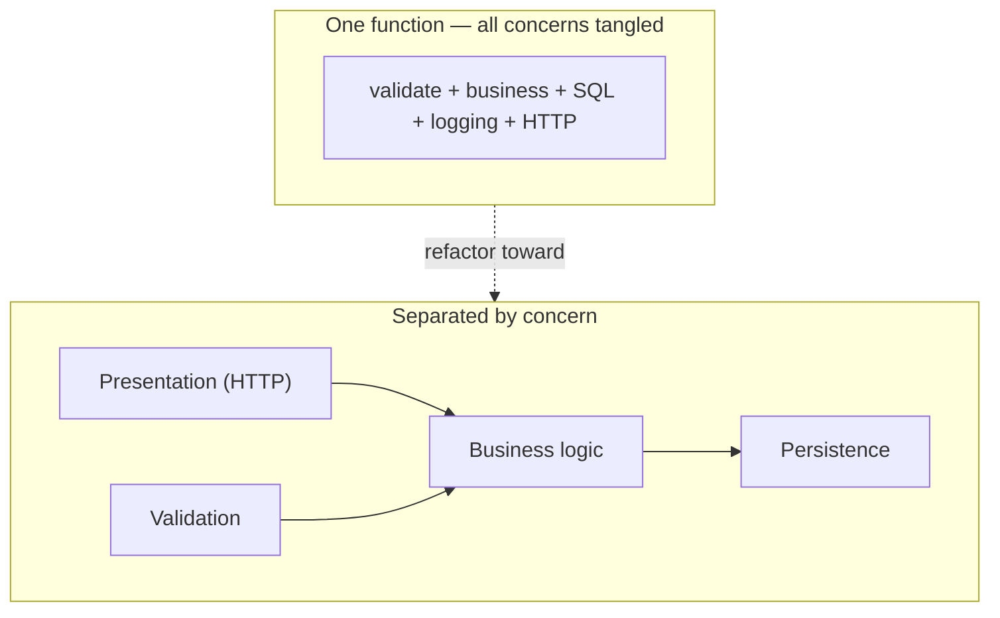

# Separation of Concerns — Junior

> **Category:** [Design Principles](../../README.md) — each section of a system should address one concern, so you can reason about and change it without understanding or breaking the others.

---

## Introduction

> Focus: **What is it?** and **How to use it?**

**Separation of Concerns (SoC)** is the practice of splitting a program so that each part deals with **one distinct aspect of the problem**, and only that aspect. The part that draws the screen does not also talk to the database. The part that calculates a price does not also write log lines. The part that reads a file does not also decide what the data *means*.

> **Separation of Concerns:** organize a system so that each section, module, or layer addresses a single *concern* (a distinct aspect or responsibility), so you can think about and change one concern without having to understand — or risk breaking — the others.

The everyday symptom of *bad* separation is a single function that does five unrelated things at once: it validates input, runs a business calculation, builds an SQL string, writes a log entry, and formats an HTTP response. To change *any* of those five, you must read and re-test *all* of them, because they are braided together. SoC is the discipline that keeps those five things in five places, each understandable on its own.

### Why this matters

You spend far more time **reading and changing** code than writing it the first time. When concerns are tangled, every change is expensive: you can't touch the database code without re-reading the business logic; you can't restyle the output without risking the calculation. When concerns are separated, a change to one concern stays *local* — you open one file, understand it in isolation, change it, and the rest of the system doesn't notice. That locality is the whole payoff: **independent reasoning and localized change.**

---

## Prerequisites

- **Required:** Comfort with **functions/methods and classes** — the units you'll separate concerns *into*.
- **Required:** Basic familiarity with a typical app's pieces: reading input, doing a calculation, saving to storage, returning a result.
- **Helpful:** A first feel for **[KISS](../01-kiss/)** — "keep it simple" — because over-separating violates KISS, which we'll flag throughout.
- **Helpful:** Awareness of **[high cohesion](../../02-coupling-and-cohesion/02-maximise-cohesion/)** — grouping things that belong together — which is SoC's close cousin.

---

## Glossary

| Term | Definition |
|------|-----------|
| **Concern** | A distinct aspect or responsibility of a system — e.g. persistence, presentation, business logic, logging, security, validation. |
| **Separation of Concerns (SoC)** | Organizing code so each part addresses one concern, changeable in isolation. |
| **Tangling** | One module mixing several concerns together (business logic + SQL + logging in one function). |
| **Scattering** | One concern spread across many modules (logging code copy-pasted into every method). |
| **Layer** | A horizontal slice that handles one concern across the whole app: presentation, domain, data. |
| **Cross-cutting concern** | A concern (logging, security, transactions) that *resists* being put in one place and tends to spread everywhere. |
| **Policy vs. mechanism** | *Policy* = the decision (what discount applies); *mechanism* = how it's carried out (how we charge a card). Separating them is classic SoC. |
| **Cohesion** | How strongly the parts *inside* one module belong together; SoC and high cohesion push in the same direction. |

---

## What Is a "Concern"?

A **concern** is any single aspect of "what the software has to deal with." Some concerns are obvious application *roles*:

- **Presentation** — how things look / how the response is shaped (HTML, JSON, a CLI table).
- **Business logic (domain)** — the actual rules: how a discount is computed, whether an order is valid.
- **Persistence** — saving and loading data (SQL, files, an API).

Others are *technical* concerns that show up everywhere:

- **Logging** — recording what happened.
- **Security / authorization** — deciding who's allowed to do this.
- **Validation** — checking that input is well-formed.
- **Transactions / error handling** — making a group of steps succeed or fail together.

The skill is **naming the concerns** in a piece of code. Once you can say "this function is doing *validation* and *business logic* and *persistence* and *logging*," you already see the four boxes it should be split into.

---

## The Principle, Stated Plainly

> **Each section of the program should be responsible for one concern, and you should be able to understand and change that section without having to understand the others.**

Two halves matter equally:

1. **One concern per section** — don't braid logging into the price calculation.
2. **Independent reasoning** — the test of *good* separation is that you can open the persistence code, understand it, and change it **without reading** the business code. If you can't, the concerns are still entangled even if they live in different files.

This is why SoC is more than "put things in separate functions." You can split code into ten functions that still all know about each other's internals — that's separation on paper, not in practice. Real separation means each concern is understandable and changeable **on its own.**

---

## Where the Idea Comes From: Dijkstra, 1974

The phrase was coined by **Edsger W. Dijkstra** in his 1974 essay *"On the role of scientific thought."* He described the way a careful thinker studies one aspect of a problem at a time:

> *"...one studies in depth an aspect of one's subject matter in isolation for the sake of its own consistency, all the time knowing that one is occupying oneself only with one of the aspects... It is what I sometimes have called 'the separation of concerns'... even if not perfectly possible, [it is] yet the only available technique for effective ordering of one's thoughts that I know of."*

Two things are striking about this origin:

- It's about **thinking**, not just code. Separation of concerns is a *technique for ordering your thoughts* — you focus on one aspect, get it right in isolation, then move to the next. Code that's separated this way is just thinking-made-permanent.
- Dijkstra calls it the **"only available technique for effective ordering of one's thoughts."** That's a strong claim: he's saying the human mind cannot reason well about many entangled aspects at once — separating them is *how* we make complex things tractable.

So SoC is not a coding fad. It's the oldest and most fundamental tool we have for managing complexity: **deal with one thing at a time.**

---

## Tangled vs. Separated: A Worked Example

Here is a request handler that does *everything* — the classic junior tangle. Watch how many concerns are crammed into one function.

```python
# TANGLED — five concerns braided into one function
def register_user(request):
    # 1. presentation/parsing
    body = json.loads(request.body)
    email = body.get("email")
    password = body.get("password")

    # 2. validation
    if not email or "@" not in email:
        return Response(400, '{"error": "bad email"}')
    if len(password) < 8:
        return Response(400, '{"error": "weak password"}')

    # 3. business logic
    hashed = bcrypt.hash(password)
    created_at = datetime.utcnow()

    # 4. persistence (raw SQL, inline)
    conn = sqlite3.connect("app.db")
    conn.execute(
        "INSERT INTO users (email, pw, created) VALUES (?, ?, ?)",
        (email, hashed, created_at),
    )
    conn.commit()

    # 5. logging
    print(f"[INFO] registered {email} at {created_at}")

    # back to presentation
    return Response(201, '{"status": "ok"}')
```

This works. So why is it bad?

- To change the **database** (say, move to PostgreSQL), you edit a function full of validation and HTTP and logging — and you must re-test all of it.
- To change the **password rules**, you wade through SQL and HTTP.
- You **can't reuse** the registration logic from a CLI or a background job — it's welded to `request` and `Response`.
- You **can't test** the business rule without a real database and a real HTTP request object.

Now the **separated** version. Each concern gets its own home.

```python
# 1. PRESENTATION — only knows HTTP; delegates the work
def register_user(request):
    body = json.loads(request.body)
    try:
        user = user_service.register(body["email"], body["password"])
        return Response(201, '{"status": "ok"}')
    except ValidationError as e:
        return Response(400, json.dumps({"error": str(e)}))

# 2. VALIDATION — only knows the rules for valid input
def validate_registration(email, password):
    if not email or "@" not in email:
        raise ValidationError("bad email")
    if len(password) < 8:
        raise ValidationError("weak password")

# 3. BUSINESS LOGIC — only knows what "register a user" means
class UserService:
    def __init__(self, users_repo):
        self.users = users_repo

    def register(self, email, password):
        validate_registration(email, password)
        user = User(email=email, password_hash=bcrypt.hash(password))
        self.users.save(user)
        return user

# 4. PERSISTENCE — only knows how to store/load a User
class UserRepository:
    def save(self, user):
        self.conn.execute(
            "INSERT INTO users (email, pw, created) VALUES (?, ?, ?)",
            (user.email, user.password_hash, user.created_at),
        )
        self.conn.commit()
```

(Logging is handled separately — see [cross-cutting concerns](#common-manifestations-you-already-use).)

Now each change is **local**:

| I want to change… | I open… | …and never touch |
|---|---|---|
| The database | `UserRepository` | validation, business logic, HTTP |
| Password strength rules | `validate_registration` | SQL, HTTP, logging |
| The HTTP response shape | `register_user` handler | the rules or the database |
| What "register" *means* | `UserService` | how it's stored or shown |

That table *is* separation of concerns: each row is a concern you can reason about and change alone.

---

## Common Manifestations You Already Use

You've almost certainly met SoC under other names. They're all the same idea applied to different aspects.

| Manifestation | The concerns it separates |
|---|---|
| **Layered architecture** | Presentation ↔ Domain ↔ Data — three horizontal layers, one concern each. |
| **MVC / MVP / MVVM** | Model (data + rules) ↔ View (display) ↔ Controller/Presenter/ViewModel (coordination). |
| **HTML / CSS / JavaScript** | Structure (HTML) ↔ styling (CSS) ↔ behavior (JS). The web's most famous SoC. |
| **Functions** | Each function does one thing — the smallest unit of separation. |
| **Logging via a logger, not `print` everywhere** | Pulls the *logging* concern out of business code. |
| **Middleware / decorators** | Wrap a handler with auth, logging, timing — keeping those concerns *out* of the handler itself. |

The HTML/CSS/JS example is worth dwelling on because you can *feel* the benefit. A designer can restyle a site by editing **only CSS** without understanding the JavaScript; a developer can change behavior in **only JS** without breaking the layout. That independence — change one, the others don't care — is exactly what SoC buys you everywhere.

---

## Horizontal vs. Vertical Separation

There are two directions you can slice a system, and good designs use both.

```text
            VERTICAL (by feature / module)
        Users   |   Orders   |   Payments
      ┌─────────┼────────────┼────────────┐
 P    │  UI     │   UI       │   UI       │  ← HORIZONTAL
 R    ├─────────┼────────────┼────────────┤    (by technical layer)
 E ── │ logic   │  logic     │  logic     │
      ├─────────┼────────────┼────────────┤
 D    │  data   │   data     │   data     │
      └─────────┴────────────┴────────────┘
```

- **Horizontal separation** splits by *technical layer*: presentation, domain, data. All the UI lives together; all the persistence lives together. This is what "layered architecture" means.
- **Vertical separation** splits by *feature*: everything about Users in one place, everything about Orders in another. This is what "modules," "packages," or "feature folders" do.

Neither is "the" right answer — they separate **different** concerns and complement each other. A mature codebase is sliced both ways: vertical modules (Users, Orders), each internally split into horizontal layers (UI, logic, data). As a junior, just notice which direction a codebase favors and put your code where its concern already lives.

---

## Real-World Analogies

| Concept | Analogy |
|---|---|
| **Separation of concerns** | A restaurant: the host seats you, the waiter takes orders, the chef cooks, the dishwasher cleans. Each role does one thing; you can replace the dishwasher without retraining the chef. |
| **Tangling** | One person trying to cook, take orders, and wash dishes at once — slow, error-prone, and impossible to replace. |
| **Layers (horizontal)** | A building's floors: plumbing on one level, electrical on another. An electrician works one system without touching the pipes. |
| **Cross-cutting concern** | The building's *fire-safety* system — it runs through every floor and every room. You can't put it "on one floor." |
| **Policy vs. mechanism** | A thermostat: *policy* = "keep it at 21°C" (the decision); *mechanism* = the furnace turning on (how). You can change the target temperature without rewiring the furnace. |

---

## Mental Models

**The core intuition:** *"One concern, one place — so I can think about it, and change it, without thinking about anything else."*

```text
   TANGLED                          SEPARATED
   ┌──────────────────┐             ┌────────────┐
   │ validate         │             │ validate   │  ← change rules here only
   │ + business logic │             ├────────────┤
   │ + SQL            │   ──────►   │ business   │  ← change meaning here only
   │ + logging        │             ├────────────┤
   │ + HTTP           │             │ persist    │  ← change storage here only
   └──────────────────┘             ├────────────┤
   (change one = touch all)         │ present    │  ← change output here only
                                    └────────────┘
                                    (change one = touch one)
```

A second model: **"Could I explain this part on its own?"** If you can describe a module without mentioning the others ("the repository saves and loads users" — full stop), it's well separated. If your description keeps reaching into other parts ("the handler validates, then computes the discount, then writes SQL, then logs..."), the concerns are tangled.

---

## Benefits

Separating concerns buys you, concretely:

1. **Independent reasoning** — understand one concern at a time, the way Dijkstra intended.
2. **Localized change** — a change to persistence stays in persistence; the blast radius shrinks.
3. **Testability** — you can test the business rule with a fake repository, no database or web server needed.
4. **Reuse** — the same business logic serves a web handler, a CLI, and a background job, because it isn't welded to any of them.
5. **Parallel work** — one person works on the UI layer while another works on the data layer, with minimal collisions.
6. **Replaceability** — swap the database, the UI framework, or the logging library by touching only that concern's home.

These benefits are why SoC underlies almost every other design principle you'll learn — it's the foundation, not a detail.

---

## SoC vs. SRP: A First Look

These two get confused constantly, so pin the difference early:

| | Separation of Concerns | [Single Responsibility Principle](../../04-solid/01-srp-single-responsibility/) |
|---|---|---|
| Scale | The **broad, general** idea — applies to functions, classes, modules, layers, whole systems. | The **class-level**, object-oriented expression of it. |
| Age | Older (Dijkstra, 1974). | Newer (Robert C. Martin, part of SOLID). |
| Statement | "Each part addresses one concern." | "A class should have one reason to change." |

The cleanest way to hold it: **SRP is SoC applied to a single class.** SoC is the principle; SRP is one specific, OO-flavored rule that follows from it. If you understand SoC, SRP is mostly a corollary. (We'll also relate SoC to [high cohesion](../../02-coupling-and-cohesion/02-maximise-cohesion/) — grouping what belongs together — which is the *positive* phrasing of the same goal.)

---

## Best Practices

1. **Name the concerns first.** Before splitting code, say out loud what aspects it touches: "validation, business, persistence, logging." The boxes follow the names.
2. **Keep I/O at the edges.** Push reading/writing (HTTP, DB, files) to the *outside*; keep calculation in the middle, where it's pure and testable.
3. **Delegate, don't inline.** A handler should *call* the business service, not *contain* the business logic.
4. **One reason to open a file.** Aim for "I open the repository only when storage changes" — that's the test of good separation.
5. **Use the patterns that already exist** — layers, MVC, middleware, decorators — rather than inventing your own separation scheme.
6. **Don't over-separate** (see [KISS](../01-kiss/)): a tiny script doesn't need three layers. Match the separation to the size of the problem.

---

## Common Mistakes

1. **The god function/handler.** One function doing validation + business + SQL + logging + HTTP. The canonical SoC failure.
2. **Splitting files but not concerns.** Moving code into ten files that all reach into each other's internals — separation on paper only.
3. **Leaking persistence into the domain.** Business objects full of SQL strings or ORM annotations so that "what an order *is*" can't be understood without the database.
4. **Logging/auth copy-pasted everywhere** (scattering) instead of being pulled into one place (a decorator/middleware).
5. **Over-separating a tiny program.** A 50-line script wrapped in five layers — that violates [KISS](../01-kiss/). SoC is a tool, not a quota.
6. **Confusing SoC with SRP** and arguing about which one applies — they're the same idea at different scales.

---

## Tricky Points

- **Separate *concerns*, not just *files*.** The goal is independent **reasoning**, not a tidy folder tree. Ten files that all know each other are still tangled.
- **Some concerns won't sit still.** Logging, security, and transactions tend to *spread* across every module — these are **cross-cutting concerns**, and they need special tools (decorators, middleware) covered at [Middle](middle.md). Don't be surprised when "just put it in one place" doesn't work for them.
- **More separation isn't always better.** Each new layer adds indirection — another file to open, another hop to follow. There's a real cost, balanced against [KISS](../01-kiss/); the senior skill is finding the right amount, explored at [Senior](senior.md).
- **SoC and DRY can pull apart.** Keeping two concerns separate sometimes means a little repeated structure. That's often the right trade — clarity of separation over forced sharing.

---

## Test Yourself

1. Define "concern" and give three examples of concerns in a typical web app.
2. Who coined "separation of concerns," in what year, and what was his bigger point about *thinking*?
3. List four concerns tangled in the bad `register_user` handler above.
4. What's the *test* of whether two concerns are truly separated (not just in different files)?
5. What's the difference between horizontal and vertical separation?
6. How does SoC relate to SRP?

---

## Cheat Sheet

```text
SEPARATION OF CONCERNS (SoC)
  one concern per section → reason about & change it WITHOUT the others

CONCERN = a distinct aspect:
  roles      presentation · business logic · persistence
  technical  logging · security · validation · transactions

THE TEST OF GOOD SEPARATION
  can I open this part, understand it, and change it WITHOUT reading the rest?

TWO DIRECTIONS
  horizontal  by layer    (presentation / domain / data)
  vertical    by feature  (users / orders / payments)
  good designs use BOTH

YOU ALREADY USE IT
  layers · MVC · HTML/CSS/JS · functions · middleware · decorators

WATCH OUT
  separate CONCERNS, not just files       cross-cutting concerns spread (→ middle)
  don't over-separate (KISS)              SoC vs SRP = same idea, different scale
```

---

## Summary

- **Separation of Concerns** = organize code so each part handles **one distinct aspect**, changeable and understandable **in isolation**.
- A **concern** is any aspect the software deals with: presentation, business logic, persistence, plus technical ones like logging and security.
- The idea is **Dijkstra's (1974)** — *"the only available technique for effective ordering of one's thoughts."* It's about thinking, not just code.
- The **test** of real separation is **independent reasoning**: can you change one concern without reading the others?
- You already use it as **layers, MVC, HTML/CSS/JS, functions, middleware** — and you separate **horizontally** (by layer) and **vertically** (by feature).
- **SRP is SoC applied to one class**; **high cohesion** is its positive phrasing. Don't over-separate — that fights [KISS](../01-kiss/).

---

## Further Reading

- Edsger W. Dijkstra, *On the role of scientific thought* (1974) — the origin of the phrase.
- The [Single Responsibility Principle](../../04-solid/01-srp-single-responsibility/) — SoC at the class level.
- [Maximise Cohesion](../../02-coupling-and-cohesion/02-maximise-cohesion/) — the positive phrasing of "separate concerns."
- [KISS](../01-kiss/) — the principle that bounds *how much* to separate.
- Trygve Reenskaug's original MVC notes — the first famous layered SoC in UI software.

---

## Related Topics

- **Class-level expression:** [SRP](../../04-solid/01-srp-single-responsibility/)
- **Close cousin:** [Maximise Cohesion](../../02-coupling-and-cohesion/02-maximise-cohesion/)
- **Bounds it:** [KISS](../01-kiss/)

---

## Diagrams




---

## Check your understanding

1. Explain Separation of Concerns — Junior Level in your own words and name the problem it solves.
2. How would you apply the ideas around Table of Contents, Introduction, Prerequisites in a realistic engineering change?
3. What failure mode or misuse should you look for, and what evidence would reveal it?
4. What small example would prove that you can apply Separation of Concerns — Junior Level correctly?
5. What observable result would convince you that the approach improved the system?
