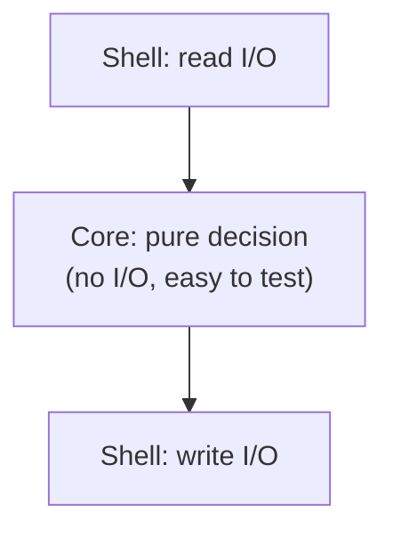

# Separation of Concerns — Middle

> **Category:** [Design Principles](../../README.md) — each section of a system should address one concern, so you can reason about and change it without understanding or breaking the others.

> **Prerequisite:** [Junior](junior.md)
> **Focus:** **Why** and **When**

---

## Introduction

> Focus: **Why** and **When**

At the junior level, SoC is "put each concern in its own place." At the middle level the questions get sharper: **What counts as a concern worth separating? Which concerns refuse to sit in one place, and what do you do about them? And when is separating *not* worth the cost?**

The recurring tension is between two failure modes:

- **Under-separation** — concerns tangled together (the god handler), so every change is expensive and nothing is reusable or testable.
- **Over-separation** — so many layers and indirections that following one request means opening eight files, and "where does X actually happen?" becomes unanswerable.

The middle-level skill is identifying *real* concerns (ones that change for different reasons) and giving each exactly enough separation — no tangling, no needless layers. The single most important new idea at this level is **cross-cutting concerns**: the concerns (logging, security, transactions, caching) that genuinely *resist* clean separation, and the specific tools — decorators, middleware, AOP — built to handle them.

---

## Identifying Concerns: The Axes of Change

The practical test for "is this a separate concern?" is: **does it change for a different reason, on a different schedule, driven by different people?** Two pieces of code belong to *different* concerns when they have different *reasons to change*.

| Aspect | Changes when… | Driven by |
|---|---|---|
| Presentation | the UI/UX or output format changes | designers, frontend, API consumers |
| Business logic | the business rules change | product, domain experts |
| Persistence | the storage tech or schema changes | the database/infra decision |
| Logging | observability needs change | ops/SRE |
| Authorization | the security policy changes | security team |

If validation and persistence change for *different reasons* and at *different times*, gluing them into one function means every persistence change risks the validation and vice versa. Separating them aligns the code's boundaries with the **axes of change** — which is exactly what makes change local. (This "reason to change" framing is also the heart of [SRP](../../04-solid/01-srp-single-responsibility/) and of [high cohesion](../../02-coupling-and-cohesion/02-maximise-cohesion/).)

> The deepest definition of a concern is **an axis along which the system changes independently.** Find those axes, and the boundaries draw themselves.

---

## Layered Architecture, Concretely

The most common SoC structure is the **layered architecture**: presentation, domain (business), and data, stacked so each layer depends only on the one below.

```text
        ┌──────────────────────────────┐
        │  PRESENTATION                 │  HTTP / UI / CLI — shape requests & responses
        ├──────────────────────────────┤
        │  DOMAIN (business logic)      │  the rules — pure, knows nothing of HTTP or SQL
        ├──────────────────────────────┤
        │  DATA (persistence)           │  save/load — SQL, files, external APIs
        └──────────────────────────────┘
            dependencies point DOWN
```

The load-bearing rule is the **dependency direction**: presentation knows about the domain; the domain knows nothing about presentation. The domain is the *valuable, stable* concern (your business rules), so everything depends on it and it depends on nothing. This is the core idea of **Clean Architecture** (Robert C. Martin) and Hexagonal Architecture: the domain sits in the center, with I/O concerns (web, database) pushed to the outer rings, depending *inward*.

```python
# DOMAIN — depends on nothing technical. Pure rules.
class Order:
    def total(self):
        return sum(line.price * line.qty for line in self.lines)

    def apply_discount(self, code):
        if code == "SAVE10":
            self.discount = self.total() * Decimal("0.10")

# DATA — depends on the domain (knows about Order), not vice versa.
class OrderRepository:
    def save(self, order: Order): ...   # SQL lives here, ONLY here

# PRESENTATION — depends on the domain; turns it into HTTP.
def place_order_handler(request):
    order = build_order(request.json)
    order.apply_discount(request.json.get("code"))
    repo.save(order)
    return Response(201, serialize(order))
```

Notice `Order` mentions no HTTP, no SQL, no logging. You can unit-test `total()` and `apply_discount()` with no infrastructure at all — that testability is the payoff of putting the *domain* concern at the center, free of the *I/O* concerns.

---

## Separating I/O from Computation: Functional Core, Imperative Shell

One of the most powerful and underused separations is **computation vs. I/O** — and the cleanest expression of it is **"Functional Core, Imperative Shell"** (Gary Bernhardt).

- The **functional core** is pure: it takes data in, returns data out, performs *no* I/O. It holds the decisions and the hard logic.
- The **imperative shell** is a thin outer layer that does the I/O (read the request, load from DB, call the core, write the result). It holds *no* interesting logic.

The concern being separated is **"deciding what to do" (computation) vs. "actually doing the I/O" (effects).** This separation is gold because the core — where all the complexity lives — becomes trivially testable (pure functions, no mocks) and the shell — where the untestable I/O lives — becomes trivially simple (no logic to test).

```python
# ❌ MIXED — I/O and computation tangled; needs a DB and a mailer to test
def process_refund(order_id):
    order = db.fetch_order(order_id)              # I/O
    if order.status != "PAID":                    # logic
        raise Error("not refundable")
    amount = order.total * Decimal("0.9")         # logic
    db.update(order_id, status="REFUNDED")        # I/O
    mailer.send(order.email, f"Refunded {amount}")# I/O
    return amount
```

```python
# ✅ FUNCTIONAL CORE — pure: data in, a decision out. No I/O. Trivial to test.
def decide_refund(order) -> RefundDecision:
    if order.status != "PAID":
        raise NotRefundable()
    amount = order.total * Decimal("0.9")
    return RefundDecision(amount=amount, email=order.email, new_status="REFUNDED")

# ✅ IMPERATIVE SHELL — all I/O, no logic. Thin and boring on purpose.
def process_refund(order_id):
    order = db.fetch_order(order_id)              # I/O in
    decision = decide_refund(order)               # PURE core
    db.update(order_id, status=decision.new_status)        # I/O out
    mailer.send(decision.email, f"Refunded {decision.amount}")  # I/O out
    return decision.amount
```

Now `decide_refund` is tested with plain objects — no database, no mailer, no mocks. The shell needs almost no testing because it has almost no logic. This is "push I/O to the edges, keep a pure center" — the same shape as Clean Architecture, applied at function scale.

```text
   ┌─────────────────────────────────────┐
   │  SHELL (imperative): read → write    │   ← I/O, effects, thin
   │   ┌───────────────────────────────┐  │
   │   │  CORE (functional): pure logic │  │   ← decisions, easy to test
   │   └───────────────────────────────┘  │
   └─────────────────────────────────────┘
```

---

## Policy vs. Mechanism

A classic SoC distinction, originally from operating-system design: separate **policy** (the *decision* — what should happen) from **mechanism** (the *how* — the machinery that carries it out).

- **Policy:** "premium users get free shipping," "retry up to 3 times," "cache for 60 seconds."
- **Mechanism:** the shipping calculator, the retry loop, the cache store.

Keeping them separate means you can change *what you decide* without rewriting *how it's executed*, and reuse the mechanism with a different policy.

```python
# TANGLED policy + mechanism
def fetch(url):
    for attempt in range(3):              # mechanism (retry loop)
        try:
            return http.get(url)
        except Timeout:
            if attempt == 2: raise        # policy (3 tries) baked in
            time.sleep(2 ** attempt)      # policy (backoff) baked in

# SEPARATED: mechanism takes the policy as a parameter
def with_retry(action, *, max_attempts, backoff):   # MECHANISM (reusable)
    for attempt in range(max_attempts):
        try:
            return action()
        except Timeout:
            if attempt == max_attempts - 1: raise
            time.sleep(backoff(attempt))

# POLICY is now a separate, changeable decision:
fetch = lambda url: with_retry(lambda: http.get(url),
                               max_attempts=3, backoff=lambda a: 2 ** a)
```

Now "retry 3 times with exponential backoff" is a *policy* you can change in one line, and `with_retry` is a *mechanism* you reuse for any flaky action. The concern "what's our retry strategy?" is separated from "how do retries work?"

---

## Cross-Cutting Concerns: Tangling and Scattering

Most concerns can live in one layer. But some concerns refuse: **logging, security/authorization, transactions, caching, metrics, auditing.** These are **cross-cutting concerns** — they "cut across" many modules and layers because *every* operation might need to be logged, secured, cached, or wrapped in a transaction.

When you try to handle a cross-cutting concern by writing it inline everywhere, you get two diseases:

- **Scattering** — the *same* concern's code is sprinkled across many modules. The logging concern appears in every method.
- **Tangling** — a *single* module's code is a braid of multiple concerns. One method contains business logic *and* logging *and* auth *and* transaction handling.

```python
# Cross-cutting concerns SCATTERED and TANGLED into business logic
def transfer(from_acct, to_acct, amount):
    log.info(f"transfer start {from_acct}->{to_acct}")     # logging (cross-cut)
    if not current_user.can("transfer"):                   # security (cross-cut)
        raise Forbidden()
    with db.transaction():                                 # transaction (cross-cut)
        # --- the ONLY business logic in here: ---
        accounts.debit(from_acct, amount)
        accounts.credit(to_acct, amount)
    log.info("transfer done")                              # logging again
    metrics.increment("transfers")                         # metrics (cross-cut)
```

The actual business logic is two lines; the other six are cross-cutting concerns *tangled* into it — and those same six lines are *scattered*, copy-pasted, into every other operation (`withdraw`, `deposit`, `close_account`...). Change the logging format and you edit a hundred methods. This is precisely the problem cross-cutting concerns pose: they can't be cleanly placed in *one* layer, so naive SoC fails on them.

```text
        transfer   withdraw   deposit   close
logging    ▓          ▓          ▓        ▓     ← one concern, scattered across all
security   ▓          ▓          ▓        ▓     ← another, scattered
tx         ▓          ▓          ▓        ▓
           └──────────┴──────────┴────────┘
   each method is also TANGLED (business + 3 cross-cuts braided together)
```

---

## Addressing Cross-Cutting Concerns: Decorators, Middleware, AOP

The fix is to **factor the cross-cutting concern out into a wrapper** that's applied *around* the business code without polluting it. Three flavors of the same idea:

### Decorators (function/method wrapping)

A decorator wraps the core action with the cross-cutting concern, keeping the action pure of it:

```python
# Each cross-cutting concern is its own wrapper, written ONCE.
def logged(fn):
    def wrapper(*a, **k):
        log.info(f"{fn.__name__} start")
        result = fn(*a, **k)
        log.info(f"{fn.__name__} done")
        return result
    return wrapper

def requires(permission):
    def deco(fn):
        def wrapper(*a, **k):
            if not current_user.can(permission): raise Forbidden()
            return fn(*a, **k)
        return wrapper
    return deco

def transactional(fn):
    def wrapper(*a, **k):
        with db.transaction():
            return fn(*a, **k)
    return wrapper

# The business logic is now CLEAN — concerns applied from the outside:
@logged
@requires("transfer")
@transactional
def transfer(from_acct, to_acct, amount):
    accounts.debit(from_acct, amount)      # ← only business logic remains
    accounts.credit(to_acct, amount)
```

`transfer` now contains *only* its concern. Logging, auth, and transactions are each defined **once** and *woven in* declaratively. Change the log format in one place; it applies everywhere.

### Middleware (request-pipeline wrapping)

In web frameworks, **middleware** is the same idea for the whole request. Each cross-cutting concern is a stage the request passes through before and after the handler:

```text
request ─► [auth] ─► [logging] ─► [rate-limit] ─► [HANDLER] ─► response
                  (each middleware = one cross-cutting concern, applied to ALL routes)
```

```python
# Express-style middleware (TypeScript) — each is one concern, applied app-wide
app.use(authMiddleware);     // security concern, once
app.use(loggingMiddleware);  // logging concern, once
app.use(rateLimitMiddleware);// throttling concern, once
app.post("/transfer", transferHandler);  // handler stays free of all three
```

### AOP (Aspect-Oriented Programming)

**Aspect-Oriented Programming** generalizes this: an **aspect** is a module that bundles a cross-cutting concern, declaring *where* it applies (a "pointcut" — e.g. "all methods in the service layer") and *what* it does ("advice" — e.g. "log entry and exit"). Spring AOP and AspectJ implement this on the JVM:

```java
@Aspect
public class LoggingAspect {
    @Around("execution(* com.app.service..*(..))")  // pointcut: all service methods
    public Object logAround(ProceedingJoinPoint pjp) throws Throwable {
        log.info("{} start", pjp.getSignature());    // advice (before)
        Object result = pjp.proceed();
        log.info("{} done", pjp.getSignature());      // advice (after)
        return result;
    }
}
```

The service methods contain **zero** logging code; the aspect weaves it in across all of them. That's the purest expression of separating a cross-cutting concern: the concern lives entirely in one aspect, and the business code never mentions it.

> The unifying idea behind decorators, middleware, and AOP: a cross-cutting concern can't go in a *layer*, so put it in a *wrapper* applied *around* many units — defined once, woven in everywhere. This keeps the business code [orthogonal](../../02-coupling-and-cohesion/06-orthogonality/) to logging, security, and transactions.

---

## SoC, Cohesion, and Coupling

SoC is the *goal*; **high cohesion** and **low coupling** are how you measure whether you achieved it.

- **[High cohesion](../../02-coupling-and-cohesion/02-maximise-cohesion/)** — within a module, everything serves *one* concern. A cohesive `OrderRepository` does only persistence. Separating concerns *produces* cohesive modules; cohesion is SoC seen from inside one module.
- **Low coupling** — between modules, few and narrow connections. When concerns are separated, the domain doesn't depend on SQL or HTTP, so a change to one doesn't ripple to the others. SoC *causes* low coupling.
- **[Orthogonality](../../02-coupling-and-cohesion/06-orthogonality/)** — separated concerns are *orthogonal*: changing logging has no effect on business logic. Cross-cutting tools (decorators, middleware, AOP) exist precisely to restore orthogonality that naive coding destroys.

```text
  Separate concerns  ──►  high cohesion (one concern per module)
                     ──►  low coupling  (modules don't reach into each other)
                     ──►  orthogonality (change one, others unaffected)
```

So SoC isn't a separate principle competing with cohesion and coupling — it's the *intent*, and they're the *evidence*.

---

## When to Separate — and When Not To

Separation has a cost (indirection, more files, more hops), so it's a judgement call, not a reflex.

**Separate when:**

- Two aspects change for **different reasons** / on different schedules.
- One aspect needs **independent testing** (the pure core vs. the I/O shell).
- A concern is **cross-cutting** (logging, auth) — factor it into a wrapper.
- A concern is **reused** by multiple callers (a CLI *and* a web handler need the same business logic).
- Different **people/teams** own different aspects.

**Don't separate (yet) when:**

- The "two concerns" actually always change **together** — splitting them just adds hops.
- The program is **small** and the separation adds more indirection than it saves ([KISS](../01-kiss/)).
- You'd create an **anemic pass-through layer** that only forwards calls without adding value.
- You're separating to satisfy a pattern, not a real axis of change (speculative separation).

> The rule of thumb: **separate concerns that change independently; keep together concerns that change together.** That's cohesion, restated.

---

## Trade-offs

| Decision | Lean toward separating | Lean toward keeping together |
|---|---|---|
| Cost now | More files, more indirection | Less ceremony, fewer hops |
| Testability | High (test concerns in isolation) | Lower (must set up everything at once) |
| Reuse | High (a free-standing concern is reusable) | Low (welded to its context) |
| Locality of behavior | Lower — logic is spread out, must jump files | High — read one place top to bottom |
| Change cost | Low *if* concerns change independently | Low *if* they always change together |
| Best when | Different axes of change, cross-cutting, reuse | Small scope, concerns truly co-vary |

The honest tension is **separation vs. locality of behavior**: separated code is easier to *change* but can be harder to *read end-to-end*, because following one feature means hopping across layers. Over-separation turns "read this function" into "open eight files." The art is separating along *real* axes of change so each hop earns its keep.

---

## Edge Cases

### 1. The concern that's "almost" cross-cutting

Some concerns *seem* cross-cutting but aren't — e.g. "formatting currency" appears in many places but is just a shared *function*, not an aspect. Reach for a plain helper before reaching for AOP. AOP/middleware is for concerns that wrap *behavior* (before/after/around), not for shared *values* or *formatting*.

### 2. Leaky separation

A repository that returns ORM entities with lazy-loaded SQL relationships *leaks* the persistence concern into the domain — the domain now triggers SQL when you touch a field. The separation exists on paper but the concern bled through. True separation needs the boundary to be *clean* (return plain domain objects), not just *present*.

### 3. Over-eager middleware

Putting business decisions ("premium users skip this step") into middleware tangles a *business* concern into the *infrastructure* layer. Middleware is for genuinely cross-cutting *technical* concerns (auth, logging, compression) — not for business rules, which belong in the domain.

---

## Tricky Points

- **Cross-cutting concerns are the exception that proves the rule.** Plain SoC says "one concern, one place." Logging/security/transactions can't live in one *place*, so they live in one *aspect* applied many places. The concern is still centralized — just in a wrapper, not a layer.
- **Decorators/middleware/AOP are the same pattern at different scales** — function, request, and method-set respectively. If you understand one, you understand all three.
- **Separation can reduce locality of behavior.** Don't pretend it's free: the cost is the reader hopping between files. Separate only along axes that genuinely change independently.
- **"Functional core, imperative shell" is SoC for *effects*.** The concern separated is purity vs. I/O — and it's what makes a core testable without mocks.
- **SoC and DRY sometimes conflict.** Forcing two separated concerns to share code (DRY) can re-tangle them. When sharing re-couples independent concerns, keep them apart — separation wins.

---

## Best Practices

1. **Find the axes of change.** Two aspects that change for different reasons are different concerns; separate along those lines.
2. **Push I/O to the edges, keep a pure core** (functional core / imperative shell) so the logic is testable without infrastructure.
3. **Point dependencies at the domain.** The valuable business concern depends on nothing; HTTP and SQL depend on *it* (Clean Architecture direction).
4. **Factor cross-cutting concerns into wrappers** — decorators, middleware, or aspects — defined once, applied everywhere. Never copy-paste logging/auth into every method.
5. **Separate policy from mechanism** — pass the decision in as a parameter so the machinery is reusable.
6. **Don't separate concerns that always change together** ([KISS](../01-kiss/)); avoid anemic pass-through layers.
7. **Check the boundary is clean,** not leaky — return plain domain objects, not ORM entities that drag SQL into the domain.

---

## Test Yourself

1. What's the practical test for "is this a separate concern?"
2. What is a cross-cutting concern? Give three examples and say why they resist plain layering.
3. Explain "functional core, imperative shell" and what concern it separates.
4. How do decorators, middleware, and AOP each address cross-cutting concerns, and how are they the same idea?
5. What's the difference between *tangling* and *scattering*?
6. When should you *not* separate two pieces of code into different concerns?

---

## Summary

- A **concern worth separating** is an **axis along which the system changes independently** — different reason, schedule, owner.
- **Layered architecture** points dependencies at the **domain**, keeping business logic free of HTTP and SQL (the Clean Architecture direction).
- **Functional core, imperative shell** separates **computation from I/O** — a pure, testable center inside a thin effectful shell.
- **Policy vs. mechanism** separates the *decision* from the *machinery*, so each changes independently.
- **Cross-cutting concerns** (logging, security, transactions) resist plain layering, causing **tangling** and **scattering**; **decorators, middleware, and AOP** factor them into wrappers applied once and woven everywhere.
- SoC *produces* **high cohesion, low coupling, and orthogonality** — those are the evidence that you separated well. Don't over-separate; that fights [KISS](../01-kiss/) and locality of behavior.

---

## Diagrams

### Cross-cutting concerns woven by wrappers


### Functional core / imperative shell




---

## Check your understanding

1. Explain Separation of Concerns — Middle Level in your own words and name the problem it solves.
2. How would you apply the ideas around Table of Contents, Introduction, Identifying Concerns: The Axes of Change in a realistic engineering change?
3. What failure mode or misuse should you look for, and what evidence would reveal it?
4. Which local design trade-off would make you choose or reject Separation of Concerns — Middle Level in an existing codebase?
5. What observable result would convince you that the approach improved the system?
