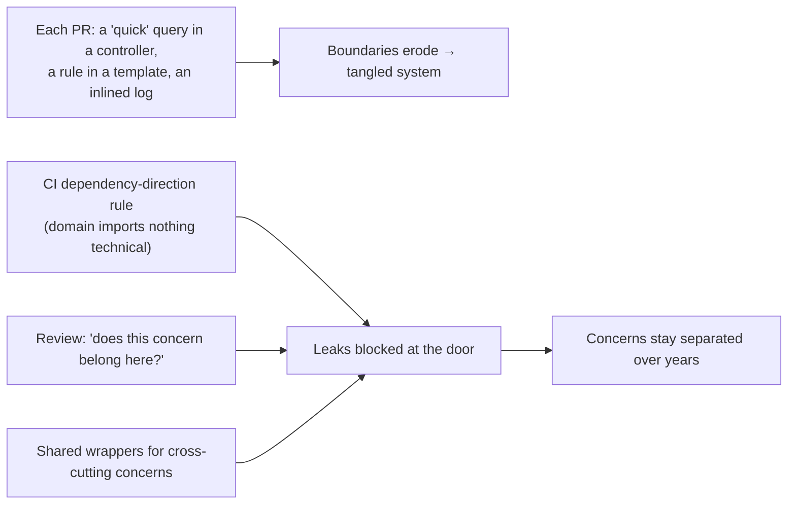
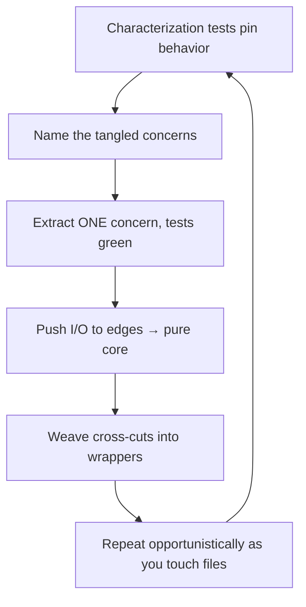

# Separation of Concerns — Professional

> **Category:** [Design Principles](../../README.md) — each section of a system should address one concern, so you can reason about and change it without understanding or breaking the others.

> **Prerequisites:** [Junior](junior.md) · [Middle](middle.md) · [Senior](senior.md)
> **Focus:** **Production** — reviews, metrics, team conventions, legacy systems

---

## Introduction

> Focus: **production** — keeping concerns separated across a large, multi-contributor codebase over years.

Separation of concerns is easy to agree with and hard to *sustain*. Boundaries erode one reasonable-looking commit at a time: a quick SQL query added to a controller "just for this hotfix," a business rule slipped into a template because it was faster, a log line inlined instead of factored out. No single violation is unreasonable; the aggregate is a system where the domain knows about HTTP, the templates run queries, and every change touches everything.

At the professional level the question is operational: **how do you keep concerns separated when hundreds of changes land per week from dozens of people with different instincts — and how do you claw separation back into a codebase that's already a tangle?** The answer is a system: review standards that catch boundary violations, metrics that make tangling visible, conventions that make the separated path the default, and a disciplined, test-guarded approach to untangling legacy code without breaking it.

---

## Enforcing Separation in Code Review

Code review is where boundaries are held or lost, because most tangling enters one PR at a time. The reviewer's job is to catch concerns leaking across boundaries — and to push back on *false* separation (anemic layers) as hard as on tangling.

### What to look for, by direction

**Concerns leaking IN (tangling):**

- SQL / ORM queries inside a **controller** or **template** → persistence leaking into presentation.
- Business rules inside a **repository** or **migration** → domain logic leaking into data.
- HTTP status codes, request objects, or JSON shapes inside a **domain** class → presentation leaking into the core.
- `log.info` / metrics / auth checks inlined in business methods → cross-cutting concerns scattered instead of woven.

**Concerns split badly (over-separation):**

- A **service** whose every method just forwards to the repository → anemic pass-through; collapse it.
- A new layer/interface with **one implementation and one caller**, "for separation" → speculative; ask what real axis of change demands it.

### The two highest-value review questions

> **"Does this concern belong in this layer?"** — asked of every query in a controller, every rule in a repository, every HTTP detail in the domain.

> **"What does this layer *decide* that the ones around it don't?"** — asked of every layer that looks like a pass-through. If you can't name its concern, it's ceremony.

### Review comment templates

> "This handler runs a raw SQL query — that's the persistence concern leaking into presentation. Move it behind the repository so we can change the DB without touching the HTTP layer."

> "`OrderService.get()` just calls `repo.get()` with no added behavior. This service layer is anemic here — either it has a real concern (validation? authorization?) or we should let the controller call the repository directly."

> "There's a `log.info` and an auth check inlined in `transfer()`. Those are cross-cutting concerns — let's apply them via the existing decorator/middleware so the business method stays clean and the logging format stays consistent."

> "This `User` domain object imports `HttpResponse`. The domain shouldn't know about HTTP — that coupling means a presentation change can break business logic. Keep the response shaping in the controller."

---

## Measuring Separation (and Its Absence)

You can't manage what you can't see, and most separation failures are invisible to naive metrics. Choose measurements that actually track whether concerns are independent — and refuse to be fooled by ones that don't.

| Metric / signal | Tracks separation? | Notes |
|---|---|---|
| **Change-coupling** (files that change together in git history) | **Yes — the best signal** | Files that *always* change together are probably one concern split badly, or two concerns tangled. The ground truth of "do these change independently?" |
| **Dependency direction checks** (ArchUnit, import-linter, deptrac) | **Yes** | Assert "domain must not import web/SQL packages" in CI — catches leakage automatically. |
| **Afferent/efferent coupling, instability** | **Yes** | A "domain" package that depends on the web/DB packages is mis-separated. |
| **Cohesion (LCOM)** | Partially | Low cohesion in a class signals multiple concerns crammed in (tangling). |
| **Cyclomatic / cognitive complexity** | Indirectly | A god method's high complexity often signals tangled concerns; not specific to SoC. |
| **Lines/responsibilities per class** | Weakly | A 2,000-line "Manager" is a tangling smell, but size alone isn't proof. |
| **Lead time / change-failure rate** (DORA) | **Yes (outcome)** | The ground truth: well-separated code is changed quickly and safely. If a small change touches many layers/files, separation is poor. |

### The honest-measurement rules

- **Enforce dependency direction in CI**, not in code review alone. A rule like *"`domain` package may not import `infrastructure`"* (ArchUnit / import-linter / deptrac) catches the most common leak — persistence/HTTP bleeding into the domain — automatically, on every PR. This is the single highest-leverage automated control for SoC.
- **Use change-coupling to find mis-separation.** Files that change together in history reveal both *tangled* concerns (one file, many reasons to change) and *falsely-separated* ones (two files that always change together = one concern split needlessly). Static structure can't see this; history can.
- **Watch "files touched per feature" as a trend.** If a typical feature now touches twice the files/layers it did a year ago, you're likely over-separating (anemic layers) — the change is being smeared across ceremony.
- **The real metric is the outcome:** can the team change one concern quickly and safely? If a one-line business-rule change requires editing a controller, a service, a repository, a mapper, and a DTO, your separation is wrong — too much or along the wrong axis — regardless of how clean the folder tree looks.

> Don't claim "good separation" from a tidy folder structure. Prove it with dependency-direction tests (green in CI) and change-coupling (concerns actually change independently). Folders are a hypothesis; the metrics are the evidence.

---

## Team Conventions for Separation of Concerns

Codify these so the separated path is the default, not a per-PR debate:

1. **Dependency-direction rule, enforced in CI.** Written down ("the domain depends on nothing technical; web and data depend on the domain") *and* checked by ArchUnit / import-linter / deptrac so it can't silently rot.
2. **No SQL/ORM in controllers or templates; no HTTP in the domain.** A flat, enforceable rule that prevents the two most common leaks.
3. **Cross-cutting concerns go through shared infrastructure** — one logging decorator/middleware, one auth filter, one transaction boundary. Inlining logging/auth/metrics in a handler is a review-blocker.
4. **No anemic pass-through layers.** A layer must have a nameable concern (it *decides* something) or it doesn't exist. New layers/interfaces need a present axis-of-change justification, not "for separation."
5. **Choose and document the dominant axis.** State whether the codebase is layer-dominant or feature/module-dominant (modular monolith, services) so people put new code where its concern already lives.
6. **Keep boundaries clean, not leaky.** Repositories return plain domain objects, not ORM entities with lazy SQL; the domain carries no framework annotations that drag infrastructure in.
7. **Reward un-tangling.** Celebrate PRs that pull a concern out of a god class — net structural improvement, not just net features.

These conventions encode the senior reasoning so juniors get it right by default and reviewers cite a policy, not a personal preference.

---

## Untangling a Legacy God Class

The professional reality isn't greenfield layering — it's a 3,000-line `OrderManager` that validates, calculates, queries the DB, calls payment APIs, sends email, and logs, all in one class. Untangling it is incremental, test-guarded, and opportunistic — never a rewrite.

### The sequence

1. **Characterize behavior first.** You can't separate safely without tests pinning current behavior (bugs included). Wrap the god class's public methods in characterization tests so refactoring can't silently change behavior. (See [Refactoring as a Discipline](../../../craftsmanship-disciplines/03-refactoring-as-a-discipline/junior.md) and *Working Effectively with Legacy Code*.)
2. **Name the concerns inside.** Read the god method and label the blocks: *validation, business rule, persistence, payment I/O, notification, logging.* The labels are the seams.
3. **Extract one concern at a time, smallest/safest first.** Pull the persistence calls into a repository; the notifications into a notifier; the logging into a decorator. After each extraction, run the characterization tests. Small commits.
4. **Push I/O to the edges, leave a pure core.** Aim for a functional core (the decisions) and a thin shell (the I/O) — the most valuable single separation, and the one that makes the core finally unit-testable.
5. **Recover cross-cutting concerns into wrappers.** The scattered `log.info` / auth / transaction lines become a decorator or middleware applied around the now-clean methods.

```text
   OrderManager (god class)          →   extract one concern at a time
   ┌────────────────────────┐            ┌──────────────┐  ┌────────────┐
   │ validate               │            │ Validator    │  │ Repository │
   │ + price calc           │   ─────►   ├──────────────┤  ├────────────┤
   │ + SQL                  │   (tests   │ PricingCore  │  │ Notifier   │
   │ + payment API          │    green   │ (pure)       │  ├────────────┤
   │ + email                │    each    └──────────────┘  │ @logged    │
   │ + logging              │    step)     thin shell        decorator   │
   └────────────────────────┘            orchestrates them
```

### What *not* to do

- **Don't untangle without characterization tests.** A "harmless" extraction that flips a subtle ordering (validation now runs after persistence) is the classic legacy-refactor incident.
- **Don't big-bang rewrite the god class.** Strangle it: build the separated pieces alongside, route callers to them incrementally, delete the old class last.
- **Don't replace one tangle with over-separation.** Extracting `OrderManager` into eight anemic pass-through layers isn't progress. Extract along *real* concerns (axes of change), and stop.
- **Don't schedule a standalone "separation initiative."** It's all risk and no feature value; it dies at the first deadline. Untangle *as you touch the code* for feature work (Boy Scout Rule).

---

## Managing Cross-Cutting Concerns at Scale

Cross-cutting concerns are where SoC most often fails *at scale*, because each is needed in hundreds of places. Professional management:

| Concern | The wrong way (scattered) | The right way (one place) |
|---|---|---|
| **Logging** | `log.info` inlined in every method | One logging decorator/middleware/aspect; structured logging config in one place |
| **Authorization** | `if not user.can(...)` copy-pasted | Auth middleware / policy layer / `@requires` decorator |
| **Transactions** | `with db.transaction()` in every service method | A `@transactional` boundary or a unit-of-work applied at the service edge |
| **Caching** | `cache.get / cache.set` sprinkled in business code | A caching decorator keyed by method + args |
| **Metrics / tracing** | `metrics.increment` everywhere | Instrumentation via middleware / an APM agent (often zero-code) |
| **Retries / circuit-breaking** | retry loops inline | A resilience decorator/proxy around the external call |

The professional guardrails (from the [Senior](senior.md) AOP trade-off):

- **Weave the truly pervasive, business-uninteresting concerns** (logging, metrics, tracing, transactions) so business code stays clean.
- **Keep business-meaningful behavior visible** at the call site. If a reader must know it to understand the operation (a *business* authorization rule, say), don't bury it in an aspect — name it where it applies (an explicit decorator or an in-domain policy object) so it's not action-at-a-distance.
- **Watch aspect/middleware ordering** — auth-before-vs-after-transaction is a correctness question; pin it with tests, since it's invisible in the business code.
- **Prefer explicit, listed application** (decorators on the method, middleware in a registered chain) over fully-implicit pointcut matching when the concern's *presence* matters to the reader — it's a readable compromise between tangling and invisible weaving.

---

## Real Incidents

### Incident 1: SQL in the controller, then a 200-file migration

A team let "quick" SQL queries accumulate directly in HTTP controllers — defensible once, fatal at scale. When a compliance requirement forced a database engine change, the persistence concern was entangled across 200 controllers; the "swap the DB" task became a multi-month, all-hands migration. **Fix:** the queries were pulled behind repositories incrementally; a CI dependency rule (`controllers` may not import `db`) was added to stop regression. **Lesson:** persistence leaking into presentation is cheap per-commit and catastrophic in aggregate — enforce the boundary in CI, not just in review.

### Incident 2: Business logic in the email template

A discount rule ("VIPs get 15% off") was implemented *inside* the email template because it was the fastest place to put it. Months later the same rule was implemented *again*, differently, in the checkout service — and the two diverged. Customers were charged one number and emailed another. **Fix:** the rule was moved to the domain (`Order.discount()`), and the template was reduced to *displaying* a value the domain computed. **Lesson:** business logic scattered into the presentation concern duplicates and diverges. The domain decides; the presentation only shows.

### Incident 3: Over-separation no one could trace

A CRUD service was built as controller → service → facade → repository → mapper → DAO for every entity — six hops to read one row, every layer an anemic pass-through. A new hire took two days to trace where a field was actually persisted; trivial changes touched five files. **Fix:** the facade, mapper, and DAO were collapsed; controller → service → repository remained, each with a real concern. Files-per-change dropped by half. **Lesson:** separation past real axes of change is pure cost — anemic layers destroy traceability without buying independence.

### Incident 4: The aspect that silently swallowed errors

A logging aspect woven across the service layer caught exceptions to log them — and, due to a bug, swallowed some instead of rethrowing. Because the behavior was *woven* (invisible at the call site), it took weeks to find: the business code looked correct, and nothing local hinted that an aspect was eating errors. **Fix:** the aspect was corrected to rethrow, and a test asserted exception propagation; a rule limited woven aspects to logging/metrics, never error-handling control flow. **Lesson:** the implicitness that makes AOP powerful makes its bugs invisible. Reserve weaving for concerns that don't alter business control flow.

---

## The Politics of Boundaries

Sustaining separation is partly a social problem:

- **Leaking a concern is the fast path under deadline.** "I'll just put the query here for now" always saves five minutes today and costs days later. Make the boundary cheap to respect (good repository/middleware infrastructure) and expensive to violate (CI dependency rules), so the fast path is also the correct one.
- **Over-separation *looks* professional.** Six layers signal "serious architecture" even when they're anemic. Professionals must teach that an un-needed layer is a *defect*, and that collapsing one is a senior move — not under-engineering.
- **Boundaries cross team lines.** A feature/module-dominant decomposition is also an *ownership* decomposition. When the boundary is wrong, the symptom is teams constantly blocking each other. Conway's Law cuts both ways: align module boundaries with team boundaries, or the separation will fight the org chart.
- **Senior engineers set the example.** If the staff engineer inlines SQL in a handler "just this once," everyone does. Model clean boundaries, and explain *why* the query belongs in the repository.

---

## Review Checklist

```text
SEPARATION-OF-CONCERNS REVIEW CHECKLIST
[ ] LEAK-IN — no SQL/ORM in controllers or templates
[ ] LEAK-IN — no business rules in repositories/migrations/templates
[ ] LEAK-IN — no HTTP/JSON/request objects inside domain classes
[ ] CROSS-CUT — logging/auth/metrics/tx applied via shared wrapper, not inlined
[ ] DEPENDENCY DIRECTION — domain imports nothing technical (checked in CI)
[ ] NO ANEMIC LAYER — every layer DECIDES something; no pure pass-throughs
[ ] CLEAN BOUNDARY — repos return domain objects, not lazy ORM entities
[ ] RIGHT AXIS — new code lives where its concern already lives (layer/module)
[ ] VISIBILITY — business-meaningful behavior is NOT hidden in a woven aspect
[ ] TRACEABILITY — I can answer "where does X actually happen?" quickly
```

---

## Cheat Sheet

```text
ENFORCE          two questions: "does this concern belong in this layer?"
                 and "what does this layer DECIDE that its neighbors don't?"

LEAKS TO CATCH   SQL in controllers · rules in templates/repos · HTTP in domain
                 · logging/auth/tx inlined (cross-cuts must be woven, not scattered)

MEASURE          dependency-direction tests in CI (ArchUnit/import-linter/deptrac)
                 + change-coupling (files that change together) + DORA outcomes.
                 NOT a tidy folder tree alone.

CROSS-CUTTING    log/metrics/tx/cache → one wrapper (decorator/middleware/aspect).
                 Keep BUSINESS-meaningful behavior visible (no spooky weaving).

LEGACY GOD CLASS characterization tests FIRST → name the concerns → extract one
                 at a time (tests green each step) → pure core + thin shell →
                 strangle, never big-bang. Don't replace tangle with over-separation.

OVER-SEPARATION  anemic pass-through layers are a DEFECT. Collapse them.
                 A layer with no nameable concern is ceremony.
```

---

## Diagrams

### Where boundaries erode, and where they're held



### Safe legacy untangling



---

## Related Topics

- **Class-level expression:** [SRP](../../04-solid/01-srp-single-responsibility/)
- **Measurement view:** [Maximise Cohesion](../../02-coupling-and-cohesion/02-maximise-cohesion/)
- **System-level effect:** [Orthogonality](../../02-coupling-and-cohesion/06-orthogonality/)
- **Bounds over-separation:** [KISS](../01-kiss/)
- **Tooling:** ArchUnit (Java), import-linter (Python), deptrac (PHP), change-coupling analysis from git history.

---


---

## Check your understanding

1. Explain Separation of Concerns — Professional Level in your own words and name the problem it solves.
2. How would you apply the ideas around Table of Contents, Introduction, Enforcing Separation in Code Review in a realistic engineering change?
3. What failure mode or misuse should you look for, and what evidence would reveal it?
4. How would you introduce and govern Separation of Concerns — Professional Level across teams through reversible, measurable increments?
5. What observable result would convince you that the approach improved the system?
