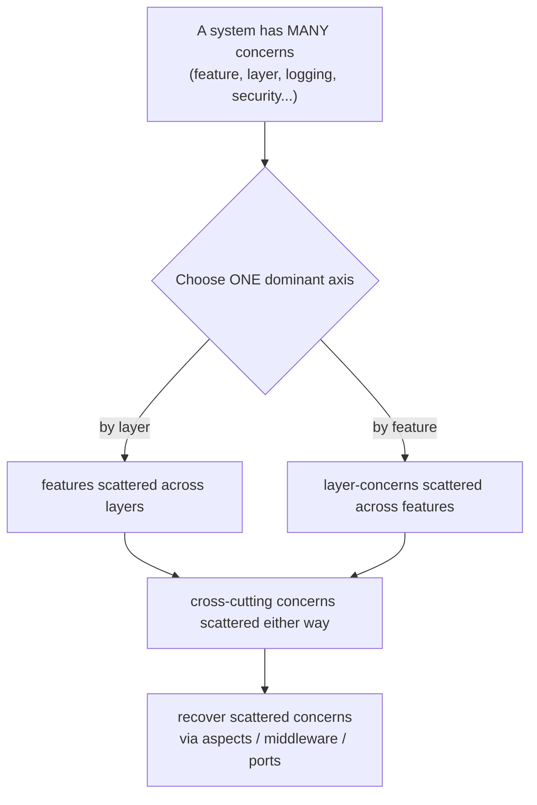
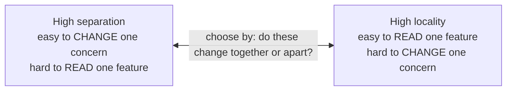

# Separation of Concerns — Senior

> **Category:** [Design Principles](../../README.md) — each section of a system should address one concern, so you can reason about and change it without understanding or breaking the others.

> **Prerequisites:** [Junior](junior.md) · [Middle](middle.md)
> **Focus:** **Design trade-offs** and **system-level reasoning**

---

## Introduction

> Focus: **design trade-offs** and **system-level reasoning**

At the senior level, SoC stops being "split things up" and becomes a **stance on a fundamental design question: along which axis do you decompose the system, and how much?** Because the dirty secret of SoC is that **concerns overlap and compete.** A piece of code belongs to *many* concerns at once — it's part of the "Orders" feature *and* the "persistence" layer *and* the "auditing" cross-cut. You cannot cleanly separate all of them simultaneously; choosing one decomposition makes the others harder to follow.

This file covers the three hard questions a senior must answer:

1. **Why can't you separate every concern cleanly?** (The dominant-decomposition / "tyranny of the dominant decomposition" problem.)
2. **When is more separation *wrong* — i.e., when does an added layer become pure cost?** (Over-separation, anemic layers, lost locality.)
3. **What's the real trade-off behind the cross-cutting tools (AOP/middleware)?** (Power bought with implicitness — "spooky action at a distance.")

---

## SoC Is a Conceptual Decomposition, Not a Folder Layout

Juniors hear "separation of concerns" and reach for folders: `controllers/`, `services/`, `repositories/`. That's *a* decomposition, but it conflates the principle with one mechanical realization of it.

SoC is fundamentally about **conceptual independence**: can you reason about concern A without holding concern B in your head? The implementation might be folders, or modules, or decorators, or pure functions, or separate services — the *mechanism* is incidental. What matters is whether the boundary actually delivers **independent reasoning and independent change.**

This is why a codebase with a beautiful `controllers/services/repositories` tree can still have *zero* real separation: if the "service" reaches into the repository's SQL, knows the controller's HTTP shape, and shares mutable state across all three, the folders are theater. Conversely, a single well-factored file with a pure core and a thin I/O wrapper can have *excellent* separation with no folder structure at all.

> The senior test isn't "are the concerns in different folders?" It's "**can I change one concern without understanding or breaking the others?**" The folder layout is evidence, not proof.

---

## The Dominant Decomposition Problem

Here is the deepest idea at this level. A program has **many** concerns, but source code is **fundamentally one-dimensional** — you must lay it out along *one* primary axis (files, classes, functions). Whichever axis you pick, that concern gets cleanly separated, and **all the other concerns get scattered across it.** This is the **"tyranny of the dominant decomposition"** (Tarr, Ossher, Harrison, Sutton — the paper that motivated AOP).

- Decompose by **layer** (presentation/domain/data) → a single *feature* (say, "Orders") is now scattered across all three layers. To understand Orders, you hop across the whole layer cake.
- Decompose by **feature** (Orders/Users/Payments modules) → a single *layer concern* (persistence strategy, say) is now scattered across every feature module.
- Either way, **cross-cutting concerns** (logging, security) are scattered across *everything*, because they're orthogonal to *both* axes.

```text
   Decompose by LAYER:                Decompose by FEATURE:
   ┌────────────────────┐             ┌──────┬──────┬──────┐
   │ presentation       │ ← Orders    │Orders│Users │Pay   │
   ├────────────────────┤   scattered │  ▓   │      │      │ ← persistence
   │ domain             │ ← here      │  ▓   │      │      │   scattered here
   ├────────────────────┤             │  ▓   │      │      │
   │ data               │             └──────┴──────┴──────┘
   └────────────────────┘
   (a feature is smeared            (a layer-concern is smeared
    across the layers)               across the features)
```

The senior insight: **there is no decomposition that separates all concerns at once.** You choose a *dominant* axis based on which concern changes most / matters most, and you accept that other concerns will be scattered — then you reach for *secondary* mechanisms (cross-cutting tools, sub-modules) to recover the scattered ones. AOP exists *specifically* to handle the concerns the dominant decomposition scatters. Knowing this stops you from chasing the impossible: a single, perfectly-separated structure.

---

## When Separation Becomes Over-Separation

"More separation" is not monotonically good. Past a point, each new boundary costs more than it saves. The senior must recognize over-separation as a real defect — the symmetric failure to tangling.

A boundary is **over-separation** when:

- **The layer is anemic** — it only forwards calls. A "service" whose every method is `return repo.findX()` adds a hop and a name without adding behavior. (Martin Fowler's *anemic domain model* is a related smell: the "domain" layer holds only data, with all logic pushed elsewhere — the concern was split badly.)
- **The two parts always change together.** If every change to the controller also changes the service and the repository in lockstep, you separated along a *false* axis — those weren't independent concerns. You pay the indirection cost with none of the independence benefit.
- **It destroys traceability** — "where does X *actually* happen?" becomes unanswerable. A request that passes through eight indirections to do one thing has been separated past comprehension.
- **It's speculative** — you added the layer because the architecture diagram has one, not because a real axis of change demanded it. (This is the [KISS](../01-kiss/) / YAGNI failure applied to structure.)

```python
# OVER-SEPARATED: three "layers" that all just forward the call
class UserController:
    def get(self, id): return self.service.get(id)        # forwards
class UserService:
    def get(self, id): return self.repo.get(id)           # forwards
class UserRepository:
    def get(self, id): return db.query(User, id)          # finally does something
# Three classes, three files, one actual operation. The service and controller
# are anemic pass-throughs — separation with no independence payoff.
```

The tell of over-separation: **layers that you cannot describe as having their own concern.** If you can't say what the service layer *decides* that the controller and repository don't, it isn't a concern — it's ceremony. Collapse it.

> Over-separation and under-separation are symmetric failures. Tangling makes change risky; over-separation makes change *tedious and untraceable*. SoC sits between them, justified by **real axes of independent change** — not by a layer count.

---

## Separation vs. Locality of Behavior

The sharpest senior trade-off in SoC is **separation vs. locality of behavior.** Separated code optimizes for *changing* one concern in isolation; local code optimizes for *reading* one feature top-to-bottom. These pull in opposite directions, and there's no universal winner.

| | High separation (many layers) | High locality (fewer, fatter modules) |
|---|---|---|
| Changing one concern | Easy — touch one place | Harder — concern is mixed in |
| Reading one feature | Hard — hop across layers | Easy — it's all in one place |
| Onboarding | "Where does X happen?" | "It's right here" |
| Best when | Concerns change independently & often | Concerns co-vary; feature read as a unit |

The industry over-corrected toward separation for years (every CRUD endpoint wrapped in controller→service→repository→mapper). The counter-movement — "locality of behavior" (associated with HTMX's Carson Gross, and the broader pushback on premature layering) — argues that **code you read together should live together**, and that excessive separation harms comprehension more than it helps change. The senior position isn't "separation good" or "locality good"; it's:

> **Separate along axes that change independently; keep local the things that are read and changed together.** When two concerns *always* co-vary, locality beats separation. When they vary independently, separation beats locality.

The deciding question is empirical: *do these two aspects change together or apart, in this codebase's actual history?* (Change-coupling analysis from git history answers it — files that always change together were probably mis-separated.)

---

## The AOP Trade-off: Power vs. Implicitness

The cross-cutting tools (AOP, middleware, decorators) solve the dominant-decomposition problem — but they buy that power with **implicitness**, and a senior must price that in.

When logging is woven by an aspect, the business method *says nothing* about logging. That's the goal (clean business code) — but it's also a liability:

- **"Spooky action at a distance."** Behavior happens that isn't visible at the call site. A method that mysteriously runs in a transaction, or gets retried, or is access-controlled — with *nothing local* to indicate it. A reader must *know* the aspect exists to understand what the code does.
- **Debugging is harder.** Stepping through `transfer()` won't show you the auth check or the transaction boundary if they're woven externally; you have to know to look at the aspect config.
- **Order and applicability bugs.** When pointcuts match the wrong methods, or aspects apply in the wrong order (logging *inside* vs. *outside* the transaction), the bug is invisible in the business code.

```text
   What the code SAYS:            What ACTUALLY runs (woven aspects):
   transfer() {                   [security check]   ← invisible at call site
     debit()                      [tx begin]
     credit()                     transfer() { debit(); credit(); }
   }                              [tx commit]
                                  [log + metrics]
```

The trade-off table:

| | Inline cross-cutting code | AOP / middleware (woven) |
|---|---|---|
| Business code cleanliness | Low (tangled) | High (clean) |
| Visibility of the concern | High (it's right there) | **Low (implicit, action-at-a-distance)** |
| Change the concern globally | Hard (edit everywhere) | Easy (edit one aspect) |
| Debuggability | High | **Lower (must know the aspect exists)** |
| Best for | A concern in few places | A genuinely pervasive cross-cut |

The senior heuristic: **use the woven approach (AOP/middleware/decorators) for concerns that are (a) genuinely pervasive and (b) uninteresting to the business reader** — logging, metrics, transactions, auth boundaries. *Don't* hide business-meaningful behavior behind it; if a reader of `transfer()` needs to know something to understand the transfer, it should be *visible* at the call site, not woven in silently. Middleware and decorators (explicit, listed at the call site or route) sit between fully-inline and fully-implicit AOP — often the right compromise because the concern is *named* where it's applied.

---

## SoC vs. SRP, Cohesion, and Orthogonality — Precisely

A senior must articulate exactly how these interlock, because they're constantly conflated.

| Principle | Scope | Statement | Relationship to SoC |
|---|---|---|---|
| **Separation of Concerns** | Any scale (function → system) | Each part addresses one concern, changeable in isolation | The general principle |
| **[SRP](../../04-solid/01-srp-single-responsibility/)** | A class/module | One reason to change | SoC applied at class scale |
| **[High cohesion](../../02-coupling-and-cohesion/02-maximise-cohesion/)** | Inside a module | Parts of a module belong together | The *internal* view: a well-separated module is cohesive |
| **Low coupling** | Between modules | Few, narrow connections | The *result* of separating concerns |
| **[Orthogonality](../../02-coupling-and-cohesion/06-orthogonality/)** | System-wide | Changing one thing doesn't affect unrelated things | What separation *achieves*; cross-cutting tools *restore* it |

The unifying frame: **SoC is the intent; SRP is its class-level rule; cohesion and coupling are the measurements; orthogonality is the system-level effect.** They are not five competing ideas — they're one idea (manage complexity by keeping independent things independent) viewed at five scales. When you separate concerns well, SRP holds, cohesion rises, coupling falls, and the system becomes orthogonal. A senior who sees them as one principle stops arguing about which "applies."

---

## Choosing the Axis: Horizontal, Vertical, or Both

Given the dominant-decomposition problem, *which* axis should be dominant? The senior answer depends on what changes:

- **Horizontal (by layer)** is dominant when the **technical concerns change independently** — you swap databases, add a second UI, change the API format. Layers isolate technology churn. Cost: features are scattered across layers.
- **Vertical (by feature/module)** is dominant when **features change independently and are owned by different teams** — the Orders team ships Orders without touching Users. This is the logic behind **modular monoliths** and **microservices**: the dominant axis is the *feature/bounded-context*, precisely because that's the axis of independent change and ownership. Cost: each module re-implements (or shares carefully) the layer structure.

```text
   Modular monolith / microservices = VERTICAL dominant
   ┌──────────┐ ┌──────────┐ ┌──────────┐
   │  Orders  │ │  Users   │ │ Payments │   ← independent change & ownership
   │ ┌──────┐ │ │ ┌──────┐ │ │ ┌──────┐ │
   │ │layers│ │ │ │layers│ │ │ │layers│ │   ← each still layered internally
   │ └──────┘ │ │ └──────┘ │ │ └──────┘ │
   └──────────┘ └──────────┘ └──────────┘
```

The mature answer is **both, hierarchically**: vertical modules at the top (the dominant, independently-deployable/ownable axis), each layered internally (the secondary axis), with cross-cutting concerns handled by aspects/middleware across all of them. The choice of *which is dominant* is the architectural decision; getting it backwards (layer-dominant when teams own features, or feature-dominant when the whole thing is one team churning technology) is a classic senior-level mistake.

---

## Code Examples — Advanced

### Recovering a scattered concern with a port (Hexagonal/Clean)

The domain shouldn't depend on persistence, but it needs *something* to save through. Invert the dependency: the domain defines a **port** (interface), and the persistence concern *implements* it — so the domain stays pure and the concern stays separated.

```python
# DOMAIN defines the port it needs — depends on an abstraction, not on SQL.
class OrderStore(Protocol):                 # port — lives WITH the domain
    def save(self, order: Order) -> None: ...

class CheckoutService:                       # pure domain logic
    def __init__(self, store: OrderStore):   # depends on the PORT, not SQLOrderStore
        self.store = store
    def checkout(self, order: Order):
        order.finalize()                     # business rule
        self.store.save(order)               # via the port — no SQL here

# PERSISTENCE concern implements the port — depends INWARD on the domain.
class SQLOrderStore:                          # adapter — lives in the data layer
    def save(self, order: Order) -> None:
        self.conn.execute("INSERT ...", ...)  # SQL stays HERE, only here
```

The persistence concern is fully separated *and* the dependency points inward (domain → port ← adapter), so swapping SQL for Mongo touches only `SQLOrderStore`. This is the dependency-inversion mechanism that makes layered SoC actually hold at the boundary, rather than leaking.

### Decorator order matters — the implicitness bites (Python)

```python
# Order of woven concerns changes behavior — and it's NOT obvious from transfer()
@logged          # outermost: logs even if auth fails
@transactional   # tx wraps the body
@requires("transfer")
def transfer(...): ...

# vs.
@requires("transfer")  # outermost: rejects BEFORE logging or opening a tx
@logged
@transactional
def transfer(...): ...
# Same business code; different security/logging/tx semantics. The reader of
# transfer() sees NEITHER ordering — the senior cost of woven concerns.
```

Whether the auth check runs inside or outside the transaction is a real correctness question — and it's invisible at the business code. That's the price of separating the cross-cut: you must look at the *weaving* to know the behavior.

---

## Liabilities

### Liability 1: "Architecture astronaut" over-separation

Splitting every concern into its own layer/service because the diagram says so, not because an axis of change demands it. The result is anemic pass-through layers, lost traceability, and change that requires touching eight files to do one thing. Over-separation is as real a defect as tangling — and harder to spot because it *looks* disciplined.

### Liability 2: The dominant decomposition trapping you

Picking the wrong dominant axis (layer-dominant when teams own features) scatters the *important* concern across the whole codebase, making the changes you actually do most often the most expensive. Choose the dominant axis to match your real axis of independent change.

### Liability 3: Implicit cross-cutting behavior

AOP/woven concerns create action-at-a-distance: behavior with no local evidence. Over-used (or used for business-meaningful behavior), it makes code unreadable and undebuggable. Reserve weaving for pervasive, business-uninteresting concerns; keep business-relevant behavior visible.

### Liability 4: Leaky separation that's separation in name only

ORM entities with lazy SQL, "domain" objects carrying framework annotations, "services" that know HTTP — the boundary exists in the folder tree but the concern bleeds through. Separation that doesn't deliver *independent change* is theater that costs indirection without buying isolation.

---

## Pros & Cons at the System Level

| Dimension | Well-Separated (right axis, right amount) | Over-Separated | Tangled (under-separated) |
|---|---|---|---|
| Cost to change one concern | Low (local) | Low but tedious (many hops) | High (must touch everything) |
| Cost to read one feature | Medium (some hops) | High (smeared across layers) | Low (it's all here) but unclear |
| Testability | High (isolate the concern) | High | Low (must set up everything) |
| Reuse | High | High but obscured | Low (welded to context) |
| Traceability ("where does X happen?") | Clear | **Lost** | Trivial but mixed |
| Onboarding | Reasonable | Hard (ceremony to learn) | Hard (nothing isolated) |
| Best when | Real independent axes of change | — (a failure mode) | Tiny scope, throwaway code |

The senior stance the table encodes: SoC is valuable **exactly to the degree that concerns change independently.** Separate along *those* axes and you win every meaningful row; separate along false axes (over-separation) and you pay the costs with none of the benefits; don't separate at all (tangling) and every change is global. The skill is reading the real axes of change — not applying a fixed number of layers.

---

## Diagrams

### The dominant decomposition forces a choice



### Separation vs. locality — the senior trade-off



---

## Related Topics

- **Class-level expression:** [SRP](../../04-solid/01-srp-single-responsibility/)
- **The internal/measurement view:** [Maximise Cohesion](../../02-coupling-and-cohesion/02-maximise-cohesion/)
- **The system-level effect:** [Orthogonality](../../02-coupling-and-cohesion/06-orthogonality/)
- **Bounds over-separation:** [KISS](../01-kiss/)
- **Architecture-scale layering:** Clean Architecture / Hexagonal (dependency points at the domain).

---


---

## Check your understanding

1. Explain Separation of Concerns — Senior Level in your own words and name the problem it solves.
2. How would you apply the ideas around Table of Contents, Introduction, SoC Is a Conceptual Decomposition, Not a Folder Layout in a realistic engineering change?
3. What failure mode or misuse should you look for, and what evidence would reveal it?
4. How would you validate a system-level decision about Separation of Concerns — Senior Level under uncertainty?
5. What observable result would convince you that the approach improved the system?
