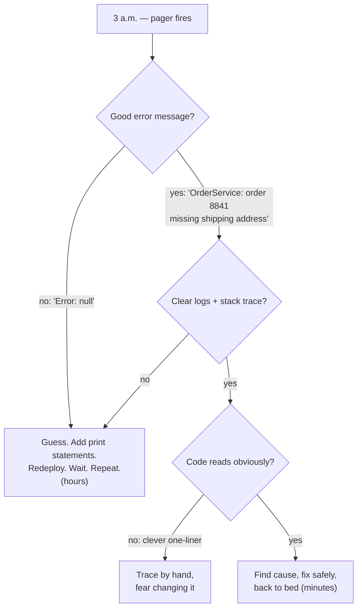
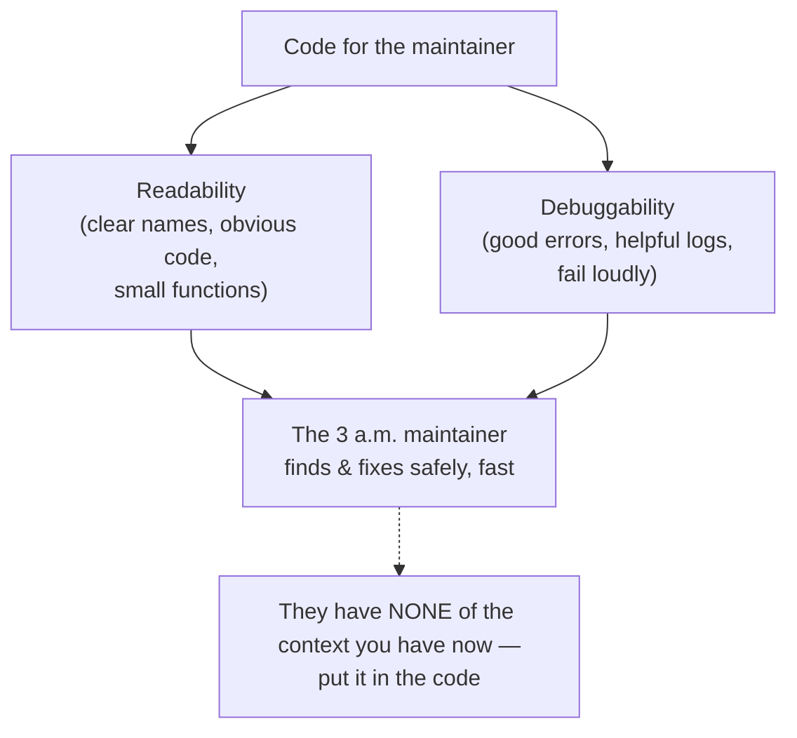

# Code For The Maintainer — Junior

> **Category:** [Design Principles](../../README.md) — write code for the human who will have to read, debug, and change it later — often a future you, at 3 a.m., during an incident, with none of the context you have right now.

---

## Introduction

> Focus: **What is it?** and **How to use it?**

**Code for the maintainer** is the principle that you write code primarily for the human who will *read, debug, and change it later* — not for the compiler, and not to show off. That human is usually you, six months from now, staring at a stack trace at 3 a.m. during an incident, with none of the context you have today.

The principle has two famous framings — one funny, one foundational.

> *"Always code as if the person who ends up maintaining your code is a violent psychopath who knows where you live."* — John Woods

That's the memorable version. The serious version is older and from Donald Knuth:

> *"Programs are meant to be read by humans and only incidentally for computers to execute."*

Both say the same thing: the audience for your code is a **person**. The machine will run anything that compiles. The human has to *understand* it — under time pressure, often broken, often without the original author around to ask. Optimize for that human's ability to read, reason about, and safely change the code, and you have followed this principle.

### Why this matters

Code that "works" today but is impossible to understand tomorrow is a liability, not an asset. When the incident comes — and it will — the maintainer's ability to find the bug and fix it *safely* is what determines whether the outage lasts five minutes or five hours. Clever, terse, "look how smart I am" code that nobody can follow is a tax that someone else pays, with interest, at the worst possible time.

---

## Prerequisites

- **Required:** You can write functions, name variables, and read a stack trace.
- **Required:** You have debugged code you didn't write (or code you forgot writing) — you know the feeling this principle is trying to spare you.
- **Helpful:** Exposure to **[KISS](../01-kiss/junior.md)** — the simplest thing that works is usually the right thing; clever code is the enemy of maintainability.
- **Helpful:** A feel for naming and small functions (covered in depth in Clean Code).

---

## Glossary

| Term | Definition |
|------|-----------|
| **Maintainer** | The person who reads, debugs, and changes the code later — usually future-you, possibly a stranger. |
| **Readability** | How quickly and accurately a reader understands what the code does and why. |
| **Debuggability** | How easily a person can locate the cause of a failure when something goes wrong. |
| **Reader-to-writer ratio** | Code is read far more times than it is written; the reader's time is the scarce resource to optimize. |
| **Principle of Least Astonishment (PoLA)** | Code should behave the way a competent reader expects; surprises are bugs-in-waiting. |
| **WHY comment** | A comment explaining the *reason* for code (intent, trade-off, gotcha) — not restating *what* the code literally does. |
| **Failing loudly** | Surfacing an error immediately with full context, instead of swallowing it or limping on with corrupt state. |
| **Boy Scout Rule** | Leave the code a little cleaner than you found it. |

---

## The Principle

> **Write code for the human who will maintain it.** Optimize for readability and debuggability, because code is read — and debugged — far more often than it is written. When in doubt, choose the *obvious* solution over the *clever* one.

This is a stance, and it produces concrete choices:

- **Clarity over cleverness.** If a smart one-liner saves you 30 seconds today but costs the next reader ten minutes, it's a bad trade.
- **Explicit over implicit.** Spell out what's happening; don't hide it behind magic or indirection the reader has to reverse-engineer.
- **Obvious over surprising.** Code should do what a reasonable person expects (Principle of Least Astonishment).
- **Helpful when it breaks.** Good error messages, good logs, good stack traces — so the 3 a.m. maintainer can find the problem fast.

The principle does **not** mean "write the dumbest possible code" or "add a comment to every line." It means: assume your reader is competent but has *no context* and *no time*, and make their job easy.

---

## Why This Matters: Code Is Read Far More Than It's Written

You write a line of code once. After that, it gets *read* — during reviews, during debugging, during the next feature, during the incident — dozens or hundreds of times, by people (including future-you) who weren't there when you wrote it.

```
        ┌──────────────────────────────────────────────┐
WRITE   │ ▓                                            │  1×  (you, now, with full context)
        ├──────────────────────────────────────────────┤
READ    │ ▓▓▓▓▓▓▓▓▓▓▓▓▓▓▓▓▓▓▓▓▓▓▓▓▓▓▓▓▓▓▓▓▓▓▓▓▓▓▓▓▓▓▓▓ │  many× (others, later, with NO context)
        └──────────────────────────────────────────────┘
   Optimize the long bar, not the short one.
```

This is the **reader-to-writer ratio**, and it's the economic heart of the principle. A trick that shaves a minute off writing but adds a minute to *every read* is a losing trade after the second read — and most code is read far more than twice.

There's a bigger economic fact behind it: **maintenance is the majority of a software system's lifetime cost.** Industry estimates commonly put maintenance at roughly **60–80% of total lifecycle cost** — that is, the great majority of the money spent on a piece of software is spent *after* it first ships, on reading, debugging, and changing it. (Treat the exact figure as a rough industry estimate, not a precise law; the *direction* — maintenance dominates — is the durable, well-supported point.) Either way, write-time cleverness that costs read-time is optimizing the small number at the expense of the big one.

---

## The 3 a.m. Maintainer

The single most useful image for this principle is a specific person: **the on-call engineer, woken at 3 a.m. by a pager, debugging your code during an outage.**

This person:

- **Has none of the context you have right now.** They don't know why you wrote it this way, what edge case you were handling, or what that flag means.
- **Is under pressure.** The system is down; every minute costs money and sleep.
- **May not be you — or may be a you who has forgotten everything.** Six months erases context as thoroughly as a stranger's eyes.

Everything in this principle serves that person:



When you write code, ask: *"If this fails at 3 a.m. and someone who isn't me has to fix it, have I made that possible — or did I leave them a puzzle?"*

---

## Real-World Analogies

| Concept | Analogy |
|---|---|
| **Code is read more than written** | A road is built once but driven millions of times — you design it for the drivers, not the construction crew. |
| **Clarity over cleverness** | A surgeon labels every instrument clearly rather than relying on memory; in an emergency, obvious beats impressive. |
| **Good error messages** | A smoke detector that says *"smoke in the kitchen"* vs. one that just beeps. Both alarm; only one tells you where to run. |
| **WHY comments** | A note on a circuit breaker: *"Do not flip — feeds the freezer."* The wire's existence is visible; the *reason* isn't. |
| **The 3 a.m. maintainer** | Writing assembly instructions for someone tired, in a hurry, with no picture on the box. |
| **Principle of Least Astonishment** | Light switches go up for on; a switch wired backward "works" but ambushes everyone who uses it. |

---

## Mental Models

**The core intuition:** *"The maintainer has none of the context I have right now."*

Everything you know this instant — why the workaround exists, what the magic number means, which case you're guarding against — is **in your head, not in the code.** The reader gets only what's on the screen. Your job is to move the context *out of your head and into the code* (through names, structure, comments-on-why, and error messages) so the reader doesn't have to reconstruct it.

```
   WHAT YOU HAVE NOW              WHAT THE MAINTAINER GETS
   ┌────────────────────┐         ┌────────────────────┐
   │ the requirement     │        │                    │
   │ the edge case        │  ───▶  │  only the code     │
   │ the reason for the   │        │  on the screen     │
   │ weird workaround     │        │                    │
   │ the whole mental map │        │  (and a stack      │
   └────────────────────┘         │   trace, if lucky)  │
                                   └────────────────────┘
   The gap is what you must write down.
```

A second model: **code that is locally reasoned-about.** Good maintainable code lets the reader understand one piece *without* holding the whole system in their head. Low coupling, small functions, and clear names mean the maintainer can focus on the broken part instead of loading the entire codebase into working memory. (More on coupling at [Minimise Coupling](../../02-coupling-and-cohesion/01-minimise-coupling/junior.md).)

---

## Concrete Practices

These are the day-to-day moves that put the principle into practice:

| Practice | What it does for the maintainer |
|---|---|
| **Clear, intention-revealing names** | They read the *what* and *why* straight from the name — no decoding `d`, `tmp`, `flag2`. |
| **Obviousness over cleverness** | The obvious solution is the one the maintainer can follow at 3 a.m.; the clever one is the one they fear to touch. |
| **Explicit over implicit** | No hidden magic to reverse-engineer; the data flow is on the page. |
| **Small functions** | Each function fits in the head; the maintainer reasons about one thing at a time. |
| **WHY comments** | The non-obvious *reason* (a trade-off, a gotcha, a workaround) is recorded, not lost. |
| **Good error messages** | The failure says *what* failed, *with which data*, and ideally *what to do* — not just "error." |
| **Helpful logging** | The on-call engineer can trace what happened without redeploying with print statements. |
| **Fail loudly with context** | Problems surface immediately and visibly, not silently corrupting state to explode later somewhere else. |
| **Principle of Least Astonishment** | The code behaves the way the reader expects; no nasty surprises. |
| **Boy Scout Rule** | Leave each file a little cleaner than you found it; maintainability compounds. (See Clean Code → Boy Scout Rule.) |

You don't need to memorize the list. They all flow from one question: *will the next person understand and safely change this?*

---

## Code Examples

### Clever vs. maintainer-friendly (Python)

```python
# CLEVER — "look, no loop!" Opaque. The maintainer has to mentally run it.
def g(s):
    return [*map(lambda p: (p[0], int(p[1])*60+int(p[2])),
            (x.split(":") for x in s.split(",")))]

# MAINTAINER-FRIENDLY — same result, obvious at a glance.
def parse_lap_times(raw):
    """'alice:1:30,bob:2:05' -> [('alice', 90), ('bob', 125)] (seconds)."""
    laps = []
    for entry in raw.split(","):
        name, minutes, seconds = entry.split(":")
        total_seconds = int(minutes) * 60 + int(seconds)
        laps.append((name, total_seconds))
    return laps
```

Both produce the same output. The second one names the concept (`parse_lap_times`, `total_seconds`), shows the data flow step by step, and a maintainer at 3 a.m. can read it top to bottom. The first one is a riddle. The cleverness saved the author nothing worth the cost.

### Implicit vs. explicit (TypeScript)

```typescript
// IMPLICIT — what is `+u`? what does truthiness mean here? surprises lurk.
function fee(u: any) {
  return u && +u.amt > 100 ? +u.amt * 0.02 : 0;
}

// EXPLICIT — the rule is on the page; nothing to reverse-engineer.
const LARGE_ORDER_THRESHOLD = 100;
const LARGE_ORDER_FEE_RATE = 0.02;

function calculateProcessingFee(order: Order): number {
  if (order.amount <= LARGE_ORDER_THRESHOLD) {
    return 0;
  }
  return order.amount * LARGE_ORDER_FEE_RATE;
}
```

The explicit version names the threshold and the rate, states the business rule plainly, and removes the `any`/`+`/truthiness traps that ambush a maintainer.

### Obvious over astonishing (Java)

```java
// ASTONISHING — a method named getX() that also MUTATES. The reader expects
// a read; the hidden write bites them later (a Principle of Least Astonishment violation).
int getNextId() {
    return ++this.counter;   // surprise: calling a "get" changes state
}

// OBVIOUS — the name tells the truth about what it does.
int allocateNextId() {
    return ++this.counter;   // "allocate" signals a state change; no surprise
}
```

A maintainer trusts names. When `getNextId()` secretly mutates, the next person calls it "just to peek" and corrupts the counter. The fix is honesty, not cleverness: name it for what it actually does.

---

## Comments That Explain WHY, Not WHAT

The single highest-value comment a maintainer can find is one that explains a **reason they could not have guessed.** The code already says *what* it does; the comment should say *why* — especially when the *why* is surprising.

```python
# BAD — restates the code. Adds nothing; rots when the code changes.
# increment i by 1
i += 1

# BAD — a comment to explain clever code. Fix the code instead.
# loop over pairs, multiply, sum (see the dense one-liner below)
total = sum(p * q for p, q in zip(prices, quantities))

# GOOD — explains a NON-OBVIOUS reason the maintainer would otherwise
# "fix" into a bug.
# Stripe rejects amounts over $999,999.99, so cap before sending.
# Larger orders are split upstream; this is the last-resort guard.
amount_cents = min(amount_cents, 99_999_999)

# GOOD — records a trade-off / gotcha that isn't visible from the code.
# We retry on 429 only (rate-limit). Retrying 4xx would hammer a broken
# request forever; retrying 5xx is handled by the circuit breaker above.
if response.status_code == 429:
    retry_with_backoff(request)
```

The test for a comment: **could a competent reader have figured this out from the code alone?** If yes, delete the comment (and maybe improve the code). If no — if it's a reason, a trade-off, a gotcha, a "this looks wrong but is correct because…" — *write it down.* That comment is a gift to the 3 a.m. maintainer.

> A WHY comment is context rescued from your head before it evaporates. A WHAT comment is noise that drifts out of sync with the code and eventually lies.

---

## Error Messages and Logging for the On-Call Engineer

When code fails, the *only* thing the maintainer has is the message, the log, and the stack trace. Make them count.

### A bad error vs. a debuggable one

```python
# BAD — the maintainer learns nothing. Now they have to reproduce it.
def charge(order):
    if not order.address:
        raise Exception("Error")          # error WHAT? which order? why?

# DEBUGGABLE — names the failure, the offending data, and the cause.
def charge(order):
    if not order.address:
        raise MissingShippingAddressError(
            f"Cannot charge order {order.id}: no shipping address. "
            f"Customer {order.customer_id} (created {order.created_at}). "
            f"Likely an incomplete checkout — check the cart-abandon flow."
        )
```

The first message turns a 30-second fix into a 30-minute investigation. The second one points the on-call engineer straight at the problem: *which* order, *which* customer, the *likely cause*, and *where to look next*.

### Logging the on-call engineer can actually use

```python
# NOT HELPFUL — vague, no identifiers, can't correlate across requests.
logger.info("processing")
logger.error("failed")

# HELPFUL — identifiers to grep, the operation, and the context.
logger.info("charging order", order_id=order.id, amount=order.total,
            customer_id=order.customer_id)
logger.error("charge failed", order_id=order.id, gateway="stripe",
             error_code=err.code, retryable=err.retryable)
```

Good logs let the maintainer **grep one order ID** and watch its whole journey, instead of guessing. The identifiers (order id, customer id, request id) are the thread they pull to unravel an incident.

### Fail loudly, not silently

```python
# SILENT FAILURE — swallows the error, returns a wrong-but-plausible value.
# The bug surfaces far away, hours later, impossible to trace back here.
def get_discount(user):
    try:
        return pricing_service.discount_for(user)
    except Exception:
        return 0          # looked "safe"; actually hides outages and gives wrong prices

# LOUD FAILURE — surfaces the problem WITH context, at the source.
def get_discount(user):
    try:
        return pricing_service.discount_for(user)
    except PricingServiceError as e:
        logger.error("discount lookup failed", user_id=user.id, error=str(e))
        raise            # fail here, with context, not 3 layers away with no clue
```

Swallowing errors feels defensive but is one of the cruelest things you can do to a maintainer: it moves the symptom far from the cause and erases the evidence. **Fail loudly, at the source, with context.** A loud failure now is a five-minute fix; a silent one is a multi-day mystery.

---

## Best Practices

1. **Write for the reader, not the compiler.** The machine runs anything; the human has to understand it.
2. **Prefer the obvious solution to the clever one.** If you must be clever (a hot path, a tricky algorithm), comment it *heavily* so the cleverness is decoded for the next reader.
3. **Name things for what they are and do.** A good name is the cheapest, highest-leverage documentation there is.
4. **Make errors say what failed, with which data, and what to do.** Never raise `Exception("error")`.
5. **Log identifiers** (order id, request id, user id) so the on-call engineer can trace one request end to end.
6. **Comment the WHY, not the WHAT.** Record reasons, trade-offs, and gotchas; delete comments that just restate the code.
7. **Fail loudly with context.** Don't swallow exceptions or return plausible-but-wrong values that hide the problem.
8. **Leave it cleaner than you found it** (Boy Scout Rule).

---

## Common Mistakes

1. **Writing clever code to feel smart.** The cleverness costs *every* future reader; it's a withdrawal from a shared account.
2. **`raise Exception("error")` / `catch (e) {}`.** Useless messages and swallowed exceptions are the top causes of slow incident resolution.
3. **WHAT comments.** `# increment i` adds nothing and rots; the *reason* is what's missing.
4. **Cryptic names.** `d`, `tmp`, `data2`, `mgr`, `flag` force the maintainer to reverse-engineer meaning the name should have carried.
5. **Optimizing write-time over read-time.** Saving yourself a minute now while costing every future reader ten.
6. **Surprising behavior.** A `get` that mutates, a function with hidden side effects — Principle-of-Least-Astonishment violations that ambush the next person.
7. **Assuming you'll be around to explain it.** You won't be — and even if you are, you'll have forgotten. Put the context *in the code.*

---

## Tricky Points

- **"Code for the maintainer" is not "comment everything."** Over-commenting is its own maintenance burden — comments rot and start to lie. The best clarity comes from *names and structure*; reserve comments for the WHY. (More at [Middle](middle.md).)
- **It's not "always write the most verbose thing."** Sometimes terse, *idiomatic* code is *clearer* to a competent reader who expects it (a list comprehension, a standard idiom). The target is the *competent* maintainer, not the absolute beginner. (Explored at [Middle](middle.md).)
- **Clarity occasionally fights performance.** A rare hot path may genuinely need a clever, fast version. The rule isn't "never optimize" — it's "make it work and clear first, optimize only the measured hot spot, and *comment the cleverness heavily*." (See [Avoid Premature Optimization](../05-avoid-premature-optimization/junior.md).)
- **The maintainer is usually you.** This isn't altruism. The person you're being kind to is yourself in six months — which is why the principle is easy to sell once you've felt the pain.

---

## Test Yourself

1. Who is "the maintainer," and what context do they have?
2. State the reader-to-writer ratio idea in one sentence, and why it argues against clever code.
3. What does a WHY comment record, and how is it different from a WHAT comment?
4. Give two properties of a debuggable error message.
5. Why is silently swallowing an exception cruel to the maintainer?
6. What is the Principle of Least Astonishment, with one example?

---

## Cheat Sheet

```text
THE PRINCIPLE
  Write for the human who maintains it (often future-you, at 3 a.m., no context).
  Optimize for READABILITY and DEBUGGABILITY — code is READ far more than written.

CHOOSE
  obvious  > clever           explicit > implicit
  clear    > short            small fns > giant fns
  name it  > comment it       fail loud > fail silent

ERRORS & LOGS (for the on-call engineer)
  message = WHAT failed + WHICH data + likely cause / next step
  logs    = identifiers to grep (order id, request id, user id)
  NEVER   raise Exception("error")   |   catch (e) {}  // swallowed

COMMENTS
  WHY (reason / trade-off / gotcha)   ✓  keep
  WHAT (restates the code)            ✗  delete, improve the code instead

CLEVERNESS BUDGET
  default: obvious code
  hot path that's measured-slow → optimize AND comment the cleverness heavily
```

---

## Summary

- **Code for the maintainer** = write for the human who reads, debugs, and changes the code later — usually future-you, often at 3 a.m., with **none** of your current context.
- Two framings: Knuth's "*programs are meant to be read by humans*" and Woods' "*…the person maintaining it is a violent psychopath who knows where you live.*"
- **Code is read far more than written**, and maintenance is the majority (~60–80%, an industry estimate) of lifecycle cost — so write-time cleverness that costs read-time is a bad trade.
- Concrete practices: **clear names, obvious over clever, explicit over implicit, small functions, WHY-comments, debuggable error messages, helpful logs, fail loudly with context, Principle of Least Astonishment, Boy Scout Rule.**
- The mental model: **the maintainer has none of the context you have now** — move that context out of your head and into the code.

---

## Further Reading

- Donald Knuth, *Literate Programming* — "programs are meant to be read by humans."
- John Woods — the "violent psychopath who knows where you live" maxim (Usenet, comp.lang.c++).
- Robert C. Martin, *Clean Code* — naming, functions, comments, and error handling for maintainability.
- [KISS](../01-kiss/junior.md) and [Optimize for Deletion](../06-optimize-for-deletion/junior.md) — sibling principles for low-cost-to-change code.
- Clean Code → Boy Scout Rule — leave it cleaner than you found it.

---

## Related Topics

- **Sibling principles:** [KISS](../01-kiss/junior.md), [Optimize for Deletion](../06-optimize-for-deletion/junior.md), [Avoid Premature Optimization](../05-avoid-premature-optimization/junior.md).
- **Enables local reasoning:** [Minimise Coupling](../../02-coupling-and-cohesion/01-minimise-coupling/junior.md).
- **The compounding habit:** Boy Scout Rule.

---

## Diagrams




---

## Check your understanding

1. Explain Code For The Maintainer — Junior Level in your own words and name the problem it solves.
2. How would you apply the ideas around Table of Contents, Introduction, Prerequisites in a realistic engineering change?
3. What failure mode or misuse should you look for, and what evidence would reveal it?
4. What small example would prove that you can apply Code For The Maintainer — Junior Level correctly?
5. What observable result would convince you that the approach improved the system?
