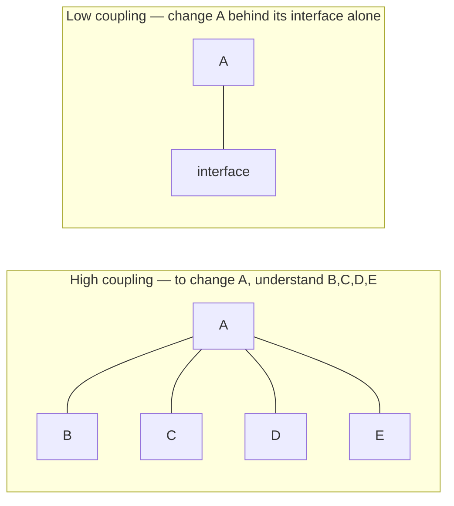
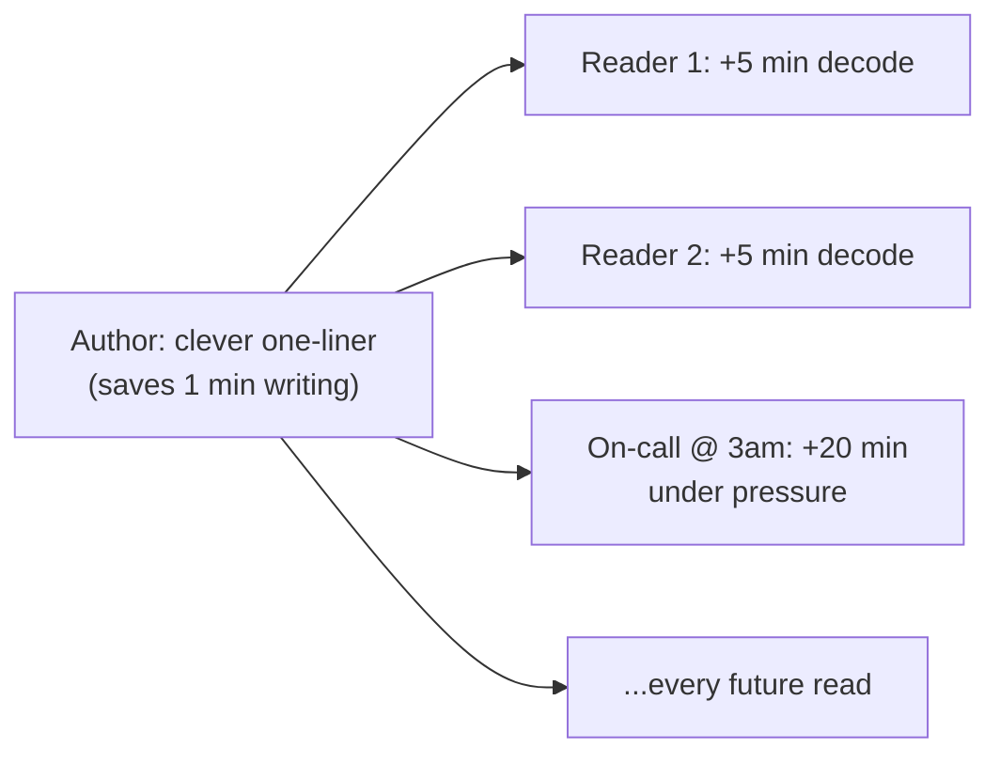
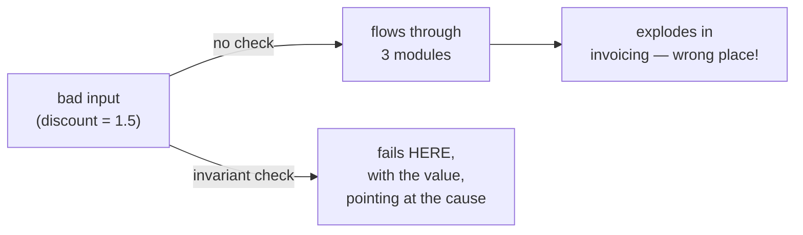

# Code For The Maintainer — Middle

> **Category:** [Design Principles](../../README.md) — write code for the human who will have to read, debug, and change it later — often a future you, at 3 a.m., during an incident, with none of the context you have right now.

> **Prerequisite:** [Junior](junior.md)
> **Focus:** **Why** and **When**

---

## Table of Contents

1. [Introduction](#introduction)
2. [The Economics: Why the Reader Wins](#the-economics-why-the-reader-wins)
3. [Clever Code Is a Liability](#clever-code-is-a-liability)
4. [Debuggability as a First-Class Design Goal](#debuggability-as-a-first-class-design-goal)
5. [The Principle of Least Astonishment in Practice](#the-principle-of-least-astonishment-in-practice)
6. [When Terseness Is Actually Clearer](#when-terseness-is-actually-clearer)
7. [The Comment Trade-off: Helpful vs. Rot](#the-comment-trade-off-helpful-vs-rot)
8. [Readability vs. Performance](#readability-vs-performance)
9. [Local Reasoning: Coupling and the Maintainer](#local-reasoning-coupling-and-the-maintainer)
10. [Trade-offs](#trade-offs)
11. [Edge Cases](#edge-cases)
12. [Tricky Points](#tricky-points)
13. [Best Practices](#best-practices)
14. [Test Yourself](#test-yourself)
15. [Summary](#summary)
16. [Diagrams](#diagrams)

---

## Introduction

> Focus: **Why** and **When**

At the junior level, "code for the maintainer" is advice you follow: clear names, good errors, WHY-comments. At the middle level it becomes a set of **judgement calls** where the principle collides with other real goods — performance, brevity, the urge to be clever — and you have to know *which wins and why.*

The recurring questions:

- *Is this terseness clearer to a competent reader, or just shorter for me?*
- *This comment — does it carry a reason the reader needs, or will it rot into a lie?*
- *This hot path needs to be fast — how do I keep it maintainable while making it clever?*
- *Why does low coupling make code easier to maintain — what's the actual mechanism?*

The throughline is the **economics**: the maintainer's time is the scarce resource, and almost every trade-off resolves by asking *which choice costs the reader less over the life of the code.*

---

## The Economics: Why the Reader Wins

The junior level stated the reader-to-writer ratio. The middle level uses it as a **decision rule.**

Every line of code has two costs:

- **Write cost** — paid once, by you, now.
- **Read cost** — paid many times, by many people (including future-you), forever.

```
   total cost of a line  ≈  write_cost  +  (read_cost × number_of_reads)
                                            └──── this term dominates ────┘
```

Because `number_of_reads` is large, the read term dominates almost everything. A choice that lowers write cost by raising read cost is, in nearly every case, a *net loss* — you saved one minute and spent many. This is why "I'll just write it the quick way" is usually false economy: there is no "quick way" once you count the reads.

The macro version: **maintenance is the majority of software lifecycle cost** — commonly cited at **~60–80%** as an industry estimate. The number is fuzzy (it varies by system, study, and how you count), but the conclusion is robust and uncontroversial: *most of the money is spent after the first ship, on reading and changing the code.* So optimizing the codebase for change — for the maintainer — is optimizing the largest cost center you have. Clever write-time micro-savings optimize the smallest one.

> The discipline isn't "be slow and verbose." It's "spend your effort where the cost is" — and the cost is in reading and changing, not in the first write.

---

## Clever Code Is a Liability

"Clever" code — terse, surprising, showing off a language trick — *feels* like skill. The senior reframing: **clever code is a liability you put on a balance sheet someone else has to pay.**

Consider the difference between *complex* and *clever*:

- **Complex code** is code that's hard because the *problem* is hard (a genuinely intricate algorithm). The complexity is essential.
- **Clever code** is code that's hard because the *author* chose to make it hard — a one-liner that could have been four obvious lines, a metaprogramming trick where a plain function would do. The difficulty is *accidental*, added for the author's gratification.

```python
# CLEVER (accidental difficulty) — a maintainer must mentally execute this.
result = reduce(lambda a, b: a | {b[0]: a.get(b[0], 0) + b[1]},
                pairs, {})

# OBVIOUS (same result) — a maintainer reads it once and moves on.
totals = {}
for key, amount in pairs:
    totals[key] = totals.get(key, 0) + amount
```

Both build a sum-by-key dictionary. The first proves the author knows `reduce`; the second is read in two seconds by anyone. The cleverness bought the author nothing and taxes every future reader.

**The cost of cleverness compounds:**

- The next reader spends extra minutes decoding it — every time.
- During an incident, that decoding happens under pressure, slowing the fix.
- People become *afraid to change* clever code (they can't predict what it does), so bugs fester and features route around it.
- It corrodes the codebase culture: clever begets clever, and the bar for "normal" code drifts toward unreadable.

> "Everyone knows that debugging is twice as hard as writing a program in the first place. So if you're as clever as you can be when you write it, how will you ever debug it?" — Brian Kernighan. The clever code you can *barely* write, you *cannot* debug — and neither can your maintainer.

The middle-level stance: **reserve your cleverness for the problem, never for the code.** Solve hard problems; write the solution plainly.

---

## Debuggability as a First-Class Design Goal

Junior framing: "write good error messages." Middle framing: **debuggability is a design property you build in, not a thing you add later.** A system is debuggable when a maintainer can answer *"what happened and why?"* quickly, from the evidence the system already produced.

The pillars (the "three pillars of observability," at code scale):

| Pillar | What it gives the maintainer | Design move |
|---|---|---|
| **Good stack traces** | *Where* it broke and the call path that got there | Don't catch-and-rethrow in ways that erase the original; preserve the cause (`raise ... from e`, exception chaining). |
| **Structured logs** | *What happened*, correlatable across a request | Log identifiers (request id, order id) as fields, not buried in prose. |
| **Invariant checks / assertions** | *Where* the state first went wrong, not where it finally exploded | Validate assumptions early and loudly; fail at the source. |

### Invariant checks: fail where it broke, not where it shows

The cruelest bugs are the ones that surface *far* from their cause. An invariant check catches the violation *at the moment it happens*, so the stack trace points at the real culprit.

```python
# Without an invariant check: corrupt state flows on and explodes elsewhere.
def apply_discount(price, discount_rate):
    return price * (1 - discount_rate)   # if rate is 1.5, returns negative — silently

# With an invariant check: fail loudly AT the bad input, with context.
def apply_discount(price, discount_rate):
    assert 0 <= discount_rate <= 1, (
        f"discount_rate must be in [0, 1], got {discount_rate}"
    )
    return price * (1 - discount_rate)
```

Without the check, a bad `discount_rate` of `1.5` produces a *negative price* that flows downstream and corrupts an invoice three modules away — and the maintainer debugs the *invoice* module, where nothing is wrong. With the check, the failure fires at the source with the offending value in hand. **Debuggability is "the failure points at its own cause."**

### Preserve the cause

```python
# DESTROYS evidence — the maintainer sees "DataError", not the real DB error.
try:
    rows = db.query(sql)
except DatabaseError:
    raise DataError("query failed")        # original cause LOST

# PRESERVES the chain — the root cause and full stack survive.
try:
    rows = db.query(sql)
except DatabaseError as e:
    raise DataError(f"loading orders for {customer_id} failed") from e
```

Exception chaining (`from e`, or Java's `new XException(msg, cause)`) keeps the original error and stack trace attached. Swallowing the cause to throw a "cleaner" exception is a gift you take *away* from the maintainer.

---

## The Principle of Least Astonishment in Practice

> **Principle of Least Astonishment (PoLA):** a component should behave the way most users / readers will expect it to. When behavior must surprise, the surprise should be loudly signposted.

PoLA is "code for the maintainer" applied to *behavior*. A maintainer reasons about code using their expectations; every violation forces them to stop, discover the surprise, and remember it forever. Common violations:

| Astonishment | Why it hurts the maintainer | Fix |
|---|---|---|
| A `get`/`is`/`has` method that mutates state | They call it "to peek" and corrupt state | Name it for the mutation (`allocate`, `take`); keep queries pure (Command-Query Separation) |
| A function with hidden side effects (writes a file, sends a request) | They reuse it expecting purity; it fires a side effect | Make side effects obvious in the name; isolate them |
| A parameter that changes behavior in a non-obvious way (`process(data, True)`) | They can't tell what `True` means at the call site | Use named/enum args (`process(data, validate=True)`) |
| Returning `null`/`-1`/`""` to mean "not found" or "error" | They forget to check; it explodes later | Use `Optional`, exceptions, or a result type — make absence explicit |
| Inconsistent conventions across the codebase | Every module needs re-learning | Follow the established local convention, even if you'd prefer another |

The deeper rule: **consistency beats personal preference.** A maintainer who has learned how *this* codebase does things can reason across all of it. A "better" idea applied in one corner makes that corner astonishing. (More on conventions at [Professional](professional.md).)

---

## When Terseness Is Actually Clearer

The principle is *not* "always more verbose." A frequent misread is to inflate code with ceremony in the name of "clarity," which *reduces* it. The correct target is **the competent reader who knows the language and domain** — not an absolute novice.

For that reader, **idiomatic terseness is often the clearest option**, because it matches the pattern they already recognize:

```python
# Over-verbose "for clarity" — actually NOISIER; the reader hunts for the point.
evens = []
for i in range(len(numbers)):
    n = numbers[i]
    if n % 2 == 0:
        evens.append(n)

# Idiomatic — a competent Python reader recognizes this INSTANTLY.
evens = [n for n in numbers if n % 2 == 0]
```

```typescript
// Ceremony that hides intent.
let total = 0;
for (let i = 0; i < orders.length; i++) {
  total = total + orders[i].amount;
}

// Idiomatic — the reader sees "sum of amounts" at a glance.
const total = orders.reduce((sum, o) => sum + o.amount, 0);
```

The list comprehension and the `reduce` are *terser* and *clearer* — because they're the expected idiom. The judgement call:

> **Terseness is clearer when it uses an idiom the competent reader already knows; it's worse when it requires the reader to mentally execute the code to understand it.**

The dividing line is *recognition* vs. *simulation*. If a competent reader recognizes the shape immediately, terse wins. If they have to trace it line by line in their head to see what it does, terse lost — that's cleverness, not idiom.

---

## The Comment Trade-off: Helpful vs. Rot

Comments are double-edged. A good WHY-comment rescues context; a bad comment is a liability that **rots into a lie.**

The problem: comments aren't checked by the compiler or the tests. When the code changes and the comment doesn't, the comment now *misinforms* — and a misleading comment is worse than none, because the maintainer trusts it and is led astray.

```python
# ROTS — restates code; will silently lie the moment the timeout changes.
# wait 30 seconds
client.connect(timeout=self.timeout)

# Better: no comment; the named value carries the meaning.
client.connect(timeout=self.connect_timeout_seconds)

# WHY comment that EARNS its place (and won't rot, because it's about intent):
# 30s, not the default 5s: this gateway cold-starts and the first call
# after idle can take ~20s. Lowering this caused the 2023-11 timeout storm.
client.connect(timeout=GATEWAY_COLD_START_TIMEOUT)
```

The decision rule for a comment:

| Comment type | Keep? | Why |
|---|---|---|
| Restates *what* the code does | ✗ | Redundant now, rots later, the code already says it |
| Explains a *reason / trade-off / gotcha* (WHY) | ✓ | Carries context the code can't, rarely goes stale |
| Warns of a non-obvious consequence ("don't reorder — X depends on Y") | ✓ | Prevents a future maintainer's mistake |
| Compensates for unclear code ("this loop finds the max") | ✗ (usually) | Fix the *code* (name/extract) instead of annotating it |
| Documents a public API contract (docstring) | ✓ | The maintainer/caller needs the contract |

> Prefer making the code self-explaining (names, small functions) over commenting; reserve comments for the **why** the code can never express. And when you change code, change its comments — a stale comment is a defect.

---

## Readability vs. Performance

The hardest trade-off this principle faces. The default ordering is **make it work → make it right (clear) → make it fast** — and "fast" only after *measuring* that you need to (see [Avoid Premature Optimization](../05-avoid-premature-optimization/junior.md)).

But sometimes a measured hot path genuinely needs code that's faster *and* less obvious. The principle does not forbid this — it constrains *how* you do it:

```python
# CLEAR version — correct and obvious; ships first. Profiled: this is 60% of
# request time at p99, called 50k times/request. It genuinely needs to be faster.
def overlaps(a, b):
    return any(x in b for x in a)        # O(len(a) * len(b))

# FAST version — less obvious, but justified by the profiler AND heavily commented.
def overlaps(a, b):
    # HOT PATH (60% of p99, 50k calls/req — see PERF-412). We pre-build a set
    # for O(1) membership; this turns O(n*m) into O(n+m). Keep `b` as a set at
    # the call site if you can — converting here every call defeats the point.
    b_set = b if isinstance(b, set) else set(b)
    return any(x in b_set for x in a)
```

The rules when readability and performance conflict:

1. **Write the clear version first** and ship it unless you've measured a real problem.
2. **Optimize only the measured hot path** — never on a hunch (that's premature optimization, which trades certain readability for hypothetical speed).
3. **When you do go clever for speed, comment it heavily**: *why* (the measurement), *what* the trick does, and *what invariant* the caller must keep. The comment is the cost of admission for the cleverness.
4. **Isolate the fast-but-ugly code** behind a clear function name, so the cleverness is contained and the call sites stay readable.

> Performance cleverness is *earned* by measurement and *paid for* by heavy commenting. Unmeasured cleverness is just cleverness — pure cost.

---

## Local Reasoning: Coupling and the Maintainer

Why does low coupling make code maintainable? The mechanism is **local reasoning**: the ability to understand and safely change one piece *without* loading the whole system into your head.



When module A reaches into the internals of B, C, and D, a maintainer fixing A must understand B, C, and D too — and a change to A may break them in ways the maintainer can't foresee. That's the opposite of maintainable: every fix risks a cascade, and every fix requires holding the whole graph in your head at 3 a.m.

Low coupling lets the maintainer:

- **Localize the bug** — the cause is *here*, not entangled across five modules.
- **Change safely** — a fix behind a stable interface can't ripple outward unpredictably.
- **Reason in isolation** — understand one component without the rest.

So "code for the maintainer" and "minimise coupling" are the same goal seen from two angles: one is about *understanding* a piece, the other about being able to *change* it safely. (Full treatment at [Minimise Coupling](../../02-coupling-and-cohesion/01-minimise-coupling/middle.md).) The same logic links to **[Optimize for Deletion](../06-optimize-for-deletion/middle.md)**: code that's easy to *delete* is loosely coupled and locally reasoned-about — which is exactly the code that's easy to *maintain.*

---

## Trade-offs

| Decision | Lean toward the maintainer | Lean the other way (and when it's right) |
|---|---|---|
| Clever one-liner vs. obvious lines | Obvious lines | Idiomatic terseness *a competent reader recognizes instantly* |
| Comment vs. self-explaining code | Self-explaining (names, small fns) | A WHY-comment when the reason can't be expressed in code |
| Verbose explicitness vs. idiom | Idiom for the competent reader | Explicit when the idiom would surprise this audience |
| Clear code vs. fast code | Clear first | Fast on a *measured* hot path — heavily commented |
| Defensive (swallow errors) vs. fail loud | Fail loud with context | (Rarely) graceful degradation at a *deliberate* boundary, logged |
| Personal "better" idea vs. local convention | Follow the convention | Change the convention *for the whole codebase*, not one corner |

The unifying tiebreaker: **whichever costs the maintainer less over the life of the code.** Almost every row resolves the same way because the read-and-change cost dwarfs the write cost.

---

## Edge Cases

### 1. The genuinely complex algorithm

Some code is hard because the *problem* is hard (a numerical method, a concurrency protocol). You can't make it trivially obvious — but you *can* make it maintainable: a clear function name, a docstring explaining the approach and citing the source (paper, RFC), invariant checks, and named intermediate values. Code for the maintainer here means *"document the essential complexity well,"* not *"pretend it's simple."*

### 2. Performance-critical inner loops

A tight loop in a hot path may need cache-friendly, branch-light, un-pretty code. Acceptable — *if* measured, isolated behind a clear interface, and heavily commented. The surrounding code stays obvious; the ugliness is quarantined.

### 3. Defensive code at a trust boundary

"Fail loudly" has one principled exception: a *deliberate* resilience boundary (e.g., a non-critical feature that should degrade gracefully rather than take down the page). Even then, you don't *swallow* the error — you log it with full context and degrade *visibly* (a metric, an alert), so the maintainer still knows it happened. Silent is never acceptable; *deliberately graceful* is.

---

## Tricky Points

- **"For the maintainer" optimizes for the *competent* maintainer, not the novice.** Don't dumb code down below the idioms a qualified engineer expects — that adds noise. The target is "no *unnecessary* difficulty," not "zero difficulty."
- **Comments are a liability by default.** They rot, they lie, they add reading load. The bar for a comment is high: it must carry a *reason* the code can't. When in doubt, improve the code instead.
- **"Fail loudly" ≠ "crash carelessly."** Loud means *surface the problem with context, at the source* — which may be a thrown exception, a logged-and-degraded path, or an alert. It never means swallow-and-continue.
- **Performance is a real good, not the enemy.** The principle doesn't say "never optimize"; it says optimize *the measured hot path* and *pay for the cleverness with comments.* Conflating "code for the maintainer" with "ignore performance" is a misread.
- **Coupling is the hidden maintainability tax.** Most "this code is hard to maintain" complaints are really "this code can't be reasoned about locally because it's coupled to everything." Naming and comments don't fix that — reducing coupling does.

---

## Best Practices

1. **Resolve trade-offs by reader cost.** When choices conflict, pick the one that costs the maintainer less over the code's life.
2. **Reserve cleverness for the problem, write the solution plainly.** Complex problem, simple code.
3. **Design for debuggability:** preserve exception causes, log identifiers, add invariant checks that fail at the source.
4. **Honor the Principle of Least Astonishment:** keep queries pure, make side effects obvious, follow local conventions over personal taste.
5. **Use idiomatic terseness** the competent reader recognizes; avoid both ceremony and clever simulation-required code.
6. **Hold comments to a high bar:** WHY only; fix unclear code instead of annotating it; update comments when code changes.
7. **Optimize only measured hot paths**, isolate them, and comment the cleverness heavily.
8. **Reduce coupling** so the maintainer can reason locally — the deepest form of maintainability.

---

## Test Yourself

1. Express the total cost of a line of code as a rough formula, and say which term dominates.
2. What's the difference between *complex* code and *clever* code? Which does this principle target?
3. Name the three pillars of debuggability at code scale and what each gives the maintainer.
4. Why is an invariant check (assertion) a debuggability tool, not just a correctness one?
5. When is terse code clearer than verbose code, and when is it worse? State the dividing line.
6. What are the conditions under which clever, fast code is acceptable?

---

## Summary

- The principle resolves trade-offs by **economics**: the maintainer's read-and-change cost dominates the one-time write cost, and maintenance is the majority (~60–80%, industry estimate) of lifecycle cost.
- **Clever code is a liability** — accidental difficulty added for the author, paid by every future reader, and (Kernighan) undebuggable. Reserve cleverness for the problem; write the solution plainly.
- **Debuggability is a design goal:** preserve exception causes, log identifiers, and add **invariant checks** so failures fire at their source, not three modules downstream.
- **Principle of Least Astonishment:** keep queries pure, make side effects obvious, and follow local conventions over personal taste.
- **Terseness is clearer when idiomatic** (recognition) and worse when it requires mental simulation. Comments are a liability unless they carry a WHY the code can't.
- **Readability vs. performance:** clear first; optimize only the *measured* hot path; *pay for cleverness with heavy comments.* Low coupling enables the **local reasoning** that makes code maintainable.

---

## Diagrams

### Cleverness: who pays



### Fail at the source, not where it explodes




---

## Check your understanding

1. Explain Code For The Maintainer — Middle Level in your own words and name the problem it solves.
2. How would you apply the ideas around Table of Contents, Introduction, The Economics: Why the Reader Wins in a realistic engineering change?
3. What failure mode or misuse should you look for, and what evidence would reveal it?
4. Which local design trade-off would make you choose or reject Code For The Maintainer — Middle Level in an existing codebase?
5. What observable result would convince you that the approach improved the system?
