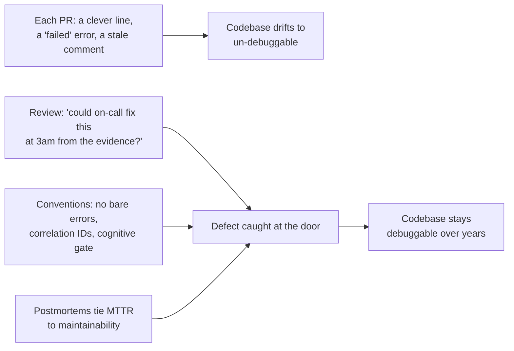
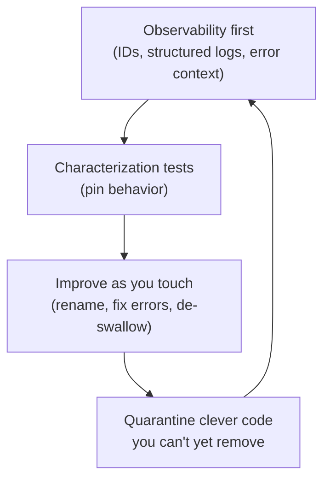

# Code For The Maintainer — Professional

> **Category:** [Design Principles](../../README.md) — write code for the human who will have to read, debug, and change it later — often a future you, at 3 a.m., during an incident, with none of the context you have right now.

> **Prerequisites:** [Junior](junior.md) · [Middle](middle.md) · [Senior](senior.md)
> **Focus:** **Production** — reviews, metrics, team conventions, legacy systems

---

## Introduction

> Focus: **production** — keeping a large, multi-contributor codebase maintainable over years.

Every engineer agrees with "code for the maintainer" in the abstract. The professional problem is that maintainability **erodes one reasonable-looking PR at a time**: a clever one-liner here, a swallowed exception there, an error message that says "failed," a comment that quietly went stale. No single change is the villain; the aggregate is a codebase where the on-call engineer dreads the pager and every change risks a cascade.

At the professional level the question is operational: **how do you keep a codebase debuggable and changeable when hundreds of changes land weekly from dozens of people with different instincts and different definitions of "clear"?** The answer is a system — review standards that name the failures, metrics that track the real thing (and refuse to be gamed), conventions that make the maintainer-friendly path the default, and a disciplined way to recover maintainability in legacy code without breaking production.

---

## Enforcing Maintainability in Code Review

Code review is where maintainability is won or lost, because most of its erosion enters one PR at a time. The reviewer is the maintainer's proxy — quite literally, they are reading the code without the author's context, which is *exactly* the maintainer's position.

### The reviewer's superpower: you ARE the future maintainer

A reviewer reading a PR has none of the author's context and is trying to understand the code from the screen alone. That is precisely the 3 a.m. maintainer's situation. So **review difficulty is a direct measurement of maintainability.** If you, the reviewer, had to read a function three times, the maintainer will too — and they'll do it under outage pressure. *"I found this hard to follow"* is not a soft comment; it's a data point about a real future cost.

### What to check

| Check | Failure signal | Review response |
|---|---|---|
| **Names reveal intent** | `data2`, `mgr`, `tmp`, `flag`, `process()` | "What does this represent? Name it for that." |
| **Obvious over clever** | A one-liner you had to mentally execute | "I had to run this in my head — can we make the steps explicit?" |
| **Errors are debuggable** | `throw new Error("failed")`, bare `Exception` | "If this fires at 3 a.m., what does the on-call engineer learn? Add the id + cause." |
| **No swallowed exceptions** | `catch {}`, `except: pass`, return-wrong-value-on-error | "This hides failures. Fail loudly with context or degrade *visibly*." |
| **Logs carry identifiers** | `log("processing")` with no IDs | "Add order/request id so we can correlate during an incident." |
| **Comments are WHY, not WHAT** | `// increment i`; or a comment explaining clever code | "This restates the code — delete it; or, if there's a *reason*, state the reason." |
| **Cause preserved** | catch-and-rethrow that drops the original | "Chain the cause (`from e` / `{ cause }`) so the root survives." |
| **PoLA** | a `get` that mutates; hidden side effects | "This surprises the reader — name it for what it does." |

### The highest-value review questions

> **"If this fails at 3 a.m. and the on-call engineer isn't you, can they find the cause from the message, the logs, and the trace alone?"**

> **"Did I have to ask you, or read it more than once, to understand it? If so, the maintainer will too."**

These two questions catch most maintainability defects, and they're *non-confrontational* — they're about the future reader, not the author's skill.

---

## Measuring Maintainability Honestly

You cannot manage what you can't see, and maintainability's win is largely *cognitive* — which naive metrics miss or actively misrepresent. The professional chooses metrics that track the real thing and refuses to be fooled by ones that don't.

| Metric | Tracks maintainability? | Notes |
|---|---|---|
| **Cyclomatic complexity** | Partially | Counts branches; flags god functions but blind to naming, nesting, clever density |
| **Cognitive complexity** (SonarQube) | **Yes** | Penalizes hard-to-follow flow — closest single proxy for "readable" |
| **Mean Time To Recovery (MTTR)** | **Yes (the real one)** | Debuggable code is *fixed fast*; rising MTTR means the code got hard to debug |
| **Change-failure rate / lead time** (DORA) | **Yes (outcome)** | Maintainable code is changed safely and quickly — the ground truth |
| **Comment staleness / churn** | Indirect | Comments that change every commit are rotting; high WHAT-comment density is a smell |
| **Log/error coverage on error paths** | **Yes (debuggability)** | Are failures actually logged with context, or swallowed? |
| **"Bus factor" / code ownership concentration** | **Yes** | If only one person can maintain a module, it's not maintainable — it's hostage |

### The honest-measurement rules

- **Use cognitive complexity, not cyclomatic alone**, as the readability gate. A clever de-abstraction can leave branch count unchanged while drastically improving (or harming) readability — cyclomatic won't see it.
- **The ground-truth metric is MTTR.** If incidents take longer to resolve over time, the code got *harder to debug* regardless of what static metrics say. MTTR is "code for the maintainer," measured in production.
- **Watch error-path quality, not just line coverage.** Test coverage that never exercises the error path leaves the *least*-readable, most-incident-relevant code unverified. Audit that error messages carry context and that exceptions aren't swallowed.
- **Treat bus factor as a maintainability metric.** A module only one person understands is unmaintainable by definition; rotate ownership and demand readable code as the mitigation.

> Never claim a "readability win" using cyclomatic complexity alone after a clarity refactor — it often won't move, and quoting it makes the report suspect. Report cognitive complexity, MTTR trend, and error-path quality, which actually track the maintainer's experience.

---

## Team Conventions That Make the Maintainer Win by Default

Codify these so the maintainer-friendly path is the default, not a per-PR argument:

1. **No bare errors.** `Exception("error")` / `Error("failed")` is banned in review. Every thrown error names *what* failed and includes the *offending identifier*; typed errors over generic ones.
2. **No swallowed exceptions.** `catch {}` / `except: pass` is forbidden without an explicit, commented justification (and even then, log it).
3. **Structured logging with correlation IDs.** A request/trace ID is threaded through every service and present on every log line — enforced by middleware, not memory.
4. **Comments are WHY-only.** WHAT-comments are removed in review; stale comments are treated as defects. Public APIs get docstrings stating the contract.
5. **Names from the domain, not the mechanism.** Ban `Manager`/`Helper`/`Util`/`data2` as default names — they signal the author didn't find the concept.
6. **Cognitive-complexity gate in CI**, not cyclomatic-only.
7. **Cleverness requires a comment.** Any non-obvious optimization must cite its measurement and explain the trick — the comment is the price of admission.
8. **Consistency over preference.** Follow the established local idiom; a "better" pattern is introduced for the *whole* codebase via an agreed change, never sprinkled in one corner (PoLA at the codebase scale).

These encode the senior reasoning so juniors get it right by default and reviewers cite a policy, not a personal taste.

---

## Debuggability Standards for Production

"Code for the maintainer" becomes concrete production policy through debuggability standards. These are the things the on-call engineer will need *and can only use if you built them before the incident.*

| Standard | Requirement | Why the maintainer needs it |
|---|---|---|
| **Correlation IDs** | Generated at the edge, propagated through every hop, on every log line | Reconstruct one request's path across services from logs alone |
| **Structured logs** | JSON/key-value fields, consistent schema, no secrets/PII | `grep`-able and queryable during an incident; safe to ship |
| **Symptom-based alerts** | Page on user-facing symptoms (error rate, latency SLO), not raw resource metrics | Tells the maintainer *that* it's broken and *where it hurts*, fast |
| **Runbooks linked from alerts** | Each alert links the steps to diagnose/mitigate | The 3 a.m. maintainer doesn't reverse-engineer the system from scratch |
| **Error budgets / SLOs** | Define "broken" objectively | Removes argument about whether to page; the maintainer is woken only when it matters |
| **Preserved causal chains** | Exception chaining in code; trace parent-child spans | Follow the failure back to root cause |

> The professional test of debuggability: pick a random recent incident and ask, *"could a new on-call engineer have diagnosed this from the message, the logs, the trace, and the runbook — without paging the author?"* If the answer is no, that's a maintainability defect to fix *before* the next incident, not during it.

---

## Maintaining Maintainability in Legacy Systems

Greenfield "code for the maintainer" is easy. The professional reality is **improving the maintainability of a system that is already cryptic, under-logged, under-tested, and in production** — without breaking it. The approach is incremental, test-guarded, and opportunistic — never a rewrite.

### The sequence

1. **Add observability first, where it's blind.** Before refactoring cryptic code, make it *debuggable*: add correlation IDs, structured logs on the error paths, and context to the bare error messages. This pays off immediately (faster incident resolution) and de-risks every later change.
2. **Characterize before clarifying.** You can't safely improve readability without tests pinning current behavior. Write characterization tests (capture behavior, even bugs) so a "harmless" clarity refactor can't silently change semantics. (See [Refactoring as a Discipline](../../../craftsmanship-disciplines/03-refactoring-as-a-discipline/junior.md) and *Working Effectively with Legacy Code*.)
3. **Improve as you touch (Boy Scout Rule).** Don't launch a "readability initiative" mega-project (all risk, no feature value, dies at the first deadline). Improve each file *as you change it for feature work*: rename one cryptic variable, fix one bare error message, replace one swallowed exception. Maintainability compounds through normal changes. (See Boy Scout Rule.)
4. **Quarantine the clever code you can't yet remove.** Wrap an inscrutable hot path behind a clearly-named function and comment what you *do* understand; you've contained the liability even before you can eliminate it.

### What *not* to do in legacy code

- **Don't "clean up" without tests.** A cosmetic refactor that flips a subtle behavior is the classic legacy incident. The maintainer principle includes *not breaking the system while improving it.*
- **Don't gold-plate the cleanup.** Replacing cryptic code with a fashionable-but-equally-opaque abstraction ("now with hexagonal architecture!") helps no maintainer. Aim for *obvious*, not *impressive*.
- **Don't reformat the whole file in the same PR as a behavior change.** It buries the real diff and makes review (and the next incident's `git blame`) useless — itself a maintainability defect.

---

## Real Incidents

### Incident 1: The error message that said "failed"

A payment service logged `ERROR: charge failed` with no order id, no customer id, no gateway response code. When a partial outage hit one card network, the on-call engineer spent **four hours** correlating logs by timestamp guesswork because nothing tied a log line to a transaction. **Fix:** structured logging with order id, customer id, gateway, and error code on every payment log line; correlation IDs threaded from the edge. The next similar outage was diagnosed in **eight minutes.** **Lesson:** the error surface is the maintainer's only tool during an incident; "failed" is indistinguishable from no message at all.

### Incident 2: The swallowed exception that hid an outage

A `getRecommendations()` call was wrapped in `try/except` returning `[]` on any error "to be safe." A downstream dependency went down; the service kept returning empty recommendations, *looking healthy* — no alerts, no errors — while conversion silently dropped 12% for **three days** before a product manager noticed the revenue dip. **Fix:** the catch was narrowed to the expected timeout, logged with context, and a metric/alert added on the empty-result rate. **Lesson:** silent failure is the cruelest thing you can do to a maintainer — it erases the evidence and moves the symptom far from the cause. Fail loudly, or degrade *visibly* with a metric.

### Incident 3: The clever one-liner nobody dared touch

A core pricing calculation was a dense, undocumented functional one-liner the original author was proud of. When a tax-law change required a tweak, three engineers spent **two days** reverse-engineering what it did before they dared change it — and introduced a regression because they misread it. **Fix:** rewritten as named, stepwise code with a WHY-comment on the tax rule; a future change took an hour. **Lesson:** clever code's cost isn't paid at write time — it's paid, with interest, by every maintainer who must change it under pressure. Kernighan's warning made real.

### Incident 4: Stale comment caused a regression

A comment read `// timeout is 5s`. The code had long since been changed to 30s, but the comment was never updated. An engineer "fixing" a slow endpoint *trusted the comment*, set a 5s timeout elsewhere to "match," and caused cascading timeouts on the cold-start path. **Fix:** comment deleted; the value moved into a named constant (`GATEWAY_COLD_START_TIMEOUT`) that can't go stale. **Lesson:** a stale comment is worse than no comment — it actively misleads the maintainer. Treat stale comments as defects; prefer self-explaining code that can't drift.

---

## The Politics of Maintainability

Sustaining "code for the maintainer" is partly a social problem:

- **Cleverness is admired; clarity is invisible.** The engineer who writes a dazzling one-liner gets praised; the one who writes four obvious lines (or *deletes* the dazzling one) goes unnoticed. Flip the incentive: celebrate the boring, obvious, debuggable PR and the readability cleanup as the senior work it is.
- **"It works, ship it" undervalues the maintainer.** Working-but-cryptic code passes tests and looks done; its cost is deferred to the next person. Make the deferred cost visible — tie it to MTTR and incident reviews so "hard to debug" becomes a tracked, owned problem.
- **The author is the worst judge of their own clarity.** They have all the context; the code looks obvious *to them.* This is why the *reviewer's* difficulty is the real signal — and why "I found this hard to follow" must be heard as data, not as an insult.
- **Senior engineers set the reflex.** If the staff engineer reaches for the clever trick and the bare error message, everyone does. Model obvious code, debuggable errors, and "I made this simpler" as the high-status moves.
- **Incidents are the teachable moment.** A blameless postmortem that traces an hours-long outage to a swallowed exception or a "failed" message converts the whole team to the maintainer principle faster than any style guide.

---

## Review Checklist

```text
CODE-FOR-THE-MAINTAINER REVIEW CHECKLIST
[ ] READABILITY — did I understand each function on the FIRST read? (if not, neither will the maintainer)
[ ] NAMES — every name reveals intent (no data2/mgr/tmp/flag/process)
[ ] OBVIOUS > CLEVER — no one-liner I had to mentally execute; cleverness (if any) is commented + measured
[ ] ERRORS — every error names WHAT failed + the offending identifier; typed, not bare Exception
[ ] NO SWALLOWING — no empty catch / except: pass / wrong-value-on-error (or commented + logged + alerted)
[ ] CAUSE PRESERVED — catch-and-rethrow chains the original (from e / { cause })
[ ] LOGS — identifiers present (request/order/user id); structured; no secrets/PII
[ ] COMMENTS — WHY not WHAT; no stale comments; public APIs documented
[ ] PoLA — no get() that mutates, no hidden side effects, follows local conventions
[ ] DEBUGGABILITY — "could on-call diagnose this at 3am from message+logs+trace alone?"
```

---

## Cheat Sheet

```text
REVIEW          you ARE the future maintainer: review difficulty == maintainability.
                Top question: "could on-call fix this at 3am from the evidence alone?"

MEASURE         cognitive complexity + MTTR trend + error-path quality + bus factor.
                NOT cyclomatic-only (blind to clarity); NOT coverage-without-error-paths.

CONVENTIONS     no bare errors | no swallowed exceptions | correlation IDs everywhere |
                WHY-comments only | domain names | cognitive-complexity CI gate |
                cleverness needs a measured-justification comment.

DEBUGGABILITY   correlation IDs + structured logs + symptom alerts + linked runbooks.
                Built BEFORE the incident — you can't retrofit observability mid-outage.

LEGACY          observability first → characterization tests → improve as you touch
                (Boy Scout) → quarantine clever code you can't yet remove. Never
                clean up without tests; never gold-plate the cleanup.

POLITICS        celebrate the boring/obvious/deletion PR. The reviewer's difficulty
                is real data. Postmortems convert the team faster than style guides.
```

---

## Diagrams

### Where maintainability erodes, and where it's defended



### Legacy recovery order



---

## Related Topics

- **The method:** [KISS](../01-kiss/professional.md)
- **Structural enablers:** [Minimise Coupling](../../02-coupling-and-cohesion/01-minimise-coupling/professional.md), [Optimize for Deletion](../06-optimize-for-deletion/professional.md)
- **The habit:** Boy Scout Rule
- **Legacy technique:** [Refactoring as a Discipline](../../../craftsmanship-disciplines/03-refactoring-as-a-discipline/junior.md)
- **Tooling:** SonarQube cognitive complexity, DORA metrics (MTTR, change-failure rate), structured logging + distributed tracing.

---


---

## Check your understanding

1. Explain Code For The Maintainer — Professional Level in your own words and name the problem it solves.
2. How would you apply the ideas around Table of Contents, Introduction, Enforcing Maintainability in Code Review in a realistic engineering change?
3. What failure mode or misuse should you look for, and what evidence would reveal it?
4. How would you introduce and govern Code For The Maintainer — Professional Level across teams through reversible, measurable increments?
5. What observable result would convince you that the approach improved the system?
