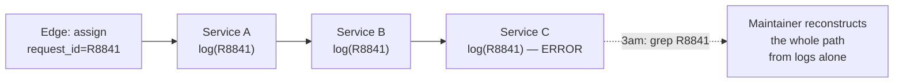
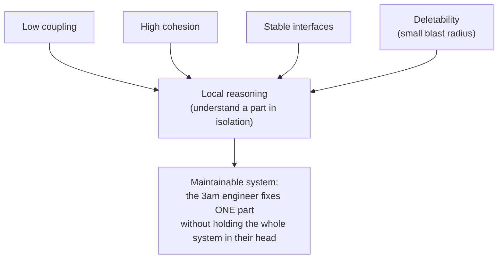
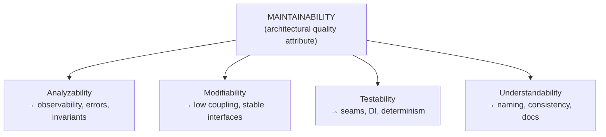
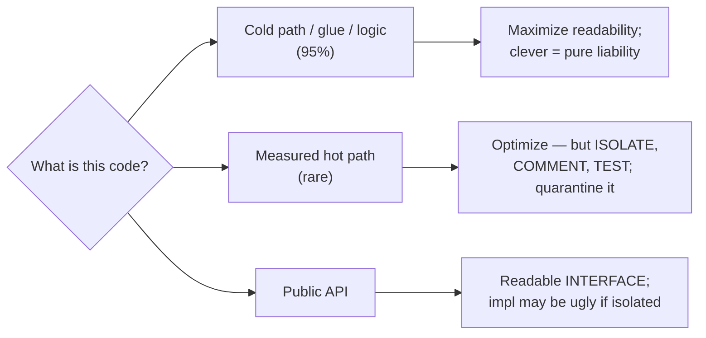

# Code For The Maintainer — Senior

> **Category:** [Design Principles](../../README.md) — write code for the human who will have to read, debug, and change it later — often a future you, at 3 a.m., during an incident, with none of the context you have right now.

> **Prerequisites:** [Junior](junior.md) · [Middle](middle.md)
> **Focus:** **Design trade-offs** and **system-level reasoning**

---

## Introduction

> Focus: **design trade-offs** and **system-level reasoning**

At junior and middle levels, "code for the maintainer" is about *lines and functions*. At the senior level it scales up to a **system-design stance**: maintainability is a first-class quality attribute that you trade against performance, time-to-market, and flexibility — deliberately, with eyes open, the same way you'd trade latency against cost.

This file covers the hard questions:

1. **How do you reason about maintainability at the architecture level** — not "is this function clear" but "can this *system* be operated, debugged, and changed by a team over years?"
2. **How do you design for the incident** — make a distributed system *debuggable* before it breaks, because at 3 a.m. you can only use the observability you already built?
3. **When does maintainability legitimately lose** to another concern — and how do you keep the loss contained?

The senior insight: **you are not writing code for the maintainer; you are designing a *system* the maintainer can survive.** That includes the code, but also the error surfaces, the logs, the traces, the invariants, and the seams that let a person reason locally about one failing part of a large whole.

---

## Maintainability as an Architectural Quality Attribute

In architecture, "maintainability" is one of the **quality attributes** (alongside performance, availability, security) — a property of the *whole system* that you design toward, measure, and trade. The senior move is to treat it with the same rigor as latency or uptime, not as a vague virtue.

Maintainability decomposes into properties you can actually design for:

| Sub-attribute | Question it answers | Design lever |
|---|---|---|
| **Analyzability** | Can a maintainer find the cause of a failure? | Observability, good errors, invariants, small components |
| **Modifiability** | Can they change one thing without breaking others? | Low coupling, high cohesion, stable interfaces |
| **Testability** | Can they verify a change safely before shipping? | Seams, dependency inversion, deterministic boundaries |
| **Understandability** | Can a new person build a mental model? | Naming, consistency, documented decisions, simple structure |

These map directly onto the principle: "code for the maintainer" *is* designing for analyzability and understandability at the line level. The senior addition is that the *same* properties operate at the architecture level — a system with tangled service dependencies is "unreadable" the way a clever one-liner is, just at a scale where no comment can save it.

> The reader-to-writer ratio has an architectural twin: a system is *operated and changed* for years, and *designed* once. Optimize the long phase. The biggest cost in most systems' lives is the team-years of maintenance after launch — so maintainability is, in dollars, often the dominant quality attribute.

---

## Designing for the Incident: Observability as a First-Class Concern

The 3 a.m. maintainer in a distributed system has a brutal constraint: **they can only use the observability you built *before* the incident.** You cannot add a log line to a running outage and get the past back. So debuggability stops being a code-review nicety and becomes an *architectural requirement* you design up front.

The senior framing of debuggability is the **three pillars of observability**, designed in deliberately:

| Pillar | Maintainer's question | Design requirement |
|---|---|---|
| **Logs** (structured) | "What happened on this request?" | Structured fields, consistent schema, correlation/request IDs threaded through every hop |
| **Metrics** | "Is it broken, and how broadly?" | RED/USE metrics, SLO-backed alerts that page on symptoms users feel |
| **Traces** (distributed) | "Where, across N services, did it go wrong?" | Trace context propagated across every service boundary |

The unifying primitive is the **correlation ID**: a single identifier threaded from the edge through every service, log line, and trace span, so the maintainer can reconstruct *one request's* journey across a fleet of services from evidence alone.



Without the correlation ID, the maintainer has thousands of interleaved log lines from many requests and *no way* to tell which belong together — the distributed equivalent of an error message that just says "error." With it, they `grep R8841` and watch the request flow to the exact failing hop.

### Design moves that buy debuggability

- **Propagate context across every boundary** (request ID, trace ID, tenant). A boundary that drops context is a place the maintainer goes blind.
- **Alert on symptoms, not causes.** Page on "checkout error rate > 1%" (what users feel), not "CPU > 80%" (a guess at why). The maintainer needs to know *that it's broken and where it hurts*, fast.
- **Make invariants explicit and enforced.** Validate at boundaries (input validation, schema checks) so corrupt data fails at entry with a clear message, not deep inside as a baffling downstream error.
- **Preserve causal chains.** Exception chaining in code; trace parent-child spans across services. The maintainer follows the chain back to the root.

> You debug an incident with the observability you have, not the observability you wish you'd built. Designing for the incident *is* coding for the maintainer at system scale — and it is up-front work, because you can't retrofit it mid-outage.

(Deep dive: the system-design *Observability* material covers logs/metrics/traces tooling in depth; at code scale, this is the middle-level "debuggability" pillars projected onto a distributed system.)

---

## The Cleverness/Readability/Performance Frontier

Seniors stop treating "readable vs. fast" as a binary and reason about it as a **frontier**: for a given problem, there's a set of acceptable points, and you choose deliberately based on where the code sits in the system.

```
   PERFORMANCE
      ▲
      │   ● hand-optimized hot path          ← justify with profiling,
      │     (clever, ugly, FAST)               isolate, comment heavily
      │
      │        ● idiomatic + fast-enough      ← the default sweet spot
      │           (clear AND adequate)          for ~95% of code
      │
      │               ● naive but obvious     ← fine for cold paths,
      │                  (clear, SLOW)            scripts, glue
      └──────────────────────────────────────▶ READABILITY
```

The senior judgement is **placing each piece of code on this frontier according to its role**, not applying one rule everywhere:

- **Cold paths, glue, configuration, business logic** (the vast majority): maximize readability; performance is irrelevant. Clever code here is pure liability.
- **Measured hot paths** (the rare few): you may move toward performance — but you *pay the maintainability tax deliberately*: isolate the fast code behind a clear interface, comment the trick and its justification, and pin its behavior with tests so the next person can change it.
- **Public/library APIs**: readability of the *interface* matters most (callers depend on it); the implementation behind it can be uglier if isolated and tested.

The mistake juniors make is choosing one point for everything (always clever, or always naive). The senior chooses *per location*, and — critically — **keeps the clever points rare and quarantined** so the system as a whole reads as obvious, with isolated, well-marked exceptions where measurement demanded them.

> Clever code is acceptable in exactly two forms: essential complexity (the problem is hard — document it) and *measured*, *isolated*, *commented* performance optimization. Everything else is accidental difficulty the maintainer pays for.

---

## When Maintainability Trades Against Other Goods

Maintainability is a *high* priority, not an *absolute* one. Seniors name the trades honestly:

| Competing good | When it legitimately wins | How to contain the loss |
|---|---|---|
| **Performance** | Profiled hot path is a real bottleneck | Isolate, comment, test; keep the rest obvious |
| **Time-to-market** | A throwaway spike / prototype to validate an idea | Mark it as throwaway; don't let the prototype become the product without a rewrite pass |
| **Backward compatibility** | A public API can't change without breaking clients | Keep the ugly compatibility shim isolated and well-commented (it's a one-way door) |
| **Security / correctness** | A constant-time crypto comparison must not "read naturally" | Comment *why* the obvious version is wrong (timing attack); cite the requirement |
| **Hard domain constraints** | Real-time, embedded, memory-bound code | Document the constraint; the constraint is the reason, not author preference |

The senior discipline is **containment**: when maintainability loses, you lose it in a *small, marked, isolated* place — never as a diffuse degradation across the codebase. A single heavily-commented constant-time comparison is fine; a codebase where "we don't have time to make it clear" is the norm is a death spiral.

> The danger isn't the occasional justified trade against maintainability — it's the *unjustified, unmarked, diffuse* erosion: a thousand small "I'll clean it up later"s that compound into a system no one can change. Seniors guard the *aggregate*, not just each line.

---

## Local Reasoning, Coupling, and Deletability

The deepest senior insight about maintainability: **it is mostly about whether a maintainer can reason about a part in isolation.** Naming and comments are the surface; *local reasoning* is the substance, and it's governed by coupling.

A system supports local reasoning when a maintainer can understand and safely change one component *without* loading the rest into their head. The enablers:

- **Low coupling** — a change to A doesn't force understanding (or breaking) of B, C, D. (See [Minimise Coupling](../../02-coupling-and-cohesion/01-minimise-coupling/senior.md).)
- **High cohesion** — a component does one thing, so its behavior is predictable from its name.
- **Stable, narrow interfaces** — the maintainer reasons about the *contract*, not every implementation that depends on it.
- **Deletability** — and this is the senior connection — **code that is easy to delete is code that is easy to reason about locally.** If you can delete a module without tracing a hundred hidden dependents, then its blast radius is small, its coupling is low, and a maintainer can change it confidently. (See [Optimize for Deletion](../06-optimize-for-deletion/senior.md).)



The reframing: **"code for the maintainer" at the system level means "design for local reasoning."** A maintainer who must understand everything to change anything is the worst maintainability outcome there is — and no amount of clear naming inside a tightly-coupled tangle rescues it. The lever is *structural*: reduce coupling, raise cohesion, make pieces deletable. Maintainability is an emergent property of those structural choices.

---

## The Relationship to KISS, PoLA, and the Craftsmanship Ethos

"Code for the maintainer" is not a standalone rule — it's the *purpose* several other principles serve:

- **[KISS](../01-kiss/senior.md)** ("keep it simple"): KISS is the *method*; "code for the maintainer" is the *motive*. You keep it simple *because* a simple thing is what the maintainer can understand and change. KISS without the maintainer-motive degenerates into "simplistic" (oversimplified to the point of wrong); the maintainer-motive keeps it honest — simple *enough to understand*, not simpler than the problem allows.
- **Principle of Least Astonishment**: PoLA is "code for the maintainer" applied to *behavior*. Astonishing behavior is unmaintainable behavior — every surprise is context the maintainer must discover and carry.
- **Naming**: a good name is the highest-leverage form of writing-for-the-maintainer; naming *is* design (the struggle to name something is the struggle to understand it).
- **The craftsmanship ethos / Boy Scout Rule**: professionalism is, in large part, *responsibility to the maintainer.* "Leave it cleaner than you found it" (Boy Scout Rule) is the maintainer principle expressed as a *habit* — you maintain the codebase's maintainability incrementally, every time you touch it.

The synthesis: **most code-level principles are, at root, "code for the maintainer" wearing different hats.** KISS, YAGNI, DRY-done-right, low coupling, PoLA, good naming — each is a *technique* for the single end of producing code a human can read, debug, and change. Seeing them this way is the senior unification: you're not following seven rules, you're serving one reader.

> "Clean code" is not an aesthetic — it's an act of empathy and economics directed at the person (often you) who maintains the system. The craftsman writes for that person because they have *been* that person at 3 a.m.

---

## Code Examples — Advanced

### Containing a justified performance optimization (Java)

```java
// PUBLIC, OBVIOUS interface — callers see only clarity.
public boolean isMember(int candidate) {
    return membership.contains(candidate);   // clear contract
}

// PRIVATE, FAST, UGLY — isolated, justified, commented, tested.
private final long[] bitset;   // PERF-2210: 50M lookups/sec on the match path.
                               // A HashSet<Integer> boxed 12GB and GC-thrashed;
                               // a primitive bitset is 8× faster and 40× smaller.
                               // Invariant: candidates are dense in [0, capacity).
                               // If that stops holding, REVERT to HashSet — the
                               // clarity isn't worth the speed once it's sparse.
private boolean bitsetContains(int x) {
    return (bitset[x >>> 6] & (1L << x)) != 0;
}
```

The clever bit-twiddling is *quarantined* behind a clear public method, *justified* by a referenced measurement, *bounded* by a stated invariant, and given an *exit condition* (when to revert). A maintainer at 3 a.m. reads the comment and knows exactly what they're looking at and when to throw it away. That is how you spend a maintainability budget responsibly.

### Designing the error surface for the maintainer (TypeScript)

```typescript
// Maintainer-hostile: loses the cause, the input, and the location.
async function loadOrder(id: string): Promise<Order> {
  try {
    return await db.orders.find(id);
  } catch {
    throw new Error("load failed");        // no id, no cause, no clue
  }
}

// Maintainer-designed: typed error, preserved cause, actionable context,
// and a correlation id the on-call engineer can grep across services.
async function loadOrder(id: string, ctx: RequestContext): Promise<Order> {
  try {
    return await db.orders.find(id);
  } catch (cause) {
    throw new OrderLoadError(
      `Failed to load order ${id} (request ${ctx.requestId}, tenant ${ctx.tenant})`,
      { cause }                            // preserves the original stack/chain
    );
  }
}
```

The second version is designed *as a debugging surface*: the maintainer gets the order id, the request id to correlate across services, the tenant, a typed error to catch specifically, and the original cause chained in. The first version turns an outage into an archaeology project.

---

## Liabilities

### Liability 1: "Readable" as a euphemism for "I never measured"

Used carelessly, "code for the maintainer" becomes an excuse to *never* optimize — shipping clear code that's too slow for production, then blaming "we prioritized readability." The principle says clear-*first* and optimize the *measured* hot path; it never says "ignore measured performance problems." Maintainability and performance are both quality attributes; trading them blindly in either direction is the error.

### Liability 2: Comment rot at scale

A large codebase accumulates comments that the code outgrew; they now *misinform* maintainers systematically. The senior responsibility is treating stale comments as defects (update or delete on every change) and biasing toward self-explaining code so there's less to rot.

### Liability 3: Observability theater

Logging everything is not observability — it's noise that *hides* the signal and costs a fortune to store. Debuggability is designed (correlation IDs, symptom alerts, structured fields), not achieved by volume. A maintainer drowning in unstructured logs is no better off than one with none.

### Liability 4: Diffuse, unmarked maintainability erosion

The real killer is not one ugly function but a *thousand* "I'll clean it later"s that no one marks, justifies, or comes back to. Seniors guard the aggregate: contain every justified trade in a small, marked place, and refuse the unjustified ones at review.

---

## Pros & Cons at the System Level

| Dimension | Optimizing for the maintainer | Optimizing for write-speed / cleverness |
|---|---|---|
| Cost of the first write | Slightly higher (find the clear form) | Lower |
| Cost over the system's life | **Low** (cheap to read, debug, change) | **High** (every read/debug/change taxed) |
| Incident resolution time (MTTR) | Low — debuggable by design | High — puzzle under pressure |
| Onboarding new engineers | Fast — local reasoning, clear names | Slow — must learn the whole tangle |
| Adaptability to change | High — low coupling, deletable | Low — change ripples unpredictably |
| Risk on a measured hot path | Possibly too slow if never optimized | Fast (but fragile if uncommented) |
| Best domain | The 95%: business logic, services, glue | The rare 5%: measured, isolated hot paths |

The table makes the senior stance precise: optimizing for the maintainer wins on every row *except* raw hot-path performance — which is why seniors maximize maintainability everywhere and carve out *small, marked, measured* exceptions for the rare performance-critical code, keeping the system as a whole obvious.

---

## Diagrams

### Maintainability decomposed into design levers



### Place each piece of code on the frontier — deliberately



---

## Related Topics

- **The method behind the motive:** [KISS](../01-kiss/senior.md)
- **Behavioral version:** Principle of Least Astonishment (see [Middle](middle.md))
- **Structural enablers:** [Minimise Coupling](../../02-coupling-and-cohesion/01-minimise-coupling/senior.md), [Optimize for Deletion](../06-optimize-for-deletion/senior.md)
- **The habit:** Boy Scout Rule
- **The trade-off partner:** [Avoid Premature Optimization](../05-avoid-premature-optimization/senior.md)

---


---

## Check your understanding

1. Explain Code For The Maintainer — Senior Level in your own words and name the problem it solves.
2. How would you apply the ideas around Table of Contents, Introduction, Maintainability as an Architectural Quality Attribute in a realistic engineering change?
3. What failure mode or misuse should you look for, and what evidence would reveal it?
4. How would you validate a system-level decision about Code For The Maintainer — Senior Level under uncertainty?
5. What observable result would convince you that the approach improved the system?
