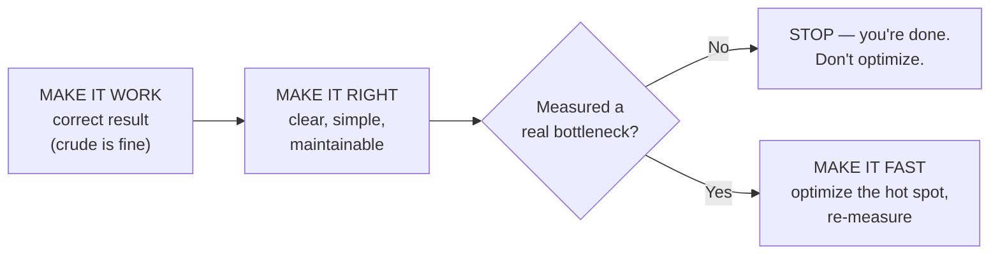
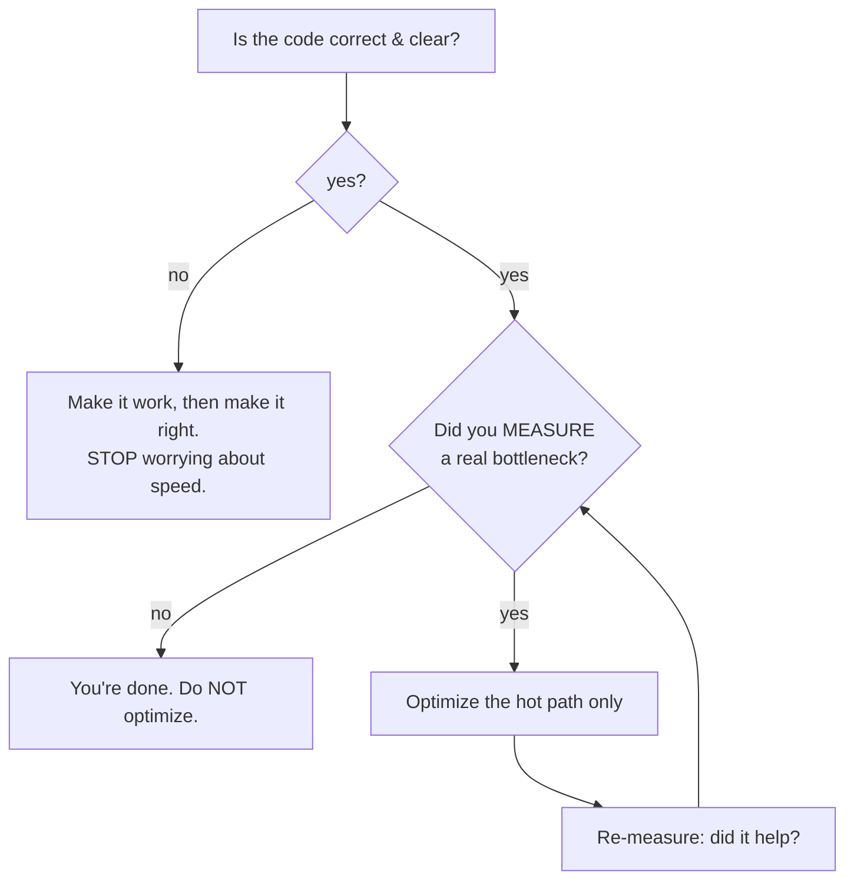

# Avoid Premature Optimization — Junior

> **Category:** [Design Principles](../../README.md) — make it work, make it right, then — only if measurement says you must — make it fast.

---

## Table of Contents

1. [Introduction](#introduction)
2. [Prerequisites](#prerequisites)
3. [Glossary](#glossary)
4. [The Knuth Quote — In Full](#the-knuth-quote--in-full)
5. [Make It Work, Make It Right, Make It Fast](#make-it-work-make-it-right-make-it-fast)
6. [Why Premature Optimization Harms](#why-premature-optimization-harms)
7. [Humans Are Terrible at Guessing Hot Spots](#humans-are-terrible-at-guessing-hot-spots)
8. [Real-World Analogies](#real-world-analogies)
9. [Mental Models](#mental-models)
10. [Code Examples](#code-examples)
11. [The One Optimization That Almost Always Wins: Big-O](#the-one-optimization-that-almost-always-wins-big-o)
12. [Best Practices](#best-practices)
13. [Common Mistakes](#common-mistakes)
14. [Tricky Points](#tricky-points)
15. [Test Yourself](#test-yourself)
16. [Cheat Sheet](#cheat-sheet)
17. [Summary](#summary)
18. [Further Reading](#further-reading)
19. [Related Topics](#related-topics)
20. [Diagrams](#diagrams)

---

## Introduction

> Focus: **What is it?** and **How to use it?**

**Avoid premature optimization** is the discipline of *not* speeding up code until you have a real, measured reason to. You write the **simplest correct code first**, and you only make it faster *after* a profiler — not a hunch — has shown you which part is actually slow.

The principle gets its name from the most-quoted sentence in software engineering:

> *"Premature optimization is the root of all evil."* — Donald Knuth, 1974

That sentence is also the most-**misquoted** one. People wield it to mean "never think about performance," which is the opposite of what Knuth said. The full quote (below) is a call to **measure first** and then optimize the small part that matters — not a ban on optimizing.

So the principle is really two instructions in one:

1. **Don't** hand-tune code before you know it's a bottleneck. (That's the "premature" part — optimizing too early, on the wrong code.)
2. **Do** optimize the critical part once measurement proves it's critical.

### Why this matters

Optimization is not free. Faster code is almost always **more complex** code: a clever bit-trick, a hand-rolled cache, an unrolled loop, a denormalized field. Every bit of that complexity costs you readability, invites bugs, and is harder to change. If you pay that cost on code that *isn't* slow, you've made your program worse for **zero** speed benefit — because a function that runs for 0.1% of the total time can't make your program meaningfully faster no matter how fast you make it.

The result: most premature optimization is **pure cost.** You traded clarity for a speedup nobody can measure.

---

## Prerequisites

- **Required:** You can write and run **automated tests** — you optimize *after* the code is correct, and tests are what tell you it stays correct.
- **Required:** Comfort with functions, loops, and basic data structures (lists, sets, maps/dictionaries).
- **Helpful:** A first feel for **[KISS](../01-kiss/junior.md)** — the simplest thing that works — since premature optimization is one of the main ways simple code gets complicated.
- **Helpful:** Exposure to **[YAGNI](../02-yagni/junior.md)** — "You Aren't Gonna Need It" — because speculative speed is a close cousin of speculative features.

---

## Glossary

| Term | Definition |
|------|-----------|
| **Optimization** | Changing code to make it use fewer resources (time, memory, I/O) — usually at the cost of simplicity. |
| **Premature optimization** | Optimizing before you know the code is a bottleneck, or optimizing code that isn't one. |
| **Bottleneck / hot spot** | The small part of a program where most of the time is actually spent. |
| **Profiling** | Running a program with a tool that *measures* where time and memory actually go. |
| **Micro-optimization** | A tiny local speedup (a loop tweak, a cheaper operation) that rarely changes the big picture. |
| **Big-O / algorithmic complexity** | How a program's cost grows as the input grows — e.g. `O(n)` vs `O(n²)`. The thing that usually matters most. |
| **Premature pessimization** | The opposite mistake: choosing a *gratuitously slow* approach when an equally simple fast one exists. |

---

## The Knuth Quote — In Full

Almost everyone quotes seven words. Here is the actual passage, from Donald Knuth's 1974 paper *"Structured Programming with `go to` Statements"*:

> *"Programmers waste enormous amounts of time thinking about, or worrying about, the speed of noncritical parts of their programs, and these attempts at efficiency actually have a strong negative impact when debugging and maintenance are considered. We should forget about small efficiencies, say about 97% of the time: **premature optimization is the root of all evil.** Yet we should not pass up our opportunities in that critical 3%."*

Read the whole thing and the meaning flips:

- **"noncritical parts"** — Knuth is talking about the code that *doesn't matter* to performance. Optimizing it is a waste.
- **"strong negative impact when debugging and maintenance are considered"** — the cost of optimization is that the code gets harder to debug and maintain.
- **"97% of the time"** — most of your code isn't performance-critical, so most of the time you should *not* be optimizing.
- **"that critical 3%"** — but there *is* a critical part, and Knuth explicitly says **do not pass it up.** Optimizing the hot 3% is the *whole point*; the discipline is finding it (by measuring) instead of guessing.

> Knuth was not saying "never optimize." He was saying: **find the critical 3% by measuring, optimize that, and stop wasting effort on the other 97%.** The famous half is a warning; the forgotten half is a duty.

*(A historical note you'll hear: the line is sometimes attributed to Tony Hoare. Knuth credited the sentiment widely and is the one who put it in print, so it's the Knuth quote in practice.)*

---

## Make It Work, Make It Right, Make It Fast

Kent Beck compressed the whole discipline into a six-word order of operations:

> **"Make it work, make it right, make it fast."** — Kent Beck

The order is the lesson:

1. **Make it work** — get a correct result, even crudely. Correctness is the floor; nothing else counts until this holds.
2. **Make it right** — clean it up: clear names, no duplication, simple structure. Now it's *maintainable*.
3. **Make it fast** — *only now*, and *only if* you have a measured reason, do you optimize — and you optimize the part the profiler points at.

The trap is jumping straight to step 3. Beginners often write their first draft already worrying about speed ("I'll use a clever loop here to save time"), and end up with code that is slower to *write*, harder to *read*, and — because it was never measured — usually no faster to *run*.



Notice the gate before "make it fast": **most code never reaches it**, and that's correct.

---

## Why Premature Optimization Harms

Optimizing too early isn't neutral — it actively damages the code:

| Harm | What happens |
|---|---|
| **Adds complexity** | A clever fast version has more moving parts than the obvious one. It fights [KISS](../01-kiss/junior.md). |
| **Obscures intent** | A hand-tuned loop or bit-trick hides *what* the code is computing behind *how* it's squeezing speed. |
| **Introduces bugs** | More complexity = more places to get it wrong. Off-by-one errors, broken edge cases, cache-invalidation bugs. |
| **Couples to assumptions** | A cache or a precomputed table bakes in assumptions ("this rarely changes") that the next requirement breaks. |
| **Wastes effort** | Time spent speeding up the 97% that wasn't slow is time not spent on features, tests, or the real 3%. |
| **Gets undone anyway** | The optimized code is often deleted or rewritten when requirements change — you optimized something that didn't survive. It fights [YAGNI](../02-yagni/junior.md). |

The single sentence: **you pay a real, certain cost (complexity, bugs, time) for a speed benefit that is usually zero, because the code wasn't on the critical path.**

---

## Humans Are Terrible at Guessing Hot Spots

Here is the empirical fact that justifies "measure first": **programmers are reliably bad at guessing which part of their code is slow.** Decades of profiling experience say the same thing — the bottleneck is almost never where the author expected.

Why? Because our intuition fixates on code that *looks* expensive (a big nested loop, a "heavy" function name) and ignores the real culprits, which are usually invisible at the source level:

- A function called in a **tight loop a million times** — each call is cheap, but the count is enormous.
- A surprise **database query inside a loop** (the N+1 problem) — looks like one line, costs a thousand round-trips.
- **Memory allocation** or string concatenation that the language quietly does behind a clean-looking expression.
- **I/O** (disk, network) that dwarfs any amount of CPU work nearby.

Because intuition is unreliable, the only honest way to find the hot spot is to **profile** — run a tool that *measures* where the time goes. You'll be surprised most times you do it, and that surprise is exactly why the principle exists.

> Optimize against **data, not intuition.** "I think this is slow" is not a reason to optimize. "The profiler shows this takes 60% of the time" is.

---

## Real-World Analogies

| Concept | Analogy |
|---|---|
| **Profile before optimizing** | A doctor runs tests before prescribing. You don't operate on a patient because of a hunch about which organ hurts. |
| **The 97% / 3% split** | A road network: a few intersections carry most of the traffic. Widening a quiet country lane doesn't reduce the city's congestion. |
| **Premature optimization** | Tuning a race-car engine that's still up on blocks in the garage — you haven't even driven it, so you don't know what's slow. |
| **Micro-optimization on cold code** | Polishing the doorknobs on a house that's on fire. Technically an improvement; completely beside the point. |
| **Optimizing against data** | Following the map's traffic-flow overlay, not your gut feeling about which route "feels" faster. |

---

## Mental Models

**The intuition:** *"First make it correct and clear. Then, if and only if a measurement proves a part is slow, make that part fast — and nothing else."*

```
   TIME SPENT IN A TYPICAL PROGRAM
   ┌──────────────────────────────────────────────┐
   │██ 3% critical (the hot path) — optimize THIS  │
   ├──────────────────────────────────────────────┤
   │░░░░░░░░░░░░░░░░░░░░░░░░░░░░░░░░░░░░░░░░░░░░░░░░│
   │  97% noncritical — DON'T optimize this        │
   └──────────────────────────────────────────────┘
   Premature optimization = pouring effort into the 97%.
   The job is to FIND the 3% (by measuring) and optimize it.
```

A second model: optimization is a **loan**. You borrow speed and pay interest in complexity forever after. Sometimes the loan is worth it (the hot 3%). But taking out a loan you don't need — borrowing speed for code that was never slow — means paying interest for nothing.

---

## Code Examples

### A needless micro-optimization that hurts readability (Python)

A junior "optimizes" a sum, convinced the obvious version is wasteful:

```python
# "Optimized" — manual indexing to "avoid iterator overhead"
def total_price(items):
    t = 0
    i = 0
    n = len(items)
    while i < n:
        t += items[i].price * items[i].qty
        i += 1
    return t
```

```python
# Simple — and on any real interpreter, NOT slower in any way that matters
def total_price(items):
    return sum(item.price * item.qty for item in items)
```

The "optimized" version is longer, easier to get wrong (the index bookkeeping), and harder to read — and it doesn't speed up anything you'd ever measure. This is premature optimization in miniature: real cost, imaginary benefit.

### The optimization that actually matters: fix the algorithm (Python)

Now a *real* problem. We want to know which orders belong to known customers:

```python
# SLOW — O(n × m): for each order, scan the whole customer list
def flagged_orders(orders, vip_customers):          # vip_customers is a list
    result = []
    for order in orders:
        if order.customer_id in vip_customers:      # 'in' on a LIST is O(m)
            result.append(order)
    return result
```

With 100,000 orders and 100,000 VIPs, that inner `in` scans the list every time — roughly **10 billion** comparisons. No amount of loop-tweaking saves it. The fix is **algorithmic**, and it's *simpler*, not more complex:

```python
# FAST — O(n + m): a set makes membership O(1)
def flagged_orders(orders, vip_customers):
    vip_ids = set(vip_customers)                    # build once: O(m)
    return [o for o in orders if o.customer_id in vip_ids]  # each check: O(1)
```

This is the key contrast for a junior to internalize: the micro-optimization above made the code **worse for no gain**, while this algorithmic fix made the code **faster *and* cleaner**. Choosing the right data structure isn't "premature optimization" — it's just writing good code.

### A profiling-driven workflow (Python)

When you *do* suspect something is slow, don't guess — measure:

```python
import cProfile, pstats

def main():
    process_all_orders(load_orders())

cProfile.run("main()", "profile.out")

stats = pstats.Stats("profile.out")
stats.sort_stats("cumulative").print_stats(10)   # show the 10 costliest calls
```

```text
   ncalls  tottime  cumtime  function
   100000    0.04     8.91    flagged_orders        ← 8.9s of a 9.2s run lives HERE
        1    0.10     0.30    load_orders
   100000    0.02     0.05    format_receipt        ← tiny; DON'T touch it
```

The profiler points a finger: `flagged_orders` is the 3%. You optimize *that* (the set fix above) and leave `format_receipt` alone — optimizing it would be effort spent in the 97%.

---

## The One Optimization That Almost Always Wins: Big-O

If you remember one thing: **algorithmic complexity (Big-O) usually dwarfs every micro-optimization.** Picking the right data structure or algorithm beats hand-tuning a loop, by orders of magnitude, on any non-trivial input.

| Approach | What it does | Typical impact |
|---|---|---|
| **Micro-optimization** | Tweak a loop, swap an operator, inline a call | A few percent — and often unmeasurable |
| **Algorithmic fix (Big-O)** | `O(n²)` → `O(n)`, list → set, add an index | 10×, 100×, 1000× on large inputs |

A hand-tuned `O(n²)` loop loses to a plain, readable `O(n)` one the moment the input gets big. So the *first* performance question is never "how do I make this loop faster?" — it's **"is there a fundamentally cheaper approach?"** Fixing `O(n²) → O(n)` is not premature optimization; it's the difference between code that scales and code that falls over. (Deeper at the [Middle](middle.md) level, including Amdahl's Law.)

---

## Best Practices

1. **Make it work, make it right, then make it fast — in that order.** Don't optimize a draft that isn't correct and clean yet.
2. **Measure before you optimize.** A profiler, a timer, a benchmark — *data*, not a hunch. If you can't measure a speedup, you don't have one.
3. **Optimize the hot 3%, ignore the cold 97%.** Spend effort only where measurement says it counts.
4. **Get the Big-O right from the start.** Choosing a set over a list, or an index over a scan, isn't premature — it's just good code.
5. **Keep the simple version around.** When you do optimize, keep the clear code (in a comment or test) so the fast version's intent stays recoverable.
6. **Re-measure after optimizing.** Confirm the change actually helped — sometimes "optimizations" make things slower.

---

## Common Mistakes

1. **Quoting only "premature optimization is the root of all evil."** Dropping the second half ("…that critical 3%") turns Knuth's advice into an excuse to never optimize.
2. **Optimizing by intuition.** "This *feels* slow" leads you to tune code that isn't on the hot path. Profile instead.
3. **Confusing micro-optimization with design.** Choosing the right data structure (set vs list) is *design*, not premature optimization — don't skip it in the name of "simplicity."
4. **Sacrificing clarity for an unmeasured speedup.** A cryptic one-liner that "saves time" you never measured is a pure loss.
5. **Optimizing the 97%.** Speeding up code that runs rarely or cheaply can't help the total — see Amdahl's Law at [Middle](middle.md).
6. **Premature *pessimization*** — the opposite mistake: deliberately picking a slow approach (an `O(n²)` scan, a query in a loop) when an equally simple fast one exists. Avoiding *premature* optimization is not a license to write *gratuitously* slow code.

---

## Tricky Points

- **"Premature" is the load-bearing word.** Optimization isn't evil; optimization *before measurement* is. The principle tells you *when*, not *whether*.
- **The forgotten 3% is mandatory, not optional.** Knuth said do **not** pass up the critical part. Once you've measured a bottleneck, *not* optimizing it would be the mistake.
- **Algorithmic choice is not "optimization" in the dangerous sense.** Using a hash set instead of a linear scan is just correct engineering. The principle targets *micro*-tuning of *non-bottleneck* code, not "always write the slowest thing." (This distinction — micro-optimization vs design-level performance — is the heart of the [Middle](middle.md) and [Senior](senior.md) levels.)
- **"Make it fast" can be empty.** For most code, the honest answer to "is it fast enough?" is "yes, already" — and you do nothing. That's a success, not a skipped step.

---

## Test Yourself

1. Quote the **full** Knuth sentence (both halves). What does the second half add?
2. State Kent Beck's three-step order and why "make it fast" is last.
3. Why is profiling necessary — why not just optimize the code that looks slow?
4. Name three concrete harms of optimizing too early.
5. Why does fixing `O(n²) → O(n)` usually beat hand-tuning a loop?
6. What is *premature pessimization*, and how is it the opposite mistake?

---

## Cheat Sheet

```text
THE PRINCIPLE
  Make it WORK → make it RIGHT → make it FAST  (in that order)
  Optimize ONLY after MEASURING a real bottleneck.

KNUTH, IN FULL (don't quote half of it)
  "...premature optimization is the root of all evil.
   Yet we should not pass up our opportunities in that critical 3%."
  → measure first, optimize the hot 3%, ignore the cold 97%.

WHY EARLY OPTIMIZATION HARMS
  + complexity  + bugs  + obscured intent  + wasted effort
  - usually ZERO speed benefit (the code wasn't the bottleneck)

DO THIS INSTEAD
  Profile → find the hot path → fix it → re-measure.
  Get Big-O right from the start (set>list, index>scan) — that's design, not premature.

DON'T
  optimize by intuition · sacrifice clarity for unmeasured speed
  · premature PESSIMIZATION (gratuitously slow when fast is just as simple)
```

---

## Summary

- **Avoid premature optimization** = don't speed up code until a **measurement** proves a part is slow; then optimize *that* part.
- The **full Knuth quote** has two halves: forget the 97% noncritical code, but **do not pass up the critical 3%.** Optimization isn't evil — *premature* (un-measured) optimization is.
- **"Make it work, make it right, make it fast"** — in that order. Most code never needs the third step.
- Early optimization **harms**: complexity, obscured intent, bugs, wasted effort — usually for *zero* real speedup (fights [KISS](../01-kiss/junior.md) and [YAGNI](../02-yagni/junior.md)).
- **Profile, don't guess** — humans are terrible at finding hot spots.
- **Big-O usually wins.** Fixing `O(n²) → O(n)` beats any loop tweak, and choosing the right data structure is good design, not premature optimization.
- The opposite mistake is **premature pessimization** — needlessly slow code when fast is just as simple.

---

## Further Reading

- Donald Knuth, *Structured Programming with `go to` Statements* (1974) — the paper with the full quote, in context.
- Kent Beck — "Make it work, make it right, make it fast."
- [KISS](../01-kiss/junior.md) and [YAGNI](../02-yagni/junior.md) — the sibling principles premature optimization most often violates.
- The [Design Principles overview](../../README.md) — how this fits among KISS, DRY, and the rest.

---

## Related Topics

- **Sibling principles:** [KISS](../01-kiss/junior.md), [YAGNI](../02-yagni/junior.md), [Optimize for Deletion](../06-optimize-for-deletion/junior.md).
- **Up:** [Design Principles](../../README.md).

---

## Diagrams




---

## Check your understanding

1. Explain Avoid Premature Optimization — Junior Level in your own words and name the problem it solves.
2. How would you apply the ideas around Table of Contents, Introduction, Prerequisites in a realistic engineering change?
3. What failure mode or misuse should you look for, and what evidence would reveal it?
4. What small example would prove that you can apply Avoid Premature Optimization — Junior Level correctly?
5. What observable result would convince you that the approach improved the system?
