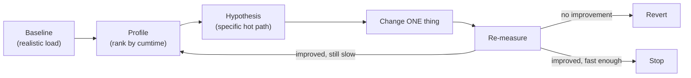
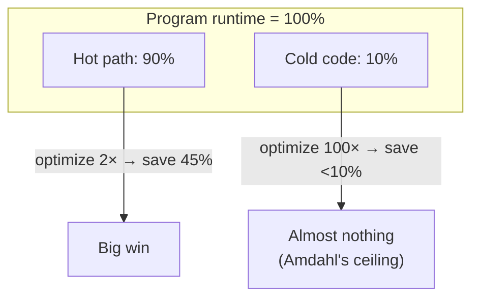
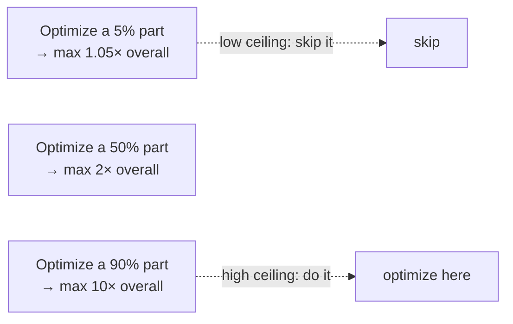
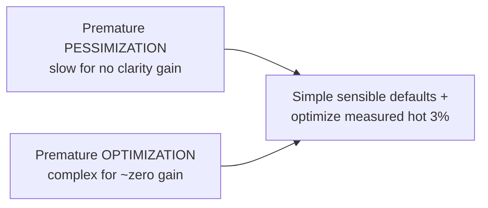

# Avoid Premature Optimization — Middle

> **Category:** [Design Principles](../../README.md) — make it work, make it right, then — only if measurement says you must — make it fast.

> **Prerequisite:** [Junior](junior.md)
> **Focus:** **Why** and **When**

---

## Introduction

> Focus: **Why** and **When**

At the junior level, "avoid premature optimization" is a slogan with a workflow attached: *make it work, make it right, measure, then make the hot part fast.* At the middle level it becomes a set of **quantitative judgement calls**: *How much can optimizing this function possibly help? Is this a micro-optimization or a design decision? Am I about to defer something I should actually decide now?*

The middle-level skill is learning to separate **two things the slogan deliberately blurs**:

- **Micro-optimization** — local, constant-factor speedups (loop tweaks, cheaper operations). These are what you defer until measurement demands them.
- **Design-level performance** — the data model, the choice of algorithm, where the network and database calls live. These are **not** premature; deferring them is one of the most expensive mistakes in software.

Most engineers learn the slogan and then over-apply it, using "avoid premature optimization" to wave away an obvious `O(n²)` or an N+1 query. That is misuse. The principle defers *micro*-tuning of *non-bottleneck* code; it never licenses bad algorithmic or architectural choices. Getting this boundary right is the whole job.

---

## The Profiling-First Workflow

The discipline that makes "don't optimize prematurely" actionable is **profile first, optimize second, measure again.** Concretely:

1. **Establish a baseline.** Measure current performance under a realistic workload. No baseline → no way to prove an "optimization" helped.
2. **Profile to find the hot path.** Run a profiler; rank functions by *cumulative* time. The top few entries are your candidate 3%.
3. **Form a hypothesis.** "`flagged_orders` is 80% of the runtime because of a linear membership check." A specific, testable claim — not "this feels slow."
4. **Change one thing.** Optimize the single hottest path; keep the diff small.
5. **Re-measure against the baseline.** Confirm the speedup is real and big enough to justify the added complexity. If it isn't, **revert** — you've only added risk.
6. **Stop when fast enough.** Performance work has a target (a budget, an SLA). Once you hit it, stop; further tuning is back in premature-optimization territory.



The two non-negotiables: **measure before** (or you optimize the wrong thing) and **measure after** (or you can't tell if you helped — and "optimizations" routinely make code *slower* by defeating a compiler optimization, blowing a cache, or adding overhead). For tooling depth, see [profiling techniques](../../../README.md) for your language's profiler, flame graphs, and microbenchmark harnesses (JMH for Java, `pytest-benchmark`/`timeit` for Python, `go test -bench`/`pprof` for Go).

---

## Amdahl's Law: Why the 97% Can't Help You

The mathematical reason "optimize the hot path, ignore the rest" works is **Amdahl's Law.** It bounds how much faster a program can get when you speed up *one part* of it.

> If a part of the program accounts for fraction **p** of the total runtime, and you speed *that part* up by factor **s**, the overall speedup is at most:
>
> `overall_speedup = 1 / ((1 − p) + p/s)`

The consequence is brutal for premature optimizers: **the speedup is capped by the part you *didn't* touch.** Concretely:

| Fraction of runtime (p) | You make it ∞ times faster (s → ∞) | Max overall speedup |
|---|---|---|
| 5% of runtime | even *infinitely* fast | **1.05×** (you saved 5%) |
| 50% | infinitely fast | 2× |
| 90% | infinitely fast | 10× |
| 95% | infinitely fast | 20× |

Read the first row again: if a function is 5% of the runtime, then *deleting it entirely* — making it take zero time — speeds the whole program up by only **5%.** No amount of cleverness on a 5%-of-runtime function can do better than that. This is the precise, mathematical statement of "don't optimize the 97%": effort spent there is *bounded* to be nearly worthless, no matter how brilliant the optimization.



The flip side is the *positive* lesson: a 2× speedup on the 90%-of-runtime path beats an infinite speedup on everything else. **Always spend your optimization budget on the largest fraction first.** That is what profiling tells you, and Amdahl's Law is why it's the right thing to ask.

---

## Latency Numbers Every Programmer Should Know

Profiling tells you *where* the time goes; **orders-of-magnitude latency numbers** tell you *why*, and let you sanity-check whether an optimization is even worth attempting. The famous "numbers every programmer should know" (Jeff Dean / Peter Norvig, approximate, modern hardware):

| Operation | Approx. latency | Relative |
|---|---|---|
| L1 cache reference | ~1 ns | 1× |
| Branch mispredict | ~3 ns | |
| L2 cache reference | ~4 ns | ~4× |
| Main memory (RAM) reference | ~100 ns | ~100× |
| Read 1 MB sequentially from RAM | ~3 µs | |
| SSD random read | ~16 µs | ~16,000× L1 |
| Round trip within a datacenter | ~500 µs | ~500,000× L1 |
| Read 1 MB sequentially from SSD | ~1 ms | |
| Disk (HDD) seek | ~10 ms | ~10,000,000× L1 |
| Network round trip CA → Netherlands → CA | ~150 ms | ~150,000,000× L1 |

The point is not to memorize them but to internalize the **gaps**: memory is ~100× slower than cache; an SSD is ~1000× slower than memory; a network hop is ~1000× slower again; a cross-continent round trip is ~150,000,000× a cache hit. The engineering consequence:

> **Micro-optimizing CPU/cache work next to an I/O call is optimizing the 97%.** If your function makes a network call (150 ms) and you shave 50 ns off a loop beside it, you improved performance by 0.00003%. The dominant cost is *always* the slowest layer present.

This is why "where do the network and database calls live?" is a **design-level** performance question that beats every micro-optimization — one removed round trip is worth millions of saved CPU cycles.

---

## Micro-Optimization vs Design-Level Performance

This is the central middle-level distinction. The Knuth principle defers the first column and demands you think about the second.

| | **Micro-optimization** (defer) | **Design-level performance** (consider early) |
|---|---|---|
| **Examples** | Loop unrolling, `++i` vs `i++`, bit tricks, inlining, caching a local | Data structure choice, Big-O of the algorithm, data model, N+1 queries, chattiness, batching |
| **Typical impact** | A few % — often unmeasurable | 10×–1000×; can decide whether the system works at all |
| **Cost to change later** | Cheap — local edit behind tests | **Expensive** — touches schema, API, many call sites |
| **When to do it** | After profiling proves it's the hot path | When you design the component |
| **Is deferring it "premature"?** | No — deferring is *correct* | **No — deferring is the costly mistake** |
| **Readability effect** | Usually *worse* (cryptic) | Often *neutral or better* (a set is as clear as a list) |

The asymmetry in the "cost to change later" row is the whole reason design-level performance isn't premature. A micro-optimization you skipped today is a five-minute edit tomorrow, guided by a profiler. A bad data model or an N+1 query pattern, once threaded through the schema and a hundred call sites, is a multi-week migration. **You defer what's cheap to add later and decide early what's expensive to change later.** (This reversibility test is the same one that governs [YAGNI](../02-yagni/middle.md).)

### The N+1 query: the canonical "not premature" fix

```python
# DESIGN-LEVEL BUG (not a micro-optimization): one query per order = N+1
def order_summaries(orders):
    return [
        f"{o.id}: {get_customer(o.customer_id).name}"   # 1 DB round trip EACH
        for o in orders
    ]
# 1000 orders → 1000 network round trips → ~500 ms just in latency

# FIX: batch — one query for all customers. Simpler call pattern, 1000× fewer trips.
def order_summaries(orders):
    ids = {o.customer_id for o in orders}
    customers = get_customers(ids)                       # ONE round trip
    by_id = {c.id: c for c in customers}
    return [f"{o.id}: {by_id[o.customer_id].name}" for o in orders]
```

Nobody should defer this in the name of "avoid premature optimization." It's not a micro-optimization — it's the difference between one round trip and a thousand, and (per the latency table) the round trips dominate everything. Calling this fix "premature" is the most common abuse of the principle.

---

## Premature Optimization vs Premature Pessimization

Herb Sutter named the opposite error: **premature pessimization** — gratuitously choosing a slower approach when an equally simple, equally clear faster one exists.

> *"Premature pessimization is when you write code that is slower than it needs to be, usually by asking for gratuitously non-optimal operations, when better alternatives are both **just as readable** and **just as easy to write**."* — Herb Sutter & Andrei Alexandrescu, *C++ Coding Standards*

The two errors bracket the correct behavior:

| | Premature **optimization** | Premature **pessimization** |
|---|---|---|
| **The mistake** | Making code faster than needed, at the cost of clarity, before measuring | Making code slower than needed, for no clarity benefit |
| **Cost** | Complexity, bugs, wasted effort — for ~zero gain | Slowness baked in everywhere — for ~zero gain |
| **Example** | Hand-rolling a SIMD loop in cold code | `list.contains()` in a loop where a `Set` is just as easy |
| **The fix** | Defer — write the simple version, optimize after profiling | Don't — just use the equally-simple fast option |
| **Readability** | Worse (you traded clarity for speed) | Same or worse (you got nothing) |

The reconciling rule: **"avoid premature optimization" is not "prefer slow code."** When the fast option is *just as simple and just as clear*, you take it — that's not optimization, it's just not being wasteful. You only *defer* a speedup when buying it would cost you clarity. Choosing `HashSet` over `ArrayList.contains`, `StringBuilder` over `+=` in a loop, or a single batched query over N+1 are not "optimizations" you should defer — they're the default sensible choice.

```text
        TOO SLOW                 JUST RIGHT                 TOO COMPLEX
   ┌──────────────────┐   ┌──────────────────────┐   ┌──────────────────┐
   │ premature        │   │ simple, sensible      │   │ premature        │
   │ PESSIMIZATION    │   │ defaults; optimize    │   │ OPTIMIZATION     │
   │ (slow for free)  │   │ the hot 3% on data    │   │ (complex for ~0) │
   └──────────────────┘   └──────────────────────┘   └──────────────────┘
```

---

## When Early Performance Work IS Warranted

The principle has explicit exceptions. Early, deliberate performance work is *correct* — not premature — when:

| Situation | Why early work is justified |
|---|---|
| **Known hard latency SLAs** | A trading system or ad bidder with a 5 ms p99 budget can't "measure later" — the budget shapes the design from day one. |
| **Hot inner loops** | Code you *know* runs billions of times (a physics engine's integrator, a codec's pixel loop) is the 3% by definition; tune it deliberately. |
| **Embedded / real-time** | Fixed CPU and memory; missing a deadline is a correctness failure, not a slowness. Performance is a requirement, not a nicety. |
| **Large-scale data** | At billions of rows, an `O(n log n)` vs `O(n²)` choice is the difference between minutes and never finishing. Algorithmic choice is mandatory up front. |
| **One-way-door design decisions** | Data model, partition/shard key, wire format — expensive to change later, so their performance characteristics must be considered now. |

The unifying idea: these are cases where performance is either a **stated requirement** (SLA, real-time deadline) or a **design-level, hard-to-reverse decision** (data model, algorithm at scale). In both, "optimize later" isn't available — so it isn't premature to optimize now. Knuth's "critical 3%" is sometimes knowable *in advance*, not only after profiling. (Senior level formalizes this with **performance budgets**.)

---

## How It Interacts with KISS and YAGNI

These three principles are a mutually-reinforcing cluster:

- **[KISS](../01-kiss/middle.md)** — premature optimization is one of the chief ways simple code becomes complex. Every un-needed speedup adds a moving part KISS would have removed. *Optimizing prematurely is a KISS violation with a performance excuse.*
- **[YAGNI](../02-yagni/middle.md)** — speculative speed is speculative work. "We might need it fast later" is the same fallacy as "we might need this feature later": you're building for an imagined future. The reversibility test is identical — defer what's cheap to add later.
- **The tension to respect:** all three say "defer," but none says "ignore." KISS doesn't mean "use a slow data structure"; YAGNI doesn't mean "ship an N+1 query." The cluster defers *speculative micro-tuning*, not *sound design*. Premature pessimization violates the *spirit* of all three by being wastefully complex-to-fix later.

---

## Trade-offs

| Decision | Defer optimization (default) | Optimize early |
|---|---|---|
| **Cost today** | Low — write the simple version | High — design + build + test the fast path |
| **Readability now** | High | Often lower (cleverness, indirection) |
| **Risk** | Might need to optimize later (cheap, profiler-guided) | Wrong guess → complex code that didn't help; bugs |
| **Cost if you guessed wrong** | Near zero — you didn't build it | Double — remove the wrong optimization *and* find the real one |
| **Best when** | Most code; reversible; no measured bottleneck | Hard SLA, hot loop, embedded, large-scale, one-way-door design |

The asymmetry favors deferring: when you defer and *do* turn out to need the speedup, you pay once, guided by data. When you optimize early and guess wrong, you pay twice — to *remove* the complexity that didn't help and to find the bottleneck that actually exists. Deferring is the lower-variance bet, *except* on the exceptions above where "later" isn't an option.

---

## Edge Cases

### 1. The optimization is also the clearer code

Sometimes the fast version is *simpler* (a set membership test reads better than a manual scan; a dictionary lookup beats a chain of `if`s). Then there's no trade-off — take it. "Avoid premature optimization" only bites when speed costs clarity; when they align, just write the good version.

### 2. "Fast enough" is a moving target

Code that's fine at today's scale can become the bottleneck at 100× the data. The principle isn't "never revisit"; it's "optimize when measurement (now or at the new scale) shows a problem." Re-profile after major scale changes.

### 3. Micro-benchmarks lie

A micro-benchmark of an isolated function can mislead — the JIT warms up differently, caches behave differently, the optimizer may delete code whose result you don't use. Trust **end-to-end** measurements under realistic load over isolated micro-benchmarks; the latter is where a lot of "I optimized it" claims quietly evaporate.

### 4. Readability *is* a performance feature, long-term

Simple code is easier to *re-*optimize when the real bottleneck appears. A codebase prematurely optimized into illegibility is *harder* to make genuinely fast later, because you can't safely change what you can't understand.

---

## Tricky Points

- **"Avoid premature optimization" ≠ "ignore performance."** You think about performance constantly — at the *design* level (Big-O, data model, where I/O lives). You just defer *micro-tuning* until measured. Confusing the two is the principle's most common abuse.
- **Profiling can be wrong too.** Profile under *production-like* load. A profiler run on toy data points at the wrong hot path; the real bottleneck only appears at real scale.
- **Amdahl caps your ambition, not just your effort.** Before optimizing, ask "what fraction of runtime is this?" If it's 5%, the *ceiling* is a 5% win — often not worth the complexity, even if the optimization "works."
- **The "critical 3%" can be known in advance.** For hot inner loops, hard SLAs, and embedded systems, you don't need a profiler to know what's critical — experience and requirements tell you. Then early optimization is *not* premature.
- **An equally-simple fast option is never "premature."** Choosing it isn't optimization; refusing it is premature pessimization.

---

## Best Practices

1. **Profile first, measure after, stop at "fast enough."** Never optimize on a hunch; never trust an optimization you didn't re-measure.
2. **Apply Amdahl's Law before you start:** optimize the largest runtime fraction; ignore small ones — their ceiling is low.
3. **Separate micro-optimization (defer) from design-level performance (decide now):** Big-O, data model, batching, and where I/O lives are not premature.
4. **Use the latency table as a smell test:** never micro-tune CPU work that sits next to an I/O call.
5. **Take the equally-simple fast option always** — that's avoiding pessimization, not premature optimization.
6. **Set a performance target** (budget/SLA) so you know when to stop, and know up front whether early work is warranted.
7. **Keep optimized code honest:** comment the *why* and the measured numbers, keep the simple version recoverable, and guard with benchmarks.

---

## Test Yourself

1. State Amdahl's Law in words. If a function is 5% of runtime, what's the maximum possible speedup from optimizing it?
2. Give three examples of *design-level* performance decisions that are **not** premature to make early.
3. Why is micro-optimizing CPU work next to a network call almost always pointless? (Use the latency numbers.)
4. Define premature pessimization and give an example.
5. Name three situations where early performance optimization *is* warranted.
6. How do "avoid premature optimization," KISS, and YAGNI reinforce each other — and where do they *not* apply?

---

## Summary

- **Profile first, optimize the hot path, measure again, stop at "fast enough."** That workflow is what "avoid premature optimization" operationally means.
- **Amdahl's Law** proves the 97% can't help you: optimizing a 5%-of-runtime function caps the win at ~5%, no matter how fast you make it. Always optimize the largest runtime fraction.
- **Latency numbers** (cache ~1 ns → memory ~100 ns → SSD ~16 µs → network ~150 ms) mean *I/O dominates* — never micro-tune CPU work next to an I/O call.
- **Micro-optimization (defer)** ≠ **design-level performance (decide early).** Big-O, data model, N+1 queries, and batching are *not* premature; deferring them is the costly mistake.
- **Premature pessimization** (Sutter) is the opposite error: gratuitously slow code when fast is just as simple. The principle never licenses it.
- Early optimization **is** warranted for hard SLAs, hot loops, embedded/real-time, and large-scale data — there, "later" isn't available.
- The principle reinforces **[KISS](../01-kiss/middle.md)** and **[YAGNI](../02-yagni/middle.md)**: all defer speculative work, none endorses bad design.

---

## Diagrams

### Amdahl's Law — the ceiling on optimizing one part



### Two errors bracket the right behavior




---

## Check your understanding

1. Explain Avoid Premature Optimization — Middle Level in your own words and name the problem it solves.
2. How would you apply the ideas around Table of Contents, Introduction, The Profiling-First Workflow in a realistic engineering change?
3. What failure mode or misuse should you look for, and what evidence would reveal it?
4. Which local design trade-off would make you choose or reject Avoid Premature Optimization — Middle Level in an existing codebase?
5. What observable result would convince you that the approach improved the system?
