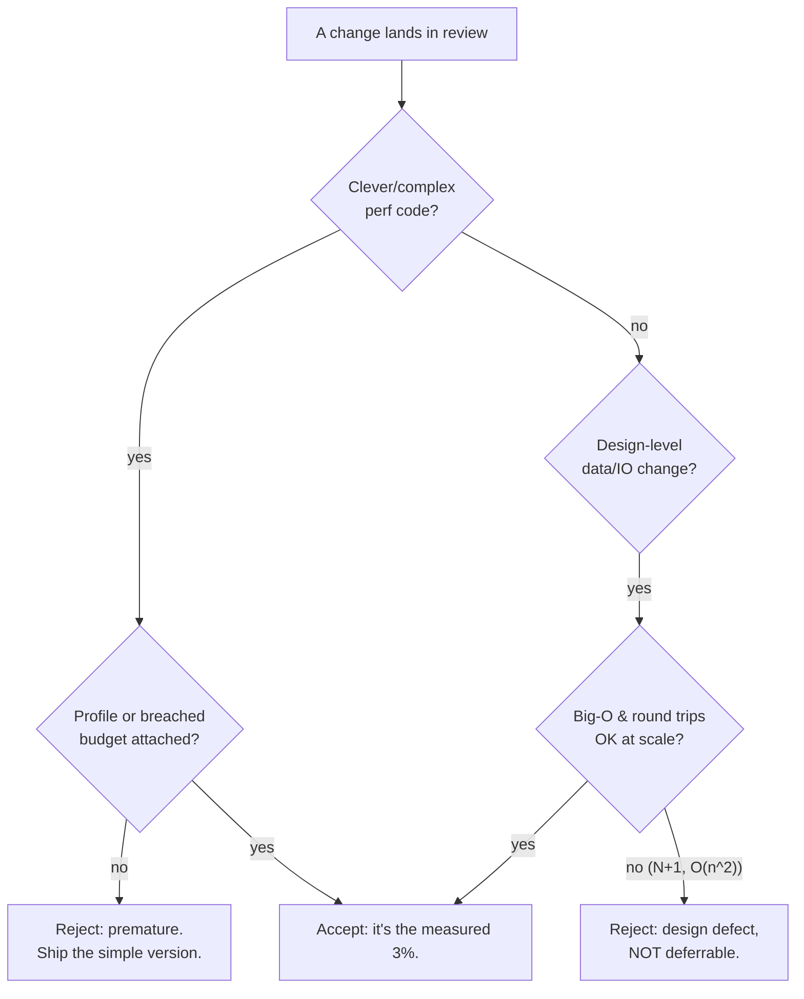
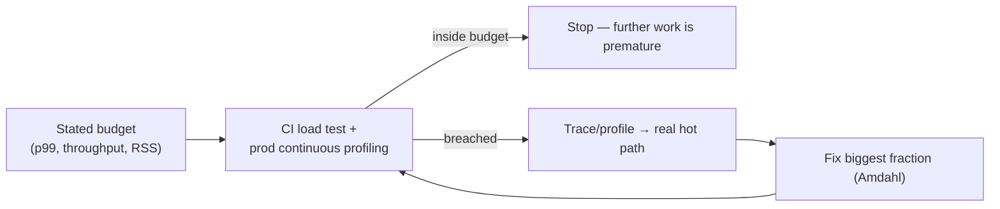

# Avoid Premature Optimization — Professional

> **Category:** [Design Principles](../../README.md) — make it work, make it right, then — only if measurement says you must — make it fast.

> **Prerequisites:** [Junior](junior.md) · [Middle](middle.md) · [Senior](senior.md)
> **Focus:** **Production** — reviews, metrics, team conventions, legacy systems

---

## Table of Contents

1. [Introduction](#introduction)
2. [Enforcing the Principle in Code Review](#enforcing-the-principle-in-code-review)
3. [Performance Budgets as a Team Practice](#performance-budgets-as-a-team-practice)
4. [Continuous Profiling and Observability](#continuous-profiling-and-observability)
5. [Team Conventions](#team-conventions)
6. [Optimizing Legacy Systems Safely](#optimizing-legacy-systems-safely)
7. [Real Incidents](#real-incidents)
8. [The Politics of Performance](#the-politics-of-performance)
9. [Review Checklist](#review-checklist)
10. [Cheat Sheet](#cheat-sheet)
11. [Diagrams](#diagrams)
12. [Related Topics](#related-topics)

---

## Introduction

> Focus: **production** — keeping a large, multi-contributor codebase correctly optimized over years.

In a real organization, "avoid premature optimization" fails in *both directions* at once. One engineer hand-rolls a lock-free queue for a feature that runs once a day; another ships an N+1 query that melts the database under load and defends it with "we'll optimize later." Both quote Knuth. Both are wrong. The professional job is to build the **system** that routes performance effort to where it's measured to matter and *away* from where it isn't — across hundreds of changes a week from dozens of people with different instincts.

That system has four parts: **review standards** that distinguish micro-tuning from design defects, **performance budgets** that define "fast enough," **continuous measurement** that finds the real hot path in production, and **conventions** that make the sensible-default path the default. The recurring trap to avoid is treating the principle as a slogan instead of a discipline — and the recurring abuse is using it to wave away the very design-level decisions that determine whether the system works at all.

---

## Enforcing the Principle in Code Review

Code review is where both errors enter — one PR at a time. A reviewer must catch **premature optimization** *and* **premature pessimization / design defects**, which means asking different questions of different kinds of change.

### The two questions that do most of the work

> **For a complex/clever change:** *"What measurement shows this is a bottleneck? Where's the profile?"*
> **For a design-level data/IO change:** *"What's the Big-O and the round-trip count at production scale?"*

The first question kills premature optimization: if the author can't point to a profile or a breached budget, the cleverness comes out and the simple version goes in. The second kills design defects masquerading as "we'll optimize later": an N+1 query or an `O(n²)` over large data is not deferrable, and "premature" is not a valid defense.

### Review by category

| Change looks like… | Reviewer asks | Default verdict |
|---|---|---|
| Hand-tuned loop, bit tricks, manual caching, custom data structure | "Where's the profile proving this is the hot path?" | **Reject** unless measured — it's premature; ship the simple version |
| `Set` vs `List`, batched query, index, `StringBuilder` | "Is this the equally-simple fast option?" | **Accept** — sensible default, not optimization |
| Query inside a loop; per-item fetch | "Round-trip count at scale? Can it be batched?" | **Reject the N+1** — design defect, not deferrable |
| New `O(n²)` over user-scale data | "Big-O at production volume?" | **Reject** — complexity class is feasibility |
| Microbenchmark-justified tweak in cold code | "Does the end-to-end number move? Amdahl ceiling?" | **Reject** — optimizing the 97% |

### Review comment templates

> "This is a clever bit-twiddling version of a sum that runs once per request. There's no profile showing it's hot — let's ship the readable loop and revisit only if profiling flags it. (Premature optimization: real complexity cost, unmeasured benefit.)"

> "This loops a `get_user()` query per row — that's N+1, ~500 round trips at our scale. That's not a 'later' optimization, it's a design defect; please batch into one query. (Per our latency table, the round trips dominate everything else here.)"

> "`HashSet` here instead of `list.contains()` in the loop is just the sensible default — `O(n)` vs `O(n²)`, and it reads the same. Let's take it; that's avoiding pessimization, not premature optimization."

> "Nice speedup, but the microbenchmark improved and the end-to-end p99 didn't move — this path is ~3% of runtime (Amdahl ceiling ≈3%). Let's not add the complexity for an unmeasurable win."

---

## Performance Budgets as a Team Practice

The single most effective professional control is a **stated performance budget** per service or critical path. It converts "is this premature?" from an argument into a lookup, and it's the operational form of Knuth's "critical 3%."

A usable budget is **specific, measurable, and tied to a workload:**

- *Checkout endpoint: p99 ≤ 200 ms at 2× current peak QPS.*
- *Search results: p95 ≤ 300 ms; index build ≤ 30 min nightly.*
- *Ingestion worker: ≤ 512 MB RSS; ≥ 10k msgs/s/instance.*

What the budget buys the team:

- **A "when to stop" line.** Inside budget → optimizing further *is* premature; stop. This protects engineers from gold-plating as much as from neglect.
- **A "when to start" trigger.** A breached budget on a measured path is the signal that optimization is *required* — and justified.
- **A scoping signal up front.** A tight budget relative to the workload tells you at design time that performance is a first-class driver (the [Senior](senior.md)-level "warranted early work"). A loose one tells you to default to simplicity.
- **A regression gate.** Wire the budget into CI (load test) so a PR that breaks it fails the build, before it reaches production.

> Without a budget, "fast enough" is a matter of opinion, and the team oscillates between two failure modes — optimizing everything and optimizing nothing. The budget is what makes "avoid premature optimization" governable instead of rhetorical.

---

## Continuous Profiling and Observability

The empirical core of the principle — *measure, don't guess* — only scales if measurement is **continuous and production-based**, not a one-off a developer runs on a laptop with toy data.

| Layer | Tool / signal | What it tells you |
|---|---|---|
| **Production profiling** | Continuous profiler (flame graphs over live traffic) | The *actual* hot path, under real data and concurrency — the real 3% |
| **Distributed tracing** | Span breakdowns per request | Where latency goes across services; surfaces N+1 and chatty calls |
| **RED/USE metrics** | Rate, Errors, Duration / Utilization, Saturation | Whether you're *inside the budget* right now |
| **Load testing** | Pre-release benchmark at target volume | Whether a change holds the budget at scale before shipping |
| **Microbenchmarks** | JMH, `go test -bench`, `pytest-benchmark` | Tight loops only; *distrusted* vs end-to-end (warmup, dead-code elimination, cache) |

The professional discipline:

- **Profile in production, not on synthetic toys.** A profiler on unrealistic data points at the wrong hot spot; the real one only appears under production scale and concurrency. This is the most common reason "we optimized the wrong thing" happens.
- **Trace before you tune.** Distributed traces reveal that the "slow endpoint" is 90% waiting on one downstream call — telling you the fix is *architectural* (batch, cache, parallelize), not a local loop.
- **Trust end-to-end over micro.** A microbenchmark win that doesn't move the end-to-end number is, per Amdahl, optimizing a small fraction. Require the end-to-end measurement before crediting any optimization.

---

## Team Conventions

Codify these so the right behavior is the default path, not a per-PR debate:

1. **"No optimization without a profile."** Written policy: clever/complex performance code requires a linked profile or a breached budget. Gives reviewers explicit license to reject unmeasured cleverness.
2. **Sensible defaults are not optimization.** Right Big-O, hash sets for membership, batched I/O, builders over loop concatenation, indexed access patterns — these are *expected*, never deferred. (Refusing them is premature pessimization.)
3. **N+1 and unbounded `O(n²)` are review-blocking defects**, not "later" items — regardless of who quotes Knuth.
4. **Every critical path has a budget**, enforced by a CI load test / regression gate.
5. **One-way-door performance decisions get a design note.** Schema, shard/partition key, wire format, service topology — reasoned about up front, reviewed deliberately.
6. **Keep the simple version recoverable.** Optimized code carries a comment with the *why* and the *measured numbers*, and is guarded by a benchmark so a future change can't silently regress it.
7. **Celebrate the deletion of dead optimizations** as much as new features — see the politics section.

These conventions encode the senior reasoning so juniors get it right by default and reviewers cite a policy, not a personal preference.

---

## Optimizing Legacy Systems Safely

The greenfield case is easy. The professional reality is a system that's *already* slow, *already* prematurely optimized in the wrong places, and *already* in production. The approach is incremental, measurement-led, and test-guarded.

### The sequence

1. **Measure the real bottleneck first.** Profile/trace production before changing anything. Legacy systems are full of *folklore* bottlenecks ("everyone knows the parser is slow") that profiling disproves. Optimize the data, not the legend.
2. **Pin behavior with characterization tests.** Optimization is a behavior-preserving change; you can't verify that without tests capturing current behavior, including edge cases. (See [refactoring](../../README.md) discipline and *Working Effectively with Legacy Code*.)
3. **Fix the biggest fraction first (Amdahl).** Rank by cumulative time; attack the largest contributor — usually a design-level issue (an N+1, a missing index, a re-fetch in a loop), not a micro-loop.
4. **Re-measure against the baseline.** Confirm the win is real and inside (or closer to) budget. Revert anything that doesn't move the end-to-end number.
5. **Remove premature optimizations you find.** Legacy code often contains clever, complex, *un-needed* optimizations on cold paths. Replacing them with simple code is a net win (clarity, fewer bugs) at no performance cost — verify with a profile, then delete.

### What *not* to do in legacy performance work

- **Don't optimize without measuring.** "It looks slow" rewrites are how teams spend a sprint speeding up code that was never on the hot path.
- **Don't trust microbenchmarks over production traces.** The laptop result and the production result diverge constantly (data shape, cache, concurrency).
- **Don't boil the ocean.** A standalone "make everything fast" initiative has all the risk and none of the focus. Tie optimization to the budget that's actually breached and the path that's actually hot.
- **Don't gold-plate the fix.** Replacing a slow-but-simple component with a fast-but-baroque one (a custom allocator, a lock-free everything) on a path that didn't need it is premature optimization wearing a "modernization" badge.

---

## Real Incidents

### Incident 1: The hand-rolled cache that cached nothing useful

A team added a complex, hand-written LRU cache to a "hot" pricing function, complete with eviction tuning and a custom hash. Six months of bug reports later (stale prices, an off-by-one in eviction, a concurrency race), someone finally profiled it: the function was **0.4%** of request time, and the cache hit rate was ~3% because inputs were nearly unique. **Postmortem:** premature optimization — built on intuition, never measured, Amdahl ceiling under 0.4%. **Fix:** deleted the cache; the plain function was faster *in aggregate* (no cache overhead, no lock contention) and the price bugs vanished. **Lesson:** an unmeasured optimization is a bug generator with no upside; the profile would have prevented all of it.

### Incident 2: "We'll optimize the query later" — the outage

A dashboard shipped with a per-row `get_customer()` query (N+1). In review, the author had deflected the concern with "premature optimization — let's not over-engineer." It worked fine for the launch customer's 50 rows. The third customer had 40,000 rows → ~40,000 round trips → the dashboard timed out and saturated the database connection pool, taking down *unrelated* services sharing it. **Fix:** one batched query; p99 dropped from 28 s to 90 ms. **Lesson:** N+1 is an architectural defect, not a micro-optimization. "Premature" was the wrong word and the wrong call — the latency table predicted the failure on day one.

### Incident 3: The microbenchmark that lied

An engineer "proved" a custom string parser was 4× faster than the standard library via a microbenchmark and rolled it out. End-to-end latency didn't budge, and a class of malformed-input crashes appeared. The microbenchmark had measured a JIT-optimized tight loop on uniform inputs that didn't represent production; the parser was also ~2% of request time (Amdahl). **Fix:** reverted to the standard parser. **Lesson:** trust end-to-end measurements over microbenchmarks, and check the Amdahl ceiling before crediting a "4× faster" claim — 4× on 2% is 1.5% overall, not worth a crash class.

### Incident 4: Over-engineering a once-a-day job

A nightly report generator was built on a streaming, parallel, back-pressured pipeline "for performance." It ran in 90 seconds processing a few thousand rows — a plain sequential loop would have run in ~3 seconds and been a tenth the code. The pipeline's complexity caused two production incidents from misconfigured back-pressure. **Fix:** replaced with ~40 lines of straightforward code. **Lesson:** match the effort to the requirement. A once-a-day job with a generous window has no performance budget worth optimizing against — the complexity was pure premature optimization.

---

## The Politics of Performance

Sustaining the principle is partly a social problem, and it cuts both ways:

- **Complex optimizations *look* like senior work; simple code looks like under-delivery.** A lock-free data structure impresses in review; deleting it for a plain `synchronized` block that's measurably just as fast looks like a step backward. Professionals must reframe: **the measured-correct choice is the senior move**, whether that's optimizing or *not* optimizing.
- **"Premature optimization" is wielded to shut down legitimate design concerns.** Arm the team with the precise distinction (micro-tuning vs design-level / reversibility) so a reviewer flagging an N+1 isn't dismissed with a misquoted Knuth.
- **Deleting a clever optimization feels risky and goes unrewarded.** Make it safe (characterization tests + profile) and visible (celebrate the removal and the bug-count drop). The engineer who deletes the useless cache prevented future incidents — recognize it.
- **Senior engineers set the reflex.** If the staff engineer reaches for the custom allocator by default, everyone does. Model "profile first, simplest thing that meets the budget," and explain *why* you didn't optimize.

---

## Review Checklist

```text
PREMATURE-OPTIMIZATION REVIEW CHECKLIST
[ ] CLEVER/COMPLEX CODE — is there a linked PROFILE or breached BUDGET? If not → reject, ship simple version
[ ] AMDAHL — what fraction of runtime is this path? Low fraction → low ceiling → not worth the complexity
[ ] END-TO-END — does the real (not micro) benchmark actually move?
[ ] BIG-O — any new O(n^2)/worse over production-scale data? → design defect, not "later"
[ ] N+1 / ROUND TRIPS — any query/IO inside a loop? → batch it now; NOT deferrable
[ ] SENSIBLE DEFAULT — Set/index/builder/batch chosen where equally simple? (refusing = pessimization)
[ ] CLARITY COST — did an optimization obscure intent? Is the speedup measured & worth it?
[ ] ONE-WAY DOOR — schema/shard-key/wire-format/topology reasoned about up front?
[ ] RECOVERABILITY — optimized code commented with WHY + numbers, guarded by a benchmark?
```

---

## Cheat Sheet

```text
TWO QUESTIONS THAT DO THE WORK
  complex/clever change → "Where's the PROFILE proving it's hot?"  (kills premature opt)
  data/IO change        → "Big-O and round-trip count at SCALE?"  (kills design defects)

BUDGET = THE GOVERNOR
  inside budget → optimizing is PREMATURE, stop
  breached budget on a MEASURED path → optimize THAT, then stop

MEASURE LIKE A PRO
  profile/trace in PRODUCTION (not toy data) · trust END-TO-END over micro
  Amdahl: a 5%-of-runtime path caps at a 5% win — check the ceiling first

NOT PREMATURE (decide now)
  Big-O at scale · data model/schema · N+1/batching · shard key · service topology
  sensible defaults (Set/index/builder) — refusing them is PESSIMIZATION

LEGACY
  measure first (kill folklore bottlenecks) → characterize → fix biggest fraction
  → re-measure → DELETE the useless clever optimizations you find
```

---

## Diagrams

### Routing performance effort correctly



### Budget-driven optimization loop



---

## Related Topics

- **Sibling principles:** [KISS](../01-kiss/professional.md), [YAGNI](../02-yagni/professional.md), [Optimize for Deletion](../06-optimize-for-deletion/junior.md).
- **Designing for optimizability:** [Encapsulate What Changes](../../03-module-and-class/01-encapsulate-what-changes/junior.md).
- **Tooling:** continuous profilers / flame graphs, distributed tracing, JMH / `go test -bench` / `pytest-benchmark`, load-test gates in CI.
- **Up:** [Design Principles](../../README.md).

---


---

## Check your understanding

1. Explain Avoid Premature Optimization — Professional Level in your own words and name the problem it solves.
2. How would you apply the ideas around Table of Contents, Introduction, Enforcing the Principle in Code Review in a realistic engineering change?
3. What failure mode or misuse should you look for, and what evidence would reveal it?
4. How would you introduce and govern Avoid Premature Optimization — Professional Level across teams through reversible, measurable increments?
5. What observable result would convince you that the approach improved the system?
