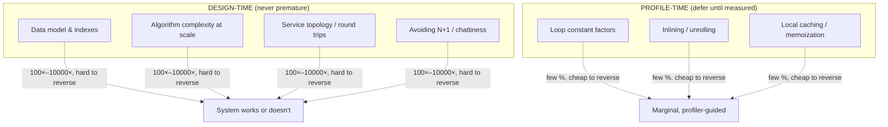
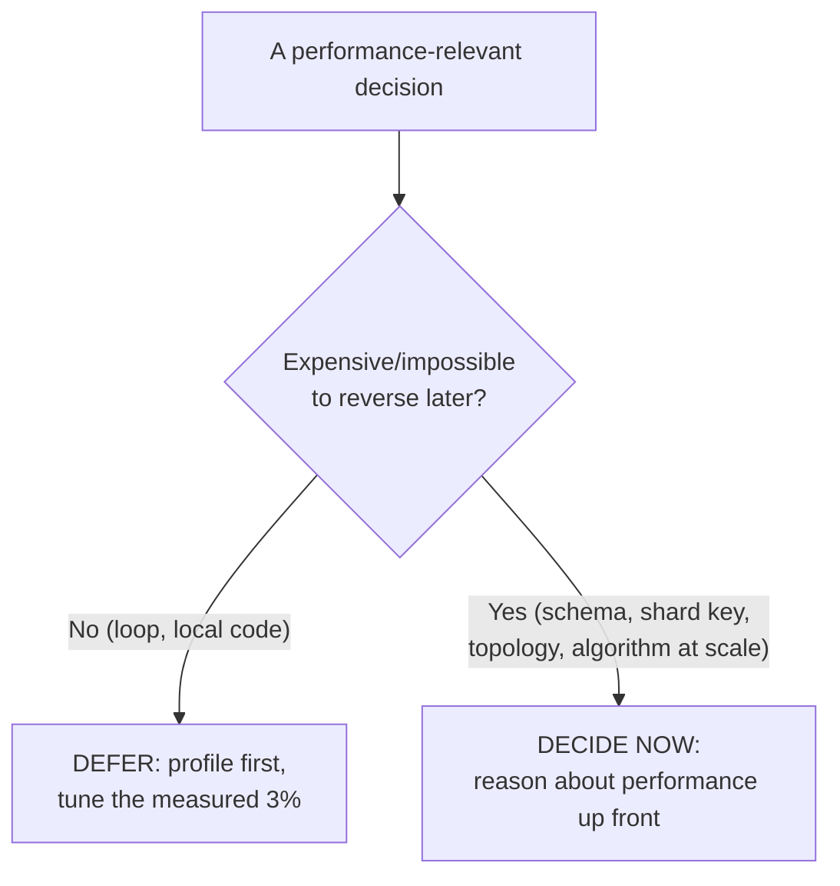
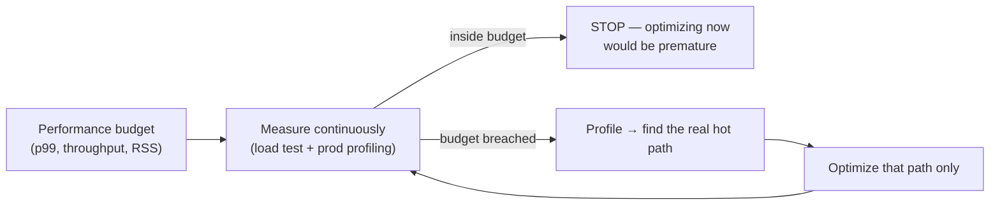

# Avoid Premature Optimization — Senior

> **Category:** [Design Principles](../../README.md) — make it work, make it right, then — only if measurement says you must — make it fast.

> **Prerequisites:** [Junior](junior.md) · [Middle](middle.md)
> **Focus:** **Design trade-offs** and **system-level reasoning**

---

## Table of Contents

1. [Introduction](#introduction)
2. [The Real Boundary: Reversibility, Not Timing](#the-real-boundary-reversibility-not-timing)
3. [Architecture-Level Performance Is Never Premature](#architecture-level-performance-is-never-premature)
4. [Mechanical Sympathy](#mechanical-sympathy)
5. [Performance Budgets and Benchmarks](#performance-budgets-and-benchmarks)
6. [When the Principle Is Abused](#when-the-principle-is-abused)
7. [Designing for Optimizability](#designing-for-optimizability)
8. [Code Examples — Advanced](#code-examples--advanced)
9. [Liabilities](#liabilities)
10. [Pros & Cons at the System Level](#pros--cons-at-the-system-level)
11. [Diagrams](#diagrams)
12. [Related Topics](#related-topics)

---

## Introduction

> Focus: **design trade-offs** and **system-level reasoning**

At the senior level, "avoid premature optimization" stops being a coding habit and becomes a **position in an architectural argument**: how much performance reasoning belongs at design time, and how much should wait for measurement. Beck and Knuth's advice is a vote for *deferral* — but applied without judgement, "don't optimize prematurely" becomes the rationalization for shipping a system that cannot meet its latency SLA, whose data model forces table scans, and whose service topology guarantees fan-out storms that no amount of later profiling can fix.

This file covers the three hard questions a senior must answer:

1. **Where does "defer" end and "decide now" begin?** (It's reversibility, not the calendar.)
2. **Which performance decisions are *architectural* — and therefore never premature to consider?**
3. **How do you build a system that you *can* optimize later — and prove, with budgets and benchmarks, when you must?**

The senior synthesis: **Knuth's principle is correct about the 97%, and dangerously incomplete about everything that's expensive to change.** The job is to apply it surgically.

---

## The Real Boundary: Reversibility, Not Timing

The junior framing — "optimize late, not early" — implies the boundary is *temporal.* It isn't. Plenty of teams "wait to optimize" and still ship un-fixable performance disasters, because the decision that doomed them was made on day one and was never reversible. The true boundary is **reversibility**, identical to the one that governs [YAGNI](../02-yagni/senior.md):

> **Cheap to change later → defer it (the 97%; profile, then tune). Expensive to change later → decide it deliberately now, performance characteristics included.**

| Decision | Reversibility | Performance stance |
|---|---|---|
| A loop's inner constant factor | Cheap (local edit) | **Defer** — profile first |
| Choice of in-memory data structure | Cheap (swap behind tests) | Mostly defer, but pick a sane Big-O now |
| Core algorithm at scale (`O(n²)` vs `O(n log n)`) | Medium (rework) | **Decide now** — it dictates feasibility |
| Data model / schema | Expensive (migration) | **Decide now** — access patterns are baked in |
| Partition / shard key | Very expensive (re-shard) | **Decide now** — wrong key = hot shards forever |
| Sync vs async / service topology | Very expensive (re-architecture) | **Decide now** — fan-out and chattiness are structural |
| Wire / serialization format | Expensive (version skew) | **Decide now** — affects every caller |

The senior failure mode is not "optimized too early" or "too late" — it's applying the **wrong stance to the wrong reversibility class**: micro-tuning reversible internals (premature optimization, the Rule-of-Knuth violation) *or* deferring an irreversible architectural performance decision under the banner of "we'll optimize later" (the far costlier error). Drawing this line correctly is the entire skill.

---

## Architecture-Level Performance Is Never Premature

Quoting "premature optimization is the root of all evil" at an *architectural* performance decision is a category error. Knuth was talking about **noncritical parts of a program** — local code — not about the data model or the service graph. These decisions are *structural*: they don't have a hot 3% you can find with a profiler later; they shape the cost of *everything*.

The architecture-level performance concerns that must be reasoned about up front:

- **Data model and access patterns.** Whether your dominant query is a single indexed lookup or a full scan is decided when you design the schema, not when you profile. Denormalization, indexing strategy, and the choice between row and columnar storage are design-time decisions with 100×–10,000× consequences.
- **N+1 queries and chattiness.** A read that fans out into one query per item is an architectural pattern, not a hot loop. It must be designed out (batching, joins, dataloaders) from the start because it's woven through the call graph.
- **Network round trips.** Per the latency numbers, a round trip dwarfs all local computation. Whether a use case takes 1 or 50 round trips is a *design* property of your service boundaries and API granularity — and it's expensive to change once clients depend on it.
- **Choice of data structure / algorithm at scale.** An `O(n²)` join over millions of rows isn't "slow code to optimize later"; it's a design that doesn't work. The right complexity class is a *correctness-adjacent* requirement at scale.



The senior rule: **the more expensive a decision is to reverse, the earlier its performance characteristics must be considered.** Architecture-level performance and "avoid premature optimization" don't conflict — they operate at different reversibility scales, and the principle was never about the architectural scale.

---

## Mechanical Sympathy

The senior counterweight to naive "don't think about performance" is **mechanical sympathy** (Martin Thompson, borrowing Jackie Stewart's racing phrase): *you don't have to be a hardware engineer, but you write better code when you understand how the machine underneath actually works.*

> *"You don't have to be an engineer to be a racing driver, but you do have to have mechanical sympathy."* — Jackie Stewart, applied to software by Martin Thompson.

Mechanical sympathy is not premature optimization — it's choosing designs that *cooperate* with the hardware, at no cost to clarity:

- **Cache locality.** A contiguous array (`ArrayList`, slice) is dramatically faster to iterate than a pointer-chasing linked structure, because of cache lines and prefetching — often 10×+ for the same Big-O. Choosing the array-backed structure isn't optimization; it's not fighting the cache.
- **Data-oriented layout.** Struct-of-arrays vs array-of-structs changes how much useful data each cache line carries. For hot data, this is a *design* choice.
- **Avoiding false sharing, branch misprediction, and allocation churn** in genuinely hot paths.
- **Sequential vs random access.** Sequential reads (memory or SSD) are orders of magnitude faster than random ones; algorithms that stream beat algorithms that hop.

The senior distinction: mechanical sympathy informs the *default design choice* (use the cache-friendly structure when it's equally simple) and the *deliberate optimization of a known hot path* (where you tune layout against the hardware). It is **not** a license to hand-vectorize cold code — that's still premature. The discriminator, as always, is whether the code is on the critical path *and* whether the sympathetic choice costs clarity. When a cache-friendly structure is *just as clear* (it usually is), choosing it is simply competent engineering — refusing it is premature pessimization.

---

## Performance Budgets and Benchmarks

The mature alternative to both "optimize everything" and "optimize nothing" is to make performance a **measured, budgeted requirement** rather than a vibe. This is how seniors turn Knuth's "critical 3%" into something you can govern.

**Performance budget** — an explicit, agreed limit treated like any other requirement:

- *"p99 of the checkout endpoint ≤ 200 ms."*
- *"The nightly batch must finish within its 4-hour window at 2× current volume."*
- *"This service must hold ≤ 512 MB RSS."*

A budget converts the vague question "is it fast enough?" into a falsifiable one, and it answers "when do I stop optimizing?" precisely: **when you're inside the budget, stop — further tuning is premature optimization by definition.** It also tells you *up front* whether early performance work is warranted: if the budget is tight relative to the workload, performance is a design driver from day one (this is the [Middle](middle.md)-level "warranted early work," now formalized).

**Benchmarks and regression gates** make the budget enforceable:

- A **macro-benchmark / load test** under production-like data, run in CI or pre-release, that fails the build if a budget is breached.
- **Micro-benchmarks** (JMH, `go test -bench`, `pytest-benchmark`) for genuinely hot functions, treated with suspicion (JIT warmup, dead-code elimination, cache effects) and never trusted over end-to-end numbers.
- **Continuous profiling** in production (flame graphs over real traffic) so the *actual* hot 3% is observed, not guessed — the empirical heart of the whole principle.

> The senior reframing: don't "optimize" or "not optimize" — **govern performance against a budget, measured continuously.** Optimization becomes a response to a *breached budget on a measured hot path*, which is exactly Knuth's critical 3% made operational.

---

## When the Principle Is Abused

"Avoid premature optimization" is one of the most-abused quotes in engineering. Seniors must recognize and shut down its misuse, because it's invoked to justify exactly the architectural mistakes the principle never addressed:

| Abuse | Why it's wrong |
|---|---|
| **"Don't worry about the N+1 query, that's premature."** | N+1 is an architectural pattern, not a micro-optimization. Per the latency table, the round trips dominate everything; it's a design defect, not a tuning opportunity. |
| **"The O(n²) is fine, we'll optimize later if it's slow."** | At scale, complexity class is feasibility, not speed. "Later" may be "never finishes." Picking the right Big-O is design, not optimization. |
| **"Schema design is premature optimization."** | The data model is a one-way door; access patterns are baked in. Deferring it is the costly mistake, not the prudent one. |
| **"Choosing a data structure is premature."** | A `Set` vs a `List` for membership is the *default sensible choice*; refusing it is premature pessimization. |
| **"We don't need a performance budget yet."** | Without a budget you can't tell "fast enough" from "needs work" — you've removed the only signal that tells you when the principle even applies. |

The pattern: the principle gets stretched from its real target (*defer micro-tuning of non-bottleneck code*) to cover *all* performance thinking, including the architectural decisions that are expensive to reverse. The senior correction is precise and repeatable: **"Knuth was talking about local micro-optimizations on noncritical code. This is a design-level, hard-to-reverse decision with a 100× performance consequence. Different category — and not optional."**

---

## Designing for Optimizability

Because you genuinely *cannot* know every hot path in advance, the senior move is not "optimize early" but **"design so that later optimization is cheap and safe."** This is what makes deferral a responsible bet rather than a gamble:

- **Encapsulate the hot-spot candidates behind seams.** If the slow thing turns out to be data access, having it behind a repository/interface means you can add caching or batching *in one place* without touching call sites. (Cross-link: [Encapsulate What Changes](../../03-module-and-class/01-encapsulate-what-changes/junior.md).)
- **Keep the simple version legible.** You can only safely re-optimize what you understand. Premature optimization that obscures the code makes *future* genuine optimization harder — a compounding cost.
- **Choose sane defaults (right Big-O, cache-friendly structures, batched I/O)** so the baseline is already good and optimization is a rare, targeted act rather than a system-wide rescue.
- **Instrument for observability.** Metrics, traces, and continuous profiling are what let you find the real 3% *in production*, where it actually lives. A system you can't profile is a system you can't optimize correctly.
- **Make performance regressions visible** via budgets in CI, so the design stays inside its envelope as it evolves.

> The deepest senior insight: "avoid premature optimization" is sustainable *only* if you've designed for optimizability. Deferral is responsible when later optimization is cheap; it's negligence when the architecture has nailed the slow thing into place. The principle and good architecture are partners — the architecture is what *earns you the right* to defer.

---

## Code Examples — Advanced

### A "clever" micro-optimization that fights the optimizer and the cache (Java)

```java
// "Optimized": manual loop, manual bounds, trying to be clever — and WORSE.
// Pointer-chasing a LinkedList defeats cache prefetch; the manual indexing
// on a linked list is accidentally O(n²) (get(i) is O(n)).
long sum = 0;
for (int i = 0; i < list.size(); i++) {     // list is a LinkedList
    sum += list.get(i).value();             // each get(i) walks from the head!
}
```

```java
// Simple, cache-friendly, and actually fast: contiguous array + clean iteration.
// The JIT vectorizes/unrolls this far better than hand-tuned code, and the
// ArrayList's contiguous layout cooperates with the cache (mechanical sympathy).
long sum = 0;
for (Item item : items) {                   // items is an ArrayList / array
    sum += item.value();
}
```

The "optimization" was a triple loss: it was *less* readable, accidentally `O(n²)` (a `LinkedList.get(i)` in a loop), and cache-hostile. The lesson is the senior one: **the right data structure and idiomatic code beat hand-tuning**, and premature cleverness routinely *defeats* the platform's own optimizer.

### Re-architecting away the round trips (Python / pseudo-ORM)

```python
# DESIGN DEFECT (called "premature to fix" by the unwary): N+1 + per-item compute
def dashboard(user_ids):
    rows = []
    for uid in user_ids:                      # N users
        user = db.get_user(uid)               # round trip #1 per user
        orders = db.get_orders(uid)           # round trip #2 per user
        rows.append((user.name, total(orders)))
    return rows
# 1000 users → ~2000 round trips → seconds of pure latency, no profiler needed

# REDESIGN: batch the access pattern. This is ARCHITECTURE, not micro-tuning.
def dashboard(user_ids):
    users  = db.get_users(user_ids)           # ONE round trip
    totals = db.order_totals_by_user(user_ids)  # ONE round trip (DB does the sum)
    return [(u.name, totals.get(u.id, 0)) for u in users]
```

This is the difference between a system that scales and one that doesn't — decided at design time, defensible by the latency table, and *not* something to defer. Note the redesign is also *simpler* at the call site.

### A performance budget as an executable gate (Go)

```go
// A benchmark that doubles as a regression gate against a stated budget.
func BenchmarkCheckout(b *testing.B) {
    svc := newCheckoutService(realisticFixtures())
    b.ResetTimer()
    for i := 0; i < b.N; i++ {
        svc.Checkout(sampleCart())
    }
}

// In CI, fail the build if the measured p99 (from load tests) exceeds the budget.
// The budget — not a vibe — decides when optimization is required and when to STOP.
//   BUDGET: Checkout p99 <= 200ms @ 2x current volume
```

The budget operationalizes Knuth: optimization is triggered by a *breached, measured* budget on the *actual* hot path — the critical 3% made into a CI gate — and stops the moment you're back inside it.

---

## Liabilities

### Liability 1: "It's premature" as a thought-terminating cliché

The quote is used to *end* performance conversations that should *start* them. Any time someone invokes it against a design-level decision (schema, algorithm, topology), treat it as a red flag, not a verdict. Ask: *is this micro-tuning of noncritical code, or an expensive-to-reverse architectural choice?*

### Liability 2: Deferring the irreversible

Applying "optimize later" to a data model, shard key, or wire format is the costliest mistake in this topic. "Later" is true for loops and false for schemas. Audit every performance-relevant decision for reversibility *before* deferring it.

### Liability 3: Premature optimization that prevents real optimization

Cleverness that obscures the code makes the *eventual* genuine optimization harder and riskier — you can't safely change what you can't read. Premature optimization isn't just wasted effort; it's negative-value effort that taxes all future performance work.

### Liability 4: No budget, no signal

Without a performance budget and measurement, "fast enough" is opinion. Teams oscillate between gold-plating (optimizing everything) and neglect (optimizing nothing) precisely because they lack the budget that would tell them which mode they're in.

---

## Pros & Cons at the System Level

| Dimension | Defer (the 97%) | Decide early (architecture / the critical few) |
|---|---|---|
| Cost of unneeded speed work | Low — you didn't build it | High — complexity for ~zero gain *if* it wasn't the bottleneck |
| Cost when a need *does* arise | A targeted, profiler-guided fix (cheap *if* designed for optimizability) | Zero *if* the design already absorbed it |
| Risk on reversible internals | Low — refactor later | Over-engineering (premature optimization) |
| Risk on **irreversible** decisions | **High if deferred** (schema, shard key, topology) | Low — deliberate up-front choice |
| Readability of internals | High (no speculative cleverness) | Neutral when sympathetic choices are equally clear |
| Dependence on observability | Total — you must measure to find the real 3% | Lower, but budgets still required |
| Best for | Reversible, noncritical code (most of it) | Hard SLAs, hot loops, large-scale data, one-way-door design |

The table makes the senior stance precise: defer on every row *for reversible, noncritical code* — which is most code — and decide early *only* on the irreversible-architecture and hard-budget rows. That is the exact line Knuth's "97% / 3%" draws, restated in terms of reversibility and budgets.

---

## Diagrams

### Reversibility decides defer vs. decide-now



### Budget-governed optimization (Knuth's 3%, operationalized)



---

## Related Topics

- **Sibling principles:** [KISS](../01-kiss/senior.md), [YAGNI](../02-yagni/senior.md), [Optimize for Deletion](../06-optimize-for-deletion/junior.md).
- **Designing for optimizability:** [Encapsulate What Changes](../../03-module-and-class/01-encapsulate-what-changes/junior.md).
- **Up:** [Design Principles](../../README.md).

---


---

## Check your understanding

1. Explain Avoid Premature Optimization — Senior Level in your own words and name the problem it solves.
2. How would you apply the ideas around Table of Contents, Introduction, The Real Boundary: Reversibility, Not Timing in a realistic engineering change?
3. What failure mode or misuse should you look for, and what evidence would reveal it?
4. How would you validate a system-level decision about Avoid Premature Optimization — Senior Level under uncertainty?
5. What observable result would convince you that the approach improved the system?
