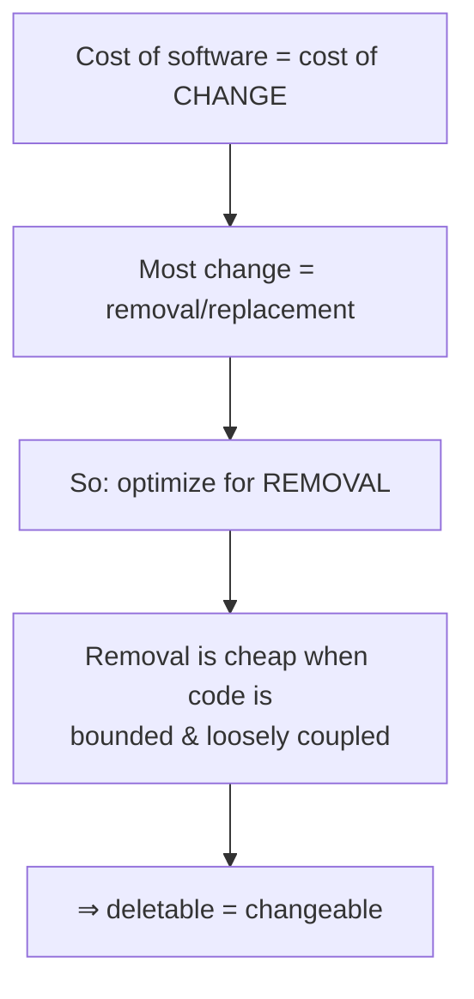
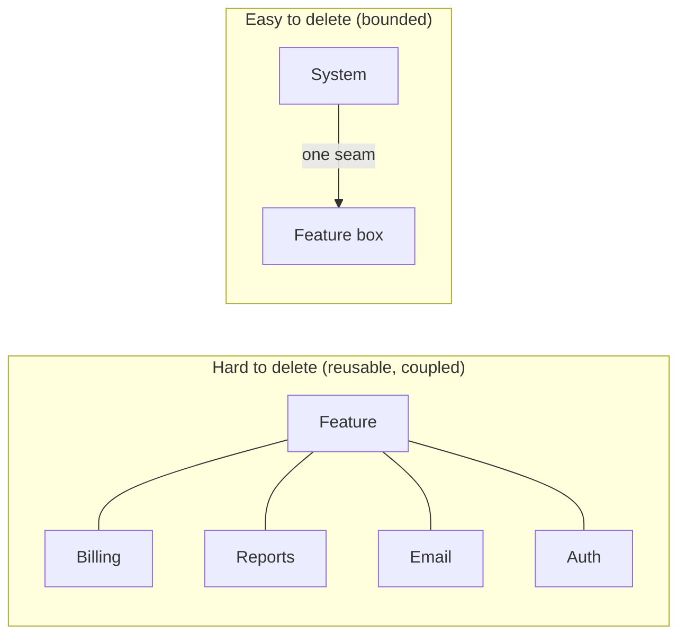

# Optimize For Deletion — Junior

> **Category:** [Design Principles](../../README.md) — write code that is *easy to delete*, not code that is easy to extend, because most change is deletion or replacement.

---

## Table of Contents

1. [Introduction](#introduction)
2. [Prerequisites](#prerequisites)
3. [Glossary](#glossary)
4. [The Core Idea](#the-core-idea)
5. [Why Deletability Equals Changeability](#why-deletability-equals-changeability)
6. [Real-World Analogies](#real-world-analogies)
7. [Mental Models](#mental-models)
8. [A Worked Example: Two Ways to Add a Feature](#a-worked-example-two-ways-to-add-a-feature)
9. [Code Examples](#code-examples)
10. [The Techniques From the Essay](#the-techniques-from-the-essay)
11. [The Tension With DRY (a First Look)](#the-tension-with-dry-a-first-look)
12. [Best Practices](#best-practices)
13. [Common Mistakes](#common-mistakes)
14. [Tricky Points](#tricky-points)
15. [Test Yourself](#test-yourself)
16. [Cheat Sheet](#cheat-sheet)
17. [Summary](#summary)
18. [Further Reading](#further-reading)
19. [Related Topics](#related-topics)
20. [Diagrams](#diagrams)

---

## Introduction

> Focus: **What is it?** and **How to use it?**

For decades the default goal when writing code was to make it **reusable** and **easy to extend** — build flexible abstractions, add extension points, generalize early. *Optimize for deletion* turns that goal on its head. It says the property you should actually chase is the opposite:

> **Write code that is easy to delete, not easy to extend.**

That single line is the title of an influential essay by **tef** (Tef Programming, *programmingisterrible.com*, "Write code that is easy to delete, not easy to extend", 2016). It sounds provocative, even backwards, but the reasoning is solid and once you see it you can't unsee it: **the easiest change you can make to a piece of code is to delete it.** Code you can delete cleanly is code you can change cheaply — you just throw out the part you don't want and write the new part. Code you *can't* delete (because removing it would break ten other places) is code that fights you every time you try to change it.

### Why this matters

A junior engineer's instinct, trained by tutorials and "best practices," is to add structure: an interface here, a base class there, a configuration option "in case." Each of those is intended to make future change *easier*. But most of them make future change *harder*, because they wire your code together. The day you want to remove the feature, you discover it has tendrils everywhere.

Optimize-for-deletion gives you a different lens for every design decision: **"If I had to delete this next month, how much would break?"** The less that breaks, the better your design — independent of how clever it looks today.

---

## Prerequisites

- **Required:** You can write functions, classes, and modules, and you understand what it means for code in one file to *depend on* code in another (imports, function calls, shared types).
- **Required:** A working idea of **coupling** — how much a change in one place forces a change in another. (See [Minimise Coupling](../../02-coupling-and-cohesion/01-minimise-coupling/).)
- **Helpful:** Exposure to **[YAGNI](../02-yagni/)** ("You Aren't Gonna Need It") and **[DRY](../07-dry/)** ("Don't Repeat Yourself"), because optimize-for-deletion sits in productive tension with both.

---

## Glossary

| Term | Definition |
|------|-----------|
| **Optimize for deletion** | Designing code so that any given feature or component can be removed cleanly, touching as few other places as possible. |
| **Deletability** | A property of code: how easy it is to remove without breaking the rest of the system. High deletability ≈ low coupling + clear boundaries. |
| **Coupling** | How much one piece of code depends on another. High coupling = a change (or deletion) in A forces changes in B, C, D… |
| **Boundary / seam** | A clean line where one chunk of code meets another, narrow enough that you can replace what's on one side without touching the other. |
| **Ripple** | The set of other places that must change when you delete or modify a piece of code. Small ripple = deletable. |
| **Dead code** | Code that is no longer used but nobody dares delete, because they can't tell what depends on it. A symptom of poor deletability. |
| **Kill-switch / feature flag** | A toggle that turns a feature off without removing its code — a soft, reversible step toward deletion. |
| **The wrong abstraction** | A shared piece of code extracted too early, now serving callers that don't truly belong together; hard to delete because everything leans on it. |

---

## The Core Idea

The argument has three steps, and each one is worth pausing on.

**Step 1 — The cost of software is not writing it; it's *changing* it.** You write a line of code once. You read it, debug it, work around it, and modify it for years. The big cost is the ongoing cost of *keeping the code and changing it*, not the one-time cost of typing it.

**Step 2 — Most change is deletion or replacement.** When requirements shift, you rarely *add* a feature in a vacuum. You remove an old behavior, swap one implementation for another, retire a screen, drop a payment provider. Even "adding a feature" usually means deleting and replacing some of what was there. So the operation you do most is: **take some code out.**

**Step 3 — Therefore, optimize for the operation you do most: removal.** If removal is cheap, change is cheap. And removal is cheap exactly when the code is **well-bounded and loosely coupled** — when it lives behind a clean line you can cut.

> **The cost of software is the cost of change. The most common change is removal. So the most valuable property of code is that it is easy to remove.**

This is why the principle is sometimes phrased: *"good code is not code that is easy to add to — it's code that is easy to delete."*

---

## Why Deletability Equals Changeability

It helps to see *why* "easy to delete" and "easy to change" are the same property in disguise.

Imagine a feature you want to remove. Two scenarios:

```
HIGH COUPLING — deletion ripples everywhere
                                  ┌───────────┐
        ┌─────────────────────────│  FEATURE  │──────────────────┐
        │            ┌────────────►│  to delete│◄──────┐         │
        ▼            │             └───────────┘       │         ▼
   ┌─────────┐  ┌─────────┐    ┌──────────┐    ┌─────────┐  ┌─────────┐
   │ Billing │  │ Reports │    │  Search  │    │  Email  │  │  Auth   │
   └─────────┘  └─────────┘    └──────────┘    └─────────┘  └─────────┘
   To delete the feature you must edit ALL of these. So you don't. → dead code.


LOW COUPLING — deletion is surgical
                       ┌───────────────┐
   (rest of system) ───┤  narrow seam  ├───►  ┌───────────┐
                       └───────────────┘      │  FEATURE  │
                                              │  to delete│
                                              └───────────┘
   Cut the one seam, delete the box. Nothing else changes.
```

In the first picture the feature is woven through the system. Removing it means surgery on Billing, Reports, Search, Email, and Auth. Nobody has time for that, so the feature *never gets removed* — it just rots in place as code everyone is afraid to touch. In the second picture the feature sits behind one narrow boundary. You cut the seam, delete the box, and the rest of the system doesn't notice.

The second design is more deletable. It is *also* more changeable: want a different feature there? Delete the box, drop in a new one. Same seam, new contents. **Deletability and changeability are the same thing measured from two directions.**

So when this principle says "optimize for deletion," it really means: **optimize for clear boundaries and low coupling**, using "could I delete this cleanly?" as the test that tells you whether you got the boundaries right.

---

## Real-World Analogies

| Concept | Analogy |
|---|---|
| **Easy to delete** | LEGO bricks. Any brick pops off without damaging the rest. You rebuild by removing and replacing pieces, not by chiseling. |
| **Hard to delete (high coupling)** | A load-bearing wall. It's "reused" by the whole house, so you can't remove it without the roof falling in. "Reusable" became "irremovable." |
| **A clean seam** | A wall socket. The lamp plugs in and unplugs freely; the wiring behind the wall doesn't care which lamp it is. |
| **Dead code nobody deletes** | A box in the attic labeled "misc cables." You keep it for years because you're not *sure* nothing needs it. Uncertainty is the cost of poor boundaries. |
| **Feature flag / kill-switch** | A circuit breaker. You can cut power to one room instantly, then decide later whether to rewire it for good. |
| **The wrong abstraction** | Welding two chairs together because they share four legs. Now you can't move one without dragging the other. |

---

## Mental Models

**The intuition:** *"Design so that any piece can be thrown away. The pieces you can throw away are the pieces you can change."*

```
   ┌──────────────────────────────────────────────────────┐
   │  Ask of every chunk of code:                          │
   │                                                       │
   │     "If I deleted this next month,                    │
   │      how many other files would I have to touch?"     │
   │                                                       │
   │     few files  →  good boundary, deletable, changeable│
   │     many files →  tangled, irremovable, rigid         │
   └──────────────────────────────────────────────────────┘
```

A second model, straight from the essay: **think in layers you can replace.** Don't aim for one big reusable thing. Aim for a stack where each layer is dumb enough that you could rewrite it from scratch without the layers above or below caring. The boundaries between layers are what give you the freedom to delete.

A third model, the **Go proverb** (Rob Pike): *"A little copying is better than a little dependency."* A small amount of duplicated code is a thing you can delete in one place without affecting anyone else. A dependency is a wire to something you don't control — and wires are what make code un-deletable.

---

## A Worked Example: Two Ways to Add a Feature

A product team asks: *"Send users a Slack notification when their export finishes."* Two engineers build it.

### Engineer A — optimizes for reuse (hard to delete)

They think ahead. "We'll surely add more notification channels later." So they build a framework:

```python
# A generic, "reusable" notification platform — built for one Slack message.
class NotificationChannel(ABC):
    @abstractmethod
    def deliver(self, recipient, message): ...

class SlackChannel(NotificationChannel): ...

class NotificationRouter:
    def __init__(self, channels: dict[str, NotificationChannel]): ...
    def route(self, event, recipient): ...   # looks up channel, formats, delivers

# wired into export, billing, auth, and onboarding "so everything can notify"
```

It looks professional. But the Slack feature is now spread across an abstract base class, a router, a registry, and four call sites in unrelated modules. The day Slack is dropped (the company moves to Teams), removing it means untangling all of that. The feature is **un-deletable**, so it stays — even after it's unwanted.

### Engineer B — optimizes for deletion (easy to delete)

They build exactly what was asked, behind one clean boundary:

```python
# notifications/slack.py  — the whole feature, in one place, behind one function.
def notify_export_done(user, export):
    text = f"Your export {export.name} is ready."
    _post_to_slack(user.slack_id, text)

# export.py — one call, easy to find, easy to remove.
def finish_export(export):
    save(export)
    notify_export_done(export.user, export)   # ← delete this line + the file = feature gone
```

To remove the Slack feature: delete `notifications/slack.py` and one call line. The ripple is one file plus one line. To *replace* Slack with Teams: same — swap the contents of that one bounded module. Engineer B's code is more deletable, therefore more changeable — and it was less work to write.

> Engineer A optimized for a future ("more channels") that may never arrive, and paid for it with code that's hard to remove. Engineer B optimized for the change that *always* arrives — removal — and got flexibility for free.

---

## Code Examples

### TypeScript — a bounded feature you can cut out

```typescript
// feature lives behind ONE module boundary
// promoBanner.ts
export function renderPromoBanner(user: User): string | null {
  if (!user.eligibleForPromo) return null;
  return `<div class="promo">Spring sale! ${user.name}, 20% off.</div>`;
}

// page.ts — single, greppable call site
import { renderPromoBanner } from "./promoBanner";
const banner = renderPromoBanner(user) ?? "";   // delete this + the file → banner gone
```

When the promo ends, you delete `promoBanner.ts` and one line. No hunting; nothing else references promo logic, because it was all kept inside the boundary.

### Java — the hard-to-delete version (avoid)

```java
// Promo logic SCATTERED across the system — the opposite of deletable.
class User {
    boolean eligibleForPromo;            // promo concept leaks into the core User
    double promoDiscountRate;            // and into its data
}
class PriceCalculator {
    double price(User u, double base) {
        return u.eligibleForPromo ? base * (1 - u.promoDiscountRate) : base; // promo here too
    }
}
class PageRenderer { /* checks u.eligibleForPromo again to show a badge */ }
class EmailService { /* and again, to mention the promo */ }
```

The promo is now part of `User`, `PriceCalculator`, `PageRenderer`, and `EmailService`. Deleting the promo means editing all four and removing fields from a core type. This is what "hard to delete" looks like in practice — the feature has no boundary, so it's everywhere.

### Python — a little copying beats a little dependency

```python
# Two modules each need to slugify a title. The shared-helper instinct:
from shared.text_utils import slugify     # now both modules depend on shared.text_utils

# The deletion-friendly alternative, when the logic is tiny and likely to diverge:
# report/export.py
def _slugify(s):                          # 2 lines, local, owned here
    return re.sub(r"[^a-z0-9]+", "-", s.lower()).strip("-")

# blog/publish.py
def _slugify(s):                          # a copy — but blog can change its rules
    return re.sub(r"[^a-z0-9]+", "-", s.lower()).strip("-")
```

The copy means you can delete or change `report/export.py` **without touching `blog`**, and vice versa. The shared helper would have linked their fates: a change for one risks the other, and neither can be deleted while the other leans on `shared.text_utils`. (This is the [DRY](../07-dry/) tension — covered next.)

---

## The Techniques From the Essay

tef's essay lists concrete, memorable moves. Here they are, in the order he roughly presents them, from most to least deletable:

1. **Don't write code in the first place.** The most deletable code is the code that was never written. Before adding anything, ask whether the feature is needed at all. (This is [YAGNI](../02-yagni/) wearing a different hat.)
2. **Copy-paste a little before you abstract.** A second occurrence is not yet a pattern. Duplicating once keeps the two sites independent and deletable. Abstract only when the shape is clear (the rule of three).
3. **Don't abstract the wrong thing.** A bad abstraction is harder to delete than the duplication it replaced, because now everything depends on it. *"A little copying is better than a little dependency."*
4. **Separate code that changes for different reasons.** If two things change on different schedules, keep them in different places so you can delete one without disturbing the other.
5. **Write more boilerplate that you can delete, rather than one clever thing you can't.** Explicit, repetitive, obvious code is easy to remove. A magical framework is not.
6. **Build layers/seams so you can replace one implementation.** Hide a vendor or a subsystem behind a thin boundary; then you can throw out that one layer.
7. **Make it easy to find everything a feature touches.** If you can grep for the feature and see all of it, you can delete all of it. Scattered, implicit hooks are deletion's enemy.
8. **Use feature flags and kill-switches.** Being able to turn a feature *off* fast is the first, reversible step of deleting it.

---

## The Tension With DRY (a First Look)

You may already feel a contradiction. **[DRY](../07-dry/)** ("Don't Repeat Yourself") tells you to remove duplication — to put every piece of knowledge in *one* place. Optimize-for-deletion sometimes tells you to *tolerate* duplication so the copies stay independent and deletable. Which is right?

Both — at different times. The short version for now (the full treatment is at [Middle](middle.md) and [Senior](senior.md)):

| | **DRY** | **Optimize for deletion** |
|---|---|---|
| Pushes you toward | One shared representation | Independent, bounded copies |
| The risk it fights | Inconsistency (change one copy, forget another) | Coupling (can't delete A without breaking B) |
| Best when | The thing really is *one* piece of knowledge | The "shared" thing might diverge, or is tiny |
| The cost of being wrong | A bug from forgetting a copy | A hard-to-delete dependency wired everywhere |

The referee between them is the **rule of three**: tolerate duplication twice; on the *third* occurrence, you've seen enough of the real shape to abstract safely. Until then, the copies' independence is worth more than the DRY-ness. DRY is not wrong — but applying it *too early* creates exactly the hard-to-delete coupling this principle warns against.

> The point is not "duplication good, abstraction bad." It's: **a wrong, premature abstraction is harder to delete than the duplication it replaced.** Deletability is the tiebreaker when DRY and independence pull in opposite directions.

---

## Best Practices

1. **Ask the deletion question** for every new chunk: *"If I had to remove this, how many files would I touch?"* Fewer is better.
2. **Give each feature a boundary.** A module, a function, a file the feature lives behind — so removal is "delete the box, cut one seam."
3. **Don't write it if you don't need it** ([YAGNI](../02-yagni/)). Un-written code is the most deletable.
4. **Copy a little before abstracting.** Wait for the third occurrence; keep early copies independent.
5. **Hide vendors and subsystems behind thin layers** so you can replace one implementation without touching its callers.
6. **Keep a feature greppable.** If you can find every place it touches with one search, you can delete it cleanly.
7. **Prefer a feature flag over a hard wire** for things you might turn off.

---

## Common Mistakes

1. **Building a framework for one case.** A router, a registry, and an interface for a single Slack message — flexibility you didn't need, woven in so it can't be removed.
2. **Premature DRY.** Extracting a shared helper on the *second* occurrence, coupling two things that should have stayed independent. (See [DRY](../07-dry/).)
3. **Leaking a feature's concept into core types.** Adding `eligibleForPromo` to `User` spreads the feature everywhere; now it has no boundary to delete along.
4. **Implicit hooks and magic.** Auto-discovered plugins and reflection-based wiring make a feature impossible to *find*, therefore impossible to *delete*.
5. **Hoarding dead code "just in case."** Code nobody dares delete is a symptom you should fix, not a state to accept.
6. **Equating more abstraction with more skill.** The senior move is often *removing* a hard-to-delete abstraction.

---

## Tricky Points

- **"Optimize for deletion" is not "delete everything" or "never abstract."** It's "prefer designs where deletion is *possible and cheap*." Good abstractions — the ones at real seams — *increase* deletability by giving you a clean line to cut. Bad ones decrease it.
- **Deletability is a coupling property, not a style.** It's not about short code or no classes; it's about how the pieces are *wired*. Long, explicit, well-bounded code can be far more deletable than short, clever, tangled code.
- **Duplication is sometimes the deletable choice and sometimes a bug.** A little copying that keeps two things independent is good; copying the *same business rule* into ten places (so a legal change must be made ten times) is the bug DRY exists to prevent. The difference is *whether the copies share knowledge or just look alike* — explored at [Middle](middle.md).
- **The most reusable code is often the least deletable.** "Reusable" means "depended on by many." Depended-on-by-many is exactly what you can't remove. Reuse and deletability trade off — covered at [Senior](senior.md).

---

## Test Yourself

1. State the core principle in one sentence, and name the essay it comes from.
2. Why does "easy to delete" imply "easy to change"?
3. Why is highly *reusable* code often *hard* to delete?
4. Give two techniques from the essay for writing more-deletable code.
5. What is the one-sentence tension between DRY and optimize-for-deletion?
6. What's a practical test for whether a piece of code is "deletable"?

---

## Cheat Sheet

```text
THE PRINCIPLE
  Write code that is easy to DELETE, not easy to extend.   (tef, 2016)
  Most change = removal/replacement → deletability = changeability.

THE TEST
  "If I deleted this next month, how many files would I touch?"
  few → good boundary (deletable)   many → tangled (rigid)

TECHNIQUES (most deletable → least)
  1. don't write it (YAGNI)          5. boilerplate-you-can-delete over
  2. copy a little before abstracting    a clever-thing-you-can't
  3. don't abstract the wrong thing   6. layers/seams to replace one impl
  4. separate things that change      7. keep the feature greppable
     for different reasons            8. feature flags / kill-switches

THE DRY TENSION
  DRY: one representation (fights inconsistency)
  Deletion: independent copies (fights coupling)
  Referee: rule of three. "A little copying > a little dependency." (Pike)

SMELLS
  dead code nobody dares delete · "everything depends on this" · a framework
  for one case · premature shared helper · a feature with no boundary
```

---

## Summary

- **Optimize for deletion** = *write code that is easy to delete, not easy to extend* (tef's essay). The cost of software is the cost of change; the most common change is removal; so deletability is the property to chase.
- **Deletability equals changeability.** Code you can remove cleanly (small ripple, clear boundary) is code you can change cheaply.
- **Reusable/deeply-coupled code is hard to delete** (everything depends on it); **bounded, loosely-coupled, even slightly-duplicated code is easy to delete.**
- The essay's techniques: **don't write it; copy before abstracting; separate things that change separately; prefer deletable boilerplate; build replaceable layers; keep features findable; use kill-switches.**
- There is a real **tension with [DRY](../07-dry/)**: DRY consolidates (and can create hard-to-delete coupling); deletion sometimes favors tolerated duplication for independence. The **rule of three** is the referee; *"a little copying is better than a little dependency."*

---

## Further Reading

- tef, *Write code that is easy to delete, not easy to extend* — programmingisterrible.com (the source essay).
- Rob Pike, *Go Proverbs* — "A little copying is better than a little dependency."
- Sandi Metz, *The Wrong Abstraction* — "duplication is far cheaper than the wrong abstraction."
- [DRY](../07-dry/) and [YAGNI](../02-yagni/) — the two principles in tension/alliance with this one.

---

## Related Topics

- **In tension with:** [DRY](../07-dry/).
- **Allied with:** [YAGNI](../02-yagni/), [Code For The Maintainer](../04-code-for-the-maintainer/).
- **The deeper property:** [Minimise Coupling](../../02-coupling-and-cohesion/01-minimise-coupling/), [Orthogonality](../../02-coupling-and-cohesion/06-orthogonality/).

---

## Diagrams






---

## Check your understanding

1. Explain Optimize For Deletion — Junior Level in your own words and name the problem it solves.
2. How would you apply the ideas around Table of Contents, Introduction, Prerequisites in a realistic engineering change?
3. What failure mode or misuse should you look for, and what evidence would reveal it?
4. What small example would prove that you can apply Optimize For Deletion — Junior Level correctly?
5. What observable result would convince you that the approach improved the system?
