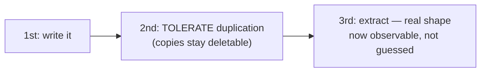
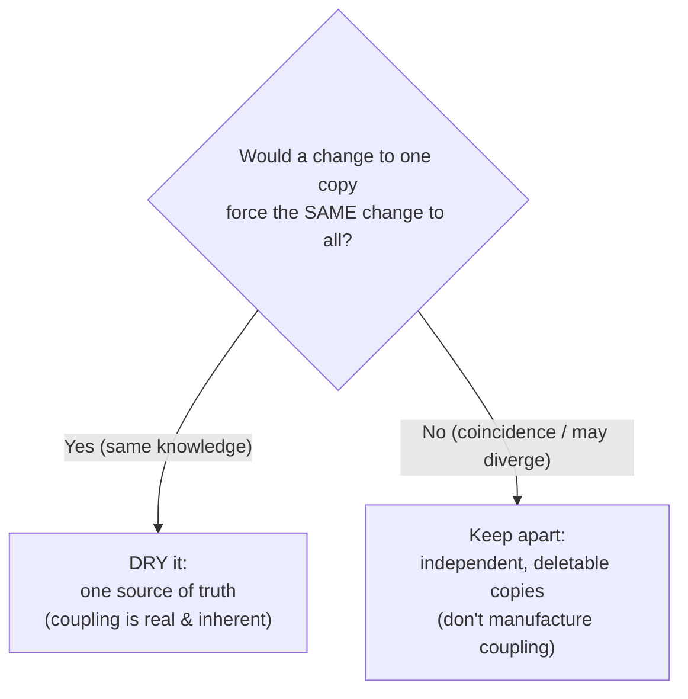
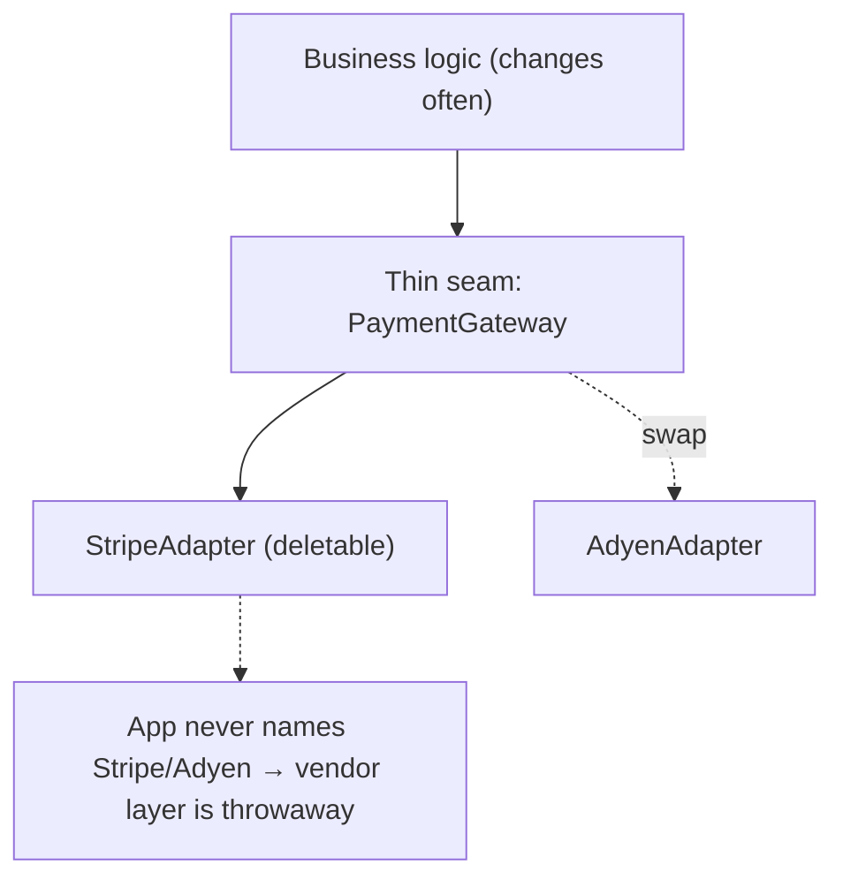

# Optimize For Deletion — Middle

> **Category:** [Design Principles](../../README.md) — write code that is *easy to delete*, not code that is easy to extend, because most change is deletion or replacement.

> **Prerequisite:** [Junior](junior.md)
> **Focus:** **Why** and **When**

---

## Introduction

> Focus: **Why** and **When**

At the junior level *optimize for deletion* is a slogan with a memorable test ("how many files would I touch to remove this?"). At the middle level it becomes a **design heuristic you apply continuously**, and its real subject is revealed: it is a principle about **coupling and boundaries**, dressed up as a principle about deletion. "Can I delete this cleanly?" is simply the most concrete, least hand-wavy way to *measure* coupling that anyone has come up with.

The recurring judgement call at this level is the **DRY-vs-deletability tension**: when do you consolidate duplication into one shared thing (DRY), and when do you keep the copies apart so each stays independently deletable? Getting this wrong in either direction is one of the most common and expensive mistakes in software — premature DRY in particular produces the *wrong abstraction*, which is harder to delete than the duplication it replaced. This file gives you the framework to decide.

---

## Deletability Is a Coupling Property

The whole principle reduces to one observation:

> **You can delete a piece of code exactly when nothing else depends on it. So deletability is the inverse of (incoming) coupling.**

A feature with **high afferent coupling** (many things depend on it) is hard to delete — every dependent must change. A feature with **low afferent coupling** (few things depend on it, all through a narrow boundary) is easy to delete — cut the boundary, remove the box.

This reframing is liberating because *coupling* is abstract and easy to argue about, while *deletion* is concrete and ends the argument. Two engineers can debate forever whether a design is "too coupled." But "to remove this feature, you'd have to edit 14 files across 5 modules and migrate a database column" is a fact. **Deletion is the empirical test for coupling.**

```
   deletability  ∝  1 / (number of places that depend on the code)

   ┌──────────────┬───────────────────┬──────────────────────────────┐
   │ Afferent     │ Deletion cost     │ Verdict                      │
   │ coupling     │                   │                              │
   ├──────────────┼───────────────────┼──────────────────────────────┤
   │ 0 callers    │ delete the file   │ trivially deletable          │
   │ 1 narrow seam│ cut 1 line + file │ deletable (good boundary)    │
   │ scattered    │ edit N files      │ rigid; will become dead code │
   │ core type    │ near-impossible   │ load-bearing; never removed  │
   └──────────────┴───────────────────┴──────────────────────────────┘
```

This is why the design moves that improve deletability are *exactly* the ones that [minimise coupling](../../02-coupling-and-cohesion/01-minimise-coupling/): narrow interfaces, clear module boundaries, no leaking of a feature's concepts into shared/core types, and **[orthogonality](../../02-coupling-and-cohesion/06-orthogonality/)** — keeping unrelated things unrelated so a change (or deletion) in one doesn't disturb the other.

---

## The Layers-As-Seams Technique

The essay's most actionable structural advice is to **build layers you can throw away one at a time.** A layer is a seam: a place where you can cut. The goal is not "one reusable component" but "a stack where each layer is dumb enough to be rewritten or deleted without the neighbors caring."

```
   ┌─────────────────────────────┐
   │ Application / business logic │  ← changes often; knows nothing about Stripe
   ├─────────────────────────────┤
   │ PaymentGateway (thin seam)   │  ← a small interface: charge(), refund()
   ├─────────────────────────────┤
   │ StripeAdapter                │  ← DELETABLE: swap for AdyenAdapter, app unaffected
   └─────────────────────────────┘
```

```typescript
// The seam: a tiny interface the app depends on.
interface PaymentGateway {
  charge(amountCents: number, token: string): Promise<Receipt>;
}

// The deletable layer: everything Stripe-specific lives here and ONLY here.
class StripeGateway implements PaymentGateway {
  async charge(amountCents: number, token: string): Promise<Receipt> {
    const res = await stripe.charges.create({ amount: amountCents, source: token });
    return { id: res.id, paid: res.paid };
  }
}

// App code depends on the seam, never on `stripe`.
async function checkout(cart: Cart, gateway: PaymentGateway) {
  return gateway.charge(cart.totalCents, cart.token);
}
```

To drop Stripe for Adyen, you delete `StripeGateway` and write `AdyenGateway`. The application code — the part that changes most and matters most — never mentions either vendor, so it isn't touched. The seam made the vendor layer **deletable**.

> Note the nuance: this *is* an abstraction (an interface), and abstractions can hurt deletability. The difference is that this seam sits at a **real boundary with two foreseeable sides** (you genuinely might change payment providers, and the vendor SDK is foreign code you don't control). A seam at a real boundary *increases* deletability. A seam invented speculatively *decreases* it. (More at [Senior](senior.md).)

---

## Separate Code That Changes For Different Reasons

A subtle but high-leverage technique: **keep code that changes on different schedules in different places.** When two things are physically together, deleting or changing one disturbs the other — even if they're logically unrelated.

This is the deletion-flavored statement of the Single Responsibility Principle ("one reason to change") and of [orthogonality](../../02-coupling-and-cohesion/06-orthogonality/). The deletion lens makes it concrete:

```python
# BAD: pricing rule + tax rule + audit logging tangled in one function.
def finalize_order(order):
    price = order.subtotal * (0.9 if order.is_member else 1.0)   # promo (changes monthly)
    tax   = price * regional_rate(order.region)                  # tax (changes yearly, by law)
    audit_log.write(f"order {order.id} priced {price} tax {tax}") # audit (changes ~never)
    return price + tax

# To delete the seasonal promo you must edit this function and risk tax + audit.
```

```python
# GOOD: three concerns, three homes — each independently deletable.
def apply_promotions(order, price): ...   # promo lives here; delete the file when promo ends
def apply_tax(order, price): ...          # tax lives here; changes on its own legal schedule
def audit(order, price, tax): ...         # audit lives here; rarely touched

def finalize_order(order):
    price = apply_promotions(order, order.subtotal)
    tax   = apply_tax(order, price)
    audit(order, price, tax)
    return price + tax
```

Now retiring the promotion is "delete `apply_promotions` and its call." Tax and audit are untouched because they were never entangled with it. **Things that change for different reasons, separated, are independently deletable.**

---

## The DRY Tension, Properly

This is the intellectual heart of the topic, and it deserves precision rather than slogans.

**[DRY](../07-dry/)** says: every piece of *knowledge* should have a single authoritative representation. Its enemy is **inconsistency** — when the same rule lives in five places, a change updates four and forgets the fifth, and now the system is subtly wrong.

**Optimize for deletion** sometimes says: keep the copies apart. Its enemy is **coupling** — when five places all depend on one shared representation, that representation becomes load-bearing and un-deletable, and a change to it ripples to all five whether they wanted the change or not.

These are not contradictory goals; they are **two different risks**, and the right move depends on which risk is real for *this* code:

| | **DRY (consolidate)** | **Optimize for deletion (separate)** |
|---|---|---|
| Fights | Inconsistency: forgetting a copy | Coupling: can't change/delete one without the others |
| Correct when | The copies are the *same knowledge* — a change to one *must* change all | The copies *coincidentally* match, or are tiny, or may diverge |
| Cost if you're wrong | A consistency bug (forgot a copy) | A hard-to-delete dependency wired everywhere |
| The shared thing becomes | A single source of truth (good) | A bottleneck everything leans on (bad) |
| Reversal cost | Low: extract a helper later, cheaply | **High: un-merging a wrong abstraction is surgery** |

The decisive question is the one from the [DRY](../07-dry/) topic: **would a change to one copy *necessarily* require the same change to every other copy?**

- **Yes → same knowledge → DRY it.** The coupling is *real and inherent*; consolidating it just makes the existing coupling honest and single-homed.
- **No → coincidence or divergence → keep them apart.** Merging them *manufactures* coupling that wasn't there, and welds together things that should be independently deletable.

> DRY is about **knowledge**, not about **characters on screen**. Optimize-for-deletion is the principle that stops you from DRYing *coincidence*. They only conflict when you misidentify coincidental similarity as shared knowledge — and the cost of that mistake is asymmetric: a missed-copy bug is cheap to fix; a wrong abstraction is expensive to undo.

---

## Premature DRY as a Deletion Hazard

The classic way deletability dies is **premature DRY**: extracting a shared abstraction on the *second* occurrence, before you know the real shape, and then bolting on parameters as the cases diverge.

```python
# Occurrence 1: invoice line rendering.
def render_invoice_line(item):
    return f"{item.name:<30} {item.qty:>3} x ${item.price:.2f}"

# Occurrence 2 appears (a packing slip line). It LOOKS 90% the same.
# The premature-DRY instinct: extract a shared renderer NOW.
def render_line(item, show_price=True, width=30, currency="$", qty_first=False):
    ...   # already growing flags to serve two callers that aren't really the same
```

Fast-forward six months. A third caller (a customs declaration) and a fourth (an email receipt) each needed a tweak, each adding a flag:

```python
def render_line(item, show_price=True, width=30, currency="$", qty_first=False,
                redact_price=False, locale="en", compact=False, legacy_align=None):
    if compact and not show_price: ...
    elif legacy_align == "right" and locale != "en": ...
    # four callers, none sharing more than ~40% of this logic, ALL depending on it.
```

This function is now **the wrong abstraction**, and it is far harder to delete than the original duplication. You cannot remove the invoice feature without untangling it from the packing-slip, customs, and receipt features that share the function. The premature DRY *created* the coupling that destroyed deletability.

> **A premature, wrong abstraction is harder to delete than the duplication it replaced** — because deletion now requires un-merging four callers' divergent needs. The duplication would have let you delete each caller independently. This is the single most important sentence connecting DRY and this principle.

The recovery (detailed at [Senior](senior.md)) is counterintuitive: **re-introduce the duplication.** Inline `render_line` back into each caller, let each become clear and independent, and re-extract only the genuinely shared atoms.

---

## The Rule of Three as Referee

So how do you get DRY's consistency benefit without paying premature DRY's deletability cost? The **rule of three** is the referee both this topic and [DRY](../07-dry/) appeal to:

- **1st occurrence:** write it.
- **2nd occurrence:** *tolerate the duplication.* You can see one axis of similarity, but two points fit infinitely many curves — you don't yet know the abstraction's real shape. Keep the copies independent and deletable.
- **3rd occurrence:** *now* extract. With three concrete cases you can *observe* what is truly invariant (shared by all three) versus incidental (varies). The abstraction's boundary is data, not a guess — so it's far less likely to be the wrong one.



The rule of three is best understood as **trading a little inconsistency risk for a lot of deletability**, until you have enough evidence that the abstraction is correct. The exception: if the knowledge is *provably* identical and regulated (a single tax rule duplicated verbatim), DRY it on sight — there's nothing to guess, and the consistency risk dominates.

---

## Practical Signals That Deletability Is Failing

Deletability degrades quietly. Watch for these tells:

| Signal | What it means |
|---|---|
| **Dead code nobody dares delete** | The team can't determine what depends on it → boundaries are unclear. The fear *is* the smell. |
| **"We can't remove X, everything depends on it"** | High afferent coupling. X became load-bearing — the un-deletable trap. |
| **A "utils"/"common"/"core" module that everything imports** | A coupling magnet. Anything that lands there becomes un-deletable. |
| **Feature removal requires a database migration** | The feature leaked into the schema (a [one-way door](../05-avoid-premature-optimization/)) — it has no clean boundary. |
| **You can't find all the places a feature touches** | Implicit hooks/magic. Un-findable ⇒ un-deletable. |
| **A shared function with many boolean flags** | The wrong abstraction forming. Each flag is a caller that doesn't really belong. |

The headline **measurement**: *how many files (and migrations) must change to remove this feature?* Track it. A feature that takes one file to add but twenty to remove was built wrong. Git **change-coupling** analysis (which files historically change together) surfaces hidden dependencies that grep can't.

---

## Feature Flags, Kill-Switches, and Deprecation Paths

Deletion in a live system is rarely instantaneous; it's a *process*. The tools that make it safe:

- **Feature flag / kill-switch.** Wrap a new feature in a toggle. You can turn it *off* in production instantly (a soft delete) before you remove the code. This decouples "stop using it" from "remove it," making both safer.
- **Deprecation path.** For a public-facing thing (an API endpoint, a config key), mark it deprecated, warn callers, give them time, then delete. The boundary you built earlier is what makes the final delete a one-file change.
- **Strangler-fig replacement.** To replace a hard-to-delete subsystem, build the new one *behind the same boundary*, migrate callers one at a time, then delete the old subsystem whole. (Detailed at [Senior](senior.md) and [Professional](professional.md).)

All three rely on the *same* underlying property: a **clean boundary**. A kill-switch is cheap to add only if the feature is already bounded; a strangler-fig works only if there's a seam to strangle along. Deletability is what makes graceful removal *possible*.

---

## Trade-offs

| Decision | Lean deletable (bounded, some duplication) | Lean reusable (one shared abstraction) |
|---|---|---|
| Coupling | Low — pieces are independent | High — everything leans on the shared thing |
| Cost to delete one piece | Low — cut the seam | High — every dependent must change |
| Consistency risk | Higher — copies can drift | Lower — single source of truth |
| Cost when copies *should* stay in sync | A drift bug (cheap to fix) | — |
| Cost when the abstraction was wrong | — | **High — un-merge surgery** |
| Best when | Cases may diverge; the thing is small; it's a feature | Cases are provably the same knowledge; it's a true invariant |

The governing asymmetry: **DRYing too late costs you a consistency bug, which is local and cheap to fix. DRYing too early costs you a wrong abstraction, which is global and expensive to undo.** When in doubt, the cheaper mistake is to wait — which is why the rule of three defaults toward tolerating duplication.

---

## Edge Cases

### 1. True invariants should be DRY, not duplicated

Optimize-for-deletion is *not* a license to scatter a regulated tax rate, a security check, or a protocol constant across the codebase. Those are genuine single pieces of knowledge; duplicating them is the bug DRY exists to prevent. Deletability favors duplication only for things that are *small, coincidental, or likely to diverge* — never for a load-bearing invariant. (See [Senior](senior.md) on shared kernels.)

### 2. The boundary itself is the abstraction worth keeping

When you hide a vendor behind a seam, you *add* an interface — an abstraction. That's correct: the seam increases deletability of the vendor layer. The skill is distinguishing a **boundary seam** (good, keep) from a **premature consolidation** (bad, delete). A boundary seam separates *you* from *foreign/volatile code*; a premature consolidation merges *two of your own features* that merely look alike.

### 3. Duplication across deployment boundaries is almost always right

Two microservices that each need a `Money` formatting helper should usually *copy* it, not share a library — because a shared library couples their release cycles and you can no longer delete or change one service's copy independently. *"A little copying is better than a little dependency"* is strongest across service boundaries.

---

## Tricky Points

- **Optimize-for-deletion ≠ anti-abstraction.** It is *anti-premature-abstraction* and *anti-coupling*. The right abstraction at a real seam is the most deletion-friendly thing you can build. The argument is about *timing and placement*, not about whether to abstract at all.
- **"Reusable" is often a euphemism for "un-deletable."** Reuse means many dependents; many dependents means you can't remove it. High reuse and high deletability are in direct tension — neither is free.
- **DRY and deletability agree more than they conflict.** 90% of the time, removing *real* knowledge duplication also *reduces* coupling (one home instead of five). They only fight when you mistake coincidence for shared knowledge — that's the 10% where this principle earns its keep.
- **You can't delete what you can't find.** Magic, reflection, auto-discovery, and convention-over-configuration trade explicitness for brevity — and explicitness is what makes a feature greppable, therefore deletable. Implicit wiring is a deletion tax.
- **The migration is the real cost.** When deletion requires a *data* migration (the feature touched the schema), you've hit a [one-way door](../05-avoid-premature-optimization/). Those boundaries deserve up-front care; internal code does not.

---

## Best Practices

1. **Treat "can I delete this cleanly?" as your coupling meter.** It's the most concrete test for coupling you have.
2. **Give every feature a boundary**, and keep all of it on one side so removal is "cut the seam, delete the box."
3. **Ask the DRY question before consolidating:** *would a change to one copy force the same change to all?* No → keep them apart.
4. **Default to the rule of three.** Tolerate duplication twice; extract on the third, when the shape is observable.
5. **Separate code that changes for different reasons** so each is independently deletable.
6. **Hide volatile/foreign code (vendors, subsystems) behind thin seams** — those abstractions *increase* deletability.
7. **Prefer copying across service boundaries** to a shared dependency that couples release cycles.
8. **Build kill-switches and deprecation paths** so removal is a safe process, not a risky event.

---

## Test Yourself

1. Why is "can I delete this cleanly?" really a question about coupling?
2. State the DRY-vs-deletability tension in terms of the two *risks* each principle fights.
3. What single question decides whether two similar pieces of code should be DRYed or kept apart?
4. Why is a premature (wrong) abstraction harder to delete than the duplication it replaced?
5. How does the rule of three referee the tension, and what's its one exception?
6. Give three signals that a codebase's deletability is degrading.

---

## Summary

- **Deletability is a coupling property.** "Can I delete this cleanly?" is the concrete test for coupling; deletion cost ∝ afferent coupling.
- The structural techniques — **layers-as-seams**, **separating code that changes for different reasons** — are coupling-reduction moves that make features independently removable.
- The **DRY tension** is two *risks*: DRY fights inconsistency, deletion fights coupling. Decide with *"would a change to one force the same change to all?"* — yes → DRY; no → keep apart.
- **Premature DRY is a deletion hazard:** a wrong abstraction is harder to delete than the duplication it replaced, because deletion means un-merging divergent callers. The **rule of three** is the referee; the asymmetry (cheap drift-bug vs. expensive un-merge) favors waiting.
- **Signals of failing deletability:** dead code, "everything depends on this," catch-all utils modules, removal needing a migration, un-findable features, flag-laden shared functions.
- **Kill-switches, deprecation paths, and strangler-fig** make removal a safe process — all relying on a clean boundary.

---

## Diagrams

### DRY vs. deletability — which risk are you fighting?



### Layers as seams — delete one without disturbing the rest




---

## Check your understanding

1. Explain Optimize For Deletion — Middle Level in your own words and name the problem it solves.
2. How would you apply the ideas around Table of Contents, Introduction, Deletability Is a Coupling Property in a realistic engineering change?
3. What failure mode or misuse should you look for, and what evidence would reveal it?
4. Which local design trade-off would make you choose or reject Optimize For Deletion — Middle Level in an existing codebase?
5. What observable result would convince you that the approach improved the system?
