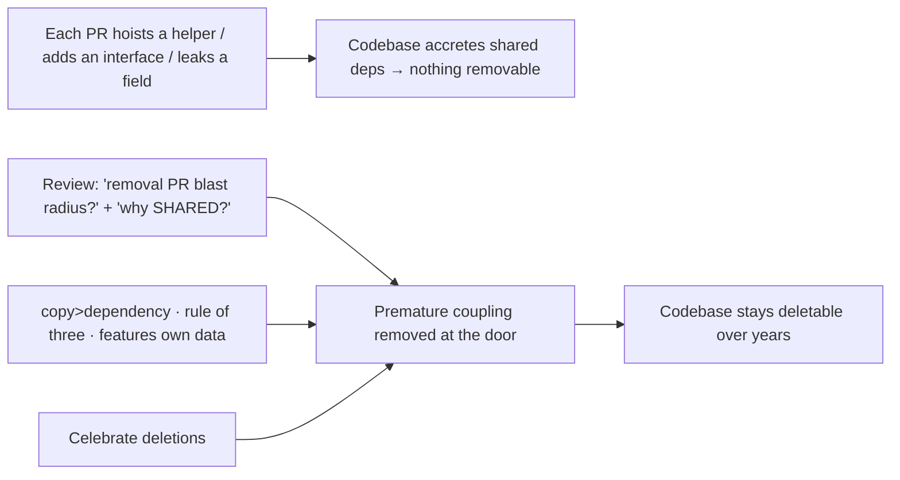
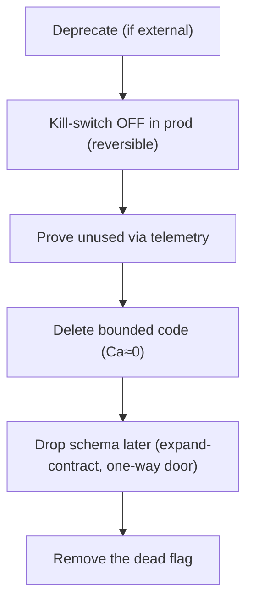

# Optimize For Deletion — Professional

> **Category:** [Design Principles](../../README.md) — write code that is *easy to delete*, not code that is easy to extend, because most change is deletion or replacement.

> **Prerequisites:** [Junior](junior.md) · [Middle](middle.md) · [Senior](senior.md)
> **Focus:** **Production** — reviews, metrics, team conventions, legacy systems

---

## Introduction

> Focus: **production** — keeping a large, multi-contributor codebase deletable over years.

Deletability is easy to praise and hard to preserve. Every incentive in a large organization pushes the other way: reuse is celebrated, shared "platforms" win promotions, DRY is taught as an absolute, and removing code is invisible work that nobody schedules. The result is the universal trajectory of long-lived codebases — they accrete shared dependencies until *nothing* can be removed, and "we can't change that, everything depends on it" becomes the most-spoken sentence in the building.

At the professional level the question is operational: **how do you keep a codebase deletable when hundreds of changes land per week, the culture rewards reuse, and the most valuable cleanup — deletion — is the least rewarded?** The answer is a system: review standards that treat new shared dependencies as costs, metrics that make coupling and removal-blast-radius visible, conventions that make the deletable path the default, and a disciplined, test-guarded approach to clawing back deletability in legacy systems.

---

## Enforcing Deletability in Code Review

Most un-deletability enters one reasonable-looking PR at a time: a helper hoisted into `common/`, an interface "to be flexible," a field added to a core type. A reviewer optimizing for deletion **scrutinizes new coupling as hard as new bugs** — because coupling is a slow bug in the system's evolvability.

### The two highest-value review questions

> **1. "If we had to delete this feature next quarter, what would the removal PR touch?"**
> **2. "What present, concrete need forces this *shared* dependency — and could a copy keep the two sites independent instead?"**

The first surfaces blast radius before it's baked in. The second is the DRY referee at review time: it distinguishes a justified shared kernel (a real invariant) from a premature consolidation (coincidental similarity becoming coupling). "It's more reusable / DRY / future-proof" is a **red flag, not a justification** — reuse is a cost (deletability), and the reviewer's job is to confirm the cost buys something real.

### What to push back on

| In the PR | Ask | Default action |
|---|---|---|
| A new entry in `common/`, `utils/`, `core/`, `shared/` | "Is this a true invariant, or two things that look alike?" | Copy locally unless it's a stable invariant |
| A one-implementation interface | "What's the second implementation? Is it real today?" | Use the concrete type; add the seam when impl #2 lands |
| A field/concept added to a core type (`User.featureXEnabled`) | "Can the feature own this instead of leaking into core?" | Keep the feature's data inside the feature's boundary |
| A shared function gaining its 2nd/3rd boolean flag | "Are these still the same operation?" | Split into named functions; this abstraction is diverging |
| A new feature with no obvious boundary | "Where's the seam I'd cut to remove this?" | Require the feature to live behind a module/function |
| A shared lib pulled across a *service* boundary | "Does this couple two release cycles?" | Prefer copying across services |

### Review comment templates

> "This is the only caller of `formatMoney` outside `billing`. Pulling it into `common/` couples `reports` to `billing`'s release cycle for a 4-line function. I'd copy it into `reports` — a little copying beats a little dependency."

> "`renderRow(item, variant, compact, redact, legacy)` is now four features behind one function. To delete any one of them we'd have to untangle the others. Let's split into named components and share only `<Row>` if anything is genuinely common."

> "We're adding `promoEligible` to `User`. That leaks the promo into our core type — when the promo ends, removal touches everything that reads `User`. Can the promo module own this and look the user up?"

> "Great deletion! This removed the feature in one file and one call site — exactly the blast radius we want. Approving."

---

## The Reuse-Worship Culture and How to Counter It

The organizational disease this principle treats is **reuse worship**: the unexamined belief that sharing code is always good and duplication is always bad. Its symptoms and counters:

| Root cause | What it looks like | Counter |
|---|---|---|
| **DRY taught as an absolute** | Every duplicate is "refactored away" on sight | Teach the connascence test: DRY *knowledge*, not coincidence (see [Senior](senior.md)) |
| **"Platform" prestige** | Generic engines/frameworks built for 1–3 cases | Require a present requirement for generality; a "platform" needs ≥3 real, divergent consumers |
| **Reuse measured, deletion ignored** | LOC added is visible; LOC deleted is invisible | Track and celebrate net-negative PRs and feature removals |
| **Fear of duplication > fear of coupling** | Helpers hoisted into `common/` reflexively | Reframe: coupling is the more expensive, less reversible mistake |
| **Résumé-driven abstraction** | Patterns added to look senior | The senior move is *deleting* an abstraction; make that the prestige signal |

The cultural reframe a professional must drive:

> **Reuse is not free — it is paid for in deletability. The team's job is not to maximize reuse; it's to spend reuse deliberately on stable invariants and avoid it for everything that might diverge.**

And the corollary every team should internalize: **celebrate deletions.** In most organizations the engineer who builds a 3,000-line "reusable framework" is praised and the one who deletes it is invisible — yet the deletion is usually the more valuable, harder, and riskier work. Flip the incentive. "I deleted the rules engine; the five rules are now five functions; onboarding a rule went from days to minutes" should earn more recognition than building it did.

> A proverb for the team wall: *"It's harder to delete code than to add it — which is exactly why the engineer who safely deletes it is worth more."*

---

## Measuring Deletability in Production

You manage what you measure, and deletability is measurable — but the naive metrics mislead.

| Metric | Tracks deletability? | Notes |
|---|---|---|
| **Afferent coupling (Ca)** per module | **Yes** | Direct: high Ca = low deletability. Rising Ca on a module is the alarm. |
| **Change-coupling (logical coupling)** from git history | **Yes (the best)** | Files that *change together* are effectively one un-deletable unit — surfaces hidden connascence imports miss. |
| **Feature-removal blast radius** (deletion-PR size) | **Yes (ground truth)** | For a representative feature, how many files + migrations does a clean removal touch? Track the trend. |
| **Duplication %** (CPD/SonarQube) | **Misleading alone** | High % may be *healthy* independent copies; low % can hide strong connascence. Never optimize this number blindly. |
| **Lines added vs. deleted** | **Weakly (cultural)** | A team that never ships net-negative PRs is accreting; useful as a *trend*, not a target. |
| **Dead-code volume** (coverage + static analysis) | **Yes (outcome)** | Growing un-removed dead code = the team can't determine dependencies = poor deletability. |

### The honest-measurement rules

- **Never chase a low duplication score.** It is the metric most likely to *cause* the wrong abstraction. A team that "reduced duplication 40%" may have manufactured 40% more coupling. Pair duplication-% with change-coupling before acting on it.
- **Use change-coupling as the real duplication detector.** Two files that always change together share *behavioral* knowledge — that's the connascence DRY should target, and it's invisible to textual duplication tools.
- **Run the deletion experiment periodically.** Pick a feature you might plausibly retire; have someone sketch the removal PR. Its size *is* that area's deletability — and the exercise often reveals the schema entanglement nobody knew about.
- **Watch afferent coupling on shared modules as a trend.** When `common/`, `core/`, or a shared service's client library grows its dependent count quarter over quarter, deletability is eroding system-wide.

> Reporting "we cut duplication" after a consolidation is exactly the wrong brag — you may have traded a cheap inconsistency risk for an expensive coupling liability. Report afferent coupling, change-coupling, and feature-removal blast radius.

---

## Team Conventions for Deletable Code

Codify these so deletability is the default, not a per-PR fight:

1. **"A little copying is better than a little dependency"** is a stated value — especially **across service boundaries**, where a shared library couples release cycles.
2. **Rule of three for extraction.** No shared abstraction before the third concrete occurrence, unless the knowledge is a provably-identical invariant.
3. **No new entries in `common/`/`utils/` without a "shared kernel" justification** — a named, stable invariant, not "two things looked alike."
4. **Features own their data.** No leaking a feature's concept into core types (`User`, `Order`); the feature module owns its fields and looks up what it needs.
5. **Every feature has a boundary.** New features live behind a module/package you could delete as a unit; "where's the seam?" is a design-review question.
6. **One-implementation interfaces are banned in new code** (test seams excepted and documented) — they're speculative coupling.
7. **Schema changes get a removal note.** Because data is a [one-way door](../05-avoid-premature-optimization/), any change that lets a feature touch the schema must document how the feature would be *removed*.
8. **Deletions are celebrated and tracked.** Net-negative-LOC and feature-removal PRs are called out in reviews/retros.

These encode the senior reasoning so juniors get it right by default and reviewers cite a policy, not a personal preference.

---

## Deprecation and Removal Playbook

Deletion in a live system is a *process*, not an event. The professional sequence for removing a real feature safely:

```text
1. ANNOUNCE (for anything external): mark deprecated; log/warn on use;
   set a removal date. Internal-only? Skip to step 3.
2. KILL-SWITCH: gate the feature behind a flag; turn it OFF in production
   first (a reversible "soft delete"). Watch for fallout for a release.
3. PROVE IT'S UNUSED: telemetry on the feature's entry points; confirm
   zero traffic. (You can't safely delete what you can't prove is dead.)
4. DELETE THE CODE: with the flag off and traffic at zero, the afferent
   coupling is effectively zero → remove the bounded feature in one PR.
5. RECLAIM THE DATA: drop the now-unused columns/tables in a SEPARATE,
   later migration (expand-contract) — never in the same step as the code.
6. REMOVE THE FLAG: delete the now-dead toggle and its branches.
```

Two professional cautions: **(a)** kill-switch *before* delete — turning a feature off is reversible; deleting it is not, so prove safety with the flag first. **(b)** Separate the *code* deletion from the *schema* deletion (expand-contract): the code delete is cheap and reversible; the schema delete is the one-way door, done deliberately and later, once you're certain.

---

## Recovering Deletability in Legacy Systems

Greenfield deletability is easy. The professional reality is **clawing it back from a system that is already a web of shared dependencies, under-tested, and in production.** The approach is incremental, test-guarded, and opportunistic — never a big-bang rewrite.

### Removing the *wrong abstraction* safely

The senior-level recovery, executed with a production net:

```text
1. CHARACTERIZE: write tests around every caller of the over-general
   abstraction, pinning CURRENT behavior (even bugs).
2. INLINE: push the abstraction's body back into each caller
   (temporarily MORE duplication — on purpose; it's now deletable).
3. SIMPLIFY each caller independently — delete the flags/branches that
   caller never used.
4. RE-EXTRACT only the atoms that are genuinely shared knowledge.
5. DELETE the old abstraction (its callers no longer reference it).
```

The intermediate state has more duplication, and that's correct: the wrong abstraction was *worse* than duplication because it was un-deletable. (See [Senior](senior.md); the technique is Sandi Metz's.)

### Strangling an un-deletable subsystem

For a subsystem everything depends on (can't be cut directly), use **strangler-fig**: introduce a seam in front of it, route callers through the seam, build the replacement behind the same seam, migrate callers slice by slice, and delete the legacy whole once its afferent coupling hits zero. You are *manufacturing* deletability that wasn't built in. (Detailed at [Senior](senior.md).)

### What *not* to do in legacy code

- **Don't delete without proving it's unused.** "I'm pretty sure nothing calls this" is how outages happen. Telemetry or characterization tests first.
- **Don't replace one over-coupled structure with a different over-coupled one** ("now it's a microservice!"). Aim for bounded, deletable pieces, not a new favorite architecture.
- **Don't boil the ocean.** A standalone "decoupling initiative" with no feature value rarely survives a deadline. Recover deletability *opportunistically*, on the files you touch for real work.
- **Don't drop schema and code in the same migration.** Expand-contract; the data one-way door is handled separately and later.

---

## Real Incidents

### Incident 1: The shared library that froze two teams

A 200-line `commons-formatting` library was shared by the checkout service and the reporting service "to avoid duplication." A formatting fix that reporting needed required a new library version — but checkout was mid-freeze for a launch and couldn't take the upgrade. Reporting was blocked for three weeks by a change to *four lines of code* it could have owned outright. **Postmortem:** a shared dependency *across a service boundary* coupled two independent release cycles. **Fix:** each service copied the helper; the shared library was deleted. **Lesson:** across services, a little copying is dramatically better than a little dependency — the dependency couples *deployments*, the most expensive coupling there is.

### Incident 2: The DRY refactor that became un-deletable

An engineer merged invoice, packing-slip, and receipt rendering into one `renderDocument(type, flags...)` function "to be DRY." Over two years it grew eleven boolean flags. When the company killed the legacy invoice format, removing it was estimated at *three weeks* — because the invoice logic was entangled with packing-slip and receipt logic in the shared function, and no one could safely change one without regression-testing all three. **Fix:** characterization tests, inline back to three functions, delete the invoice one. **Lesson:** the premature DRY didn't save work — it converted a one-file deletion into a three-week untangling. The wrong abstraction is un-deletable coupling. (See [Senior](senior.md).)

### Incident 3: The feature that leaked into the schema

A "referral program" was shipped fast by adding `referral_code`, `referred_by`, and `referral_bonus` columns to the core `users` table and reading them in eight modules. When the program was discontinued, the *code* removal was easy — but the columns were now referenced by analytics jobs, a data-warehouse sync, and a compliance export nobody had mapped. Cleanly removing the feature took a quarter and a coordinated multi-team migration. **Lesson:** the feature had no boundary — it leaked into the data layer, the one place that's a one-way door. Optimizing the *code* for deletion while ignoring the *schema* optimized the cheap thing. Features should own their data behind a boundary (a `referrals` table, not columns on `users`).

### Incident 4: The duplication that should have been a kernel

Reacting to Incident 2, a team over-corrected and *duplicated* their money-rounding rule across nine payment endpoints "for deletability." A regulatory change to the rounding mode then had to be made in nine places; one was missed, mis-rounding a class of transactions for two weeks. **Lesson:** rounding is a genuine *invariant* (real connascence) — it must be a small, DRY shared kernel. Optimize-for-deletion favors duplicating *features*, never invariants. The balanced rule: **DRY the invariants; duplicate the features.**

---

## Review Checklist

```text
DELETABILITY REVIEW CHECKLIST
[ ] BLAST RADIUS — if we deleted this feature next quarter, what does the
    removal PR touch? (few files = good boundary)
[ ] SHARED DEPENDENCY — every new common/util/core entry has a "stable
    invariant" justification, not "two things looked alike"
[ ] CONNASCENCE — DRYing real shared KNOWLEDGE, not coincidental similarity
[ ] BOUNDARY — the feature lives behind a seam you could cut to remove it
[ ] NO LEAK — feature concepts/fields don't bleed into core types
[ ] FLAG-SOUP — no shared function growing its 2nd/3rd boolean flag (split it)
[ ] SERVICE BOUNDARY — no shared lib coupling two independent release cycles
    (prefer copying across services)
[ ] ONE-IMPL INTERFACE — none in new code (test seams excepted + documented)
[ ] SCHEMA / ONE-WAY DOOR — schema changes carry a removal note
[ ] INVARIANTS — genuine invariants (rounding, protocol, security) ARE DRY,
    in a small shared kernel — not duplicated
```

---

## Cheat Sheet

```text
THE PRINCIPLE          write code that is easy to DELETE; reuse costs
                       deletability. DRY the invariants; duplicate the features.

REVIEW QUESTIONS       "what would the removal PR touch?"
                       "what real need forces this SHARED dependency?"
                       ("more reusable/DRY" is a red flag, not a reason)

MEASURE                afferent coupling · change-coupling (git) ·
                       feature-removal blast radius · dead-code volume.
                       NOT duplication-%-alone (it CAUSES wrong abstractions).

WRONG ABSTRACTION      characterize → inline back to callers → simplify each →
                       re-extract only shared atoms → delete the old one.

UN-DELETABLE LEGACY    strangler-fig: seam in front → new impl behind →
                       migrate slice by slice → Ca→0 → delete whole.

REMOVAL PLAYBOOK        deprecate → kill-switch OFF → prove unused →
                        delete code → THEN drop schema (expand-contract) →
                        remove flag.

CULTURE                reuse worship is the disease. Celebrate DELETIONS.
                       across services: copy > dependency.
```

---

## Diagrams

### Where un-deletability enters, and where it's stopped



### Safe removal of a live feature (kill-switch first, schema last)



---

## Related Topics

- **In tension with:** [DRY](../07-dry/) (DRY invariants, duplicate features).
- **The underlying property:** [Minimise Coupling](../../02-coupling-and-cohesion/01-minimise-coupling/), [Connascence](../../02-coupling-and-cohesion/03-connascence/), [Orthogonality](../../02-coupling-and-cohesion/06-orthogonality/).
- **Allied with:** [YAGNI](../02-yagni/), [Code For The Maintainer](../04-code-for-the-maintainer/).
- **One-way doors:** [Avoid Premature Optimization](../05-avoid-premature-optimization/).
- **Tooling:** afferent-coupling analysis, git change-coupling/code-maat, SonarQube (duplication — *with caution*), feature-flag platforms.

---


---

## Check your understanding

1. Explain Optimize For Deletion — Professional Level in your own words and name the problem it solves.
2. How would you apply the ideas around Table of Contents, Introduction, Enforcing Deletability in Code Review in a realistic engineering change?
3. What failure mode or misuse should you look for, and what evidence would reveal it?
4. How would you introduce and govern Optimize For Deletion — Professional Level across teams through reversible, measurable increments?
5. What observable result would convince you that the approach improved the system?
