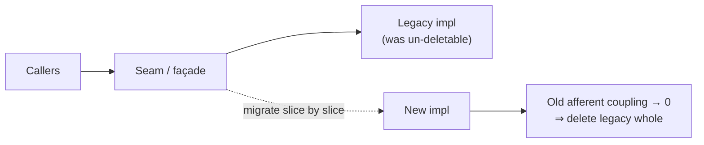
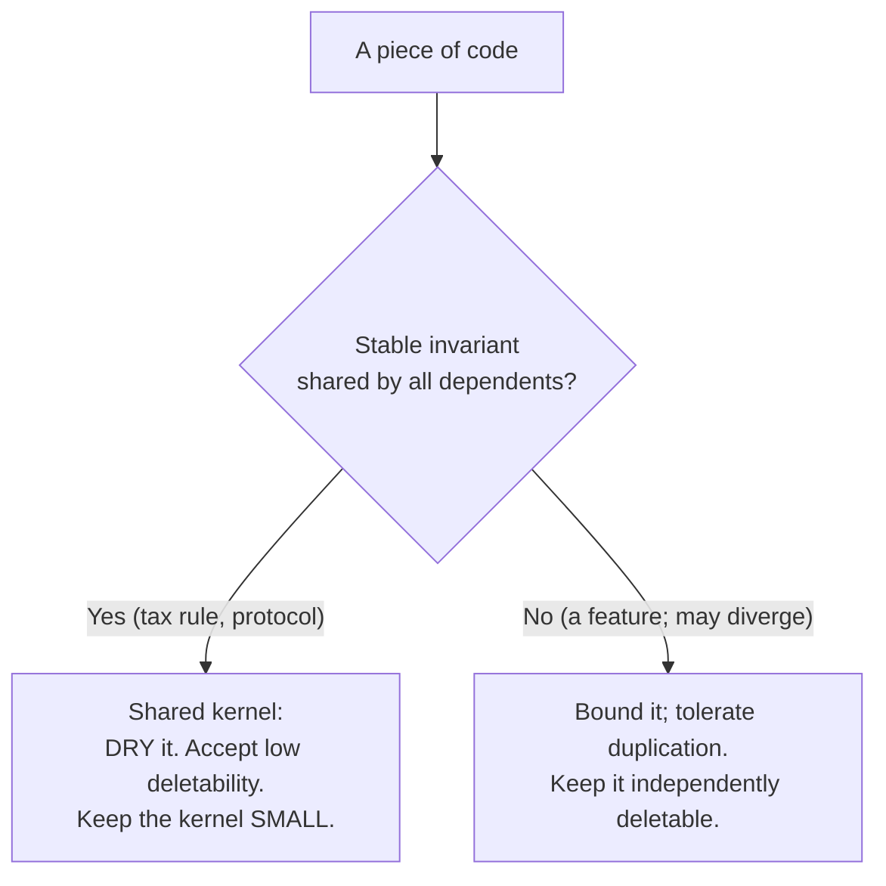
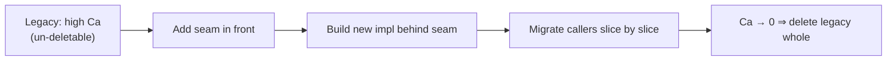

# Optimize For Deletion — Senior

> **Category:** [Design Principles](../../README.md) — write code that is *easy to delete*, not code that is easy to extend, because most change is deletion or replacement.

> **Prerequisites:** [Junior](junior.md) · [Middle](middle.md)
> **Focus:** **Design trade-offs** and **system-level reasoning**

---

## Introduction

> Focus: **design trade-offs** and **system-level reasoning**

At the senior level, *optimize for deletion* stops being a tidiness heuristic and becomes a **stance in the oldest argument in software design: reuse versus independence.** The industry's default value system — inherited from object-orientation, framework culture, and a misread of DRY — treats reuse and abstraction as unalloyed goods. tef's essay, Rob Pike's proverb, and Sandi Metz's "the wrong abstraction" are a coordinated rebuttal: **reuse has a cost, and that cost is deletability.** Every time you make code reusable, you make it depended-upon, and depended-upon code is code you can no longer remove.

A senior must hold three hard truths simultaneously and know which applies where:

1. **Reuse and deletability are genuinely opposed.** You cannot maximize both; you choose per boundary.
2. **The wrong abstraction is more expensive than duplication** — but *some* shared kernels must be DRY, and conflating the two is a different failure.
3. **Deletability is the load-bearing property for evolvability**, and it is purchasable, even retroactively, via strangler-fig and seam-building.

---

## Reuse and Deletability Are in Direct Tension

State it plainly:

> **Reusable code is depended-upon code. Depended-upon code is hard to delete. Therefore reuse and deletability trade off against each other — you cannot maximize both.**

```
   reuse  ───────────────────────────────────►  more dependents
                                                        │
                                                        ▼
                                                 harder to delete
                                                 harder to change
```

This dissolves the naive belief that "make it reusable" is always good. Reuse is good *when the thing being reused is stable knowledge that genuinely belongs to all its dependents* — a math library, a protocol codec, a domain invariant. Reuse is a liability *when it couples things that should evolve independently* — two features that merely look alike, two services that should release on their own schedule, a "platform" built for one client.

The senior synthesis is **not** "never reuse." It is: **choose your reuse boundaries deliberately, knowing each one is a deletability sacrifice.** A small number of well-chosen, stable shared kernels (high reuse, accepted low deletability) surrounded by many independent, bounded, even slightly-duplicated features (low reuse, high deletability) is the shape of a system that lasts. The failure is *uniform* reuse — DRYing everything — which maximizes coupling and minimizes deletability everywhere.

This is the same insight [orthogonality](../../02-coupling-and-cohesion/06-orthogonality/) encodes: unrelated things kept unrelated stay independently changeable and deletable. Reuse, applied indiscriminately, destroys orthogonality.

---

## The DRY–Deletability Conflict, Rigorously

The middle level gave the decision rule (*would a change to one force the same change to all?*). The senior level needs the underlying theory: **connascence** (Meilir Page-Jones), the precise vocabulary of coupling. (See [Connascence](../../02-coupling-and-cohesion/03-connascence/).)

Two pieces of code are **connascent** if changing one requires changing the other to keep the system correct. The key insight for this topic:

> **DRY's job is to eliminate connascence by giving shared knowledge one home. But DRYing *coincidental* similarity *manufactures* connascence where none existed — strengthening coupling and destroying deletability.**

So the DRY-vs-deletability question becomes precise:

- **Real duplication = pre-existing connascence (of meaning/algorithm) spread across locations.** The coupling is already there, latent and dangerous (forget a copy → bug). DRYing it *localizes* the connascence to one place — strictly an improvement, and *more* deletable (one home to remove, not five).
- **Coincidental similarity = no connascence.** The pieces look alike but a change to one need not change the other. DRYing them *creates* connascence — now they must change together though they had no reason to. This *reduces* deletability: you can no longer remove one without the other.

```
   REAL duplication (connascence already exists, scattered)
        A ──┐
        B ──┼─► same hidden rule   → DRY localizes it → MORE deletable
        C ──┘

   COINCIDENTAL similarity (no connascence)
        A      (looks like)      B   → DRY WELDS them → LESS deletable
        independent today                 (manufactured coupling)
```

The reframing that resolves the apparent contradiction: **DRY done right and optimize-for-deletion are the same goal — minimize connascence.** DRY removes *existing* connascence (good for deletability); optimize-for-deletion stops you from *creating new* connascence via premature abstraction. They only *appear* to conflict when "DRY" is misapplied to mean "merge anything that looks alike" — which is not DRY at all, but coincidental coupling wearing DRY's clothes.

---

## When the Wrong Abstraction Beats Duplication

Sandi Metz crystallized the senior heuristic: **"duplication is far cheaper than the wrong abstraction."** The mechanism, in deletability terms:

1. You see two similar code paths and extract a shared abstraction. *(Coupling created.)*
2. A requirement makes one caller need slightly different behavior. You add a parameter/flag. *(Abstraction starts diverging from its callers.)*
3. More callers, more flags. The abstraction becomes a conditional maze serving callers with little in common. *(Coupling now spans unrelated features.)*
4. The abstraction is load-bearing for N callers — so it is *risky and expensive* to remove. *(Deletability destroyed.)*

The duplication you avoided would have been *deletable*: each copy independent, removable in isolation, modifiable without fear. The abstraction you created is *not*: removing the invoice feature now means untangling it from the packing-slip, customs, and receipt features that share the megafunction.

> The wrong abstraction's true cost is not that it's ugly — it's that it is **un-deletable coupling**. It gets more expensive every day because every new caller deepens the entanglement, and removing it requires un-merging all of them at once.

This is *why* this principle ranks deletability above naive DRY: a clear, independent duplication preserves the property (deletability) that makes future change cheap; a premature abstraction destroys it.

---

## Escaping a Wrong Abstraction by Re-Introducing Duplication

The recovery is counterintuitive and worth internalizing: **to make a wrong abstraction deletable, first re-introduce the duplication.**

```python
# BEFORE — one "DRY" exporter, now a flag-soup serving 3 divergent callers.
def export(records, fmt="csv", header=True, gzip=False, dialect=None, redact=()):
    rows = [_redact(r, redact) for r in records] if redact else records
    if fmt == "csv":    out = _to_csv(rows, header, dialect)
    elif fmt == "json": out = _to_json(rows)        # header/dialect ignored
    else:               raise ValueError(fmt)
    return _gz(out) if gzip else out
# Un-deletable: the audit, API, and archive features all lean on this one function.
```

```python
# AFTER — inline back to each caller; re-extract ONLY genuinely shared atoms.
def export_audit_csv(records):                       # independent, deletable
    return _to_csv([_redact(r, PII_FIELDS) for r in records], header=True)

def export_api_json(records):                        # independent, deletable
    return _to_json(records)

def export_archive_csv(records):                     # independent, deletable
    return _gz(_to_csv(records, header=False))

# _to_csv / _to_json / _gz stay shared — they ARE shared knowledge (true connascence).
```

The intermediate state has *more* duplication on purpose. That is correct: the flag-driven megafunction was *worse* than duplication because it was un-deletable. After inlining, each exporter is independently removable; the real shared atoms (`_to_csv`, `_gz`) remain DRY because they encode genuine shared knowledge. **We removed the wrong abstraction, not all abstraction.**

The general algorithm (safe in production at [Professional](professional.md)):

```
1. Characterize every caller of the over-general abstraction with tests.
2. Inline the abstraction's body back into each caller (now duplicated, but clear).
3. Simplify each caller independently — delete the flags/branches it never used.
4. Re-extract ONLY the atoms that are genuinely shared knowledge across callers.
5. Delete the old abstraction.
```

---

## Shared Kernels: When DRY Must Win

The balanced senior position requires the *other* boundary too: **some things should be DRY, and treating optimize-for-deletion as "always duplicate" is its own failure.**

A **shared kernel** is knowledge that genuinely belongs to all its dependents and *must* stay consistent:

- A **domain invariant** — how money is rounded, how a tax is computed, the canonical definition of "an active account."
- A **protocol / wire format** — both sides must serialize identically (connascence of algorithm); duplicating it guarantees version skew.
- A **security or compliance rule** — duplicating a permission check across ten endpoints means a fix must land in ten places; one will be missed.

For these, **duplication is the bug**, not the safe choice. The connascence is *real and inherent*: a change to the rule *must* propagate everywhere. Centralizing it is the only way to keep the system correct, and the deletability you sacrifice is a correct trade — you wouldn't *want* to delete a tax rule from only one of three places.

> The art is **scoping the kernel as small as possible.** Share the *invariant* (the rounding rule), not the *feature* (the invoice). The smaller and more stable the shared kernel, the less deletability you sacrifice for the consistency you need. Over-large shared kernels — a "core" module that accretes everything — are the disease; tight, stable kernels are the cure.

The senior rule of thumb: **DRY the invariants; duplicate the features.** Invariants are stable shared knowledge (reuse pays); features diverge and get retired (deletability pays).

---

## Deletability Across Boundaries: Modules, Services, Data

Deletability's cost scales with the *kind* of boundary the coupling crosses — and so does the wisdom of "a little copying is better than a little dependency."

| Boundary | Cost of shared dependency | Deletability guidance |
|---|---|---|
| **Within a module** | Low (a local refactor) | Share freely; the rule of three governs |
| **Across modules (same deploy)** | Medium (compile/test coupling) | Share invariants; duplicate small/divergent helpers |
| **Across services (independent deploy)** | **High** (couples release cycles) | **Prefer copying.** A shared lib means you can't delete/change one service's copy independently |
| **Into the data layer (schema)** | **Highest** ([one-way door](../05-avoid-premature-optimization/)) | A feature that leaks into the schema is barely deletable; isolate persistence behind a seam |

The deepest deletability trap is **data**. Code is reversible; a schema is not. A feature whose concept is baked into a shared table or column requires a *migration* to delete, and migrations are coordinated, risky, irreversible events. This is why "optimize for deletion" applies most aggressively to *code* (cheap to delete) and yields to deliberate up-front design at *data and protocol boundaries* (expensive to delete). The reversibility test from [premature optimization](../05-avoid-premature-optimization/) governs here: cheap-to-reverse → optimize for deletion freely; expensive-to-reverse → design the boundary deliberately, then keep the *code* on either side deletable.

> Across a deployment boundary, a shared library is a *distributed* un-deletable dependency: now two teams' release schedules are welded together. The Go proverb's force grows with the boundary — *across services, copy almost always wins.*

---

## Strangler-Fig: Deleting What Cannot Be Deleted

What about code that's *already* un-deletable — the legacy subsystem everything depends on? You cannot cut it out; the ripple is the whole system. The senior technique is the **strangler-fig pattern** (Martin Fowler): you don't delete the old thing directly — you make it *progressively unnecessary*, then delete it whole.

```
   1. Introduce a SEAM in front of the old subsystem (a façade/interface).
   2. Route all callers through the seam (they no longer know the impl).
   3. Build the NEW implementation behind the same seam.
   4. Migrate callers / traffic from old to new, one slice at a time.
   5. When nothing routes to the old impl → its afferent coupling is ZERO →
      it is now DELETABLE → delete it whole.
```



The pattern is *literally* a deletability-manufacturing machine: it works by **artificially driving the old subsystem's afferent coupling to zero**, at which point the un-deletable becomes deletable. The seam in step 1 is the same boundary the junior level preached — introduced retroactively. This is how you recover deletability you failed to build in originally, without a big-bang rewrite (which is all risk and no incremental value).

---

## Measuring Deletability

Deletability sounds subjective; it can be measured.

- **Afferent coupling (Ca):** count the modules that depend on the target. High Ca = low deletability, directly. Static-analysis tools report it.
- **"Files to remove a feature" / deletion diff size:** the most honest proxy. Pick a real feature; ask how many files (and migrations) a clean removal touches. Track the trend per feature over time — rising means deletability is eroding.
- **Change-coupling (logical coupling):** mine git history for files that *change together*. This surfaces *hidden* connascence that static imports miss — the real, behavioral dependencies. Files that always change together are effectively one un-deletable unit.
- **Schema entanglement:** does removing the feature require a migration? If yes, it crossed the data one-way door and is intrinsically less deletable.

> The ground-truth metric is the **deletion experiment**: for a representative feature, sketch the PR that removes it. Its size and blast radius *are* the deletability of that part of the system — a fact, not an opinion.

---

## Code Examples — Advanced

### A boundary seam that *increases* deletability (Go)

```go
// The app depends only on this narrow seam — not on any vendor SDK.
type Mailer interface {
    Send(to, subject, body string) error
}

// Each provider is an independent, DELETABLE layer.
type SendgridMailer struct{ key string }
func (m SendgridMailer) Send(to, subject, body string) error { /* sendgrid */ return nil }

type SesMailer struct{ /* aws cfg */ }
func (m SesMailer) Send(to, subject, body string) error { /* ses */ return nil }

// Switching providers = delete one struct, add another. App code untouched.
// Go's structural typing means new providers satisfy Mailer implicitly —
// the language rewards keeping the seam thin and the impls throwaway.
```

This is a *good* abstraction: the seam separates the app from foreign, swappable code. It raises deletability of the vendor layer. Contrast with the wrong abstraction below.

### A premature abstraction that *destroys* deletability (TypeScript)

```typescript
// DON'T: one "reusable" component coupling unrelated features via config.
function GenericList<T>(props: {
  items: T[];
  variant: "invoice" | "cart" | "search" | "admin";   // 4 features, 1 component
  showTax?: boolean; compact?: boolean; redactPII?: boolean;
  legacyLayout?: boolean; locale?: string;
}) { /* a maze of `if (variant === ...)` */ }

// To delete the "search" feature you must edit GenericList and risk the other
// three. The features are welded together by a component that "reused" markup.
```

The fix is the same recovery: split `GenericList` into `InvoiceList`, `CartList`, `SearchList`, `AdminList` — each independently deletable — and extract only the *truly* shared atom (e.g., a `<Row>` with no feature knowledge) if one exists.

---

## Liabilities

### Liability 1: "Optimize for deletion" as an excuse to never abstract

Taken literally, the principle argues against *all* reuse — copy everything, share nothing. That's a different disaster: scattered invariants, inconsistency bugs, and a codebase where a one-line policy change is a fifty-file edit. The principle is *anti-premature-abstraction*, not *anti-abstraction*. Shared kernels of stable invariants *must* be DRY.

### Liability 2: Mistaking coincidental similarity for a deletion mandate

The flip side of premature DRY: refusing to consolidate *genuine* shared knowledge "for deletability." A tax rule duplicated across ten endpoints is not "independently deletable" — it's a consistency bomb. Use the connascence test, not a reflex.

### Liability 3: Boundaries are not free

Every seam is an indirection — a layer to read, a test surface, a place bugs hide. Building a seam where there's no real boundary (a one-implementation interface day one) is itself premature abstraction that *reduces* deletability. Earn seams at real or foreseeable boundaries; don't sprinkle them.

### Liability 4: Ignoring the data one-way door

Optimizing code for deletion while letting the feature metastasize into the schema is optimizing the cheap thing and neglecting the expensive one. The un-deletable part will be the migration, not the code.

---

## Pros & Cons at the System Level

| Dimension | Optimize for deletion (bounded, tolerated duplication) | Maximize reuse (consolidate everything) |
|---|---|---|
| Cost to remove a feature | Low — cut the seam | High — every dependent changes |
| Cost to change one behavior | Low — local | High — ripples to all dependents |
| Consistency of true invariants | At risk if you over-duplicate | Strong — single source of truth |
| Coupling | Low | High |
| Code volume | Higher (some duplication) | Lower |
| Best for | Features, divergent cases, cross-service helpers | Stable invariants, protocols, domain rules |
| Failure mode | Scattered invariant → inconsistency bug (cheap fix) | Wrong abstraction → un-deletable maze (expensive un-merge) |

The senior reading: optimize-for-deletion wins on *every evolvability row* for **features and divergent code**, and *loses* exactly on the **consistency-of-invariants row** — which is precisely the place you carve out small, stable, DRY shared kernels. The mature system is mostly deletable features around a thin core of deliberately-shared invariants.

---

## Diagrams

### Reuse ↔ deletability trade-off, and where each wins



### Strangler-fig drives afferent coupling to zero, then deletes



---

## Related Topics

- **In tension with (and reconciled via connascence):** [DRY](../07-dry/), [Connascence](../../02-coupling-and-cohesion/03-connascence/).
- **The underlying property:** [Minimise Coupling](../../02-coupling-and-cohesion/01-minimise-coupling/), [Orthogonality](../../02-coupling-and-cohesion/06-orthogonality/).
- **Allied with:** [YAGNI](../02-yagni/) (don't write it), [Code For The Maintainer](../04-code-for-the-maintainer/).
- **One-way doors:** [Avoid Premature Optimization](../05-avoid-premature-optimization/) (reversibility).

---


---

## Check your understanding

1. Explain Optimize For Deletion — Senior Level in your own words and name the problem it solves.
2. How would you apply the ideas around Table of Contents, Introduction, Reuse and Deletability Are in Direct Tension in a realistic engineering change?
3. What failure mode or misuse should you look for, and what evidence would reveal it?
4. How would you validate a system-level decision about Optimize For Deletion — Senior Level under uncertainty?
5. What observable result would convince you that the approach improved the system?
