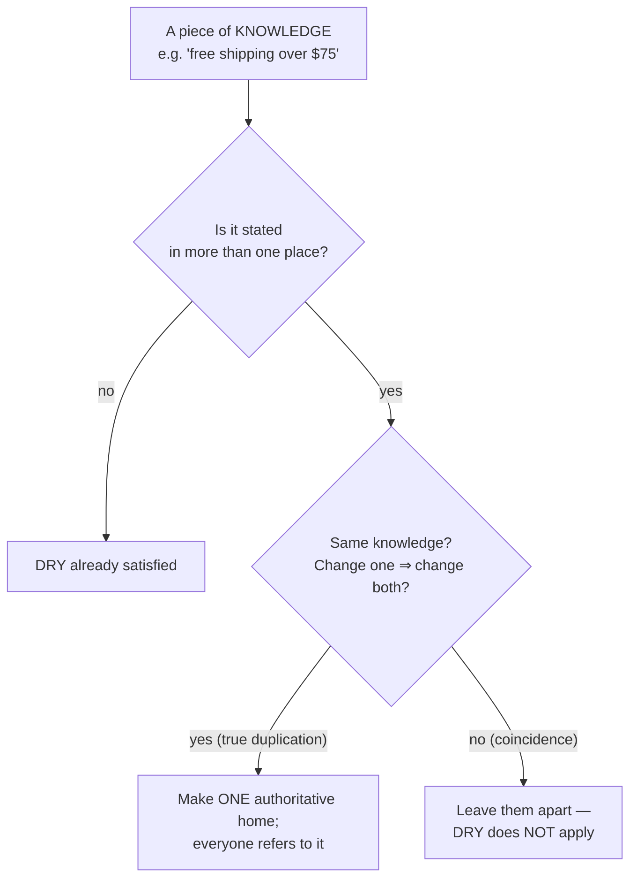

# DRY (Don't Repeat Yourself) — Junior

> **Category:** [Design Principles](../../README.md) — every piece of *knowledge* in a system should have a single, unambiguous, authoritative representation.

---

## Table of Contents

1. [Introduction](#introduction)
2. [Prerequisites](#prerequisites)
3. [Glossary](#glossary)
4. [The Real Definition](#the-real-definition)
5. [What DRY Is *Not*](#what-dry-is-not)
6. [The Cost DRY Fights](#the-cost-dry-fights)
7. [Knowledge Lives Everywhere, Not Just in Code](#knowledge-lives-everywhere-not-just-in-code)
8. [A Worked Example](#a-worked-example)
9. [Techniques to Remove True Duplication](#techniques-to-remove-true-duplication)
10. [WET, DIE, and the Counter-Acronyms](#wet-die-and-the-counter-acronyms)
11. [Real-World Analogies](#real-world-analogies)
12. [Mental Models](#mental-models)
13. [Best Practices](#best-practices)
14. [Common Mistakes](#common-mistakes)
15. [Tricky Points](#tricky-points)
16. [Test Yourself](#test-yourself)
17. [Cheat Sheet](#cheat-sheet)
18. [Summary](#summary)
19. [Further Reading](#further-reading)
20. [Related Topics](#related-topics)
21. [Diagrams](#diagrams)

---

## Introduction

> Focus: **What is it?** and **How to use it?**

**DRY** stands for **Don't Repeat Yourself**. Almost everyone learns it as "don't copy-paste code" — and almost everyone learns it slightly wrong. The principle is sharper and more important than the slogan suggests. It comes from Andy Hunt and Dave Thomas's book *The Pragmatic Programmer*, and the original definition is precise:

> **Every piece of knowledge must have a single, unambiguous, authoritative representation within a system.** — Hunt & Thomas, *The Pragmatic Programmer*

Read that twice. The word that matters is **knowledge** — not *code*, not *text*, not *lines*. DRY is about facts, rules, and decisions, not about characters on the screen. A *piece of knowledge* is something like "the VAT rate is 20%," "an order is overdue after 30 days," "a username must be 3–20 characters," or "we round currency half-up." Each such fact should be written down in **exactly one place** that the rest of the system refers to.

### Why this matters

When a fact lives in one place, changing it is a one-line edit. When the *same* fact is copied into five places, changing it means finding and updating all five — and the day you update four and miss one, you have a bug that is invisible until production. That single missed copy is the disease DRY exists to prevent. The slogan "don't repeat yourself" is really shorthand for **"don't make the same decision in two places, because then you have to remember both of them forever."**

At the junior level your job is to get the definition right (most people don't), learn to spot *real* duplication of knowledge, and learn the standard moves for collapsing it to one authoritative place. The deeper, harder half — *when duplication is actually the right call* — starts at [Middle](middle.md) and is the heart of [Senior](senior.md).

---

## Prerequisites

- **Required:** You can write functions/methods and extract a block of code into one (extract function).
- **Required:** Comfort with constants, modules/imports, and basic refactoring (rename, extract).
- **Helpful:** A feel for **[KISS](../01-kiss/junior.md)** — keep the simplest thing that works.
- **Helpful:** Exposure to **[Optimize for Deletion](../06-optimize-for-deletion/)** — because the cost of a *bad* DRY decision is code that's hard to delete later.

---

## Glossary

| Term | Definition |
|------|-----------|
| **DRY** | Don't Repeat Yourself — every piece of *knowledge* has one authoritative representation. |
| **Knowledge** | A fact, rule, formula, constant, or decision the system depends on (e.g., "VAT is 20%"). |
| **Single source of truth (SSOT)** | The one authoritative place a piece of knowledge lives; everyone else refers to it. |
| **True duplication** | The *same* knowledge written in more than one place — DRY's actual target. |
| **Coincidental duplication** | Two pieces of code that *look* alike but encode *different* knowledge that may diverge. |
| **Shotgun surgery** | A change that forces edits in many scattered places because knowledge was duplicated. |
| **WET** | "Write Everything Twice" (or "We Enjoy Typing") — the anti-pattern DRY opposes. |
| **Rule of three** | Don't abstract on the 1st or 2nd duplication; wait for the 3rd, when the shape is clear. |

---

## The Real Definition

Let's anchor on the original wording, because the whole topic hinges on it:

> Every piece of **knowledge** must have a single, unambiguous, authoritative representation within a system.

Break it into its load-bearing words:

- **Knowledge** — a fact or rule the system relies on. Not "code." Two functions can be byte-for-byte identical and represent two *different* facts.
- **Single** — exactly one, not "few," not "mostly one."
- **Unambiguous** — there's no question about which place is the real one. You never have to wonder "which copy is correct?"
- **Authoritative** — that one place is *the source*. Everything else derives from it or refers to it.
- **Within a system** — DRY is scoped to *a* system. Across separate systems (or separate services), some duplication is normal and even healthy (more on this at [Middle](middle.md) and [Senior](senior.md)).

So the test for "is this a DRY violation?" is **not** "do these look the same?" It is:

> **Do these two places encode the *same piece of knowledge*? If I change that knowledge, must *both* places change together?**

If yes → it's true duplication → DRY it. If no → it only looks alike → leave it apart.

---

## What DRY Is *Not*

This is the single most-misunderstood point in the principle, so we'll state it plainly and return to it at every level.

> **DRY is not about textual code similarity.** Two pieces of code that look identical but represent *different* knowledge are **not** a DRY violation — and merging them is a mistake, not a fix.

Consider:

```python
def is_valid_username(s):
    return 3 <= len(s) <= 20

def is_valid_room_code(s):
    return 3 <= len(s) <= 20
```

These two functions are *identical*. A naive reading of DRY says "merge them!" But ask the real question: **is this the same knowledge?** No. One encodes "what makes a username valid"; the other encodes "what makes a room code valid." They happen to share the same numbers *today*. Tomorrow, product decides usernames can be up to 30 characters — but room codes stay at 20. If you'd merged them into one `is_valid_length(s)`, you now have to *un-merge* them, and untangling a bad merge is harder than it ever was to keep them apart.

The numbers `3` and `20` are a **coincidence**, not a shared fact. This is **coincidental duplication**, and DRY does *not* apply to it. We'll call this out repeatedly — it's what separates someone who *recites* DRY from someone who *understands* it.

| | True duplication | Coincidental duplication |
|---|---|---|
| What's shared | The *same* knowledge/decision | Only the *appearance* (text, numbers) |
| If the rule changes | **Both** must change together | They change **independently** |
| DRY says | Consolidate to one place | **Leave them apart** |
| Merging anyway gives you | Correct single source of truth | A wrong abstraction + false coupling |

---

## The Cost DRY Fights

Why does duplicated knowledge hurt? Walk through the lifecycle of a copied fact.

Suppose the rule "free shipping over $50" is hard-coded in three places: the checkout page, the order-summary email, and the backend price calculator.

```python
# checkout.py
if cart_total > 50:  free_shipping = True
# email.py
if order.total > 50:  show_free_shipping_badge()
# pricing.py
shipping = 0 if subtotal > 50 else FLAT_RATE
```

Now marketing changes the threshold to **$75**. To implement a one-sentence business decision, an engineer must:

1. *Remember* that the rule lives in three places.
2. *Find* all three (and be sure there isn't a fourth).
3. Update each correctly.

Miss one, and the checkout says "free shipping!" while the calculator still charges for it — a contradiction the customer sees and the company eats. This pattern of "one change, many edits" is called **shotgun surgery**, and the bug it breeds (copies that silently drift apart) is called a **divergent copy**.

The single source of truth eliminates the problem:

```python
# pricing_rules.py  — the ONE authoritative place
FREE_SHIPPING_THRESHOLD = 75

# everywhere else refers to it
if cart_total > FREE_SHIPPING_THRESHOLD: ...
```

Now the business decision is a **one-line edit**, and it is *impossible* for the three places to disagree, because they all read the same fact. **That** is what DRY buys you: changes to knowledge become local, safe, and atomic.

---

## Knowledge Lives Everywhere, Not Just in Code

The "don't copy-paste code" reading misses half the principle. Knowledge in a software system lives in many artifacts, and DRY spans **all** of them:

| Where knowledge lives | Example of duplicated knowledge | DRY fix |
|---|---|---|
| **Code** | A business rule in three functions | One function / constant |
| **Database schema** | Column list duplicated in code and migrations | Generate model from schema (or vice versa) |
| **Config** | The same timeout in app config and a deploy script | One config value both read |
| **Docs** | An API endpoint documented by hand *and* in code | Generate docs from the code/spec |
| **Build scripts** | A version number in `package.json`, a Dockerfile, and a README | One source the others read |
| **Validation rules** | "Email must be valid" coded in the browser *and* the server | Generate both from one schema |

A particularly common and painful one for juniors: **validation duplicated between client and server.** You write the email/length/required rules in the front-end form *and* re-write them in the back-end API. Now there are two copies of the same knowledge ("what makes this input valid"), and they drift — the front-end accepts something the back-end rejects, and users hit confusing errors. The DRY fix is to define the rules **once** (e.g., a shared schema like JSON Schema, Zod, or a validation spec) and *generate* both sides from it.

> DRY is a principle about **information**, not about a programming language. Wherever the same fact is stated twice, the same risk exists.

---

## A Worked Example

Let's evolve a small piece of code, fixing a *real* DRY violation.

### Start: the same rule, copied

A loyalty program gives members a 10% discount. The rule appears in two places:

```python
# cart.py
def cart_total(items, is_member):
    subtotal = sum(i.price * i.qty for i in items)
    if is_member:
        subtotal = subtotal * 0.9          # 10% member discount
    return subtotal

# receipt.py
def receipt_savings(items, is_member):
    subtotal = sum(i.price * i.qty for i in items)
    if is_member:
        return subtotal * 0.1              # 10% member discount  ← same fact!
    return 0
```

The fact **"members get 10% off"** lives in two files, encoded as `0.9` in one and `0.1` in the other. If the discount changes to 15%, you must edit both — and they're easy to get inconsistent (one says 0.85, the other still says 0.1). This is **true duplication**: the *same knowledge*, and a change to it *forces* a change in both.

### Fix: one authoritative place

```python
# loyalty.py  — the single source of truth for the discount rule
MEMBER_DISCOUNT_RATE = 0.10

def member_discount(subtotal, is_member):
    return subtotal * MEMBER_DISCOUNT_RATE if is_member else 0.0
```

```python
# cart.py
def cart_total(items, is_member):
    subtotal = sum(i.price * i.qty for i in items)
    return subtotal - member_discount(subtotal, is_member)

# receipt.py
def receipt_savings(items, is_member):
    subtotal = sum(i.price * i.qty for i in items)
    return member_discount(subtotal, is_member)
```

Now "members get 10% off" lives in **one** place. Change the rate once and *both* the cart and the receipt update — and they can never disagree. That's the win.

### What we did *not* do

We did **not** also merge `cart_total` and `receipt_savings` into one "generic calculation" function just because they share a few lines. They answer *different questions* (a total vs. a savings amount). Only the **discount knowledge** was duplicated, so only *that* got a single home. **DRY out the knowledge; leave the rest alone.**

---

## Techniques to Remove True Duplication

When you've confirmed it's genuinely the *same knowledge*, here are the standard moves, from smallest to largest:

1. **Extract a constant.** A magic number/string repeated everywhere → one named constant. (`FREE_SHIPPING_THRESHOLD = 75`.)
2. **Extract a function/method.** A repeated formula or rule → one function callers invoke. (`member_discount(...)`.)
3. **Parameterize.** Several near-copies that differ only in a value → one function with a parameter for that value.
4. **Extract a module/class.** A cluster of related rules → one module that owns that knowledge.
5. **Single source of truth across layers.** Define a fact once (a schema, a config, a spec) and **generate** the other representations from it (client+server validation, docs, types).
6. **Code generation.** When the same structure must appear in several forms (types, serializers, API clients), generate them all from one definition rather than hand-writing each.

The thread running through all of these: **find the one true home for the knowledge, and make everything else point at it.**

---

## WET, DIE, and the Counter-Acronyms

DRY spawned a small family of acronyms worth knowing:

| Acronym | Expands to | Meaning |
|---|---|---|
| **DRY** | Don't Repeat Yourself | One authoritative representation per piece of knowledge. |
| **WET** | "Write Everything Twice" / "We Enjoy Typing" | The anti-pattern: the same knowledge copied repeatedly. |
| **DIE** | "Duplication Is Evil" | A blunt restatement of DRY's motivation. |
| **AHA** | "Avoid Hasty Abstractions" | The *counter*-acronym — don't DRY too eagerly; the wrong abstraction is worse than duplication. (See [Middle](middle.md).) |

Most teams say "this code is too WET" to mean "this knowledge is copied all over." But notice the tension between **DIE** ("duplication is evil") and **AHA** ("avoid hasty abstractions"). The resolution — *which* duplication is evil and *which* should be tolerated — is the real skill, and it's where this topic gets interesting. The short version, expanded at [Middle](middle.md): **duplication of knowledge is evil; coincidental duplication is fine, and removing it hastily creates a worse problem.**

---

## Real-World Analogies

| Concept | Analogy |
|---|---|
| **Single source of truth** | A master copy of a contract in a vault; everyone works from photocopies that all point back to it. Amend the master and every copy is "updated" because it was never authoritative. |
| **Duplicated knowledge** | Five sticky notes around the office with the Wi-Fi password. Change the password and you must find every note — miss one and someone's locked out. |
| **Coincidental duplication** | Two unrelated people who happen to share a birthday. Treating them as "the same person because they match" is obviously wrong — the match is a coincidence, not an identity. |
| **Shotgun surgery** | Fixing a typo in a book by editing every printed copy individually instead of the manuscript. |

---

## Mental Models

**The intuition:** *"Each fact gets one home. Everyone else visits; nobody keeps a private copy."*

```
        ┌──────────────────────────────────┐
        │  ONE authoritative representation │   ← the source of truth
        │  e.g. FREE_SHIPPING_THRESHOLD=75  │
        └──────────────┬───────────────────┘
                       │ referred to by
        ┌──────────────┼───────────────┐
        ▼              ▼               ▼
   checkout page   summary email   price calc
   (no copy)       (no copy)       (no copy)
```

A second model — the **change test**. Before you "DRY" two things, ask: *"If the rule behind one changes, does the other have to change in exactly the same way?"*

```
  Same knowledge?  ──yes──►  ONE home (apply DRY)
        │
        └──no (coincidence)──►  Keep them apart (DRY does NOT apply)
```

DRY is fundamentally about making **change** cheap and safe. You're not chasing tidiness; you're making sure that when a fact moves, it moves everywhere at once.

---

## Best Practices

1. **DRY the knowledge, not the text.** Before merging, confirm the two places encode the *same fact*, not just the same characters.
2. **Run the change test.** "If this rule changes, must both change together?" Yes → consolidate. No → leave apart.
3. **Give each fact one named home.** Constants, a rules module, a config value, a schema — make the source of truth obvious and authoritative.
4. **Hunt duplication across *all* artifacts**, not just `.py`/`.java` files: config, schema, docs, build scripts, client+server validation.
5. **Prefer the smallest fix** that gives a single source of truth: a constant before a function, a function before a class, a class before a code-gen pipeline.
6. **Don't abstract on the first or second copy** — wait for the [rule of three](#wet-die-and-the-counter-acronyms) when you're unsure the knowledge is truly shared.

---

## Common Mistakes

1. **"DRY = don't copy-paste."** The slogan, not the principle. DRY is about *knowledge*, and plenty of look-alike code is *not* duplicated knowledge.
2. **Merging coincidental duplication.** Two functions that look alike but encode different rules get merged "to be DRY," then have to be painfully un-merged when one rule changes. This creates a **wrong abstraction** (the central danger — see [Senior](senior.md)).
3. **Only checking code.** Forgetting that the same rule is *also* duplicated in the database schema, the docs, or the client-side validation.
4. **Abstracting too early.** Extracting a shared helper after seeing two similar lines, before you know whether they're truly the same knowledge — see the [rule of three](#wet-die-and-the-counter-acronyms).
5. **Over-DRYing constants.** Forcing two unrelated `0.20`s to share one constant `RATE` just because the number matches — now an invoice change accidentally alters payroll.
6. **Treating DRY as absolute.** It conflicts with other principles (decoupling, locality, deletability). It's a heuristic, not a law — covered at [Middle](middle.md) and [Senior](senior.md).

---

## Tricky Points

- **"Repeat yourself" means "repeat the *knowledge*," not "repeat the keystrokes."** Identical code is a *hint* to investigate, never proof of a violation.
- **Removing duplication can *increase* coupling.** A shared helper ties its callers together. If they should evolve independently, that shared helper is a defect, not a DRY win. (Deep dive: [Senior](senior.md) and [Connascence](../../02-coupling-and-cohesion/03-connascence/).)
- **The wrong abstraction is harder to remove than duplication.** Once five callers depend on a too-eager shared abstraction, unwinding it is risky. Duplication, by contrast, is local and easy to consolidate *later*. This asymmetry is why "wait" is often the right move. (See [Optimize for Deletion](../06-optimize-for-deletion/).)
- **DRY is scoped "within a system."** Across service or bounded-context boundaries, a little duplication is often healthier than a shared dependency — "a little copying is better than a little dependency." (See [Senior](senior.md).)

---

## Test Yourself

1. State the *real* definition of DRY (Hunt & Thomas). Which single word matters most, and why?
2. Two functions are byte-for-byte identical. Is that automatically a DRY violation? What question decides it?
3. What is "shotgun surgery," and how does a single source of truth prevent it?
4. Name three *non-code* artifacts where duplicated knowledge causes bugs.
5. What does WET stand for, and what does AHA warn against?
6. Why can merging coincidental duplication be *worse* than leaving it?

---

## Cheat Sheet

```text
THE REAL DEFINITION (Hunt & Thomas)
  "Every piece of KNOWLEDGE must have a single, unambiguous,
   authoritative representation within a system."
  → DRY is about KNOWLEDGE, not about look-alike code.

THE TEST before you DRY two things
  "If the rule behind one changes, must the other change the SAME way?"
    yes → true duplication      → ONE source of truth (apply DRY)
    no  → coincidental match     → KEEP THEM APART (DRY does not apply)

WHAT DRY FIGHTS
  copied knowledge → shotgun surgery → miss a copy → divergent-copy bug

WHERE KNOWLEDGE LIVES (DRY spans all of these)
  code · schema · config · docs · build scripts · client+server validation

TECHNIQUES (smallest first)
  constant → function → parameterize → module → single-source-+-generate

ACRONYMS
  WET  Write Everything Twice (the anti-pattern)
  DIE  Duplication Is Evil
  AHA  Avoid Hasty Abstractions (the brake — don't DRY too soon)
```

---

## Summary

- **DRY's real definition:** *every piece of **knowledge** must have a single, unambiguous, authoritative representation within a system.* The key word is **knowledge** — not code, not text.
- The defining test: *if the rule behind one place changes, must the other change the same way?* Yes → true duplication, apply DRY. No → coincidence, **leave it apart**.
- DRY fights **shotgun surgery** and **divergent copies**: copied knowledge means every change must find all copies, and a missed one is a silent bug.
- Knowledge lives in **code, schemas, config, docs, build scripts, and validation** — DRY spans all of them (classic case: client + server validation from one source).
- **Coincidental duplication is not a DRY violation**; merging it creates the **wrong abstraction**, the central danger explored at [Senior](senior.md).
- Remember the family: **WET** (the anti-pattern), **DIE** (the motivation), **AHA** (the brake).

---

## Further Reading

- Andy Hunt & Dave Thomas, *The Pragmatic Programmer* — the origin and the authoritative definition of DRY.
- Sandi Metz, ["The Wrong Abstraction"](https://sandimetz.com/blog/2016/1/20/the-wrong-abstraction) — "duplication is far cheaper than the wrong abstraction."
- Kent C. Dodds, ["AHA Programming"](https://kentcdodds.com/blog/aha-programming) — Avoid Hasty Abstractions.
- The [Rule of Three](https://en.wikipedia.org/wiki/Rule_of_three_(computer_programming)) — when to actually extract.

---

## Related Topics

- **Siblings:** [KISS](../01-kiss/), [Optimize for Deletion](../06-optimize-for-deletion/).
- **Deepens DRY:** [Connascence](../../02-coupling-and-cohesion/03-connascence/), [Orthogonality](../../02-coupling-and-cohesion/06-orthogonality/).
- **Where DRY also appears as a rule:** [Simple Design](../../../craftsmanship-disciplines/04-simple-design/) (Rule 3).

---

## Diagrams




---

## Check your understanding

1. Explain DRY (Don't Repeat Yourself) — Junior Level in your own words and name the problem it solves.
2. How would you apply the ideas around Table of Contents, Introduction, Prerequisites in a realistic engineering change?
3. What failure mode or misuse should you look for, and what evidence would reveal it?
4. What small example would prove that you can apply DRY (Don't Repeat Yourself) — Junior Level correctly?
5. What observable result would convince you that the approach improved the system?
