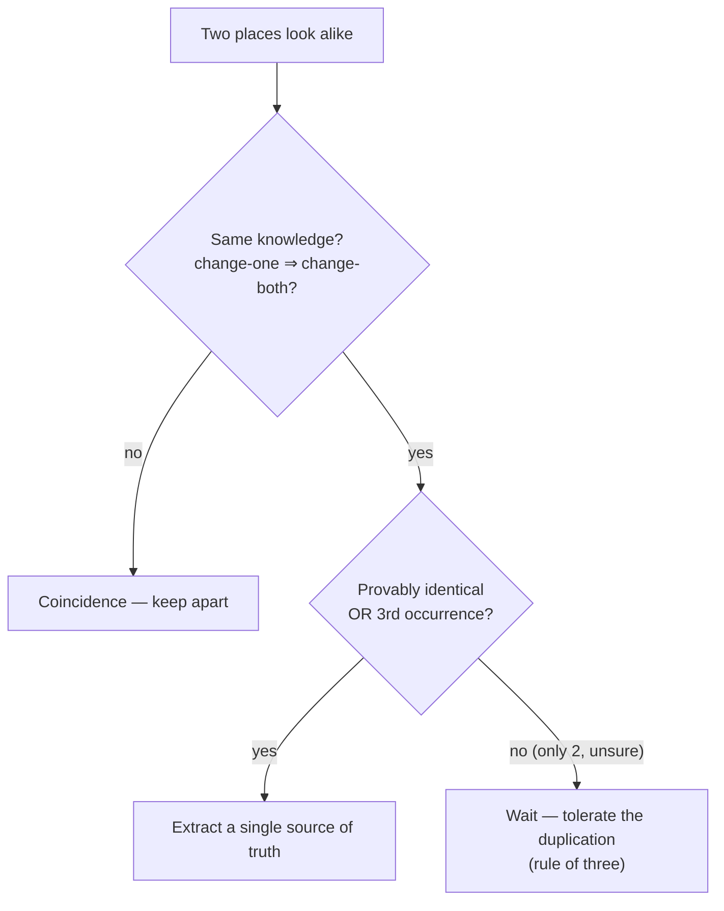
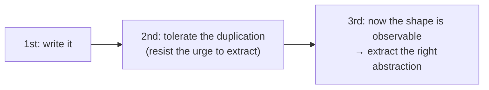
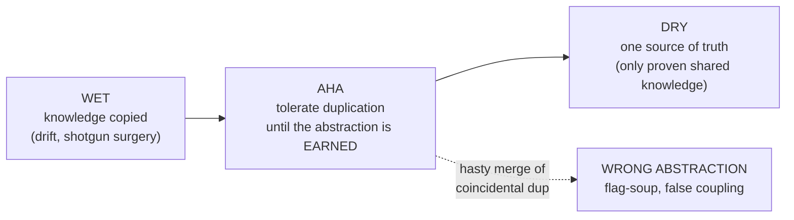
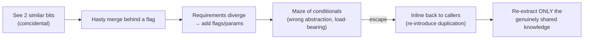

# DRY (Don't Repeat Yourself) — Middle

> **Category:** [Design Principles](../../README.md) — every piece of *knowledge* in a system should have a single, unambiguous, authoritative representation.

> **Prerequisite:** [Junior](junior.md)
> **Focus:** **Why** and **When**

---

## Introduction

> Focus: **Why** and **When**

At the junior level, DRY is a definition you can state correctly. At the middle level it becomes a **judgement you make many times a day**, because the principle is in constant tension with itself and with other principles:

- DRYing too **little** leaves copied knowledge that drifts apart (the classic WET bug).
- DRYing too **eagerly** merges things that only *look* alike, manufacturing coupling and producing the dreaded *wrong abstraction*.

Most engineers are taught only the first failure mode, so they over-correct into the second — they treat every textual duplicate as a defect and "fix" it, accumulating abstractions that are harder to remove than the duplication ever was. The middle-level skill is **calibration**: knowing *which* duplication is the evil kind, *when* to extract, and *when leaving the duplication is the more professional choice.* The tools for that calibration are the **change test**, the **rule of three**, and **AHA**.

---

## The Two Questions That Decide Everything

Before you remove any duplication, ask two questions in order.

### Question 1 — Is this the *same knowledge*?

> **If the rule/fact behind one place changes, must the other change in exactly the same way, for the same reason?**

- **Yes** → it's *true* duplication. The two places are two representations of one fact. DRY applies.
- **No** → it's *coincidental* duplication. They share an appearance, not a fact. DRY does **not** apply — leave them apart.

This is the gate. If you only ever internalize one thing about DRY, make it this question. It is what separates DRY-the-principle from DRY-the-slogan.

### Question 2 — Even if it's the same knowledge, is it *time* to abstract?

Same knowledge doesn't always mean "extract *now*." With only two occurrences, you can't yet see the abstraction's real shape (see the [rule of three](#the-rule-of-three)). The exception: if the knowledge is **provably identical** (a regulated tax formula copied verbatim), DRY it immediately — there's nothing to guess.



---

## True vs. Coincidental Duplication — A Field Guide

The hard part is telling the two apart in real code, where they look the same. Use these heuristics.

| Signal | Leans **true** duplication | Leans **coincidental** |
|---|---|---|
| Origin | Both came from the *same* requirement/fact | They arose from *different* requirements |
| Co-change history | They've always changed together in git | They've changed independently before |
| Why they match | Because they *mean* the same thing | Because a value/shape *happens* to coincide |
| Domain | Same domain concept (one VAT rate) | Different domain concepts (invoice VAT vs. payroll tax) |
| Future | A change to one *necessarily* implies the other | One could plausibly change while the other doesn't |

```python
# COINCIDENTAL — looks identical, different knowledge
def tax_for_invoice(amount): return amount * 0.20   # VAT rule
def tax_for_payroll(amount): return amount * 0.20   # payroll rule (different law!)

# Do NOT merge into tax(amount). VAT and payroll are different decisions that
# share a value today and will diverge the day either law changes.
INVOICE_VAT_RATE = 0.20      # one home for the VAT fact
PAYROLL_TAX_RATE = 0.20      # a SEPARATE home for the payroll fact
```

```python
# TRUE — different text, SAME knowledge ("an order is overdue after 30 days")
# in scheduler.py
if (now - order.placed_at).days > 30: flag_overdue(order)
# in report.py
overdue = [o for o in orders if (now - o.placed_at).days >= 30]   # note: > vs >=!

# These encode ONE business rule, written inconsistently (a latent bug: > vs >=).
# DRY it:
OVERDUE_AFTER_DAYS = 30
def is_overdue(order, now): return (now - order.placed_at).days > OVERDUE_AFTER_DAYS
```

Notice the second case: true duplication isn't always identical *text* — here the two copies had already **drifted** (`>` vs `>=`), the exact silent bug DRY prevents.

---

## The Rule of Three

> Don't abstract on the first duplication, or even the second. Wait for the **third**.

The rule of three is the practical **brake** on premature DRY. Its logic:

- **One occurrence:** you know nothing about variation — there's no duplication yet.
- **Two occurrences:** you can see *one* axis of similarity, but a two-point line fits infinitely many curves. Extracting now bakes in a *guess* about the abstraction's shape.
- **Three occurrences:** you can now *observe* which parts are truly invariant (shared by all three) versus incidental (varying across them). The abstraction's boundary becomes **data, not a guess.**

So the rule of three isn't superstition — it's "wait until you have enough samples to define the abstraction correctly." It directly reduces the chance of creating the wrong abstraction.



**The caveat:** the rule of three protects against *guessing*. When there's nothing to guess — the knowledge is provably, definitionally identical (a legal rate, a protocol constant) — DRY the *second* occurrence immediately. The rule is a default, not a law.

---

## AHA: Avoid Hasty Abstractions

Kent C. Dodds coined **AHA — "Avoid Hasty Abstractions"** — as the deliberate counterweight to over-eager DRY. Its companion line, from Sandi Metz, is the one to memorize:

> **"Duplication is far cheaper than the wrong abstraction."** — Sandi Metz

The insight: the industry treats "DRY" as an unqualified good and abstraction as always virtuous. But an abstraction is a *bet* that several callers share a stable common core. When that bet is wrong, you don't get a clean abstraction — you get a tangle of flags and special cases that is **harder to read, harder to change, and risky to remove** because many callers now depend on it. Meanwhile, the duplication you were avoiding would have been *visible, local, and cheap to consolidate later.*

AHA reframes the goal: **prefer duplication until the right abstraction is obvious.** Optimize for *removability and clarity now*; pay for the abstraction only when the data (three real cases) shows you its true shape. AHA is not "never DRY" — it's "DRY deliberately, never hastily."

---

## DRY vs. WET vs. AHA

| | **DRY** | **WET** | **AHA** |
|---|---|---|---|
| Stance | One home per piece of knowledge | (anti-pattern) knowledge copied everywhere | DRY, but only once the abstraction is proven |
| Failure it causes when misapplied | Wrong abstraction, false coupling | Divergent copies, shotgun surgery | (it's the corrective — rarely over-applied) |
| Bias | Toward consolidation | Toward copy-paste | Toward *patience* — duplicate until certain |
| When it's right | Knowledge is provably shared | Almost never (only tiny, throwaway cases) | When you're unsure whether the match is real |
| One-liner | "Don't repeat **knowledge**." | "Write everything twice." | "Avoid **hasty** abstractions." |

The synthesis a middle engineer should carry: **DRY is the goal; AHA is how you get there safely; WET is the failure on the other side.** You aim for DRY, but you walk there via AHA — tolerating duplication until the abstraction is earned, never sprinting into a hasty one.

---

## Single Source of Truth Across Layers

The highest-value DRY wins are usually *not* "extract this helper" — they're collapsing the same fact that's duplicated **across architectural layers**, where the copies are far apart and drift silently.

### Validation duplicated client + server

The canonical example. You write validation rules in the browser form (for UX) *and* in the server API (for safety). That's two copies of "what makes this input valid," and they drift — the front-end accepts what the back-end rejects.

```typescript
// ONE source of truth: a shared schema
const SignupSchema = z.object({
  username: z.string().min(3).max(20),
  email: z.string().email(),
  age: z.number().int().min(13),
});

// client: validate the form from the schema
SignupSchema.safeParse(formData);
// server: validate the request from the SAME schema
SignupSchema.parse(req.body);
// types are GENERATED from it too: type Signup = z.infer<typeof SignupSchema>
```

Now the rule "username is 3–20 chars" lives in **one** place; the client check, the server check, and the TypeScript type are all *derived* from it. Change the rule once and all three update — they cannot disagree.

### Other cross-layer single-source patterns

- **Schema → models:** generate ORM models/migrations from one schema (or generate the schema from the models) — don't hand-maintain both.
- **API spec → clients & docs:** generate the typed client *and* the documentation from one OpenAPI/GraphQL spec, rather than writing endpoints three times.
- **Constants shared across services:** a generated shared package for protocol enums/error codes so two services can't disagree on what `STATUS_PENDING` means.

> The most damaging knowledge duplication is the kind that spans a *boundary* — client/server, code/docs, two services — because the copies are far apart, owned by different people, and drift unnoticed until they contradict each other in production.

---

## A False DRY "Fix" — The Wrong-Abstraction Trap

Here is the failure mode in slow motion — the thing the AHA crowd is warning you about. Two report renderers *looked* 80% the same, so an engineer merged them "to be DRY."

```python
# STEP 1 — two clear, independent functions that happen to look similar
def render_invoice_pdf(order):
    header = company_header()
    lines  = [f"{i.name}  {i.qty} x {i.price}" for i in order.items]
    return pdf(header, lines, footer=legal_footer())

def render_packing_slip(order):
    header = company_header()
    lines  = [f"{i.name}  {i.qty}" for i in order.items]   # no price!
    return pdf(header, lines, footer=warehouse_barcode(order))
```

These share *appearance* (a header, a line list, a footer) but encode **different knowledge**: an invoice is a financial document; a packing slip is a warehouse document. The change test says: *would a change to the invoice force the same change to the slip?* No. This is **coincidental** similarity.

```python
# STEP 2 — the hasty "DRY" merge. Looks clever; it's a trap.
def render_document(order, kind):
    header = company_header()
    if kind == "invoice":
        lines = [f"{i.name}  {i.qty} x {i.price}" for i in order.items]
        footer = legal_footer()
    elif kind == "packing":
        lines = [f"{i.name}  {i.qty}" for i in order.items]
        footer = warehouse_barcode(order)
    return pdf(header, lines, footer)
```

Now the divergence begins, exactly as predicted:

```python
# STEP 3 — requirements arrive; each flag deepens the coupling
def render_document(order, kind, locale="en", show_tax=False, draft=False, copies=1):
    header = company_header(locale)
    if kind == "invoice":
        lines = [...]
        if show_tax: lines.append(tax_line(order))     # invoice-only
        footer = legal_footer(locale) if not draft else draft_watermark()
    elif kind == "packing":
        lines = [...]                                   # show_tax/draft ignored here
        footer = warehouse_barcode(order)
        if copies > 1: ...                              # packing-only
    ...
```

Every new flag was a *locally reasonable* response to "don't duplicate." The aggregate is a function nobody can change safely: half its parameters apply to one branch, half to the other, and a change for invoices risks breaking packing slips. **This abstraction is now harder to remove than the duplication ever was**, because both document types depend on it.

### The fix: re-introduce duplication

The recovery is counterintuitive — you *add* duplication back:

```python
# STEP 4 — inline back to two clear, independent functions
def render_invoice_pdf(order, locale="en", show_tax=False, draft=False):
    header = company_header(locale)
    lines  = [f"{i.name}  {i.qty} x {i.price}" for i in order.items]
    if show_tax: lines.append(tax_line(order))
    return pdf(header, lines, draft_watermark() if draft else legal_footer(locale))

def render_packing_slip(order, copies=1):
    header = company_header()
    lines  = [f"{i.name}  {i.qty}" for i in order.items]
    return pdf(header, lines, warehouse_barcode(order))   # × copies
```

The genuinely shared pieces (`company_header`, `pdf`) stay shared — *those* are real shared knowledge. The flag-soup `render_document` was the wrong abstraction; two clear functions are the right design. **DRY out the knowledge (`company_header`); tolerate the incidental textual repetition (the `for i in order.items` loop shape).**

---

## When Duplication Is the Right Call

Mature engineers keep duplication *on purpose* in several situations:

1. **Coincidental similarity** — different knowledge that happens to match. Merging it is the wrong-abstraction trap above.
2. **Across bounded contexts / services.** Two services that both model a "Customer" should usually keep *separate* models, even if they overlap, rather than share one library. Coupling two services through a shared model means a change for one forces a redeploy of the other. The maxim (from Go's proverbs): **"A little copying is better than a little dependency."**
3. **When the abstraction would hurt clarity.** If the only way to remove duplication is a 6-parameter helper full of `if mode ==` branches, the duplication is clearer — and clarity outranks DRY (this is why [Simple Design](../../../craftsmanship-disciplines/04-simple-design/) ranks "reveals intention" *above* "no duplication").
4. **Trivially small duplication.** Two three-line functions sharing two lines aren't worth a new function, a name, an import, and a test. The extraction costs more than the duplication.
5. **Tests.** Test code often *should* repeat setup explicitly for readability; over-DRYed test helpers hide what's being tested. A little duplication keeps each test self-contained.

> The professional reflex isn't "remove all duplication." It's "**remove duplicated *knowledge*; tolerate incidental textual repetition** — and prefer a little copying to coupling things that should be independent."

---

## Trade-offs

| Decision | DRY it now | Tolerate the duplication |
|---|---|---|
| Cost today | Build + name + test the abstraction | Zero — the code already works |
| Cost if it's truly shared knowledge | Paid once; future changes are 1-line | Every change is shotgun surgery; drift risk |
| Cost if it's *coincidental* | **Wrong abstraction**: flags accrue, removal is risky | None — they evolve freely |
| Coupling introduced | Callers now depend on one shared thing | None — callers stay independent |
| Reversibility | Hard to undo once many callers depend on it | Easy to consolidate later if it turns out shared |

The asymmetry that should bias you toward patience: **deferring is cheap to reverse, abstracting is expensive to reverse.** If you wait and the knowledge turns out shared, you pay *once* to extract it. If you abstract and it turns out coincidental, you pay *twice* — to remove the wrong abstraction *and* to rebuild the right design — plus all the bug risk in between. (See [Optimize for Deletion](../06-optimize-for-deletion/).)

---

## Edge Cases

### 1. Same knowledge, but the copies have already drifted

When you find true duplication that's *inconsistent* (`> 30` vs. `>= 30`), DRYing it forces you to decide which is correct — a feature, not a bug. The consolidation surfaces a latent inconsistency you'd otherwise ship.

### 2. "We'll definitely need to vary this"

You think a second case is coming, so you abstract pre-emptively. Usually a mistake: guesses about the *shape* of variation are wrong far more often than guesses about its *existence*. Wait for the concrete second/third case to pin the shape (rule of three).

### 3. Duplicated knowledge across teams

When the same rule lives in two teams' codebases, the *technical* fix (a shared library) introduces an *organizational* coupling (a release dependency). Sometimes the duplication is genuinely cheaper than the coordination cost — judge by who owns the change and how often it changes. (Expanded at [Senior](senior.md).)

---

## Tricky Points

- **DRY ≠ "fewest characters."** It's "fewest *representations of a fact*." A clearer, slightly longer version with one source of truth beats a terse one with hidden copies.
- **Removing duplication can *raise* coupling.** A shared helper is connascence: callers must now agree on it. If they should be independent, the helper is the defect. (See [Connascence](../../02-coupling-and-cohesion/03-connascence/).)
- **Two identical lines aren't proof.** Identical code is a *prompt to investigate* whether the knowledge is shared — not a verdict.
- **The wrong abstraction outlives the duplication.** Duplication is local and easy to fix any day. A wrong abstraction is load-bearing and gets *more* expensive to remove each day it survives.
- **DRY fights other principles.** It can pull against decoupling, [orthogonality](../../02-coupling-and-cohesion/06-orthogonality/), locality, and deletability. When they conflict, DRY doesn't automatically win.

---

## Best Practices

1. **Apply the change test first.** "Change one ⇒ must the other change the same way?" No → it's coincidence; don't DRY it.
2. **Default to the rule of three.** Tolerate duplication twice; extract on the third, when the shape is observable. Exception: provably-identical knowledge → DRY immediately.
3. **Practice AHA.** Prefer duplication to a *hasty* abstraction; the wrong abstraction is more expensive than the duplication.
4. **Hunt cross-layer duplication hardest.** Client+server validation, schema+models, code+docs — single-source-and-generate.
5. **Keep a little copying across service/context boundaries** rather than coupling them through a shared library.
6. **When DRY fights clarity, choose clarity.** A confusing shared helper is a worse design than a little visible repetition.
7. **To escape a wrong abstraction, inline first**, then re-extract only the genuinely shared knowledge.

---

## Test Yourself

1. State the two questions you ask before removing duplication, in order.
2. Explain the rule of three from first principles. When do you ignore it?
3. What does AHA stand for, and what Sandi Metz line summarizes its motivation?
4. Give the canonical cross-layer duplication and its single-source fix.
5. Walk through how a hasty DRY merge of *coincidental* duplication degrades over time.
6. Name three situations where keeping duplication is the *right* call.

---

## Summary

- Before removing duplication, ask the two questions: **same knowledge?** (change test) and, if yes, **is it time?** (rule of three / provably identical).
- **True duplication** = the same fact in two places (change one ⇒ change both); **coincidental duplication** = look-alike code encoding different facts. Only the first is a DRY violation.
- **The rule of three** is the brake against premature DRY: wait until three cases reveal the abstraction's real shape. **AHA** ("Avoid Hasty Abstractions") and Metz's "duplication is far cheaper than the wrong abstraction" are the guiding wisdom.
- The highest-value DRY is **cross-layer single source of truth** — client+server validation, schema+models, spec+docs — generated from one definition.
- A **hasty DRY merge of coincidental duplication** creates the wrong abstraction: flags accrue, coupling deepens, and it becomes harder to remove than the duplication was. Escape by inlining, then re-extracting only the genuinely shared knowledge.
- **Some duplication is right on purpose**: across services ("a little copying is better than a little dependency"), when DRY hurts clarity, and for trivially small cases.

---

## Diagrams

### Aim for DRY; walk there via AHA



### The wrong-abstraction spiral and its escape




---

## Check your understanding

1. Explain DRY (Don't Repeat Yourself) — Middle Level in your own words and name the problem it solves.
2. How would you apply the ideas around Table of Contents, Introduction, The Two Questions That Decide Everything in a realistic engineering change?
3. What failure mode or misuse should you look for, and what evidence would reveal it?
4. Which local design trade-off would make you choose or reject DRY (Don't Repeat Yourself) — Middle Level in an existing codebase?
5. What observable result would convince you that the approach improved the system?
