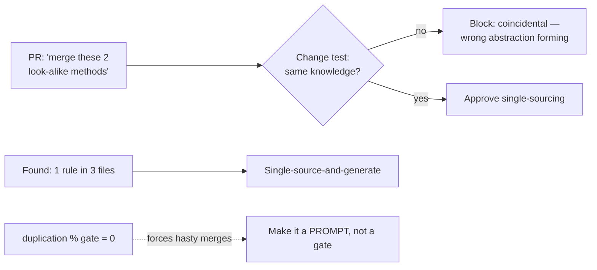
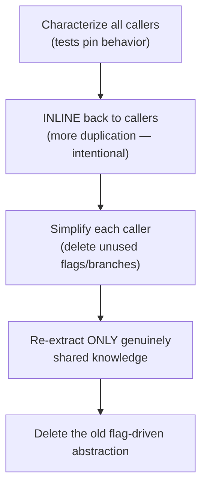

# DRY (Don't Repeat Yourself) — Professional

> **Category:** [Design Principles](../../README.md) — every piece of *knowledge* in a system should have a single, unambiguous, authoritative representation.

> **Prerequisites:** [Junior](junior.md) · [Middle](middle.md) · [Senior](senior.md)
> **Focus:** **Production** — reviews, tooling, team conventions, legacy systems

---

## Introduction

> Focus: **production** — keeping knowledge single-sourced across a large, multi-contributor codebase over years.

DRY is the principle most likely to be *mis*applied by well-meaning engineers, because the slogan ("don't repeat yourself") is memorable and the real definition (about *knowledge*) is not. At scale, this produces two opposite, simultaneous problems in the same codebase:

- **Real duplication that nobody consolidated** — the same business rule copied across services, drifting until two of them contradict each other in production.
- **Coincidental duplication that someone *did* consolidate** — wrong abstractions accreting flags, now load-bearing and risky to touch.

The professional job is to run a *system* that catches both: review standards that ask the right question, tooling that doesn't lie about what it can see, conventions that make single-sourcing the default for true knowledge while *blocking* hasty merges, and a disciplined, test-guarded way to unwind the wrong abstractions already in the codebase.

---

## Enforcing DRY in Code Review

Code review is where DRY is won or lost — in *both* directions. A reviewer must catch un-consolidated true duplication **and** push back on hasty merges of coincidental similarity.

### The two review moves

**Move 1 — flag *true* duplication that should be single-sourced.**

> "This `OVERDUE_AFTER_DAYS = 30` is also hard-coded in `report.py` and `scheduler.py`. That's one business rule in three places — let's give it a single home so they can't drift."

**Move 2 — block *hasty* merges of coincidental similarity (the move reviewers usually miss).**

> "These two methods look duplicated, but `tax_invoice` and `tax_payroll` encode different rules that happen to share a rate today. Merging them couples two things that should evolve independently — I'd keep them separate and name them for their different rules."

### The highest-value review questions

> **For a proposed merge: "If the rule behind one of these changes, must the other change in exactly the same way, for the same reason?"** If no, it's coincidental — don't merge.

> **For a new shared abstraction: "How many *real, present* call sites does this serve, and do they share one reason to change?"** If it's serving two with a flag, it's probably the wrong abstraction forming.

> **For found duplication: "Is this the same *knowledge*, or just the same characters?"** Only the former is a defect.

### Review comment templates

> "Nice catch consolidating the VAT rate — that's genuinely one fact in three places. ✅"

> "This new `process(type, mode, data)` switchboard serves two callers via a flag. They have different reasons to change; two named functions would each be clearer and wouldn't couple them. Let's not abstract yet (rule of three)."

> "Don't put `Customer` in a shared lib used by both Billing and Shipping — they model the word differently. A little copying beats coupling the two services' release cycles."

> "Great DRY cleanup, but it broke `FeeTest.roundsHalfEven`. The two fee rules round differently — that's *not* the same knowledge. Split them back and name the difference."

---

## Tooling: What Duplication Detectors Can and Can't See

Static duplication detectors (PMD/CPD, SonarQube duplication %, jscpd) are useful but **structurally blind to the thing that matters** — they match *tokens*, and DRY is about *knowledge*. Professionals must use them with that limitation front-of-mind.

| Tool / metric | Detects | The blind spot |
|---|---|---|
| **CPD / jscpd / SonarQube duplication %** | Textual/token-level repeated blocks | **Cannot tell knowledge from coincidence** — flags coincidental look-alikes; misses scattered same-knowledge written differently |
| **Linters (copy-paste rules)** | Near-identical snippets | Same — appearance only |
| **Change-coupling analysis** (git history: which files change *together*) | Files that *actually* change in lockstep | The real signal: files that always change together encode shared knowledge a token-matcher can't see |
| **Connascence / coupling analysis** | Structural dependencies | Heuristic; needs human judgement on *meaning* |

### The honest-tooling rules

- **Never treat duplication % as a defect count.** A high score is often coincidental similarity that *should not* be merged; a low score can hide strong connascence-of-meaning (the same rule written three different ways) that the matcher can't see. Chasing "0% duplication" actively *creates* wrong abstractions.
- **Pair duplication % with change-coupling.** Files that *change together in git history* are the real duplication signal — that's empirical evidence of shared knowledge, independent of whether the text matches. This catches the duplication token-matchers miss (a rule written `>30` in one file and `>= 30` in another).
- **Set the duplication gate as a *prompt*, not a *gate*.** A CPD finding should open a conversation ("is this the same knowledge?"), not auto-fail a build. Auto-failing on duplication % is how teams get pressured into hasty merges.

> The tool can find *candidates*. Only a human applying the change test can decide whether a candidate is true duplication (consolidate) or coincidence (leave it). Don't let the metric make the design decision.

---

## The Single-Source-of-Truth Patterns That Pay Off

The highest-leverage DRY in production is not "extract a helper" — it's establishing **one authoritative source for knowledge that spans layers, languages, or services**, then *generating* the rest. These pay off because the copies are far apart and otherwise drift silently.

| Knowledge | Single source | Generated / derived artifacts |
|---|---|---|
| Validation rules | One schema (JSON Schema, Zod, protobuf) | Client validation, server validation, types, docs |
| API contract | One OpenAPI / GraphQL / gRPC spec | Typed client SDKs, server stubs, request validation, docs |
| Domain types | One IDL / schema | Types in every language that consumes them |
| Config | One config source | App reads it; deploy scripts read it; no hand-copied values |
| Error codes / enums | One generated package | Every service agrees on the same codes |
| DB schema | Migrations *or* models (pick one as source) | The other is generated; never hand-maintain both |
| Version number | One source (e.g., a tag or one file) | `package.json`, Dockerfile, README badge read from it |

The professional discipline: when you find the *same knowledge* maintained by hand in two representations, the fix is usually **"pick one as authoritative and generate the other,"** not "diff them in CI and hope." A CI diff is a band-aid that detects drift after the fact; generation makes drift *impossible*.

> Caveat (from [Senior](senior.md)): for knowledge that crosses *service* boundaries, generate from a shared spec — but be wary of shared *runtime libraries* that own business rules, which couple deployments. Generate contracts; don't share mutable logic.

---

## Team Conventions for DRY

Codify these so the *right* DRY is the default and the *wrong* DRY is blocked at review:

1. **The change test is the team's definition of duplication.** Written in the handbook: *duplication means the same **knowledge**, decided by "change one ⇒ must the other change the same way for the same reason?"* This stops the slogan-level "don't copy-paste" reflex.
2. **Rule of three for extraction.** No shared abstraction before the third real occurrence — *unless* the knowledge is provably identical (a regulated rule). Prevents premature-abstraction churn.
3. **No merging coincidental similarity.** A merge that introduces a `type`/`mode`/`kind` flag to serve two callers needs a present justification that they share one reason to change.
4. **Single-source-and-generate cross-layer knowledge.** Validation, API contracts, and shared enums are generated from one spec — never hand-maintained in two places.
5. **"A little copying is better than a little dependency" across service boundaries.** Duplicate small things across bounded contexts rather than coupling them with a shared business-logic library.
6. **Duplication % is a prompt, not a gate.** CI surfaces candidates; humans apply the change test. No auto-fail on the metric.
7. **Celebrate the right deletions.** Both removing real duplication *and* re-introducing duplication to escape a wrong abstraction are valued cleanups.

These encode the senior reasoning so reviewers cite a policy, not a personal taste, and juniors don't default to the slogan.

---

## Removing a Wrong Abstraction in a Legacy System

Legacy codebases are full of premature abstractions (the [senior-level death spiral](senior.md), now load-bearing). Removing one safely is a core professional skill, and the procedure is **deliberately the opposite of "DRY"** — you re-introduce duplication on purpose.

### The sequence (Sandi Metz's "inline, then re-extract", executed safely)

```text
1. CHARACTERIZE — write tests around every caller of the over-general
   abstraction, capturing current behavior (including the quirks each flag
   produces). You cannot refactor safely without this net.
2. INLINE       — push the abstraction's body back into each caller. The
   codebase now has MORE duplication. This is correct and intentional.
3. SIMPLIFY     — in each caller, delete the branches/flags it never used.
   Each caller becomes a clear, self-contained function.
4. RE-EXTRACT   — pull out ONLY the parts that are genuinely shared knowledge
   across the now-clear callers (verified by the change test).
5. DELETE       — remove the old flag-driven abstraction.
```

The intermediate state has *more* duplication than you started with — and that is the right state to pass through, because the wrong abstraction was worse than the duplication. (See Refactoring techniques and *Working Effectively with Legacy Code* for the mechanics of characterization tests.)

### What *not* to do

- **Don't unwind it without characterization tests.** The flags often encode subtle, undocumented behavior (a rounding mode, a locale quirk). Pin every one before you touch it.
- **Don't replace a wrong abstraction with a *different* wrong abstraction.** "Now it's a Strategy pattern!" is not progress if the callers still don't share one reason to change.
- **Don't boil the ocean.** Unwind the wrong abstraction *as you touch its callers for feature work*, not in a standalone "DRY cleanup" project with no feature value.

---

## Real Incidents

### Incident 1: The drifted business rule that double-charged customers

"Free shipping over $50" was hard-coded in the checkout UI, the order-confirmation email, and the billing service. Marketing raised it to $75; the engineer found and updated checkout and email but not billing. For three weeks, customers saw "free shipping!" at checkout and were charged shipping on their cards. **Root cause:** true knowledge duplication (one rule, three copies) — a textbook WET bug. **Fix:** the threshold became one value in a pricing-config service all three read. **Lesson:** the most expensive DRY failures are *real* duplication that crosses layers, because the copies are owned by different people and drift unseen.

### Incident 2: The "harmless" DRY merge that mis-rounded thousands of transactions

An engineer merged two near-identical `calculateFee` methods into one, parameterized by a flag. They had *looked* identical, but one rounded half-up and the other half-even — a regulatory difference nobody had documented. The merged version used one rounding mode for both. Thousands of transactions were mis-rounded before reconciliation caught it. **Root cause:** merging *coincidental* similarity — the change test would have said "no, they encode different rules." **Fix:** split them apart, named for their *different* rules, with the rounding difference made explicit and tested. **Lesson:** coincidental similarity is not duplication; without characterization tests pinning *both* behaviors, the "DRY improvement" was a defect.

### Incident 3: Chasing 0% duplication created an unmaintainable god-function

A team set a hard CI gate: duplication % must be zero. Engineers dutifully merged every flagged look-alike. Within a year the `processRecord(type, mode, opts)` function had 14 parameters and served eight unrelated record types through a forest of `if type ==`. No one could change one record type without fear of breaking the others. **Root cause:** treating a token-matching metric as a design oracle. **Fix:** removed the zero-duplication gate (made it a prompt), inlined the god-function back to eight clear handlers, re-extracted only the truly shared parsing. **Lesson:** "0% duplication" is not a goal; it is a recipe for wrong abstractions.

### Incident 4: A shared "common" library coupled two services into lockstep releases

Two services shared a `common-domain` library that owned the `Customer` model and several business rules. A change needed by the Billing service required editing `common-domain`, which forced the Shipping service to upgrade, re-test, and redeploy — turning a one-team change into a two-team coordinated release every time. **Root cause:** applying DRY *across* bounded contexts. **Fix:** each service got its own `Customer` model (a little duplication); only the genuine wire contract stayed shared, generated from one spec. **Lesson:** "a little copying is better than a little dependency" — DRY within a service, duplicate across them.

---

## The Politics of DRY

Sustaining correct DRY is partly social:

- **"Don't repeat yourself" sounds unarguable**, so coincidental-similarity merges get waved through as obviously-good. Arm reviewers with the *change test* so "no, that's coincidental" is citing a standard, not blocking a colleague.
- **Duplication looks like sloppiness; abstraction looks like skill.** The engineer who extracts a clever shared abstraction gets praised; the one who *keeps* duplication (correctly) looks lazy. Reframe: choosing to duplicate, with the change test as justification, is the senior move.
- **Tools create false authority.** "SonarQube says 8% duplication" gets treated as a defect count by managers. Educate stakeholders that the metric finds *candidates*, not defects, and that 0% is a red flag, not a trophy.
- **Re-introducing duplication is the hardest sell.** Unwinding a wrong abstraction temporarily *increases* the duplication metric — which looks like regression to anyone watching the number. Explain the inline-then-re-extract path *before* you start, with the metric caveat.

---

## Review Checklist

```text
DRY REVIEW CHECKLIST
[ ] FOUND DUPLICATION — is it the same KNOWLEDGE (change-one ⇒ change-both
    for the SAME reason) or just the same characters?
[ ] PROPOSED MERGE — does it merge COINCIDENTAL similarity? (introduces a
    type/mode/kind flag to serve 2 callers → probably the wrong abstraction)
[ ] TIMING — true duplication, but only 2 occurrences & unsure of shape?
    → wait (rule of three), unless provably identical
[ ] CROSS-LAYER — same rule in client + server / code + docs / schema + model?
    → single-source-and-GENERATE, don't diff-in-CI
[ ] CROSS-SERVICE — sharing a business rule across services/contexts?
    → prefer a little copying; share only generated CONTRACTS, not logic
[ ] CLARITY — does the DRY abstraction read worse than the duplication?
    → clarity & orthogonality outrank DRY; keep the duplication
[ ] TOOLING — is a duplication-% gate forcing a hasty merge? → make it a prompt
```

---

## Cheat Sheet

```text
THE DEFINITION (never the slogan)
  one authoritative representation per piece of KNOWLEDGE — not per look-alike.

THE REVIEW QUESTION (both directions)
  "Change one ⇒ must the other change the SAME way for the SAME reason?"
    yes → single-source it      no → it's coincidental, KEEP APART

TOOLING TRUTH
  duplication % finds CANDIDATES, not defects. 0% is a RED FLAG (wrong
  abstractions), not a trophy. pair with CHANGE-COUPLING (git co-change).

HIGH-LEVERAGE DRY
  single-source-and-GENERATE: validation, API contracts, enums, types.
  makes drift impossible (vs. diff-in-CI, which only detects it).

CROSS-SERVICE
  "a little copying is better than a little dependency." DRY within a
  service; duplicate across bounded contexts; share only generated contracts.

ESCAPE A WRONG ABSTRACTION (legacy)
  characterize → INLINE (more dup, on purpose) → simplify each caller →
  re-extract ONLY genuinely shared knowledge → delete the old abstraction.
```

---

## Diagrams

### Where DRY goes wrong in production, and how review catches it



### Safe removal of a wrong abstraction



---

## Related Topics

- **The theory underneath:** [Connascence](../../02-coupling-and-cohesion/03-connascence/).
- **The tensions:** [Orthogonality](../../02-coupling-and-cohesion/06-orthogonality/), [Optimize for Deletion](../06-optimize-for-deletion/), [Single Responsibility](../../04-solid/01-srp-single-responsibility/).
- **DRY as Simple Design's Rule 3:** [Simple Design](../../../craftsmanship-disciplines/04-simple-design/).
- **Tooling:** SonarQube/PMD-CPD duplication, jscpd, git change-coupling analysis; OpenAPI/Zod/protobuf for single-source-and-generate.

---


---

## Check your understanding

1. Explain DRY (Don't Repeat Yourself) — Professional Level in your own words and name the problem it solves.
2. How would you apply the ideas around Table of Contents, Introduction, Enforcing DRY in Code Review in a realistic engineering change?
3. What failure mode or misuse should you look for, and what evidence would reveal it?
4. How would you introduce and govern DRY (Don't Repeat Yourself) — Professional Level across teams through reversible, measurable increments?
5. What observable result would convince you that the approach improved the system?
