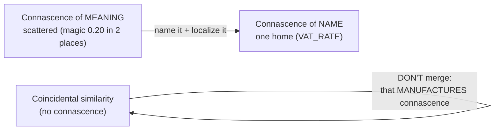
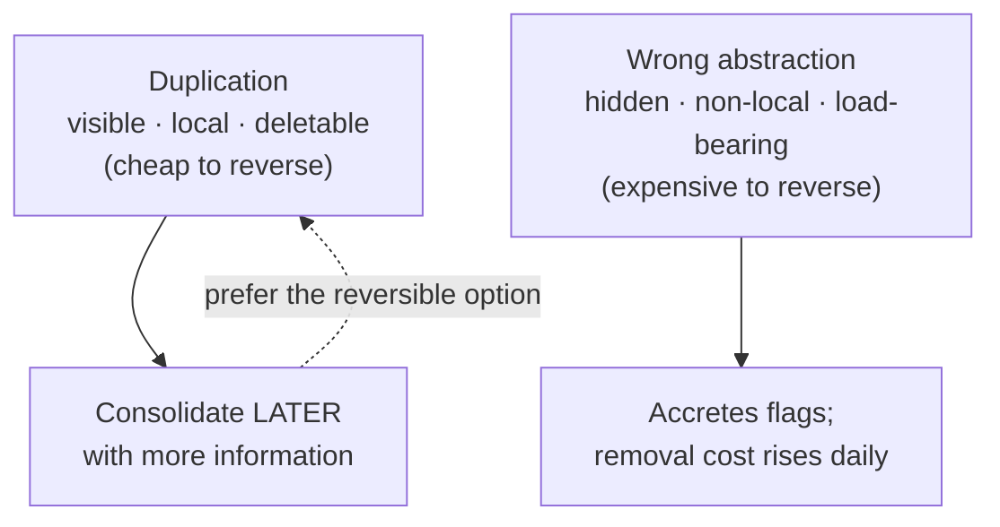

# DRY (Don't Repeat Yourself) — Senior

> **Category:** [Design Principles](../../README.md) — every piece of *knowledge* in a system should have a single, unambiguous, authoritative representation.

> **Prerequisites:** [Junior](junior.md) · [Middle](middle.md)
> **Focus:** **Design trade-offs** and **system-level reasoning**

---

## Table of Contents

1. [Introduction](#introduction)
2. [DRY Is About Knowledge — Connascence Makes It Precise](#dry-is-about-knowledge--connascence-makes-it-precise)
3. [The Danger at the Heart of DRY: Premature Abstraction](#the-danger-at-the-heart-of-dry-premature-abstraction)
4. [Why the Wrong Abstraction Is Harder to Remove Than Duplication](#why-the-wrong-abstraction-is-harder-to-remove-than-duplication)
5. [DRY vs. Decoupling and Orthogonality](#dry-vs-decoupling-and-orthogonality)
6. [DRY vs. Optimize-for-Deletion](#dry-vs-optimize-for-deletion)
7. [DRY Across Service and Bounded-Context Boundaries](#dry-across-service-and-bounded-context-boundaries)
8. [Code: A True Fix and a False Fix Side by Side](#code-a-true-fix-and-a-false-fix-side-by-side)
9. [A Decision Framework for "DRY It or Not"](#a-decision-framework-for-dry-it-or-not)
10. [Liabilities](#liabilities)
11. [Pros & Cons at the System Level](#pros--cons-at-the-system-level)
12. [Diagrams](#diagrams)
13. [Related Topics](#related-topics)

---

## Introduction

> Focus: **design trade-offs** and **system-level reasoning**

At the senior level, DRY stops being a refactoring habit and becomes a **lens on coupling**. The reframing that unlocks everything: *removing duplication is a coupling decision in disguise.* Every time you collapse two things into one, you couple their callers to that one thing — you assert "these will always change together." When that assertion is true, you've made change cheap. When it's false, you've manufactured a dependency between things that should evolve independently, and you've done it in a place that's now hard to undo.

So the senior questions are not "is there duplication?" but:

1. **Is the duplicated thing the *same knowledge*, or do I just see the same characters?** (Connascence answers this precisely.)
2. **If I abstract, what coupling am I creating — and is that coupling *true* (the things really do change together) or *false* (I'm betting they will, and I'll be wrong)?**
3. **When the abstraction turns out wrong, how expensive is it to undo?** (Far more expensive than the duplication — which is why patience wins.)

This file is the canonical principle-level treatment of those questions. It cross-links the supporting theory rather than re-deriving it: [Connascence](../../02-coupling-and-cohesion/03-connascence/) for the coupling vocabulary, [Orthogonality](../../02-coupling-and-cohesion/06-orthogonality/) and [SRP](../../04-solid/01-srp-single-responsibility/) for the "things that change together" axis, and [Optimize for Deletion](../06-optimize-for-deletion/) for the removability cost.

---

## DRY Is About Knowledge — Connascence Makes It Precise

"Duplicated knowledge" is intuitive but fuzzy. **Connascence** (Meilir Page-Jones) is the precise theory underneath DRY, and the senior upgrade to it. Two pieces of code are *connascent* if changing one requires changing the other to keep the system correct. (Full treatment: [Connascence](../../02-coupling-and-cohesion/03-connascence/).) The crucial insight for DRY:

> **A DRY violation is just a strong, scattered connascence — most often *connascence of meaning*** (two places that must agree on what a value *means*, like a magic number that must change together).

This makes DRY operational. The same magic number `0.20` in two places that encode **one** VAT rule is connascence of meaning: they *must* change together, but the language can't enforce it, so they drift. Naming it `VAT_RATE = 0.20` doesn't eliminate the connascence — it **weakens** it to *connascence of name* (callers now only have to agree on a name, which the compiler/IDE *does* help enforce) and **localizes** it to one place.

```python
# Connascence of MEANING, scattered (a real DRY violation):
price * 0.20          # in pricing.py  — must change together with...
total * 0.20          # in invoice.py  — ...this, but nothing enforces it

# Naming weakens it to connascence of NAME, localized (the DRY fix):
VAT_RATE = 0.20       # one home; callers connascent only on the NAME
```

And the converse — the half everyone forgets — is now precise too:

> Two pieces of code that *look* alike but share **no connascence** are not duplication. Merging them **manufactures** connascence — it *strengthens* coupling where there was none. That's the opposite of DRY's goal.

So the senior reframing of the whole principle:

> **Don't "remove duplication" — manage connascence: weaken it, localize it, lower its degree. DRY real (knowledge) connascence; never manufacture connascence by merging coincidental similarity.**

This single reframing tells you *both* halves of DRY (consolidate true duplication; leave coincidental alone) *and* which refactoring to reach for (the one that weakens or localizes the connascence).

---

## The Danger at the Heart of DRY: Premature Abstraction

The industry's instinct — "duplication bad, abstraction good" — is dangerously incomplete. The senior truth, crystallized by Sandi Metz, is that **the wrong abstraction is worse than duplication**, and chasing DRY too eagerly is *how you get the wrong abstraction.*

The death spiral is predictable:

1. You see two similar bits of code and extract a shared abstraction (a "DRY win!").
2. A new requirement makes one caller need slightly different behavior.
3. You add a parameter/flag to the abstraction to handle the difference (still feels DRY).
4. More requirements arrive; more flags accrue. The abstraction becomes a maze of conditionals serving callers that no longer have much in common.
5. Now the abstraction is *harder* to understand and change than the original duplication would have been — but it's load-bearing for many callers, so it's also *risky* to undo.

```python
# The premature-abstraction death spiral
def render(item, mode=None, compact=False, legacy=False, locale="en", inline=None):
    if mode == "summary" and not compact: ...
    elif legacy: ...
    elif inline and locale != "en": ...
    # six callers, none of which shares more than ~40% of this logic
```

Every flag was a *locally reasonable* response to "don't repeat yourself." The aggregate is a function nobody can change confidently. This is why DRY is the principle most prone to *causing* the harm it's supposed to prevent: it pushes you to couple, and coupling the wrong things is the original sin of software design.

The deeper diagnosis: a *bad* DRY removal **complects** (Hickey) independent concerns — it braids two things that should be separate into one element. The duplication you removed was *honest* (each caller stated its own knowledge plainly); the abstraction is *dishonest* (it pretends callers share a core they don't).

---

## Why the Wrong Abstraction Is Harder to Remove Than Duplication

This asymmetry is the senior justification for "tolerate incidental repetition" and the link to [Optimize for Deletion](../06-optimize-for-deletion/).

| | Duplication | The wrong abstraction |
|---|---|---|
| Visibility | Obvious — you can see the copies | Hidden — coupling is implicit in shared code |
| Locality | Local — each copy is self-contained | Non-local — one change ripples to every caller |
| Number of dependents | Each copy has its own callers | *Many* callers all depend on the one abstraction |
| Cost to remove | Low — consolidate any day, with confidence | High — must understand & re-test every caller |
| Trend over time | Flat — duplication doesn't get worse on its own | **Rising** — accretes flags, gets riskier every day |

Duplication is a *deferred* decision you can make later with **more** information. The wrong abstraction is a *committed* decision that gets more expensive to reverse as callers pile onto it. Removability is a first-class design value (see [Optimize for Deletion](../06-optimize-for-deletion/)) — and duplication is far more deletable than a load-bearing abstraction.

> **Prefer duplication to the wrong abstraction**, because duplication keeps your options open and the wrong abstraction closes them. The recovery from a wrong abstraction is counterintuitive but correct: **inline it back into its callers (re-introducing duplication), let each caller become clear and independent, *then* extract only the parts that are genuinely shared knowledge.**

---

## DRY vs. Decoupling and Orthogonality

DRY and [orthogonality](../../02-coupling-and-cohesion/06-orthogonality/) can directly conflict, and seniors must know which wins when.

- **DRY pushes toward consolidation:** one home per fact → fewer places, more sharing.
- **Orthogonality pushes toward independence:** unrelated things stay unrelated, so a change to one can't ripple to the other.

A shared abstraction is *anti-orthogonal* whenever its callers aren't truly related: you've created a path for a change in one caller to affect another. The reconciliation hinges on the same change test, viewed through the [SRP](../../04-solid/01-srp-single-responsibility/) lens:

> Consolidate things that **change together for the same reason** (DRY *and* orthogonal — the abstraction tracks one axis of change). Keep apart things that **change for different reasons** (DRY would *violate* orthogonality — the abstraction would couple independent axes).

This is SRP restated: "a module should have one reason to change." A correct DRY abstraction collects code that shares *one* reason to change; a wrong one collects code that merely *looks* alike but has *different* reasons to change. When DRY would force you to couple two distinct reasons-to-change, **orthogonality wins** — keep the duplication.

```text
Same reason to change?  ──yes──►  DRY it (one home; stays orthogonal)
        │
        └──no (different axes)──►  Keep apart (DRYing would break orthogonality)
```

---

## DRY vs. Optimize-for-Deletion

[Optimize for Deletion](../06-optimize-for-deletion/) says: structure code so any piece is easy to remove. DRY is in tension with it, because *sharing creates dependents*, and code with many dependents is hard to delete.

The synthesis:

- DRYing **true** knowledge improves deletability of the *knowledge* (delete/change the rule in one place) while reducing deletability of the *abstraction* (now many callers depend on it). That's an acceptable trade when the knowledge really is shared — you'll rarely want to delete a genuinely-shared rule.
- DRYing **coincidental** similarity is pure loss on the deletion axis: you couple independent things, so now you can't delete or change one without touching the other. The duplication you removed was *more* deletable than the abstraction you created.

> When in doubt, bias toward the more **deletable** design. Duplication is deletable (consolidate later); a wrong abstraction is sticky (every caller must be migrated). Deletability is the tiebreaker that usually agrees with AHA: *prefer the option you can reverse cheaply.*

---

## DRY Across Service and Bounded-Context Boundaries

DRY's definition is scoped *"within a system."* At the architecture scale, applying DRY **across** systems is frequently a mistake.

- **Shared libraries couple deployments.** If two services share a library that owns a business rule, a change to that rule forces *both* services to upgrade and redeploy in lockstep. You've traded code duplication for *organizational and operational* coupling — usually a worse trade.
- **Bounded contexts legitimately duplicate concepts.** In Domain-Driven Design, "Customer" in Billing and "Customer" in Shipping are *different models of the same word* — they share a name, not knowledge. Forcing them into one shared `Customer` class couples two contexts that should evolve independently, the textbook anti-orthogonality failure.
- **The maxim:** **"A little copying is better than a little dependency"** (Go proverbs / Rob Pike). A few duplicated lines are cheaper than a shared dependency that couples teams, release cycles, and contexts.

| | Share (apply DRY across services) | Duplicate (a little copying) |
|---|---|---|
| Couples | Deployments, teams, release cycles | Nothing — each service evolves freely |
| Right when | The knowledge is *genuinely* one fact owned by one team (e.g., a wire-protocol contract) | The concepts merely overlap; contexts differ |
| Wrong when | Two contexts share a *word*, not a *fact* | The duplicated thing is a true cross-cutting contract |

The senior rule: **DRY aggressively *within* a service/context; duplicate deliberately *across* them.** The few exceptions where cross-service sharing is right are the truly authoritative contracts — wire protocols, message schemas, error codes — and those should be *generated from one spec*, not hand-shared.

---

## Code: A True Fix and a False Fix Side by Side

### (a) A TRUE DRY violation, correctly fixed

One business rule — "tax is 20% VAT" — duplicated across the pricing and invoicing modules, already drifting (one uses `0.2`, one uses `0.20`, and a third forgot it entirely):

```python
# BEFORE — the SAME knowledge, scattered (connascence of meaning, unenforced)
# pricing.py
def display_price(net):  return net * 1.2            # VAT baked in
# invoice.py
def invoice_total(net):  return net + net * 0.20     # same VAT, written differently
# refund.py
def refund_amount(net):  return net                  # ← BUG: forgot VAT entirely

# AFTER — one authoritative home (connascence weakened to NAME, localized)
# tax.py  — the single source of truth for the VAT rule
VAT_RATE = 0.20
def with_vat(net):   return net * (1 + VAT_RATE)
def vat_of(net):     return net * VAT_RATE

# pricing.py → with_vat(net)   invoice.py → with_vat(net)   refund.py → with_vat(net)
```

This is correct DRY: the VAT rule is *one fact*, it must change everywhere together, and consolidating it both removed drift *and* exposed the latent refund bug. The change test is unambiguously "yes."

### (b) A FALSE DRY "fix" — merging coincidental similarity

Two notification builders looked ~90% identical, so they got merged:

```python
# BEFORE — two clear, INDEPENDENT functions (different knowledge, similar shape)
def welcome_email(user):
    return Email(to=user.email, subject="Welcome!",
                 body=render("welcome", name=user.name))

def password_reset_email(user, token):
    return Email(to=user.email, subject="Reset your password",
                 body=render("reset", name=user.name, link=reset_url(token)))

# HASTY MERGE — "DRY!" — but welcome and reset are DIFFERENT knowledge
def build_email(user, kind, token=None):
    subject = "Welcome!" if kind == "welcome" else "Reset your password"
    tmpl    = "welcome" if kind == "welcome" else "reset"
    ctx     = {"name": user.name}
    if kind == "reset": ctx["link"] = reset_url(token)
    return Email(to=user.email, subject=subject, body=render(tmpl, **ctx))
```

The change test fails: would a change to the welcome flow force the same change to password reset? No — they're driven by *different* product decisions (onboarding vs. security). The "DRY" merge couples them, and the divergence has already begun (the `if kind == "reset"` special case). The next requirement — a localized subject for welcome, a token-expiry warning for reset, a marketing footer on welcome only — adds another flag, and another, until `build_email` is a maze.

**Correct move:** keep them apart. DRY only the *genuinely* shared knowledge — the `Email` construction and `render` — which were *already* shared helpers. The textual similarity of the two builders is incidental and should be tolerated.

> **DRY out the knowledge (`Email`, `render`); tolerate incidental textual repetition (two builders that happen to look alike).**

---

## A Decision Framework for "DRY It or Not"

A senior reduces the whole topic to a short decision procedure:

```mermaid
flowchart TD
    A["Two places look alike"] --> B{Same knowledge?<br/>(change one ⇒ change both<br/>for the SAME reason?)}
    B -- "no" --> KEEP["KEEP APART<br/>(coincidence — merging = false coupling)"]
    B -- "yes" --> C{Crosses a service /<br/>bounded-context boundary?}
    C -- "yes" --> COPY["Prefer a little COPYING<br/>(generate from a spec only for<br/>true cross-service contracts)"]
    C -- "no" --> D{Provably identical<br/>OR 3rd occurrence?}
    D -- "no" --> WAIT["WAIT (rule of three) —<br/>don't bake in a guessed shape"]
    D -- "yes" --> E{Does the abstraction<br/>hurt clarity / orthogonality?}
    E -- "yes" --> KEEP2["KEEP APART<br/>(clarity & orthogonality outrank DRY)"]
    E -- "no" --> DRY["DRY IT<br/>one authoritative home;<br/>weaken & localize the connascence"]
```

The procedure encodes every senior rule in this file: knowledge over text, within-system scope, rule of three, and DRY yielding to clarity/orthogonality.

---

## Liabilities

### Liability 1: DRY zealotry creating coupling

Removing *every* textual duplicate strengthens connascence across modules that should be independent — producing a system where one change ripples everywhere. That is the *exact* problem DRY was meant to prevent, caused by misapplying it. Measure with connascence and change-coupling, not character matching.

### Liability 2: The wrong abstraction, now load-bearing

A hasty abstraction accretes flags until it's a maze that's risky to remove. Each day it survives, more callers depend on it and removal gets costlier. Recognize the smell (a function whose parameters apply to different, disjoint branches) and escape via inline-then-re-extract.

### Liability 3: DRY across boundaries

Applying DRY across services/contexts couples deployments and teams. A shared library that owns a business rule turns a one-team change into a multi-team lockstep release. Prefer a little copying; reserve cross-service sharing for genuine contracts, generated from one spec.

### Liability 4: Treating DRY as absolute

DRY is a heuristic that conflicts with clarity, orthogonality, locality, and deletability. It does not automatically win those conflicts. The senior failure is invoking "but DRY" to justify a merge that hurts a *higher* value — when DRY fights clarity or orthogonality, those usually win.

---

## Pros & Cons at the System Level

| Dimension | Aggressive DRY | Tolerant of duplication (AHA) |
|---|---|---|
| Change cost for *true* shared knowledge | Low — one-line edit, no drift | High — shotgun surgery, drift risk |
| Risk of the *wrong abstraction* | **High** — eager merging couples unrelated things | Low — you wait for the shape to emerge |
| Coupling introduced | High — callers share abstractions | Low — callers stay independent |
| Reversibility | Low — abstractions are sticky, load-bearing | High — duplication consolidates any day |
| Cross-service health | **Poor** if applied across boundaries | Good — "a little copying beats a little dependency" |
| Readability | Good *if* the abstraction is right; poor if wrong | Good — each site is explicit and local |
| Best when | Knowledge is provably, stably shared (≥3 cases) | Uncertain whether the match is real (most cases) |

The system-level stance: **DRY is right for proven, within-system, same-reason-to-change knowledge — and a liability everywhere else.** The asymmetry between deferring (cheap to reverse) and abstracting (expensive to reverse) means the default bias should be patience: DRY when the evidence is in, duplicate while it isn't.

---

## Diagrams

### DRY reframed as managing connascence



### The asymmetry that drives the default



---

## Related Topics

- **The precise theory under Rule 3 / DRY:** [Connascence](../../02-coupling-and-cohesion/03-connascence/).
- **The tension partner:** [Orthogonality](../../02-coupling-and-cohesion/06-orthogonality/), [Single Responsibility](../../04-solid/01-srp-single-responsibility/).
- **The removability tiebreaker:** [Optimize for Deletion](../06-optimize-for-deletion/).
- **Sibling principles:** [KISS](../01-kiss/).
- **DRY as Simple Design's Rule 3:** [Simple Design](../../../craftsmanship-disciplines/04-simple-design/).

---


---

## Check your understanding

1. Explain DRY (Don't Repeat Yourself) — Senior Level in your own words and name the problem it solves.
2. How would you apply the ideas around Table of Contents, Introduction, DRY Is About Knowledge — Connascence Makes It Precise in a realistic engineering change?
3. What failure mode or misuse should you look for, and what evidence would reveal it?
4. How would you validate a system-level decision about DRY (Don't Repeat Yourself) — Senior Level under uncertainty?
5. What observable result would convince you that the approach improved the system?
