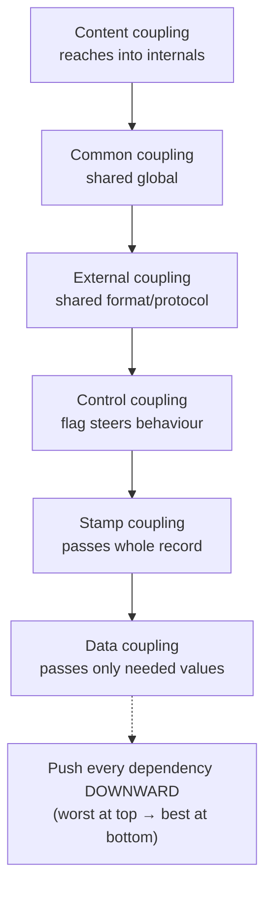
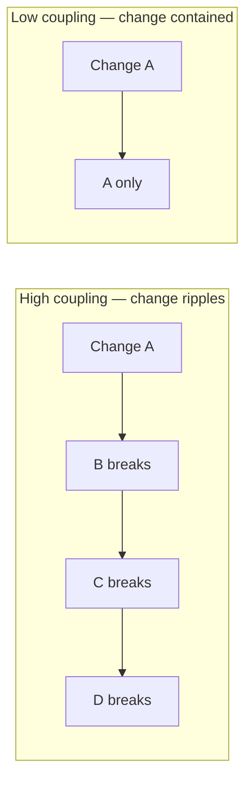

# Minimise Coupling — Junior

> **Category:** [Design Principles → Coupling & Cohesion](../../README.md) — coupling is how much one module depends on another; minimising it reduces how far a change in A ripples into B.

---

## Table of Contents

1. [Introduction](#introduction)
2. [Prerequisites](#prerequisites)
3. [Glossary](#glossary)
4. [What Coupling Is](#what-coupling-is)
5. [Coupling vs. Cohesion: The Two Halves](#coupling-vs-cohesion-the-two-halves)
6. [The Taxonomy of Coupling](#the-taxonomy-of-coupling)
7. [Symptoms of High Coupling](#symptoms-of-high-coupling)
8. [How to Reduce Coupling](#how-to-reduce-coupling)
9. [Loose ≠ Decoupled ≠ Zero](#loose--decoupled--zero)
10. [Real-World Analogies](#real-world-analogies)
11. [Mental Models](#mental-models)
12. [A Worked Example](#a-worked-example)
13. [Code Examples](#code-examples)
14. [Best Practices](#best-practices)
15. [Common Mistakes](#common-mistakes)
16. [Tricky Points](#tricky-points)
17. [Test Yourself](#test-yourself)
18. [Cheat Sheet](#cheat-sheet)
19. [Summary](#summary)
20. [Further Reading](#further-reading)
21. [Related Topics](#related-topics)
22. [Diagrams](#diagrams)

---

## Introduction

> Focus: **What is it?** and **How to use it?**

**Coupling** is the degree to which one module depends on — and knows about — another. Two modules are *coupled* when a change to one may force a change to the other. **Minimising coupling** means arranging your code so that modules know as little about each other as they can while still doing their job.

> **Coupling:** the strength of the dependency between two modules — measured by *how much one must know about the other*, and therefore *how likely a change in one is to break the other.*

The reason this matters is one word: **change**. Software is read and modified far more than it is written. A codebase where every module is tangled into every other is one where a one-line fix triggers edits in five files, tests in ten, and a bug in a place nobody thought to look. That cascade — a change in A forcing changes in B, C, and D — is the **ripple effect**, and high coupling is its cause.

Low coupling is the property that lets you change one part of a system *without understanding or touching the rest of it*. It is what makes code testable (you can isolate a module), reusable (you can lift it out), and comprehensible (you can read it without reading everything it touches). Almost every other design principle in this roadmap — DIP, the Law of Demeter, Inversion of Control, even SOLID as a whole — is ultimately a specific tactic for keeping coupling low.

### Why this matters

Coupling is not "bad" the way a bug is bad — modules *must* talk to each other to do anything useful. The goal is never *zero* coupling (that means modules that don't cooperate, i.e. useless ones). The goal is **appropriate, minimal, well-shaped coupling**: dependencies that are few, visible, and on stable things rather than volatile details. This level teaches you to recognise the difference.

---

## Prerequisites

- **Required:** You can write functions/methods and classes, and you understand what it means for one to *call* or *import* another.
- **Required:** Basic familiarity with interfaces / abstract types in at least one language.
- **Helpful:** A feel for **[automated testing](../../../craftsmanship-disciplines/02-test-design-and-fixtures/junior.md)** — coupling shows up most painfully as "I can't test this in isolation."
- **Helpful:** Exposure to **[cohesion](../02-maximise-cohesion/junior.md)**, coupling's sibling concept (covered fully in its own topic).

---

## Glossary

| Term | Definition |
|------|-----------|
| **Coupling** | How strongly one module depends on/knows about another; how far a change in one ripples into the other. |
| **Cohesion** | How strongly the elements *inside* one module belong together (a separate topic). |
| **Module** | Any unit with a boundary: a function, class, package, service. |
| **Ripple effect** | A change in one module forcing changes in others that depend on it. |
| **Shotgun surgery** | One conceptual change requiring many small edits scattered across many files. |
| **Surface area** | How much of a module is visible/reachable from outside — public methods, fields, globals. The larger, the more there is to couple to. |
| **Dependency** | A relationship where module A needs module B to compile, run, or be understood. |
| **Decoupling** | Reducing or restructuring a dependency so the two modules know less about each other. |
| **Afferent coupling (Ca)** | The number of modules that depend *on* this module ("incoming"). |
| **Efferent coupling (Ce)** | The number of modules this module depends *on* ("outgoing"). |

---

## What Coupling Is

Every dependency is a coupling. When module `A` uses module `B`, `A` is coupled to `B`: if `B`'s name, types, parameters, order of calls, or behaviour change, `A` may break. Coupling has two independent properties you should learn to see:

- **How many** dependencies a module has (its *degree*), and
- **How strong** each dependency is (its *kind*).

A module with twenty weak dependencies can be healthier than a module with one very strong one. Most of this topic is about the *kinds* — because a dependency on a *name* is cheap to live with, while a dependency on another module's internal data layout, or on a shared global variable, is a time bomb.

```text
   A ─────► B        "A is coupled to B"
   If B changes, A may have to change too.
   The QUESTION is: how much does A need to KNOW about B?
   - just B's name?            (weak — fine)
   - B's exact parameter order? (medium)
   - B's internal fields?       (strong — dangerous)
```

The lower the *amount* a module must know about another, the lower the coupling, and the more freely each can change.

---

## Coupling vs. Cohesion: The Two Halves

Coupling and **cohesion** are the two halves of one idea — *where the lines between modules should fall.* They are always taught together because optimising one without the other is meaningless.

- **Cohesion** is *within* a module: do the things inside it belong together?
- **Coupling** is *between* modules: how tangled are the boundaries?

> The classic pairing: **low coupling, high cohesion.** Group what changes together (high cohesion), and keep the groups independent of each other (low coupling).

| | **Coupling** | **Cohesion** |
|---|---|---|
| Scope | *Between* modules | *Inside* a module |
| You want it | **Low** | **High** |
| Bad version | Everything depends on everything | A module that does ten unrelated things |
| Failure name | Ripple effect, shotgun surgery | "God class", grab-bag module |

The two are linked: when you raise cohesion (move related things into one module), you often *lower* coupling automatically (those things no longer need to reach across boundaries to find each other). Cohesion has its own topic — see **[Maximise Cohesion](../02-maximise-cohesion/junior.md)** — so here we focus on coupling.

---

## The Taxonomy of Coupling

The single most useful thing to learn about coupling is that it comes in **kinds, ranked from worst to best.** This ranking is from *Structured Design* (Stevens, Myers, Constantine, 1974) and is still the canonical vocabulary fifty years later. Worst at the top, best at the bottom:

```text
WORST  ┌──────────────────────────────┐
   ▲   │ 1. Content coupling          │  A reaches INTO B's internals
   │   │ 2. Common (global) coupling  │  A and B share a global
   │   │ 3. External coupling         │  share an external format/protocol
   │   │ 4. Control coupling          │  A passes a flag telling B what to do
   │   │ 5. Stamp (data-structure)    │  A passes a whole record; B uses part
   ▼   │ 6. Data coupling             │  A passes only the data B needs
 BEST  └──────────────────────────────┘
```

The ordering tracks **how much one module must know about the other.** Content coupling means A knows B's private guts; data coupling means A knows only "B needs these two numbers." Aim to push every dependency *down* this ladder.

### 1. Content coupling (worst)

One module reaches *into* another's internals — its private fields, or even its code.

```python
# A reaches directly into B's private state — content coupling
class Account:
    def __init__(self):
        self._balance = 100   # "private" by convention

class Report:
    def show(self, account):
        account._balance -= 10        # reaching INTO Account's guts
        print(account._balance)
```

`Report` now depends on `Account`'s *internal field name and meaning*. Rename `_balance` and `Report` breaks. **Fix:** go through a method (`account.withdraw(10)`), so `Report` depends only on a public operation, not internal state.

### 2. Common (global) coupling

Two modules communicate through a shared global variable. Each silently depends on the other's reads and writes to that global.

```python
config = {}   # global

def loader():   config["rate"] = 0.2          # writes global
def billing():  return amount * config["rate"] # reads global
```

`billing` breaks if `loader` didn't run first, or if anyone else mutates `config`. The dependency is invisible — nothing in `billing`'s signature says it needs `config`. **Fix:** pass the rate in as a parameter.

### 3. External coupling

Modules depend on a shared *external* format, protocol, device, or data layout — a file format, an API's exact JSON shape, a specific message protocol. When the external thing changes, every module sharing it must change together.

```python
# Both modules hard-code the exact CSV column order from an external system
def parser(line):   return line.split(",")[3]   # column 3 = "email"
def exporter(user): return f"{user.id},{user.name},,{user.email}"  # must match
```

**Fix:** isolate the external format behind one adapter so only *that* module knows the layout.

### 4. Control coupling

One module passes a **flag** that controls *what the other does internally* — it's reaching in to steer B's logic.

```python
def fetch(source, sort_descending):    # the flag CONTROLS internal behaviour
    rows = read(source)
    if sort_descending:
        rows.reverse()
    return rows
```

The caller must know `fetch` has two internal modes. **Fix:** split into two clear functions, or pass the *comparison*, not a flag — let the caller own the decision instead of toggling B's internals.

### 5. Stamp (data-structured) coupling

A module passes a whole composite record when the callee only needs one or two fields. The callee is now coupled to the *whole structure's shape*.

```python
def can_vote(person):           # only needs the AGE
    return person.age >= 18     # but is handed the entire Person object

can_vote(full_person_with_50_fields)   # coupled to Person's whole shape
```

If `Person` changes shape, `can_vote` may break even though it only ever used `age`. **Fix:** pass just `age`.

### 6. Data coupling (best)

A module passes the callee *exactly* the simple data it needs — nothing more.

```python
def can_vote(age):       # depends only on one integer
    return age >= 18
```

`can_vote` knows nothing about `Person`, globals, formats, or flags. This is the goal: the smallest possible shared knowledge.

### Two more you must know

- **Temporal coupling** — two operations are coupled *in time*: B only works if A ran first (e.g. `connect()` must be called before `send()`). The dependency is on *ordering*, and it's invisible in the signatures. Prefer designs where you can't call things in the wrong order.

- **Afferent / efferent coupling (Ca / Ce)** — a way to *count* coupling at the module level. **Ca** = how many modules depend on you (incoming); **Ce** = how many you depend on (outgoing). From these comes the **instability** metric:

  > **Instability `I = Ce / (Ca + Ce)`** — ranges 0 (maximally stable: many depend on it, it depends on nothing) to 1 (maximally unstable: depends on much, nothing depends on it).

  A module everyone depends on (low `I`) should be *stable* and change rarely; a module that depends on everything (high `I`) is fine to change often. (Explored at [Middle](middle.md) and in [Connascence](../03-connascence/junior.md).)

---

## Symptoms of High Coupling

You usually *feel* high coupling before you measure it:

| Symptom | What you experience |
|---|---|
| **Shotgun surgery** | One small conceptual change forces edits scattered across many files. |
| **Ripple effect** | Fixing A breaks B, C, and D in unexpected places. |
| **Can't test in isolation** | To test one class you must spin up a database, a network, three other classes. |
| **Can't reuse** | You want module A in another project but it drags ten others along. |
| **Fragile build** | Touching one file recompiles/retests half the codebase. |
| **Fear of change** | Nobody wants to touch a module because "everything depends on it." |

If two or three of these are true of a module, it is over-coupled.

---

## How to Reduce Coupling

Each of these is a tactic to push dependencies down the ladder or remove them:

- **Program to interfaces / [Dependency Inversion](../../04-solid/05-dip-dependency-inversion/junior.md)** — depend on a small abstraction, not a concrete class, so the concrete detail can change freely.
- **Dependency injection** — pass collaborators in from outside instead of constructing them inside; the module no longer knows *which* concrete thing it uses.
- **Events / pub-sub** — instead of A calling B directly, A publishes an event and B reacts. A no longer knows B exists. (See [pub-sub patterns].)
- **The [Law of Demeter](../04-law-of-demeter/junior.md)** — "only talk to your immediate friends": don't reach through `a.getB().getC().doThing()`, which couples you to the whole chain.
- **Facades** — hide a complicated subsystem behind one simple interface, so callers couple to the facade, not the parts.
- **Message passing** — communicate via small, explicit messages rather than shared state.
- **Reduce surface area** — make fields private, expose fewer methods. The less is visible, the less can be coupled to.

---

## Loose ≠ Decoupled ≠ Zero

Three words people use loosely:

- **Loosely coupled** — modules depend on each other through *weak, stable* connections (a small interface, a message). Change is unlikely to ripple. **This is the goal.**
- **Decoupled** — the dependency has been removed or fully inverted; they don't reference each other directly at all (e.g. via events).
- **Zero coupling** — modules don't interact *at all*. This is not a virtue; **a module that's coupled to nothing does nothing useful.** Two modules that never cooperate aren't "well-designed," they're just unrelated.

> The target is **appropriate** coupling — the *minimum* needed for the modules to do their job together — not the *absence* of coupling. You can over-decouple: wrap everything in events and indirection until nobody can tell where anything actually happens.

---

## Real-World Analogies

| Concept | Analogy |
|---|---|
| **Coupling** | Wiring in a house. Plug-and-socket (data coupling) lets you swap any appliance. Hard-wired into the wall (content coupling) means an electrician for every change. |
| **Ripple effect** | A row of dominoes — knock one and the rest fall. Low coupling spaces them so one falls alone. |
| **Content coupling** | Reaching into your neighbour's house to rearrange their furniture. It works until they move a chair. |
| **Common/global coupling** | A shared whiteboard everyone writes on. Convenient, until two people overwrite each other and nobody knows who changed what. |
| **Data coupling** | Handing a cashier exact change — they need nothing else about you. |
| **Zero coupling** | Two appliances that never share power or signal — fine, but they also never work together. |

---

## Mental Models

**The intuition:** *"The less one module needs to know about another, the more freely each can change. Minimise what they must know."*

```text
   HOW MUCH does A need to know about B?
   ┌───────────────────────────────────────────────┐
   │ B's private fields/code ........ CONTENT (worst)│
   │ a global both touch ............. COMMON         │
   │ an external format .............. EXTERNAL       │
   │ a flag that steers B ............ CONTROL         │
   │ B needs a whole record .......... STAMP          │
   │ B needs just these values ....... DATA  (best)   │
   └───────────────────────────────────────────────┘
        Push every dependency DOWN this list.
```

A second model: **coupling is a knowledge debt.** Every fact module A knows about module B is a fact you must keep true on *both* sides forever. Minimising coupling is minimising the number of facts that must stay in sync.

---

## A Worked Example

A notification feature, evolving from highly coupled to loosely coupled.

### Start: content + global + control coupling all at once

```python
mailer_config = {}   # global

class OrderService:
    def place(self, order):
        save(order)
        # reaches into a concrete mailer's internals AND a global AND uses a flag
        smtp = SmtpMailer()
        smtp._host = mailer_config["host"]          # content: touches private field
        smtp.send(order.customer.profile.email,     # long reach (Demeter violation)
                  urgent=True)                       # control: flag steers send()
```

`OrderService` knows: the SMTP class, its private `_host`, a global config, the urgent-flag mode, and the deep path to an email. Five separate things must stay in sync. Change any and `OrderService` breaks.

### Step 1 — data coupling instead of stamp/Demeter reach

```python
class OrderService:
    def place(self, order):
        save(order)
        email = order.customer_email()       # ask, don't reach (Law of Demeter)
        SmtpMailer(host).send_urgent(email)  # pass just the email; no flag
```

### Step 2 — depend on an interface, inject it (DIP + DI)

```python
class OrderService:
    def __init__(self, mailer: Mailer):      # depends on an ABSTRACTION
        self._mailer = mailer                # supplied from outside

    def place(self, order):
        save(order)
        self._mailer.send_urgent(order.customer_email())
# OrderService no longer knows it's SMTP. Swap in a FakeMailer for tests freely.
```

### Step 3 — decouple completely with an event

```python
class OrderService:
    def __init__(self, events: EventBus):
        self._events = events

    def place(self, order):
        save(order)
        self._events.publish(OrderPlaced(order.customer_email()))
# OrderService now doesn't even know a mailer EXISTS.
# A NotificationListener subscribes and sends. Fully decoupled.
```

Each step lowered the coupling. **But note:** step 3 is not automatically "best" — the event makes "where does the email actually get sent?" harder to trace. The *right* stopping point depends on how independently these parts really need to evolve. Don't reach for events just because you can.

---

## Code Examples

### Java — control coupling → split, removing the flag

```java
// BEFORE — control coupling: caller flips internal behaviour with a boolean
String render(Report r, boolean asHtml) {
    if (asHtml) return toHtml(r);
    else        return toPlainText(r);
}

// AFTER — two cohesive methods; caller picks, no flag steering internals
String renderHtml(Report r)  { return toHtml(r); }
String renderText(Report r)  { return toPlainText(r); }
```

### TypeScript — stamp → data coupling

```typescript
// BEFORE — stamp coupling: needs only a total, handed the whole order
function isFreeShipping(order: Order): boolean {
  return order.total >= 50;        // coupled to Order's whole shape
}

// AFTER — data coupling: depends on one number
function isFreeShipping(total: number): boolean {
  return total >= 50;
}
```

### Python — common (global) coupling → injected parameter

```python
# BEFORE — common coupling via a hidden global dependency
TAX_RATE = 0.2
def price_with_tax(net):
    return net * (1 + TAX_RATE)     # silently depends on the global

# AFTER — the dependency is explicit and local
def price_with_tax(net, tax_rate):
    return net * (1 + tax_rate)
```

---

## Best Practices

1. **Know the ladder.** Whenever two modules talk, ask which *kind* of coupling it is and whether you can push it lower (toward data coupling).
2. **Pass the data, not the container.** Prefer `f(age)` over `f(wholePerson)` — drop stamp coupling to data coupling.
3. **No flags that steer internals.** Replace control coupling with separate methods or an injected behaviour.
4. **Kill globals.** Replace common coupling with explicit parameters or injection.
5. **Go through methods, never into fields.** Keep fields private; that removes content coupling at the source.
6. **Depend on small interfaces** for *volatile* collaborators (DB, network, third-party SDKs) — see [DIP](../../04-solid/05-dip-dependency-inversion/junior.md).
7. **Ask, don't reach** — follow the [Law of Demeter](../04-law-of-demeter/junior.md); avoid `a.b().c().d()`.
8. **Don't over-decouple.** Stop at the minimum the design actually needs; events and indirection have their own cost.

---

## Common Mistakes

1. **Confusing coupling with cohesion.** Coupling is *between* modules; cohesion is *within* one. They're different axes.
2. **Chasing zero coupling.** Wrapping everything in events/interfaces until the code is untraceable. The goal is *minimal*, not *none*.
3. **Hidden coupling via globals.** "It's just a config singleton" — a global is still common coupling, the second-worst kind.
4. **Boolean parameters.** A flag argument is almost always control coupling in disguise.
5. **Passing fat objects everywhere.** Handing whole entities to functions that need one field (stamp coupling).
6. **Reaching through chains.** `order.getCustomer().getAddress().getCity()` couples you to three classes' shapes.
7. **Adding an interface with one implementation "to decouple".** That's indirection, not decoupling — it removes no real dependency. (See [DIP](../../04-solid/05-dip-dependency-inversion/junior.md).)

---

## Tricky Points

- **An interface doesn't decouple by itself.** If `A` depends on `IB` but `IB` has exactly one implementation that `A` always gets, you've added a hop, not removed a dependency. Decoupling means the dependency could *actually* vary.
- **Decoupling can hide the flow.** Replacing a direct call with an event makes the system more flexible *and* harder to follow — you trade "where is this called?" for "who listens?". That's a real cost, not a free win.
- **Globals are coupling even when convenient.** Loggers, config singletons, and "context" objects are common coupling. Sometimes acceptable, but never free.
- **Low coupling and high cohesion usually move together** — but not always; you can have a perfectly cohesive module that's still over-coupled to its neighbours. Treat them as two checks, not one.

---

## Test Yourself

1. Define coupling in one sentence. How does it differ from cohesion?
2. List the six classic coupling types from worst to best.
3. Why is content coupling worse than data coupling?
4. What is the ripple effect, and which symptom (shotgun surgery vs. ripple) describes "one change forces many scattered edits"?
5. A function takes a boolean `isAdmin` and behaves differently inside. Which coupling type is that, and how would you fix it?
6. Why is "zero coupling" not the goal?
7. What do Ca and Ce measure, and what is instability `I`?

---

## Cheat Sheet

```text
COUPLING = how much one module must KNOW about another
           (and thus how far a change RIPPLES)

THE LADDER (worst → best — push every dependency DOWN)
  1 Content   A touches B's private guts        → use a method
  2 Common    A & B share a global              → pass a parameter
  3 External  share an external format/protocol → isolate in one adapter
  4 Control   A passes a flag steering B        → split into methods
  5 Stamp     A passes a whole record           → pass just the field
  6 Data      A passes only what B needs        ← THE GOAL

ALSO KNOW
  Temporal    B works only if A ran first       → design out the ordering
  Ca / Ce     incoming / outgoing deps
  I = Ce/(Ca+Ce)   0 stable ... 1 unstable

SYMPTOMS  shotgun surgery · ripple · can't test isolated · can't reuse
TOOLS     interfaces/DIP · DI · events · Law of Demeter · facades · less surface
REMEMBER  goal = MINIMAL coupling, not ZERO. low coupling + high cohesion.
```

---

## Summary

- **Coupling** = how much one module depends on/knows about another; minimising it shrinks the **ripple effect** — how far a change in A forces a change in B.
- Coupling is *between* modules; **cohesion** is *within* one. The pairing is **low coupling, high cohesion.**
- Coupling comes in **kinds, worst → best: Content, Common, External, Control, Stamp, Data.** Plus **temporal** coupling and the **Ca/Ce** count with **instability `I = Ce/(Ca+Ce)`**.
- **Symptoms:** shotgun surgery, ripple effects, can't test in isolation, can't reuse, fragile build.
- **Tools:** interfaces/DIP, dependency injection, events/pub-sub, the Law of Demeter, facades, smaller surface area.
- The goal is **appropriate** coupling, **not zero** — over-decoupling buys flexibility with indirection and lost traceability.

---

## Further Reading

- Stevens, Myers, Constantine, *Structured Design* (1974) — the original coupling taxonomy.
- Glenford Myers, *Composite/Structured Design* — the worst-to-best ranking in depth.
- Robert C. Martin, *Clean Architecture* — afferent/efferent coupling and the instability metric.
- Steve McConnell, *Code Complete*, ch. 5 — coupling/cohesion for working programmers.
- Meilir Page-Jones, *What Every Programmer Should Know About Object-Oriented Design* — connascence, the modern successor (see [Connascence](../03-connascence/junior.md)).

---

## Related Topics

- **Sibling (the other half):** [Maximise Cohesion](../02-maximise-cohesion/junior.md)
- **Precise theory of coupling:** [Connascence](../03-connascence/junior.md)
- **A key tactic:** [Law of Demeter](../04-law-of-demeter/junior.md), [Inversion of Control](../08-inversion-of-control/junior.md)
- **The structural move:** [Dependency Inversion](../../04-solid/05-dip-dependency-inversion/junior.md)

---

## Diagrams

### The coupling ladder



### Ripple effect: high vs. low coupling



---


---

## Check your understanding

1. Explain Minimise Coupling — Junior Level in your own words and name the problem it solves.
2. How would you apply the ideas around Table of Contents, Introduction, Prerequisites in a realistic engineering change?
3. What failure mode or misuse should you look for, and what evidence would reveal it?
4. What small example would prove that you can apply Minimise Coupling — Junior Level correctly?
5. What observable result would convince you that the approach improved the system?
