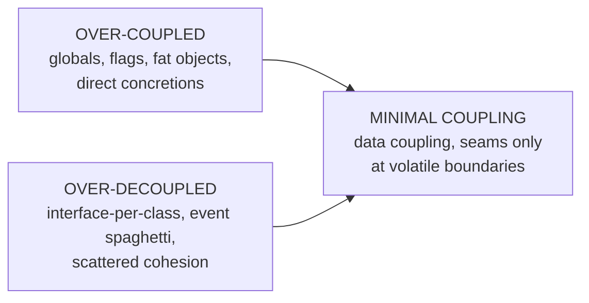
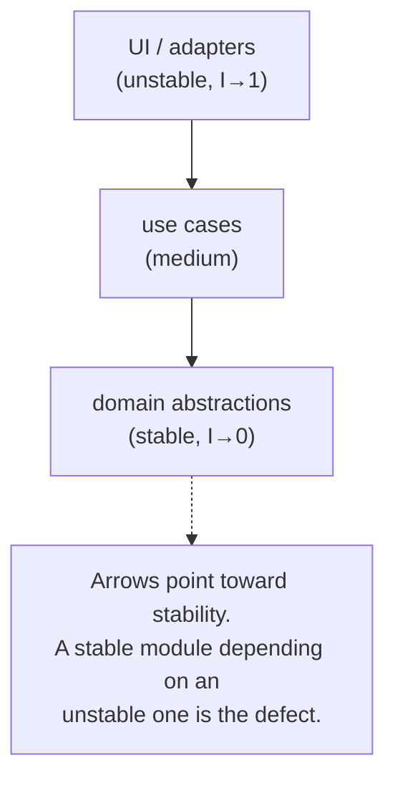

# Minimise Coupling — Middle

> **Category:** [Design Principles → Coupling & Cohesion](../../README.md) — coupling is how much one module depends on another; minimising it reduces how far a change in A ripples into B.

> **Prerequisite:** [Junior](junior.md)
> **Focus:** **Why** and **When**

---

## Introduction

> Focus: **Why** and **When**

At the junior level, the coupling taxonomy is a ranked list you can recite. At the middle level it becomes a **diagnostic instrument you use on real code** — and a set of judgement calls: *Is this dependency strong enough to matter? Will decoupling it pay for the indirection it adds? Am I reducing coupling, or just hiding it somewhere harder to see?*

The recurring tension is between **two failure modes**:

- **Over-coupling** — direct calls into concretions, shared globals, fat objects passed everywhere, flag-driven behaviour. A change anywhere ripples everywhere.
- **Over-decoupling** — every collaborator hidden behind an interface, every call replaced by an event, layers of indirection. The system is "flexible" but nobody can trace what happens, and the flexibility is never used.

The industry over-trains engineers to fear over-coupling and rewards over-decoupling because it *looks* sophisticated. The middle skill is calibrating between them — and the calibration tool is asking, for each dependency, *what kind is it, how volatile is the thing depended on, and is the seam reversible-cheap or not?*

---

## Reading the Taxonomy in Real Code

The taxonomy isn't an academic list — it's a way to *name* exactly what's wrong with a dependency so you know which refactoring to reach for.

### Diagnosing a real method

```python
session = {}   # module-level global

def checkout(cart, express):                       # `express` is a control flag
    rate = session["shipping_rate"]                # common coupling (global)
    if express:                                    # control coupling
        rate *= 2
    total = sum(i.product.price.amount             # stamp + Demeter reach
                for i in cart.items)
    return total + rate
```

A middle engineer reads four distinct couplings here and names each:

| Line | Coupling kind | Fix |
|---|---|---|
| `session["shipping_rate"]` | Common (global) | Pass `rate` as a parameter |
| `express` flag → `rate *= 2` | Control | Pass the resolved `rate`, decide express at the caller |
| `i.product.price.amount` | Stamp + Demeter | Have `Item` expose `line_total()` |
| `cart.items` iteration shape | Stamp | Let `Cart` expose `subtotal()` |

```python
# Decoupled: data coupling only, each module owns its own knowledge
def checkout(subtotal: Money, shipping: Money) -> Money:
    return subtotal + shipping
# subtotal = cart.subtotal();  shipping computed by a ShippingPolicy at the caller
```

The function went from depending on a global, a flag, and two object shapes to depending on **two values**. *That* is what "push it down the ladder" looks like in practice.

---

## Mechanisms for Decoupling, and What Each Costs

Every decoupling tactic trades direct dependency for some form of indirection. You must know the cost, not just the benefit.

| Mechanism | Removes | Adds (cost) | Use when |
|---|---|---|---|
| **Interface + [DIP](../../04-solid/05-dip-dependency-inversion/junior.md)** | Coupling to a concrete class | One indirection hop; a second file | The collaborator is *volatile* or has a *second implementation* |
| **Dependency injection** | Coupling to *construction* of collaborators | Wiring moves outward (a composition root) | You want to vary or fake a collaborator |
| **Events / [pub-sub](../08-inversion-of-control/junior.md)** | A→B knowing B exists at all | Lost traceability ("who handles this?"); eventual-consistency reasoning | Producer and consumers must evolve fully independently |
| **Facade** | Coupling to many subsystem parts | A layer that can become a god-object | A subsystem has a wide, unstable surface |
| **[Law of Demeter](../04-law-of-demeter/junior.md)** | Coupling to a chain of intermediate types | A delegating method on the nearest object | You're reaching through `a.b().c().d()` |
| **Message passing / DTOs** | Coupling to internal object shapes | Mapping code at the boundary | Crossing a module/service boundary |

### The key insight: indirection is not decoupling

The most common mistake at this level is treating *adding a layer* as *reducing coupling*. They are not the same.

```typescript
// This is INDIRECTION, not decoupling. IEmailer has ONE implementation,
// always wired the same way. You added a file and a hop; you removed no dependency.
interface IEmailer { send(to: string, body: string): void; }
class Emailer implements IEmailer { send(to, body) { /* SMTP */ } }
```

You have only *decoupled* when the dependency could **genuinely vary** — a real second implementation, a real test fake, a real plugin. Otherwise the interface is speculative generality wearing a decoupling costume. Decouple across **volatility and real boundaries**, stay direct everywhere else.

---

## The Coupling/Cohesion Trade-off

Coupling and **cohesion** are dual: you cannot tune one while ignoring the other, and pushing one too hard *degrades* the other.

- **Raising cohesion lowers coupling — usually.** When you move related logic into one well-chosen module, the cross-boundary calls it used to make disappear (the collaborators are now neighbours). High cohesion is the *cheapest* way to get low coupling.
- **But over-decoupling can wreck cohesion.** Splitting a cohesive concept across many modules "to reduce coupling" forces those fragments to call back and forth — *manufacturing* coupling between pieces that wanted to be together. You traded internal cohesion for external coupling: a net loss.

```text
Concept "Order pricing" — should be ONE cohesive module.

WRONG "decoupling": scatter it
  PriceBase ──► DiscountStep ──► TaxStep ──► RoundingStep
  (4 modules that must call each other in order → temporal + control coupling,
   and the cohesive concept is now smeared across four files)

RIGHT: keep it cohesive
  OrderPricing.total(order)   ← one cohesive module, depends only on Order data
```

> The rule that ties them: **group what changes together (cohesion); separate what changes independently (coupling).** If two things always change together, forcing them apart to "decouple" creates coupling, not removes it. Cohesion is covered fully at [Maximise Cohesion](../02-maximise-cohesion/junior.md).

---

## Measuring Coupling: Ca, Ce, and Instability

You can make coupling *quantitative* at the module/package level (Robert C. Martin's component metrics):

- **Afferent coupling (Ca):** how many outside modules depend *on* this one (incoming arrows).
- **Efferent coupling (Ce):** how many modules this one depends *on* (outgoing arrows).
- **Instability:** `I = Ce / (Ca + Ce)`, in `[0, 1]`.

```text
  Many depend on it, it depends on little   →  Ca high, Ce low  →  I → 0  (STABLE)
  It depends on much, nothing depends on it →  Ca low,  Ce high →  I → 1  (UNSTABLE)
```

### How to *use* the number

`I` is not "good = low." It tells you what *kind* of module this is and how it should behave:

- **Stable (low `I`):** lots of things depend on it, so it must change *rarely* — and therefore should contain **abstractions / stable policy**, not volatile details. A stable module full of volatile concrete code is a landmine: every change shakes everyone who depends on it.
- **Unstable (high `I`):** nothing depends on it, so it's *free to change often* — the right home for volatile details, adapters, UI, glue.

> The **Stable Dependencies Principle:** dependencies should point *toward* stability — a module should only depend on modules at least as stable as itself. An unstable module depending on a stable abstraction is healthy; a stable module depending on an unstable detail is the recipe for system-wide ripple.

A module with both high Ca *and* high Ce is the worst case: many depend on it, and it depends on many — so it both breaks others when it changes *and* gets broken by everything it touches. (Tools: `jdepend`, `NDepend`, SonarQube, `madge` for JS, `import-linter` for Python.)

---

## Temporal Coupling in Depth

**Temporal coupling** is a dependency on *ordering* — B only works correctly if A ran first — and it's dangerous precisely because it's *invisible in signatures.*

```java
// Temporal coupling: these MUST be called in this order, but nothing enforces it.
conn.open();
conn.setTimeout(30);     // breaks if called before open()
conn.send(request);      // breaks if called before open()
conn.close();            // forgetting this leaks
```

The caller is coupled to a hidden protocol. Three ways to design it out, best last:

```java
// 1. Make illegal states unrepresentable — you can't get a Session without opening.
Session s = pool.openSession();   // returns an already-valid object
s.send(request);

// 2. Combine the ordered steps so they can't be split or reordered.
conn.sendWithin(request, Duration.ofSeconds(30));

// 3. Take ownership away from the caller (resource block / RAII / `with`).
try (Session s = pool.openSession()) {   // open+close handled structurally
    s.send(request);
}
```

The cure for temporal coupling is almost always to **make the ordering impossible to get wrong** — return a ready object, fuse the steps, or own the lifecycle — rather than documenting "call open() first."

---

## How Much to Decouple: The Reversibility Question

The single best heuristic for *how far* to decouple is **reversibility** — how expensive is it to add the seam *later*?

> **Cheap to decouple later → stay coupled now (direct, simple). Expensive to decouple later → invest in the seam now.**

| Dependency | Reversible? | Decouple now? |
|---|---|---|
| Two classes inside one module | Cheap (a refactor) | No — keep it direct, extract a seam if a need appears |
| Your domain ↔ a third-party SDK | Expensive (the SDK leaks everywhere) | **Yes** — own a port from day one |
| Your domain ↔ the database | Expensive (migration touches everything) | **Yes** — repository seam |
| One service ↔ another service | Very expensive (network contract) | **Yes** — explicit DTO/contract, no shared types |
| A util function called in 3 places | Cheap | No — call it directly |

The asymmetry: a missing internal seam is *cheap* to add later (refactor behind tests); a missing **boundary** seam is *expensive* — the volatile detail entangles itself across many files before you notice. So you invert eagerly at volatile boundaries and lazily everywhere else. This mirrors the [DIP volatility heuristic](../../04-solid/05-dip-dependency-inversion/senior.md): decouple across volatility, not for its own sake.

---

## Trade-offs

| Decision | Lean coupled (direct, simple) | Lean decoupled (indirection) |
|---|---|---|
| Readability / traceability | High — follow the call | Lower — "who handles this event?" |
| Cost today | Low | Higher — extra files, wiring |
| Cost when the dep must vary | Refactor to add the seam | Often zero — *if* the seam was right |
| Testability in isolation | Lower | Higher (fakes at the seam) |
| Risk of wrong guess | Low | Wrong seam = indirection *plus* rework |
| Best when | Reversible, single, internal dep | Volatile boundary / real second impl |

The asymmetry that should bias your default: deferring a seam costs you *one* refactor when the need arrives; building the wrong seam costs you *two* — removing the wrong indirection *and* building the right one. **Direct-until-proven is the lower-variance bet for internal code; eager seams are right only at expensive boundaries.**

---

## Edge Cases

### 1. The "shared kernel" — wanted coupling

Sometimes two modules *should* be coupled to the same thing: a shared `Money` value type, a shared domain `UserId`. Trying to decouple these (each module redefines its own `Money`) creates *worse* problems (conversions, drift). Coupling to a **stable, shared abstraction** is correct — the goal is low coupling to *volatile* things.

### 2. Decoupling that just relocates the coupling

Replacing a method call with an event doesn't *remove* the dependency that B reacts to A — it makes it *implicit*. If A and B must still change together (B's handler depends on A's event shape), you've kept the coupling and *lost* the visibility. That's a net loss. Decouple only when they can genuinely evolve apart.

### 3. The distributed monolith

A team splits a monolith into microservices "to decouple," but the services still call each other synchronously in tight chains and share a database. Coupling didn't go away — it **moved onto the network**, where it's now slower, less reliable, and harder to debug. (Full treatment at [Senior](senior.md).) Splitting deployment units does not by itself reduce coupling.

---

## Tricky Points

- **Indirection ≠ decoupling.** A one-implementation interface adds a hop and removes no real dependency. You've decoupled only when the dependency can genuinely vary.
- **Decoupling moves cost, it doesn't delete it.** Events buy independence at the price of traceability; interfaces buy swappability at the price of a navigation hop. Always know what you're paying.
- **Over-decoupling hurts cohesion.** Scattering a cohesive concept to "reduce coupling" manufactures coupling between the fragments. Group what changes together first.
- **`I` low isn't "good", high isn't "bad".** Instability is descriptive, not a score: stable modules *should* be stable; unstable modules *should* be free to churn. The defect is dependencies pointing the *wrong* way (stable → unstable).
- **Coupling can be perfectly fine.** Depending on `String`, your standard library, or a stable shared value type is healthy coupling. Don't "fix" it.

---

## Best Practices

1. **Name the kind before fixing.** Identify content/common/external/control/stamp coupling explicitly — it tells you the right refactoring.
2. **Push every dependency toward data coupling** — pass values, not containers, globals, or flags.
3. **Decouple across volatility and boundaries, stay direct internally.** Invert eagerly at DB/network/SDK seams; keep internal calls direct.
4. **Raise cohesion first.** It's the cheapest coupling reduction — neighbours don't need cross-boundary calls.
5. **Design out temporal coupling** — return ready objects, fuse ordered steps, own lifecycles; never just document the order.
6. **Use Ca/Ce/`I` to audit direction** — ensure dependencies point toward stability.
7. **Measure the cost of each seam.** Don't add an interface or event without naming what real variation it enables.

---

## Test Yourself

1. Why is "adding an interface" not the same as "decoupling"? When does it actually decouple?
2. How can over-decoupling *increase* coupling? Give the mechanism.
3. What does instability `I = Ce/(Ca+Ce)` tell you, and why is low `I` not automatically "better"?
4. State the Stable Dependencies Principle in one line.
5. Give two ways to design out temporal coupling.
6. Using reversibility, when do you add a decoupling seam *now* vs. *later*?

---

## Summary

- The middle skill is using the taxonomy as a **diagnostic**: name each dependency's kind, then push it toward data coupling.
- **Every decoupling mechanism trades a direct dependency for indirection** — interfaces add a hop, events cost traceability. Know the price; **indirection is not decoupling** unless the dependency can truly vary.
- **Coupling and cohesion are dual:** raise cohesion to lower coupling cheaply; over-decoupling *scatters* cohesion and manufactures coupling.
- **Ca/Ce and `I = Ce/(Ca+Ce)`** quantify coupling and direction; dependencies should point **toward stability** (Stable Dependencies Principle).
- **Temporal coupling** (hidden ordering) is cured by making misuse impossible, not by documentation.
- **Reversibility decides how far to decouple:** eager seams at expensive volatile boundaries, direct calls everywhere reversible.

---

## Diagrams

### Over-coupled vs. over-decoupled — the target is the middle



### Dependencies should point toward stability



---


---

## Check your understanding

1. Explain Minimise Coupling — Middle Level in your own words and name the problem it solves.
2. How would you apply the ideas around Table of Contents, Introduction, Reading the Taxonomy in Real Code in a realistic engineering change?
3. What failure mode or misuse should you look for, and what evidence would reveal it?
4. Which local design trade-off would make you choose or reject Minimise Coupling — Middle Level in an existing codebase?
5. What observable result would convince you that the approach improved the system?
