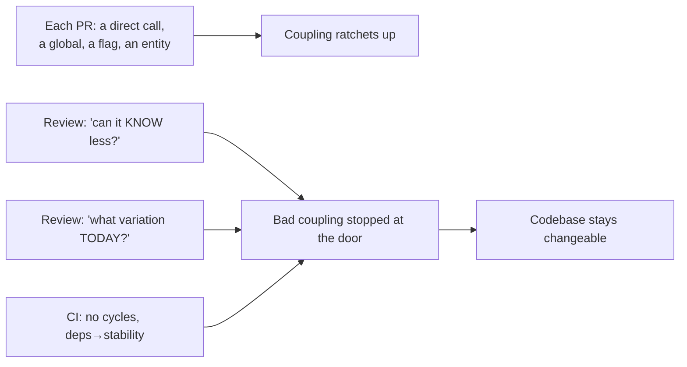
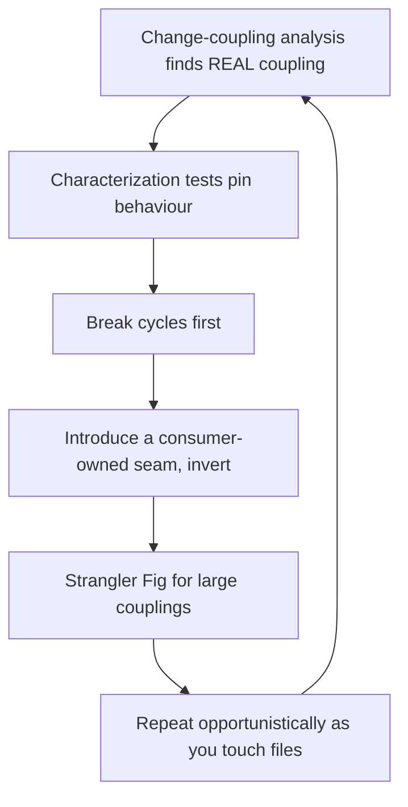

# Minimise Coupling — Professional

> **Category:** [Design Principles → Coupling & Cohesion](../../README.md) — coupling is how much one module depends on another; minimising it reduces how far a change in A ripples into B.

> **Prerequisites:** [Junior](junior.md) · [Middle](middle.md) · [Senior](senior.md)
> **Focus:** **Production** — reviews, metrics, team conventions, legacy systems

---

## Introduction

> Focus: **production** — keeping coupling appropriate across a large, multi-contributor codebase over years.

Coupling is the property that decides whether a codebase stays *changeable*. It is also the property that degrades *silently*: no single PR introduces "too much coupling," yet every reasonable-looking change — a direct call here, a shared global there, an entity passed where a field would do — ratchets it upward. A year later, a one-line feature requires touching nine files and nobody can deploy anything alone.

At the professional level the question is operational: **how do you keep coupling appropriate when hundreds of changes land per week from dozens of people?** And — the half most teams miss — how do you stop the over-correction, where "decouple everything" produces an interface-per-class, event-spaghetti system that's *also* unmaintainable? The answer is a system: review standards that name both failures, metrics that track coupling *and direction*, conventions that make the right level of coupling the default, and a disciplined way to decouple legacy code without breaking it.

---

## Enforcing Low Coupling in Code Review

Most coupling enters one PR at a time, in forms that look locally harmless. A reviewer's job is to name the coupling *kind* and ask whether it can be pushed lower — without demanding speculative indirection.

### The high-value review questions

> **"What does this module need to *know* about that one — and can it know less?"**
> **"If we changed [the database / the SDK / this entity's shape], how many files would this PR force us to touch later?"**

### Coupling smells to flag

| Smell in the diff | Coupling kind | Review ask |
|---|---|---|
| New `import` of a concrete infra class into domain code | Wrong-direction / Zone of Pain | "Depend on a domain port; let infra implement it." |
| A new global / singleton / `static` mutable | Common coupling | "Pass it in. What happens when two callers mutate this?" |
| A new `boolean`/enum flag that switches behaviour inside | Control coupling | "Split into two methods, or inject the behaviour." |
| A whole entity passed to a function using one field | Stamp coupling | "Pass the field; don't couple to the whole shape." |
| `a.getB().getC().doThing()` | Demeter / chain coupling | "Ask the nearest object; add a delegating method." |
| Two services now sharing a DB table / a types library | Cross-service coupling | "This couples deploys. Is the boundary real?" |
| `_privateField` accessed from another class | Content coupling | "Go through a public method." |

### Review comment templates

> "`OrderService` now imports `StripeClient` directly. That's a volatile vendor dependency in our domain — let's depend on a `PaymentGateway` port we own and inject Stripe at the edge, so swapping or faking it doesn't ripple."

> "`process(data, isAdmin)` switches on the flag internally — that's control coupling. Two named methods (`processForAdmin` / `processForUser`) would let each caller pick, and each method reads straight through."

> "This passes the whole `User` to `canCheckout(user)` but only reads `user.balance`. Pass the balance — otherwise every change to `User`'s shape risks this function."

> "These two services now both read the `orders` table. That couples their schemas and deploys. Can one own the data and expose it, so the boundary is real?"

---

## Catching Over-Decoupling Too

The senior/professional differentiator: **review pushes back on needless indirection as hard as on coupling.** Over-decoupling is the failure mode that *passes* most reviews because it looks disciplined. It isn't.

| Over-decoupling smell | Review ask |
|---|---|
| New interface with exactly one implementation, no test fake needed | "What's the second implementation? If hypothetical, use the concrete type." |
| A direct call replaced by an event for two things that still change together | "These share the event's shape — they're still coupled. Is the event buying real independence, or just hiding the dependency?" |
| A new microservice split through a tightly-coupled cluster | "Can these deploy independently? If not, this is a distributed-monolith seam." |
| A mapper/DTO layer between two modules that share an owner and change rate | "This indirection isn't earning its keep; the boundary isn't real." |
| Generic `Manager`/`Handler`/`Dispatcher` abstraction over one concrete flow | "The generality has one case — inline it." |

> The single best anti-over-decoupling question: **"What real variation does this seam enable *today*?"** "Flexibility" / "future-proofing" / "best practice" is a red flag, not an answer. A seam with no present second side is the [wrong abstraction](../../04-solid/05-dip-dependency-inversion/senior.md) — load-bearing indirection that obscures the flow and resists removal.

---

## Measuring Coupling in Production

You cannot manage coupling you can't see. Choose metrics that track it honestly — and that catch *both* over- and under-coupling.

| Metric | Tracks | Notes |
|---|---|---|
| **Afferent/efferent (Ca/Ce)** | Static coupling degree & direction | `jdepend`, `NDepend`, `import-linter` (Py), `madge` (JS) |
| **Instability `I = Ce/(Ca+Ce)`** | Whether deps point toward stability | Flag stable modules depending on unstable ones |
| **Distance from main sequence `D`** | Over/under-abstraction at component scale | High `D` = Zone of Pain or Uselessness |
| **Change-coupling (logical/temporal)** | Files that *actually* change together in git history | **The ground-truth metric** — surfaces real coupling static tools miss |
| **Fan-in / fan-out per module** | Hotspots everyone depends on | High fan-in + high churn = danger |
| **Cyclic dependencies** | Bidirectional coupling | Cycles are the worst structural coupling; gate against new ones |
| **Per-request service hop count** | Distributed-monolith signal | Rising synchronous fan-out = network-ified coupling |

### The honest-measurement rules

- **Change-coupling (from git history) beats static analysis** for finding *real* coupling. If two files change together in 80% of commits, they're coupled — regardless of whether a static tool sees an import. Tools: `code-maat`, `git-of-theseus`, CodeScene. This catches *essential* coupling that decoupling tactics merely hid.
- **Gate cyclic dependencies in CI.** A new cycle between packages is the one coupling regression worth blocking the build over — cycles make modules undeployable and untestable independently.
- **Watch instability *direction*, not just magnitude.** The defect is a stable module depending on a volatile one (Zone of Pain), which raw Ce won't show. Pair `I` with abstractness.
- **The real metric is the outcome:** lead time for changes and change-failure rate (DORA). Rising coupling shows up as features taking longer and breaking more. If those degrade, coupling got worse no matter what static numbers say.

> Don't report "we reduced coupling" by pointing at one decoupled class. Point at change-coupling dropping, a cycle removed, or a stable module no longer importing a volatile one — the measures that reflect *changeability*.

---

## Team Conventions

Codify these so the appropriate level of coupling is the default, not a per-PR debate:

1. **Dependencies point inward / toward stability.** Domain depends on nothing volatile; infra depends on domain. Enforce with an architecture-fitness test (`import-linter`, ArchUnit) in CI.
2. **No new package cycles.** A CI gate fails the build on a new cyclic dependency.
3. **Concrete first; interface on the second implementation** (test fakes are the documented exception). No one-implementation interfaces in new code "to decouple."
4. **No shared mutable globals/singletons** for business state. Config is read-only and injected.
5. **No boolean flags that switch behaviour** — split the method.
6. **No cross-service database sharing.** Each service owns its data; others access it through an API, not the table.
7. **Events buy independence, not tidiness.** Use an event only when producer and consumer genuinely evolve independently; otherwise call directly.
8. **One-way doors get a design note.** New service boundaries, public contracts, and shared schemas are reviewed deliberately — everything internal is allowed to stay direct and emerge a seam later.

These encode the senior reasoning so reviewers cite a policy, not a personal taste, and juniors get it right by default.

---

## Decoupling Legacy Systems Safely

Greenfield low coupling is easy. The professional reality is **reducing coupling in a system that's already a tangle, under-tested, and in production.** Incremental, test-guarded, opportunistic — never a rewrite.

### The sequence

1. **Find the real coupling with change-coupling analysis.** Run `code-maat`/CodeScene over git history to see which files actually change together. This points you at the *essential* coupling worth attacking — not whatever the import graph happens to show.
2. **Pin behaviour with characterization tests** around the seam you're about to cut. You can't safely move a dependency you can't test.
3. **Introduce a seam, then invert.** Extract an interface the consumer owns; make the concrete dependency implement it; inject it. Smallest scope first (one volatile boundary), in small commits.
4. **Break cycles before anything else.** A cyclic dependency makes everything else harder; break it (move the shared thing to a third module, or invert one edge) early.
5. **Use the Strangler Fig for large couplings.** Build the decoupled replacement behind the existing interface and migrate callers incrementally — never big-bang.

### Sprout, wrap, and the seam toolkit

For untestable coupled code, use Michael Feathers' techniques (*Working Effectively with Legacy Code*): **Sprout Method/Class** (new behaviour in a new, testable unit the legacy code calls), **Wrap Method** (decorate without modifying), and **dependency-breaking seams** (parameterize a hidden dependency, extract-and-override). These let you introduce a seam *without first having tests*, then test through the seam.

### What *not* to do in legacy code

- **Don't decouple without characterization tests** — cutting a dependency can silently change ordering/behaviour (temporal coupling bites here).
- **Don't network-ify to "decouple."** Splitting a coupled cluster into services without genuine independence produces a distributed monolith — strictly worse.
- **Don't replace coupling with over-decoupling.** Swapping a god-class for fifteen one-method interfaces and an event bus isn't progress; it's a different unmaintainable shape.
- **Don't boil the ocean.** A standalone "decoupling initiative" with no feature value dies at the first deadline. Decouple the seams you touch for feature work (Boy Scout Rule).

---

## Real Incidents

### Incident 1: The shared global that caused a payments outage

A `static` mutable `Config` map (common coupling) held the active currency rate, written by a refresh job and read across billing. A deploy reordered startup so billing read the map *before* the refresh job populated it (a temporal coupling lurking behind the global). Result: thousands of charges at a zero rate before alarms fired. **Fix:** removed the global; the rate is now an injected, immutable value passed explicitly to billing, loaded once at the composition root. **Lesson:** a shared mutable global is common coupling *and* a temporal-coupling trap — the dependency was invisible in every signature.

### Incident 2: The "decoupling" that became a distributed monolith

A team split a monolith into eight services "to reduce coupling." But the services shared one database, called each other synchronously (a single request fanned out to six hops), and shipped a common `types` library every service had to upgrade in lockstep. A change to one entity required a coordinated deploy of five services. Latency tripled; a single service's outage took down checkout. **Fix:** re-merged three services that were essentially one cohesive concept, gave each remaining service its own data, and moved cross-service calls to async events on real boundaries. **Lesson:** boundaries drawn through *essential* coupling don't decouple — they network-ify it. Decompose on cohesion, not on a wish.

### Incident 3: The interface-per-class codebase nobody could navigate

A codebase mandated "program to an interface" for *every* class. Every service had a one-implementation `IFooService` whose method set was identical to `FooService`. Reading any flow meant jumping interface → impl → interface endlessly; adding a method meant editing two files in lockstep (more coupling between them, not less); and the "testability" the interfaces promised was unused — the impls were pure logic that needed no mocking. **Fix:** deleted the one-implementation interfaces, kept seams only at real boundaries (DB, payment SDK). Navigation halved; the diff was net-negative thousands of lines. **Lesson:** indirection is not decoupling. A one-implementation interface adds a hop and removes no dependency — and the team had institutionalized the [wrong abstraction](../../04-solid/05-dip-dependency-inversion/senior.md).

### Incident 4: The "harmless" reorder that broke a hidden temporal coupling

An engineer reordered two calls in a setup routine to "clean it up," not knowing the first registered a handler the second relied on (temporal coupling, undocumented). A whole class of webhooks silently stopped processing for hours. **Fix:** made the dependency explicit — the second call now *takes* the registration result as a parameter, so it can't run first. **Lesson:** temporal coupling is invisible coupling; the cure is to make the ordering structurally impossible to get wrong, not to add a comment.

---

## Review Checklist

```text
COUPLING REVIEW CHECKLIST
UNDER-COUPLING (too tangled)
[ ] No new concrete infra import in domain code (depend on an owned port)
[ ] No new shared mutable global / singleton for business state
[ ] No boolean/enum flag switching behaviour inside (split the method)
[ ] No whole-entity passed where a field would do (stamp → data)
[ ] No a.b().c().d() chains (Law of Demeter)
[ ] No private-field access across classes (go through a method)
[ ] No new cross-service DB sharing or lockstep-upgraded shared types
[ ] No new package CYCLE
[ ] Dependencies point toward stability (unstable → stable, not reverse)

OVER-DECOUPLING (needless indirection)
[ ] Every new interface has a real 2nd impl OR a real test-fake need
[ ] Every new event buys real producer/consumer INDEPENDENCE (not just hides a call)
[ ] Every new service boundary is independently deployable (no distributed monolith)
[ ] No mapper/layer between modules with the same owner and change rate

GENERAL
[ ] "What does this need to KNOW about that — can it know less?"
[ ] "What real variation does this seam enable TODAY?" (not future-proofing)
[ ] Behaviour-changing decoupling is covered by characterization tests
```

---

## Cheat Sheet

```text
ENFORCE   ask: "what must A KNOW about B — can it know less?"
          and: "what real variation does this seam enable TODAY?"

PUSH DOWN content→method · global→param · flag→split · whole-obj→field · chain→ask

DIRECTION dependencies point toward stability (unstable → stable).
          stable + concrete = ZONE OF PAIN → depend on an abstraction (DIP).

DON'T     one-impl interface ("indirection ≠ decoupling")
          event for must-change-together things ("fake decoupling")
          service split through essential coupling ("distributed monolith")

MEASURE   change-coupling (git history) · Ca/Ce + I + direction ·
          cyclic deps (gate in CI) · DORA lead time & change-failure rate
          NOT "one class decoupled"

LEGACY    change-coupling to find it → characterization tests → seam + invert →
          break cycles first → Strangler Fig → opportunistic, small, never big-bang.

GOAL      APPROPRIATE coupling — minimal & toward-stability, NOT zero,
          NOT max-indirection. low coupling + high cohesion.
```

---

## Diagrams

### Where coupling enters, and where it's controlled



### Safe legacy decoupling



---

## Related Topics

- **The other half:** [Maximise Cohesion](../02-maximise-cohesion/junior.md)
- **The precise theory:** [Connascence](../03-connascence/junior.md)
- **Core tactics:** [Law of Demeter](../04-law-of-demeter/junior.md), [Inversion of Control](../08-inversion-of-control/junior.md), [Dependency Inversion](../../04-solid/05-dip-dependency-inversion/junior.md)
- **Tooling:** `code-maat`/CodeScene (change-coupling), `jdepend`/`NDepend`/`import-linter`/`madge` (static), ArchUnit/`import-linter` (fitness functions).

---


---

## Check your understanding

1. Explain Minimise Coupling — Professional Level in your own words and name the problem it solves.
2. How would you apply the ideas around Table of Contents, Introduction, Enforcing Low Coupling in Code Review in a realistic engineering change?
3. What failure mode or misuse should you look for, and what evidence would reveal it?
4. How would you introduce and govern Minimise Coupling — Professional Level across teams through reversible, measurable increments?
5. What observable result would convince you that the approach improved the system?
