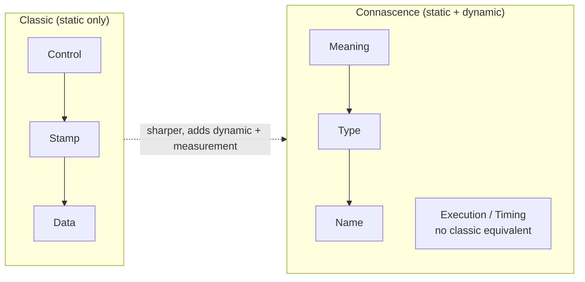
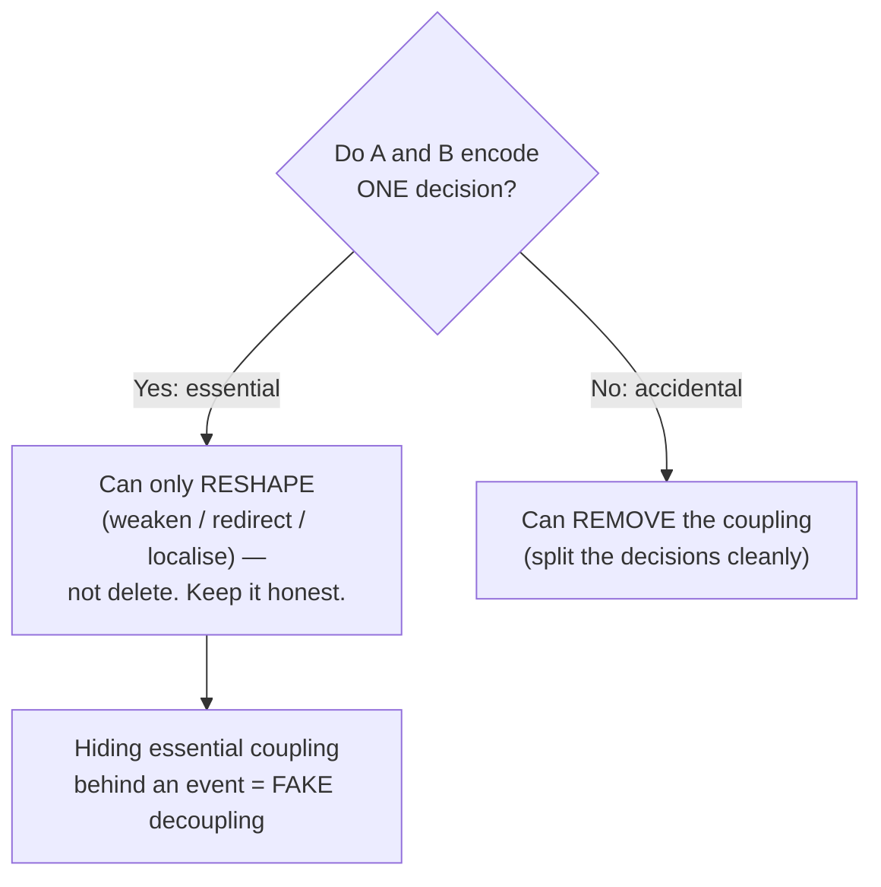

# Minimise Coupling — Senior

> **Category:** [Design Principles → Coupling & Cohesion](../../README.md) — coupling is how much one module depends on another; minimising it reduces how far a change in A ripples into B.

> **Prerequisites:** [Junior](junior.md) · [Middle](middle.md)
> **Focus:** **Design trade-offs** and **system-level reasoning**

---

## Table of Contents

1. [Introduction](#introduction)
2. [Coupling Is Multi-Dimensional, Not a Scalar](#coupling-is-multi-dimensional-not-a-scalar)
3. [The Taxonomy Reframed Through Connascence](#the-taxonomy-reframed-through-connascence)
4. [Afferent/Efferent Coupling and the Main Sequence](#afferentefferent-coupling-and-the-main-sequence)
5. [Coupling Is Conserved: You Move It, You Don't Delete It](#coupling-is-conserved-you-move-it-you-dont-delete-it)
6. [The Distributed Monolith: Coupling on the Network](#the-distributed-monolith-coupling-on-the-network)
7. [When Decoupling Is the Wrong Move](#when-decoupling-is-the-wrong-move)
8. [Advanced Examples](#advanced-examples)
9. [Liabilities](#liabilities)
10. [Pros & Cons at the System Level](#pros--cons-at-the-system-level)
11. [Diagrams](#diagrams)
12. [Related Topics](#related-topics)

---

## Introduction

> Focus: **design trade-offs** and **system-level reasoning**

At the senior level, "minimise coupling" stops being a tidiness rule and becomes a **stance on where the change-boundaries of a system fall** — which decisions can move independently and which are chained together. Applied without judgement, "decouple it" degrades into interface-per-class noise, event spaghetti you can't trace, and microservice boundaries that turn in-process method calls into fragile network contracts. A senior must know exactly when *more* coupling is the right answer, and must reason about coupling as a *conserved* quantity that decoupling relocates rather than destroys.

This file covers the hard questions:

1. **Why is coupling not a single number you can "minimise"?** (It has strength, direction, and locality — independent axes.)
2. **What is the precise theory under the 1974 taxonomy?** ([Connascence](../03-connascence/junior.md) — strictly sharper.)
3. **Where does decoupling *move* the coupling, and when does that move make things worse?** (Distributed monolith; conservation of coupling.)

---

## Coupling Is Multi-Dimensional, Not a Scalar

The phrase "minimise coupling" implies a single dial. It isn't one. Coupling has at least three independent axes, and a good design optimises them separately:

| Axis | Question | Better direction |
|---|---|---|
| **Strength (kind)** | How much must A know about B? | Weaker (data over content; name over meaning) |
| **Direction** | Which way does the dependency point? | Toward stability (unstable → stable) |
| **Locality / degree** | How far apart, how many elements entangled? | More local, fewer entangled |

A dependency can be *weak but global* (a name everyone shares — usually fine) or *strong but local* (two methods in one class sharing a private field — also fine). The danger zone is **strong + distant + bidirectional**: two far-apart modules that each reach into the other's details. Reducing "coupling" means improving *whichever axis is bad* — not blindly cutting dependencies.

> The senior reframing: don't "minimise coupling." **Weaken it, point it toward stability, and localise it.** Those are three different refactorings, and confusing them is why teams "decouple" their way into worse designs.

This is exactly the lens [Connascence](../03-connascence/junior.md) formalises: strength (the *kind*), locality, and degree are connascence's three improvement axes.

---

## The Taxonomy Reframed Through Connascence

The 1974 Stevens/Myers/Constantine taxonomy (content → common → external → control → stamp → data) is a *structured-programming-era* tool: it ranks *static* couplings between procedures. **Connascence** (Meilir Page-Jones) is its successor — sharper, covers dynamic coupling, and gives you a *measurement* (strength × locality × degree) rather than a flat list.

The mapping is direct and worth internalising:

| Classic coupling | Connascence equivalent | Why connascence is sharper |
|---|---|---|
| Data coupling | Connascence of **Name** / **Type** | Distinguishes "agree on a name" from "agree on a type" |
| Stamp coupling | Connascence of **Type** (on the whole shape) | Pinpoints it's the *structure* that's shared |
| Control coupling | Connascence of **Meaning** (flag values) / **Algorithm** | Names *why* the flag is bad: shared meaning of magic values |
| Common coupling | Connascence of **Identity** (shared mutable global) | Captures the worst case — sharing one instance |
| Content coupling | Connascence of **Value** / **Position** on internals | Reaching into internals = agreeing on private layout |
| Temporal coupling | Connascence of **Execution** / **Timing** (dynamic) | The classic list has *no* term for ordering — connascence does |

> Connascence's three rules — make coupling **weaker** (name beats meaning), more **local** (within a function beats across modules), and lower in **degree** (fewer elements entangled) — subsume "push it down the ladder" *and* the direction/locality axes the old taxonomy can't express. Use the taxonomy as a quick name; use connascence to reason precisely. Full treatment at [Connascence](../03-connascence/junior.md).

The practical payoff: connascence tells you *which* refactoring. Connascence of meaning (a magic `0`/`1` shared across modules) → name the constant (weaken to connascence of name). Connascence of execution (`init()` before `use()`) → fuse or enforce ordering structurally. The old taxonomy says "control coupling is bad"; connascence says "it's shared *meaning of a value*, so name the value."

---

## Afferent/Efferent Coupling and the Main Sequence

At component scale, coupling becomes geometric. With **Ca** (afferent, incoming) and **Ce** (efferent, outgoing), and instability `I = Ce/(Ca+Ce)`, Robert C. Martin adds the second axis — **abstractness** `A = (abstract types) / (total types)` — to locate every component on a plane.

```text
A (abstractness)
 1 ┤●  Zone of Uselessness            ╱  THE MAIN SEQUENCE: A + I = 1
   │  (abstract, nobody uses it)    ╱     the ideal line.
   │                              ╱
   │                            ╱
   │            (good)        ╱
   │                       ╱
   │                     ╱
 0 ┤                   ╱  ●  Zone of Pain
   └──────────────────────────────  I (instability)
   0                              1
   Zone of Pain:  concrete AND stable → many depend on rigid details (rigid, hard to change)
   Zone of Uselessness: abstract AND unstable → abstraction nobody depends on
```

The senior reasoning this enables:

- **Zone of Pain (low `I`, low `A`):** a *concrete* component everyone depends on. Many depend on it (stable), but it's full of details that *want* to change — so every change ripples through all dependents. A database schema everything imports directly lives here. **This is the most dangerous coupling at scale.** The cure is DIP: replace the concrete stable dependency with a stable *abstraction*.
- **Zone of Uselessness (high `I`, high `A`):** abstractions nobody depends on — speculative interfaces, dead generality. The over-decoupling failure, measured.
- **The Main Sequence (`A + I ≈ 1`):** stable components are abstract; unstable components are concrete. *Distance from the main sequence* (`D = |A + I − 1|`) is a real, computable health metric a senior can put on a dashboard.

This is why "depend on abstractions" (DIP) and "minimise coupling" are the *same principle at different scales*: DIP is the move that keeps stable components abstract, which keeps them off the Zone of Pain. (Full component theory: Component Coupling if present; otherwise [DIP — Senior](../../04-solid/05-dip-dependency-inversion/senior.md).)

---

## Coupling Is Conserved: You Move It, You Don't Delete It

The deepest senior insight about coupling: **it is largely conserved.** If two things genuinely must change together — they encode one decision — no design pattern *removes* that fact. It only relocates *where* the coupling lives and *what form* it takes.

- Replace a direct call with an **event**: the coupling to *behaviour* becomes coupling to the *event's shape* — and you've added coupling to *timing* (eventual consistency) and lost compile-time checking. The handler still breaks if the event changes.
- Extract an **interface**: the coupling to a concrete class becomes coupling to the *contract*. If the contract is as wide as the class (a "header interface"), you've moved the coupling and gained nothing.
- Split into **microservices**: in-process type coupling becomes *network contract* coupling — now with serialization, versioning, and partial-failure on top.

> Essential vs. accidental coupling: if A and B encode **one decision**, their coupling is *essential* — you can reshape it (weaken, redirect, localise) but not remove it; pretending otherwise just hides it. If they encode **two decisions** that merely touch, the coupling is *accidental* — and *that* you can actually remove.

The senior skill is distinguishing the two. Decoupling tactics applied to *essential* coupling produce **fake decoupling**: the modules still change together, but now the dependency is implicit, untyped, and spread across a wire. That is strictly worse than honest, visible, direct coupling. You decouple to *remove accidental* coupling and to *reshape essential* coupling onto a better axis (toward stability, more local) — never under the illusion that essential coupling can be deleted.

---

## The Distributed Monolith: Coupling on the Network

The canonical large-scale failure of misunderstanding coupling. A team splits a monolith into services "to decouple," but:

- Services call each other **synchronously** in tight chains (`A → B → C → D` per request).
- They **share a database** (so a schema change still ripples across services).
- They **deploy together** because a change in one needs a coordinated change in others.
- They share **types/DTOs** via a common library that every service must upgrade in lockstep.

This is a **distributed monolith**: it has all the coupling of a monolith *plus* network latency, partial failure, serialization, distributed tracing, and versioning. The coupling didn't decrease — it **moved from method calls to the network**, where it is slower, less reliable, and harder to see.

```text
Monolith                          Distributed monolith
  A.call(B) — in-process            A ──HTTP──► B ──HTTP──► C
  fast, typed, atomic                slow, untyped-at-runtime, partial failure,
  coupling VISIBLE in the call       coupling HIDDEN across the network
```

> Microservice boundaries reduce coupling **only if they fall on lines of genuine independence** — where the two sides have different change rates, owners, and data. Drawing a service boundary *through* an essentially-coupled cluster doesn't decouple it; it network-ifies the coupling. Service decomposition is a *cohesion* decision first (group what changes together) and a coupling decision second.

The tell of a distributed monolith: you cannot deploy any service independently, a single user request fans out to many synchronous hops, and "decoupled" services share a database. The fix is the same as in-process: find the *essential* coupling, keep those things together (one service), and only split on real independence — communicating asynchronously across the split so the boundary is genuinely loose.

---

## When Decoupling Is the Wrong Move

Senior judgement includes knowing when *more* coupling, or staying coupled, is correct:

- **Stable shared abstractions.** Everything depending on `Money`, `UserId`, or your standard library is healthy coupling toward a stable thing. "Decoupling" it (each module its own `Money`) creates drift and conversion bugs. Coupling to *stable* is fine; only volatile coupling needs cutting.
- **Essential coupling made explicit.** Two things that must change together are *better* coupled directly and visibly (one cohesive module, a typed call) than "decoupled" into an event whose contract they secretly share. Honest coupling beats fake decoupling.
- **Premature seams.** An interface/event/service added before a real second side exists is the [wrong abstraction](../../04-solid/05-dip-dependency-inversion/senior.md): load-bearing indirection that obscures and resists removal. Prefer a concrete dependency until the second side or a real boundary appears.
- **Hot paths.** A decoupling layer (event bus, mapper, extra hop) on a latency-critical path can be a measurable cost. Sometimes a direct, coupled call is the right engineering choice; profile, don't dogmatise.

> The principle is *minimise* coupling, but the optimum is **appropriate** coupling: the least that still lets the modules cooperate, on the *right axis* (toward stability, local, weak). Zero coupling is useless modules; minimal-at-all-costs coupling is event spaghetti. Seniors target the minimum that preserves cohesion and clarity.

---

## Advanced Examples

### Reshaping essential coupling onto the stability axis (Java)

```java
// BEFORE — Zone of Pain: stable AND concrete. Everyone imports the JPA entity,
// so a persistence change ripples through all of business logic.
package com.app.domain;
import com.app.infra.JpaOrder;          // domain → infra (wrong direction)
class PlaceOrder {
    void run(JpaOrder o) { /* business logic bound to a JPA class */ }
}

// AFTER — the essential coupling (business needs orders) is REDIRECTED:
// business depends on an abstraction IT owns; infra depends inward.
package com.app.domain;
interface Orders { Optional<Order> byId(OrderId id); }   // stable abstraction, owned here
class PlaceOrder { PlaceOrder(Orders orders) { /* ... */ } }
// package com.app.infra → implements Orders, returns a domain Order.
// Coupling to "we need orders" remains (essential); coupling to JPA is GONE (accidental).
```

The coupling to *persistence as a concept* is essential and stays; the coupling to *JPA specifically* was accidental and is removed by pointing the dependency at an owned abstraction. That's "redirect toward stability," not "delete coupling."

### Fake decoupling via events (TypeScript) — recognising it

```typescript
// Looks decoupled — Order doesn't call Inventory. But Inventory's handler
// depends on the EXACT shape of OrderPlaced. They still change together:
// add a field to the order and the handler must change. The coupling moved
// from a typed call to an UNTYPED event contract — and lost compile-time safety.
bus.publish(new OrderPlaced({ id, items }));      // producer
bus.on(OrderPlaced, (e) => reserve(e.items));     // consumer — coupled to e.items

// This is the RIGHT trade only if Order and Inventory must evolve INDEPENDENTLY
// (different teams, async, tolerant reader). Otherwise a direct call is HONESTER.
```

### Designing out temporal coupling at scale (Go)

```go
// BEFORE — temporal coupling: caller must Open before Use, Close after. Invisible.
c := NewClient(); c.Open(); defer c.Close(); c.Use()

// AFTER — the lifecycle is owned by the API; misuse is unrepresentable.
func WithClient(ctx context.Context, f func(c *Client) error) error {
    c, err := dial(ctx); if err != nil { return err }
    defer c.close()
    return f(c)          // caller gets an already-valid client; can't skip Open/Close
}
```

---

## Liabilities

### Liability 1: Over-decoupling (indirection without payoff)

Interface-per-class, an event for every call, a mapper at every layer. Navigation doubles, "where does this happen?" becomes unanswerable, and none of the flexibility is ever used. Cure: decouple across *volatility and real boundaries* only; measure distance-from-main-sequence to catch the Zone of Uselessness.

### Liability 2: Fake decoupling of essential coupling

Hiding a must-change-together relationship behind an event/interface so it *looks* decoupled while remaining coupled — now implicitly and untyped. Cure: classify essential vs. accidental before decoupling; keep essential coupling honest and visible.

### Liability 3: Distributed monolith

Service boundaries drawn through essentially-coupled clusters; synchronous chains, shared DB, lockstep deploys. Cure: decompose on *cohesion* (genuine independence), communicate asynchronously across real boundaries, never share a database.

### Liability 4: Coupling to volatile concretions at scale (Zone of Pain)

A concrete, stable component (schema, vendor SDK type) that everyone imports — every change ripples everywhere. Cure: DIP — depend on a stable abstraction instead; keep stable components abstract.

### Liability 5: "Decoupling" that scatters cohesion

Splitting a cohesive concept to lower coupling, forcing the fragments to call each other in order. Cure: group what changes together first; cohesion *is* coupling reduction.

---

## Pros & Cons at the System Level

| Dimension | Minimal/appropriate coupling | Over-coupled (everything direct) | Over-decoupled (max indirection) |
|---|---|---|---|
| Change ripple | Low — contained | High — shotgun surgery | Low, but flow is untraceable |
| Testability in isolation | High | Low | High (often via false seams) |
| Traceability / debuggability | High | High (it's all visible) | **Low** — "who handles this?" |
| Independent deploy/compile | Yes at real boundaries | No | Yes, but unused |
| Cost of a wrong seam | n/a | n/a | High — remove + rebuild |
| Performance | Good | Good (no hops) | Hop/serialization overhead |
| Best when | Volatile boundary, real 2nd side | Tiny, stable, internal dep | **Rarely** — it's a failure mode |

The senior stance the table encodes: coupling should be **minimised where it's accidental and volatile, preserved where it's essential and stable, and never network-ified without genuine independence.** Over-coupling and over-decoupling are *symmetric* failures; appropriate coupling sits between them, optimised on the right axis (weak, toward stability, local).

---

## Diagrams

### Connascence subsumes the classic taxonomy



### Conservation of coupling



---

## Related Topics

- **The other half:** [Maximise Cohesion](../02-maximise-cohesion/junior.md)
- **The precise theory:** [Connascence](../03-connascence/junior.md)
- **A core tactic:** [Law of Demeter](../04-law-of-demeter/junior.md), [Inversion of Control](../08-inversion-of-control/junior.md)
- **The structural move:** [Dependency Inversion](../../04-solid/05-dip-dependency-inversion/senior.md)

---


---

## Check your understanding

1. Explain Minimise Coupling — Senior Level in your own words and name the problem it solves.
2. How would you apply the ideas around Table of Contents, Introduction, Coupling Is Multi-Dimensional, Not a Scalar in a realistic engineering change?
3. What failure mode or misuse should you look for, and what evidence would reveal it?
4. How would you validate a system-level decision about Minimise Coupling — Senior Level under uncertainty?
5. What observable result would convince you that the approach improved the system?
