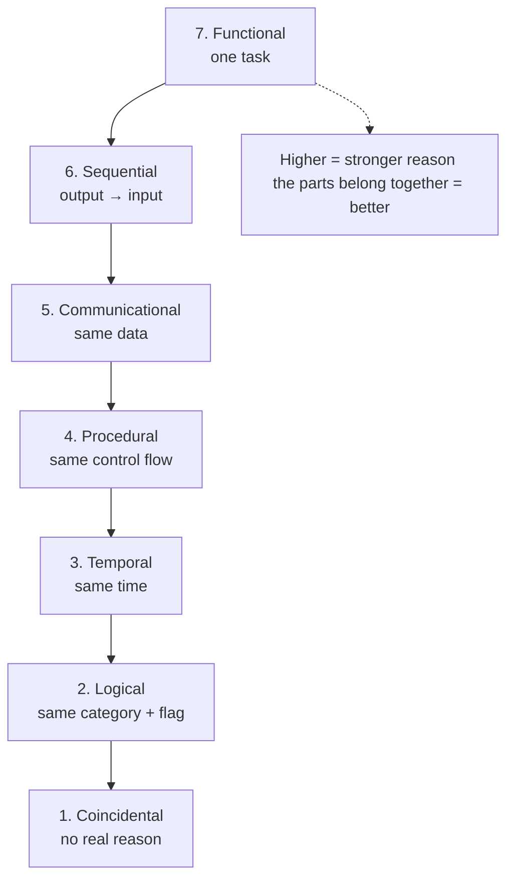
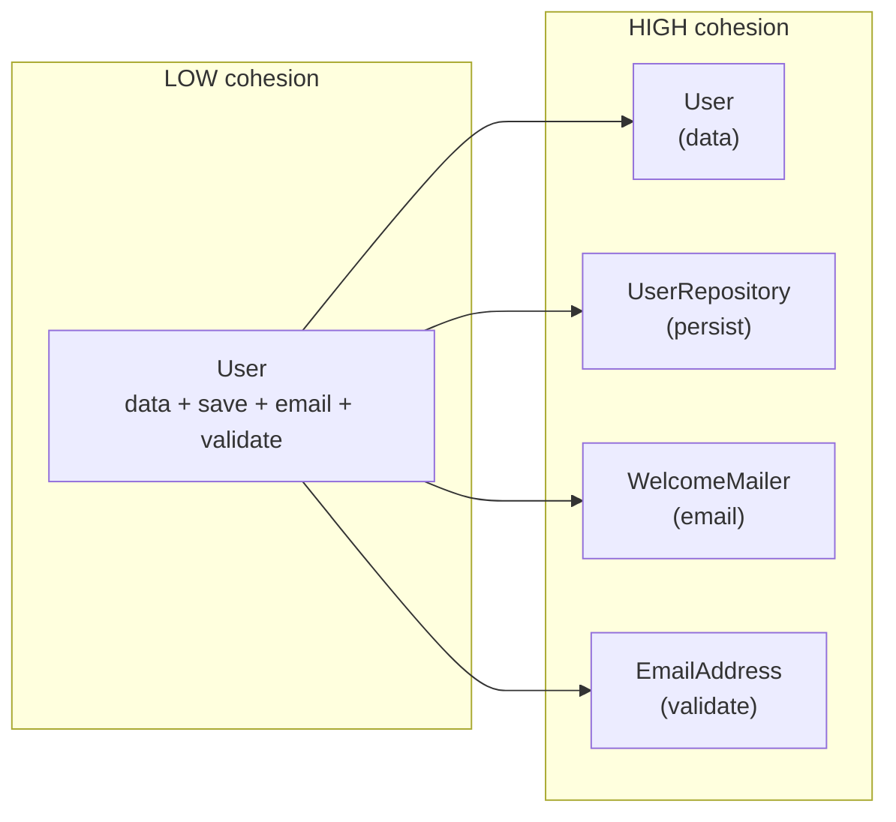

# Maximise Cohesion — Junior

> **Category:** [Design Principles → Coupling & Cohesion](../../README.md) — group things that change together; separate things that don't. A module should do one well-defined job, and every part of it should serve that job.

---

## Introduction

> Focus: **What is it?** and **How to use it?**

**Cohesion** measures how strongly the parts inside a single module belong together. A module — a class, a function, a package, a file — has **high cohesion** when everything in it works toward *one* well-defined job, and **low cohesion** when it's a grab-bag of unrelated things that happen to live in the same place.

> **Cohesion** is the degree to which the elements of a module belong together. **High cohesion** = the module does one thing, and all its parts serve that one thing. **Low cohesion** = the module bundles several unrelated things.

"Maximise cohesion" is the instruction to keep modules focused: each one should have a clear, single purpose, and its data and methods should all relate to that purpose. When you read a high-cohesion class, you can describe what it does in one sentence with no "and." When you read a low-cohesion one, the sentence sprouts "and it also..." clauses — a sign it should be split.

### Why this matters

Cohesion is one of the two oldest, most durable ideas in software design (the other is its partner, **[coupling](../01-minimise-coupling/)**). They were named together in the 1970s and they have never stopped mattering, because they predict the property engineers care about most: **how cheap is this code to change?**

- A **high-cohesion** module is easy to understand (one job), easy to test (focused inputs and outputs), easy to reuse (it does exactly one useful thing), and easy to change (a change to its job touches one place).
- A **low-cohesion** module is hard to name, hard to test (you mock half the world to exercise one method), and dangerous to change (its unrelated parts share state, so editing one breaks another).

The goal of this whole topic is **high coupling *within* a module and low coupling *between* modules** — that is exactly what "high cohesion, low coupling" means.

---

## Prerequisites

- **Required:** Comfort with functions, classes, fields/methods, and modules/packages.
- **Required:** A sense of what a "responsibility" is — what a piece of code is *for*.
- **Helpful:** The sibling principle **[Minimise Coupling](../01-minimise-coupling/)** — cohesion and coupling are two sides of one coin.
- **Helpful:** Exposure to the **[Single Responsibility Principle](../../04-solid/01-srp-single-responsibility/)**, which is cohesion stated in change-terms.

---

## Glossary

| Term | Definition |
|------|-----------|
| **Cohesion** | How strongly the elements inside one module belong together. |
| **High cohesion** | A module does one well-defined job; every part serves it. |
| **Low cohesion** | A module bundles several unrelated jobs or fragments. |
| **Module** | Any unit with a boundary — a function, class, file, or package. |
| **Coupling** | How much one module depends on another (the partner concept). |
| **Cohesion spectrum** | The seven-level ranking (coincidental → functional) of *why* a module's parts are grouped. |
| **Functional cohesion** | The best kind — all parts contribute to one single task. |
| **Coincidental cohesion** | The worst kind — parts are grouped for no real reason. |
| **God class** | A huge class doing many unrelated jobs — extreme low cohesion. |
| **LCOM** | "Lack of Cohesion of Methods" — a metric; high LCOM flags a split candidate. |

---

## What Cohesion Means

Imagine two classes, each with the same number of methods.

```java
// HIGH cohesion — every method is about one thing: a temperature reading.
class Temperature {
    private final double celsius;
    Temperature(double celsius)   { this.celsius = celsius; }
    double inCelsius()            { return celsius; }
    double inFahrenheit()         { return celsius * 9 / 5 + 32; }
    double inKelvin()             { return celsius + 273.15; }
    boolean isFreezing()          { return celsius <= 0; }
}
```

```java
// LOW cohesion — these methods have nothing to do with each other.
class Stuff {
    double celsiusToFahrenheit(double c) { return c * 9 / 5 + 32; }
    String formatDate(LocalDate d)       { return d.toString(); }
    int gcd(int a, int b)                { return b == 0 ? a : gcd(b, a % b); }
    void sendEmail(String to, String m)  { /* ... */ }
}
```

`Temperature` is **cohesive**: every method reads or derives from the *same field*, `celsius`, and serves one purpose — representing a temperature. You can describe it in one sentence: *"a temperature you can convert and query."*

`Stuff` is **incohesive**: a unit conversion, a date formatter, a number-theory function, and an email sender share a class only because someone needed a place to put them. There is no field they share, no purpose they serve together. Its one-sentence description is impossible: *"a class that converts temperatures **and** formats dates **and** computes GCDs **and** sends email."* Every "and" is a smell.

The simplest cohesion test:

> **Can you describe what this module does in a single sentence with no "and"?** If you need "and," cohesion is probably too low — consider splitting.

---

## Cohesion Is the Complement of Coupling

Cohesion and **[coupling](../01-minimise-coupling/)** are partners; you almost never discuss one without the other. The slogan that has guided design for fifty years is:

> **High cohesion, low coupling.**

Here's the relationship, made concrete:

- **Cohesion** is about what's *inside* a module — do its parts belong together?
- **Coupling** is about what's *between* modules — how much do they depend on each other?

The two are linked by a beautiful symmetry. When you put related things together (high cohesion) and unrelated things apart, you naturally *reduce* the dependencies that cross module boundaries (low coupling). A change to a responsibility now lands inside one cohesive module instead of being smeared across several — so there are fewer cross-module ripples.

```
        WITHIN a module          BETWEEN modules
        ───────────────          ───────────────
  GOAL:  HIGH cohesion     +      LOW coupling
         (parts belong              (few dependencies
          together)                  crossing the line)
```

> Cohesion and coupling pull in the *same* direction: grouping related things raises cohesion and lowers coupling at once. But chasing one blindly can hurt the other — splitting a class for "purity" can create so many tiny pieces that they must all talk to each other, *raising* coupling. The tension is real, and we explore it at the [Middle](middle.md) and [Senior](senior.md) levels. This file builds the foundation; for the coupling side in full, see [Minimise Coupling](../01-minimise-coupling/).

---

## The Cohesion Spectrum

In the 1970s, Stevens, Myers, and Constantine (the creators of *structured design*) ranked cohesion into **seven levels**, from worst to best. You don't need to memorise the names for daily work, but understanding the ladder teaches you *why* some groupings are better than others — the question is always **"what is the reason these parts are together?"**

```
  BEST   ┌──────────────────────────────────────────────┐
   ▲     │ 7. Functional    — all parts do ONE task       │
   │     │ 6. Sequential    — output of one feeds the next│
   │     │ 5. Communicational — all act on the same data   │
   │     │ 4. Procedural    — parts follow one control flow│
   │     │ 3. Temporal      — done at the same time         │
   │     │ 2. Logical       — same category, picked by flag │
   ▼     │ 1. Coincidental  — no meaningful relationship    │
  WORST  └──────────────────────────────────────────────┘
```

Let's walk the ladder with a concrete example at each rung.

### 1. Coincidental cohesion (worst)

Parts are grouped for **no reason at all** — they just ended up in the same module. This is the `Stuff` class above, or the dreaded `Utils`. There is no purpose binding the parts.

```python
class Misc:                      # coincidental — nothing connects these
    def parse_csv(self, s): ...
    def is_prime(self, n): ...
    def resize_image(self, img): ...
```

### 2. Logical cohesion

Parts belong to the **same broad category** but do different things, and you pick which one runs with a flag or switch. Better than coincidental (there's *a* theme) but still weak — the flag is the tell.

```python
def io_operation(kind, data):    # logical — "all I/O", chosen by a flag
    if kind == "read_file":   return open(data).read()
    elif kind == "read_http": return requests.get(data).text
    elif kind == "read_db":   return db.query(data)
```

These are all "input operations," but reading a file, an HTTP endpoint, and a database have little real code in common; bundling them behind one `kind` switch braids unrelated logic.

### 3. Temporal cohesion

Parts are grouped because they happen **at the same time**, not because they're related. The classic example is a `startup()` or `init()` routine.

```python
def initialize_app():            # temporal — grouped only by "runs at startup"
    load_config()
    connect_to_database()
    set_log_level()
    warm_the_cache()
```

Loading config, connecting to a DB, and warming a cache are unrelated jobs; they share this function only because they all run *once, early*. (This level is often acceptable for genuine lifecycle hooks — see [Middle](middle.md).)

### 4. Procedural cohesion

Parts are grouped because they follow **one flow of control** — they run in a fixed order — even if they operate on different data.

```python
def process_order_form(form):    # procedural — steps in a sequence
    validate(form)               # different data...
    log_submission(form)         # ...but ordered as one procedure
    redirect_to_thank_you()
```

The steps run in order, but a validation, a log write, and a redirect are different concerns sharing only their sequence.

### 5. Communicational cohesion

Parts are grouped because they **act on the same data**. Now we're in good territory — sharing data is a real, meaningful reason to be together.

```python
def summarise_account(account):  # communicational — all use `account`
    balance   = compute_balance(account)
    interest  = compute_interest(account)
    return Report(balance, interest)
```

Both computations operate on the *same* `account` — a genuine relationship.

### 6. Sequential cohesion

Parts are grouped because the **output of one is the input of the next** — a pipeline. Stronger than communicational because the data *flows* through them.

```python
def render_markdown(source):     # sequential — each step feeds the next
    tokens = tokenize(source)    # source  → tokens
    tree   = parse(tokens)       # tokens  → tree
    return to_html(tree)         # tree    → html
```

### 7. Functional cohesion (best)

**Every** part of the module contributes to **one single, well-defined task**, and nothing in it does anything else. This is the goal.

```python
def square_root(x):              # functional — one task, nothing extraneous
    if x < 0:
        raise ValueError("no real square root of a negative")
    return x ** 0.5
```

`square_root` does exactly one thing. The `Temperature` class earlier is functionally cohesive: everything it contains serves "represent a temperature."

> **Why functional is the goal:** a functionally cohesive module has *one reason to exist*. That makes it the easiest to name, test, reuse, and change — and it means a change to its single job touches only it. Each step *up* the ladder ties the parts together by a stronger, more meaningful relationship; functional cohesion is the strongest: a shared *purpose*.

### A note on object-oriented cohesion

The seven-level ladder predates objects. For classes, people often add **informational cohesion**: a class is informationally cohesive when its methods all operate on the **same internal data** (its fields) — essentially communicational cohesion at the class level. The `Temperature` class is informationally cohesive: every method uses `celsius`. **A class whose methods don't share its fields is a split candidate** — and there's even a metric for that, **LCOM** ("Lack of Cohesion of Methods"), which you'll meet at the [Middle](middle.md) level. High LCOM = the methods don't use the same fields = the class is really several classes wearing one name.

---

## The `utils` / `helpers` / `misc` Anti-Pattern

The most common low-cohesion class in real codebases has a giveaway name: **`Utils`, `Helpers`, `Common`, `Misc`, `Shared`, `Tools`, or `Manager`.**

```java
// The classic low-cohesion dumping ground
class StringUtils {
    static String reverse(String s) { ... }
    static boolean isValidEmail(String s) { ... }   // really email logic
    static String formatCurrency(double d) { ... }  // really money logic
    static byte[] gzip(byte[] data) { ... }          // really compression!
    static LocalDate parseDate(String s) { ... }     // really date logic
}
```

These names mean *"I had a function and didn't know where it belonged, so I put it here."* The result is **coincidental or logical cohesion**: a class unified only by the fact that nothing else wanted these methods. The tells:

- The name is a category (`*Utils`, `*Helpers`), not a concept.
- Methods don't share any fields (it's usually all `static`).
- It grows monotonically — everyone adds to it, no one ever removes.
- You can't describe it without "and": *"string reversal **and** email validation **and** currency formatting **and** gzip."*

**The cure:** move each function next to the concept it actually serves. `isValidEmail` belongs on an `Email` type; `formatCurrency` on a `Money` type; `gzip` in a `Compression` module. Each lands in a *cohesive* home. (This doesn't mean *all* small free functions are evil — see [Middle](middle.md) for when a focused `StringFormatting` module is fine. The problem is the *grab-bag*, not the free function.)

---

## The God Class: Cohesion's Opposite

If `Utils` is low cohesion at small scale, the **God Class** (also "blob") is low cohesion at large scale: one enormous class that does *everything* — it holds the data, the business rules, the persistence, the formatting, the validation, the logging.

```java
class OrderManager {              // a God class — many unrelated jobs
    void validateOrder(Order o) { ... }
    void calculateTax(Order o) { ... }
    void saveToDatabase(Order o) { ... }
    void sendConfirmationEmail(Order o) { ... }
    void generatePdfInvoice(Order o) { ... }
    void logAuditTrail(Order o) { ... }
    void refundPayment(Order o) { ... }
    // ...2,000 more lines...
}
```

`OrderManager` has many reasons to change (tax rules, the database, the email template, the PDF layout) all crammed into one boundary. It is the opposite of functional cohesion: nothing unifies these methods except the word "order." A God class is **un-testable** (you stand up the whole world to test one method), **un-reusable** (you can't take just the tax logic), and **dangerous to change** (editing the PDF code sits inches from the refund code). The `Manager` / `Processor` suffix is, like `Utils`, a warning sign that cohesion was never considered.

---

## Real-World Analogies

| Concept | Analogy |
|---|---|
| **High cohesion** | A well-organised toolbox: the screwdriver drawer holds only screwdrivers. You find what you need instantly. |
| **Low cohesion** | A junk drawer: batteries, takeout menus, a single AA, twist ties, and a phone charger from 2009. Nothing belongs together; finding anything is a search. |
| **Functional cohesion** | A surgeon's tray laid out for *one* operation — every instrument on it is for this procedure, nothing extra. |
| **Coincidental cohesion** | A box labelled "stuff from the move." Its only theme is "we didn't know where else to put it." |
| **God class** | A Swiss Army knife the size of a suitcase — it does everything badly and you can't carry it. |
| **`Utils` class** | The kitchen "miscellaneous" drawer everyone throws things into and no one ever cleans out. |

---

## Mental Models

**The one-sentence test:** *"If I can describe this module in one sentence with no 'and,' it's cohesive. Every 'and' is a candidate split."*

**The change test:** *"When the requirements for one job change, do I edit exactly one module — or do I edit half of one and ignore the other half?"* High cohesion means a change to a job is local to its module.

**The shared-data test (for classes):** *"Do all the methods use the same fields?"* If methods cluster into groups that each use a different subset of fields, those groups are really separate classes hiding in one — the intuition behind LCOM.

```
   COHESIVE class                 INCOHESIVE class (high LCOM)
   ──────────────                 ───────────────────────────
   all methods                    method group A → fields {a, b}
   share fields {x, y}            method group B → fields {c, d}
                                   (no overlap → two classes in a trench coat)
```

---

## A Worked Example: Splitting a Low-Cohesion Class

We start with a realistic low-cohesion class and refactor it to high cohesion.

### Before — one class, many unrelated jobs

```python
class User:
    def __init__(self, name, email):
        self.name = name
        self.email = email

    # --- identity (uses name/email) ---
    def display_name(self):
        return self.name.title()

    # --- persistence (talks to a database) ---
    def save(self):
        db.execute("INSERT INTO users ...", self.name, self.email)

    # --- email sending (talks to an SMTP server) ---
    def send_welcome_email(self):
        smtp.send(to=self.email, subject="Welcome", body="...")

    # --- validation (pure rules) ---
    def is_valid_email(self):
        return "@" in self.email
```

`User` bundles **four jobs**: it *is* a user, it *persists* users, it *emails* users, and it *validates* email format. These change for different reasons (a UI tweak, a database migration, a new email provider, a stricter validation rule) and depend on different things (a DB, an SMTP server, nothing). That's low cohesion — and it makes `User` impossible to test without a database and a mail server.

### After — each job in its own cohesive home

```python
class User:                          # cohesive: just the data + identity
    def __init__(self, name, email):
        self.name = name
        self.email = email
    def display_name(self):
        return self.name.title()

class UserRepository:                # cohesive: just persistence
    def save(self, user):
        db.execute("INSERT INTO users ...", user.name, user.email)

class WelcomeMailer:                 # cohesive: just sending the email
    def send(self, user):
        smtp.send(to=user.email, subject="Welcome", body="...")

class EmailAddress:                  # cohesive: just email rules
    @staticmethod
    def is_valid(value):
        return "@" in value
```

Now each class passes the one-sentence test: *"a user," "saves users," "sends a welcome email," "validates an email address."* Each is testable in isolation (`EmailAddress.is_valid` needs no database), reusable (any code can borrow `WelcomeMailer`), and has **one reason to change**. We traded one incohesive class for four cohesive ones.

> This refactor is *exactly* the **[Single Responsibility Principle](../../04-solid/01-srp-single-responsibility/)** in action. A highly cohesive class tends to have one responsibility — and therefore one reason to change. Cohesion and SRP are the same idea seen from two angles: cohesion looks at *what's grouped*, SRP looks at *why it would change*.

A junior caution: don't over-split. We made *four* classes because there were *four* genuinely different jobs with different dependencies. We didn't make a separate class per method. The middle level covers how to avoid fragmenting too far.

---

## Code Examples

### TypeScript — raising cohesion by moving a method to its data

```typescript
// LOW cohesion: Order knows how to format itself for the screen.
// Display logic and order data are different jobs.
class Order {
  constructor(public items: Item[], public total: number) {}
  toHtml(): string { return `<div>Total: $${this.total}</div>`; }   // display!
}

// HIGH cohesion: Order is just order data; rendering lives with rendering.
class Order {
  constructor(public items: Item[], public total: number) {}
}
class OrderView {
  render(order: Order): string { return `<div>Total: $${order.total}</div>`; }
}
```

`Order` regains cohesion (it's about order data, not HTML); `OrderView` is cohesive too (it renders orders). A change to the markup now touches only `OrderView`.

### Java — the shared-field signal of cohesion

```java
// Two distinct field-clusters → two classes hiding in one (high LCOM)
class Employee {
    private String name, email;        // used by identity methods
    private double hourlyRate;         // used by pay methods
    private int vacationDaysLeft;      // used by HR methods

    String displayName()      { return name; }                    // {name}
    double weeklyPay(int hrs) { return hrs * hourlyRate; }        // {hourlyRate}
    void takeVacation(int d)  { vacationDaysLeft -= d; }          // {vacationDaysLeft}
}
```

The three methods touch three *disjoint* sets of fields — a strong hint that `Employee` is really an identity, a payroll record, and an HR record fused together. Methods that don't share fields are the LCOM signal that the class lacks cohesion.

### Python — functional cohesion: one task, fully

```python
# Functionally cohesive: every line serves "parse an ISO date string".
def parse_iso_date(text):
    year, month, day = text.split("-")
    return date(int(year), int(month), int(day))
```

There is nothing in this function that isn't about parsing one date. That's the target for every function: a single, complete task.

---

## Best Practices

1. **Apply the one-sentence test.** If you need "and" to describe a module, it probably has more than one job — split along the "and."
2. **Group methods with the data they use.** A method that operates on a class's fields belongs in that class; a method that ignores them probably belongs elsewhere.
3. **Ban grab-bag names.** Avoid `Utils`, `Helpers`, `Misc`, `Common`, `Manager`. A class named after a *concept* (`Money`, `Email`, `Invoice`) tends to be cohesive; one named after a *category* tends not to be.
4. **Move behaviour to its concept.** When you write `formatCurrency`, ask "what is this *about*?" — money — and put it with money, not in `StringUtils`.
5. **Aim up the ladder.** Prefer functional over sequential over communicational; treat temporal/logical/coincidental cohesion as a refactoring target.
6. **Let SRP guide you.** "One reason to change" and "one cohesive job" are the same goal — use [SRP](../../04-solid/01-srp-single-responsibility/) to find the seams.

---

## Common Mistakes

1. **The `Utils` dumping ground.** Creating a catch-all class for "functions with no obvious home" — coincidental cohesion by construction.
2. **The God class.** Letting one class accumulate every responsibility related to a noun (`OrderManager`) until it has a dozen reasons to change.
3. **Confusing cohesion with size.** A small class can be incohesive (`Stuff` with four unrelated methods); a large one can be cohesive (a rich `Matrix` with many operations all about matrices). Cohesion is about *relatedness*, not line count.
4. **Splitting by layer instead of by purpose.** Grouping "all the getters here, all the setters there" or "all validation in one mega-class" creates *logical* cohesion (a category) instead of functional cohesion (a job).
5. **Over-splitting.** Making a separate class per method "for cohesion" fragments the code and raises coupling — the opposite failure (see [Middle](middle.md)).
6. **Ignoring shared data.** Putting a method that uses a class's fields *outside* the class lowers cohesion (the data and its behaviour drift apart).

---

## Tricky Points

- **Cohesion is about *why* things are grouped, not *what* they are.** The same four lines can be functionally cohesive in one module and coincidentally cohesive in another — it depends on whether they share a purpose *there*.
- **Temporal and logical cohesion aren't always wrong.** A lifecycle `init()` (temporal) or a small set of related conversions (logical) can be perfectly acceptable. The ladder ranks *tendencies*, not absolutes — context decides. ([Middle](middle.md) covers when low-rung cohesion is fine.)
- **High cohesion usually *lowers* coupling — but not always.** Aggressively splitting for "pure" cohesion can produce many tiny modules that must all talk to each other, raising coupling. The two goals usually align but can tension. ([Senior](senior.md).)
- **`static` everywhere is a cohesion smell.** A class with only static methods and no shared fields is often a `Utils` grab-bag — informationally incohesive by definition (the methods share no instance data).
- **Cohesion ≠ "small interface."** A cohesive `String` class has *many* methods — all about strings. Cohesion isn't about having few methods; it's about all the methods serving one purpose.

---

## Test Yourself

1. Define cohesion in one sentence. What does *high* cohesion look like?
2. State the slogan that pairs cohesion with its partner principle, and name the partner.
3. List the seven cohesion levels from worst to best.
4. Why is functional cohesion the goal?
5. What name suffixes warn you that a class is probably low-cohesion?
6. What is a "God class," and what kind of cohesion does it have?
7. How does maximising cohesion relate to the Single Responsibility Principle?
8. Give the quick "one-sentence test" for cohesion.

---

## Cheat Sheet

```text
COHESION = how strongly a module's parts belong together
  HIGH  = one job, all parts serve it  → easy to name/test/reuse/change
  LOW   = a grab-bag of unrelated parts → hard to name/test, risky to change

SLOGAN:  HIGH cohesion, LOW coupling   (the two go together)

THE LADDER (worst → best): "what is the reason these parts are grouped?"
  1 Coincidental    no reason            (Utils / Misc)
  2 Logical         same category + flag (if kind == ...)
  3 Temporal        same time            (init(), startup())
  4 Procedural      same control flow    (ordered steps)
  5 Communicational same data            (all use `account`)
  6 Sequential      output → input       (pipeline)
  7 Functional      ONE task             ← THE GOAL

QUICK TESTS
  one-sentence : describe it with NO "and"
  shared-data  : do all methods use the same fields? (else high LCOM → split)
  change       : does a change to one job touch exactly one module?

SMELLS:  Utils/Helpers/Misc/Manager names · all-static classes ·
         God class · methods touching disjoint field sets
CURE  :  move each behaviour next to the concept it serves (= SRP)
```

---

## Summary

- **Cohesion** measures how strongly the parts inside a module belong together; **maximise cohesion** means each module should do one well-defined job with every part serving it.
- It's the **complement of [coupling](../01-minimise-coupling/)**; the goal is **"high cohesion, low coupling."**
- The **cohesion spectrum** ranks groupings by *why* their parts are together: coincidental → logical → temporal → procedural → communicational → sequential → **functional** (the goal — one task).
- The **`Utils`/`Helpers`/`Misc` class** (coincidental/logical cohesion) and the **God class** (a noun-sized grab-bag) are the canonical low-cohesion smells.
- For classes, **informational cohesion** (methods sharing fields) is the target; methods touching disjoint field sets give high **LCOM** and flag a split.
- Maximising cohesion is the **[Single Responsibility Principle](../../04-solid/01-srp-single-responsibility/)** seen from the "what's grouped" angle — one cohesive job means one reason to change.

---

## Further Reading

- W. Stevens, G. Myers, L. Constantine, *Structured Design* (1974) — the original cohesion spectrum.
- Larry Constantine & Ed Yourdon, *Structured Design* (book) — the canonical treatment of cohesion and coupling.
- Robert C. Martin, *Clean Code* / *Clean Architecture* — cohesion through SRP and the component principles.
- Steve McConnell, *Code Complete*, ch. 5–7 — cohesion levels for working programmers.
- Connascence (Page-Jones) — the modern, precise upgrade: see [Connascence](../03-connascence/).

---

## Related Topics

- **Partner principle:** [Minimise Coupling](../01-minimise-coupling/)
- **Precise theory of coupling/cohesion:** [Connascence](../03-connascence/)
- **Same idea, change-angle:** [Single Responsibility Principle](../../04-solid/01-srp-single-responsibility/)
- **Closely related:** [Separation of Concerns](../../01-generic/03-separation-of-concerns/)

---

## Diagrams

### The cohesion ladder



### Low cohesion → high cohesion (the User split)




---

## Check your understanding

1. Explain Maximise Cohesion — Junior Level in your own words and name the problem it solves.
2. How would you apply the ideas around Table of Contents, Introduction, Prerequisites in a realistic engineering change?
3. What failure mode or misuse should you look for, and what evidence would reveal it?
4. What small example would prove that you can apply Maximise Cohesion — Junior Level correctly?
5. What observable result would convince you that the approach improved the system?
