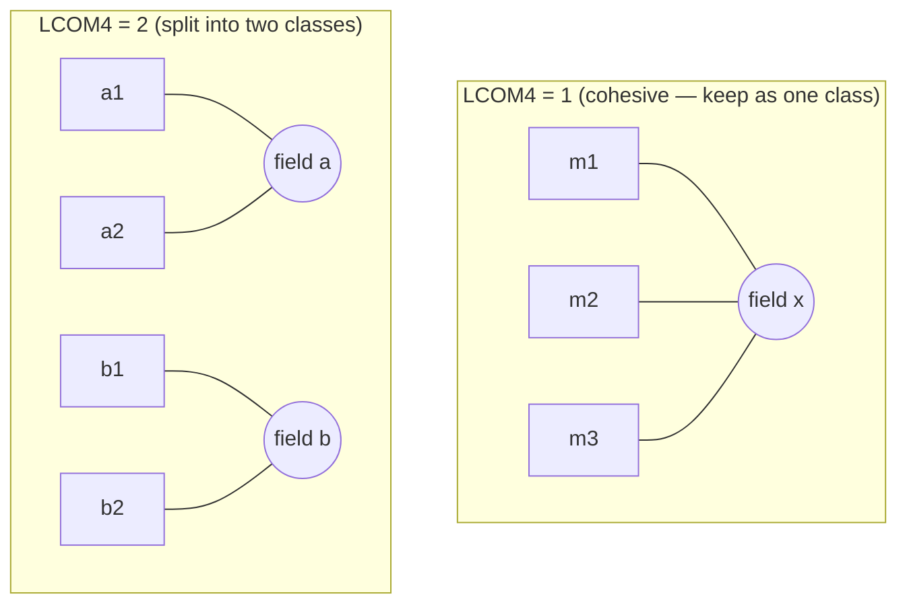
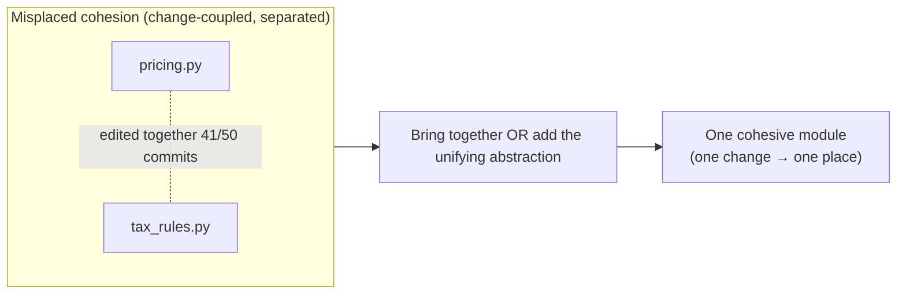

# Maximise Cohesion — Middle

> **Category:** [Design Principles → Coupling & Cohesion](../../README.md) — group things that change together; separate things that don't.

> **Prerequisite:** [Junior](junior.md)
> **Focus:** **Why** and **When**

---

## Table of Contents

1. [Introduction](#introduction)
2. [Cohesion as "Things That Change Together"](#cohesion-as-things-that-change-together)
3. [Measuring Cohesion: LCOM](#measuring-cohesion-lcom)
4. [Change-Coupling: Misplaced Cohesion in Git History](#change-coupling-misplaced-cohesion-in-git-history)
5. [Applying the Ladder: When Each Level Is Acceptable](#applying-the-ladder-when-each-level-is-acceptable)
6. [Splitting a God Class by Field Clusters](#splitting-a-god-class-by-field-clusters)
7. [The Cohesion/Coupling Tension](#the-cohesioncoupling-tension)
8. [Trade-offs](#trade-offs)
9. [Edge Cases](#edge-cases)
10. [Tricky Points](#tricky-points)
11. [Best Practices](#best-practices)
12. [Test Yourself](#test-yourself)
13. [Summary](#summary)
14. [Diagrams](#diagrams)

---

## Introduction

> Focus: **Why** and **When**

At the junior level, cohesion is "does this module do one thing?" — a feel test. At the middle level it becomes a set of **operational judgements**: *How do I measure whether this class is cohesive? When is low-rung cohesion (temporal, logical) actually fine? When does chasing cohesion split things too far and raise coupling? Which methods belong together?*

The central middle-level reframing is this:

> **Cohesion is about keeping the things that change together, together.** The reason high cohesion makes code cheap to change is that a single requirement-change lands inside one module instead of being scattered across several. This is the **Common Closure** intuition: *a module should be closed against one kind of change.*

That reframing — from "does it do one thing?" to "does one change touch one place?" — is what turns cohesion from an aesthetic into a measurable, decidable property.

---

## Cohesion as "Things That Change Together"

The deepest practical definition of cohesion isn't "related code"; it's **code that changes for the same reasons.** Two methods are cohesive if, whenever a requirement forces you to edit one, it tends to force you to edit the other too. They are *not* cohesive if they change independently — a change to one never touches the other.

This is the **Common Closure Principle** (CCP), the component-level sibling of cohesion and SRP:

> **Gather into one module the things that change for the same reasons at the same times; separate things that change for different reasons or at different times.**

It reframes the whole topic around *change*, which is the property you actually care about:

- **Things that change together → put together** (raises cohesion, lowers cross-module coupling).
- **Things that change apart → keep apart** (avoids fusing unrelated jobs into a God class).

```
   Requirement change "X"  ───►  edits stay inside Module A   (HIGH cohesion)
   Requirement change "Y"  ───►  edits stay inside Module B   (HIGH cohesion)

   vs.

   Requirement change "X"  ───►  edits scattered across A, B, C  (LOW cohesion,
                                                                   shotgun surgery)
```

When a single change forces edits across many files, that's **shotgun surgery** — the symptom of cohesion *split across* boundaries (the thing that should be one module got smeared over several). When *unrelated* changes pile into one file, that's a **God class** — cohesion *fused* (several modules crammed into one). High cohesion sits between these: one change, one place.

---

## Measuring Cohesion: LCOM

"Does this class do one thing?" can be made quantitative. The family of **LCOM** ("Lack of Cohesion of Methods") metrics measures how much a class's methods share its fields — the **informational cohesion** idea from the junior level, turned into a number. Higher LCOM = *less* cohesion = a stronger split candidate.

### LCOM1 (Chidamber & Kemerer, 1991)

Look at every pair of methods in the class. Count:

- **P** = pairs of methods that share **no** fields.
- **Q** = pairs of methods that share **at least one** field.

> **LCOM1 = max(0, P − Q)**

Intuition: if most method-pairs share fields (Q large), the class is cohesive and LCOM1 is 0. If most pairs touch disjoint fields (P large), LCOM1 is high — the methods don't really work on the same data.

```python
class Mixed:
    def __init__(self):
        self.a = 0; self.b = 0; self.c = 0
    def m1(self): return self.a + self.b     # uses {a, b}
    def m2(self): return self.a              # uses {a}
    def m3(self): return self.c              # uses {c}
# pairs: (m1,m2) share a → Q; (m1,m3) share none → P; (m2,m3) share none → P
# P = 2, Q = 1  →  LCOM1 = max(0, 2 - 1) = 1  (some lack of cohesion)
```

### LCOM2 / LCOM3 / LCOM4 — the refinements

LCOM1 has a known flaw: it doesn't account for methods that call *each other*. The later variants fix successive problems:

| Metric | What it adds | Reading |
|---|---|---|
| **LCOM1** | P − Q over field-sharing | crude; ignores method calls |
| **LCOM2** | Normalises by method/field counts | a fraction in [0, 1] |
| **LCOM3 (LCOM*)** | Graph-based; normalised, accounts for fields used | popular default; 0 = cohesive, near 1 = incohesive |
| **LCOM4 (Hitz & Montazeri)** | **Connected components** of the "methods + shared fields/calls" graph | **the most intuitive** — see below |

**LCOM4 is the one to internalise.** Build a graph: each method is a node; draw an edge between two methods if they **share a field** *or* **one calls the other**. Then:

> **LCOM4 = the number of connected components in that graph.**

- **LCOM4 = 1** → all methods are connected → **cohesive** (one class).
- **LCOM4 = 2** → the methods fall into two disconnected clusters → the class is really **two classes** fused → split it.
- **LCOM4 = 0** → no methods (degenerate).

```
   Employee (LCOM4 = 3 — THREE disconnected clusters → split into 3)

     displayName ──{name}             weeklyPay ──{hourlyRate}      takeVacation ──{daysLeft}
          (cluster A)                     (cluster B)                   (cluster C)
      no edges between A, B, C  →  3 components  →  3 hidden classes
```

### LCOM-HS (Henderson-Sellers)

A widely used normalised variant (the one Sonar-style tools often report):

> **LCOM-HS = (mean number of methods accessing each field − total methods) / (1 − total methods)**

It yields a value typically in [0, 1] (sometimes up to 2): **0 = perfectly cohesive** (every method touches every field), **1 = no cohesion** (each field used by one method). It's the practical "give me a single cohesion score" metric, but — like all LCOM variants — it's a *heuristic*, not truth.

### How to actually use LCOM

- **As a smell detector, not a gate.** A high LCOM4 (≥ 2) on a class is a strong hint it bundles multiple responsibilities — go look. A low one is reassuring. Don't fail a build on an LCOM threshold; the metric has too many false positives (constructors, data classes, and builders legitimately score "incohesive").
- **LCOM4's connected components literally tell you *where* to split** — each component becomes a class. That's its great practical value over the numeric variants.
- **Caveats:** getters/setters, constructors, and pure data holders distort LCOM (they touch one field each, inflating "lack of cohesion"). A `record`/DTO with no behaviour will look incohesive and is fine. Always read the metric *with* the one-sentence test, not instead of it.

---

## Change-Coupling: Misplaced Cohesion in Git History

LCOM measures cohesion *structurally* (fields and calls). But the truest measure of "things that change together" is **history**: which files actually get edited in the same commits, over months. This is **change-coupling** (a.k.a. logical coupling or temporal coupling), and it surfaces a kind of cohesion problem the static metrics can't see.

> **Change-coupling:** two files are change-coupled if they are frequently modified together in the same commits, even though there is no static dependency between them.

The diagnostic power:

- **Files that change together but live apart = *misplaced* cohesion.** If `pricing.py` and `tax_rules.py` are edited together in 80% of commits, they encode one concept split across two files — cohesion was scattered. The fix is to bring them together (raise cohesion) or introduce the missing abstraction that unifies them.
- **A file change-coupled with *many* others = a low-cohesion hub.** A God class shows up in git as a file that appears in nearly every commit touching its area — it's coupled-by-change to everything because it *does* everything.

```text
   git log analysis (e.g. via `code-maat`, SonarQube, or a script):

   pricing.py        ↔  tax_rules.py        (changed together 41/50 commits)  ← misplaced cohesion
   order.py          ↔  order_validator.py  (changed together 38/50 commits)  ← belong together
   god_service.py    ↔  EVERYTHING          (in 47/50 commits)                ← low-cohesion hub
```

Change-coupling is the empirical ground truth behind "things that change together should live together." When the data says two separated files always move in lockstep, your module boundary is in the wrong place — cohesion is telling you to redraw it. (This is also a core tool at the [Professional](professional.md) level for diagnosing large codebases.)

---

## Applying the Ladder: When Each Level Is Acceptable

The junior level presented the seven-level ladder as worst→best. The middle-level nuance: **lower rungs aren't always wrong** — they're *tendencies*, and several have legitimate uses.

| Level | Usually a smell? | Legitimately fine when... |
|---|---|---|
| **Coincidental** | Always — fix it | Never. `Misc` has no defence. |
| **Logical** | Usually | A small, closed set of true variants behind one name (e.g. a `Comparator` switch on `SortOrder`) where the branches genuinely share a contract. |
| **Temporal** | Often acceptable | Real lifecycle hooks — `setUp()`/`tearDown()` in tests, `onStartup()`, a constructor's init sequence. "Runs at the same time" *is* a valid reason for a lifecycle method. |
| **Procedural** | Sometimes | A clear pipeline-of-steps orchestrator (a use-case/service method) where the order *is* the responsibility. |
| **Communicational** | Good | Almost always fine — operating on the same data is a real bond. |
| **Sequential** | Good | A data-transformation pipeline; very desirable. |
| **Functional** | Ideal | The target for individual functions and small classes. |

The key judgement: **don't dogmatically "fix" temporal or logical cohesion when the grouping has a real, present justification.** An `init()` method that sets up four subsystems is temporally cohesive *and perfectly fine* — that's what initialization *is*. The ladder tells you where to *look* for problems, not what to reflexively refactor. Apply it where low-rung cohesion is *accidental* (the `Utils` grab-bag), not where it's *intentional* (a lifecycle hook).

---

## Splitting a God Class by Field Clusters

When LCOM4 says "this class is really three classes," here's the disciplined split. We use the `Employee` God class from the junior level.

### Before — LCOM4 = 3 (three disjoint field clusters)

```java
class Employee {
    private String name, email;        // cluster A: identity
    private double hourlyRate;         // cluster B: payroll
    private int vacationDaysLeft;      // cluster C: HR

    String displayName()        { return name + " <" + email + ">"; }
    void changeEmail(String e)  { this.email = e; }
    double weeklyPay(int hours) { return hours * hourlyRate; }
    void giveRaise(double pct)  { hourlyRate *= (1 + pct); }
    void takeVacation(int days) { vacationDaysLeft -= days; }
    int remainingVacation()     { return vacationDaysLeft; }
}
```

The methods form **three disconnected clusters** — identity methods only touch `{name, email}`, payroll only `{hourlyRate}`, HR only `{vacationDaysLeft}`. No method bridges two clusters. That's the LCOM4 = 3 signal: split along the cluster boundaries.

### After — three cohesive classes (each LCOM4 = 1)

```java
class EmployeeIdentity {              // cluster A
    private String name, email;
    String displayName()       { return name + " <" + email + ">"; }
    void changeEmail(String e) { this.email = e; }
}
class Compensation {                  // cluster B
    private double hourlyRate;
    double weeklyPay(int hours) { return hours * hourlyRate; }
    void giveRaise(double pct)  { hourlyRate *= (1 + pct); }
}
class VacationBalance {               // cluster C
    private int daysLeft;
    void takeVacation(int days) { daysLeft -= days; }
    int remaining()             { return daysLeft; }
}
```

Each class now has LCOM4 = 1: every method touches the shared field. Each is independently testable, has one reason to change (a [different actor](../../04-solid/01-srp-single-responsibility/) requests each kind of change: HR, payroll, the directory), and a change to pay rules never risks the vacation logic.

> **The connected-components view turns "improve cohesion" from a vibe into a procedure:** build the method/field graph, find the components, make each component a class. LCOM4 doesn't just *detect* low cohesion — it *prescribes the split*.

---

## The Cohesion/Coupling Tension

Cohesion and coupling usually move together (group related things → fewer cross-boundary deps), but they can **conflict**, and recognising the conflict is a core middle-level skill.

### How chasing cohesion can *raise* coupling

Push "one job per module" too far and you fragment code into many tiny modules — each individually cohesive, but now they must all collaborate to do anything useful. You've maximised *intra*-module cohesion at the cost of *inter*-module coupling.

```python
# Over-split "for cohesion": each does one tiny thing, but they're a chatty web
class PriceFetcher:    def fetch(self, id): ...
class PriceParser:     def parse(self, raw): ...
class PriceRounder:    def round(self, p): ...
class PriceFormatter:  def format(self, p): ...
class PriceConverter:  def convert(self, p, ccy): ...
# To show one price you now wire FIVE objects together — high coupling,
# low locality, hard to follow. Each is "cohesive" but the SYSTEM is worse.
```

A single cohesive `Price` class (or a `pricing` module) holding these closely-related operations is *better* here: the operations all change together and all act on a price, so they belong together. Splitting them manufactured coupling and destroyed locality for no real cohesion gain.

### The balance

> Maximise cohesion **and** minimise coupling *together* — never one at the other's expense. The target is **strong internal cohesion with weak external coupling**, not "as many tiny pure modules as possible." When a split would create more cross-module chatter than it removes intra-module clutter, don't split.

The deeper resolution (developed at [Senior](senior.md)) is **connascence**: split when doing so *moves strong connascence inside a boundary*; don't split when it would *spread strong connascence across* new boundaries. For now: a split is good when the pieces genuinely change independently, and bad when they always change together (in which case they were cohesive all along).

---

## Trade-offs

| Decision | Lean toward more cohesion (split) | Lean toward fewer, larger modules |
|---|---|---|
| When it helps | Parts change for different reasons / different actors | Parts change together and act on the same data |
| Effect on coupling | Lowers cross-actor coupling | Avoids fragmenting into a chatty web |
| Effect on locality | Can scatter related code (worse) | Keeps related code in one place (better) |
| Testability | Each piece testable alone | Larger surface to test at once |
| Risk if overdone | Over-splitting → high coupling, low locality | Under-splitting → God class, low cohesion |
| Best when | LCOM4 ≥ 2 / multiple actors / different change reasons | LCOM4 = 1 / one actor / shared data |

The asymmetry to remember: **a missing split (God class) is usually easier to fix later than a wrong split.** Fusing two over-split classes back together is a mechanical merge; un-fusing a God class that's grown shared state is surgery. When in doubt, keep cohesive things together and split only when the change-reasons clearly diverge.

---

## Edge Cases

### 1. Data classes / DTOs score as "incohesive" — and that's fine

A `record Point(int x, int y)` or a config DTO has no behaviour, so LCOM happily reports low cohesion (no methods sharing fields). But a pure data holder *is* cohesive in the sense that matters — all its fields describe one concept. LCOM is wrong here; trust the one-sentence test ("a point") over the metric.

### 2. Cross-cutting concerns (logging, metrics) defeat naive cohesion

Logging "belongs" to no single module — it's needed everywhere. Sprinkling `log.info(...)` into every class lowers each class's cohesion (now it does its job *and* logging). The cohesive answer is to factor cross-cutting concerns *out* (decorators, middleware, aspects) so each business module stays focused. (See [Separation of Concerns](../../01-generic/03-separation-of-concerns/).)

### 3. Utility functions that genuinely have no home

Some truly generic operations (`clamp`, `chunk`, `debounce`) don't belong to any domain concept. The fix isn't a giant `Utils` grab-bag (coincidental) but **small, named modules** grouped by *what they're about*: `collections.py`, `timing.py`, `strings.py`. That's *functional/logical* cohesion at the module level — a real theme per file — not a dumping ground.

### 4. Orchestrators are legitimately procedural

A use-case method like `placeOrder()` that calls validate → reserve stock → charge → notify is *procedural* cohesion (steps in order). That's acceptable and even desirable for an orchestrator — its single responsibility *is* sequencing the workflow. Don't "fix" it; just keep the *steps themselves* in cohesive modules.

---

## Tricky Points

- **Cohesion is about change-reasons, not topic similarity.** Two methods can both be "about orders" yet change for entirely different reasons (one for tax law, one for UI). Same topic ≠ same cohesion. Group by *who requests the change*, not by the noun.
- **LCOM is a smell, not a verdict.** High LCOM points you at a class to inspect; it doesn't prove the class is wrong (data classes, builders, and constructors fool it). Never gate a build on it.
- **LCOM4's components prescribe the split.** Among the variants, learn LCOM4: the number of connected components *is* the number of hidden classes, and each component is one of them.
- **Change-coupling beats static analysis for finding misplaced cohesion.** Two files with no import between them can still be one concept — only the git history reveals it.
- **More cohesion is not always better.** Past a point, splitting raises coupling and kills locality. Optimise cohesion *and* coupling jointly; stop when a split would create more chatter than it removes.

---

## Best Practices

1. **Group by reason-to-change, not by topic.** Ask "who asks for this to change?" — different answers mean different modules ([SRP](../../04-solid/01-srp-single-responsibility/)).
2. **Use LCOM4 to *locate* splits.** When a class smells big, build the method/field graph; each connected component becomes a class.
3. **Mine change-coupling for misplaced cohesion.** Periodically check which files change together; bring lockstep files together, break up God-file hubs.
4. **Don't reflexively fix temporal/logical cohesion.** Lifecycle hooks and small variant-sets are legitimate; refactor only *accidental* low cohesion.
5. **Factor out cross-cutting concerns** (logging, metrics, auth) so business modules stay focused — see [Separation of Concerns](../../01-generic/03-separation-of-concerns/).
6. **Optimise cohesion and coupling jointly.** Stop splitting when the new modules become a chatty web; high cohesion with low coupling is the goal, not maximal fragmentation.
7. **Trust the one-sentence test over the metric** when they disagree (especially for data classes).

---

## Test Yourself

1. Restate cohesion in terms of *change*. What principle (component-level) expresses this?
2. How does LCOM4 work, and why is it more useful than LCOM1 for refactoring?
3. What is change-coupling, and how does it reveal *misplaced* cohesion?
4. Give two cases where low-rung cohesion (temporal/logical) is acceptable.
5. Explain how chasing cohesion too hard can *increase* coupling.
6. Why is LCOM a "smell, not a gate"? Give an example it gets wrong.

---

## Summary

- Cohesion is best understood as **"keep the things that change together, together"** — the **Common Closure Principle**: one change should touch one module.
- **LCOM** quantifies the informational-cohesion idea; **LCOM4** (connected components of the method/field graph) is the practical one — it *detects* low cohesion *and* prescribes the split.
- **Change-coupling** (files edited together in git) reveals **misplaced cohesion** that static metrics miss: lockstep-but-separate files belong together; a many-coupled hub is a God class.
- Lower-rung cohesion (**temporal, logical, procedural**) is **sometimes legitimate** — lifecycle hooks, variant-sets, orchestrators. Fix *accidental* low cohesion, not intentional groupings.
- Cohesion and coupling **usually align but can conflict**: over-splitting raises coupling and kills locality. Optimise **strong cohesion with weak coupling jointly**, not maximal fragmentation.
- Splitting a God class by **field clusters** (LCOM4 components) yields cohesive, single-actor classes — the same move as [SRP](../../04-solid/01-srp-single-responsibility/).

---

## Diagrams

### LCOM4 as connected components



### Things that change together should live together




---

## Check your understanding

1. Explain Maximise Cohesion — Middle Level in your own words and name the problem it solves.
2. How would you apply the ideas around Table of Contents, Introduction, Cohesion as "Things That Change Together" in a realistic engineering change?
3. What failure mode or misuse should you look for, and what evidence would reveal it?
4. Which local design trade-off would make you choose or reject Maximise Cohesion — Middle Level in an existing codebase?
5. What observable result would convince you that the approach improved the system?
