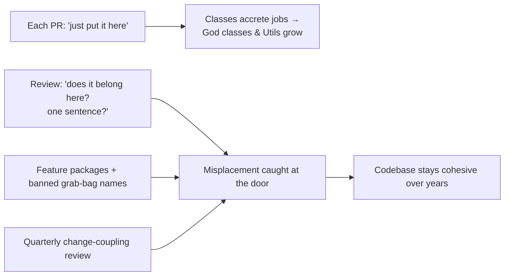
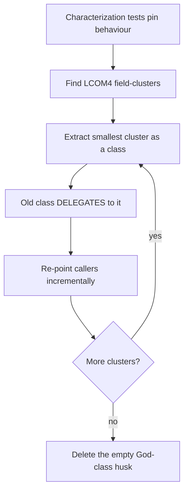

# Maximise Cohesion — Professional

> **Category:** [Design Principles → Coupling & Cohesion](../../README.md) — group things that change together; separate things that don't.

> **Prerequisites:** [Junior](junior.md) · [Middle](middle.md) · [Senior](senior.md)
> **Focus:** **Production** — reviews, metrics, team conventions, legacy systems

---

## Table of Contents

1. [Introduction](#introduction)
2. [Enforcing Cohesion in Code Review](#enforcing-cohesion-in-code-review)
3. [Measuring Cohesion at Scale](#measuring-cohesion-at-scale)
4. [Team Conventions for Cohesion](#team-conventions-for-cohesion)
5. [Refactoring Toward Cohesion in Legacy Systems](#refactoring-toward-cohesion-in-legacy-systems)
6. [Real Incidents](#real-incidents)
7. [The Politics of Cohesion](#the-politics-of-cohesion)
8. [Review Checklist](#review-checklist)
9. [Cheat Sheet](#cheat-sheet)
10. [Diagrams](#diagrams)
11. [Related Topics](#related-topics)

---

## Introduction

> Focus: **production** — keeping a large, multi-contributor codebase cohesive over years.

Cohesion degrades silently. No one ever sets out to build a God class or a `Utils` dumping ground; they accrete. Each PR adds "just one more method" to a class that's *nearly* the right home, or drops a helper into `Common` because finding the right home would take ten minutes. Every individual decision is defensible; the aggregate is a codebase where every file does six things and every change touches twelve files.

At the professional level the question is operational: **how do you keep a codebase cohesive when hundreds of changes land per week from dozens of people, each making locally-reasonable "just put it here" decisions?** The answer is a system — review standards that name the smells, metrics that track cohesion *and don't lie*, conventions that make the cohesive home obvious, and a disciplined approach to clawing cohesion back from legacy God classes without breaking them.

---

## Enforcing Cohesion in Code Review

Most cohesion erosion enters one PR at a time, which makes review the primary defence. A reviewer enforcing cohesion watches two opposite failures: **methods added to the wrong (incohesive) home**, and **over-decomposition** that fragments a concept.

### The highest-value review questions

> **"Does this method belong here — does it use this module's data and serve its one job? Or is it here because here was convenient?"**

> **"What single sentence describes this module now? If it needs an 'and,' which half should move?"**

Asked of every new method on an existing class, the first question catches the slow accretion that turns a focused class into a God class. The second catches the moment a class crosses from one job to two.

### Review by failure mode

| Smell in the PR | What to say |
|---|---|
| New method added to a class it doesn't fit | "This method doesn't touch any of `Order`'s fields and changes for a different reason (tax law, not order data). It belongs in `TaxPolicy`." |
| A new method on a `*Utils`/`*Helper`/`*Manager` class | "`Common` is a grab-bag. What concept is this *about*? Let's put it with that concept, or start a small focused module." |
| A class growing past its one job | "`User` now also sends email and talks to the DB — three reasons to change in one file. Let's split persistence and mailing out." |
| Over-decomposition | "Five tiny classes that always change together and only make sense as a group — this is one cohesive `Pricing` module split into a coupled web. I'd merge them." |
| Package-by-layer creep | "This 'order' change touches `controllers/`, `services/`, and `repositories/`. A feature package would close it against this change." |

### The two-sided bar

A subtle professional point: enforce cohesion in *both* directions. Juniors and metrics over-focus on "this class is too big" and under-focus on "these five classes are one concept fragmented." A reviewer who only ever says "split this" trains the team into over-decomposition. The bar is **alignment with axes of change**, not minimisation — sometimes the right review comment is *"merge these."*

---

## Measuring Cohesion at Scale

You can't manage cohesion across a million-line codebase by eyeballing it. But cohesion metrics are *noisier* than most, so the professional must pick ones that track the real thing and refuse to be fooled.

| Metric | Tracks cohesion? | Notes |
|---|---|---|
| **LCOM4** (connected components) | **Yes (best structural)** | ≥ 2 flags a split candidate *and names the split* (each component → a class). |
| **LCOM-HS / LCOM2-3** | Partially | Single number; convenient for trends but high false-positive rate (data classes, builders). |
| **Change-coupling** (files changed together in git) | **Yes (best empirical)** | Surfaces *misplaced* cohesion structural metrics miss; the ground truth for "changes together." |
| **Shotgun-surgery score** (files touched per logical change) | **Yes (outcome)** | Rising files-per-change = cohesion fragmenting across boundaries. |
| **Class/file size (LOC, method count)** | Weakly | A trend signal; a big class *might* be a God class — go look. Big ≠ incohesive. |
| **Afferent/efferent coupling, instability** | Indirectly | Coupling side of the dual; a many-dependents hub is often a low-cohesion God class. |

### The honest-measurement rules

- **Lead with change-coupling, not LCOM.** The most valuable cohesion analysis is *which files actually change together* over the last N months (tools: `code-maat`, SonarQube, a `git log` script). Files that change together but live apart → misplaced cohesion; a file that changes with everything → a God-hub. This catches connascence-of-meaning that LCOM (field-based) cannot.
- **Use LCOM4 for the *prescription*, not as a gate.** When change-coupling or size flags a class, LCOM4's connected components tell you *where* to cut. Never fail a build on an LCOM threshold — data classes, builders, and constructors generate too many false positives.
- **Watch files-per-change as a trend.** If a "typical" change touched 3 files a year ago and 9 now, cohesion is fragmenting (or a God-hub is forming). This DORA-adjacent signal is downstream of cohesion and harder to game than any static metric.
- **Never report "LCOM improved" as a cohesion win in isolation.** It moves for spurious reasons (you added a getter); pair it with change-coupling and files-per-change, which reflect the real maintainability gain.

> The ground-truth question, as always: *can the team change a feature by editing one place?* If a single feature change reliably scatters across many files, cohesion is wrong regardless of what any static score says.

---

## Team Conventions for Cohesion

Codify these so the *cohesive* home is the obvious default, not a per-PR judgement call:

1. **Ban grab-bag names in new code.** No `Utils`, `Helpers`, `Common`, `Misc`, `Shared`, `Manager`, `Processor` as class/package names. They're cohesion-free by construction. A linter rule can enforce this.
2. **Package by feature, not by layer.** New code is organised by domain capability (`order/`, `billing/`), so a feature change is closed inside one package (CCP). Document the exception (truly cross-cutting infra).
3. **"Does it use the data?" rule for method placement.** A method goes on the class whose fields it operates on. A method that ignores a class's fields probably doesn't belong on it.
4. **One-sentence rule in PR descriptions.** Authors describe each new/changed module in one sentence; an "and" prompts a split-or-justify conversation.
5. **Cohesion review goes both ways.** Reviewers are explicitly licensed to say *"merge these"* as well as *"split this."* Over-decomposition is a defect too.
6. **Cross-cutting concerns are factored out.** Logging, metrics, auth, retries go in middleware/decorators/aspects — never sprinkled into business classes (which would lower their cohesion). See [Separation of Concerns](../../01-generic/03-separation-of-concerns/).
7. **Quarterly change-coupling review.** Run the git-history analysis on hot areas; act on misplaced-cohesion and God-hub findings.

These encode the senior reasoning so juniors get placement right by default and reviewers cite a convention, not a personal taste.

---

## Refactoring Toward Cohesion in Legacy Systems

Greenfield cohesion is easy. The real work is **introducing cohesion into a system already full of God classes and `Util` dumping grounds, under-tested and in production.** It is incremental, test-guarded, and opportunistic — never a rewrite.

### Splitting a God class safely (the sequence)

```text
1. CHARACTERIZE  — write tests pinning the God class's CURRENT behaviour
                   (you can't refactor safely without a net).
2. CLUSTER       — find the field-clusters (LCOM4 components): which methods
                   touch which fields? Each disjoint cluster is a hidden class.
3. EXTRACT ONE   — extract the SMALLEST, most independent cluster first
                   (e.g. a pure validation cluster with no DB), via
                   Extract Class. Delegate from the old class to the new one.
4. RE-POINT      — move callers to the new class incrementally; keep the old
                   delegating method until callers migrate.
5. REPEAT        — extract the next cluster. The God class shrinks each pass.
6. DELETE        — when the God class is an empty husk of delegations, remove it.
```

Crucially, **delegate before you delete**: the old class keeps a forwarding method while you migrate callers, so each step is small and reversible. This is *Extract Class* (Fowler) applied along LCOM4 cluster lines, with characterization tests as the safety net (Feathers, *Working Effectively with Legacy Code*).

### Draining a `Utils` class

```text
1. List every method in the grab-bag.
2. For each, name the CONCEPT it's really about (Email? Money? Compression?).
3. Move it next to that concept (or into a small, themed module).
4. Leave a deprecated forwarding shim if it's widely called; migrate callers.
5. When the Utils class is empty, delete it. (It rarely empties fully —
   stop the BLEEDING first: forbid new additions, then drain over time.)
```

### What *not* to do in legacy code

- **Don't split without characterization tests.** A "harmless" Extract Class that drops a subtle shared-state interaction is the classic legacy-refactor incident. Pin behaviour first.
- **Don't over-correct into fragmentation.** Replacing one God class with twenty anaemic single-method classes that all collaborate is *worse* — you've traded low cohesion for high coupling. Split along *change-axes* (LCOM4 clusters / actors), not per-method.
- **Don't boil the ocean.** A standalone "decompose the monolith" initiative with no feature value rarely survives a deadline. Split classes *as you touch them* for feature work (Boy Scout Rule); cohesion compounds through normal changes.
- **Don't reshuffle packages for purity alone.** A big-bang package-by-layer → package-by-feature migration is high-risk and low-visible-value. Move modules into feature packages opportunistically as you work in them.

---

## Real Incidents

### Incident 1: The `OrderManager` that took down deploys

A six-year-old `OrderManager` (4,000 lines) handled validation, pricing, tax, persistence, email, PDF generation, and refunds. Because *every* order-related change touched it, it appeared in nearly every commit — the team's change-coupling analysis showed it coupled to 60+ files. Two unrelated changes (a tax-rate update and an email-template tweak) merged the same week, conflicted, and a bad resolution shipped a refund bug. **Postmortem:** the God class fused seven actors' concerns into one merge-conflict magnet. **Fix:** characterization tests, then Extract Class along LCOM4 clusters (tax, pricing, persistence, mailing, PDF, refunds) over a quarter, opportunistically. Merge conflicts in the area dropped ~80%. **Lesson:** low cohesion isn't just ugly — it's an *operational* risk: it serialises unrelated changes through one file.

### Incident 2: The DRY refactor that *destroyed* cohesion

An engineer noticed two domains both had a `validate()` and "DRY'd" them into a shared `ValidationManager` holding validation for orders, users, and payments. The class *looked* tidy but had LCOM4 = 3 — three disjoint clusters with no shared fields, merged only because they shared a verb. Now an order-validation change risked payment validation, and three teams contended over one file. **Fix:** split it back — each domain's validation returned to its feature package. **Lesson:** **shared verb ≠ shared concept.** Merging by topic ("all validation") creates *logical* cohesion (a category), which is near the bottom of the ladder. Cohesion is by *change-axis*, not by method name. (See [Senior](senior.md) on connascence and the wrong-axis split.)

### Incident 3: Over-decomposition into a distributed monolith

A team split a cohesive billing capability into five microservices (`InvoiceService`, `TaxService`, `DiscountService`, `RoundingService`, `CurrencyService`) "for clean, cohesive services." They shared one pricing concept (strong connascence of algorithm/meaning) and so had to deploy together, version in lockstep, and make 5 network calls per price. A pricing change meant five coordinated PRs and a choreographed deploy. **Fix:** collapse them into one `billing` service; keep internal classes cohesive. Latency and deploy coordination both improved. **Lesson:** over-decomposition spreads strong connascence across boundaries — that's not more cohesion, it's the *same* cohesion fragmented into coupling, now with a network in the middle.

### Incident 4: The `helpers.py` that nobody could find anything in

A 3,000-line `helpers.py` accumulated over years held date math, currency formatting, HTTP retries, string slugs, and feature flags. New hires couldn't find functions (everything was "in helpers somewhere"); the same date logic got re-implemented three times because no one knew it existed. **Fix:** forbade new additions (stopped the bleeding), then drained it into themed modules (`dates.py`, `money.py`, `http.py`) opportunistically. **Lesson:** coincidental cohesion has a *discoverability* cost — a grab-bag hides the code it contains, causing the very duplication DRY was meant to prevent.

---

## The Politics of Cohesion

Sustaining cohesion is partly social:

- **"Just put it here" is the path of least resistance.** Finding the cohesive home costs minutes; the grab-bag costs nothing *today*. Make the right home *easy* (clear package-by-feature structure, banned grab-bag names) so the cheap path is also the cohesive one.
- **Splitting a God class looks like "churn with no feature."** Stakeholders see a big diff and no new behaviour. Frame it in operational terms they feel: *"this is why every order change risks a refund bug and causes merge conflicts."* Tie it to incident data.
- **Ownership and cohesion are linked (Conway).** A low-cohesion file is usually a multi-team file — a coordination tax on every change. Aligning cohesion with team boundaries (one cohesive module per team) is as much an org fix as a code fix. (See [SRP / Conway's Law](../../04-solid/01-srp-single-responsibility/).)
- **Beware the cohesion zealot.** The engineer who splits everything into tiny pure classes is as much a problem as the one who builds God classes. Reward *alignment with change*, not module count. Celebrate a *merge* that restored locality as loudly as a split that broke up a blob.

---

## Review Checklist

```text
COHESION REVIEW CHECKLIST
[ ] ONE SENTENCE   — module describable in one sentence with no "and"?
[ ] PLACEMENT      — does each new method use THIS module's data / serve its job?
[ ] CHANGE-AXIS    — do the grouped things change for the SAME reason / one actor?
[ ] NAMES          — no Utils/Helpers/Common/Misc/Manager/Processor grab-bags
[ ] GOD CLASS      — is an existing class accreting a new, unrelated reason to change?
[ ] OVER-SPLIT     — are these tiny modules really ONE concept fragmented? (merge?)
[ ] PACKAGING      — does a feature change stay in one feature package? (not layered)
[ ] CROSS-CUTTING  — logging/metrics/auth factored OUT, not sprinkled in?
[ ] BOTH DIRECTIONS— willing to say "split this" AND "merge these"
```

---

## Cheat Sheet

```text
ENFORCE      highest-value questions:
             "does this method belong here, or was here convenient?"
             "one sentence for this module — any 'and' to split on?"

MEASURE      change-coupling (files changed together) FIRST → finds misplaced
             cohesion + God-hubs.  LCOM4 to PRESCRIBE the split (components →
             classes).  files-per-change as the outcome trend.
             NOT LCOM-alone-as-a-gate; NOT size = incohesion.

SMELLS       God class · Utils/Helpers/Common/Manager · package-by-layer ·
             shared-verb merges ("all validation") · cross-cutting sprinkled in ·
             over-decomposition (tiny classes that always change together)

LEGACY       characterize → cluster (LCOM4) → Extract Class smallest-first →
             DELEGATE before delete → re-point callers → repeat → opportunistic.
             Drain Utils: stop additions, then move by concept.

CULTURE      reward ALIGNMENT with change-axes, not module count.
             celebrate merges that restore locality as much as splits.
             make the cohesive home the EASY default (feature packages,
             banned grab-bag names).

GOAL         strong connascence LOCAL, weak connascence crossing →
             a feature change edits ONE place.
```

---

## Diagrams

### Where cohesion erodes, and where it's defended



### Safe God-class decomposition



---

## Related Topics

- **Partner principle:** [Minimise Coupling](../01-minimise-coupling/)
- **Precise theory:** [Connascence](../03-connascence/)
- **Cohesion in change-terms:** [Single Responsibility Principle](../../04-solid/01-srp-single-responsibility/)
- **Macro cohesion:** [Separation of Concerns](../../01-generic/03-separation-of-concerns/)
- **Tooling:** SonarQube (LCOM, cognitive complexity), `code-maat` / git-log change-coupling analysis.

---


---

## Check your understanding

1. Explain Maximise Cohesion — Professional Level in your own words and name the problem it solves.
2. How would you apply the ideas around Table of Contents, Introduction, Enforcing Cohesion in Code Review in a realistic engineering change?
3. What failure mode or misuse should you look for, and what evidence would reveal it?
4. How would you introduce and govern Maximise Cohesion — Professional Level across teams through reversible, measurable increments?
5. What observable result would convince you that the approach improved the system?
