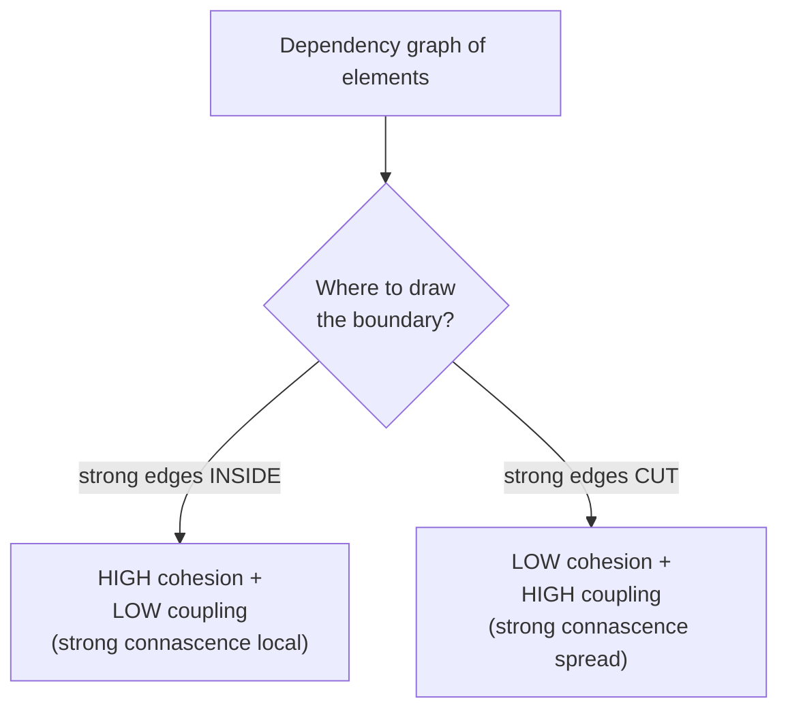
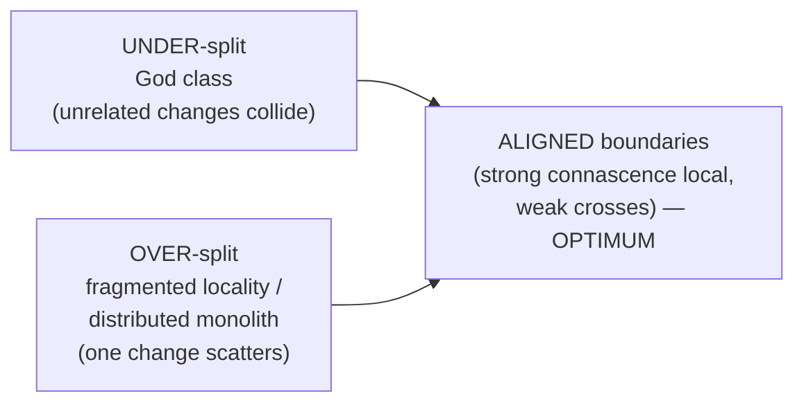

# Maximise Cohesion — Senior

> **Category:** [Design Principles → Coupling & Cohesion](../../README.md) — group things that change together; separate things that don't.

> **Prerequisites:** [Junior](junior.md) · [Middle](middle.md)
> **Focus:** **Design trade-offs** and **system-level reasoning**

---

## Table of Contents

1. [Introduction](#introduction)
2. [The Theory: Cohesion and Coupling Are Dual](#the-theory-cohesion-and-coupling-are-dual)
3. [Cohesion Through Connascence](#cohesion-through-connascence)
4. [The Common Closure Principle and Change-Alignment](#the-common-closure-principle-and-change-alignment)
5. [Cohesion vs. Coupling: The Fundamental Tension](#cohesion-vs-coupling-the-fundamental-tension)
6. [When Maximal Cohesion Is Wrong](#when-maximal-cohesion-is-wrong)
7. [Cohesion at the Architectural Scale](#cohesion-at-the-architectural-scale)
8. [Advanced Examples](#advanced-examples)
9. [Liabilities](#liabilities)
10. [Pros & Cons at the System Level](#pros--cons-at-the-system-level)
11. [Diagrams](#diagrams)
12. [Related Topics](#related-topics)

---

## Introduction

> Focus: **design trade-offs** and **system-level reasoning**

At the senior level, "maximise cohesion" stops being a tidiness rule about classes and becomes a stance on the **central question of decomposition**: *given a system that must change, where do you draw the boundaries so that each foreseeable change is contained?* Cohesion and its partner [coupling](../01-minimise-coupling/) are the two halves of that question — and a senior must be able to reason about them with a precision the seven-level ladder doesn't provide.

This file covers the three hard things:

1. **The precise theory** — cohesion and coupling are *dual*, and both are best formalised as **[connascence](../03-connascence/)**. "High cohesion" means *strong connascence stays local*.
2. **The fundamental tension** — cohesion and coupling usually align but genuinely conflict; maximising one can degrade the other, and there's no free lunch.
3. **When maximal cohesion is *wrong*** — over-decomposition, fragmented locality, and the cases where a pragmatic grouping beats a "pure" one.

---

## The Theory: Cohesion and Coupling Are Dual

The deepest insight is that **cohesion and coupling are the same measurement applied to opposite sides of a boundary.** Both ask: *how strongly are these elements related?* Cohesion asks it *inside* a module; coupling asks it *across* modules.

> Draw a boundary anywhere in a dependency graph. The relationships you enclosed are **cohesion**; the relationships you cut are **coupling**. The two are determined together by where you draw the line.

This duality has a sharp consequence: **you cannot maximise cohesion and minimise coupling independently — moving a boundary trades one for the other.** Pull an element *into* a module and you raise that module's cohesion but may add a dependency from elsewhere (coupling); push it *out* and you lower coupling on that axis but fragment the cohesion. The art of decomposition is finding the boundary that puts *strongly-related* elements inside and leaves only *weakly-related* ones crossing.

```
              ┌─────────── module boundary ───────────┐
   weak ext.  │   strong internal relationships        │   weak ext.
   coupling ──┼──►  (= COHESION, want this HIGH)        ┼──► coupling
              │                                         │   (want this LOW)
              └─────────────────────────────────────────┘

   The SAME edges are "cohesion" (inside) or "coupling" (cut) depending
   only on where the boundary falls. Good design = strong edges inside,
   weak edges cut.
```

The ideal boundary has a name in graph terms: a **minimum cut** through the *weak* edges, leaving the dense clusters (strong edges) intact inside modules. That's why "high cohesion, low coupling" isn't two goals — it's one goal (cut weak, keep strong) stated from both sides.

---

## Cohesion Through Connascence

"High cohesion" is vague; **[connascence](../03-connascence/)** (Meilir Page-Jones) is the precise vocabulary, and it's the senior-level upgrade. Two elements are *connascent* if changing one requires a corresponding change in the other to keep the system correct. Connascence comes in *kinds*, ordered by strength:

| Kind | Definition | Example |
|---|---|---|
| **Name** (weakest) | Agree on a name | A caller uses method name `total()` |
| **Type** | Agree on a type | A parameter must be `Money` |
| **Meaning** | Agree on a value's meaning | `0` means "active", `1` means "banned" |
| **Position** | Agree on order | Positional args `point(x, y)` |
| **Algorithm** | Agree on an algorithm | Both sides must hash the same way |
| **Execution** (dynamic) | Order of execution matters | `open()` before `read()` |
| **Timing** | Timing matters | A race condition |
| **Identity** (strongest) | Must reference the same instance | Two components share one object |

The reframing of cohesion through connascence:

> **High cohesion = strong connascence is kept *local* (inside a module). Low coupling = only *weak* connascence crosses module boundaries.** They are one rule: *keep strong connascence local; let only weak connascence span boundaries.*

This is far sharper than the ladder. Consider:

- A **functionally cohesive** module is one whose elements share *strong* connascence (algorithm, meaning, execution) — and that strength is *contained* inside the module, which is exactly why a change to its job stays local. The strong bonds are *supposed* to be there; that's the cohesion.
- A **God class** is low cohesion because it *also* contains strong connascence between elements that serve *different actors* — bonds that shouldn't exist. The fix is to split so each cluster of strong connascence gets its own boundary.
- **Coincidental cohesion** (the `Utils` class) is the opposite pathology: elements with *no* connascence forced into one boundary. There's nothing to keep local because nothing is connascent — so the boundary is arbitrary.

```python
# Strong connascence (of meaning + algorithm) between these two →
# they MUST stay in one cohesive module:
def to_wire(order):   return encode(order, WIRE_VERSION)   # encoder
def from_wire(bytes): return decode(bytes, WIRE_VERSION)   # decoder
# encoder and decoder share connascence of ALGORITHM and MEANING (version,
# format). Splitting them across modules would spread strong connascence
# across a boundary — LOW cohesion / HIGH coupling. Keep them together.
```

The senior rule for *where to split*: **split a module when its strong connascence falls into clusters that don't share connascence with each other** (the LCOM4-components idea, now precise). **Don't split** when doing so would put two ends of one strong connascence in different modules — that *manufactures* coupling. Connascence tells you both *whether* a boundary is right (strong inside, weak across) and *which* refactoring to reach for (weaken it, localise it, lower its degree).

---

## The Common Closure Principle and Change-Alignment

Cohesion's most actionable senior framing is the **Common Closure Principle** (CCP), Uncle Bob's component-level statement and the macro-form of cohesion:

> **Gather into a module the things that change for the same reasons at the same times; separate things that change for different reasons or at different times.**

CCP reframes cohesion as **closure against change**: a module should be *closed* against one kind of change — a change of that kind affects this module and no other.

This unifies the whole topic:

- **[SRP](../../04-solid/01-srp-single-responsibility/)** is CCP applied to one class: a class closed against *one actor's* changes — i.e. *functionally cohesive in change-terms*. (SRP and "maximise cohesion" are literally the same principle at different granularity.)
- A **change that scatters** across modules (shotgun surgery) is cohesion *under-aligned* — the closure boundary is too small / split the wrong way.
- A **module that absorbs unrelated changes** (God class) is cohesion *over-aggregated* — the closure boundary is too big.

> Maximising cohesion = **aligning module boundaries with axes of change**, so each axis is *closed* inside one boundary. Get this right and the cost of any single change stays local; get it wrong and every change either ripples (shotgun surgery) or risks unrelated code (God class).

The senior insight CCP forces: **cohesion is relative to the *expected change profile*, not to topic or structure.** Two methods "about pricing" might belong in different modules if one changes with tax law and the other with the UI. There is no context-free "correct" cohesion — it depends on which changes your system will actually face, which is partly an *organisational* fact (who requests changes — the [Conway's Law](../../04-solid/01-srp-single-responsibility/) dimension of SRP).

---

## Cohesion vs. Coupling: The Fundamental Tension

The slogan "high cohesion, low coupling" hides a real tension that seniors must navigate, because the two goals *usually* align but *sometimes* oppose.

### When they align (the common case)

Grouping strongly-related elements raises cohesion *and* removes the dependencies that used to cross the boundary (lowers coupling). Splitting unrelated elements lowers a module's "fake" cohesion *and* doesn't add coupling (they weren't related anyway). Most refactoring lives here — it improves both at once.

### When they conflict (the case that needs judgement)

**Over-decomposition for cohesion raises coupling.** Push "one responsibility per module" to its extreme and you get many tiny, individually-pure modules that must all wire together to do anything. Each module's cohesion is high; the *system's* coupling is now terrible (chatty collaboration, deep call chains, no locality).

```text
   Cohesion ↑↑↑  per module      but    Coupling ↑↑↑  between modules
   (each does one tiny thing)            (everything must talk to everything)

   Net effect: WORSE. You optimised a local metric and pessimised the global one.
```

**The resolution is connascence, not the ladder.** The right boundary keeps *strong* connascence inside and lets only *weak* connascence cross. Over-decomposition fails because it *splits strong connascence across boundaries* — the tiny modules are connascent-by-algorithm/meaning but live apart, so every change to the shared concept touches all of them (high coupling) even though each *looks* cohesive in isolation. The fix is to merge them: the elements were strongly connascent all along, so they belong in one cohesive module.

> The tension dissolves once you measure with connascence instead of counting responsibilities: **maximise cohesion = localise strong connascence; minimise coupling = weaken what crosses.** A "split" that spreads strong connascence across boundaries is not more cohesion — it's *the same cohesion fragmented*, which is just disguised coupling.

---

## When Maximal Cohesion Is Wrong

"Maximise cohesion" pushed without judgement produces three real pathologies. Senior skill is knowing when *not* to split.

### 1. Fragmented locality

The most common failure: splitting closely-related code into separate files/classes/services so each is "pure," destroying the **locality of behaviour** — the ability to understand and change a feature by reading one place. Code that always changes together should be *read* together. Over-cohesion that scatters a single concept across ten files trades a manageable medium-sized module for a manhunt across a "cohesive" graph. **Locality is a cohesion *benefit*; over-splitting throws it away in cohesion's name.**

### 2. The wrong-axis split

Splitting by *mechanism* instead of by *change-reason* produces modules that *look* cohesive (all the validators here, all the formatters there) but aren't closed against any real change — a single feature change now touches the validator module *and* the formatter module *and* the service module (shotgun surgery). This is "horizontal" layering masquerading as cohesion. True cohesion is *vertical* (by feature/change-reason), not horizontal (by technical role). (This is the package-by-feature vs. package-by-layer debate; see below.)

### 3. Premature cohesion / speculative boundaries

Splitting a class "for cohesion" before the change-profile is known bakes in a guess about which things change together. If the guess is wrong, you've created coupling across a boundary that the real changes constantly cross. Like premature abstraction, **premature decomposition is expensive** — and harder to undo than a too-big module. When the change-axes aren't yet clear, **keep things together** and split when the seams reveal themselves (the cohesion analogue of YAGNI / the rule of three).

> **The pragmatic grouping often beats the pure one.** A medium-sized module that holds a whole feature — even if you could "purify" it into five tiny cohesive classes — is frequently the better design, because it preserves locality and avoids the coupling of over-decomposition. Maximal cohesion is a *direction*, not a *destination*; stop when further splitting costs more in coupling and locality than it buys in focus.

---

## Cohesion at the Architectural Scale

Cohesion is fractal — it governs functions, classes, packages, services, and teams. The senior must apply it at every scale:

| Scale | Cohesion question | Failure of low cohesion |
|---|---|---|
| Function | Does it do one task? | A function with a `mode` flag doing several |
| Class | Do methods share fields/purpose? (LCOM) | God class |
| Package/module | Do the classes change together? (CCP) | A `util`/`common` package; a "kitchen-sink" module |
| Service | Does it own one capability/bounded context? | A distributed monolith (services that must deploy together) |
| Team | Does it own one cohesive area? | Teams that block on each other for every change (Conway) |

The **package-by-feature vs. package-by-layer** decision is cohesion at the package scale:

```text
   package-by-LAYER (LOW cohesion — by mechanism)   package-by-FEATURE (HIGH cohesion)
   controllers/                                       order/
     OrderController, UserController, ...               OrderController, OrderService,
   services/                                            OrderRepository, Order
     OrderService, UserService, ...                   user/
   repositories/                                        UserController, UserService, ...
     OrderRepository, UserRepository, ...
   → an "order" change touches 3 packages            → an "order" change touches 1 package
     (shotgun surgery; low cohesion)                   (closed against order changes; high cohesion)
```

Package-by-feature is higher cohesion because a feature is an *axis of change* — packaging by feature closes each package against one feature's changes (CCP). Package-by-layer groups by *mechanism*, so every feature change cuts across all layers. The same logic scales up: a **microservice** should own a whole **bounded context** (DDD) — a cohesive capability that changes as a unit — not a technical tier. A "service" that must always deploy alongside three others is a *distributed monolith*: the cohesion boundary is wrong, and you've paid the coupling cost of the network without the benefit of independent change.

---

## Advanced Examples

### Re-merging an over-decomposed design to fix coupling (TypeScript)

```typescript
// BEFORE — over-split "for cohesion"; the four classes are connascent by
// ALGORITHM + MEANING (they all encode the SAME pricing rules) but live apart,
// so every pricing-rule change edits all four (shotgun surgery / high coupling).
class PriceCalculator   { calc(o: Order): number { /*...*/ } }
class DiscountApplier   { apply(p: number, o: Order): number { /*...*/ } }
class TaxAdder          { add(p: number, o: Order): number { /*...*/ } }
class PriceRounder      { round(p: number): number { /*...*/ } }

// AFTER — one cohesive module: the strong connascence is now LOCAL.
// A pricing-rule change touches ONE place; the steps share data and purpose.
class Pricing {
  total(o: Order): number {
    const base    = this.calc(o);
    const discounted = this.applyDiscounts(base, o);
    const taxed   = this.addTax(discounted, o);
    return this.round(taxed);
  }
  // private steps — cohesive, communicational/sequential, one reason to change
  private calc(o: Order): number { /*...*/ return 0; }
  private applyDiscounts(p: number, o: Order): number { /*...*/ return p; }
  private addTax(p: number, o: Order): number { /*...*/ return p; }
  private round(p: number): number { /*...*/ return p; }
}
```

The "after" is *more* cohesive *and* less coupled — because the four pieces were strongly connascent all along. The "before" mistook *splitting* for *cohesion*; it actually fragmented one cohesive concept into a coupled web.

### Splitting where connascence genuinely diverges (Python)

```python
# These DON'T share connascence — order persistence and order emailing change
# for different reasons (DB schema vs. email provider). Keeping them in one
# class is FALSE cohesion (a God class). Split: each cluster of strong
# connascence gets its own local boundary.
class OrderRepository:                 # connascent with the DB schema
    def save(self, order): ...
    def find(self, id): ...

class OrderNotifier:                   # connascent with the email provider
    def send_confirmation(self, order): ...
```

The rule operating in both examples: **keep strongly-connascent things together; separate things with no shared connascence.** That single criterion handles both "don't over-split" and "do split the God class."

---

## Liabilities

### Liability 1: "Cohesion" as a license to over-decompose

The most common senior-level failure: equating "more, smaller, purer modules" with "more cohesion," producing fragmented locality and a coupled web. Cohesion is *strong connascence kept local*, not *maximum number of modules*. A split that spreads strong connascence across boundaries reduces effective cohesion.

### Liability 2: Splitting by mechanism, not by change-axis

Package-by-layer, "all validators in one place," "a service per technical tier" — these *look* cohesive but close against no real change, causing shotgun surgery. Cohesion must align with *axes of change* (features, actors, bounded contexts), which are vertical, not horizontal.

### Liability 3: Trusting LCOM as truth

LCOM and other structural metrics measure *field-sharing*, a proxy for connascence — but they miss connascence of meaning/algorithm that spans no shared field, and they false-positive on data classes and builders. A metric-driven "fix" can split a cohesive class or merge incohesive ones. Use change-coupling and connascence reasoning, not LCOM alone.

### Liability 4: Premature cohesion

Decomposing before the change-profile is known bakes in a wrong guess about what changes together, creating boundaries the real changes constantly cross. Like premature abstraction, it's expensive and sticky. When seams are unclear, keep things together and let cohesion *emerge* from observed change.

---

## Pros & Cons at the System Level

| Dimension | High cohesion (well-aligned boundaries) | Over-decomposition (cohesion chased blindly) |
|---|---|---|
| Cost of a single change | Local — one module | Scattered — many tiny modules (shotgun surgery) |
| Coupling | Low (weak connascence crosses) | High (strong connascence spread across boundaries) |
| Locality / readability | High — a feature reads in one place | Low — a feature is a manhunt across files |
| Testability | Each module testable alone | Each *unit* testable, but behaviour needs the whole web |
| Reusability | High — a focused capability | Low — pieces only make sense together |
| Risk of unrelated breakage | Low — boundaries contain change | Low per-unit, but integration is fragile |
| Failure mode | God class (under-split) | Distributed monolith / fragmented locality (over-split) |

The senior stance the table encodes: **cohesion is a U-shaped curve, not a monotone "more is better."** Too little (God class) and changes risk unrelated code; too much (over-decomposition) and changes scatter across a coupled web. The optimum is where **boundaries align with axes of change** — strong connascence inside, weak connascence crossing — which simultaneously maximises real cohesion *and* minimises coupling. That alignment, not maximisation, is the goal.

---

## Diagrams

### Cohesion and coupling are one boundary decision



### The cohesion U-curve



---

## Related Topics

- **Partner principle (the dual):** [Minimise Coupling](../01-minimise-coupling/)
- **The precise theory:** [Connascence](../03-connascence/)
- **Cohesion in change-terms:** [Single Responsibility Principle](../../04-solid/01-srp-single-responsibility/)
- **Macro cohesion:** [Separation of Concerns](../../01-generic/03-separation-of-concerns/)

---


---

## Check your understanding

1. Explain Maximise Cohesion — Senior Level in your own words and name the problem it solves.
2. How would you apply the ideas around Table of Contents, Introduction, The Theory: Cohesion and Coupling Are Dual in a realistic engineering change?
3. What failure mode or misuse should you look for, and what evidence would reveal it?
4. How would you validate a system-level decision about Maximise Cohesion — Senior Level under uncertainty?
5. What observable result would convince you that the approach improved the system?
