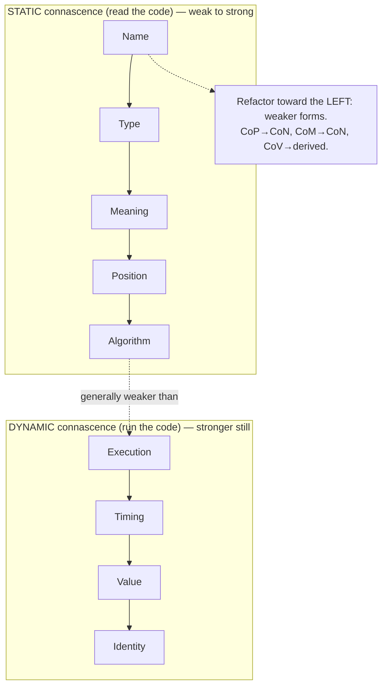

# Connascence — Junior

> **Category:** [Design Principles](../../README.md) — a precise vocabulary for the *kinds* and *strengths* of coupling, so you can reason about it instead of just sensing it.

---

## Introduction

> Focus: **What is it?** and **How to use it?**

**Connascence** is a way of *naming* coupling precisely. Most engineers learn "coupling is bad, aim for loose coupling" — but that advice is vague. It tells you the *direction* (less) without telling you *what kind* of coupling you have, *how bad* it is, or *which refactoring* fixes it. Connascence supplies all three.

The word comes from Latin: *con-* ("together") + *nasci* ("to be born") — literally "born together." It was introduced by **Meilir Page-Jones** in his 1992 paper and his book *What Every Programmer Should Know About Object-Oriented Design*.

> **Two software components are connascent if a change in one would require a change in the other in order to maintain the overall correctness of the system.**

That's the whole idea. If editing function A *forces* you to also edit function B — otherwise the program is wrong — then A and B are connascent. Connascence then classifies *what they agree on* (a name? a type? an order?) and ranks how hard that agreement is to change.

### Why this matters

"Reduce coupling" is a goal you can't act on directly. "This is **Connascence of Position** across two files — replace the positional arguments with a named object to turn it into **Connascence of Name**" is an instruction you *can* act on. Connascence converts a fuzzy code-smell into a labeled problem with a known cure. It's the difference between a doctor saying "you seem unwell" and "you have a B12 deficiency; take this." Same body, far more useful diagnosis.

---

## Prerequisites

- **Required:** Comfortable reading functions, parameters, classes, and modules in at least one language.
- **Required:** A working sense of **[coupling](../01-minimise-coupling/)** — the idea that one part of the code can depend on another.
- **Helpful:** Familiarity with **[DRY](../../01-generic/07-dry/)** — "Don't Repeat Yourself" — because connascence sharpens *what* duplication actually is.
- **Helpful:** Exposure to basic refactorings (rename, introduce parameter object, extract function).

---

## Glossary

| Term | Definition |
|------|-----------|
| **Connascence** | Two components are connascent if a change in one requires a corresponding change in the other to keep the system correct. |
| **Component** | Any nameable unit of code — a variable, parameter, function, method, class, or module. |
| **Static connascence** | Connascence you can see by *reading the source code* (names, types, argument order). |
| **Dynamic connascence** | Connascence visible only when the program *runs* (execution order, timing, shared values, shared identity). |
| **Strength** | How hard a given form of connascence is to discover and refactor. Static forms are weaker; dynamic forms are stronger. |
| **Degree** | How *many* components are entangled by the connascence (two callers vs. two hundred). |
| **Locality** | How *close together* the connascent components are (same function vs. across modules). |
| **CoN / CoT / CoM / CoP / CoA** | The static forms: Connascence of **N**ame, **T**ype, **M**eaning, **P**osition, **A**lgorithm. |

---

## The Core Definition

Let's make the definition concrete. Two pieces of code are connascent when they must *agree on something*, and breaking that agreement breaks the program.

```python
# Component A — defines a function
def total_price(quantity, unit_price):
    return quantity * unit_price

# Component B — calls it
total_price(3, 9.99)
```

Here A and B are connascent in two ways at once:

1. They agree on the **name** `total_price`. Rename the function and the call site breaks until you update it too. → *Connascence of Name.*
2. They agree on the **order** of the arguments: quantity first, unit price second. Swap the two values at the call site and the program still *runs* but computes the wrong meaning — silently. → *Connascence of Position.*

The key test, every time: **"If I change this here, what else am I forced to change over there to keep the system correct?"** Whatever you're forced to change with it is connascent with it. The *kind* of agreement they share is the *kind* of connascence.

---

## Why "Coupling" Wasn't Enough

Classic coupling vocabulary (content, common, control, stamp, data coupling) describes coupling between *modules* and is coarse. Connascence improves on it in three specific ways:

| Classic "coupling" | Connascence |
|---|---|
| One word ("tight" / "loose") | Named *kinds* (Name, Type, Position, …) |
| No ranking | A clear weak → strong ordering |
| No measure of scope | A *degree* (how many) and *locality* (how far) |
| Vague advice ("reduce it") | A *direction*: refactor toward weaker, more local forms |

Connascence is a **superset** of the classic taxonomy: it covers everything the old vocabulary covered *and* it covers couplings the old vocabulary had no word for (like two functions that must use the same hashing algorithm). At this level, the one thing to remember is: **connascence gives coupling a name, a strength, and a cure.** (The full cross-link to the classic taxonomy is at [Minimise Coupling](../01-minimise-coupling/).)

---

## The Static Forms (weak → strong)

**Static** forms are visible just by reading the code. They are listed here from *weakest* (easy to find, easy to refactor) to *strongest*.

> **Rule of thumb:** the goal of refactoring is to move *down* this list — convert a stronger form into a weaker one.

### 1. Connascence of Name (CoN) — weakest

Two components must agree on a **name**. Almost all code has this; it's the gentlest possible coupling.

```python
def apply_discount(price):   # the name "apply_discount"...
    return price * 0.9

apply_discount(100)          # ...must match here
```

Rename `apply_discount` and the call must change. That's CoN — and it's *fine*. Tools rename safely; the agreement is explicit and easy to see. **You don't try to eliminate CoN; it's the form you want everything else to become.**

### 2. Connascence of Type (CoT)

Two components must agree on a **type**.

```typescript
function setAge(age: number) { /* ... */ }
setAge(30);        // caller must pass a number, not a string
```

If `setAge` changes to expect a different type, callers must change. In typed languages the compiler enforces this for you, which is why CoT is weak — the agreement is checked automatically.

### 3. Connascence of Meaning / Convention (CoM)

Two components must agree on the **meaning of a value** — a convention not written down in the code itself. This is the home of **magic numbers and magic strings**.

```python
# The number 1 secretly means "active"; 2 means "suspended".
def set_status(user, status):
    user.status = status

set_status(user, 1)   # caller must "know" 1 == active
if user.status == 1:  # and so must this reader, somewhere else
    grant_access()
```

Nothing in the code says `1` means active. Two distant places silently agree on it. Change the convention (say `1` now means "banned") and every place that hard-coded `1` is now wrong — and the compiler won't warn you. CoM is stronger than CoT because the agreement is *invisible*.

**Weaken it to CoN** by giving the value a name:

```python
class Status:
    ACTIVE = 1
    SUSPENDED = 2

set_status(user, Status.ACTIVE)   # now they agree on a NAME, not a hidden meaning
if user.status == Status.ACTIVE:
    grant_access()
```

### 4. Connascence of Position (CoP)

Two components must agree on the **order** of values.

```python
def create_event(title, start_time, end_time, location):
    ...

create_event("Standup", "09:00", "09:15", "Room 4")   # order is load-bearing
```

Swap `start_time` and `end_time` and the program still runs — with a backwards event. CoP is dangerous precisely because mistakes are *silent*: the types match, the code compiles, the bug ships. The more arguments, the worse it gets.

**Weaken it to CoN** by replacing positions with names — keyword arguments or a small object:

```python
create_event(
    title="Standup",
    start_time="09:00",
    end_time="09:15",
    location="Room 4",
)   # now order doesn't matter; they agree on NAMES
```

### 5. Connascence of Algorithm (CoA) — strongest static form

Two components must agree on a particular **algorithm** — they must each *do the same computation the same way*, or the system breaks.

```python
# Sender computes a checksum to attach to a message...
def sign(message):
    return sha256(message + SECRET)

# ...and the receiver must verify it with the EXACT same algorithm.
def verify(message, signature):
    return sha256(message + SECRET) == signature   # must match sign() exactly
```

If you change the hashing algorithm in `sign` and forget `verify`, every message fails verification. The two functions are bound by a shared *procedure*, which is much harder to spot and change than a shared name. CoA is the strongest of the static forms.

```
STATIC CONNASCENCE — weakest at top, strongest at bottom
┌──────────────────────────────────────────────┐
│  Name        (CoN)   agree on a name           │  ← prefer this
│  Type        (CoT)   agree on a type           │
│  Meaning     (CoM)   agree on a value's meaning │
│  Position    (CoP)   agree on an order          │
│  Algorithm   (CoA)   agree on a computation     │  ← refactor away from this
└──────────────────────────────────────────────┘
   Refactoring = moving UP this ladder.
```

---

## The Dynamic Forms (visible only at runtime)

**Dynamic** forms can't be seen by reading the source — they only show up when the program *runs*. They are generally **stronger** (harder to find and fix) than any static form, because you can't catch them by inspecting code; you need to reason about execution.

### Connascence of Execution (order)

The **order in which things run** matters.

```python
conn = Database()
conn.connect()      # MUST run before...
conn.query("...")   # ...this. Reverse them and it fails at runtime.
```

Nothing in the *types or names* tells a reader that `connect()` must precede `query()`. You only learn it by running it (or reading docs). **Weaken it** by making the order impossible to get wrong — e.g., return a connected handle that *only then* exposes `query()`.

### Connascence of Timing

The **timing** of execution matters — typically a race condition.

```python
# Two threads both do: read balance → add → write balance.
# If their timing overlaps, one update is lost.
balance = account.read()
account.write(balance + 100)
```

Whether this is correct depends on *when* each thread runs relative to the other. This is among the hardest bugs to find. **Weaken it** with a lock or an atomic operation that removes the timing dependence.

### Connascence of Value

Several values must **change together** to stay consistent.

```python
# A rectangle stores width, height, AND area.
rect.width = 10
rect.height = 5
rect.area = 50      # if you change width/height but forget area, it's now a lie
```

The three fields are connascent by value: a change to one *demands* a change to the others. **Weaken it** by deriving the dependent value instead of storing it (`area` becomes a computed property).

### Connascence of Identity

Two components must refer to the **same instance**, not merely equal-looking copies.

```python
shared_cart = Cart()
add_item(shared_cart, "book")     # both calls must operate on
checkout(shared_cart)             # the SAME cart object, not a copy
```

If one path accidentally works on a *copy* of the cart, the item is lost. They are bound by shared identity. This is the **strongest** form of connascence.

```
DYNAMIC CONNASCENCE (runtime only) — generally STRONGER than all static forms
   Execution (order)  →  Timing  →  Value  →  Identity  (strongest)
```

---

## Real-World Analogies

| Form | Analogy |
|---|---|
| **Connascence of Name** | Two people agreeing to meet "at the library." Rename the library and you both must learn the new name — easy, explicit. |
| **Connascence of Meaning** | A secret code where "the eagle has landed" means "begin." Anyone not told the meaning is lost — and the phrase itself reveals nothing. |
| **Connascence of Position** | A recipe that says "add the first, then the second, then the third" without naming them. Mislabel a jar and you'll never know until it tastes wrong. |
| **Connascence of Algorithm** | Two spies who must each encrypt with the *same cipher*. Change the cipher on one side and every message becomes gibberish. |
| **Connascence of Execution** | Putting on socks before shoes. The steps look independent; do them out of order and the result is absurd. |
| **Connascence of Timing** | Two people reaching for the last seat at the same instant — the outcome depends entirely on split-second timing. |
| **Connascence of Identity** | Two editors must edit *the same* shared document, not each their own copy, or their changes never meet. |

---

## Mental Models

**The one-sentence intuition:** *"If changing this forces me to change that, they're connascent — and my job is to make that connascence weaker, more local, and entangle fewer things."*

```
            ┌─────────────────────────────────────────────┐
  WEAKER    │  Name → Type → Meaning → Position → Algorithm │  STATIC (read the code)
    ↓       ├─────────────────────────────────────────────┤
  STRONGER  │  Execution → Timing → Value → Identity        │  DYNAMIC (run the code)
            └─────────────────────────────────────────────┘
   Always refactor toward the TOP-LEFT: weaker and (next file) more local.
```

A second model: connascence is a **diagnostic, not a checklist**. You don't "remove all connascence" — that's impossible, since any two cooperating components are connascent by name. You *identify the strongest, least-local, highest-degree* connascence and weaken *that* one. Connascence tells you *where to aim*.

---

## Three Refactorings That Lower Connascence

These three moves come up constantly. Memorize the pattern: **identify the form → apply the move → confirm it's now weaker.**

### Refactoring 1 — CoP → CoN (positional args → named)

```python
# BEFORE: Connascence of Position — order is silent and breakable
def book_room(room, start, end, attendees, recurring):
    ...
book_room("A1", "09:00", "10:00", 8, False)   # which arg is which?

# AFTER: Connascence of Name — order no longer matters
def book_room(*, room, start, end, attendees, recurring):
    ...
book_room(room="A1", start="09:00", end="10:00",
          attendees=8, recurring=False)
```

The agreement moved from *position* (strong) to *name* (weak). A reader can't mis-order the arguments anymore.

### Refactoring 2 — CoM → CoN (magic value → named constant)

```typescript
// BEFORE: Connascence of Meaning — "2" silently means "premium tier"
if (user.tier === 2) { enablePremiumFeatures(); }

// AFTER: Connascence of Name — the meaning is named, in one place
enum Tier { Free = 1, Premium = 2 }
if (user.tier === Tier.Premium) { enablePremiumFeatures(); }
```

The hidden convention became an explicit name. Anyone reading it now understands it, and changing the underlying number happens in exactly one place.

### Refactoring 3 — CoV → weaker (stored value → derived value)

```python
# BEFORE: Connascence of Value — area must be kept in sync by hand
class Rect:
    def __init__(self, w, h):
        self.w, self.h, self.area = w, h, w * h   # 3 fields to keep consistent

# AFTER: derive it — there's now nothing to keep in sync
class Rect:
    def __init__(self, w, h):
        self.w, self.h = w, h
    @property
    def area(self):
        return self.w * self.h    # always correct, by construction
```

By *deriving* `area`, the dynamic Connascence of Value disappears: you can't forget to update something that's computed on demand.

---

## Best Practices

1. **Name the form before you fix it.** Say "this is CoP" out loud (or in a review comment). Naming it points to the cure.
2. **Refactor toward weaker forms.** Position → Name, Meaning → Name, Algorithm → an interface/shared module. Down the ladder, always.
3. **Kill magic numbers and strings on sight** — they are Connascence of Meaning, and named constants weaken them to Connascence of Name for free.
4. **Prefer named arguments / parameter objects** over long positional argument lists.
5. **Derive, don't store, dependent values** to avoid Connascence of Value.
6. **Don't try to reach zero connascence.** Connascence of Name is everywhere and is *good*. Aim for *weaker and more local*, not *none*.

---

## Common Mistakes

1. **Treating all coupling as equally bad.** CoN and CoA are both "coupling," but one is trivial and the other is treacherous. Connascence exists precisely to tell them apart.
2. **Trying to eliminate connascence entirely.** Impossible and pointless — cooperating code is connascent by name. The goal is *weaker*, not *gone*.
3. **Leaving magic numbers because "it's obvious."** It's Connascence of Meaning; name it. The next reader doesn't share your context.
4. **Long positional argument lists.** Each extra positional argument multiplies the chance of a silent CoP bug. Use names.
5. **Hiding execution-order requirements in documentation only.** "Call `init()` first" in a comment is Connascence of Execution waiting to bite. Make the order structurally enforced.
6. **Confusing "looks the same" with "connascent."** Two functions that *happen* to share the value `0.2` but encode different rules are **not** connascent — merging them is a mistake. (More at [Middle](middle.md).)

---

## Tricky Points

- **Connascence of Name is the *goal*, not the enemy.** Every refactoring on the static ladder aims to *become* CoN. Beginners sometimes try to remove it; don't.
- **Static vs. dynamic is about *visibility*, not severity per se** — but in practice dynamic forms are stronger because you can't catch them by reading. A subtle CoP can still be nastier than a benign Connascence of Execution; use *strength + locality + degree* together, not the static/dynamic label alone. (See [Middle](middle.md).)
- **Magic numbers are the canonical CoM**, but so are magic *strings* (`if role == "admin"`) and bare *tuples* (`return (lat, lng)` where callers must know index 0 is latitude). All are agreements on unnamed meaning.
- **The same call can carry several forms at once.** `total(3, 9.99)` has CoN (the function name), CoT (the argument types), and CoP (their order) simultaneously. Diagnose the *strongest* one.

---

## Test Yourself

1. State the definition of connascence in one sentence.
2. List the five static forms from weakest to strongest.
3. List the four dynamic forms.
4. A function takes `create_user(name, email, is_admin)` and is called `create_user("Sam", "sam@x.io", true)`. What two forms of connascence are present, and how do you weaken the stronger one?
5. Why is Connascence of Meaning stronger than Connascence of Type?
6. Why can't (and shouldn't) you reduce connascence to zero?

---

## Cheat Sheet

```text
DEFINITION
  A and B are connascent if changing one forces changing the other
  to keep the system correct. (Meilir Page-Jones)

STATIC FORMS (read the code)        weak ──────────────► strong
  Name → Type → Meaning → Position → Algorithm
  CoN    CoT    CoM       CoP        CoA

DYNAMIC FORMS (run the code)        generally STRONGER than static
  Execution(order) → Timing → Value → Identity

THE GOAL — refactor toward WEAKER and MORE LOCAL forms:
  CoP → CoN   positional args  → named args / parameter object
  CoM → CoN   magic number     → named constant / enum
  CoV → none  stored duplicate → derived (computed) value

NOT the goal: zero connascence. CoN is everywhere and is fine.
```

---

## Summary

- **Connascence** (Page-Jones) names coupling precisely: two components are connascent if a change in one forces a change in the other to stay correct.
- It upgrades the vague advice "reduce coupling" into a *kind*, a *strength*, and a *cure*.
- **Static forms** (read in the code), weakest → strongest: **Name → Type → Meaning → Position → Algorithm.**
- **Dynamic forms** (visible only at runtime), generally stronger: **Execution → Timing → Value → Identity.**
- Refactoring means moving toward **weaker** forms: positional args → named (CoP→CoN), magic values → constants (CoM→CoN), stored duplicates → derived values.
- You never aim for *zero* connascence — Connascence of Name is everywhere and harmless. You aim for *weaker and more local*.

---

## Further Reading

- Meilir Page-Jones, *What Every Programmer Should Know About Object-Oriented Design* — the origin of connascence.
- Meilir Page-Jones, *"Comparing Techniques by Means of Encapsulation and Connascence"* (1992) — the original paper.
- [connascence.io](https://connascence.io) — a concise community reference with all forms.
- Kevin Rutherford, *"The Building Blocks of Modularity"* — connascence as a practical refactoring lens.
- The [DRY principle](../../01-generic/07-dry/) — connascence explains *what* duplication really is.

---

## Related Topics

- **Foundation:** [Minimise Coupling](../01-minimise-coupling/) · [Maximise Cohesion](../02-maximise-cohesion/)
- **Related principles:** [Law of Demeter](../04-law-of-demeter/) · [Single Responsibility](../../04-solid/01-srp-single-responsibility/) · [DRY](../../01-generic/07-dry/)

---

## Diagrams




---

## Check your understanding

1. Explain Connascence — Junior Level in your own words and name the problem it solves.
2. How would you apply the ideas around Table of Contents, Introduction, Prerequisites in a realistic engineering change?
3. What failure mode or misuse should you look for, and what evidence would reveal it?
4. What small example would prove that you can apply Connascence — Junior Level correctly?
5. What observable result would convince you that the approach improved the system?
