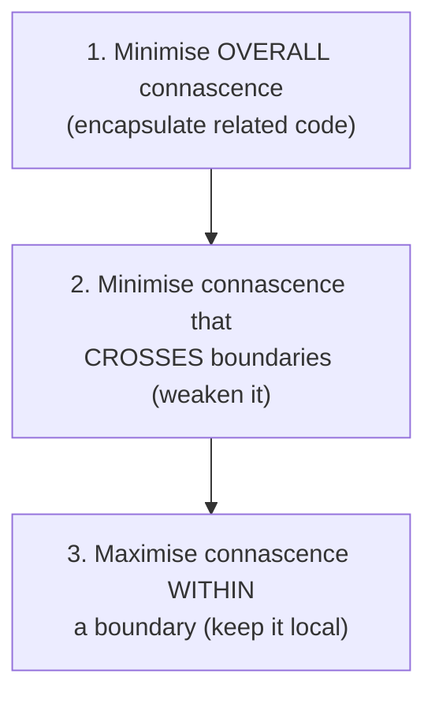
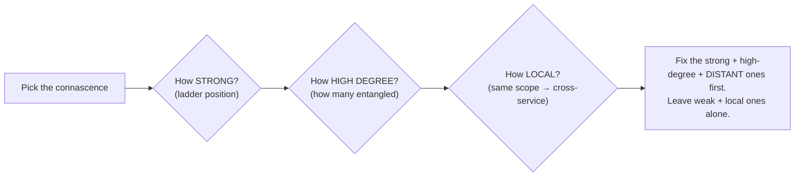

# Connascence — Middle

> **Category:** [Design Principles](../../README.md) — a precise vocabulary for the *kinds* and *strengths* of coupling, so you can reason about it instead of just sensing it.

> **Prerequisite:** [Junior](junior.md)
> **Focus:** **Why** and **When**

---

## Introduction

> Focus: **Why** and **When**

At the junior level you learned to *name* the forms of connascence and run a few mechanical refactorings. At the middle level the question becomes judgement: **given two pieces of connascence, which one do I fix first — and when is fixing it not worth it?**

Connascence answers this with **three properties** that let you *rank* any instance of coupling: **strength**, **degree**, and **locality**. A form isn't just "bad" — it's bad to a degree you can estimate, in a place that makes it more or less dangerous. These three properties are what turn connascence from a vocabulary into a *decision procedure*. They feed directly into Page-Jones's three guidelines, which tell you what to do with what you find.

---

## The Three Properties: Strength, Degree, Locality

Every instance of connascence can be evaluated along three axes. To decide *what to refactor first*, weigh all three.

### 1. Strength — how hard is it to discover and refactor?

> **Strength** is the effort and risk involved in detecting the connascence and changing it safely.

The whole weak → strong ladder *is* the strength ordering. Connascence of Name is weak: a tool can find every reference and rename them atomically. Connascence of Algorithm is strong: nothing mechanically points from `sign()` to `verify()`, so you must *know* they're linked. Dynamic forms are stronger still — a timing dependency leaves no trace in the source at all.

```
WEAKER (easy, safe to change)                STRONGER (hard, risky)
Name → Type → Meaning → Position → Algorithm → Execution → Timing → Value → Identity
└──────────── static ────────────┘  └──────────── dynamic ──────────────┘
```

**Refactoring direction:** always toward weaker. Converting a stronger form into a weaker one is *always* an improvement, all else equal.

### 2. Degree — how many components are entangled?

> **Degree** is the number of components bound together by this connascence.

A magic number `42` used in *two* places is low-degree CoM; the same magic number in *two hundred* places is high-degree CoM — the same *kind* of connascence, but vastly more dangerous because one change to the convention requires two hundred coordinated edits.

```python
# Low degree: the order "lat, lng" is assumed in 2 places — manageable.
# High degree: the same order assumed in 60 call sites — a single fix is now a project.
```

**Degree is a multiplier on risk.** A weak form at high degree can be worse than a strong form at degree two. Always factor in *how many* before deciding what to fix.

### 3. Locality — how close together are the connascent components?

> **Locality** is the conceptual/physical distance between the connascent components — same expression, same function, same class, same module, or across module/service boundaries.

This is the most important and least intuitive property. **The same kind and strength of connascence is acceptable when local and harmful when distant.** Two values that must change together inside a five-line function are trivial to keep correct; the same dependency split across two services in two repositories is a latent production incident.

```
LOCALITY (acceptable ───────────────────────► dangerous)
same expression → same function → same class → same module → across modules → across services
```

The further apart connascent components are, the **weaker** their connascence must be to stay safe. Strong connascence *inside* a small, well-named function is fine; even moderate connascence *across* a module boundary is a smell.

---

## Page-Jones's Three Guidelines

Page-Jones distilled the use of connascence into three guidelines, applied in order. Together they *are* the strategy.

> **Guideline 1 — Minimise overall connascence** by breaking the system into encapsulated elements.
>
> **Guideline 2 — Minimise any remaining connascence that crosses encapsulation boundaries.**
>
> **Guideline 3 — Maximise the connascence within an encapsulation boundary** (the *rule of locality*).

Read them as a single strategy:

1. **First, reduce the total amount** of connascence by encapsulating — drawing boundaries (functions, classes, modules) that contain related code together. Good encapsulation removes whole categories of cross-component agreement.
2. **Then, of what's left, attack what crosses boundaries.** Connascence that spans a class or module boundary is where bugs hide, because the two ends are maintained by different people, at different times, often in different files. Make *those* as weak as possible.
3. **Don't fear strong connascence that stays inside a boundary.** In fact, *want* it there: if two things are tightly connascent, they *belong* in the same encapsulated element. Pulling them apart would just convert strong-but-local connascence into strong-but-distant connascence — strictly worse.

> The deep insight of Guideline 3: **connascence and cohesion are two sides of one coin.** Tightly connascent things belong together (high [cohesion](../02-maximise-cohesion/)); the *act of encapsulating them* is what makes the strong connascence safe. You're not eliminating the coupling — you're *localising* it.



---

## Locality Changes Everything

A worked illustration of why locality dominates. Consider Connascence of Position — the same form, in two different places.

```python
# CASE A — CoP, fully local: caller and callee are the same small function's helpers.
def render_badge(user):
    def fmt(label, value):           # defined right here
        return f"{label}: {value}"
    return fmt("Name", user.name)    # call is two lines away — order is obvious

# CASE B — CoP, across a module boundary: positional contract spans files & teams.
# billing/api.py
charge(account, 1999, "usd", True)   # what are 1999, "usd", True? defined elsewhere
# payments/gateway.py  (different module, different author)
def charge(account, amount_cents, currency, capture_immediately): ...
```

Same kind (CoP), same strength on the ladder — but **Case A is fine and Case B is a bug magnet.** In Case A the order is visible at a glance and changeable in one edit; in Case B the contract is invisible at the call site, the two ends evolve independently, and a silent re-ordering ships to production.

The lesson: **don't rank connascence by its form alone — rank it by `form × degree × locality`.** Page-Jones's Guideline 2 ("minimise *cross-boundary* connascence") exists precisely because locality multiplies danger.

---

## The Strength Ladder, Justified

*Why* is each form ranked where it is? Because strength tracks **how mechanically discoverable and safely changeable** the agreement is.

| Form | Why it sits here | Discoverability |
|---|---|---|
| **Name** | A rename tool finds every reference | Fully mechanical |
| **Type** | The compiler / type checker enforces it | Mechanical (typed langs) |
| **Meaning** | A convention nothing enforces; you must *know* it | Manual — invisible in code |
| **Position** | Order is implicit; mistakes compile and run | Manual — silent failures |
| **Algorithm** | Two procedures must match; no link in the source | Manual — must *know* the pair exists |
| **Execution** | Order at runtime; no static trace | Requires running / reasoning |
| **Timing** | Depends on *when*, not *what* — non-deterministic | Often only reproducible under load |
| **Value** | Invariants across mutable state | Requires tracking all mutations |
| **Identity** | Depends on object *sameness*, not value | Requires tracing references |

The pattern: each step down replaces something the *machine* can check with something a *human* must remember. That's the precise meaning of "stronger" — more human knowledge required, less automated safety, more ways to silently get it wrong.

---

## Working Through the Dynamic Forms

Dynamic connascence is where middle engineers most often under-react, because it's invisible in the diff. Each form, with how to weaken it:

### Connascence of Execution → make order structural

```python
# BEFORE: caller MUST call in this order; nothing enforces it.
parser = Parser()
parser.set_source(text)   # required first
result = parser.parse()   # fails silently if set_source skipped

# AFTER: the order is impossible to get wrong — you can't parse without a source.
result = Parser(text).parse()   # construction guarantees the precondition
```

The cure for Connascence of Execution is almost always **make the illegal state unrepresentable**: bundle the ordered steps so the wrong order can't be expressed.

### Connascence of Timing → remove the timing dependence

```python
# BEFORE: correctness depends on thread interleaving (a race).
if not cache.has(key):       # check
    cache.set(key, compute())  # ...act — another thread may slip between

# AFTER: an atomic operation removes the timing window entirely.
cache.set_if_absent(key, compute)   # one indivisible step
```

You don't "schedule the threads better" — you eliminate the window where timing can matter (locks, atomics, single-ownership, immutable data).

### Connascence of Value → derive or centralise the invariant

```python
# BEFORE: start_date, end_date, and duration_days must stay consistent (CoV).
booking.start_date, booking.end_date, booking.duration_days = ...

# AFTER: duration is derived — the invariant can't be violated.
@property
def duration_days(self):
    return (self.end_date - self.start_date).days
```

If you genuinely must store related values, funnel all mutations through *one* method that maintains the invariant — converting scattered CoV into a single local guarantee.

### Connascence of Identity → make sharing explicit and narrow

```python
# Identity coupling is sometimes necessary (a shared registry, a connection pool).
# Weaken its DANGER by making the sharing explicit and the scope small:
def process(order, *, ledger):   # ledger MUST be the one shared instance — named, injected
    ledger.record(order)
```

You can't always remove identity coupling, but you can stop it from being *implicit* (a hidden global). Inject the shared instance explicitly so the requirement is visible.

---

## Connascence vs. DRY: What "Duplication" Really Is

This is the middle-level payoff. "DRY — don't repeat yourself" is the most-abused principle in software, because it's stated in terms of *text*. Connascence restates it in terms of *knowledge*, and the restatement is sharper.

> **Real duplication is high-strength connascence (usually Connascence of Meaning or Algorithm) between distant components. Coincidental similarity is text that looks alike but carries *no* connascence.**

```python
# These look identical. Are they connascent?
def invoice_vat(amount):  return amount * 0.20
def payroll_levy(amount): return amount * 0.20

# TEST: if the VAT rate changes to 0.21, must the payroll levy ALSO change?
#   No — they are different rules that share a value by coincidence.
#   → NO connascence. Merging them would MANUFACTURE connascence of meaning
#     between two things that should evolve independently. DON'T DRY this.
```

```python
# These also share 0.20 — but here it IS the same rule, applied in two places:
discount_at_checkout = price * 0.20   # the loyalty discount...
discount_in_receipt  = price * 0.20   # ...the SAME loyalty discount, shown again

# TEST: if loyalty discount changes to 0.25, must both change together?
#   Yes — same knowledge → strong connascence of meaning across two sites.
#   → DRY it: name it once. LOYALTY_DISCOUNT = 0.25  (weakens CoM → CoN)
```

The connascence test — *"if I change one, am I forced to change the other to stay correct?"* — is exactly the **definition** of connascence, and it's a far better DRY-detector than "does the text match?" This is why connascence is described as the rigorous theory underneath DRY. (Full treatment at [DRY](../../01-generic/07-dry/) and [Senior](senior.md).)

---

## Using It in Code Review

Connascence's most practical value is as a **shared review language**. Instead of "this feels coupled," you can say something precise and actionable:

> "`charge(account, 1999, "usd", true)` is **Connascence of Position across a module boundary** — high locality risk. Can we pass a `ChargeRequest` object so it becomes Connascence of Name?"

> "These two methods share `0.2`, but a change to the tax rule wouldn't change the discount rule — that's *coincidental similarity*, not connascence. Let's not DRY them; merging manufactures coupling."

> "The requirement that `connect()` runs before `query()` is **Connascence of Execution** hidden in a comment. Can we return a connected handle so the order is structural?"

A review comment that names the form, names the property at risk (usually locality or degree), and proposes the weaker target form is the gold standard. It turns a subjective "I don't like this" into an objective, teachable diagnosis.

---

## When *Not* to Weaken Connascence

Connascence is a lens, **not a checklist** — and not every instance should be "fixed." Reasons to leave it alone:

1. **It's already weak and local.** CoN inside one function needs nothing. Don't add a parameter object to a two-argument local helper to "weaken CoP" — you'd add an element for no gain.
2. **Weakening it would hurt clarity.** Replacing two clear positional arguments with a noisy options object can *reduce* readability. The cure must be cheaper than the disease.
3. **The components genuinely belong together (Guideline 3).** Strong connascence inside a cohesive class is correct — that's *why* the class exists. Don't "decouple" things that should be coupled.
4. **It's coincidental similarity.** As above — there's no connascence to remove, only a trap to avoid.

The discipline: weaken connascence that is **strong, high-degree, or crosses a boundary**. Leave the rest. Connascence tells you *where the leverage is*, not that everything must change.

---

## Trade-offs

| Move | Gains | Costs |
|---|---|---|
| CoP → CoN (parameter object) | Order-proof; self-documenting call sites | One more type; slightly more ceremony for tiny arg lists |
| CoM → CoN (named constant/enum) | Single source for the convention; readable | Almost none — nearly always worth it |
| CoV → derived value | Invariant can't be violated | Recomputation cost (usually negligible) |
| CoExecution → structural ordering | Wrong order becomes unrepresentable | Less flexible API; sometimes more types |
| Splitting strong-but-local connascence across boundaries | (none — usually a mistake) | Converts safe local coupling into dangerous distant coupling |

The recurring asymmetry: weakening connascence *within or at* a boundary is almost always worth it; *moving* connascence across a boundary (e.g., over-splitting a cohesive class) makes things worse. **Locality first, strength second.**

---

## Edge Cases

### 1. Strong connascence that *should* stay strong

A `Money` class binds an `amount` and a `currency` (Connascence of Value — you can't change one meaningfully without the other). That's correct: they're encapsulated together, so the strong connascence is *local*. Splitting them into two free variables would be far worse. **Guideline 3 in action.**

### 2. Cross-boundary connascence you can't remove

A client and server must agree on a wire format (Connascence of Algorithm/Meaning across a network boundary). You can't make this local. You *weaken* it instead: a shared schema (Protobuf/OpenAPI) turns hand-rolled CoA into machine-checked CoN/CoT. Codegen converts "two sides must implement the same parsing" into "two sides reference the same named contract."

### 3. Connascence of Position that's actually fine

`point(x, y)` — two positional arguments with a universally understood order. The locality is the call site, the degree is low, and the convention is near-universal. Forcing `point(x=…, y=…)` everywhere is over-engineering. Judge by `form × degree × locality`, not form alone.

---

## Tricky Points

- **Locality can outweigh strength.** Strong connascence that is fully local is safer than weak connascence spread across modules. Always weight strength *by* locality and degree — never read strength off the ladder in isolation.
- **Encapsulation doesn't *remove* connascence — it *relocates* it inward.** Good design doesn't eliminate the agreement between `amount` and `currency`; it puts both inside `Money` so the agreement is local and guarded. (This is the bridge to [cohesion](../02-maximise-cohesion/).)
- **Dynamic connascence is under-reported because it's invisible in diffs.** Execution-order and timing dependencies don't show up when you read a pull request. Reviewers must *reason about runtime*, not just read text.
- **"DRY" and "connascence" can disagree, and connascence is right.** Text-matching DRY says "merge these identical lines"; connascence says "only if changing one forces changing the other." When they conflict, follow connascence.
- **Identity vs. Value is a real distinction.** Two `Money(10, "usd")` objects can be *equal* yet not *identical*. Code that requires the *same instance* (Connascence of Identity) is more fragile than code that only requires *equal values*. Know which one you actually need.

---

## Best Practices

1. **Rank with all three properties.** Before refactoring, ask: how *strong*, how *high-degree*, how *local*? Fix strong-and-distant-and-high-degree first.
2. **Apply Page-Jones's guidelines in order:** encapsulate to reduce total connascence → weaken what crosses boundaries → keep strong connascence local.
3. **Use the connascence test as your DRY-detector:** *would changing one force changing the other?* If no, it's coincidence — don't merge.
4. **Make ordering and invariants structural,** not documented: bundle ordered steps, derive dependent values.
5. **Weaken cross-boundary contracts with shared schemas/codegen** (turning CoA into checked CoN/CoT).
6. **Don't refactor weak, local connascence** — it's not worth the added elements. Connascence shows leverage; spend it where it's high.

---

## Test Yourself

1. Name the three properties for evaluating connascence and what each measures.
2. State Page-Jones's three guidelines in order.
3. Why is strong-but-local connascence often *better* than weak-but-distant connascence?
4. How does the connascence test sharpen DRY? Give the one-question test.
5. You see `chargeCard(token, 4999, "gbp", true)` called across a module boundary. Diagnose it (form + the property that makes it risky) and prescribe the fix.
6. Give one form of connascence you generally *cannot* remove across a network boundary, and how you weaken it instead.

---

## Summary

- Evaluate any connascence with **three properties: strength** (how hard to change), **degree** (how many entangled), **locality** (how far apart) — and rank by `strength × degree × locality`, never strength alone.
- **Page-Jones's three guidelines, in order:** (1) minimise overall connascence via encapsulation; (2) minimise connascence that *crosses boundaries*; (3) **maximise** connascence *within* a boundary (rule of locality).
- **Locality dominates:** strong-but-local connascence is safe; weak-but-distant connascence is dangerous. Encapsulation *relocates* connascence inward, where it's guarded.
- **Connascence is the rigorous theory under DRY:** real duplication = high-strength connascence; coincidental similarity carries *no* connascence and must not be merged.
- Dynamic forms (Execution, Timing, Value, Identity) are under-reported because they're invisible in diffs — reason about runtime, and make ordering/invariants *structural*.
- Connascence is a **diagnostic lens, not a checklist** — weaken the strong, distant, high-degree instances; leave the weak, local ones alone.

---

## Diagrams

### Rank by all three properties



### Locality intuition

```text
SAFE                                                        DANGEROUS
same expr ── same fn ── same class ── same module ── cross-module ── cross-service
   strong connascence OK here   │   keep it weak from here outward ──────►
                                 ▲
                 encapsulation boundary (Guideline 3:
                 strong connascence belongs INSIDE)
```


---

## Check your understanding

1. Explain Connascence — Middle Level in your own words and name the problem it solves.
2. How would you apply the ideas around Table of Contents, Introduction, The Three Properties: Strength, Degree, Locality in a realistic engineering change?
3. What failure mode or misuse should you look for, and what evidence would reveal it?
4. Which local design trade-off would make you choose or reject Connascence — Middle Level in an existing codebase?
5. What observable result would convince you that the approach improved the system?
