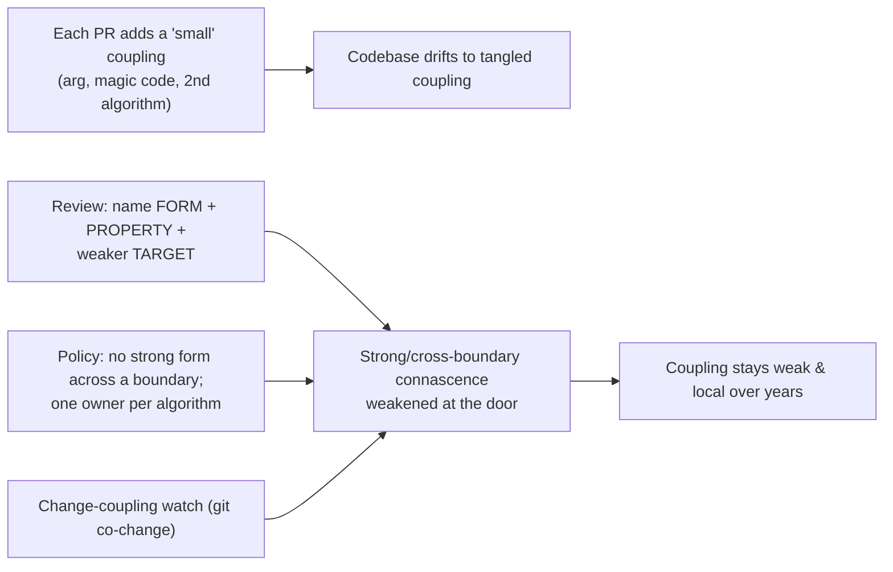
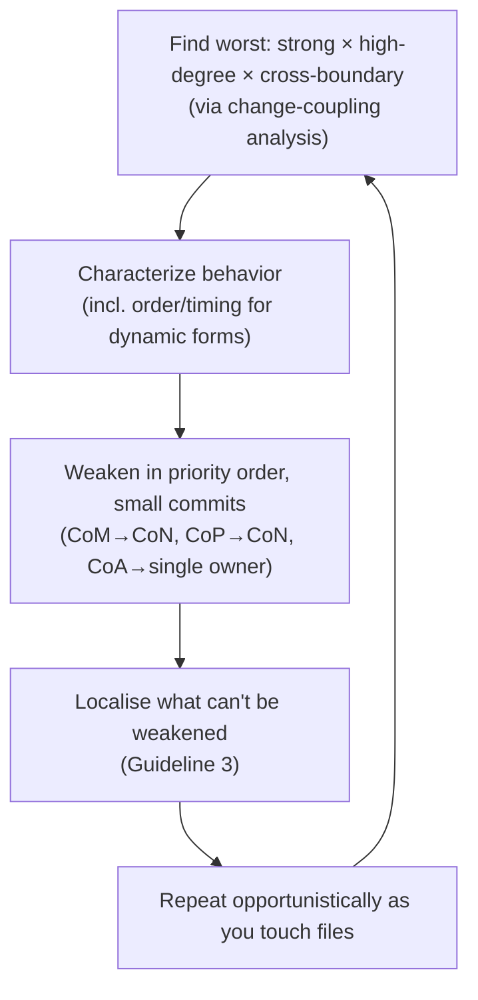

# Connascence — Professional

> **Category:** [Design Principles](../../README.md) — a precise vocabulary for the *kinds* and *strengths* of coupling, so you can reason about it instead of just sensing it.

> **Prerequisites:** [Junior](junior.md) · [Middle](middle.md) · [Senior](senior.md)
> **Focus:** **Production** — reviews, metrics, team conventions, legacy systems

---

## Table of Contents

1. [Introduction](#introduction)
2. [Connascence as a Code-Review Language](#connascence-as-a-code-review-language)
3. [Team Conventions](#team-conventions)
4. [Measuring Connascence](#measuring-connascence)
5. [Refactoring Toward Weaker Connascence in Legacy Systems](#refactoring-toward-weaker-connascence-in-legacy-systems)
6. [Real Incidents](#real-incidents)
7. [The Politics of "It's Just Coupling"](#the-politics-of-its-just-coupling)
8. [Review Checklist](#review-checklist)
9. [Cheat Sheet](#cheat-sheet)
10. [Diagrams](#diagrams)
11. [Related Topics](#related-topics)

---

## Introduction

> Focus: **production** — keeping coupling under control across a large, multi-contributor codebase over years.

Connascence's biggest payoff isn't in a textbook refactoring — it's as a **shared, precise language for an entire team to reason about coupling consistently.** On a real codebase, coupling enters one reasonable-looking pull request at a time: a fourth positional argument here, a magic status code there, a second copy of "compute the total" in a new service. No single change is alarming; the aggregate is a system where every change ripples.

At the professional level the question is operational: **how do you keep coupling weak and local when hundreds of changes land per week from dozens of engineers with different instincts?** Connascence is the answer because it gives the whole team the same words. A reviewer who can say "this is Connascence of Position across a module boundary — let's make it Connascence of Name" is enforcing a *standard*, not voicing a *preference* — and standards scale where preferences don't.

---

## Connascence as a Code-Review Language

The single highest-value professional use of connascence is in review. It converts subjective objections into objective, teachable diagnoses with a named cure.

### The pattern: name the form, name the risky property, propose the weaker target

A good connascence review comment has three parts: **what form** it is, **which property** makes it dangerous (almost always *locality* or *degree*), and **the weaker form** to move toward.

> "`charge(account, 1999, "usd", true)` is **Connascence of Position across a module boundary** — the order is load-bearing and invisible at the call site. Let's pass a `ChargeRequest` so it becomes Connascence of Name."

> "Status `7` appears in three services. That's high-degree **Connascence of Meaning** spread across boundaries — a change to the convention breaks all three silently. Can we put it in the shared `OrderStatus` enum?"

> "`checkout` and `invoicing` each compute the order total. That's **cross-service Connascence of Algorithm** — they'll drift. One service should own `total()`; the others call it (CoA → CoN)."

> "These two `feeFor` methods share `0.20`, but a change to the VAT rule wouldn't change the platform fee — that's *coincidental similarity*, not connascence. Merging them manufactures coupling. Let's keep them apart."

### Why this works socially

Naming the form depersonalises the critique. "I don't like this" invites debate; "this is cross-boundary CoP, which our guidelines say to weaken to CoN" cites a shared standard. The author isn't being judged — a labeled pattern is being matched to its known cure. Teams that adopt the vocabulary find their coupling discussions get *shorter and more decisive*, because everyone is pointing at the same axes (strength, degree, locality) instead of trading vague aesthetics.

---

## Team Conventions

Codify connascence so the weak-and-local path is the default, not a per-PR argument:

1. **Strong connascence must not cross a boundary.** Written rule: no Connascence of Algorithm, Meaning, or Position spanning a module/service boundary. If it must cross, it must be weakened to Name/Type (a shared, versioned contract). This is Page-Jones's Guideline 2 as policy.
2. **Magic values are banned at boundaries.** Any value with a meaning (status codes, type flags, roles) crossing a function/module boundary gets a named constant or enum. (Kills cross-boundary CoM by default.)
3. **No positional argument lists beyond ~3, and never across a boundary.** Long or cross-boundary positional calls → parameter object / keyword args. (Caps CoP.)
4. **One owner per algorithm.** A computation that two components must agree on (totals, signatures, serialization) lives in *one* place that both call. No re-implementation. (Kills cross-boundary CoA.)
5. **Execution-order requirements must be structural, not documented.** "Call `init()` first" in a comment is forbidden; enforce ordering via constructors/types. (Kills hidden CoExecution.)
6. **The connascence test is the DRY test.** Before merging "duplicate" code, answer *"would a change to one force the same change to the other?"* No → it's coincidence, don't merge. This protects against the most common over-DRY incident.

These conventions encode the senior reasoning so juniors get it right by default, and reviewers cite a policy rather than a personal taste.

---

## Measuring Connascence

You cannot manage coupling you can't see, but connascence is **only partly automatable** — and the professional must know exactly which parts a tool can and cannot find.

| Signal | Detects | Blind to |
|---|---|---|
| **Long positional arg lists** (lint) | Potential CoP | Whether order is actually risky / local |
| **Magic-number / magic-string detectors** | Potential CoM | Whether the value carries shared *meaning* |
| **Duplication detectors** (PMD/CPD, SonarQube) | Textual similarity | **Cannot** tell real connascence from coincidence |
| **Change-coupling / co-change analysis** (git history) | Files that *actually* change together → **real** connascence | Why they co-change (could be a shared boundary) |
| **Afferent/efferent coupling, instability** (module metrics) | Architectural coupling weight, degree | Form and locality nuance |
| **Dependency/architecture tests** (ArchUnit, import-linter) | Forbidden cross-boundary dependencies | Dynamic connascence (timing, execution) |

### The honest-measurement rules

- **Change-coupling is the best automatable proxy for *real* connascence.** Files that repeatedly change together in version history are *empirically* connascent — a signal no static text-matcher can produce. Two files in different modules that always change together reveal a strong, cross-boundary connascence the team should weaken or co-locate. **This is the metric to invest in.**
- **Treat textual-duplication % with suspicion.** A high score may be coincidental similarity that must *not* be merged; a low score can hide strong Connascence of Meaning or Algorithm the tool can't see. Pair it with change-coupling.
- **No tool decides "real vs. coincidental."** That requires the domain question — would changing one force changing the other? Keep a human in the loop; a "connascence linter" that auto-merges duplicates reproduces the classic over-DRY bug at scale.
- **The ground-truth metric is outcome:** can the team change this code in one place, safely? If a "small" change consistently forces edits across many files (high co-change, high blast radius), the connascence is too strong, too distant, or too high-degree — regardless of what the static numbers say. DORA change-failure rate and lead time are downstream of connascence.

> Never claim "we reduced coupling" from a falling textual-duplication score alone — it may have *risen* coupling by merging coincidental code. Report change-coupling and co-change blast radius, which actually track connascence.

---

## Refactoring Toward Weaker Connascence in Legacy Systems

Greenfield connascence management is easy. The professional reality is **weakening strong, distant connascence in a system that is already tangled, under-tested, and in production.** The approach is incremental, test-guarded, and ordered by *risk* (strength × degree × locality), highest first.

### The sequence

1. **Find the worst connascence first.** Use change-coupling analysis to locate the *strong, high-degree, cross-boundary* instances — these are where coupling actually hurts. Don't start with weak, local CoP; start with the cross-service shared algorithm or the magic code in forty files.
2. **Characterise before you change.** You can't safely weaken connascence without tests pinning current behavior — *especially* for dynamic forms, where the dependency is invisible in the diff. Write characterization tests around every connascent component first. (See [Minimise Coupling](../01-minimise-coupling/) and *Working Effectively with Legacy Code*.)
3. **Weaken in priority order, smallest commits.** CoM → named constants; CoP → parameter objects; cross-boundary CoA → a single owner both sides call. One form, one commit, tests green throughout.
4. **Localise what you can't weaken.** If a strong connascence can't become weaker (a genuine shared contract), pull the connascent parts into one encapsulated element so it stops crossing the boundary (Guideline 3).
5. **Refactor opportunistically (Boy Scout Rule).** Don't schedule a "decouple the system" mega-project — it's all risk and never finishes. Weaken the connascence in each file *as you touch it* for feature work; locality compounds.

### Weakening dynamic connascence safely

Dynamic forms are the legacy danger because the dependency leaves no static trace:

```text
1. Characterize: tests that pin the ORDER/TIMING/INVARIANT (not just the values).
2. Make the dependency explicit: replace the "call init() first" comment with a
   constructor invariant; replace the implicit shared global with an injected,
   named instance.
3. Verify under the conditions that expose it: timing connascence needs
   concurrency tests; execution connascence needs the out-of-order path tested.
4. Only then remove the old implicit form.
```

### What *not* to do

- **Don't merge "duplicate" code without the connascence test.** The classic legacy incident is DRYing two coincidentally-similar methods (see Incident 2 below). Always ask *would a change to one force the same change to the other?*
- **Don't over-weaken trivial local connascence.** Wrapping every two-argument internal call in an options object adds elements for no risk reduction. Spend effort where strength × degree × locality is high.
- **Don't draw a new boundary through strong connascence.** A microservice extraction that splits a strongly-connascent capability turns safe local coupling into distributed, drifting coupling. Find the *low-connascence seam* before cutting.

---

## Real Incidents

### Incident 1: The magic status code that broke three services

An order's status was an integer; `3` meant "partially shipped." The convention lived nowhere — just `== 3` checks scattered across **three services** (high-degree, cross-boundary **Connascence of Meaning**). A new requirement renumbered the statuses; one service's deploy lagged. For several hours, `3` meant "partially shipped" in two services and "cancelled" in the third. Cancelled orders were partially shipped. **Fix:** a shared, versioned `OrderStatus` enum (CoM → CoN) plus a contract test asserting all services share it. **Lesson:** strong connascence (Meaning) at high degree across boundaries is a latent incident; name it, version it, and never let the convention live implicitly.

### Incident 2: The "harmless" DRY that flipped a regulated rule

An engineer merged two near-identical `calculateFee` methods into one parameterised function — textbook DRY by *text*. But the two encoded *different* rules: one rounded half-up, the other half-even (a documented-nowhere regulatory difference). They shared no real connascence; their similarity was coincidental. The merged version applied one rounding mode to both. **Result:** thousands of mis-rounded transactions before reconciliation caught it. **Fix:** split them back, named for their *different* rules, with the rounding made explicit and tested. **Lesson:** coincidental similarity is *not* connascence. The connascence test (*would a change to one force the same change to the other?* — **no**) would have prevented the merge. Connascence is the correct DRY-detector; text-matching is not.

### Incident 3: Cross-service Connascence of Algorithm drifted silently

`checkout` and `invoicing` each implemented "compute order total." For a year they matched. Then a promo-code feature was added to `checkout` only; `invoicing` kept the old formula. Customers were charged the discounted total but **invoiced the full amount** — a silent **cross-service Connascence of Algorithm** that drifted the moment one side changed. **Fix:** a single `pricing` service owns `computeTotal`; both callers invoke it (CoA → CoN across the boundary), with a contract test. **Lesson:** never let a strong static form (Algorithm) span a service boundary — nothing links the two copies, so divergence is invisible until money is wrong.

### Incident 4: Hidden Connascence of Execution in a "simple" refactor

A cleanup reordered two calls in an initialization path because they "looked independent." They weren't: the first registered a handler the second relied on (**Connascence of Execution**, documented only in a comment that had been deleted in an earlier cleanup). The service started fine in dev (warm caches hid it) and failed in production under cold start. **Fix:** the dependency was made structural — the second step now *takes* the result of the first as a constructor argument, so the wrong order can't be expressed. **Lesson:** execution-order connascence is invisible in a diff; encode it in types, never in prose, and test the out-of-order path.

---

## The Politics of "It's Just Coupling"

Sustaining weak, local connascence is partly a social problem:

- **Coupling is invisible until it bills you.** A fourth positional argument or a second copy of an algorithm looks harmless in review; the cost arrives months later as a cross-cutting change or a drift incident. Professionals must make the *future* cost visible *now* — connascence vocabulary is the tool for that ("this is cross-boundary CoA — it *will* drift").
- **"We can DRY it later" and "we'll just keep them in sync" are false comforts.** Cross-boundary strong connascence that two teams promise to "keep in sync" by discipline *will* drift; only structure (single owner, shared contract) holds. Don't accept a human-discipline answer to a structural problem.
- **Naming the form defuses ego.** Engineers defend "their" design but rarely defend a labeled anti-pattern. Routinely naming connascence in review makes coupling a *technical* topic, not a *personal* one.
- **Senior engineers set the default.** If the staff engineer ships positional mega-signatures and re-implemented algorithms, everyone does. Model the weaker form, and explain *why* — "I passed a request object so the order can't be scrambled across the boundary."

---

## Review Checklist

```text
CONNASCENCE REVIEW CHECKLIST (rank by strength × degree × locality)
[ ] CROSS-BOUNDARY STRONG FORMS — no CoMeaning / CoPosition / CoAlgorithm
    spanning a module or service boundary (weaken to Name/Type, or single-own it)
[ ] MAGIC VALUES — status codes / flags / roles named (CoM → CoN), esp. at boundaries
[ ] POSITIONAL ARGS — long or cross-boundary arg lists → parameter object (CoP → CoN)
[ ] SHARED ALGORITHM — computed in ONE place both sides call (no re-implementation)
[ ] EXECUTION ORDER — structural (constructor/type), never a comment (CoExecution)
[ ] DERIVED, NOT STORED — dependent values computed, not hand-synced (CoValue)
[ ] DRY CHECK — "would a change to one FORCE the same change to the other?"
    No → coincidental similarity → DON'T merge (it manufactures connascence)
[ ] LOCALITY — strong connascence kept INSIDE a boundary, not split across it (Guideline 3)
[ ] DON'T OVER-WEAKEN — leave weak, local connascence alone (YAGNI)
```

---

## Cheat Sheet

```text
REVIEW LANGUAGE   name the FORM + the risky PROPERTY (locality/degree) + the weaker TARGET.
                  "Cross-boundary CoP → make it CoN with a request object."

POLICY            strong connascence (Meaning/Position/Algorithm) MUST NOT cross a boundary.
                  Magic values named. One owner per algorithm. Order = structural.

DRY DETECTOR      the connascence test IS the DRY test:
                  "change one → forced to change the other?"  No → coincidence → don't merge.

MEASURE           change-coupling / co-change (git history) = best proxy for REAL connascence.
                  NOT textual-duplication-% alone (can't tell real from coincidental).

LEGACY            find worst (strong × high-degree × cross-boundary) FIRST →
                  characterize → weaken in priority order, small commits →
                  localise what you can't weaken → opportunistic (Boy Scout).

DYNAMIC FORMS     invisible in diffs. Encode order/invariants in TYPES; test the
                  out-of-order / concurrent / cold-start path.

DON'T             over-weaken trivial local connascence; draw boundaries through strong
                  connascence; trust a "sync by discipline" promise across teams.
```

---

## Diagrams

### Where coupling enters, and where it's stopped



### Safe legacy de-coupling



---

## Related Topics

- **Unifies:** [Minimise Coupling](../01-minimise-coupling/) · **Positive twin:** [Maximise Cohesion](../02-maximise-cohesion/)
- **Special cases of connascence:** [Law of Demeter](../04-law-of-demeter/) · [Single Responsibility](../../04-solid/01-srp-single-responsibility/)
- **DRY, done right:** [DRY](../../01-generic/07-dry/) — the connascence test *is* the DRY test.
- **Tooling:** SonarQube duplication & cognitive complexity, git change-coupling/co-change analysis, ArchUnit / import-linter for boundary rules.

---


---

## Check your understanding

1. Explain Connascence — Professional Level in your own words and name the problem it solves.
2. How would you apply the ideas around Table of Contents, Introduction, Connascence as a Code-Review Language in a realistic engineering change?
3. What failure mode or misuse should you look for, and what evidence would reveal it?
4. How would you introduce and govern Connascence — Professional Level across teams through reversible, measurable increments?
5. What observable result would convince you that the approach improved the system?
