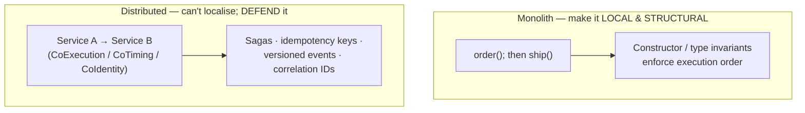
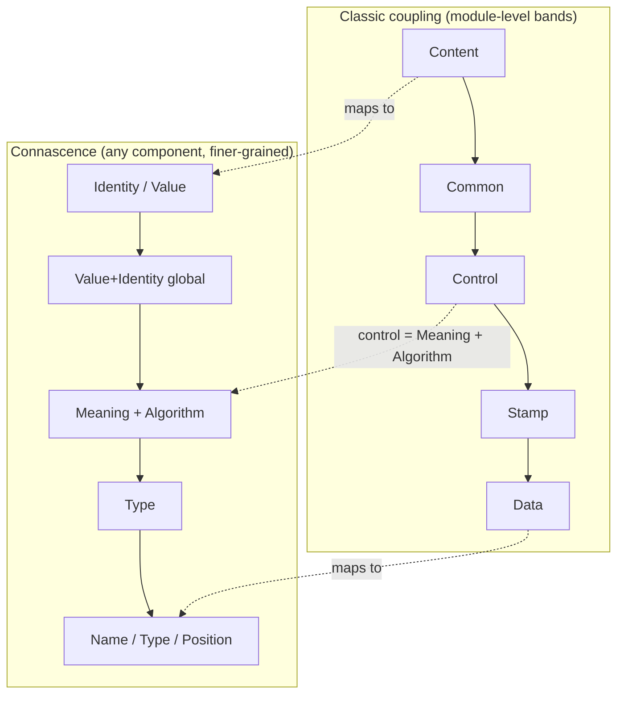
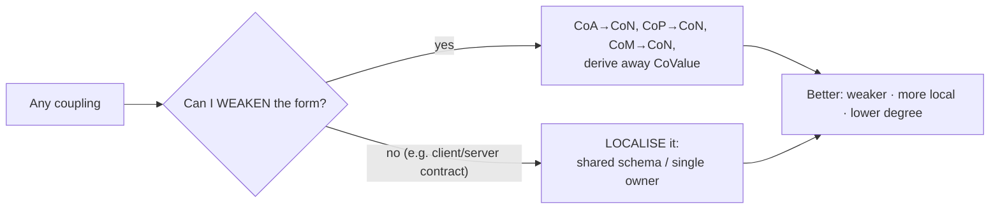

# Connascence — Senior

> **Category:** [Design Principles](../../README.md) — a precise vocabulary for the *kinds* and *strengths* of coupling, so you can reason about it instead of just sensing it.

> **Prerequisites:** [Junior](junior.md) · [Middle](middle.md)
> **Focus:** **Design trade-offs** and **system-level reasoning**

---

## Table of Contents

1. [Introduction](#introduction)
2. [Connascence as the Unifying Theory of Coupling](#connascence-as-the-unifying-theory-of-coupling)
3. [Mapping the Classic Coupling Taxonomy onto Connascence](#mapping-the-classic-coupling-taxonomy-onto-connascence)
4. [Connascence Gives Refactoring a *Direction*](#connascence-gives-refactoring-a-direction)
5. [Static Connascence at Architectural Scale](#static-connascence-at-architectural-scale)
6. [Dynamic Connascence Across Services: The Distributed Trap](#dynamic-connascence-across-services-the-distributed-trap)
7. [Connascence, Cohesion, and the Single Responsibility Principle](#connascence-cohesion-and-the-single-responsibility-principle)
8. [The Limits of the Theory](#the-limits-of-the-theory)
9. [Code Examples — Advanced](#code-examples--advanced)
10. [Liabilities](#liabilities)
11. [Pros & Cons at the System Level](#pros--cons-at-the-system-level)
12. [Diagrams](#diagrams)
13. [Related Topics](#related-topics)

---

## Introduction

> Focus: **design trade-offs** and **system-level reasoning**

At the junior and middle levels, connascence is a per-method and per-class tool. At the senior level it becomes something larger: **a single, ordered theory that subsumes the entire classic coupling literature and gives refactoring a measurable direction.** The classic taxonomy (content/common/control/stamp/data coupling) told you coupling *exists* and was *worse or better* in coarse bands. Connascence tells you, for any specific dependency, *what kind it is, how strong, how spread, how local* — and therefore *which way to push it*.

This file covers three senior-level claims:

1. **Connascence unifies and refines the classic coupling taxonomy** — it's a strictly sharper instrument that covers cases the old vocabulary couldn't name.
2. **Connascence supplies a refactoring *vector*** — every refactoring is "toward weaker, more local, lower-degree," which is the first time "improve the coupling" became a *directed* operation rather than a vibe.
3. **At system scale, the dynamic forms dominate** — distributed systems are mostly an exercise in managing Connascence of Execution, Timing, and Identity across boundaries you cannot make local.

---

## Connascence as the Unifying Theory of Coupling

The classic coupling taxonomy (Stevens, Myers & Constantine, 1974) is a *ladder of named bands* — content coupling worst, data coupling best. It has three weaknesses a senior feels in practice:

- It's about **modules only**. It has nothing to say about two *functions*, two *parameters*, or a magic number shared by two lines.
- It's **discrete and coarse** — "this is stamp coupling" doesn't tell you how *many* places, or how *far apart*.
- It gives **no refactoring direction beyond "move to a better band"**, with no general operation for doing so.

Connascence generalises all of it. Where classic coupling describes the *interface shape* between two modules, connascence describes **any agreement between any two components, with a strength, a degree, and a locality.** This makes it a superset:

> Every classic coupling relationship is a *kind of connascence*, but connascence also names couplings the classic taxonomy had no vocabulary for — most importantly **Connascence of Algorithm** (two components must compute identically) and the entire **dynamic** family (Execution, Timing, Value, Identity), which the static, module-level classic taxonomy never addressed.

The practical upshot: you can throw away the classic bands and reason entirely in connascence — and lose nothing while gaining precision. (Many teams keep both vocabularies; the mapping below shows they're the same picture at different resolutions.)

---

## Mapping the Classic Coupling Taxonomy onto Connascence

The two systems are not rivals — connascence is the higher-resolution view of the same phenomenon. The cross-link target [Minimise Coupling](../01-minimise-coupling/) covers the classic bands in depth; here is how they project onto connascence:

| Classic coupling (worst → best) | Connascence equivalent | Why |
|---|---|---|
| **Content** (A reaches into B's internals) | **Connascence of Identity / Value**, strong & non-local | A depends on B's exact internal state/instance |
| **Common** (shared global state) | **Connascence of Value + Identity** across modules | Many components bound to one mutable global |
| **Control** (A passes a flag telling B *what to do*) | **Connascence of Meaning** (the flag's values) + **Algorithm** | Caller must know B's internal control conventions |
| **Stamp** (passing a whole record, using part) | **Connascence of Type** (+ latent **Position**) | Both ends agree on a structure's shape |
| **Data** (passing exactly the needed primitives) | **Connascence of Name / Type / Position** | The mildest agreements — names, types, order |

Two things stand out for a senior:

- The **ordering is preserved** — content coupling (worst) maps to the strongest connascence; data coupling (best) maps to the weakest. Connascence didn't invent a new value system; it *refined the resolution* of the existing one.
- The mapping is **not one-to-one**, because connascence is finer-grained. "Control coupling" is really *Connascence of Meaning plus Algorithm* — and seeing that lets you weaken it surgically (name the flag's values, then extract the branched behaviour into polymorphism) instead of vaguely "reducing control coupling."

> The senior framing: **classic coupling is connascence at low resolution.** When you need a rule of thumb, the bands are fine. When you need to refactor a *specific* dependency, switch to connascence — it tells you the exact move.

---

## Connascence Gives Refactoring a *Direction*

This is the senior-level crux and the single most valuable thing connascence offers. Before connascence, "reduce coupling" was a goal without an operation. Connascence turns it into a **vector** — a direction you can always push, with a defined "better."

> **Every coupling refactoring is a move toward *weaker strength*, *greater locality*, or *lower degree*. Those three axes define "better," and "improve the coupling" finally means something precise.**

```
                 STRENGTH
                    ▲ stronger
                    │
        worse ◄─────┼─────► (any move toward origin = better)
                    │
  ──────────────────┼──────────────────►  DEGREE (more entangled = worse)
                    │
                    ▼ weaker
       LOCALITY: more local = better (a third axis into the page)

   The refactoring vector ALWAYS points toward:
   weaker strength · higher locality · lower degree
```

This directedness is why connascence outperforms heuristics like DRY or the Law of Demeter as a *reasoning* tool: those tell you a *symptom* ("you repeated yourself," "you reached through a chain") whereas connascence tells you the *gradient* — which transformation makes the coupling measurably better, and when you've gone far enough to stop.

Concretely, a senior's refactoring playbook becomes a set of *directed moves*:

| From (stronger) | To (weaker) | The move |
|---|---|---|
| CoA (shared algorithm) | CoN (shared name) | Extract the algorithm into one named function/module both sides call |
| CoP (positional) | CoN (named) | Introduce a parameter object / keyword args |
| CoM (magic value) | CoN (named) | Named constant / enum / type |
| CoExecution (order) | (eliminated) | Make illegal orderings unrepresentable (constructor invariants) |
| CoValue (sync'd fields) | (eliminated) | Derive the dependent value |
| Distant connascence | Local connascence | Encapsulate the agreeing parts together (Guideline 3) |

Notice the **two orthogonal directions**: *weaken the form* (down the strength axis) and *localise it* (up the locality axis). Sometimes you can't weaken the form (a client/server must share a contract) — then you localise instead (a shared schema package). Connascence tells you which lever is available.

---

## Static Connascence at Architectural Scale

The static forms don't stop at function boundaries; they recur at module, package, and service boundaries, where their **degree and locality penalties explode**.

- **Connascence of Name at scale:** a public API method name is connascent with *every* external caller. Renaming it is a breaking change precisely because the *degree* is huge and the *locality* is maximal-distance (other teams, other repos). This is why CoN — trivial locally — becomes a versioning event at a published boundary.
- **Connascence of Meaning at scale:** a status code `7` meaning "partially shipped" replicated across services is high-degree, cross-service CoM — a latent incident. The architectural cure is the same as the local one (name it) but enforced via a *shared, versioned vocabulary* (an enum in a shared library, or an explicit field in the schema).
- **Connascence of Algorithm at scale:** two services that each independently implement "compute the order total" will *drift*. This is the most dangerous static form at architectural scale because nothing links the two implementations and the divergence is silent. The cure is to make the algorithm a *single owned capability* (one service computes totals; others call it) — converting cross-service CoA into cross-service CoN.

> The architectural rule that falls out of connascence: **a strong form of connascence must never span a service boundary.** If two services share an algorithm or a meaning, you have a hidden, undeclared contract that will drift. Either weaken it to a named, versioned contract, or move the connascent logic into a *single* owner.

---

## Dynamic Connascence Across Services: The Distributed Trap

Distributed systems are, in large part, **a struggle against dynamic connascence that you cannot make local.** This is where senior reasoning pays off most.

- **Connascence of Execution across services** — service B's call must follow service A's. In a monolith you'd make this structural; across a network you *cannot*, so you must defend it explicitly: sagas, idempotency, explicit state machines. Distributed transactions are largely the management of cross-service Connascence of Execution.
- **Connascence of Timing across services** — the classic distributed bug. Two services racing to update shared state; a consumer that assumes a producer has already written. You can't remove the timing axis, so you neutralise it: idempotent operations, optimistic concurrency, event ordering guarantees, message versioning.
- **Connascence of Identity across services** — the worst kind at scale: two services that must reference *the same* logical entity. Achieved through shared identifiers (a canonical entity ID) rather than shared object references, because object identity doesn't survive the network. Designing good identity schemes (UUIDs, idempotency keys, correlation IDs) is, in connascence terms, *making distributed Connascence of Identity explicit and stable.*



The senior insight: **microservice design *is* connascence management.** "Loose coupling between services" precisely means *weak, low-degree connascence across the service boundary, and no dynamic connascence that the network can silently break.* A service boundary drawn through a region of *strong* connascence (a shared algorithm, a synchronized invariant) is a bad boundary — it should have been drawn elsewhere, leaving the strong connascence *inside* one service (Guideline 3 at architectural scale).

---

## Connascence, Cohesion, and the Single Responsibility Principle

Connascence quietly explains *why* the other coupling/cohesion principles work.

- **Cohesion** (group things that change together) is the *positive* statement of Guideline 3: things with strong mutual connascence *should* be encapsulated together. High [cohesion](../02-maximise-cohesion/) = strong connascence kept local. Low cohesion = strong connascence sprawled across a module.
- **The Single Responsibility Principle** ("one reason to change") is connascence stated as a change-locality rule. "One reason to change" means *the connascence is contained*: a change to one responsibility touches one encapsulated element, not several. A class that violates [SRP](../../04-solid/01-srp-single-responsibility/) is one where strong connascence to *two independent change-drivers* has been forced into a single element — so a change to either ripples.
- **The Law of Demeter** ("only talk to immediate collaborators") is a rule that limits the *degree and locality* of connascence: a long `a.b().c().d()` chain makes the caller connascent with the *types and structure* of `b`, `c`, *and* `d` — high-degree, non-local Connascence of Type/Name. [Demeter](../04-law-of-demeter/) caps that reach.

> Connascence is the **substrate**: cohesion, SRP, and Demeter are all special cases of "keep strong connascence local and weak connascence rare." A senior who reasons in connascence can *derive* those principles instead of memorising them — and knows when they conflict, because connascence makes the underlying trade-off (strength vs. locality vs. degree) explicit.

---

## The Limits of the Theory

Senior judgement includes knowing where connascence *under-delivers*:

- **It's an analysis lens, not a metric you can fully automate.** Tools can flag CoP (long positional arg lists) and CoM (magic numbers), but they cannot reliably tell *real* connascence from *coincidental* similarity, because that requires knowing the *domain* — would a change to one force a change to the other? That's a human judgement. Treating a "connascence linter" as ground truth reproduces the DRY-by-text-matching mistake.
- **The strength ordering is a heuristic, not a total order.** A nasty, high-degree CoP can be worse than a benign, local Connascence of Execution. You must always combine strength with degree and locality — the ladder alone can mislead.
- **Weakening connascence has a cost.** Every parameter object, every extracted contract, every codegen step adds elements. Past a point, *reducing* connascence *adds* complexity ([fewest elements](../../01-generic/02-yagni/) pushes back). The right amount of connascence-weakening is bounded by the value of the boundary it protects.
- **Some strong connascence is irreducible and correct.** A `Money(amount, currency)` *should* be strongly connascent internally. The theory doesn't say "minimise everywhere"; it says "minimise *across boundaries*, maximise *within*." Misreading it as "minimise all connascence" produces anaemic, over-decomposed designs.

---

## Code Examples — Advanced

### Weakening cross-service Connascence of Algorithm → Connascence of Name

```python
# BEFORE — two services each implement "order total" independently.
# This is cross-service Connascence of ALGORITHM: nothing links them, they WILL drift.

# checkout-service
def total(items):
    return sum(i.price * i.qty for i in items) * (1 - LOYALTY) + SHIPPING

# invoicing-service  (different repo, different team)
def total(items):
    return sum(i.price * i.qty for i in items) * (1 - LOYALTY)  # ← forgot shipping!

# AFTER — one owner of the algorithm; others call it. CoA → CoN across the boundary.
# pricing-service exposes total(); checkout & invoicing both CALL it.
total = pricing_client.compute_total(order_id)   # single source of the computation
```

The fix doesn't *weaken* the form on the strength ladder by cleverness — it **relocates ownership** so the algorithm exists once. Cross-service CoA (silent drift) becomes cross-service CoN (a named API call), which is versioned and observable.

### Making distributed Connascence of Execution explicit (TypeScript saga sketch)

```typescript
// The order MUST be: reserve → charge → ship. Across services this is
// Connascence of Execution you cannot enforce structurally.
// You DEFEND it with an explicit, idempotent state machine instead of an implicit assumption.
async function fulfil(orderId: string) {
  await reserveInventory(orderId);   // idempotent: safe to retry
  await chargePayment(orderId);      // idempotent on a payment key
  await ship(orderId);               // each step records state; failure → compensate
}
// The execution-order connascence is now NAMED, sequenced, and recoverable —
// not a silent assumption hidden in two services' deploy timing.
```

### Localising strong connascence (Guideline 3) instead of weakening it

```python
# A booking's start, end, and status are STRONGLY connascent (changing one
# often forces changing the others). DON'T spread them across modules to
# "reduce coupling" — ENCAPSULATE them so the strong connascence stays LOCAL.
class Booking:
    def reschedule(self, start, end):
        self._start, self._end = start, end
        self._status = self._recompute_status()   # invariant maintained in ONE place
# Strong connascence is correct HERE — it's local, guarded, and the reason the class exists.
```

---

## Liabilities

### Liability 1: Mistaking the linter for the theory

Automated connascence/duplication tools flag *textual* patterns. They cannot know whether two `0.20`s encode the same rule. Acting on tool output without the domain judgement *"would changing one force changing the other?"* manufactures coupling — the exact failure connascence was meant to prevent.

### Liability 2: Over-weakening — abstraction for its own sake

Turning every two-argument call into a parameter object, every concrete type into an interface "to reduce connascence" produces speculative generality. Weakening connascence costs elements; spend it only where strength × degree × locality is high. Connascence is bounded by [YAGNI](../../01-generic/02-yagni/).

### Liability 3: Drawing service boundaries through strong connascence

The costliest architectural mistake: splitting two strongly-connascent capabilities (a shared algorithm, a synchronized invariant) across a service boundary. You convert safe, local, strong connascence into *distributed, undeclared, drifting* connascence — a permanent source of incidents. Boundaries belong in *low-connascence* seams.

### Liability 4: Reading the strength ladder as a total order

"It's only Connascence of Name, so it's fine" ignores that high-degree, maximal-distance CoN (a public API method) is a breaking-change event. Strength is one of three axes; never quote it alone.

---

## Pros & Cons at the System Level

| Dimension | Reasoning with Connascence | Reasoning with classic coupling bands |
|---|---|---|
| Resolution | High — names kind, strength, degree, locality | Low — coarse module-level bands |
| Refactoring guidance | A *directed vector* (weaker / more local / lower degree) | "Move to a better band" — no general operation |
| Covers non-module coupling | Yes (functions, params, values, instances) | No (modules only) |
| Covers dynamic/runtime coupling | Yes (Execution, Timing, Value, Identity) | No (static only) |
| Automatability | Partial — coincidence vs. real needs human judgement | Partial |
| Cognitive load | Higher — more vocabulary to learn | Lower — fewer terms |
| Risk of misuse | Over-weakening; treating ladder as total order | Too coarse to act on a specific dependency |

The senior stance: **reason in connascence when you need to act on a specific dependency** (which way to push it, where to draw a boundary), and fall back to the coarse classic bands only as a quick rule of thumb. The added vocabulary pays for itself the moment you need a refactoring *direction* rather than a label.

---

## Diagrams

### Connascence subsumes the classic taxonomy



### The refactoring vector



---

## Related Topics

- **Unifies:** [Minimise Coupling](../01-minimise-coupling/) (the classic taxonomy at lower resolution)
- **Positive twin:** [Maximise Cohesion](../02-maximise-cohesion/) (Guideline 3: strong connascence kept local)
- **Special cases of:** [Law of Demeter](../04-law-of-demeter/) · [Single Responsibility](../../04-solid/01-srp-single-responsibility/)
- **Underlies:** [DRY](../../01-generic/07-dry/) (real duplication = high-strength connascence)
- **Bounded by:** [YAGNI](../../01-generic/02-yagni/) (don't over-weaken)

---


---

## Check your understanding

1. Explain Connascence — Senior Level in your own words and name the problem it solves.
2. How would you apply the ideas around Table of Contents, Introduction, Connascence as the Unifying Theory of Coupling in a realistic engineering change?
3. What failure mode or misuse should you look for, and what evidence would reveal it?
4. How would you validate a system-level decision about Connascence — Senior Level under uncertainty?
5. What observable result would convince you that the approach improved the system?
