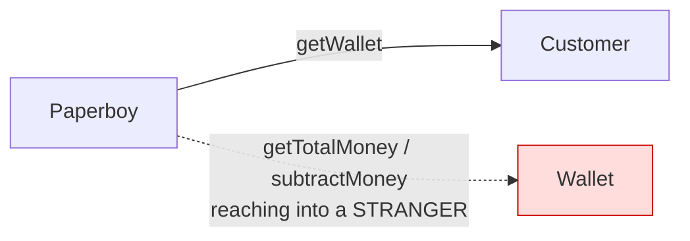
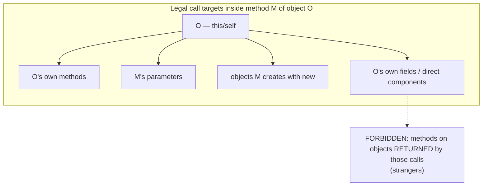
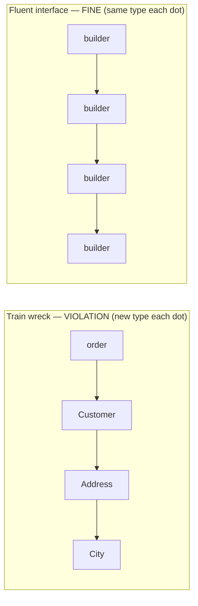

# Law of Demeter — Junior

> **Category:** [Design Principles](../../README.md) — the Principle of Least Knowledge: a method should talk only to its immediate collaborators, never reach through them into a stranger's internals.

---

## Introduction

> Focus: **What is it?** and **How to use it?**

The **Law of Demeter (LoD)**, also called the **Principle of Least Knowledge**, is a single, blunt piece of advice about *who an object is allowed to talk to*:

> **Only talk to your immediate friends. Don't talk to strangers.**

Concretely: a method should call methods on a small, known set of nearby objects — the object it belongs to, the arguments it was handed, the objects it makes itself — and should **not** go digging through one object to reach a *second* object behind it, and then call methods on *that*.

The smell it warns against is instantly recognizable in code:

```java
order.getCustomer().getAddress().getCity().toUpperCase();
```

Every `.` after the first one (`order.getCustomer()`) reaches one level *deeper* into a chain of objects the caller was never supposed to know about. This is nicknamed a **train wreck** — a long line of coupled carriages — and the Law of Demeter exists to stop you from writing it.

### Why this matters

That chain looks harmless, but it quietly **couples your method to the shape of an entire object graph**. Your method now "knows" that an order has a customer, that a customer has an address, and that an address has a city. If *any* of those relationships changes — a customer gets multiple addresses, an address splits city into city-and-region — your line breaks, even though your method only ever cared about a city name. You took a dependency on four classes to use one string.

The Law of Demeter is one of the simplest, most mechanical rules for **keeping coupling low** (see [Minimise Coupling](../01-minimise-coupling/junior.md)). You can often spot a violation by eye — count the dots — which makes it a great first principle to internalize.

---

## Prerequisites

- **Required:** Comfort with objects, methods, and method chaining (`a.b().c()`).
- **Required:** A feel for **encapsulation** — that an object hides its internal data behind methods. (See [Encapsulate What Changes](../../03-module-and-class/01-encapsulate-what-changes/).)
- **Helpful:** The intuition that **coupling** = "how much a change in one place forces a change in another." (See [Minimise Coupling](../01-minimise-coupling/junior.md).)

---

## Glossary

| Term | Definition |
|------|-----------|
| **Law of Demeter (LoD)** | A method may only call methods on a restricted set of "nearby" objects; don't reach through one object into another. |
| **Principle of Least Knowledge** | Another name for LoD — a unit should know as little as possible about the structure of *other* units. |
| **Immediate friend / collaborator** | An object your method is directly allowed to talk to: itself, its fields, its parameters, or objects it creates. |
| **Stranger** | An object you only reach *through* another object (e.g., the `City` you get from `order.getCustomer().getAddress()`). |
| **Train wreck** | A long chain of calls `a.getB().getC().getD()…` — the visual symptom of an LoD violation. |
| **Tell, Don't Ask** | Push the behavior to the object that owns the data, instead of pulling the data out to act on it elsewhere. |
| **Delegation / wrapper method** | A method on object A that forwards a request to A's internal collaborator, so callers don't reach past A. |
| **Fluent interface** | A chain like `builder.a().b().c()` where each call returns *the same kind of object* to be configured further — looks like a train wreck but is **not** an LoD violation. |

---

## The Origin: "Don't Talk to Strangers"

The Law of Demeter was coined in **1987** at **Northeastern University**, by **Ian Holland** and **Karl Lieberherr**, while they worked on the **Demeter Project** — an effort to build software whose structure adapted cleanly to change. (Demeter was the Greek goddess of agriculture; the project was about "growing" software, hence the name.)

It is not a "law" in the sense of physics or mathematics. It is a **style rule / guideline** — a coding convention the team adopted to keep their objects loosely coupled. The catchphrase that made it famous is the one to remember:

> *"Only talk to your immediate friends; don't talk to strangers."*

The word "least" in **Principle of Least Knowledge** is the heart of it: each method should require **the least possible knowledge** about the wider object graph to do its job. The less your method knows about what's connected to what, the less can break it.

---

## The Formal Rule: Four Legal Call Targets

Informal "count the dots" is a good *smell detector*, but the actual rule is precise. Inside a method `M` belonging to an object `O`, `M` may **only call methods on**:

> 1. **`O` itself** (the current object — `this` / `self`).
> 2. **`M`'s parameters** (objects passed into the method).
> 3. **Objects `M` creates or instantiates** (anything `M` constructs with `new`).
> 4. **`O`'s direct component objects** — the objects held in `O`'s own instance variables (its fields).

And — the crucial restriction — **`M` may *not* call methods on objects *returned* by any of those calls.** The return value of a friend's method is a *stranger*. You may call your friend; you may not call your friend's friends.

```
       Inside method M of object O, you may call methods on:

   ┌────────────────────────────────────────────────────────┐
   │  (1) O itself ............... this.helper()             │  ← your own methods
   │  (2) M's parameters ......... arg.doSomething()         │  ← what you were handed
   │  (3) objects M creates ...... new Thing().run()         │  ← what you made
   │  (4) O's own fields ......... this.engine.start()       │  ← your direct parts
   └────────────────────────────────────────────────────────┘

   FORBIDDEN: methods on what those return —
       O.getEngine().getStarter().crank()
                     └──────────┘ └──────┘
                       stranger    stranger
```

A memorable rephrasing (sometimes called the "one dot rule," with caveats below): **you can play with the toys you own or were given; you can't reach into someone else's toy box and play with *their* toys.**

---

## The Train Wreck Smell

The everyday symptom of an LoD violation is the **train wreck** — a long string of `getX().getY().getZ()`:

```java
// TRAIN WRECK — each dot past the first reaches into a new stranger
String city = order.getCustomer().getAddress().getCity().toUpperCase();
//             ╰friend╯ ╰─stranger─╯ ╰─stranger─╯ ╰stranger╯
```

Why is every dot past the first a problem? Because each one **leaks knowledge of the object graph's shape into the caller**:

| The caller now "knows"… | …which couples it to… |
|---|---|
| an `Order` has a `Customer` | the `Order → Customer` relationship |
| a `Customer` has an `Address` | the `Customer → Address` relationship |
| an `Address` has a `City` | the `Address → City` relationship |

That's **four classes** the method depends on, to compute **one** uppercase string. If the data model changes anywhere along the chain, this line — and every line like it scattered through the codebase — breaks. The caller has become *fragile* to changes it has no business caring about.

> The deeper the chain, the more of the system's structure your one line has memorized — and the more places a refactor will hurt.

---

## "Tell, Don't Ask": The Positive Counterpart

The Law of Demeter tells you what *not* to do (don't chain through strangers). Its positive twin tells you what to do instead: **Tell, Don't Ask.**

> **Tell, Don't Ask:** Instead of *asking* an object for its data and acting on it, *tell* the object to do the work itself. Push the behavior to where the data lives.

The train-wreck line is "ask-heavy": it asks the order for its customer, asks that for its address, asks that for its city, then acts. The "tell" version moves the logic **into** the objects, so the caller just asks its immediate friend for the final answer:

```java
// ASK (train wreck): pull data out, act on it here
String city = order.getCustomer().getAddress().getCity().toUpperCase();

// TELL: ask your immediate friend for what you actually want
String city = order.shippingCity();   // Order figures it out internally
```

To make `order.shippingCity()` work, `Order` gains a small **delegation method** that forwards the question one step inward — and so does each class along the way:

```java
class Order {
    private Customer customer;                      // direct component (field)
    String shippingCity() {
        return customer.cityForShipping();          // talk to a friend (the field)
    }
}
class Customer {
    private Address address;
    String cityForShipping() {
        return address.city();                      // talk to a friend (the field)
    }
}
```

Now the caller knows only `Order`. The graph's shape (`Order → Customer → Address`) is hidden behind small forwarding methods. If `Customer` later gets multiple addresses, you change *one* method (`cityForShipping`) — not every caller.

The cost (and there is one) is those extra little forwarding methods — covered in [Trade-offs at the Middle level](middle.md). For now, learn the move: **don't reach; ask your direct friend, and let it reach for you.**

---

## The Paperboy and the Wallet

The classic example that makes LoD click is the **Paperboy and the Wallet** (popularized by David Bock). A paperboy needs to collect payment from a customer.

### The violation: the paperboy reaches into the wallet

```java
class Paperboy {
    void collectPayment(Customer customer, int amountDue) {
        Wallet wallet = customer.getWallet();   // reach into a stranger…
        int cash = wallet.getTotalMoney();      // …and rummage through it
        if (cash >= amountDue) {
            wallet.subtractMoney(amountDue);     // take the money yourself
            paymentReceived(amountDue);
        } else {
            // not enough — come back tomorrow
        }
    }
}
```

Look at what the paperboy is doing in the real world: he **reaches into the customer's pocket, pulls out the wallet, opens it, counts the cash, and takes what he's owed.** No real paperboy does this — it would be absurd and rude. In code terms, `Paperboy` now depends on `Wallet`'s entire interface (`getTotalMoney`, `subtractMoney`) and on the fact that a `Customer` *has* a wallet at all. If the customer pays by phone next year, the paperboy breaks.



### The fix: tell the customer to pay

A real paperboy says *"that'll be two dollars"* and the **customer** handles their own wallet. Tell, don't ask:

```java
class Paperboy {
    void collectPayment(Customer customer, int amountDue) {
        Payment payment = customer.pay(amountDue);   // TELL the customer to pay
        if (payment != null) {
            paymentReceived(payment.amount());
        }
    }
}

class Customer {
    private Wallet wallet;                            // the wallet is the customer's own business
    Payment pay(int amount) {
        if (wallet.hasAtLeast(amount)) {             // Customer talks to ITS OWN wallet
            wallet.subtract(amount);
            return new Payment(amount);
        }
        return null;                                  // can't pay right now
    }
}
```

Now `Paperboy` knows only `Customer` (its parameter) and `Payment` (which `Customer` returns to it — though it only reads `.amount()`). It has **no idea a wallet exists.** The wallet is the customer's private concern. Swap the wallet for a credit card, a phone app, or an IOU, and the paperboy code never changes. That is the Law of Demeter paying off: **less knowledge, less coupling, less breakage.**

---

## The Critical Nuance: Train Wreck vs. Fluent Interface

This is the single most important distinction in the whole topic, and the one beginners get wrong. **Not every chain of dots is an LoD violation.** Some chains *look* exactly like a train wreck but are perfectly fine.

Compare these two lines:

```java
// (A) TRAIN WRECK — VIOLATION
order.getCustomer().getAddress().getCity();

// (B) FLUENT BUILDER — NOT a violation
new StringBuilder().append("a").append("b").append("c").toString();
```

They have the same *shape* (`x.a().b().c()`), so why is one bad and one fine? Look at **what each call returns**:

| | Train wreck (A) | Fluent interface (B) |
|---|---|---|
| `getCustomer()` returns… | a **different** object (`Customer`) — a *stranger* | — |
| `append("a")` returns… | — | **the same `StringBuilder`** you started with |
| Each step exposes… | a new, unrelated internal object | the *same* object, ready for the next call |
| You are navigating… | through someone else's **object graph** | one object's own **configuration steps** |

In a **fluent interface** (also called *method chaining* for configuration, as in builders), each method returns `this` — the *same object* (or one designed to be chained). You are not reaching through one object into a second, third, and fourth stranger. You are repeatedly talking to **one immediate friend.** No new structural knowledge leaks in.

```
TRAIN WRECK: each dot reaches a NEW stranger
   order ──▶ Customer ──▶ Address ──▶ City      (4 different types!)

FLUENT:      each dot returns the SAME object
   builder ─▶ builder ──▶ builder ──▶ builder   (1 type, configured)
```

> **The test:** does the chain hop across *different* types, reaching deeper into an object graph (violation)? Or does it return *the same type* you already hold, just configured further (fine)? **LoD is about navigating to strangers, not about counting dots.**

This is why "count the dots" is only a rough *smell detector*, not the real rule. A builder with ten dots is fine; a train wreck with two dots can be a violation. We'll sharpen exactly *why* (objects vs. data structures) at the [Middle](middle.md) and [Senior](senior.md) levels.

---

## Real-World Analogies

| Concept | Analogy |
|---|---|
| **Don't talk to strangers** | You ask a coworker for a report. You don't walk to *their* manager's office, open *that* person's filing cabinet, and pull it yourself. You ask your contact; they handle their own chain. |
| **The paperboy reaching into the wallet** | A waiter who, instead of bringing you the bill, reaches into your jacket, takes your wallet, and removes the cash. Absurd — you should be *told* the total and pay yourself. |
| **Tell, Don't Ask** | A good manager says "ship this order" (tells), not "give me the order's customer's address's postcode so *I* can label it" (asks for the parts). |
| **Fluent interface is not a violation** | Ordering a coffee: "large, oat milk, extra shot" is one conversation with one barista (same object, configured) — not you walking into the supplier's warehouse and the dairy farm. |
| **Knowledge leak from chaining** | Memorizing the entire org chart just to send one email. When anyone reorganizes, your memorized path is wrong. |

---

## Mental Models

**The intuition:** *"Ask your direct friend for the answer; never reach through your friend to grab their friend, and then their friend's friend."*

```
   GOOD (least knowledge)         BAD (train wreck)
   ┌─────────┐                    ┌─────────┐
   │  YOU    │                    │  YOU    │
   └────┬────┘                    └────┬────┘
        │ ask one friend               │ reach…
   ┌────▼────┐                    ┌────▼────┐
   │ FRIEND  │ (handles the rest) │ friend  │
   └─────────┘                    └────┬────┘
                                       │ …through to a stranger
                                  ┌────▼────┐
                                  │STRANGER │ ← you now depend on this
                                  └────┬────┘
                                       │ …and another
                                  ┌────▼────┐
                                  │STRANGER │ ← and this
                                  └─────────┘
```

A second model: **each dot is a unit of knowledge.** `a.b()` says "I know `a` has a `b`." `a.b().c()` says "I also know `b` has a `c`" — knowledge about a relationship you don't own. Every extra dot into a *new* type is another fact your method has memorized and can be broken by.

---

## Code Examples

### Python — train wreck → tell, don't ask

```python
# BEFORE — reaching through strangers to apply a discount
def total_with_discount(order):
    rate = order.get_customer().get_membership().get_tier().discount_rate()
    return order.subtotal() * (1 - rate)

# AFTER — tell the order; it knows how to discount itself
def total_with_discount(order):
    return order.discounted_total()

class Order:
    def discounted_total(self):
        return self.subtotal() * (1 - self._customer.discount_rate())

class Customer:
    def discount_rate(self):
        return self._membership.discount_rate()   # Customer asks its OWN membership
```

The caller now depends only on `Order`. The `Customer → Membership → Tier` chain is hidden behind one-step forwarding methods.

### TypeScript — a fluent interface that is NOT a violation

```typescript
// This is a long chain, but every call returns `this` (the SAME builder).
// It is method chaining for configuration — NOT a Law of Demeter violation.
const query = new QueryBuilder()
  .select("id", "name")
  .from("users")
  .where("active", true)
  .orderBy("name")
  .limit(10);

class QueryBuilder {
  select(...cols: string[]): this { /* ...store... */ return this; }
  from(table: string): this       { /* ...store... */ return this; }
  where(c: string, v: unknown): this { /* ...store... */ return this; }
  orderBy(col: string): this      { /* ...store... */ return this; }
  limit(n: number): this          { /* ...store... */ return this; }
}
```

Ten dots, zero violations — you talk to one `QueryBuilder` the entire time. Don't "fix" code like this; it isn't broken.

### Java — the dot count lies; look at the types

```java
// 2 dots — but a VIOLATION (hops Order → Customer → String, a stranger)
String name = order.getCustomer().getName();

// 4 dots — but FINE (Optional fluent API; same Optional flows through)
String name = orders.stream()
                    .filter(Order::isPaid)
                    .findFirst()
                    .map(Order::summary)
                    .orElse("none");
```

The first reaches into a second object (`Customer`) to read its field. The second is a fluent pipeline where each step transforms and returns a stream/`Optional` you already hold. **Count types crossed, not dots.**

---

## Best Practices

1. **Ask your immediate friend, not its friends.** If you need data two objects away, add a method on the nearer object that fetches it for you (`order.shippingCity()`).
2. **Prefer "tell" over "ask."** Move behavior to the object that owns the data instead of pulling the data out to act on it elsewhere.
3. **Treat long `getX().getY()` chains as a smell** worth a second look — *not* an automatic crime, but a prompt to check whether you're reaching into strangers.
4. **Never "fix" a fluent interface or builder.** If every call returns the same object type, the chain is fine; leave it.
5. **Hide collaborators behind your own methods.** If callers keep doing `obj.getThing().doStuff()`, give `obj` a `doStuffWithThing()` and stop exposing the inner thing.

---

## Common Mistakes

1. **Treating every dot as a violation.** The rule is about reaching into *strangers*, not about the number of dots. Builders and fluent APIs are fine.
2. **"Fixing" a fluent interface** by breaking it into multiple statements — pure noise; it was never a violation.
3. **Exposing internals with getters** so callers can chain through them (`getEngine()`, `getStarter()`). Each such getter is an invitation to a train wreck.
4. **Asking instead of telling** — pulling an object's data out and computing on it elsewhere, when the object should do the computation itself.
5. **Over-applying it to plain data.** Chaining through a config map or a JSON structure (`config["db"]["host"]`) is usually fine — LoD is mainly about *objects with behavior*, not pure data (see [Middle](middle.md)).

---

## Tricky Points

- **"Count the dots" is a heuristic, not the law.** It catches many violations and produces false positives on fluent interfaces. Always confirm by asking *"does this chain reach into a different, deeper object?"*
- **A fluent interface returns the same object type each step; a train wreck returns a new, deeper object each step.** This is *the* distinction to memorize. (Detailed at [Middle](middle.md).)
- **LoD applies to objects with behavior, not pure data structures.** Walking through a tree, a map, or a DTO is not a violation — there's no encapsulation to break. (Explored at [Middle](middle.md) and [Senior](senior.md).)
- **The fix has a cost:** lots of little delegation/wrapper methods. Don't worry about that yet, but know it exists — the trade-off is the [Middle](middle.md)-level topic.

---

## Test Yourself

1. State the Law of Demeter in one sentence (the "friends" phrasing).
2. List the four kinds of object a method `M` of object `O` is allowed to call methods on.
3. Why is each dot past the first in `a.getB().getC().getD()` a problem?
4. What is "Tell, Don't Ask," and how does it relate to LoD?
5. Why is `builder.a().b().c()` **not** an LoD violation even though it has three dots?
6. In the paperboy example, what was the violation, and what was the fix?

---

## Cheat Sheet

```text
LAW OF DEMETER (Principle of Least Knowledge)
  "Only talk to your immediate friends; don't talk to strangers."

LEGAL CALL TARGETS inside method M of object O:
  1. O itself (this/self)
  2. M's parameters
  3. objects M creates (new …)
  4. O's own fields (direct components)
  → NOT objects RETURNED by any of those.

SMELL:  a.getB().getC().getD()  ← "train wreck" (each dot = new stranger)
FIX:    Tell, Don't Ask — push behavior into the object; add a delegating
        method so callers ask ONE friend (order.shippingCity()).

NOT A VIOLATION:  builder.a().b().c()  — same object returned each step
                  (fluent interface / method chaining for config)

TEST:   does the chain hop to a DIFFERENT, DEEPER type? → violation
        does each step return the SAME type? → fine
        count TYPES crossed, not DOTS.
```

---

## Summary

- The **Law of Demeter** (Principle of Least Knowledge): *only talk to your immediate friends; don't talk to strangers.* Coined 1987 at Northeastern by Holland & Lieberherr (the Demeter Project).
- **Formal rule:** a method may call methods only on `this`, its parameters, objects it creates, and its own fields — **not** on objects those calls return.
- The **train wreck** `a.getB().getC().getD()` is the smell: each dot past the first leaks knowledge of the object graph's shape into the caller, coupling it to classes it shouldn't care about.
- **Tell, Don't Ask** is the cure: push behavior to the object that owns the data, and add small delegation methods so callers ask one friend.
- The **Paperboy and Wallet** shows it: don't reach into the customer's wallet — *tell the customer to pay.*
- **Critical nuance:** a **fluent interface / builder** (`builder.a().b().c()`) returns the *same* object each step and is **not** a violation. Count *types crossed*, not dots.

---

## Further Reading

- Ian Holland & Karl Lieberherr, *Object-Oriented Programming: An Objective Sense of Style* (OOPSLA '88) — the original Law of Demeter paper.
- David Bock, *The Paperboy, The Wallet, and The Law Of Demeter* — the canonical worked example.
- Andrew Hunt & David Thomas, *The Pragmatic Programmer* — LoD, "decoupling," and the objects-vs-data nuance.
- Martin Fowler, [GetterEradicator](https://martinfowler.com/bliki/GetterEradicator.html) and [FluentInterface](https://martinfowler.com/bliki/FluentInterface.html) — Tell-Don't-Ask and why fluent chains differ.

---

## Related Topics

- **Sibling principles:** [Minimise Coupling](../01-minimise-coupling/junior.md), [Connascence](../03-connascence/junior.md)
- **Underlying idea:** [Encapsulate What Changes](../../03-module-and-class/01-encapsulate-what-changes/)
- **Reinforces:** [Single Responsibility (SRP)](../../04-solid/01-srp-single-responsibility/junior.md)

---

## Diagrams






---

## Check your understanding

1. Explain Law of Demeter — Junior Level in your own words and name the problem it solves.
2. How would you apply the ideas around Table of Contents, Introduction, Prerequisites in a realistic engineering change?
3. What failure mode or misuse should you look for, and what evidence would reveal it?
4. What small example would prove that you can apply Law of Demeter — Junior Level correctly?
5. What observable result would convince you that the approach improved the system?
