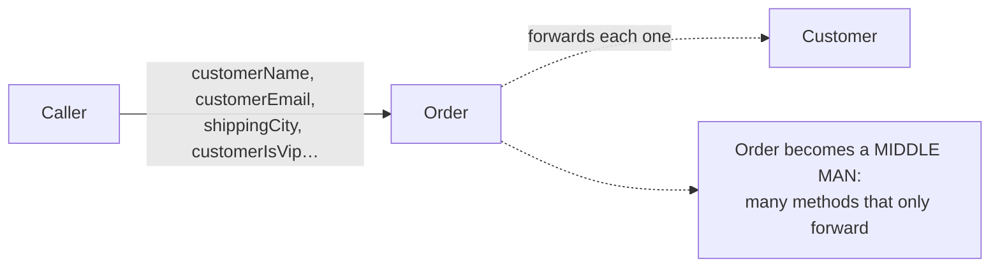
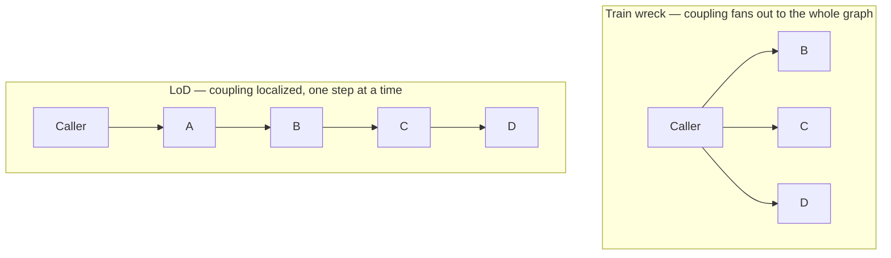
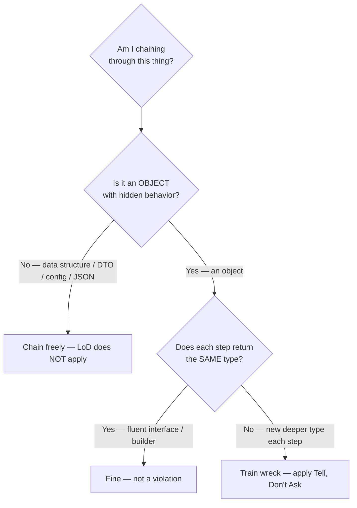
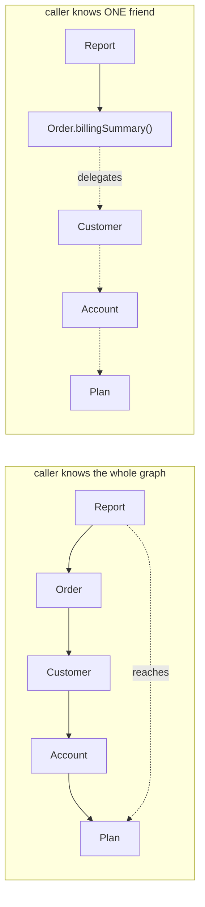

# Law of Demeter — Middle

> **Category:** [Design Principles](../../README.md) — the Principle of Least Knowledge: a method should talk only to its immediate collaborators, never reach through them into a stranger's internals.

> **Prerequisite:** [Junior](junior.md)
> **Focus:** **Why** and **When**

---

## Introduction

> Focus: **Why** and **When**

At the junior level, the Law of Demeter is a rule you apply: *don't chain through strangers; tell, don't ask.* At the middle level it becomes a set of **judgement calls**, because the naive rule, applied mechanically, is actively harmful. Two questions decide every case:

1. **Is the thing I'm chaining through an *object* (with behavior to protect) or a *data structure* (just bundled data)?** LoD applies to the first and *not* the second.
2. **Is this chain navigating to *strangers*, or is it a *fluent interface* returning the same object?** Only the first violates LoD.

Miss either distinction and you'll do real damage: wrapping every getter behind a delegating method, "fixing" builders, and turning clean data traversal into a forest of pointless forwarding calls. The middle-level skill is knowing **when LoD earns its keep and when it's noise** — and the deciding factor is almost always *objects vs. data*.

---

## The Two Refinements That Make LoD Usable

The original LoD is a great instinct wrapped around a dangerous literal reading. Two refinements (both from **Andrew Hunt & David Thomas**, *The Pragmatic Programmer*, and echoed by Martin Fowler) turn it from a blunt instrument into a usable principle:

| Naive LoD | Refined LoD |
|---|---|
| "Never write more than one dot." | "Don't *reach through* an object to its internals; talking to the same object repeatedly (fluent) is fine." |
| Applies to every chain. | Applies to **objects with behavior**, not to **pure data structures**. |
| Wrap every collaborator. | Wrap a collaborator only when doing so genuinely hides a *behavioral* dependency. |

> The Pragmatic Programmer's own framing softened over the years: the point isn't *literally* "one dot," it's *"minimize the knowledge each module has of others."* The dot-counting was always a teaching shortcut, not the principle.

The rest of this file is, in effect, these two refinements worked out in detail — because getting them right is the whole game.

---

## Objects vs. Data Structures — the Decisive Distinction

This is the single most important idea at this level. **The Law of Demeter applies to objects, not to data structures.** (The clearest statement of this is in *Clean Code* and *The Pragmatic Programmer*.)

What's the difference?

> An **object** *hides* its data and *exposes behavior*. Its getters are an implementation leak — every one you call binds you to its internal structure. Reaching through it (`order.getCustomer().getWallet()`) defeats the encapsulation it exists to provide.
>
> A **data structure** (a record, struct, DTO, map, tree node, JSON) *exposes* its data and has little or no behavior. There's nothing to encapsulate — chaining through it reveals no secret, because it has none.

So:

```python
# OBJECT — has behavior, hides data. Chaining VIOLATES LoD:
amount = account.getOwner().getWallet().getBalance()   # reaching into hidden internals

# DATA STRUCTURE — pure data, no behavior. Chaining is FINE:
host = config["database"]["replica"]["host"]           # just navigating data
city = response.user.address.city                      # parsed JSON / a DTO — fine
node = tree.left.right.value                            # walking a tree — fine
```

Why the asymmetry? Because LoD protects **encapsulation** (see [Encapsulate What Changes](../../03-module-and-class/01-encapsulate-what-changes/)). An object's whole purpose is to hide *how* it does things behind *what* it does; reaching through its getters re-exposes the "how" and couples you to it. A data structure has no "how" to hide — its shape *is* its public contract. Forwarding-method-wrapping a data structure adds ceremony that protects nothing.

> **The test:** *Does the thing I'm chaining through hide behavior behind its data?* If yes (an object) → respect LoD, don't reach through it. If no (a data structure) → chain freely; there's no encapsulation to violate.

A subtle but practical corollary: **don't half-build hybrids.** A class that's mostly data but sprinkled with a few methods (an "object-ish data structure") creates exactly the confusion LoD wants to avoid — readers can't tell whether chaining is allowed. Decide what each type *is* and keep it that way.

---

## Fluent Interfaces vs. Train Wrecks, Precisely

The junior file gave the rule of thumb (same type vs. new deeper type). Here's the precise mechanism, because this is where false positives come from.

A **train wreck** is a *navigation* chain: each call returns a **different, more deeply nested object** that the previous one owns. You are walking *down an ownership graph* you don't own:

```java
order.getCustomer().getAddress().getCity()   // Order ▸ Customer ▸ Address ▸ City
//   each return value is a distinct, deeper object the caller shouldn't know
```

A **fluent interface** is a *configuration / transformation* chain: each call returns **the same object** (or a peer of the same conceptual type), expressly designed to be chained. You are not navigating *into* anything — you keep talking to one collaborator:

```java
StringBuilder sb = new StringBuilder().append("a").append("b");   // returns `this`
stream.filter(p).map(f).collect(toList());                        // returns Stream<…>
LocalDate.now().plusDays(3).withDayOfMonth(1);                    // returns LocalDate
```

| Property | Train wreck (violation) | Fluent interface (fine) |
|---|---|---|
| Return value | a *different, deeper* object | *the same* object / a peer of the same type |
| Intent of the chain | **navigate** an object graph | **configure** or **transform** one thing |
| Designed to be chained? | No — getters returning internals | **Yes** — methods deliberately return `this`/self |
| Knowledge leaked | structure of the graph (A has B has C) | none — you knew `StringBuilder` already |
| Breaks when… | any relationship in the graph changes | (it doesn't — same type throughout) |

> **The deciding question is not "how many dots" but "am I reaching into deeper strangers, or repeatedly addressing one friend?"** Fluent APIs (builders, streams, query DSLs, immutable date math) are designed for chaining and leak no structural knowledge. They are categorically *not* LoD violations, and "fixing" them is a mistake.

---

## The Cost: Middle-Man / Wrapper Methods

LoD is not free. The honest cost is **delegation methods** — small forwarding methods you add so callers don't reach through you:

```java
class Order {
    private Customer customer;
    // To honor LoD, Order grows forwarding methods for things callers used to chain to:
    String customerName()      { return customer.name(); }
    String customerEmail()     { return customer.email(); }
    String shippingCity()      { return customer.shippingCity(); }
    boolean customerIsVip()    { return customer.isVip(); }
    // ...one per question callers want to ask "through" the order.
}
```

Pushed too far, this produces the **Middle Man** smell (Fowler): a class whose methods do nothing but forward to a single collaborator. The interface **bloats** — `Order` accumulates dozens of `customerX()` pass-throughs and starts to *look* like it has all of `Customer`'s responsibilities. You've traded *structural* coupling (the train wreck) for *interface* bloat (the wide delegating surface).



This cost is the reason LoD is a *heuristic*, not an absolute. The right amount of delegation is "enough to hide a *behavioral* dependency you actually want to hide," not "wrap every conceivable getter." When you find yourself forwarding *most* of a collaborator's interface, that's a signal the responsibility might belong on the collaborator, or that the two classes should be merged — see [Feature Envy](#lod-feature-envy-and-where-behavior-belongs) below. The deeper trade-off (how much delegation is too much) is the [Senior](senior.md)-level topic.

---

## When LoD Conflicts With DTOs and Data Transfer

A very common, legitimate pattern that *looks* like an LoD violation: navigating a **DTO** (Data Transfer Object) or a parsed API response.

```typescript
// Parsed JSON response — this is a DATA STRUCTURE, not an object with behavior.
const city = response.data.order.shippingAddress.city;   // FINE — not a violation
```

Wrapping this in delegation methods (`response.getOrderShippingCity()`) would be **wrong**: a DTO's entire job is to *expose* its fields for transport. It has no behavior to protect, no encapsulation to defend. Forcing LoD here:

- adds forwarding methods that protect nothing,
- fights the DTO's purpose (it *exists* to be read field-by-field),
- and makes the code *harder* to read, not easier.

> **DTOs, value records, config trees, and parsed payloads are data structures. LoD does not apply.** Chain through them freely. The conflict is only apparent — it dissolves once you classify the type as *data*, not *object*.

This is also why "anemic" data-transfer layers and rich domain layers should be **kept separate**: the rules for chaining differ between them, and mixing data and behavior in one type makes "may I chain here?" unanswerable.

---

## LoD, Feature Envy, and Where Behavior Belongs

A train wreck is very often the symptom of a deeper smell: **Feature Envy** — a method that's more interested in *another* object's data than its own.

```python
# Feature Envy: this method ENVIES Customer/Address — it pokes at their data
def shipping_label(order):
    return (order.customer.address.street + "\n" +
            order.customer.address.city + " " +
            order.customer.address.postcode)
```

This method spends all its time reaching into `Address`'s fields. The Law of Demeter and Feature Envy point at the *same* cure: **move the behavior to the data it envies.**

```python
class Address:
    def as_label(self):                       # behavior now lives WITH the data
        return f"{self.street}\n{self.city} {self.postcode}"

class Order:
    def shipping_label(self):
        return self._customer.shipping_label()  # one step inward

class Customer:
    def shipping_label(self):
        return self._address.as_label()        # one step inward
```

> Train wrecks, Feature Envy, and "ask-heavy" code are three views of the same problem: **behavior sitting far from the data it operates on.** Fixing LoD by relocating behavior (Tell, Don't Ask) usually kills the Feature Envy at the same time. (See [code-smell-detection] in the craftsmanship track.)

This connection is also why **LoD reinforces the Single Responsibility Principle** ([SRP](../../04-solid/01-srp-single-responsibility/junior.md)): each object owns the behavior over *its own* data, so responsibilities stay where the data is.

---

## How LoD Lowers Coupling

Mechanically, every dot into a *new* type is a dependency. A train wreck `a.getB().getC().getD()` makes the calling method depend on **four** types and **three** relationships. The Tell-Don't-Ask rewrite makes it depend on **one** type (`a`) and **zero** exposed relationships. That's the coupling reduction, made concrete.

In the vocabulary of [Connascence](../03-connascence/junior.md): a train wreck spreads **connascence of name and type across module boundaries** — the caller is connascent with `B`, `C`, and `D` even though it never wanted to be. Collapsing the chain into `a.answer()` **localizes** that connascence: only `A` is connascent with `B`, only `B` with `C`, and so on. Connascence is "better" when it's more *local*, and LoD is one of the simplest tools for localizing it. (This is deepened at [Senior](senior.md).)



---

## A Worked Refactor

A reporting method that's a textbook train wreck:

```java
// BEFORE — couples the report to Order → Customer → Account → Plan → BillingCycle
class InvoiceReport {
    String summarize(Order order) {
        String tier = order.getCustomer().getAccount().getPlan().getName();
        int days = order.getCustomer().getAccount().getPlan()
                        .getBillingCycle().getDays();
        return tier + " billed every " + days + " days";
    }
}
```

`InvoiceReport` now knows the entire billing object graph. Any change — a customer with multiple accounts, a plan without a billing cycle — breaks it. Apply Tell, Don't Ask, pushing each question one step inward:

```java
// AFTER — each object answers about its OWN parts
class InvoiceReport {
    String summarize(Order order) {
        return order.billingSummary();          // ask ONE friend
    }
}
class Order {
    private Customer customer;
    String billingSummary() { return customer.billingSummary(); }
}
class Customer {
    private Account account;
    String billingSummary() { return account.billingSummary(); }
}
class Account {
    private Plan plan;
    String billingSummary() {
        return plan.name() + " billed every " + plan.billingCycleDays() + " days";
    }
}
class Plan {
    private BillingCycle cycle;
    int billingCycleDays() { return cycle.days(); }
}
```

`InvoiceReport` now depends only on `Order`. The summary logic lives in `Account`, next to the `Plan` it actually concerns. **Note the cost is visible here too:** several one-line delegating methods appeared. For this chain, the trade is worth it — the report is decoupled from four classes. Whether it's *always* worth it is the senior judgement call.

---

## When NOT to Apply It

LoD is a heuristic; here are the cases where applying it is *wrong*:

1. **Pure data structures / DTOs / config / parsed JSON.** No encapsulation to protect — chain freely.
2. **Fluent interfaces, builders, streams, query DSLs, immutable value math** (`date.plusDays(3).withHour(9)`). Same object flows through — not a violation.
3. **Standard-library / framework idioms** designed for chaining (LINQ, Java Streams, jQuery, RxJS pipelines). These are fluent by design.
4. **When delegation would bloat the interface more than the chain costs.** If honoring LoD means adding twenty pass-through methods to expose one rarely-used inner field, the cure is worse than the disease — leave a *short*, localized chain.
5. **Test setup / builders for fixtures**, where chaining is the point and there's no production coupling at stake.

> The unifying rule: **apply LoD to behavioral coupling through objects; skip it for navigation through data and for chains designed to be chained.**

---

## Trade-offs

| | Honor LoD (delegate / tell) | Allow the chain |
|---|---|---|
| Coupling | Low — caller knows one type | High — caller knows the whole graph |
| Resilience to graph changes | High — change one forwarding method | Low — every chained caller breaks |
| Interface size | Larger — delegating methods accumulate | Smaller — no wrappers |
| Readability of the caller | High (`order.billingSummary()`) | Lower (long navigational chain) |
| Risk | **Middle Man** smell if overdone | Fragile, structure-coupled callers |
| Best when | Chaining through **objects** with behavior | Chaining through **data structures** |

The asymmetry to remember: a train wreck is cheap to *write* and expensive to *change*; delegation is mildly expensive to write and cheap to change. For code that will be maintained, the delegation usually wins — *unless* you're chaining through data, where there's no coupling to pay down in the first place.

---

## Edge Cases

### 1. Chaining that crosses object→data boundaries

`order.getLineItems().get(0).getSku()` — `getLineItems()` returns a `List` (data structure), and indexing/reading it is fine. The *only* question is whether `Order` should expose its line items at all (an object decision) and whether `LineItem` is an object or a record. Classify each hop.

### 2. The "manager of managers" delegation explosion

If a facade forwards forty methods to five collaborators, LoD is technically satisfied but you've built a god-facade. The fix isn't more delegation — it's redistributing responsibility so callers talk to the right object directly. (Senior topic.)

### 3. Languages with structural access

Go structs and Python objects often blur object/data. A `struct` used as a bag of fields is a data structure (chain freely); the same struct with methods that enforce invariants is an object (respect LoD). The *role* decides, not the syntax.

---

## Tricky Points

- **LoD is about *behavioral* coupling, not punctuation.** The number of dots is a smell detector with false positives; the real test is "am I reaching into a hidden internal?"
- **Objects vs. data structures is the master key.** Almost every "is this a violation?" question dissolves once you classify the type. Memorize this above all.
- **Delegation can overshoot into Middle Man.** Honoring LoD by forwarding *everything* trades one smell for another. Delegate to hide a real dependency, not reflexively.
- **Fluent ≠ train wreck even with many dots; train wreck ≠ fine even with two.** Type-crossing, not dot-counting.
- **DTOs deliberately violate "naive" LoD and that's correct.** Their job is to expose fields. Don't wrap them.
- **The Pragmatic Programmer's own nuance:** the principle is "least *knowledge*," and walking a data structure leaks no behavioral knowledge — so it's allowed.

---

## Best Practices

1. **Classify before you judge:** is the chained-through thing an *object* (respect LoD) or a *data structure* (chain freely)?
2. **Confirm fluent vs. train wreck by return type:** same type each step = fluent = fine; new deeper type = train wreck = smell.
3. **Fix train wrecks with Tell, Don't Ask** — move behavior to the data, add one-step delegation, don't expose inner collaborators.
4. **Delegate to hide a *behavioral* dependency**, not to mechanically wrap every getter — watch for the Middle Man smell.
5. **Don't wrap DTOs, config, or parsed payloads.** LoD does not apply to data.
6. **Treat a train wreck as a Feature Envy alarm:** the behavior probably wants to move closer to the data.
7. **Keep data types and behavior-rich types separate** so "may I chain here?" always has a clear answer.

---

## Test Yourself

1. State the single distinction that decides most LoD questions, and why it works.
2. Why is `config["db"]["host"]` not a violation but `order.getCustomer().getWallet()` is?
3. What is the Middle Man smell, and how does over-applying LoD cause it?
4. Why is wrapping a DTO in delegation methods the wrong move?
5. How are a train wreck and Feature Envy two views of the same problem?
6. Give the precise difference between a fluent interface and a train wreck (not "dot count").

---

## Summary

- The naive "one dot" rule is dangerous; two refinements (Hunt & Thomas) make LoD usable: it's about **not reaching into objects' internals**, and it applies to **objects, not data structures**.
- **Objects vs. data structures** is the decisive distinction: objects hide behavior (respect LoD); data structures, DTOs, config, and parsed JSON expose data (chain freely — there's no encapsulation to violate).
- **Fluent interfaces** (same object returned each step) are *not* violations even with many dots; **train wrecks** (new deeper object each step) are. Count *types crossed*, not dots.
- The **cost** of LoD is delegation/wrapper methods, which can bloat into the **Middle Man** smell — delegate to hide a real *behavioral* dependency, not reflexively.
- A train wreck is usually **Feature Envy**: behavior living far from its data. Tell, Don't Ask relocates the behavior and fixes both — reinforcing [SRP](../../04-solid/01-srp-single-responsibility/junior.md).
- LoD lowers coupling by **localizing connascence** — turning a caller's dependency on a whole graph into a dependency on one immediate friend.

---

## Diagrams

### The decision: does LoD even apply?



### From train wreck to delegation




---

## Check your understanding

1. Explain Law of Demeter — Middle Level in your own words and name the problem it solves.
2. How would you apply the ideas around Table of Contents, Introduction, The Two Refinements That Make LoD Usable in a realistic engineering change?
3. What failure mode or misuse should you look for, and what evidence would reveal it?
4. Which local design trade-off would make you choose or reject Law of Demeter — Middle Level in an existing codebase?
5. What observable result would convince you that the approach improved the system?
