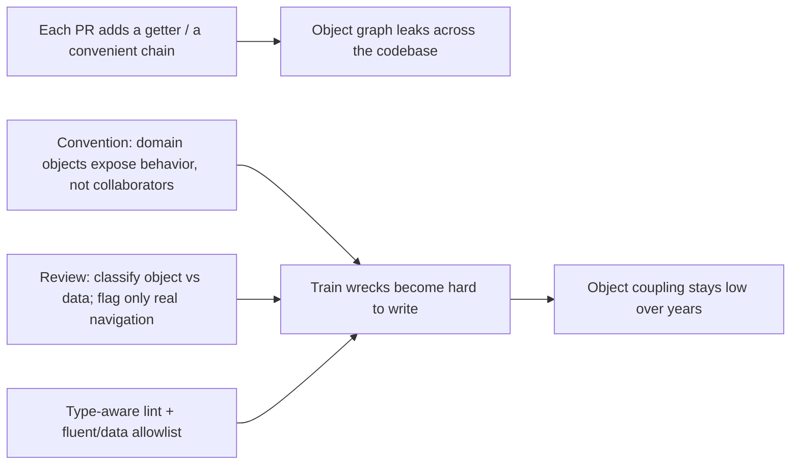
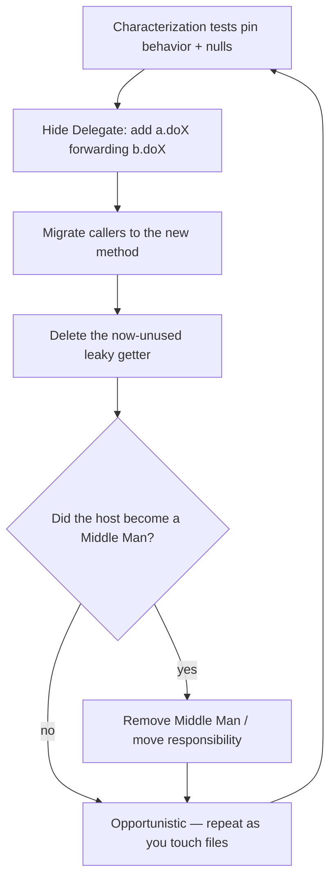

# Law of Demeter — Professional

> **Category:** [Design Principles](../../README.md) — the Principle of Least Knowledge: a method should talk only to its immediate collaborators, never reach through them into a stranger's internals.

> **Prerequisites:** [Junior](junior.md) · [Middle](middle.md) · [Senior](senior.md)
> **Focus:** **Production** — reviews, tooling, team conventions, legacy systems

---

## Introduction

> Focus: **production** — keeping object coupling low across a large, multi-contributor codebase over years.

Train wrecks are easy to spot one at a time and nearly impossible to keep out by willpower. They enter a codebase the same way all coupling does: **one reasonable-looking getter, one convenient chain, one PR at a time.** Nobody decides "let's couple the report to the billing graph"; someone just writes `order.getCustomer().getAccount().getPlan().getName()` because the getters were there and it worked.

At the professional level the question is operational: **how do you keep object coupling low when hundreds of changes land weekly from people with different instincts — without drowning the team in dogmatic "you have two dots" comments that flag every builder and DTO?** The answer is a system: review norms that target *real* violations (objects, not data; navigation, not fluent), tooling calibrated to the codebase's false-positive profile, conventions that make "may I chain here?" answerable by construction, and a disciplined way to unpick legacy train wrecks without breaking production.

The professional failure mode is **dogmatism**: a team that bans all chaining will flag streams, builders, DTOs, and config trees, generate noise, lose credibility, and get the linter disabled. Precision is the whole job.

---

## Enforcing LoD in Code Review

A reviewer applying LoD well does **not** count dots. They ask one targeting question of every chain:

> **"Is this chain reaching through an *object* into its hidden internals — and would that internal relationship be expensive to change?"**

If yes, it's a real violation worth a comment. If it's a DTO, a fluent API, a config tree, or a local cohesive read, **say nothing** — flagging it burns trust and trains the team to ignore you.

### Review by classification

1. **Classify the chained-through types.** Objects (hidden behavior) → LoD applies. Data structures / DTOs / config / parsed JSON → it doesn't; move on.
2. **Distinguish fluent from navigation.** Same type returned each step (builder, stream, `Optional`, immutable date math) → fine. New deeper type each step → candidate violation.
3. **Weigh the fix's cost.** Would delegation hide a *real* behavioral dependency, or just bloat a class into a Middle Man? If the cure is worse, leave the chain.
4. **Check for the deeper smell.** Is the train wreck Feature Envy? Should the behavior move to the data? Is there a leaky getter that should be eradicated rather than wrapped?

### Review comment templates

> "This reaches `order → customer → account → plan` to read one field. That couples the report to the whole billing graph — if a customer ever has multiple accounts, this breaks. Can `Order` expose `planName()` (or better, the summary) so the report asks one object?"

> "Heads up: this *looks* like a train wreck but `response.data.user.city` is a parsed DTO — pure data, no encapsulation to protect. This is fine as-is; please don't wrap it."

> "`builder.a().b().c()` is a fluent builder (each call returns the builder). Not an LoD issue — leave the chain."

> "Rather than `order.getCustomer().applyDiscount(...)`, consider removing `getCustomer()` and giving `Order` the behavior. The getter is what makes train wrecks possible everywhere else, too."

> "This honors LoD by passing the whole `Order` into `feeFor` — but that's stamp coupling and the chain just moved inside. Pass the `Country` value instead."

---

## Automated Detection — and Its Limits

LoD is *partially* lintable, and you should lint it — but only with the false-positive profile understood, or the team will rightly disable it.

| Tool / approach | What it catches | Limit (false positives) |
|---|---|---|
| **PMD `LawOfDemeter`** (Java) | Method calls on returned objects; chained getters | **Notoriously noisy** — flags builders, streams, `Optional`, fluent APIs, DTOs. Almost always needs heavy suppression/config. |
| **ESLint custom / `no-restricted-syntax`** | Member-expression depth | Can't tell object from data, or fluent from navigation. |
| **Custom AST lint** (type-aware) | Chains crossing **distinct nominal types** through methods returning *objects* | Best option, but needs type info and a curated "fluent/data" allowlist. |
| **Change-coupling analysis** (git) | Files that change *together* — surfaces *real* structural coupling | Indirect; flags the symptom's cost, not the chain itself. |

### The honest tooling rules

- **A naive "max two dots" or PMD `LawOfDemeter` rule run unfiltered is worse than no rule** — it floods reviews with false positives on streams, builders, and DTOs, and the team learns to ignore (then disable) it.
- **Make detection type-aware** if you can: only flag chains where each step returns a *distinct object type* (not the same fluent type) and the types are *domain objects* (not DTO/data packages). Maintain an allowlist of fluent/data namespaces (`java.util.stream`, `StringBuilder`, your `*.dto` package).
- **Lean on change-coupling instead of syntax.** Files that always change together reveal the *real* structural coupling a train wreck causes — a far better signal than dot-counting, and it doesn't false-positive on fluent code.
- **Treat the linter as a *prompt for a human decision*, not a gate.** "Possible train wreck — confirm it's an object, not data" is the right severity.

> Never ship an unfiltered LoD linter to a team and call it "enforcing the principle." You'll enforce *dogmatism*, lose credibility, and the rule will be off within a sprint. Calibrate to your codebase's fluent/data patterns first.

---

## Team Conventions That Make LoD Answerable

The reason LoD debates drag on is that nobody agreed *which types are objects and which are data.* Codify that, and most questions answer themselves:

1. **Separate domain objects from DTOs/data, by package or namespace.** `com.acme.domain.*` = behavior-rich objects (LoD applies). `com.acme.dto.*` / `*.api.*` = data structures (chain freely). Now "may I chain here?" is answered by *where the type lives.*
2. **No public getters that return domain collaborators.** Domain objects expose *behavior*, not their internal objects. (Getters for *values* and on *DTOs* are fine.) This makes train wrecks through the domain *structurally hard to write.*
3. **Fluent/data allowlist is explicit.** Document that streams, builders, `Optional`, immutable value math, query DSLs, and DTO traversal are *not* violations — so reviewers and linters stop flagging them.
4. **Tell-Don't-Ask as the default for domain behavior.** New behavior over an object's data goes *on that object*, not in a caller that reaches in.
5. **"Pass the value, not the container."** Methods take the smallest data they need (`Country`, not `Order`) to avoid trading train wrecks for stamp coupling.
6. **Delete getters as a recognized refactor.** "Eradicate the getter, add the behavior" is a named, encouraged move — not a risky personal crusade.

These conventions encode the senior reasoning so juniors get it right by default and reviewers cite policy ("domain objects don't expose collaborators"), not personal taste ("I don't like chains").

---

## Refactoring Train Wrecks in Legacy Systems

Legacy systems are full of train wrecks, leaky getters, and behavior stranded far from its data. The approach is incremental, test-guarded, and opportunistic — never a "remove all chains" sweep.

### The sequence

1. **Pin behavior with tests first.** Before touching a chain, characterize what it returns (including for nulls/edge cases). Train-wreck refactors are exactly where a subtle behavior change hides. (See [Refactoring as a Discipline] and *Working Effectively with Legacy Code*.)
2. **Hide Delegate, one step at a time.** The named refactoring (Fowler, *Hide Delegate*) is the core move: `a.getB().doX()` → add `a.doX()` that forwards `b.doX()`, then update callers. Apply it *one hop at a time*, tests green between each.
3. **Then consider eradicating the getter.** Once callers go through the new delegating method, the original `getB()` may have no remaining callers — delete it, and the train wreck becomes unwritable.
4. **Watch for the Middle Man you might create.** If the host class becomes mostly forwarding methods, that's the *inverse* refactoring (Fowler, *Remove Middle Man*): maybe callers should talk to the collaborator directly, or the responsibility should move. Don't blindly trade one smell for another.
5. **Opportunistic, not a project.** Fix train wrecks in the files you're already touching for feature work (Boy Scout Rule). A standalone "de-train-wreck the codebase" initiative is all risk and no feature value and won't survive a deadline.

### What *not* to do in legacy code

- **Don't refactor chains without tests** — a `getCustomer()` that was sometimes null and a delegating method that NPEs differently is a classic incident.
- **Don't wrap DTO/data chains.** Re-confirm objects-vs-data before applying Hide Delegate; you'll add ceremony to data and gain nothing.
- **Don't create Middle Man facades** in the name of LoD. Eradicate getters and move behavior; don't just relocate the chain behind a wall of pass-throughs.
- **Don't run an unfiltered LoD linter over legacy** and open 4,000 tickets — most will be fluent/data false positives.

---

## The NPE / Null-Safety Angle

A practical, production-grade argument for LoD that's easy to overlook: **deep chains multiply null-failure points.**

```java
// Every dot is a potential NullPointerException, and the stack trace
// can't tell you WHICH link was null:
String city = order.getCustomer().getAddress().getCity();
//                  ^null?        ^null?        ^null?
```

A train wreck through four objects has (up to) three places it can NPE, and when it does, the trace points at one line with no indication of *which* relationship was absent. Collapsing to `order.shippingCity()` moves the null-handling *inside* the owning object, where it has the context to decide (return empty, throw a domain error, use a default):

```java
class Order {
    String shippingCity() {
        return customer != null ? customer.shippingCity() : "UNKNOWN";
    }   // the object that OWNS the relationship decides what a missing link means
}
```

> **Production angle:** LoD doesn't just reduce coupling — it **localizes null-safety and error-handling decisions** to the object that owns each relationship. Deep getter chains scatter those decisions to every call site (or, more often, *nowhere*, until production NPEs). This is a concrete reliability benefit you can cite to skeptics who think LoD is "just style."

(In null-safe languages — Kotlin's `?.`, TS optional chaining, Rust's `Option` combinators — the chain's *crash* risk drops, but the *coupling* argument is unchanged: optional chaining through a domain graph still leaks the graph's shape.)

---

## Real Incidents

### Incident 1: The schema change that broke 70 files

A team exposed `getCustomer()` on `Order` everywhere; reports, exports, and emails all chained `order.getCustomer().getAddress().getX()`. A requirement gave customers **multiple shipping addresses** (`getAddresses()` returning a list). The single-address `getAddress()` was removed — and **~70 files** broke, each a train wreck that had hard-coded the one-address assumption. **Fix:** introduce `order.shippingAddress()` behavior, migrate callers to it, *then* change the underlying model behind that one method. **Lesson:** the train wrecks had spread the `Order → Customer → Address` structure across the whole codebase; LoD would have confined the blast radius to one method. The getter was the root cause.

### Incident 2: The LoD linter that got disabled in a week

A well-meaning engineer enabled PMD's `LawOfDemeter` rule unfiltered. It flagged every `stream().filter().map()`, every `StringBuilder`, every `Optional` chain, and every DTO traversal — **thousands** of "violations," almost all false positives. Reviews filled with noise, developers added `@SuppressWarnings` reflexively, and within a week the rule was deleted with the commit message "useless." **Fix (months later):** a type-aware custom rule that only flagged chains crossing distinct *domain* types, plus an allowlist for fluent/data packages. **Lesson:** unfiltered dot-counting enforces dogmatism, not the principle. Precision is mandatory or the team rejects the tool.

### Incident 3: The "LoD-compliant" stamp-coupling refactor

To "fix train wrecks," a team passed whole `Order` objects into every helper so the chains lived inside helper methods. Static analysis went green (helpers had "one dot"). But the helpers were now **stamp-coupled to all of `Order`**, and changing `Order`'s structure still broke them — the coupling had been *renamed*, not removed. **Fix:** helpers were changed to take the minimal values (`Country`, `Money`) they actually used. **Lesson:** obeying LoD's letter by passing containers around trades a train wreck for stamp coupling and reduces nothing. (See [Senior](senior.md).)

### Incident 4: Wrapping a DTO into a Middle Man

A reviewer, applying LoD dogmatically, demanded that a parsed API response be wrapped so callers couldn't chain `response.data.user.city`. The result was a `ResponseFacade` with **forty** pass-through methods over a pure data structure — slower to write, harder to read, protecting nothing. **Fix:** deleted the facade; the DTO is data and chaining it is correct. **Lesson:** LoD does not apply to data structures; forcing it manufactures a Middle Man and fights the DTO's purpose.

---

## The Politics: "It's Just One More Getter"

Sustaining low object coupling is partly social:

- **Getters feel harmless and helpful.** Adding `getCustomer()` "so callers can get what they need" looks like good service; its cost (every future train wreck) is invisible at the moment of the PR. Make the convention explicit — *domain objects don't expose collaborators* — so refusing the getter is policy, not obstruction.
- **Chains are convenient under deadline.** `a.getB().getC().getX()` is the fastest thing to type. The defense is at review and in tooling, not in hoping people resist convenience.
- **Dogmatism discredits the principle.** The fastest way to make a team *hate* LoD is to flag their streams and DTOs. Senior/professional engineers must model **precision** — applauding correct fluent/data chains as loudly as they flag real train wrecks — or the principle gets dismissed as pedantry.
- **"Tell, Don't Ask" requires putting behavior on objects**, which some teams resist (they prefer anemic models + service-layer logic). That's a deeper architectural choice; LoD is hard to honor in a codebase committed to anemic domain objects, and that tension should be named, not papered over.

---

## Review Checklist

```text
LAW-OF-DEMETER REVIEW CHECKLIST
[ ] CLASSIFY — is the chained-through type an OBJECT (behavior) or DATA (DTO/
    config/JSON/record)?  Data → not a violation, move on.
[ ] FLUENT?  — does each step return the SAME type (builder/stream/Optional/
    immutable value)?  Yes → not a violation, do NOT "fix" it.
[ ] NAVIGATION — does each step return a NEW, DEEPER domain object? → real smell
[ ] COST OF CHANGE — would the chained relationships be expensive to change /
    do they cross module boundaries?  (If local+stable, the chain may be fine.)
[ ] FIX = behavior move, not just a wrapper — Tell-Don't-Ask; consider
    eradicating the leaky getter rather than wrapping the chain.
[ ] NO MIDDLE MAN — the "fix" shouldn't turn a class into pass-through soup.
[ ] NO STAMP COUPLING — don't pass whole objects so the chain hides inside;
    pass the minimal VALUE.
[ ] NULL SAFETY — deep chains scatter NPE points; owning object should decide.
[ ] DON'T be dogmatic — applaud correct fluent/data chains; flag only real
    object-graph navigation.
```

---

## Cheat Sheet

```text
TARGET (real violations)   chains that NAVIGATE distinct DOMAIN OBJECTS,
                           crossing boundaries that change.
IGNORE (false positives)   DTOs / config / parsed JSON (data) and
                           builders / streams / Optional / value math (fluent).

FIX                        Tell-Don't-Ask + Hide Delegate (one hop at a time);
                           best fix is to ERADICATE the leaky getter, not wrap it.

ANTI-PATTERNS              Middle Man (all forwarding) and STAMP COUPLING
                           (pass the whole object so the chain hides inside).

TOOLING                    type-aware lint (distinct domain types only) +
                           fluent/data ALLOWLIST.  Unfiltered PMD LawOfDemeter =
                           noise → gets disabled.  Prefer change-coupling (git).

LEGACY                     characterization tests FIRST → Hide Delegate hop by
                           hop → delete dead getter → watch for Middle Man →
                           opportunistic, never a "remove all chains" sweep.

RELIABILITY               deep chains = many NPE points scattered to call sites;
                           LoD localizes null/error handling to the owning object.
```

---

## Diagrams

### Where train wrecks enter, and where they're stopped



### Safe legacy de-train-wrecking



---

## Related Topics

- **Precise theory of the coupling:** [Connascence](../03-connascence/professional.md)
- **The broader goal:** [Minimise Coupling](../01-minimise-coupling/professional.md)
- **Root cause LoD treats:** [Encapsulate What Changes](../../03-module-and-class/01-encapsulate-what-changes/)
- **Reinforces:** [Single Responsibility (SRP)](../../04-solid/01-srp-single-responsibility/professional.md)
- **Tooling:** PMD `LawOfDemeter` (calibrate heavily), custom type-aware AST lint, git change-coupling analysis.

---


---

## Check your understanding

1. Explain Law of Demeter — Professional Level in your own words and name the problem it solves.
2. How would you apply the ideas around Table of Contents, Introduction, Enforcing LoD in Code Review in a realistic engineering change?
3. What failure mode or misuse should you look for, and what evidence would reveal it?
4. How would you introduce and govern Law of Demeter — Professional Level across teams through reversible, measurable increments?
5. What observable result would convince you that the approach improved the system?
