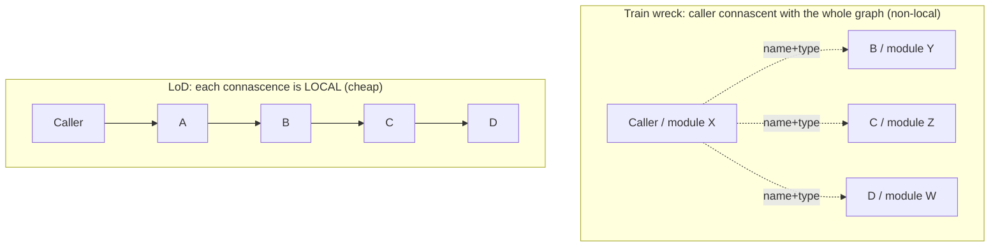
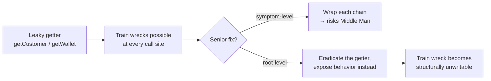

# Law of Demeter — Senior

> **Category:** [Design Principles](../../README.md) — the Principle of Least Knowledge: a method should talk only to its immediate collaborators, never reach through them into a stranger's internals.

> **Prerequisites:** [Junior](junior.md) · [Middle](middle.md)
> **Focus:** **Design trade-offs** and **system-level reasoning**

---

## Introduction

> Focus: **design trade-offs** and **system-level reasoning**

At the senior level, the Law of Demeter stops being "don't write train wrecks" and becomes a lens on a harder question: **how much knowledge of the object graph should cross each boundary in the system, and what does it cost to hide it?** LoD is cheap insurance against fragile, structure-coupled code — but applied without judgement it manufactures *interface bloat*, *Middle Man* facades, and delegation layers that obscure more than the chain they replaced.

This file covers the three things a senior must reason about precisely:

1. **What LoD really reduces** — not "dots," but a specific kind of connascence spread across module boundaries.
2. **When the cure is worse than the disease** — delegation has a real, sometimes prohibitive cost, and "fewest elements" / clarity can outrank LoD.
3. **Why getters are the deeper culprit** — LoD is a symptom-level rule; the root cause is leaky encapsulation, and the senior fix operates on the root.

---

## LoD as a Connascence-Reduction Tool

The precise reason a train wreck is bad is best stated in the vocabulary of [Connascence](../03-connascence/senior.md). Two pieces of code are *connascent* if changing one forces a change in the other to keep the system correct. A chain `a.getB().getC().getD().op()` creates connascence between the **caller** and *every type in the chain*:

| The caller is connascent with… | …on the kind |
|---|---|
| `B` having a `getC()` | connascence of **name** |
| `getC()` returning a `C` | connascence of **type** |
| `C` having a `getD()` | connascence of **name** |
| the whole `A→B→C→D` ownership shape | connascence of **structure** (spread across modules) |

The three connascence quality axes — *strength*, *locality*, *degree* — explain exactly why LoD helps:

- **Locality.** The train wreck's connascence is **non-local**: the caller (in module X) is connascent with `B`, `C`, `D` (possibly in modules Y, Z, W). Collapsing it to `a.answer()` makes each connascence **local**: only `A` is connascent with `B`, only `B` with `C`. *Connascence is far cheaper when local* — and LoD is, mechanically, a tool for converting cross-module connascence into a chain of in-module connascences.
- **Degree.** A train wreck reused in twenty call sites means twenty places connascent with the graph. Delegation collapses that to one (`A`'s forwarding method), dropping the degree.

> **The senior reframing:** LoD doesn't "remove dots." It **localizes connascence** — pulling the caller's dependency on a distant object graph back to a dependency on one adjacent object. That's the actual coupling win, and it tells you *when LoD matters most*: when the chain crosses module/team boundaries (non-local connascence is expensive) far more than when it stays inside one cohesive cluster (local connascence is cheap).

This also predicts when LoD *doesn't* matter: a two-dot chain entirely within one small, cohesive module creates only local connascence — already cheap — so "fixing" it buys little and may cost clarity.

---

## The Real Cost: When Delegation Becomes Worse Than the Chain

The middle level introduced the **Middle Man** smell. At the senior level you must be able to decide, deliberately, *when LoD loses* — because it frequently does.

Delegation has three compounding costs:

1. **Interface bloat.** Each hidden collaborator's relevant methods reappear as forwarding methods on the wrapper. A class that delegates to three collaborators can triple in surface area, and its *real* responsibility gets buried under pass-throughs.
2. **Behavioral leakage by another name.** A forwarding method like `order.customerCreditLimit()` still *couples* `Order` to the concept of a customer credit limit. You've moved the knowledge from the caller into `Order` — but `Order` arguably had no business knowing about credit limits either. LoD made the dependency *implicit* rather than *removed*. This is the trap: **delegation can hide coupling without reducing it.**
3. **Lost transparency.** A reader chasing `order.billingSummary()` must now open `Order`, then `Customer`, then `Account` to understand what it does — the same navigation the train wreck made explicit, now spread across five files. For *some* code, the explicit chain is genuinely more readable.

> **The senior judgement:** LoD trades *structural coupling* (caller knows the graph) for *delegation cost* (wrappers, bloat, indirection). When the chain is local, shallow, and the intermediate types are stable data structures, the chain is the better design. When the chain is deep, crosses module boundaries, and reaches through behavior-rich objects, delegation wins.

The principle that adjudicates this is **clarity and "fewest elements"** (see [Simple Design]): *don't add a delegation method that obscures more than the chain it replaces.* LoD is subordinate to readability — exactly as DRY is. A wrapper that no one can justify by a real coupling reduction is speculative ceremony.

### A heuristic for "delegate or not"

```text
DELEGATE (honor LoD) when ANY of:
  • the chain reaches through OBJECTS (hidden behavior), not data structures
  • the chain crosses a module / team / package boundary (non-local connascence)
  • the same chain appears in many call sites (high degree)
  • the intermediate relationships are LIKELY TO CHANGE

ALLOW THE CHAIN when ALL of:
  • it navigates a DATA STRUCTURE / DTO / value tree (no encapsulation)
  • it stays inside one cohesive module (local, cheap connascence)
  • it is short and the types are stable
  • adding the wrapper would bury the host class's real responsibility
```

---

## Stamp Coupling and the Hidden Cousin of LoD

There's a subtle failure mode where you "obey" LoD's letter while making coupling *worse*: **passing whole objects so the callee can reach into them.** This is **stamp coupling** (the callee depends on the *structure* of a passed argument, using only part of it).

```java
// "Obeys" LoD — only one dot inside the method — but it's STAMP COUPLING:
double shippingFee(Order order) {
    return rateTable.lookup(order.getCustomer()
                                 .getAddress()       // wait — still a train wreck!
                                 .getCountry());
}

// Naive "fix": pass the whole order to a helper so the chain hides inside:
double shippingFee(Order order) { return feeFor(order); }   // looks LoD-clean…
double feeFor(Order order) {                                  // …but now feeFor is
    return rateTable.lookup(order.getCustomer().getAddress().getCountry());
} //  STILL reaching through the graph — and now coupled to all of Order, too.
```

Passing `order` to `feeFor` so the train wreck "lives somewhere else" doesn't reduce coupling — it adds *stamp coupling* (`feeFor` now depends on `Order`'s structure) on top of the original navigation. The genuine fix passes the **smallest thing the callee needs** (data coupling, the loosest kind):

```java
double shippingFee(Country country) {            // depends on exactly one value
    return rateTable.lookup(country);
}
// caller: shippingFee(order.shippingCountry());  // Order resolves the country itself
```

> **Senior insight:** LoD and the coupling taxonomy (data < stamp < control < common < content) are the same concern at different resolutions. "Don't reach through objects" (LoD) and "pass the value, not the structure that contains it" (avoid stamp coupling) are two phrasings of *minimize what each unit knows about another*. Honoring LoD by passing whole objects around is a classic way to *trade a train wreck for stamp coupling and gain nothing.*

---

## LoD vs. Encapsulation: Why Getters Are the Real Problem

LoD is a *symptom-level* rule. The disease is **leaky encapsulation** — objects that expose their internal collaborators through getters. Every `getCustomer()`, `getWallet()`, `getEngine()` is an invitation to a train wreck; the chain is just the symptom of an object that published its internals.

Martin Fowler's *GetterEradicator* and the Tell-Don't-Ask tradition make the senior point: **the durable fix isn't to wrap the chain — it's to stop exposing the collaborator at all.** If `Order` never had a public `getCustomer()`, the train wreck would be *unwritable*; callers would be forced to ask `Order` to do the work, and behavior would naturally accrete on the right object.

```java
// SYMPTOM-LEVEL: the getter exists, train wrecks are possible, you play whack-a-mole
class Order { public Customer getCustomer() { return customer; } }   // leak

// ROOT-LEVEL: no getter; Order exposes BEHAVIOR, not its components
class Order {
    public Money applyLoyaltyDiscount(Money amount) {   // tell, don't ask
        return customer.discounted(amount);
    }
    // no getCustomer(): the collaborator is genuinely encapsulated
}
```

> The senior stance: **treat repeated LoD violations as evidence of an encapsulation defect, not a calling-style defect.** Fix the object's interface (remove the leaky getter, add the behavior) rather than policing every call site. This connects LoD directly to [Encapsulate What Changes](../../03-module-and-class/01-encapsulate-what-changes/): the relationships *between* objects are exactly the kind of detail that should be hidden so it can change.

The caveat: you cannot eradicate every getter. Data structures *should* expose their fields; query-only reads are often legitimate; and frameworks (serialization, ORMs, templating) demand getters. The skill is removing getters that leak **behavioral collaborators** while keeping those that expose **data** — once again, the objects-vs-data line.

---

## The Objects-vs-Data-Structures Boundary at System Scale

The middle-level distinction (objects vs. data structures) becomes an **architectural** decision at scale. Most systems have, by design, regions where LoD does and doesn't apply:

| Region | Nature | LoD? |
|---|---|---|
| **Domain model / core** | Behavior-rich objects, invariants | **Strongly** — protect encapsulation, Tell-Don't-Ask |
| **DTO / API boundary layer** | Data structures for transport | **No** — chain freely, expose fields |
| **Persistence entities (mapped rows)** | Often data structures | Mostly **no** — they're records |
| **Configuration / settings trees** | Nested data | **No** |
| **View models / templates** | Data shaped for rendering | **No** |

The architectural mistake is **letting these blur**: a "domain object" that's secretly a data bag (anemic domain model) invites train wrecks *and* leaves behavior homeless; a "DTO" with business methods makes callers unsure whether they may chain. **A clean boundary between the behavior-rich core and the data-rich edges is what makes LoD answerable** — and it's why patterns like the anti-corruption layer, mappers, and the separation of domain from DTOs matter. LoD is, at this scale, a forcing function toward keeping *objects* and *data structures* in distinct architectural regions.

---

## Tell, Don't Ask vs. CQS and Functional Style

Tell-Don't-Ask (LoD's positive form) is in productive tension with two other principles a senior must reconcile:

- **Command-Query Separation ([CQS](../../03-module-and-class/02-command-query-separation/)).** "Tell" leans toward *commands* (do something), which CQS says shouldn't also *return* values. Pure Tell-Don't-Ask can push you toward command-heavy objects that mutate state. The reconciliation: **ask the object to *compute and return* (a query) rather than handing you its parts to compute yourself.** `order.total()` is a query that honors both LoD (you didn't reach through) and CQS (it computes without mutating). Tell-Don't-Ask is about *who does the work*, not about forcing every method to be a mutating command.
- **Functional / data-oriented style.** Functional programming deliberately uses **transparent data structures** and free functions over them — the *opposite* of "hide data, expose behavior." In that paradigm, chaining through immutable data (`pipe(order, getCustomer, getAddress, getCity)`) is idiomatic and *not* an LoD violation, because the data is meant to be transparent and the functions are pure. **LoD is an OO-encapsulation principle; it weakens to near-irrelevance in a data-oriented, immutable-value style** where there are no hidden internals to protect. A senior working in a mixed codebase applies LoD to the OO regions and relaxes it in the functional ones — same objects-vs-data line, drawn at the paradigm level.

---

## Where LoD Stops Applying

Knowing the *boundaries* of the principle is the senior signal:

1. **Pure data / DTOs / config / parsed payloads** — no encapsulation; chain freely (the master exception).
2. **Fluent interfaces, builders, streams, monadic chains** — same object/type flows through; not navigation.
3. **Functional pipelines over transparent immutable data** — the paradigm intends data to be open.
4. **Hot paths where delegation indirection has measured cost** — rare, but virtual-call delegation chains can matter; profile before contorting.
5. **When delegation would bloat an interface or build a Middle Man** worse than the chain it replaces — clarity outranks LoD.
6. **Library/framework idioms** (ORMs, serializers, templating) that *require* getters — fighting them is futile.

> The unifying senior rule: **LoD's job is to keep behavioral knowledge from leaking across boundaries. Where there's no behavior to protect (data), no boundary being crossed (local/cohesive), or no leak happening (fluent/functional), the principle simply doesn't apply — and forcing it produces noise.**

---

## Code Examples — Advanced

### Eradicating the getter, not wrapping the chain (Java)

```java
// BEFORE — leaky getters make train wrecks inevitable; callers couple to the graph
class Account {
    public Customer getCustomer() { return customer; }
}
// somewhere: account.getCustomer().getTier().discountFor(item)   // train wreck

// AFTER — remove the leak; expose the BEHAVIOR the callers actually wanted
class Account {
    public Money priceFor(Item item) {            // no getCustomer(); Tell-Don't-Ask
        return customer.priceFor(item);
    }
}
class Customer {
    Money priceFor(Item item) { return tier.discount().applyTo(item.basePrice()); }
}
// callers can no longer write the train wreck — it's structurally impossible.
```

### Trading a train wreck for stamp coupling — and the real fix (Python)

```python
# "LoD-clean" but WRONG: passes the whole order so the chain hides inside the helper
def label_for(order):                         # stamp-coupled to all of Order
    return f"{order.customer.address.city}"   # …and still a train wreck internally

# RIGHT: pass the minimal value (data coupling); let each object resolve its own part
def label_for(city: str) -> str:
    return city.upper()
# caller: label_for(order.shipping_city())    # Order resolves the city itself
```

### Recognizing where LoD does NOT apply (TypeScript)

```typescript
// Domain object — LoD applies: don't reach through it
class Subscription {
  renewalSummary(): string { return this.plan.renewalSummary(); }  // tell, don't ask
}

// API response — DATA STRUCTURE: chaining is correct, wrapping would be noise
type ApiResponse = { data: { user: { address: { city: string } } } };
const city = res.data.user.address.city;   // FINE — no encapsulation to protect

// Fluent pipeline — SAME type flows through: not a violation
const ids = orders.filter(o => o.paid).map(o => o.id).slice(0, 10);
```

---

## Liabilities

### Liability 1: Delegation that hides coupling instead of removing it

`order.customerCreditLimit()` makes `Order` know about credit limits. You satisfied LoD's letter while giving `Order` a responsibility it shouldn't own. *Wrapping is not the same as decoupling* — sometimes the right answer is for the caller to talk to the *right* object directly, not to route through a wrapper.

### Liability 2: Middle Man and god-facades

Mechanical LoD breeds classes that are 90% forwarding methods. The fix for an over-delegating facade is to **redistribute responsibility**, not to add more delegation — the smell is "this class only forwards," and the cure may be *removing* the middle man (Fowler's inverse refactoring).

### Liability 3: Trading a train wreck for stamp coupling

Passing whole objects so chains "live elsewhere" replaces navigation with structural argument-coupling and reduces nothing. Pass the *value*, not the container.

### Liability 4: Applying LoD to data and to functional code

Wrapping DTOs, config, and immutable-value pipelines in delegation is pure ceremony that fights the paradigm. The objects-vs-data line, drawn wrongly, turns a non-problem into noise.

### Liability 5: Whack-a-mole at call sites instead of fixing the getter

Policing every train wreck while leaving the leaky getter in place guarantees the smell returns. Fix the encapsulation defect at the source.

---

## Pros & Cons at the System Level

| Dimension | Honor LoD (Tell-Don't-Ask, delegate) | Allow the chain |
|---|---|---|
| Coupling to object graph | Low (localized connascence) | High (caller knows the graph) |
| Resilience to structural change | High (change one forwarding method) | Low (every call site breaks) |
| Interface surface area | Larger (delegation methods) | Smaller |
| Readability of caller | Higher (`order.summary()`) | Lower (long navigation) |
| Readability of *system* | Can be **lower** (logic spread across delegators) | Can be **higher** (chain is explicit) |
| Risk | Middle Man / hidden-but-present coupling | Fragile, structure-coupled callers |
| Best domain | Behavior-rich domain core, cross-module chains | Data layers, DTOs, fluent/functional code |

The senior reading: LoD wins decisively when chaining **through behavior-rich objects across boundaries that change** — there, localizing connascence pays for the delegation many times over. It *loses* when applied to **data structures, local cohesive chains, or fluent/functional code**, where it adds ceremony, bloats interfaces, and can scatter logic across delegators. The principle is sharp but bounded — and a senior is defined by knowing the boundary, not by reflexively eliminating dots.

---

## Diagrams

### LoD localizes connascence



### Symptom vs. root cause



---

## Related Topics

- **Precise theory of the coupling LoD reduces:** [Connascence](../03-connascence/senior.md)
- **The broader goal:** [Minimise Coupling](../01-minimise-coupling/senior.md)
- **The root cause LoD treats:** [Encapsulate What Changes](../../03-module-and-class/01-encapsulate-what-changes/)
- **In tension with:** [Command-Query Separation](../../03-module-and-class/02-command-query-separation/)
- **Reinforces:** [Single Responsibility (SRP)](../../04-solid/01-srp-single-responsibility/senior.md)

---


---

## Check your understanding

1. Explain Law of Demeter — Senior Level in your own words and name the problem it solves.
2. How would you apply the ideas around Table of Contents, Introduction, LoD as a Connascence-Reduction Tool in a realistic engineering change?
3. What failure mode or misuse should you look for, and what evidence would reveal it?
4. How would you validate a system-level decision about Law of Demeter — Senior Level under uncertainty?
5. What observable result would convince you that the approach improved the system?
