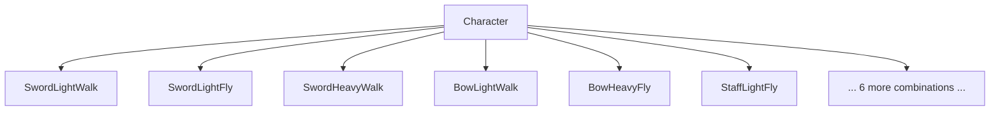
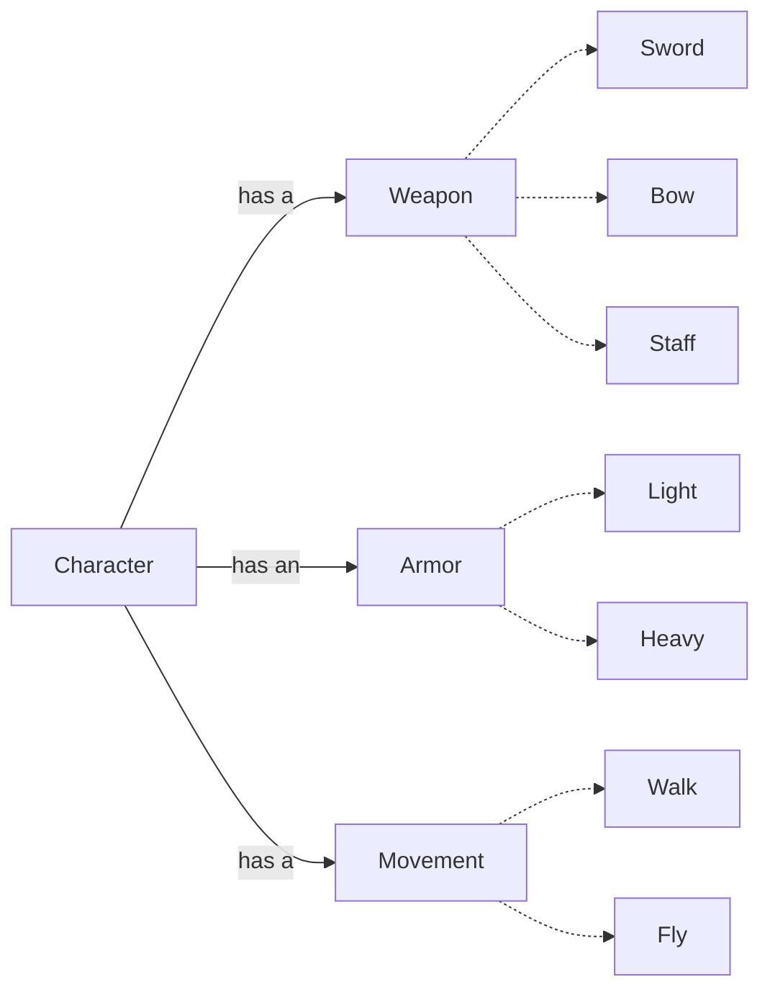
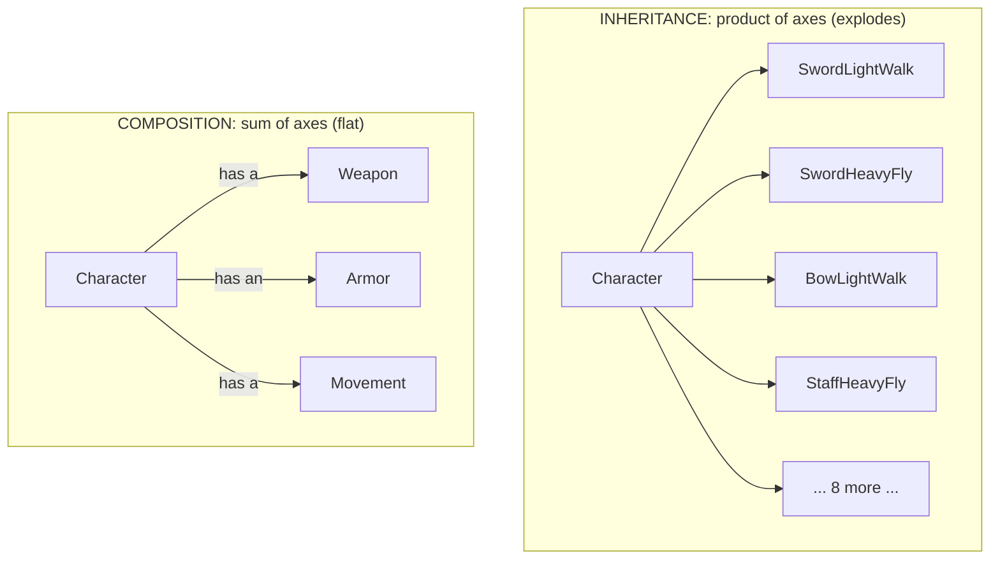

# Composition Over Inheritance — Junior

> **Category:** [Coupling & Cohesion](../../README.md) — prefer assembling behavior from has-a parts over building deep is-a class hierarchies.

---

## Introduction

> Focus: **What is it?** and **How to use it?**

When you need a class to do something a similar class already does, object-oriented languages hand you two tools:

- **Inheritance** — `class Car extends Vehicle`. The `Car` *is a* `Vehicle` and gets all of `Vehicle`'s code for free.
- **Composition** — `class Car { Engine engine; }`. The `Car` *has an* `Engine` and uses it by calling its methods.

Both reuse code. The principle of this topic, stated by the Gang of Four in *Design Patterns* (1994), tells you which to reach for first:

> **Favor object composition over class inheritance.**

That is the whole rule. Note the word **favor** — it is not "never inherit." It is a default. When two designs solve your problem equally well, prefer the one built from composed *has-a* parts over the one built from an *is-a* hierarchy, because the composed one is almost always more flexible and less coupled.

### Why this matters

Inheritance *looks* like the obvious choice — it is the first thing tutorials teach, and it reuses code with one keyword. But it is also the **strongest form of coupling** in object-oriented programming: a subclass is wired into the internals of its parent, it is fixed at compile time, and a single hierarchy forces every class onto one classification axis. Composition avoids all three problems. Most of the painful, rigid OO code you will meet in the wild is rigid *because* someone reached for inheritance where composition was the better fit.

---

## Prerequisites

- **Required:** You can write classes, methods, and fields, and you understand `extends` / subclassing in at least one OO language.
- **Required:** You know what an **interface** (or abstract method) is.
- **Helpful:** A feel for **[coupling](../01-minimise-coupling/junior.md)** — how a change in one place forces a change in another.
- **Helpful:** Exposure to **[encapsulation](../../03-module-and-class/01-encapsulate-what-changes/)** — hiding a class's internals behind its public methods.

---

## Glossary

| Term | Definition |
|------|-----------|
| **Inheritance** | A class derives from another, automatically gaining its fields and methods (`class B extends A`). An *is-a* relationship. |
| **Composition** | A class holds another object as a field and uses it via its methods. A *has-a* relationship. |
| **Delegation** | When an object handles a request by forwarding it to one of its component objects. The mechanism that makes composition work. |
| **Subclass / superclass** | The deriving class and the class it derives from (a.k.a. derived/base, child/parent). |
| **Interface inheritance** | Inheriting a *type* / a set of method signatures — a promise about what an object can do (subtyping). |
| **Implementation inheritance** | Inheriting actual *code* from a parent for reuse. The risky kind this topic warns about. |
| **Fragile base class** | A superclass where an innocent change silently breaks subclasses that depended on its internal behavior. |
| **Class explosion** | The combinatorial blow-up of subclasses when you try to model several independent variations with one hierarchy. |

---

## The Principle

Restated carefully:

> **Prefer building a class out of smaller objects it *has* (and delegates to) rather than out of a parent class it *is*.**

Two reasons, both about flexibility:

1. **Composition is assembled at runtime.** You hand an object its parts when you construct it, so you can swap them, change them, or configure them per instance. Inheritance is fixed when you write the `extends` keyword — every `Penguin` is locked into whatever `Bird` decided, forever.
2. **Composition couples through a small public interface.** A `Car` only sees `Engine`'s public methods. A subclass, by contrast, can see and depend on its parent's *internals* — so the parent can't change them safely. Inheritance breaks encapsulation; composition respects it.

The principle does **not** say inheritance is bad. It says: inheritance is the more dangerous, more rigid tool, so make composition your *default* and use inheritance only when it genuinely fits (we cover exactly when, below).

---

## Inheritance vs. Composition, Side by Side

| | **Inheritance** (`is-a`) | **Composition** (`has-a`) |
|---|---|---|
| Relationship | A *is a kind of* B | A *has a* B |
| Reuse mechanism | Inherit B's code | Hold a B, call its methods |
| Bound | At compile time (static) | At runtime (dynamic, swappable) |
| Coupling strength | **Strong** — subclass sees parent internals | **Weak** — only B's public interface |
| Encapsulation | Broken (white-box) | Preserved (black-box) |
| Number of axes | One (single inheritance) | Many (one field per axis) |
| Change a part | Edit the hierarchy, risk all subclasses | Swap the field |
| Default? | No — use when truly *is-a* | **Yes — favor this** |

The phrase **white-box reuse** (inheritance) vs. **black-box reuse** (composition) comes straight from the Gang of Four. Inheritance is "white-box" because the subclass can see *inside* the parent; composition is "black-box" because the container can only use its component through its published interface — it can't see in.

---

## The is-a vs. has-a Test

The single most useful tool for deciding: read the relationship out loud.

- "A `Car` **is a** `Vehicle`." ✓ sounds true → inheritance is *plausible* (still verify with [LSP](../../04-solid/03-lsp-liskov-substitution/junior.md) below).
- "A `Car` **has an** `Engine`." ✓ sounds true → composition.
- "A `Car` **is an** `Engine`." ✗ obviously wrong → never inherit `Car from Engine`.
- "A `Stack` **is a** `Vector`." ✗ — a stack only *has* a sequence of items; it should not expose `Vector`'s `insertAt(index)`. (Java's real `java.util.Stack extends Vector` is a famous mistake for exactly this reason.)

> **Rule of thumb:** if you'd only inherit to *reuse some code*, that's a has-a in disguise — use composition. Reserve inheritance for relationships that are genuinely "A is a special kind of B" where an A can stand in for a B everywhere.

A sharper version of the test, which we'll use throughout this curriculum:

> **Inherit for substitutability (a clean is-a — an A can replace a B), compose for reuse (you just want B's behavior).**

---

## Why Inheritance Gets You in Trouble

Four concrete problems. Each is a reason composition is the safer default.

### 1. It is the strongest coupling there is

A subclass depends on its superclass's *internals*, not just its public API. When the parent changes a private detail — even one that looks invisible from outside — subclasses can silently break. This is the **fragile base class problem**, and we'll see the canonical example in [Code Examples](#code-examples).

### 2. It is static

`class Penguin extends Bird` is decided when you compile. You cannot, at runtime, decide that *this particular* penguin should behave differently. Composition lets you hand each object different parts: this duck flies, that one (a rubber duck) doesn't — same class, different injected behavior.

### 3. It leaks implementation (breaks encapsulation)

To subclass `Bird` correctly, you often have to know *how* `Bird` works inside — which method calls which, in what order. That knowledge is exactly what encapsulation is supposed to hide. Composition only ever needs the component's public methods.

### 4. It forces a single classification axis

A class can only extend **one** parent (in single-inheritance languages like Java, C#). So the moment you have *two* independent things that vary — say, a character's **weapon** and its **armor** — inheritance forces you to pick one as the hierarchy and cram the other in awkwardly. With several axes, the subclass count explodes combinatorially. That's the next section.

---

## A Worked Example: The Class Explosion

You're building a game. Characters vary along three independent axes:

- **Weapon:** Sword, Bow, Staff
- **Armor:** Light, Heavy
- **Movement:** Walk, Fly

Try to model this with inheritance and you must make a subclass for *every combination*:

```
SwordLightWalk   SwordLightFly   SwordHeavyWalk   SwordHeavyFly
BowLightWalk     BowLightFly     BowHeavyWalk     BowHeavyFly
StaffLightWalk   StaffLightFly   StaffHeavyWalk   StaffHeavyFly
```

That's 3 × 2 × 2 = **12 classes** — and each shares duplicated code with its neighbors. Add a fourth weapon and you get 16. Add a third armor type and you're at 24. This is **class explosion**: the number of subclasses is the *product* of the axes, and the duplicated code grows with it.



The classic textbook versions of this same trap:

- **"Penguin extends Bird."** Put `fly()` on `Bird` and every bird can fly — but a `Penguin` can't. Now you either override `fly()` to throw an exception (which breaks [LSP](../../04-solid/03-lsp-liskov-substitution/junior.md) — callers expecting a flying `Bird` blow up) or you push `fly()` down into a `FlyingBird` subclass and your hierarchy starts splitting along axes it can't cleanly represent.
- **The coffee shop.** A drink can be Coffee or Tea, with or without Sugar, with or without Milk. As a hierarchy: `CoffeeWithSugar`, `CoffeeWithMilk`, `CoffeeWithSugarAndMilk`, `TeaWithSugar`… every combination is a class. This is the exact problem the **Decorator pattern** solves with composition.

---

## How Composition Solves It

Stop modeling the variations as *types*. Model them as *parts* the character **has**, and inject them:

```
Character
  ├── has a  Weapon    (Sword | Bow | Staff)
  ├── has an Armor     (Light | Heavy)
  └── has a  Movement  (Walk | Fly)
```



Now the counts **add** instead of **multiply**: 3 weapons + 2 armors + 2 movements = **7 small classes** instead of 12, and every combination is just a `Character` constructed with different parts. Add a fourth weapon? That's **one** new class, and *all* combinations involving it exist for free. The explosion is gone.

Each part is an independent, swappable component. The `Character` **delegates** to them: when asked to attack, it calls `weapon.attack()`; when asked to move, it calls `movement.move()`. This is exactly the **Strategy pattern** — each axis of behavior is a swappable strategy object the character holds.

---

## Code Examples

### Python — the game-character explosion, collapsed

```python
# ❌ INHERITANCE: one class per combination — explodes
class SwordLightWalk(Character): ...
class SwordHeavyFly(Character): ...
class BowLightWalk(Character): ...
# ... 9 more. Adding a weapon multiplies them all.

# ✅ COMPOSITION: behaviors are parts the character HAS (Strategy)
class Sword:  def attack(self): return "slashes"
class Bow:    def attack(self): return "shoots an arrow"
class Walk:   def move(self):   return "walks"
class Fly:    def move(self):   return "flies"

class Character:
    def __init__(self, weapon, armor, movement):
        self.weapon = weapon        # has-a
        self.armor = armor          # has-a
        self.movement = movement    # has-a

    def attack(self): return self.weapon.attack()   # delegate
    def move(self):   return self.movement.move()   # delegate

# Any combination is just a construction — no new class needed:
archer_flyer = Character(Bow(), Light(), Fly())
knight       = Character(Sword(), Heavy(), Walk())

# And behavior can change at RUNTIME — impossible with inheritance:
knight.weapon = Bow()   # the knight picks up a bow mid-game
```

The same seven small classes cover *every* combination, present and future. Adding `Staff` is one class. Letting a character switch weapons is one assignment.

### Java — Strategy by composition

```java
interface AttackBehavior { String attack(); }
class Sword implements AttackBehavior { public String attack() { return "slash"; } }
class Bow   implements AttackBehavior { public String attack() { return "shoot"; } }

class Character {
    private AttackBehavior weapon;            // HAS-A (the strategy)
    Character(AttackBehavior weapon) { this.weapon = weapon; }
    String attack() { return weapon.attack(); }   // delegate
    void setWeapon(AttackBehavior w) { this.weapon = w; }  // swap at runtime
}
```

Note `weapon` is typed as the **interface** `AttackBehavior`, not a concrete class. The `Character` is coupled only to the *promise* "something I can `.attack()` with," never to a specific weapon. That is the weak, healthy coupling composition buys you.

### Go — composition is the only tool (no inheritance)

Go has **no inheritance at all**. You build behavior by embedding/holding other types and calling them. The game example is natural Go:

```go
type AttackBehavior interface{ Attack() string }
type Sword struct{}
func (Sword) Attack() string { return "slash" }
type Bow struct{}
func (Bow) Attack() string { return "shoot" }

type Character struct {
    Weapon AttackBehavior   // has-a
}
func (c Character) Attack() string { return c.Weapon.Attack() } // delegate

knight := Character{Weapon: Sword{}}
archer := Character{Weapon: Bow{}}
```

That Go gets along *fine* — thrives, even — with no inheritance keyword is the strongest practical argument for this principle. Whole production languages (Go, Rust) deliberately omit inheritance and ask you to compose. (More on those at [Middle](middle.md) and [Senior](senior.md).)

---

## Two Kinds of Inheritance

This is the distinction that separates people who *understand* the principle from people who just chant it. "Inheritance" actually bundles two different things:

| | **Interface inheritance** (subtyping) | **Implementation inheritance** (code reuse) |
|---|---|---|
| What you inherit | A *type* — a set of method signatures | Actual *code* from a parent |
| Purpose | Substitutability: "an A can be used as a B" | Reuse: "I want B's behavior without rewriting it" |
| Risk | Low — it's just a contract | **High** — couples you to parent internals |
| Healthy? | Yes — this is good design (see [LSP](../../04-solid/03-lsp-liskov-substitution/junior.md)) | Often a trap — composition usually beats it |
| In Java | `implements SomeInterface` | `extends SomeClass` |

> **"Favor composition over inheritance" is really "favor composition over *implementation* inheritance."** Inheriting an interface (a pure contract) is good and this principle does not warn against it. Inheriting *code* — pulling in a parent's implementation to reuse it — is the risky kind composition usually does better.

Keep these separate in your head. When you see `extends` used purely to grab a parent's code, that's the smell. When you see `implements`/interface inheritance to make a type substitutable, that's fine.

---

## When Inheritance Is Still Right

The principle says *favor*, not *forbid*. Inheritance is the right call when **all** of these hold:

1. **It's a genuine is-a, and substitutable.** A subclass can stand in for the superclass *anywhere* the superclass is used, with no surprises. That's the [Liskov Substitution Principle](../../04-solid/03-lsp-liskov-substitution/junior.md) — and it's the real test of "is-a," far stricter than the sentence sounding right.
2. **The hierarchy is shallow and stable.** One or two levels, in a domain that won't keep sprouting new axes of variation.
3. **It's a framework template-method hook.** Many frameworks are *designed* for you to extend a base class and override specific methods (`extends Activity`, `extends Thread`, JUnit's `extends TestCase`). The base class was built for inheritance.
4. **There's no "and."** A `Penguin` is a `Bird` *and* needs custom flight → composition for the flight part. A `SavingsAccount` is simply an `Account` with one extra rule → inheritance is fine.

If you're inheriting only to **avoid retyping some methods**, that is reuse — use composition. If you're inheriting because the subtype must be *substitutable* for the supertype, inheritance is doing its real job.

---

## Best Practices

1. **Default to composition.** Reach for a field-and-delegate before reaching for `extends`. Make inheritance the choice you justify, not the reflex.
2. **Apply the is-a / has-a test out loud** — and back "is-a" with the [LSP](../../04-solid/03-lsp-liskov-substitution/junior.md) check (can the subtype truly stand in?).
3. **Compose against interfaces, not concrete classes.** Type the held field as an interface so you're coupled to a contract, not an implementation.
4. **Separate interface inheritance from implementation inheritance.** `implements` a contract = fine; `extends` to grab code = suspect.
5. **Watch for class explosion.** Two or more independent axes of variation → that's a composition signal, not a deeper hierarchy.
6. **Keep hierarchies shallow.** If you're three levels deep in `extends`, ask whether the lower levels should be *parts* instead.

---

## Common Mistakes

1. **Inheriting just to reuse code.** "`Stack extends Vector` because a stack needs a list inside" — no, a stack *has* a list. Reuse is a has-a.
2. **Treating the principle as "never inherit."** It's *favor*. Framework hooks and clean substitutable is-a relationships are fine.
3. **Putting a method on a base class that not all subclasses can honor.** `Bird.fly()` → `Penguin` can't. That's the explosion/LSP trap.
4. **Modeling multiple independent variations as one hierarchy.** Weapon × armor × movement as subclasses → combinatorial blow-up.
5. **Confusing `implements` with `extends`.** Implementing an interface (subtyping) is not the risky inheritance this principle warns about.
6. **Composing against concrete types.** Holding a `Sword` field instead of an `AttackBehavior` field throws away the flexibility composition was supposed to give you.

---

## Tricky Points

- **"Favor" is load-bearing.** This is a default, not a prohibition. People who hear "never inherit" over-rotate and re-implement framework features by hand. Use judgment.
- **A sentence sounding like "is-a" isn't proof.** "A square is a rectangle" sounds true but breaks under inheritance (the classic LSP counterexample). The real test is *substitutability*, covered at [Middle](middle.md) and in [LSP](../../04-solid/03-lsp-liskov-substitution/junior.md).
- **Composition has a cost: forwarding code.** To expose a component's method you sometimes write a one-line method that just calls it (`String name() { return engine.name(); }`). That boilerplate is real; it's the price of weak coupling. (Languages handle this differently — see [Middle](middle.md).)
- **Strategy and Decorator are this principle as patterns.** When you reach the Design Patterns section, you'll see Strategy (swap a behavior) and Decorator (stack behaviors) are both "composition over inheritance" given names.

---

## Test Yourself

1. State the principle in one sentence. What does the word "favor" add?
2. Give the is-a / has-a test, and apply it to `Car`/`Engine` and `Car`/`Vehicle`.
3. Name the four reasons inheritance is risky.
4. Why does modeling weapon × armor × movement with inheritance cause a class explosion, and how does composition fix the count?
5. What's the difference between interface inheritance and implementation inheritance? Which one does this principle warn against?
6. Give two situations where inheritance is still the right choice.

---

## Cheat Sheet

```text
THE PRINCIPLE (Gang of Four)
  "Favor object composition over class inheritance."
  favor = default, not a ban.

THE TEST
  "A has a B"            → composition (field + delegate)
  "A IS-A (substitutable) B" → inheritance is plausible (verify with LSP)
  inheriting only to reuse code → that's a has-a → compose

WHY INHERITANCE IS RISKY
  strongest coupling   subclass depends on parent INTERNALS (fragile base class)
  static               fixed at compile time, can't swap per instance
  leaks implementation breaks encapsulation (white-box reuse)
  one axis only        multi-axis variation → CLASS EXPLOSION (product of axes)

COMPOSITION FIXES IT
  parts are HAS-A, swappable at runtime, coupled only to interfaces
  counts ADD (3+2+2=7) instead of MULTIPLY (3*2*2=12)
  = Strategy (swap behavior) / Decorator (stack behavior)

TWO INHERITANCES
  interface inheritance (implements a contract)  → fine, this is subtyping
  implementation inheritance (extends for code)  → the risky kind to avoid

INHERIT WHEN
  genuine substitutable is-a · shallow & stable · framework hook · no "and"
```

---

## Summary

- **The principle:** *"Favor object composition over class inheritance"* (Gang of Four). Prefer **has-a + delegation** over **is-a** hierarchies — but *favor*, not *forbid*.
- **Inheritance is risky** because it's the strongest coupling (subclass depends on parent internals — the *fragile base class*), it's static, it leaks implementation (breaks encapsulation), and it forces one classification axis.
- **Multiple independent variations cause class explosion** (the count is the *product* of axes). Composition makes each axis a swappable part, so counts *add* and any combination is just a construction.
- **Separate the two inheritances:** *interface* inheritance (subtyping for substitutability) is healthy; *implementation* inheritance (code reuse) is the risky kind. The principle targets the latter.
- **The is-a / has-a test** decides — and "is-a" really means *substitutable* ([LSP](../../04-solid/03-lsp-liskov-substitution/junior.md)).
- **Inheritance is still right** for genuine, shallow, substitutable is-a relationships and framework template-method hooks. Go and Rust have *no* inheritance and compose everything — proof the default works.

---

## Further Reading

- Gamma, Helm, Johnson, Vlissides (Gang of Four), *Design Patterns* (1994) — the source of "favor object composition over class inheritance," white-box vs. black-box reuse.
- Joshua Bloch, *Effective Java*, Item 18 — "Favor composition over inheritance" (the broken-`HashSet` example; covered at [Middle](middle.md)).
- The Strategy and Decorator patterns — this principle expressed as named patterns.
- [Liskov Substitution Principle](../../04-solid/03-lsp-liskov-substitution/junior.md) — the real test of a valid "is-a."

---

## Related Topics

- **Underlies it:** [Minimise Coupling](../01-minimise-coupling/junior.md), [Encapsulate What Changes](../../03-module-and-class/01-encapsulate-what-changes/).
- **The is-a test:** [Liskov Substitution Principle](../../04-solid/03-lsp-liskov-substitution/junior.md).
- **As patterns:** Strategy & Decorator.

---

## Diagrams

### Inheritance explosion vs. composed graph




---

## Check your understanding

1. Explain Composition Over Inheritance — Junior Level in your own words and name the problem it solves.
2. How would you apply the ideas around Table of Contents, Introduction, Prerequisites in a realistic engineering change?
3. What failure mode or misuse should you look for, and what evidence would reveal it?
4. What small example would prove that you can apply Composition Over Inheritance — Junior Level correctly?
5. What observable result would convince you that the approach improved the system?
