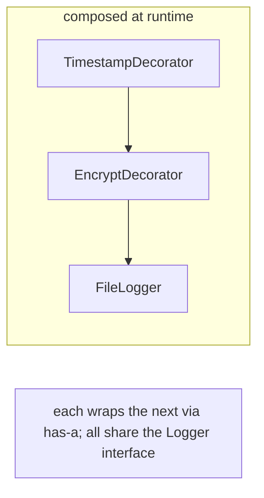
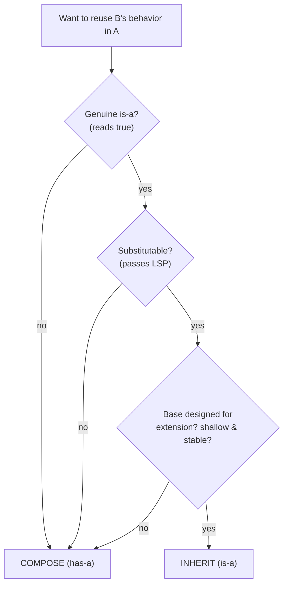
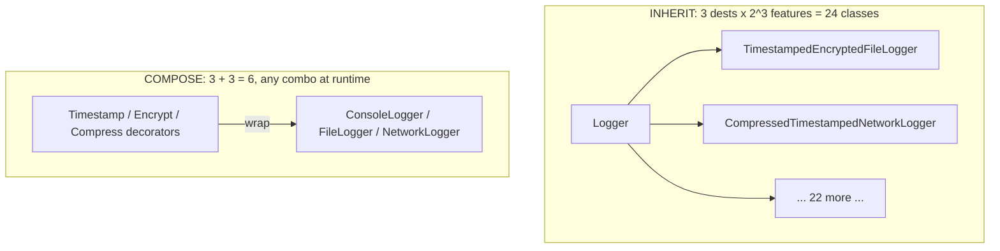

# Composition Over Inheritance — Middle

> **Category:** [Coupling & Cohesion](../../README.md) — prefer assembling behavior from has-a parts over building deep is-a class hierarchies.

> **Prerequisite:** [Junior](junior.md)
> **Focus:** **Why** and **When**

---

## Introduction

> Focus: **Why** and **When**

At the junior level you learned the rule and the is-a/has-a test. At the middle level the question becomes a judgement you make on real code: *this looks like an is-a — is it actually safe to inherit, or is it implementation reuse wearing an is-a costume?* The two failure modes are symmetric:

- **Over-inheriting** — using `extends` for code reuse, building deep hierarchies, putting methods on base classes that not all subclasses can honor. Produces fragile, rigid code.
- **Over-composing** — reflexively shattering a genuine, clean is-a into hand-wired parts and forwarding methods, adding indirection and boilerplate for no flexibility gain.

The skill is calibration, and it rests on one precise idea: **inheritance is only safe when the subclass is genuinely substitutable for the superclass** (the [Liskov Substitution Principle](../../04-solid/03-lsp-liskov-substitution/junior.md)) — and even then, *implementation* inheritance carries a tax that composition often avoids. This file makes "why composition" concrete with the fragile-base-class mechanism and Bloch's famous broken-subclass bug, then works the canonical refactor.

---

## The Fragile Base Class Problem, In Depth

"Inheritance is the strongest coupling" is abstract until you see *how* a subclass reaches into its parent. The problem: **a subclass depends not just on what the superclass does, but on how it does it** — specifically, on which of its own methods the superclass calls internally (its "self-calls").

```java
// A base class whose two methods happen to share an implementation detail:
class Counter {
    private int count = 0;
    public void increment()      { count++; }
    public void incrementBy(int n) {
        for (int i = 0; i < n; i++) increment();   // ← internally calls increment()
    }
    public int get() { return count; }
}

// A subclass overrides increment() to log — reasonable, right?
class LoggingCounter extends Counter {
    @Override public void increment() {
        System.out.println("inc");
        super.increment();
    }
}
```

Call `loggingCounter.incrementBy(3)` and you get **three** "inc" log lines — because `incrementBy` internally calls `increment()`, and the override intercepts each one. The subclass author never asked for that; it's a consequence of `Counter`'s *internal* decision to implement `incrementBy` in terms of `increment`.

Now the base class author "optimizes":

```java
public void incrementBy(int n) { count += n; }   // no longer calls increment()
```

A behavior-preserving change to `Counter` — *the public API is identical* — and `LoggingCounter` silently stops logging bulk increments. **Nothing in either class's signature changed. Tests on `Counter` pass. The subclass broke anyway.**

> This is the **fragile base class problem**: because the subclass depends on the superclass's *self-call structure* — an implementation detail — the superclass cannot safely change that detail. Inheritance turns private implementation choices into a contract the parent didn't know it was promising.

The root cause: inheritance is **white-box reuse**. The subclass can see, and accidentally depend on, the parent's internals. Composition is **black-box** — the wrapper only ever calls the wrapped object's *public* methods, so the wrapped object is free to change how it implements them.

---

## Bloch's Broken Subclass: the HashSet Counting Bug

Joshua Bloch's *Effective Java*, Item 18 ("Favor composition over inheritance"), gives the canonical worked example. The goal is innocent: a `Set` that counts how many elements you've *attempted* to add over its lifetime.

### The broken inheritance version

```java
// ❌ BROKEN: extends HashSet to count insertion attempts
public class InstrumentedHashSet<E> extends HashSet<E> {
    private int addCount = 0;

    @Override public boolean add(E e) {
        addCount++;
        return super.add(e);
    }
    @Override public boolean addAll(Collection<? extends E> c) {
        addCount += c.size();           // looks right…
        return super.addAll(c);
    }
    public int getAddCount() { return addCount; }
}
```

Now run it:

```java
InstrumentedHashSet<String> s = new InstrumentedHashSet<>();
s.addAll(List.of("a", "b", "c"));
System.out.println(s.getAddCount());   // prints 6, NOT 3
```

**Why 6?** Because `HashSet.addAll` is *internally implemented by calling `add` once per element* — an undocumented self-call. So our `addAll` adds 3 (the `c.size()`), then `super.addAll` runs and calls our overridden `add` three more times (+3). The count is double.

The subclass broke because it depended on a fact `HashSet` never promised: *that `addAll` does not call `add`*. There is no good fix inside the inheritance model:

- Remove the `addCount += c.size()` from `addAll`? Works **today**, but only because of the current internal self-call — a future JDK could re-implement `addAll` without calling `add`, and the count silently goes wrong again. You'd be depending on an implementation detail across releases.
- Re-implement `addAll` yourself? Fragile, duplicative, and you're now reverse-engineering `HashSet`'s internals.

### The composition fix

Don't *extend* `HashSet` — *wrap* one. Hold a `Set` and forward to it (Bloch calls the forwarding class a **wrapper**, and this is the Decorator pattern):

```java
// ✅ FIXED: compose a Set; forward to it; you control every call
public class InstrumentedSet<E> implements Set<E> {
    private final Set<E> s;             // HAS-A (any Set, not just HashSet)
    private int addCount = 0;
    public InstrumentedSet(Set<E> s) { this.s = s; }

    @Override public boolean add(E e)  { addCount++; return s.add(e); }
    @Override public boolean addAll(Collection<? extends E> c) {
        addCount += c.size();
        return s.addAll(c);             // s.addAll is a BLACK BOX — we don't
    }                                   //   see or care if it calls add internally
    public int getAddCount() { return addCount; }

    // ... forward the rest of Set's methods to s (size, contains, iterator, ...)
}
```

Now `new InstrumentedSet<>(new HashSet<>()).addAll(of("a","b","c"))` reports **3**. Why? Because `s.addAll` is a black box — *whatever* it does internally, it never re-enters *our* `add`. We only count at our own boundary. The self-call trap is gone.

And as a bonus, this composed version is *more* flexible than the inheriting one: it wraps **any** `Set` (a `TreeSet`, a `LinkedHashSet`, even another wrapper), because it depends on the `Set` *interface*, not the `HashSet` *class*. The broken version could only ever instrument a `HashSet`.

> **Bloch's conclusion, verbatim in spirit:** inheritance is appropriate only when the subclass really is a subtype of the superclass (a true is-a) *and* the superclass was designed and documented for extension. Otherwise, inheritance breaks encapsulation — and you should compose.

---

## Substitutability Is the Real is-a Test

"It sounds like is-a" is not enough. The rigorous test is the [Liskov Substitution Principle](../../04-solid/03-lsp-liskov-substitution/junior.md):

> **A subtype is a valid is-a only if an instance of it can replace an instance of the supertype *everywhere*, with no caller able to tell the difference (no broken behavior, no thrown surprises, no tightened preconditions).**

This is where the famous "obvious" is-a relationships fall apart:

- **`Penguin` is a `Bird`** — sounds fine, until `Bird` has `fly()`. A caller iterating birds and calling `fly()` crashes on the penguin. Penguin is *not* substitutable for a flying `Bird`. The fix is composition: a `Bird` *has a* `Movement` strategy; penguins get `Walk`, sparrows get `Fly`.
- **`Square` is a `Rectangle`** — sounds airtight (a square *is* a special rectangle), but inheriting from `Rectangle` with independent `setWidth`/`setHeight` breaks: code that sets width and height separately, expecting them independent, gets surprised when a `Square` forces them equal. Not substitutable.

```
Sounds like is-a   →   inheritance candidate
        │
        ▼
Substitutable? (LSP) ── no ──▶  it was reuse-in-disguise → COMPOSE
        │
       yes
        │
        ▼
Designed/documented for extension, shallow, stable?  ── no ──▶ COMPOSE
        │
       yes
        ▼
      INHERIT
```

The lesson: the english sentence "A is a B" is a *hint*, not a verdict. The verdict is substitutability. When substitutability fails, you were really reaching for *reuse*, and reuse is a has-a — so compose.

---

## The Mechanisms of Composition

"Compose instead" is not one technique but a family. Knowing them lets you pick the right shape:

| Mechanism | What it is | Use when |
|---|---|---|
| **Plain delegation** | Hold an object; forward calls to it | The default — reuse one collaborator's behavior |
| **Strategy** | Hold a *swappable* behavior object behind an interface | One axis of behavior varies (sort order, attack, pricing) |
| **Decorator** | Wrap an object in another implementing the *same* interface, adding behavior | Stack optional features (logging, compression, the `Set` counter) |
| **Dependency injection** | Receive your composed parts via the constructor instead of `new`-ing them | You want the parts swappable/testable from outside |
| **Mixins / traits** | Language feature that mixes method *implementations* into a class without a base-class | Cross-cutting reusable behavior; languages that support it (Scala, Rust, Ruby, Python) |

The first four are pure "objects holding objects." **Mixins/traits** are a middle ground worth flagging now: they give you *implementation reuse* (like inheritance) but without forcing a single base-class hierarchy — you can mix in several. Scala `trait`, Rust `trait` (with default methods), Ruby `module`/`include`, and Python multiple inheritance / `abc` mixins all occupy this space. They shift the calculus (covered at [Senior](senior.md)), but the core preference — assemble behavior, don't entangle it in a hierarchy — is the same.

---

## The Canonical Refactor: a Logger Hierarchy Collapsed

A second class-explosion case, this time around a `Logger`/output-stream design — the kind you actually meet in real codebases.

### The exploding hierarchy

You want logging that can go to the **console**, a **file**, or the **network**, and can optionally be **timestamped**, **encrypted**, and **compressed**. As inheritance:

```
Logger
 ├ ConsoleLogger
 │   ├ TimestampedConsoleLogger
 │   ├ EncryptedConsoleLogger
 │   └ TimestampedEncryptedConsoleLogger ...
 ├ FileLogger
 │   ├ TimestampedFileLogger
 │   ├ CompressedFileLogger
 │   └ TimestampedCompressedFileLogger ...
 └ NetworkLogger
     └ ... every combination again ...
```

3 destinations × (2³ feature combinations) = **24 classes**, with massive duplication (the timestamp logic is copy-pasted across every `Timestamped*`). Add "rate-limited" and you double it.

### The composed redesign (Decorator + Strategy)

Separate **where it goes** (a destination — Strategy) from **what's done to the message** (features — Decorators that wrap a logger and add one behavior):

```python
from abc import ABC, abstractmethod

class Logger(ABC):                       # the common interface
    @abstractmethod
    def log(self, msg: str) -> None: ...

# --- Destinations (one class each) ---
class ConsoleLogger(Logger):
    def log(self, msg): print(msg)
class FileLogger(Logger):
    def __init__(self, path): self.path = path
    def log(self, msg): open(self.path, "a").write(msg + "\n")
class NetworkLogger(Logger):
    def __init__(self, sock): self.sock = sock
    def log(self, msg): self.sock.send(msg.encode())

# --- Feature decorators: each WRAPS a Logger and adds ONE behavior ---
class TimestampDecorator(Logger):
    def __init__(self, inner: Logger): self.inner = inner   # HAS-A Logger
    def log(self, msg): self.inner.log(f"[{now()}] {msg}")  # delegate + augment
class EncryptDecorator(Logger):
    def __init__(self, inner: Logger): self.inner = inner
    def log(self, msg): self.inner.log(encrypt(msg))
class CompressDecorator(Logger):
    def __init__(self, inner: Logger): self.inner = inner
    def log(self, msg): self.inner.log(compress(msg))
```

Now *any* combination is assembled at runtime by nesting, with **no new class**:

```python
# timestamped, encrypted file logging — composed, not subclassed:
logger = TimestampDecorator(EncryptDecorator(FileLogger("/var/log/app.log")))
logger.log("payment received")

# plain console:           ConsoleLogger()
# compressed network:      CompressDecorator(NetworkLogger(sock))
```

**6 small classes** (3 destinations + 3 features) cover all 24 combinations *and every future one*. The timestamp logic lives in exactly one place. Adding "rate-limited" is **one** new decorator, and it instantly combines with everything. This is the class-explosion cure made concrete: the count went from 3 × 2³ (multiply) to 3 + 3 (add).



---

## Strategy and Decorator Are This Principle

The two refactors above are not coincidence — they're the two textbook patterns that *are* "composition over inheritance," and recognizing them is the middle-level payoff:

- **Strategy** — "I have *one* behavior that varies." Hold a swappable strategy object behind an interface; delegate to it. (The game character's `weapon`; the logger's *destination*.) Strategy replaces *"a subclass per variant of one behavior."*
- **Decorator** — "I have *optional, stackable* features." Wrap an object in another with the *same* interface, each adding one behavior; nest them. (The `InstrumentedSet`; the logger's timestamp/encrypt/compress.) Decorator replaces *"a subclass per combination of features."*

> Whenever you catch yourself about to write a subclass *per variant* of a behavior, you want **Strategy**. Whenever you're about to write a subclass *per combination* of optional features, you want **Decorator**. Both are the same move: pull the variation out of the type hierarchy and into a held object.

This is also the link to the [Open/Closed Principle](../../04-solid/02-ocp-open-closed/junior.md): with Strategy/Decorator you extend behavior by *adding a new component*, never by editing existing classes — open for extension, closed for modification, achieved through composition rather than a sprawling hierarchy.

---

## When Inheritance Earns Its Place

To avoid strawmanning: inheritance is genuinely the better tool in these cases.

1. **Template Method / framework hooks.** A base class defines the *skeleton* of an algorithm and calls overridable hook methods at fixed points — `extends Activity` (Android), `extends Thread`, `extends TestCase`, an abstract `HttpServlet` with `doGet`/`doPost`. The base class was **designed and documented for extension**, which is exactly Bloch's precondition. Here the self-call structure isn't an accident — it *is* the published contract.
2. **A genuine, substitutable, stable is-a.** `class PermanentEmployee extends Employee`, `class Circle implements Shape` extended by nothing problematic. If the subtype passes LSP and the hierarchy is shallow and won't sprout axes, inheritance is clean and *less* code than forwarding.
3. **Sharing a stable interface + invariant across a closed set of types.** Sealed/closed hierarchies (Kotlin `sealed`, Rust `enum`, Scala `sealed trait`) where the set of subtypes is fixed and known — algebraic-data-type-style modeling. This is inheritance used for *typing*, not open-ended reuse.

The common thread: inheritance is right when the relationship is about **being a substitutable type**, the hierarchy is **shallow and stable**, and (for implementation inheritance) the base was **built for it**. It's wrong when it's reuse-in-disguise, deep, or spanning multiple independent axes.

---

## Trade-offs

| Concern | Inheritance | Composition |
|---|---|---|
| Coupling | Strong (white-box: parent internals) | Weak (black-box: component's public interface) |
| Binding time | Static (compile time) | Dynamic (runtime, swappable) |
| Boilerplate | Low — methods inherited for free | **Higher** — forwarding methods to expose the component |
| Encapsulation | Broken (fragile base class) | Preserved |
| Flexibility under change | Low — re-shaping a hierarchy is invasive | High — swap a part |
| Multiple axes of variation | Explodes (product) | Scales (sum) |
| Indirection / call depth | Shallow | Deeper (delegate chains; the "self problem" — below) |
| Best for | Substitutable, shallow, stable is-a; framework hooks | Reuse, varying behavior, optional features, testability |

The honest cost of composition: **forwarding boilerplate** and an extra layer of **indirection**. To make a wrapper expose the wrapped object's interface, you may hand-write dozens of one-line forwarding methods (`public int size() { return s.size(); }`). Inheritance gives you those for free. This is a real ergonomics tax — and it's exactly why languages added features (Kotlin `by` delegation, Lombok `@Delegate`, Go embedding) to *generate* the forwarding, getting composition's safety without the typing. (Detailed at [Senior](senior.md).)

---

## Edge Cases

### 1. The genuinely deep, genuinely substitutable hierarchy

Some domains *are* taxonomies (geometric shapes, AST node types, UI widgets in a framework). A shallow, LSP-clean hierarchy there is fine — don't shatter it into composition out of dogma. The principle is "favor," and a clean is-a is a legitimate use.

### 2. Inheriting an interface, then composing the implementation

A very common and *correct* combination: `implements Set` (interface inheritance — you are a `Set`, substitutable) while *holding* a `Set` and forwarding to it (composition for the implementation). That's exactly `InstrumentedSet` above. Interface inheritance + composition is often the best of both: substitutable type, black-box reuse.

### 3. Diamond / multiple-axis reuse without traits

In a single-inheritance language with no traits (older Java, C#), you simply *can't* inherit two implementations. Composition isn't just preferable there — it's the only option for combining two behaviors. Languages with traits/mixins (Scala, Rust, Ruby) relax this (see [Senior](senior.md)).

---

## Tricky Points

- **The fragile base class breaks with *no signature change*.** That's what makes it insidious — the parent's public API is identical, tests pass, yet subclasses break, because the dependency was on *internal self-calls*. This is the deep reason inheritance "breaks encapsulation."
- **`addCount += c.size()` then `super.addAll` double-counts** specifically because `HashSet.addAll` self-calls `add`. Memorize this; it's the most-asked composition interview example.
- **"Substitutable" is stricter than the english sentence.** `Penguin`/`Bird` and `Square`/`Rectangle` both *sound* like is-a and both fail LSP. Always run the substitutability test, not the grammar test.
- **Composition can over-indirect.** A chain of ten decorators or a delegate that delegates to a delegate can be harder to follow than one clear method. Composition is the default, not a mandate to fragment everything — clarity still wins.
- **Mixins/traits are a third option**, not "inheritance" or "composition." They give implementation reuse without a single base hierarchy, shifting the trade-off in languages that have them.

---

## Best Practices

1. **Run the substitutability (LSP) test, not the grammar test.** "Sounds like is-a" isn't enough; "can replace the parent everywhere" is.
2. **For one varying behavior, reach for Strategy; for stacked optional features, reach for Decorator.** Recognize the pattern and you've recognized the refactor.
3. **Wrap, don't extend, third-party classes** you don't control (you can't see or trust their self-call structure) — the `InstrumentedSet` lesson.
4. **Compose against interfaces.** Hold the abstraction (`Set`, `Logger`, `AttackBehavior`), not the concrete class — that's where the flexibility lives.
5. **Inherit only when the base was *designed for extension*** (framework hook / documented Template Method) **or** the is-a is shallow, stable, and substitutable.
6. **Combine interface inheritance with composition** when you need to *be* a type but want black-box reuse of its implementation.

---

## Test Yourself

1. Walk through *why* `LoggingCounter.incrementBy(3)` logs three times, and why a "behavior-preserving" change to `Counter` breaks it. What's this called?
2. In Bloch's `InstrumentedHashSet`, why does `addAll` of three elements report a count of 6? How does composition fix it?
3. Why is the composed `InstrumentedSet` *more* flexible than the inheriting version, beyond just fixing the bug?
4. Give the substitutability test for is-a, and apply it to `Penguin`/`Bird`.
5. Map: "one behavior varies" and "stackable optional features" each to the pattern that solves it by composition.
6. State composition's two main costs and one language feature that mitigates them.

---

## Summary

- Inheritance is the **strongest coupling** because it's **white-box**: a subclass depends on the superclass's *internal self-call structure*, so a behavior-preserving parent change can silently break it — the **fragile base class problem**.
- **Bloch's `InstrumentedHashSet`** (count = 6, not 3) is the canonical proof: `HashSet.addAll` self-calls `add`, double-counting. The fix is **composition** — wrap a `Set` and forward; the wrapped object is a black box, so the trap disappears, *and* the wrapper now works with any `Set`.
- The real is-a test is **substitutability (LSP)**, not grammar — `Penguin`/`Bird` and `Square`/`Rectangle` sound like is-a but fail it.
- Composition has mechanisms: **delegation, Strategy, Decorator, dependency injection, mixins/traits.** **Strategy** replaces "a subclass per variant of one behavior"; **Decorator** replaces "a subclass per combination of optional features."
- **Inheritance still earns its place** for framework Template-Method hooks (base designed for extension), shallow/stable substitutable is-a relationships, and closed typed hierarchies.
- Composition's cost is **forwarding boilerplate and indirection**; language features (Kotlin `by`, Go embedding, `@Delegate`) reduce it.

---

## Diagrams

### Decision: inherit or compose?



### Class explosion vs. composed assembly (logger)




---

## Check your understanding

1. Explain Composition Over Inheritance — Middle Level in your own words and name the problem it solves.
2. How would you apply the ideas around Table of Contents, Introduction, The Fragile Base Class Problem, In Depth in a realistic engineering change?
3. What failure mode or misuse should you look for, and what evidence would reveal it?
4. Which local design trade-off would make you choose or reject Composition Over Inheritance — Middle Level in an existing codebase?
5. What observable result would convince you that the approach improved the system?
