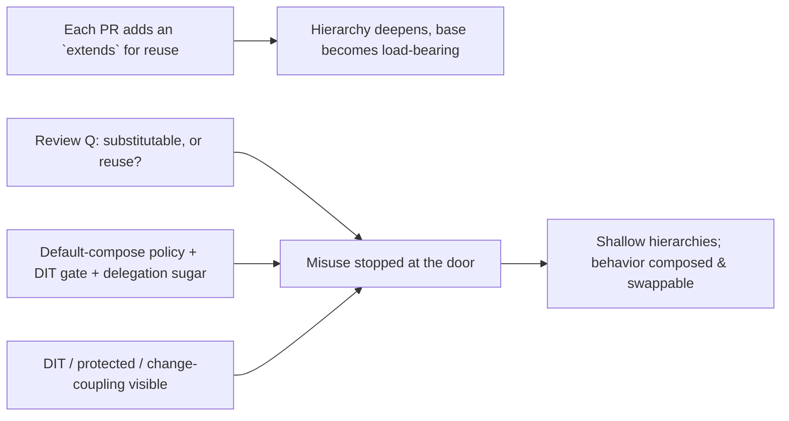
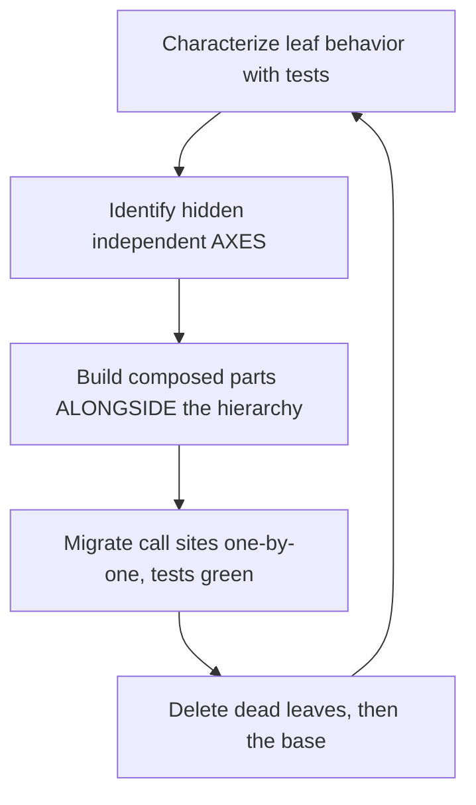

# Composition Over Inheritance — Professional

> **Category:** [Coupling & Cohesion](../../README.md) — prefer assembling behavior from has-a parts over building deep is-a class hierarchies.

> **Prerequisites:** [Junior](junior.md) · [Middle](middle.md) · [Senior](senior.md)
> **Focus:** **Production** — reviews, refactoring legacy hierarchies, team conventions, incidents

---

## Table of Contents

1. [Introduction](#introduction)
2. [Spotting Inheritance Misuse in Review](#spotting-inheritance-misuse-in-review)
3. [Refactoring a Deep Hierarchy to Composition](#refactoring-a-deep-hierarchy-to-composition)
4. [Replace Inheritance with Delegation, Safely](#replace-inheritance-with-delegation-safely)
5. [Team Conventions](#team-conventions)
6. [Measuring Hierarchy Health](#measuring-hierarchy-health)
7. [Real Incidents](#real-incidents)
8. [The Politics of "But Inheritance Is Less Code"](#the-politics-of-but-inheritance-is-less-code)
9. [Review Checklist](#review-checklist)
10. [Cheat Sheet](#cheat-sheet)
11. [Diagrams](#diagrams)
12. [Related Topics](#related-topics)

---

## Introduction

> Focus: **production** — keeping inheritance from calcifying a large codebase, and unwinding it where it already has.

Inheritance misuse is uniquely expensive at scale because it's **invisible until it's load-bearing**. A `BaseController` that three classes extend is harmless; the one that 80 classes extend, each depending on a slightly different slice of its protected methods, is a structure no one can change without a multi-week regression risk. By then the fragile-base-class coupling is woven through the whole system, and every "just add a protected helper to the base" PR tightens the knot.

The professional job is twofold: **stop new misuse at review** (cheap), and **safely unwind existing deep hierarchies** into composition (expensive, incremental, test-guarded). Both require turning the senior reasoning into team-level policy, metrics, and review reflexes — because, like all complexity, inheritance debt accrues one reasonable-looking `extends` at a time.

---

## Spotting Inheritance Misuse in Review

Most bad inheritance enters one PR at a time and *looks* economical. Reviewer reflexes:

### The tells

1. **`extends` used purely for code reuse.** The subclass overrides nothing and is never used polymorphically as the base — it just wanted the base's methods. That's a has-a. *"This `extends ReportBase` only to call `formatHeader()`. Could it `hold` a `ReportFormatter` instead?"*
2. **A method on the base that not every subclass can honor.** `BasePayment.refund()` where `CashPayment` throws `UnsupportedOperationException`. That's an LSP break ([Senior](senior.md)) — the hierarchy is wrong. *"`refund()` throws for two of five subclasses — that's a sign refundability is a composed capability, not a base method."*
3. **Overriding a third-party/framework class you don't control.** `extends HashMap`, `extends ArrayList` — you can't see the self-call structure, so you're one library upgrade from a silent break (the `InstrumentedHashSet` bug, [Middle](middle.md)). *"Wrap and forward instead of extending `HashMap` — we don't control its internals."*
4. **Deep hierarchies (3+ levels) or `protected` fields.** Each level multiplies the fragile-base-class surface; `protected` state is shared mutable internals across the whole subtree. *"This is the fourth `extends` level — what varies at each? Several of these look like axes that should be composed parts."*
5. **A subclass per combination of features/variants.** The class-explosion smell — `TimestampedEncryptedFileLogger`, `PremiumAnnualEUUser`. *"These combination-classes are Decorator/Strategy in disguise."*

### The highest-value review question

> **"Are you inheriting to be *substitutable as* the base, or just to *reuse* its code?"**

If the honest answer is "reuse," it's a has-a, and composition is the correct tool. This single question — asked of every `extends` — catches the majority of misuse, the same way *"what present requirement forces this?"* catches over-engineering. Make it routine, not adversarial.

---

## Refactoring a Deep Hierarchy to Composition

The production reality is rarely greenfield; it's a hierarchy that already exists, is in production, and is under-tested. The approach is **incremental, test-guarded, and behavior-preserving** — never a rewrite.

### Worked example: a notification hierarchy gone deep

```
Notification
 ├ EmailNotification
 │   ├ HtmlEmailNotification
 │   │   └ MarketingHtmlEmailNotification
 │   └ PlainEmailNotification
 ├ SmsNotification
 │   └ ShortenedSmsNotification
 └ PushNotification
     └ SilentPushNotification
```

The pain: "send marketing HTML email, but also as SMS" is impossible without a new class; the `retry` logic added to `Notification` for email broke SMS (which can't retry the same way); `MarketingHtmlEmailNotification` is four levels deep and nobody's sure what it inherits.

### The sequence

1. **Characterize first.** Write tests pinning the *current* observable behavior of each leaf class (what message each produces, what side effects). You can't refactor safely without this net — and the four levels mean behavior is scattered across the chain. (See [Refactoring as a Discipline](../../../craftsmanship-disciplines/03-refactoring-as-a-discipline/junior.md) on characterization tests.)
2. **Identify the axes hidden in the hierarchy.** Reading the tree, the *real* independent variables are:
   - **Channel:** email / SMS / push (the *destination* — a Strategy)
   - **Format:** HTML / plain / shortened (a transform on the body — a Decorator)
   - **Category:** marketing / transactional (adds headers, unsubscribe links — a Decorator)
   - **Delivery policy:** retry / silent (cross-cutting — a Decorator or injected policy)
   Four axes crammed into one inheritance tree → that's why it exploded and why combinations were impossible.
3. **Introduce the composed components alongside the hierarchy** (don't delete yet): a `Channel` interface with `EmailChannel`/`SmsChannel`/`PushChannel`; `FormatDecorator`s; a `RetryPolicy`. Build a `Notification` that *holds* a channel + a list of transforms.
4. **Migrate call sites one at a time**, each guarded by the characterization tests, replacing `new MarketingHtmlEmailNotification(...)` with the composed assembly.
5. **Delete the dead leaf classes**, then the base, once no caller references them.

### The result

```python
# Composed: each axis is an independent, swappable part
notif = Notification(
    channel=EmailChannel(smtp),                 # destination (Strategy)
    transforms=[HtmlFormat(), MarketingHeader()],# stacked features (Decorators)
    policy=RetryPolicy(max_attempts=3),         # cross-cutting (injected)
)
# "marketing HTML over SMS" — previously impossible — is now just:
Notification(channel=SmsChannel(gw), transforms=[MarketingHeader()], policy=NoRetry())
```

Eight classes (3 channels + ~3 transforms + 2 policies) replace the 9-class tree *and* unlock every combination, including the ones the hierarchy made impossible. **Migrate incrementally; never big-bang.**

---

## Replace Inheritance with Delegation, Safely

For a single over-extended class, the mechanical refactoring (Fowler's *Replace Superclass with Delegate* / *Replace Subclass with Delegate*) executed under tests:

```text
1. CHARACTERIZE — tests around the subclass's observable behavior.
2. CREATE A FIELD — give the subclass a field holding an instance of the former
   superclass (or, if extending a 3rd-party class, the wrapped object).
3. FORWARD — replace each inherited use with a call to the field
   (use the language's delegation sugar: Kotlin `by`, Lombok @Delegate, Go embed).
4. BREAK THE EXTENDS — change `class X extends Y` to `class X implements <Y's interface>`
   (extract an interface from Y first if none exists).
5. RE-POINT POLYMORPHISM — callers that relied on `X is-a Y` now rely on the
   shared interface; verify substitutability still holds where it's actually needed.
6. RUN THE TESTS at each step; commit small.
```

> The intermediate state may have *more* lines (forwarding methods) — that's expected and fine. You traded white-box coupling for black-box coupling; the extra lines are the visible price of the safety you bought. Use delegation sugar to shrink them.

The single most important production rule: **never replace inheritance with delegation without characterization tests pinning the old behavior** — because the fragile-base-class self-calls mean the *current* behavior may depend on details you can't see, and a "mechanical" refactor can silently change them.

---

## Team Conventions

Codify the senior reasoning so the safe path is the default and reviewers cite policy, not preference:

1. **Composition is the default; `extends` requires justification.** New code uses composition unless a written exception applies. Flip the burden of proof onto inheritance.
2. **The three sanctioned uses of `extends`:** (a) implementing a framework Template-Method hook (`extends Activity`, `HttpServlet`); (b) a genuinely substitutable, shallow (≤2 levels), stable is-a; (c) a sealed/closed typed hierarchy for exhaustive matching. Everything else composes.
3. **Never extend a class you don't own.** Wrap third-party classes; you can't trust their self-call structure across versions.
4. **No `protected` mutable state.** It's shared internals across the whole subtree — the fragile-base-class fuel. Prefer `private` + a constructor.
5. **Depth limit.** Lint/review-gate inheritance depth (DIT) at 2–3 for non-framework code; deeper requires a design note.
6. **Use the language's delegation sugar** (Kotlin `by`, Go embedding, Lombok `@Delegate`) so composition is as terse as inheritance — removing the "but extends is less code" excuse.
7. **Recognize the patterns by name.** "Subclass per variant → Strategy; subclass per feature-combination → Decorator" is written guidance so juniors reach for them automatically.

---

## Measuring Hierarchy Health

You can make inheritance debt visible with metrics — but, as everywhere in this curriculum, choose ones that track the real problem and distrust ones that don't.

| Metric | Tracks misuse? | Notes |
|---|---|---|
| **Depth of Inheritance Tree (DIT)** | **Yes** | Rising DIT = deepening hierarchies = more fragile-base surface. Gate it. |
| **Number of Children (NOC)** | Partially | Many direct subclasses can be fine (sealed ADT) or a god-base; read in context |
| **`protected` member count** | **Yes** | Shared mutable internals = the fragile-base-class coupling, directly counted |
| **Override + `super` call density** | **Yes** | Heavy `super` use signals subclasses entangled with base internals |
| **`extends` on non-owned types** | **Yes (binary)** | Any `extends` of a library class is a flagged risk |
| **Combination-class count** | **Yes (trend)** | A growing set of `XYZCombined` leaf classes = class explosion in progress |
| **Change-coupling (base ↔ subclasses)** | **Yes** | If editing a base repeatedly forces edits across its subtree (git history), the white-box coupling is real and active |

### The honest-measurement rules

- **DIT and `protected`-count are your primary inheritance-debt gauges** — they directly measure the fragile-base-class surface. Gate DIT in CI for non-framework packages.
- **Change-coupling is the ground truth.** If git history shows the base class and its subclasses change together repeatedly, the coupling the principle warns about is actively costing you — that's the case for refactoring to delegation.
- **NOC alone lies.** A `sealed` base with 12 children for exhaustive matching is *good* design; 12 children each overriding three protected methods is a god-base. The metric can't tell them apart — read the code.
- **The real metric is the outcome:** can you add a *new combination* of behaviors without writing a new class? If every new variant needs a new subclass, the hierarchy has failed and composition is overdue.

---

## Real Incidents

### Incident 1: The framework base class upgrade that broke instrumentation

A team had `class MetricsList<T> extends ArrayList<T>` overriding `add` to emit a metric, with `addAll` adding `c.size()` to the counter — the exact `InstrumentedHashSet` shape ([Middle](middle.md)). It worked for years. A JDK upgrade changed `ArrayList.addAll`'s internal use of `add`, and the metric counts **silently** drifted — no exception, no test failure, just wrong dashboards that misinformed a capacity-planning decision. **Fix:** replaced with `MetricsList implements List`, *wrapping* an `ArrayList` and forwarding. **Lesson:** never extend a class you don't own; its self-call structure is not part of its contract and can change under you. Wrap and forward.

### Incident 2: The 6-level controller hierarchy nobody could change

A web service grew `BaseController → AuthController → JsonController → PagedController → ...` six levels deep, each adding `protected` helpers and overriding `handle()` with `super.handle()` chains. A security fix needed in the base's auth check had to be verified against ~40 leaf controllers because each depended on a different slice of the inherited behavior. The fix took two weeks of regression testing. **Postmortem:** the levels encoded *independent* concerns (auth, serialization, pagination) as a *linear* chain — they should have been composable middleware/components. **Fix (incremental):** extracted each concern into an injected component (auth handler, serializer, paginator) over two quarters, opportunistically as controllers were touched. **Lesson:** independent concerns stacked as inheritance levels become a change-amplifier; compose them so each can change in isolation.

### Incident 3: `refund()` on the base that half the subclasses threw on

`abstract Payment` had `refund()`; `CardPayment` and `WalletPayment` implemented it, `CashPayment` and `VoucherPayment` threw `UnsupportedOperationException`. A batch-refund job iterated payments and called `refund()` — and crashed in production on the first cash payment, having already refunded half the batch (no transaction boundary). **Root cause:** an LSP violation — `CashPayment` is not substitutable for a refundable `Payment`. **Fix:** `refund()` moved off the base; refundability became a *capability* — a payment *has* an optional `RefundStrategy`, and the job filters `payments where refundable`. **Lesson:** a base method not all subclasses can honor is a design defect; the capability is composed, not inherited. (See [LSP](../../04-solid/03-lsp-liskov-substitution/junior.md).)

### Incident 4: The "clever" diamond via multiple inheritance

A Python service used multiple inheritance to mix `CacheMixin`, `RetryMixin`, and `LogMixin` into service classes. Two mixins both defined `_call()` and assumed they ran first; the MRO put them in an order that made retry wrap *outside* cache, so failed calls were cached and never retried. The bug surfaced only under a specific failure pattern weeks later. **Fix:** made the cross-cutting behaviors explicit, *ordered* decorators (composition) instead of MRO-resolved mixins, so the wrapping order was visible at the call site. **Lesson:** mixins solve the single-axis problem but reintroduce *resolution-order* fragility; when ordering matters, explicit composition is clearer than implicit linearization. (See [Senior](senior.md) on traits/mixins.)

---

## The Politics of "But Inheritance Is Less Code"

Sustaining composition is partly social, and the recurring objection is ergonomic, not theoretical:

- **"`extends` is one line; composition is thirty forwarding methods."** Often *true* in a language without delegation sugar — and a real reason teams over-inherit. **Counter:** adopt the sugar (Kotlin `by`, Go embedding, Lombok `@Delegate`) so the safe choice is also the terse one. Remove the ergonomic incentive and the argument evaporates. ([Senior](senior.md) covers the tooling.)
- **"This hierarchy is fine, it's worked for years."** It works until it's load-bearing and someone needs to change the base. Inheritance debt is silent until the change that exposes it — and by then it's expensive. **Counter:** measure DIT/`protected`/change-coupling so the debt is visible *before* the painful change.
- **Inheritance looks like proper OO; composition looks like "not using the language."** Cultural, and backwards: Go and Rust have no inheritance and are excellent OO-adjacent languages. **Counter:** reframe — separating *substitutability* (interfaces) from *reuse* (composition) is the more sophisticated design, not the lazier one.
- **Senior engineers set the reflex.** If the staff engineer's first move is always `extends BaseService`, everyone copies it. Model "hold a component and delegate," and explain why you didn't subclass.

> A useful proverb for the wall: *"Inheritance is a promise you make on someone else's behalf — every subclass now depends on a base you didn't design to be depended on. Composition only promises what the interface says."*

---

## Review Checklist

```text
COMPOSITION-OVER-INHERITANCE REVIEW CHECKLIST
[ ] SUBSTITUTABLE? — is this `extends` for substitutability, or just reuse?
                     (reuse → compose)
[ ] LSP — does every subclass honor every base method? (no throw/UnsupportedOp)
[ ] OWNED? — never `extends` a class we don't control (wrap & forward instead)
[ ] DEPTH — inheritance ≤ 2-3 levels for non-framework code? deeper → design note
[ ] PROTECTED — no shared mutable `protected` state (fragile-base fuel)
[ ] EXPLOSION — any "subclass-per-combination"? → Strategy/Decorator instead
[ ] SANCTIONED USE — is it a framework hook, shallow stable is-a, or sealed ADT?
[ ] INTERFACE — composed fields typed as interfaces, not concrete classes?
[ ] SUGAR — used `by`/@Delegate/embedding to avoid hand-forwarding?
[ ] TESTS — characterization tests before replacing inheritance with delegation?
```

---

## Cheat Sheet

```text
HIGHEST-VALUE REVIEW Q
  "Inheriting to be SUBSTITUTABLE AS the base, or just to REUSE its code?"
  reuse → has-a → compose.

SANCTIONED `extends` (everything else composes)
  framework Template-Method hook · shallow stable substitutable is-a · sealed ADT

NEVER
  extend a class you don't own · put a method on a base not all subclasses honor ·
  protected mutable state · subclass-per-combination

REFACTOR DEEP HIERARCHY (incremental, never big-bang)
  characterize → find the hidden AXES → build composed parts ALONGSIDE →
  migrate call sites one-by-one under tests → delete dead leaves then base

REPLACE INHERITANCE WITH DELEGATION
  characterize → add field → forward (use `by`/@Delegate) → break extends to
  implements <interface> → re-point polymorphism → small commits

MEASURE
  DIT + protected-count + change-coupling(base<->subclasses).  NOT NOC alone.
  ground truth: can you add a NEW COMBINATION without a new class?

POLITICS
  kill "extends is less code" with delegation SUGAR · make DIT visible ·
  reframe: separating substitutability from reuse is the senior move
```

---

## Diagrams

### Where inheritance debt enters and how it's stopped



### Incremental hierarchy → composition refactor



---

## Related Topics

- **The is-a / LSP test:** [Liskov Substitution Principle](../../04-solid/03-lsp-liskov-substitution/junior.md)
- **Why it's weaker coupling:** [Minimise Coupling](../01-minimise-coupling/junior.md)
- **Same argument, other angles:** [Open/Closed Principle](../../04-solid/02-ocp-open-closed/junior.md), [Encapsulate What Changes](../../03-module-and-class/01-encapsulate-what-changes/)
- **As patterns:** Strategy & Decorator
- **Tooling:** Kotlin `by` delegation, Go embedding, Lombok `@Delegate`; DIT/NOC metrics (SonarQube), git change-coupling analysis.

---


---

## Check your understanding

1. Explain Composition Over Inheritance — Professional Level in your own words and name the problem it solves.
2. How would you apply the ideas around Table of Contents, Introduction, Spotting Inheritance Misuse in Review in a realistic engineering change?
3. What failure mode or misuse should you look for, and what evidence would reveal it?
4. How would you introduce and govern Composition Over Inheritance — Professional Level across teams through reversible, measurable increments?
5. What observable result would convince you that the approach improved the system?
