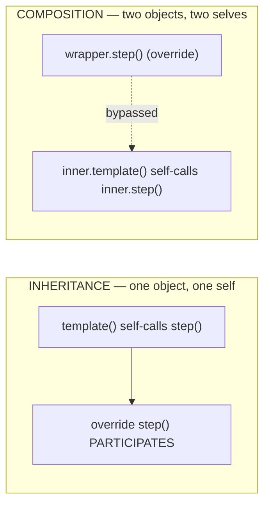

# Composition Over Inheritance — Senior

> **Category:** [Coupling & Cohesion](../../README.md) — prefer assembling behavior from has-a parts over building deep is-a class hierarchies.

> **Prerequisites:** [Junior](junior.md) · [Middle](middle.md)
> **Focus:** **Design trade-offs** and **system-level reasoning**

---

## Table of Contents

1. [Introduction](#introduction)
2. [Why GoF Ranked Composition First](#why-gof-ranked-composition-first)
3. [Interface vs. Implementation Inheritance, Precisely](#interface-vs-implementation-inheritance-precisely)
4. [The Self Problem: Composition's Hardest Trade-off](#the-self-problem-compositions-hardest-trade-off)
5. [Traits and Mixins Shift the Calculus](#traits-and-mixins-shift-the-calculus)
6. [How Languages Without Inheritance Compose](#how-languages-without-inheritance-compose)
7. [The Forwarding Tax and How Languages Pay It](#the-forwarding-tax-and-how-languages-pay-it)
8. [When Composition Is the Wrong Default](#when-composition-is-the-wrong-default)
9. [Composition, OCP, and Encapsulation as One Argument](#composition-ocp-and-encapsulation-as-one-argument)
10. [Liabilities](#liabilities)
11. [Pros & Cons at the System Level](#pros-cons-at-the-system-level)
12. [Diagrams](#diagrams)
13. [Related Topics](#related-topics)

---

## Introduction

> Focus: **design trade-offs** and **system-level reasoning**

A senior treats "favor composition over inheritance" not as a rule to obey but as a *consequence* of deeper invariants — coupling strength, encapsulation, and binding time — and knows exactly where those invariants flip the recommendation. This file answers the hard questions:

1. **Why** did the Gang of Four rank composition first, in terms of coupling theory rather than slogan?
2. **What is the cost of composition** that's usually glossed over — the self/schizophrenia problem — and when does it bite?
3. **How do traits, mixins, and inheritance-free languages (Go, Rust)** change the calculus, and what does that teach about the principle's core?
4. **Where is composition the *wrong* default** — when is the forwarding tax or the loss of a typed hierarchy not worth it?

---

## Why GoF Ranked Composition First

The Gang of Four didn't argue from taste; they argued from **coupling and binding time**. Their reasoning, made explicit:

**Inheritance is white-box reuse.** "The internals of parent classes are often visible to subclasses." A subclass can — and routinely does — depend on the parent's *implementation*, not just its interface. That dependency is the strongest coupling in OO: the parent cannot evolve its internals without risking every subclass (the fragile base class problem of [Middle](middle.md)). It also *breaks encapsulation*: the unit of encapsulation (the class) has a hole in it through which subclasses reach.

**Composition is black-box reuse.** Objects are accessed solely through their interfaces, so "no internals are exposed." The coupling is the minimum possible: only the published contract. And because the composed parts are *objects*, the relationship is established at **runtime** — you can change parts dynamically — whereas inheritance is fixed at **compile time**.

GoF's summary, which a senior should be able to recite as causation, not slogan:

> "Favoring object composition over class inheritance helps you keep each class encapsulated and focused on one task. Your classes and class hierarchies will remain small and will be less likely to grow into unmanageable monsters."

There's a corresponding cost they were honest about: composition gives you "more objects (if fewer classes)" and the system's behavior "depends on their interrelationships instead of being defined in one class." That's the trade — *static, concentrated, coupled* (inheritance) vs. *dynamic, distributed, decoupled* (composition). They favored composition because **coupling and encapsulation are worth more than the convenience of free code reuse** — and a senior must be able to articulate that the recommendation *is a coupling argument*, full stop.

---

## Interface vs. Implementation Inheritance, Precisely

The most common senior-level mistake is conflating the two inheritances and either over-applying or over-condemning "inheritance" wholesale. Pin them down:

| | **Interface inheritance** | **Implementation inheritance** |
|---|---|---|
| You inherit | A *type* — signatures, a subtyping promise | *Code* — a parent's method bodies and fields |
| Establishes | "An A can be used wherever a B is expected" | "An A reuses B's implementation" |
| Governed by | [Liskov Substitution Principle](../../04-solid/03-lsp-liskov-substitution/junior.md) | Fragile base class / encapsulation concerns |
| Coupling | Weak — only a contract | Strong — white-box, to internals |
| The principle's stance | **Endorses it** (this is good subtyping) | **Warns against it** (compose instead) |
| Java | `implements` / extending a pure abstract type | `extends` a concrete class for its code |

> **"Favor composition over inheritance" means "favor composition over *implementation* inheritance."** It is *not* an argument against subtyping. Indeed the canonical composed solution — `class InstrumentedSet implements Set { private Set s; ... }` — *uses* interface inheritance (`implements Set`, so it's substitutable) precisely to *avoid* implementation inheritance (it wraps rather than extends).

This is why languages that separate the two so cleanly make the principle effortless. **Go interfaces** and **Rust traits** are pure interface inheritance with *no* implementation inheritance of the Java `extends`-a-concrete-class kind. Java's `interface` (especially since default methods muddied this) and a concrete `extends` give you both, and you have to choose deliberately. The senior heuristic:

> **Inherit interfaces freely (for substitutability). Inherit implementations rarely (only from bases designed for it). Compose implementations by default.**

---

## The Self Problem: Composition's Hardest Trade-off

This is the trade-off most "just use composition" advice omits, and the one a senior must understand to use composition honestly.

With inheritance, there is **one object** with **one identity**. When `incrementBy` self-calls `increment()`, an overridden `increment()` *participates* — `this` is polymorphic across the whole object. That's the fragile-base-class hazard, but it's also a *feature*: open recursion / virtual dispatch through `this` lets a base algorithm call into subclass refinements.

With delegation-based composition, there are **two objects** with **two identities** — the wrapper and the wrappee. When the wrappee calls one of *its own* methods internally, it calls *its* method, **not** the wrapper's override of it. The wrapper's specialization is *invisible* to the wrappee. This is the **self problem** (a.k.a. **object schizophrenia**):

```python
class Base:
    def template(self):  return self.step()      # self-call
    def step(self):       return "base step"

# Inheritance: override participates in the self-call
class SubInherit(Base):
    def step(self): return "OVERRIDDEN"
SubInherit().template()        # → "OVERRIDDEN"   (this is polymorphic)

# Composition: the wrapper's override is INVISIBLE to the wrappee's self-call
class Wrapper:
    def __init__(self, inner): self.inner = inner
    def step(self):     return "OVERRIDDEN"
    def template(self): return self.inner.template()   # delegate
Wrapper(Base()).template()     # → "base step"   (inner.step(), NOT wrapper.step())
```

The wrapper *intended* to specialize `step`, but because `inner.template()` self-calls `inner.step()`, the specialization is bypassed. The wrappee has no back-reference to the wrapper, so `self` inside the wrappee is the wrappee, not the composite. **The single conceptual entity is split across two objects, each with its own `self` — schizophrenia.**

### Why this matters and how seniors handle it

- It's the precise reason **Decorator works for *adding* behavior around calls but not for *changing* the wrappee's internal algorithm.** Decorators intercept at the boundary; they cannot reach into the wrappee's self-calls.
- It's the trade-off you accept *deliberately*: inheritance gives you open recursion (powerful but fragile); composition gives you encapsulation (safe but no automatic participation in self-calls).
- **Mitigations:** pass the composite back in (a `self`/parent back-reference — re-introduces coupling and is fiddly); design the wrappee so its public methods don't depend on overridable self-calls (the same discipline that makes a base class safe for inheritance); or accept that the two objects are genuinely two and don't try to make the wrapper "become" the wrappee.

> The honest senior framing: inheritance's open recursion and composition's self problem are **two sides of one coin**. Inheritance lets a base call into your override (handy, and the source of fragility). Composition refuses to (safe, and the source of the self problem). You can't get participation-in-self-calls *and* encapsulation from the same mechanism.

---

## Traits and Mixins Shift the Calculus

The junior/middle framing — "inheritance (single base, white-box) vs. composition (objects, black-box)" — is a *two-language* picture (Java/C#). Languages with **traits/mixins** add a third option that changes the trade-off: **implementation reuse without a single base-class hierarchy and without the object-identity split.**

| Language | Feature | What it gives you |
|---|---|---|
| **Scala** | `trait` (with concrete methods + fields) | Mix *multiple* implementations into one type; linearized to resolve the diamond |
| **Rust** | `trait` with default methods | Interface + optional shared implementation; **no** data inheritance, composed-by-default ethos |
| **Ruby** | `module` + `include`/`prepend` | Mix method implementations into a class; `prepend` even solves some self-problem cases |
| **Python** | multiple inheritance + ABCs as mixins | Mixin classes resolved by MRO (C3 linearization) |
| **PHP** | `trait` | Compile-time copy of methods into the using class |
| **Groovy/Kotlin** | traits / interface default methods | Shared default behavior across implementers |

Traits sit *between* inheritance and composition:

- Like **inheritance**, they reuse *implementation* and the methods run with the using class's `this` — so there's **no self problem** (the trait's self-call hits the *final* object's override). This is a real advantage over delegation-based composition.
- Like **composition**, they don't force a single classification axis — you mix in *several* traits, so the class-explosion / single-axis problem is gone.

The cost they reintroduce: traits are still *white-box-ish* (a trait can depend on abstract members the user must provide), and stacking many traits has its own resolution rules (linearization order, diamond conflicts). They don't eliminate the fragility, they relocate it.

> The lesson a senior extracts: **"composition over inheritance" is really "favor weak coupling, dynamic binding, and one-axis-per-concern over strong coupling, static binding, and forced single-axis classification."** Traits are a *different point* on that trade-off space — better than Java inheritance on the single-axis problem, better than delegation on the self problem, worse than composition on dynamic swappability and worse than pure interfaces on coupling. The principle's *spirit* (don't entangle behavior into a rigid hierarchy) survives; the specific mechanism you'd pick depends on the language.

---

## How Languages Without Inheritance Compose

The strongest evidence that composition is sufficient: two major languages ship with **no implementation inheritance at all** and are not impaired.

### Go — embedding + interfaces

Go has structs (data), interfaces (contracts), and **embedding** (a struct can embed another, promoting its methods). There is no `extends`, no subclass, no virtual override of a base method.

```go
type Logger struct{}
func (Logger) Log(msg string) { fmt.Println(msg) }

type Service struct {
    Logger          // EMBEDDED — Service gets Log() promoted, no inheritance
    name string
}
// s.Log("hi") works — but it is DELEGATION, not inheritance:
// Logger has no idea it's inside Service; there is no virtual dispatch back
// into Service. No fragile base class, no self problem of the inheritance kind.
```

Embedding *looks* like inheritance (promoted methods) but is **composition with auto-forwarding** — the embedded value is a real field with its own identity, and there's no open recursion from `Logger` back into `Service`. Polymorphism is achieved entirely through **interfaces** (structural, implicitly satisfied): you depend on `interface { Log(string) }`, and any type with that method qualifies. Go thus splits the two inheritances perfectly: interfaces for substitutability, embedding for reuse — and there's no implementation-inheritance hazard to have.

### Rust — traits + structs, "composition by construction"

Rust has **no inheritance of any kind** between structs. You get:

- **structs** for data,
- **traits** for shared behavior contracts (with optional default methods),
- and you **compose** by holding fields and implementing traits.

```rust
trait Attack { fn attack(&self) -> String; }
struct Sword; impl Attack for Sword { fn attack(&self) -> String { "slash".into() } }
struct Bow;   impl Attack for Bow   { fn attack(&self) -> String { "shoot".into() } }

struct Character { weapon: Box<dyn Attack> }   // HAS-A a behavior (Strategy)
impl Character {
    fn attack(&self) -> String { self.weapon.attack() }   // delegate
}
```

Rust's ecosystem leans hard into composition and trait-based polymorphism precisely because it has no other option — and it's widely regarded as having *excellent* abstraction facilities. That a systems language deliberately omitted inheritance is the principle taken to its logical end: if you separate "shared contract" (traits) from "shared data/behavior" (composition), you don't need implementation inheritance at all.

> Go and Rust are the empirical answer to "but surely you sometimes *need* inheritance for reuse." You don't. You need *substitutability* (interfaces/traits) and *reuse* (composition/embedding) — and those are cleaner kept apart.

---

## The Forwarding Tax and How Languages Pay It

Composition's one genuine ergonomic cost is **forwarding boilerplate**: to make a wrapper present the wrapped object's full interface, you hand-write a one-line method per operation. For a `Set` wrapper that's ~15 methods of pure delegation. This tax is real, and it's *the* reason developers reach for `extends` against their better judgement — inheritance gives the whole interface for free.

Mature ecosystems pay the tax mechanically so the safe choice is also the convenient one:

| Language/tool | Mechanism | Effect |
|---|---|---|
| **Kotlin** | `class C(s: Set) : Set by s` | Compiler generates all forwarding methods; override only what you change |
| **Go** | struct embedding | Promoted methods auto-forward; no boilerplate |
| **Java + Lombok** | `@Delegate` | Generates forwarding methods at compile time |
| **C#** | (no native delegation) | Boilerplate, or source generators / `dynamic` |
| **Groovy** | `@Delegate` | Same as Lombok |
| **TypeScript** | mixins via functions / `Object.assign` | Compose behavior without per-method forwarding |

Kotlin's `by` is the clearest demonstration: `class InstrumentedSet<E>(s: MutableSet<E>) : MutableSet<E> by s` *generates* every forwarding method, and you override only `add`/`addAll`. You get the `InstrumentedSet` design — interface inheritance + composition — with the brevity of `extends` and none of the fragility. A senior should know that **the forwarding tax is a tooling problem, not a fundamental one**, and that its existence is why some teams over-inherit on languages that lack delegation sugar.

---

## When Composition Is the Wrong Default

Composition is the *default*, not a universal. It's the worse choice when:

1. **The relationship is a true, stable, substitutable is-a and the base is designed for extension.** A framework Template Method (`extends Activity`, `HttpServlet.doGet`) *is* implementation inheritance, and it's correct — the base's self-calls are the published contract. Composing here means fighting the framework.
2. **You need a closed, exhaustively-typed hierarchy** (sealed classes / algebraic data types: Kotlin `sealed`, Rust `enum`, Scala `sealed trait`). Here "inheritance" is being used to enumerate a *fixed* set of variant types for exhaustive matching — composition can't give you the compiler's exhaustiveness check.
3. **The forwarding tax exceeds the coupling benefit** in a language without delegation sugar, *for a shallow, stable, single-axis case*. Writing 30 forwarding methods to wrap a class you'd safely subclass in one line — when there's only one axis and the base is stable — is the principle applied dogmatically. Favor ≠ always.
4. **You'd recreate open recursion by hand.** If the design genuinely needs a base algorithm to call into specialized steps (Template Method's whole point), inheritance expresses it directly; composition forces an awkward back-reference (the self-problem mitigation) that's *more* coupled than the inheritance would have been.

> The senior tell of *misapplied* composition: a tangle of mutual back-references and "context" objects passed around to recover the open recursion that inheritance gave for free — that's composition fighting a problem inheritance was built for. Recognize Template-Method-shaped problems and let them inherit.

---

## Composition, OCP, and Encapsulation as One Argument

At the system level, this principle is not isolated — it's the same argument as three of its neighbors, viewed from different angles:

- **[Encapsulate What Changes](../../03-module-and-class/01-encapsulate-what-changes/):** the varying axis (weapon, log destination, sort order) becomes a *composed component behind an interface* — you've encapsulated the change point as an object. Composition is *how* you encapsulate variation.
- **[Open/Closed Principle](../../04-solid/02-ocp-open-closed/junior.md):** with Strategy/Decorator you add behavior by adding a *new component*, never editing existing classes. Composition is *how* you get open-for-extension without a sprawling subclass tree. (Inheritance can also serve OCP — via subclassing — but composition does it with weaker coupling.)
- **[Minimise Coupling](../01-minimise-coupling/junior.md):** the entire case for composition reduces to "it's the weaker coupling." White-box (inheritance) vs. black-box (composition) is a coupling-strength statement; everything else follows.

> A senior should be able to collapse these into one sentence: *encapsulate the thing that varies as an object behind an interface (encapsulation), hold it and delegate (composition), and you can extend the system by adding components rather than editing or subclassing (OCP) — all at the minimum coupling (black-box).* "Composition over inheritance" is the mechanical core of that whole cluster.

---

## Liabilities

### Liability 1: "Never inherit" cargo-culting

The principle is *favor*. Teams that ban `extends` outright fight frameworks, recreate Template Method with clumsy callbacks, and lose the compiler's exhaustiveness checks on sealed hierarchies. Inheritance for substitutable, stable, designed-for-extension cases is correct.

### Liability 2: Ignoring the self problem

Reaching for Decorator to *change* a wrappee's internal algorithm fails silently — the override is bypassed by the wrappee's self-calls. If the design needs open recursion, composition is the wrong tool, or needs an explicit back-reference (with its coupling cost).

### Liability 3: Indirection sprawl

Composition trades a hierarchy for a *graph* of collaborating objects. Ten-deep decorator stacks and delegate-to-delegate-to-delegate chains can be harder to trace than the inheritance they replaced. Composition is the default, not a license to atomize every behavior.

### Liability 4: Forwarding tax driving bad inheritance

On languages without delegation sugar, the boilerplate of wrapping pushes developers to `extends` for convenience. The fix is tooling (`by`, `@Delegate`, embedding) or accepting the boilerplate — *not* inheriting where you shouldn't.

### Liability 5: Composing against concrete types

Holding a `HashSet` field instead of a `Set` field throws away the flexibility composition exists to provide — you're now coupled to a concrete class through a field instead of through `extends`. Compose against *interfaces*.

---

## Pros & Cons at the System Level

| Dimension | Implementation Inheritance | Composition / Delegation | Traits / Mixins |
|---|---|---|---|
| Coupling | Strong (white-box) | Weak (black-box) | Medium (white-box-ish) |
| Binding | Static (compile time) | Dynamic (runtime, swappable) | Static |
| Encapsulation | Broken (fragile base class) | Preserved | Partly preserved |
| Multiple axes | Explodes (product) | Scales (sum) | Scales (mix several) |
| Self-calls / open recursion | Yes (powerful + fragile) | **No (self problem)** | Yes (no self problem) |
| Boilerplate | None (free reuse) | High (forwarding) unless tooled | Low |
| Substitutability | Bundled in | Via separate interface inheritance | Via the trait as a type |
| Best for | Framework hooks, stable substitutable is-a, sealed ADTs | Reuse, varying/optional behavior, testability, multi-axis | Cross-cutting reuse without a single base, languages that have them |

The system-level synthesis: composition wins on **coupling, encapsulation, dynamic flexibility, and multi-axis scaling** — the things that dominate long-lived, changing codebases — and *loses* on **boilerplate and open recursion**. Boilerplate is a solved tooling problem; open recursion is a genuine capability you should inherit for when you actually need it (Template Method). That asymmetry — composition's losses are either tooling-fixable or rare — is *why* it's the default.

---

## Diagrams

### The trade-off space (it's not binary)


### The self problem in one picture



---

## Related Topics

- **The is-a test:** [Liskov Substitution Principle](../../04-solid/03-lsp-liskov-substitution/junior.md)
- **Why it's the weaker coupling:** [Minimise Coupling](../01-minimise-coupling/junior.md)
- **The same argument, other angles:** [Open/Closed Principle](../../04-solid/02-ocp-open-closed/junior.md), [Encapsulate What Changes](../../03-module-and-class/01-encapsulate-what-changes/)
- **As patterns:** Strategy & Decorator

---


---

## Check your understanding

1. Explain Composition Over Inheritance — Senior Level in your own words and name the problem it solves.
2. How would you apply the ideas around Table of Contents, Introduction, Why GoF Ranked Composition First in a realistic engineering change?
3. What failure mode or misuse should you look for, and what evidence would reveal it?
4. How would you validate a system-level decision about Composition Over Inheritance — Senior Level under uncertainty?
5. What observable result would convince you that the approach improved the system?
