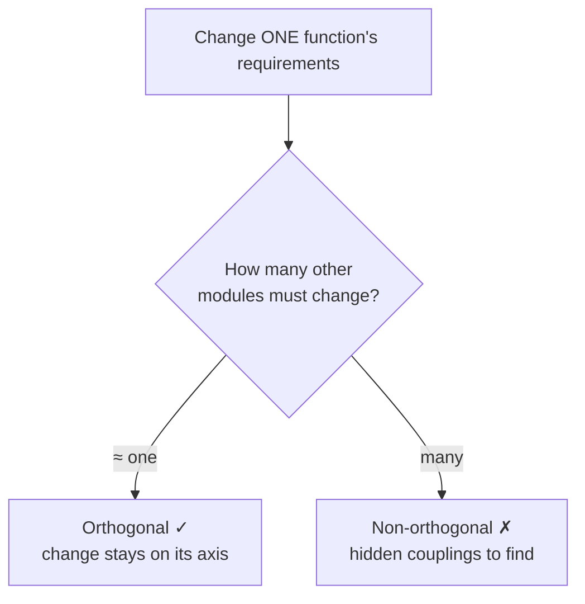
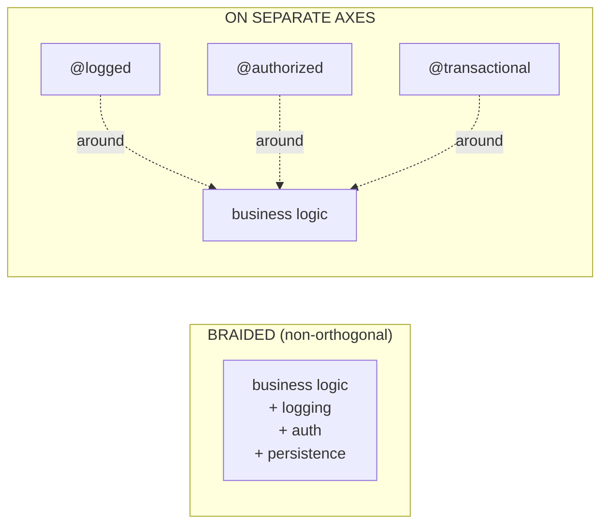

# Orthogonality — Middle

> **Category:** [Coupling & Cohesion](../../README.md) — designing a system so that unrelated parts stay unrelated: a change in one place has no effect on the others.

> **Prerequisite:** [Junior](junior.md)
> **Focus:** **Why** and **When**

---

## Table of Contents

1. [Introduction](#introduction)
2. [How to Test for Orthogonality](#how-to-test-for-orthogonality)
3. [The Contractor / Team Test](#the-contractor--team-test)
4. [Toolkit and Library Orthogonality](#toolkit-and-library-orthogonality)
5. [Cross-Cutting Concerns Are Orthogonality's Hard Case](#cross-cutting-concerns-are-orthogonalitys-hard-case)
6. [Layering as an Orthogonality Tool](#layering-as-an-orthogonality-tool)
7. [Don't Rely on Properties You Can't Control](#dont-rely-on-properties-you-cant-control)
8. [Orthogonality vs. Coupling and Cohesion, Precisely](#orthogonality-vs-coupling-and-cohesion-precisely)
9. [The DRY Tension, Introduced](#the-dry-tension-introduced)
10. [Trade-offs](#trade-offs)
11. [Edge Cases](#edge-cases)
12. [Tricky Points](#tricky-points)
13. [Best Practices](#best-practices)
14. [Test Yourself](#test-yourself)
15. [Summary](#summary)
16. [Diagrams](#diagrams)

---

## Introduction

> Focus: **Why** and **When**

At the junior level, orthogonality is a definition and two analogies. At the middle level it becomes a **diagnostic skill**: given a real design, can you tell *how* orthogonal it is, *where* the hidden couplings are, and *whether* a proposed change will stay on its own axis? And — the harder judgement — *when* a little non-orthogonality is acceptable, because perfect independence is neither achievable nor free.

The central middle-level move is learning to **run the orthogonality test on a design before you trust it**: imagine changing one thing and count how many *other* things move. The fewer, the more orthogonal. This file gives you the concrete tests (the contractor/team test, the library test), the hard case (cross-cutting concerns), and the first real trade-off (orthogonality vs. DRY).

---

## How to Test for Orthogonality

Hunt & Thomas give a single, sharp question that operationalizes the whole principle:

> **"If I dramatically change the requirements behind one particular function, how many modules are affected?"**
> — *The Pragmatic Programmer*

In an orthogonal system the answer is **one** (or close to it). In a non-orthogonal system the answer is "lots, and I'm not sure I've found them all" — which is exactly the fear that makes a codebase slow to change.

Run this test as a thought experiment on each axis of your design:

| Imagined requirement change | Orthogonal system | Non-orthogonal system |
|---|---|---|
| "Change the date format" | 1 formatting module | Every screen and report |
| "Swap the database" | 1 persistence module | Persistence + domain + UI |
| "Log as JSON, not text" | 1 logger implementation | Every place that logs inline |
| "Add a second currency" | 1 money/pricing module | Pricing + display + storage + reports |

The number of modules affected is a **direct measurement of non-orthogonality.** A high count is the design telling you that concerns you thought were separate are actually wired together. This is also the most useful thing to do in design review: take the likeliest future change and ask how far it ripples.

---

## The Contractor / Team Test

A second test from the book makes orthogonality concrete at the *team* level — and it's a great interview answer:

> **Could you bring in an independent contractor to build one feature, hand them a thin interface, and have them work without needing to understand the rest of your system — and without their work disturbing yours?**

If yes, that feature is orthogonal to the rest: it sits behind a narrow contract, depends on nothing it shouldn't, and changes nothing it shouldn't. If no — if the contractor would need a two-week tour of the whole codebase, or their feature would force edits across unrelated modules — those modules are **not** orthogonal.

The team version of the same test, which you can apply today without hiring anyone:

- **Can two engineers work on two features in parallel without colliding?** Orthogonal modules → independent pull requests, no merge conflicts on the same files, no "wait, your change broke my feature." Non-orthogonal modules → constant coordination, shared files, surprise breakages.
- **Can a new hire be productive on one module without learning all the others?** Orthogonality bounds how much of the system you must hold in your head to make a safe change. The smaller that bound, the more orthogonal — and the faster people onboard.

> Orthogonality is what lets a team's *throughput scale with its size*. Without it, every engineer's change can break every other engineer's work, so coordination cost grows faster than the team — and you slow down by hiring.

---

## Toolkit and Library Orthogonality

Orthogonality isn't only about *your* modules — it applies to the **third-party toolkits and libraries** you adopt. The test:

> **Does using library A constrain or interfere with library B?** Does adopting a framework force its assumptions into code that has nothing to do with it?

Non-orthogonal toolkits are a real and common trap:

- A web framework that demands your domain objects extend *its* base class — now your business logic is coupled to the framework, and you can't test or reuse it without dragging the framework along.
- An ORM whose entity types leak through every layer, so a database change ripples into the UI.
- Two libraries that each insist on owning the global event loop, or registering the same global signal handler — adopting both breaks both.

The defensive technique is to **wrap external dependencies behind your own thin interface** so the library touches exactly one place in your code:

```typescript
// NON-ORTHOGONAL: the HTTP library's types leak everywhere.
import axios, { AxiosResponse } from "axios";
function getUser(id: string): Promise<AxiosResponse> {   // axios type in your API
  return axios.get(`/users/${id}`);
}
// Now EVERY caller depends on axios. Swapping it = system-wide change.

// ORTHOGONAL: wrap it; your own type at the boundary.
interface HttpClient {
  get<T>(url: string): Promise<T>;
}
class AxiosHttpClient implements HttpClient {            // axios lives HERE only
  async get<T>(url: string): Promise<T> {
    return (await axios.get<T>(url)).data;
  }
}
// Swapping axios for fetch = one new class. Callers never knew axios existed.
```

The wrapper keeps the library on its **own axis**. The cost is one small adapter; the benefit is that the library can change (or be replaced) without rippling. (Note: don't wrap *everything* reflexively — wrap dependencies you might realistically need to swap or that leak awkward types. Wrapping the standard library "just in case" is the over-orthogonalizing mistake covered at [Senior](senior.md).)

---

## Cross-Cutting Concerns Are Orthogonality's Hard Case

Some concerns naturally want to spread across *every* module: **logging, security/auth, persistence, transactions, metrics, caching.** These are **cross-cutting concerns**, and they are the hardest thing to keep orthogonal, because by their nature they touch everything.

If you handle them naively — a `log.info(...)` call, a permission check, a `db.commit()` sprinkled inside every business method — you've braided an unrelated concern into all your business logic. Now a change to *how you log* ripples through *all the business code*, and the business logic can't be read, tested, or reused without the logging tangled in. That's maximal non-orthogonality.

Keeping cross-cutting concerns orthogonal is the goal of **[Separation of Concerns](../../01-generic/03-separation-of-concerns/junior.md)**, and the techniques include:

- **Decorators / middleware** — wrap the business call with logging or auth *around* it, leaving the business code clean.
- **Aspect-Oriented Programming (AOP)** — declare cross-cutting behavior (e.g., "log every public method," "require a transaction here") separately and weave it in, so it lives on its own axis.
- **Interfaces and injection** — the business code depends on a `Logger` interface, not a concrete logger, so the logging implementation varies independently.

```python
# BRAIDED (non-orthogonal): logging tangled into business logic.
def transfer(account, amount):
    logging.info(f"transfer {amount} from {account.id}")   # logging concern
    if not is_authorized(account):                          # security concern
        raise PermissionError
    account.balance -= amount                               # the ACTUAL business rule
    db.commit()                                             # persistence concern
    logging.info("transfer complete")                      # logging again

# ORTHOGONAL: business rule alone; cross-cutting concerns layered around it.
def transfer(account, amount):                 # pure business rule, nothing else
    account.balance -= amount

# logging, auth, persistence are applied OUTSIDE, as decorators/middleware:
@logged                                        # logging axis
@authorized                                    # security axis
@transactional                                 # persistence axis
def transfer(account, amount):
    account.balance -= amount
```

Now "change the log format" touches the `@logged` decorator only; the business rule is untouched and independently testable. The cross-cutting concern has been pulled onto its own axis. (Deeper treatment — including the limits of AOP — at [Senior](senior.md). For the full principle, see [Separation of Concerns](../../01-generic/03-separation-of-concerns/junior.md).)

---

## Layering as an Orthogonality Tool

**Layering** is the most common structural technique for orthogonality: stack the system into layers (UI → application → domain → persistence), where each layer depends only on the one below and talks to it through an interface.

```
   ┌─────────────────┐
   │       UI        │  depends ↓ only
   ├─────────────────┤
   │   Application   │  depends ↓ only
   ├─────────────────┤
   │     Domain      │  depends ↓ only (or on nothing)
   ├─────────────────┤
   │   Persistence   │
   └─────────────────┘
   A change in one layer's INTERNALS doesn't cross the boundary.
```

Layering buys orthogonality along the **vertical axis**: you can rework the UI without touching the domain, or swap persistence without touching the UI, as long as the interfaces between layers hold. The discipline that makes it work is **depend only downward, only through the interface** — the moment the UI reaches past the application layer straight into the database, the layering (and the orthogonality) is broken. This is the same idea as low coupling between layers; see [Minimise Coupling](../01-minimise-coupling/middle.md).

---

## Don't Rely on Properties You Can't Control

A subtle source of non-orthogonality: **depending on something you don't own and can't keep stable.** The Pragmatic Programmer's guidance — *"don't rely on the properties of things you can't control"* — means: if your code's correctness depends on another component's *internal* detail (a private field, an undocumented behavior, the exact order it does things), then a change to *that* detail — which you can't see and didn't approve — silently breaks you. You've created a hidden, non-orthogonal link to code outside your control.

```java
// FRAGILE: depends on an internal detail you don't control.
String name = user.getProfile().getInternalCache().get("displayName");
// If the library changes how it caches profiles, your code breaks —
// and nothing in YOUR codebase changed.

// ORTHOGONAL: depend on the stable, published interface only.
String name = user.getDisplayName();   // a contract the library promises to keep
```

The rule of thumb: **depend on contracts, not on accidents.** A published interface is a promise; an internal field is an accident of the current implementation. Coupling to promises keeps you orthogonal to the other component's internal evolution; coupling to accidents ties you to changes you can't even observe.

---

## Orthogonality vs. Coupling and Cohesion, Precisely

It's worth being exact about the relationship, because interviewers probe it.

| Concept | Scope | What it constrains |
|---|---|---|
| **[Coupling](../01-minimise-coupling/junior.md)** | Between two modules | How much a change in one *forces* a change in the other |
| **[Cohesion](../02-maximise-cohesion/junior.md)** | Within one module | Whether the things inside belong together (one concern) |
| **Orthogonality** | Across the whole system, along *feature/concern axes* | Whether *unrelated* concerns can vary **independently** |

Orthogonality is the **emergent system property** you get from low coupling + high cohesion:

- High cohesion puts each concern *on its own axis* (it's not smeared across modules).
- Low coupling keeps those axes *from interfering* (a change on one doesn't tug another).
- Together: unrelated concerns vary independently — orthogonality.

> Coupling and cohesion are **local** properties (about a pair of modules, or one module). Orthogonality is the **global** consequence: "the whole system's concerns are independent dimensions." You can't really have an orthogonal system with high coupling, and you can't have one with low cohesion — the two are its preconditions.

This is why you won't find orthogonality "mechanics" separate from coupling/cohesion mechanics: improving orthogonality *is* lowering coupling and raising cohesion, judged at the level of features rather than individual classes. See [Minimise Coupling](../01-minimise-coupling/middle.md) and [Maximise Cohesion](../02-maximise-cohesion/middle.md) for the techniques; here we judge them system-wide.

---

## The DRY Tension, Introduced

Orthogonality and **[DRY](../../01-generic/07-dry/middle.md)** usually agree — but they can pull against each other, and recognizing the conflict is a middle-level skill.

- **DRY** says: every piece of knowledge has one representation. Remove duplication.
- **Orthogonality** says: unrelated things should be independent — so they can change separately.

The tension appears when two pieces of code *look* identical but belong to **independent concerns** that may diverge:

```python
# Two validations that happen to look alike TODAY.
def validate_signup_password(pw):  return len(pw) >= 8 and any(c.isdigit() for c in pw)
def validate_admin_password(pw):   return len(pw) >= 8 and any(c.isdigit() for c in pw)
```

DRY says: merge them into one `validate_password`. But signup rules and admin rules are **independent policies** — tomorrow security may require admins to have 16 characters and a symbol while signup stays at 8. If you've DRY'd them into one function, that "admin-only" change now forces you to add a parameter/flag, and you've **coupled two unrelated concerns through a shared function** — the exact non-orthogonality you were trying to avoid. Here, a little **duplication preserves independence**, and orthogonality wins.

The resolution (deepened at [Senior](senior.md)) is the same test you already know: **would a change to one *necessarily* mean the same change to the other?**

- **Yes** → same knowledge → DRY it (and orthogonality agrees — there was only ever one axis).
- **No** → independent concerns that coincide today → keep them separate; the duplication protects orthogonality.

> DRY removes duplication of **knowledge**; it should not merge things that merely **look** alike. When "deduplicate" would couple two independent concerns, **orthogonality outranks DRY** — see also [Optimize for Deletion](../../01-generic/06-optimize-for-deletion/junior.md), which favors independence so code stays easy to remove.

---

## Trade-offs

| Decision | Lean orthogonal (more independence) | Lean integrated (more sharing) |
|---|---|---|
| Cost today | Extra interfaces, wrappers, indirection | Less code, fewer abstractions |
| Cost of an unrelated change | Low — stays on one axis | High — ripples |
| Reuse | Easy — components are independent | Hard — components are entangled |
| Test surface | Small — test in isolation | Large — need the whole system |
| Risk of over-abstraction | **Real** — needless layers/config | Low |
| Duplication | Sometimes a little (to stay independent) | Less |

The honest trade-off: orthogonality is not free. Every wrapper, interface, and decorator you add to isolate a concern is *itself* an element to read and maintain. Adding them where concerns are genuinely independent and likely to change pays off; adding them everywhere "to be safe" is **over-orthogonalizing** — needless abstraction and configuration that makes the system *harder* to follow, not easier. The middle-level calibration is: **isolate the axes that are genuinely unrelated and likely to vary; don't manufacture axes that aren't really separate.** (The over-orthogonalizing failure mode is detailed at [Senior](senior.md).)

---

## Edge Cases

### 1. Concerns that look unrelated but aren't

Two features may *seem* independent yet share a genuine invariant (e.g., order total and tax must agree to the cent). Forcing them onto separate axes that can drift apart introduces a real bug. Orthogonality applies to *truly* unrelated things; related invariants belong together. The contractor test catches this: a contractor building "tax display" *must* know the total rule — so they aren't actually orthogonal.

### 2. Shared infrastructure is healthy

A logging framework, a config system, a DI container — many modules depend on these *on purpose*. That shared dependency is fine and even desirable; it's infrastructure, not a tangle of business concerns. Orthogonality targets coupling between **unrelated features**, not the existence of shared plumbing. (More at [Senior](senior.md).)

### 3. Performance can demand non-orthogonality

Sometimes the orthogonal design (clean layers, everything behind interfaces) is too slow, and you deliberately couple layers for performance (e.g., a denormalized read model that mixes concerns). That's a conscious, documented trade — orthogonality sacrificed for a measured reason — not an accident. Make it explicit so the next person knows it's intentional.

---

## Tricky Points

- **Orthogonality is measured by blast radius, not by aesthetics.** A design "feels clean" is not evidence; "changing X touches only X" is. Run the *how-many-modules* test.
- **DRY and orthogonality conflict only on coincidental similarity.** When code shares real knowledge, both agree (dedupe). The conflict is exactly when "duplicate" code encodes independent decisions.
- **Wrapping libraries has a cost.** Wrap the ones that leak or that you might swap; don't reflexively wrap everything — that's over-orthogonalizing.
- **Cross-cutting concerns are where orthogonality is hardest** — they want to be everywhere. Decorators/middleware/AOP are how you keep them on their own axis.
- **Layering only buys orthogonality if you respect the boundaries.** The first time a layer reaches two layers down, the independence is gone.

---

## Best Practices

1. **Run the test:** for the likeliest future change, count how many modules it touches. A high count is a non-orthogonality finding.
2. **Apply the contractor/team test:** could a feature be built behind a thin interface without learning — or disturbing — the rest of the system?
3. **Wrap leaky or swappable libraries** behind your own interface so they touch one place.
4. **Pull cross-cutting concerns onto their own axis** with decorators/middleware/AOP — never braid logging/auth/persistence into business logic.
5. **Layer the system and respect the boundaries** — depend only downward, only through interfaces.
6. **Depend on contracts, not on internals** you can't control.
7. **When DRY would couple independent concerns, keep the duplication** — orthogonality wins that conflict.
8. **Don't over-orthogonalize:** isolate axes that are genuinely separate and likely to vary; skip the speculative ones.

---

## Test Yourself

1. State the orthogonality test in the form of a question, and what answer indicates a good design.
2. What is the contractor/team test, and what does a "no" tell you?
3. What is toolkit/library orthogonality, and how do you protect it?
4. Why are cross-cutting concerns the hard case, and how do you keep them orthogonal?
5. When do DRY and orthogonality conflict, and which wins?
6. Why isn't orthogonality "free"? Give the over-orthogonalizing failure mode.

---

## Summary

- The **orthogonality test**: "change one function's requirements — how many modules move?" Orthogonal → one; non-orthogonal → many. Blast radius is the measurement.
- The **contractor/team test**: can a feature be built behind a thin interface without learning or disturbing the rest? It's what lets team throughput scale with size.
- **Toolkit orthogonality**: does library A constrain B? Protect it by **wrapping** dependencies behind your own interface.
- **Cross-cutting concerns** (logging, auth, persistence) are the hard case — keep them orthogonal with **decorators/middleware/AOP**, not by braiding them into business logic. This is [Separation of Concerns](../../01-generic/03-separation-of-concerns/junior.md).
- Orthogonality = **low coupling + high cohesion judged at the level of features** — local properties producing a global one.
- **DRY can conflict with orthogonality** on coincidental similarity; there, **orthogonality wins** — a little duplication preserves independence.
- Orthogonality isn't free; **over-orthogonalizing** adds needless layers. Isolate the axes that are genuinely separate and likely to vary.

---

## Diagrams

### The how-many-modules test



### Cross-cutting concerns: braided vs. on their own axis




---

## Check your understanding

1. Explain Orthogonality — Middle Level in your own words and name the problem it solves.
2. How would you apply the ideas around Table of Contents, Introduction, How to Test for Orthogonality in a realistic engineering change?
3. What failure mode or misuse should you look for, and what evidence would reveal it?
4. Which local design trade-off would make you choose or reject Orthogonality — Middle Level in an existing codebase?
5. What observable result would convince you that the approach improved the system?
