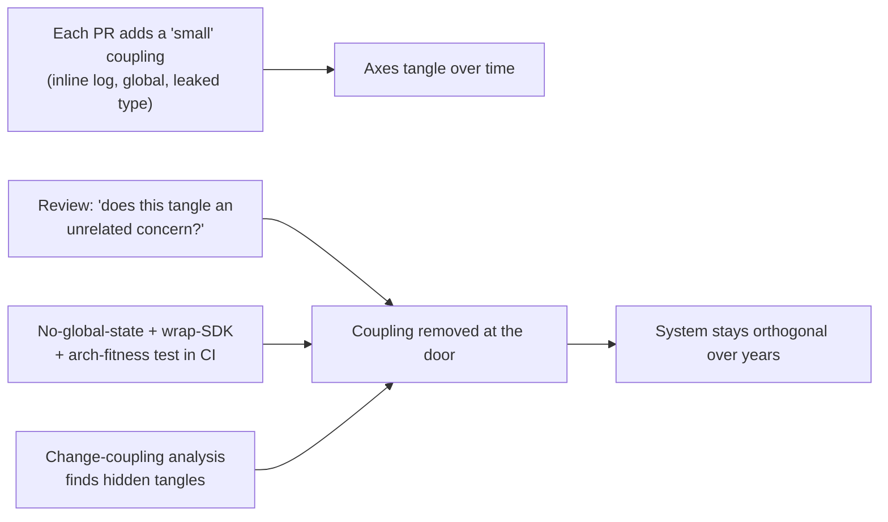
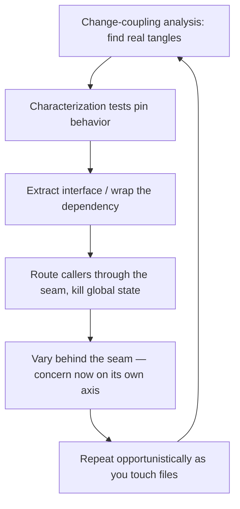

# Orthogonality — Professional

> **Category:** [Coupling & Cohesion](../../README.md) — designing a system so that unrelated parts stay unrelated: a change in one place has no effect on the others.

> **Prerequisites:** [Junior](junior.md) · [Middle](middle.md) · [Senior](senior.md)
> **Focus:** **Production** — reviews, metrics, team conventions, legacy systems

---

## Table of Contents

1. [Introduction](#introduction)
2. [Detecting Non-Orthogonality in Code Review](#detecting-non-orthogonality-in-code-review)
3. [Measuring Orthogonality](#measuring-orthogonality)
4. [Team Conventions That Preserve Orthogonality](#team-conventions-that-preserve-orthogonality)
5. [Restoring Orthogonality in Legacy Systems](#restoring-orthogonality-in-legacy-systems)
6. [Real Incidents](#real-incidents)
7. [The Politics of Independence](#the-politics-of-independence)
8. [Review Checklist](#review-checklist)
9. [Cheat Sheet](#cheat-sheet)
10. [Diagrams](#diagrams)
11. [Related Topics](#related-topics)

---

## Introduction

> Focus: **production** — keeping a large, multi-contributor codebase orthogonal over years.

Orthogonality decays. A system starts with clean axes, and then — one reasonable-looking PR at a time — a logging call lands in the pricing code, a UI component reaches straight into the database "just this once," a global flag gets read in three unrelated modules, and a vendor SDK's types leak across a boundary that used to be wrapped. No single change is the culprit; the aggregate is a codebase where every change is scary and nothing can be tested alone.

At the professional level the question is operational: **how do you keep concerns on separate axes when hundreds of changes land per week from dozens of people?** The answer is a system — review standards that name the couplings, metrics that make the decay visible, conventions that make the orthogonal path the default, and a disciplined way to claw back independence in legacy code without breaking it. The recurring trap to defend against is symmetric: catch both **creeping non-orthogonality** (tangling) and **over-orthogonalizing** (speculative seams), since teams drift toward both.

---

## Detecting Non-Orthogonality in Code Review

Most coupling enters one PR at a time, so review is where orthogonality is won or lost. The reviewer's core move is to run the **blast-radius test on the change itself**: *does this PR make an unrelated concern depend on this one, or vice versa?*

### Smells that signal a broken axis

| Smell in the diff | Axis it tangles |
|---|---|
| A `log`/`print`/metrics call added inside business logic | Logging braided into domain |
| A raw SQL string or ORM entity inside a domain/service method | Persistence braided into domain |
| A UI/controller reaching past its layer into the DB | Layer boundary violated |
| A new read/write of a global, singleton, or static mutable | Hidden coupling through shared state |
| A third-party SDK type appearing in a new public signature | Library leaking across a boundary |
| A new parameter/flag added to a shared function so one caller can differ | Two concerns being coupled through one abstraction |

### The highest-value review question

> **"If the requirements behind *this* concern changed, would this PR force a change to anything unrelated — and does anything unrelated now force a change to it?"**

If the honest answer names an unrelated module, the change has tilted an axis. The fix is usually mechanical: pass the dependency in instead of reaching for a global; put the cross-cutting call in a decorator/middleware; wrap the SDK; route the access through the layer's interface.

### The symmetric question (catch over-orthogonalizing too)

> **"Does this new interface / layer / config option correspond to an axis that *actually* varies, or one we imagine might?"**

A one-implementation interface, a config nobody sets, a strategy for a single case — these are over-orthogonalization, not orthogonality. "It's more flexible" is a red flag, not a justification (same bar as [YAGNI](../../01-generic/02-yagni/junior.md)). Push back on speculative seams as hard as on tangling.

### Review comment templates

> "This adds `log.info(...)` inside `calculatePrice`. That couples pricing to the logging concern — a log-format change would now ripple into pricing. Can we move it to the `@logged` decorator / the calling middleware so pricing stays on its own axis?"

> "`ReportService` reads the global `CONFIG['tax_rate']`, which `Checkout` mutates. These are unrelated features coupled through shared mutable state — the report's output depends on whether a checkout ran first. Let's pass `tax_rate` in explicitly."

> "This `Formatter` interface has one implementation and one caller. What second case are we anticipating? If it's hypothetical, let's use the concrete function and extract the seam when a second format is real."

> "The new `getUser` signature returns `AxiosResponse`. That leaks axios across the boundary — every caller now depends on it. Can we keep the wrapper's own return type so axios stays in one place?"

---

## Measuring Orthogonality

You can't manage decay you can't see, and orthogonality's loss is mostly *structural*, which naive metrics miss. Choose metrics that track real coupling between concerns — and refuse to be fooled by ones that don't.

| Signal | Tracks orthogonality? | Notes |
|---|---|---|
| **Change-coupling** (files that change together in git history) | **Yes — the best signal** | If two *unrelated* files keep changing together, they're non-orthogonal. Surfaces hidden coupling no static metric sees. |
| **Afferent/efferent coupling, instability** (Ca/Ce) | **Yes** | Module-level fan-in/fan-out; flags modules everything depends on (and that therefore can't change orthogonally). |
| **Connascence (kind, locality, degree)** | **Yes** | The precise theory; strong/widespread connascence between concerns = non-orthogonal. See [Connascence](../03-connascence/professional.md). |
| **Global/static mutable count** | **Yes (leading indicator)** | Each shared mutable is a candidate hidden coupling. Trend it toward zero. |
| **Blast-radius of representative changes** | **Yes (outcome)** | Pick the likeliest changes; measure how many modules each historically touched. |
| **Cyclomatic complexity** | No (orthogonality-blind) | Measures branchiness, not coupling between concerns. |
| **Lines of code** | Weakly | A tangle and a clean design can have the same LOC. |
| **Lead time / change-failure rate** (DORA) | **Yes (ground truth)** | Orthogonal systems change quickly and safely. If these degrade, axes have tangled. |

### The honest-measurement rules

- **Change-coupling analysis is the highest-signal tool.** Mine git history: which files repeatedly change in the same commits? Unrelated files that co-change are non-orthogonal *in practice*, regardless of how clean the structure looks on paper. This catches couplings (e.g., shared global state) that no static analyzer reports.
- **Trend global/static mutable state toward zero.** It's the cheapest leading indicator of hidden coupling.
- **Watch interfaces-per-feature for over-orthogonalizing.** If a comparable feature now requires twice the abstractions it did a year ago, the team is over-seaming, not improving independence.
- **The real metric is outcome:** can an unrelated change be made, tested, and shipped without disturbing other concerns? DORA lead time and change-failure rate are downstream of orthogonality.

> Never claim "the system is more decoupled" from cyclomatic complexity — it's blind to cross-concern coupling. Report change-coupling, instability, and the blast radius of real changes.

---

## Team Conventions That Preserve Orthogonality

Codify these so independence is the default path, not a per-PR negotiation:

1. **No global mutable state.** Pass dependencies in (parameters/injection). The single highest-leverage rule; make it a written standard with the rare, documented exceptions called out.
2. **Cross-cutting concerns live in their own layer** — logging, auth, transactions, metrics go in decorators/middleware/aspects visible at the call site, never inline in business logic. (This is [Separation of Concerns](../../01-generic/03-separation-of-concerns/junior.md) as policy.)
3. **Wrap external SDKs at the boundary.** No third-party type in a public signature that crosses a module boundary; the library touches one adapter.
4. **Respect layer boundaries** — a layer depends only downward, only through interfaces. Enforce with an architecture-fitness test (e.g., ArchUnit, dependency-cruiser, import-linter) in CI.
5. **Seams require a present axis of variation.** No one-implementation interface, no config-as-code for dimensions that don't vary. (Test seams are the documented exception.) This kills over-orthogonalizing.
6. **Depend on contracts, not internals** you don't control.
7. **One-way doors get a design note** — irreversible boundary decisions (storage, public API, service split) are reviewed deliberately, because mis-drawing them creates *expensive* non-orthogonality.

These encode the senior reasoning so reviewers cite a policy, not a personal preference, and juniors get independence right by default.

---

## Restoring Orthogonality in Legacy Systems

Greenfield orthogonality is easy. The professional reality is **introducing independence into a system that is already tangled, under-tested, and in production.** The approach is incremental, test-guarded, and opportunistic — never a rewrite.

### The sequence

1. **Find the tangles, don't guess.** Run change-coupling analysis on the git history to locate the *real* non-orthogonal hotspots — the unrelated files that keep changing together. That's where independence buys the most.
2. **Pin behavior with characterization tests first.** You can't safely decouple code you can't re-verify. Write tests that capture current behavior before you move anything. (See [Minimise Coupling](../01-minimise-coupling/professional.md) and *Working Effectively with Legacy Code*.)
3. **Introduce a seam, then push the concern through it.** Use *Sprout/Wrap* and *Extract Interface*: wrap the tangled dependency, route callers through the new interface, then vary behind it. This is exactly how you wrap a leaked SDK or hoist a cross-cutting concern out of business code, one caller at a time.
4. **Kill global state incrementally.** Replace each global read with an injected parameter, one call site at a time, tests green throughout. This removes the most damaging hidden couplings.
5. **Refactor opportunistically (Boy Scout Rule).** Don't schedule a "decouple everything" mega-project (all risk, no feature value, never finishes). Restore one axis as you touch a file for real work. Orthogonality compounds through normal changes.

### What *not* to do

- **Don't decouple without tests.** A "harmless" extraction that flips a subtle shared behavior is the classic legacy incident.
- **Don't over-orthogonalize the cleanup.** Replacing a tangle with a maze of one-impl interfaces and config is not progress — it's the other failure mode. Aim for independence on *real* axes only.
- **Don't boil the ocean.** A standalone "decoupling initiative" with no feature value rarely survives the first deadline. Tie it to the work already flowing through the code.

---

## Real Incidents

### Incident 1: The global flag that coupled checkout and reporting

A `CONFIG["tax_rate"]` global was mutated by the checkout flow and *read* by the nightly reporting job. The two were entirely unrelated features in separate modules — but reports run before any checkout computed tax at `0.0`, and reports run after computed it at the live rate. **Result:** intermittently wrong financial reports that "couldn't be reproduced" (they depended on whether a checkout had run that day). **Fix:** removed the global; tax rate is passed explicitly to both. **Lesson:** global mutable state is invisible coupling between unrelated concerns — the textbook orthogonality killer. The "impossible to reproduce" bug was a hidden non-orthogonal wire.

### Incident 2: The leaked SDK that made a vendor swap a six-week project

A payment SDK's response type was used directly in service signatures across the codebase "to avoid an extra wrapper." When the company switched processors, the new SDK's types were incompatible — and they were entangled in ~80 files. A change that *should* have been one adapter became a six-week, all-hands migration with a feature freeze. **Fix (after):** a `PaymentGateway` interface with the vendor isolated behind one adapter. **Lesson:** an unwrapped third-party type is non-orthogonality waiting for the vendor to change. The wrapper that was "not worth it" would have made the swap a one-file change.

### Incident 3: Over-orthogonalizing — the rules engine for three rules

A team built a generic, configurable, plugin-based "rules engine" to host what was, at launch, three business rules — chasing independence along an axis (pluggable third-party rules) that never materialized. Two years later it ran five rules, all written in-house, in ~8,000 lines; every new rule meant learning the engine's DSL. **Fix:** the rules became plain functions (~150 lines); the engine was deleted. **Lesson:** orthogonality has a cost. Seams on axes that don't vary are over-orthogonalization — they relocate complexity into indirection and configuration. Earn the axis from real variation. (See [Senior](senior.md).)

### Incident 4: The UI that reached into the database

To "save a layer," a reporting screen issued SQL directly instead of going through the service layer. It worked — until a schema change for an unrelated feature silently broke the report, because the report was coupled to the table structure it should never have known about. **Fix:** routed the screen through the service interface; the schema now sits behind one boundary. **Lesson:** a skipped layer boundary is a non-orthogonal shortcut; the "saved" layer is paid back with interest as ripple. Enforce boundaries with an architecture-fitness test so this can't merge.

---

## The Politics of Independence

Sustaining orthogonality is partly a social problem:

- **Tangling is invisible until it bites.** A logging call inside pricing looks harmless in review; the cost arrives months later as a ripple. Professionals must make the *future* cost legible now ("this couples pricing to logging") so the cheap fix happens at review time.
- **Over-orthogonalizing looks like good engineering.** A pile of interfaces and config *seems* sophisticated, and the person who adds it is often praised while the person who deletes a speculative seam is invisible. Flip the incentive: celebrate seams *removed* as much as real ones added.
- **"We might need it flexible there" is socially hard to refuse.** Arm the team with the "present axis of variation" standard so refusing a speculative seam is citing policy, not blocking a colleague.
- **Senior engineers set the default.** If the staff engineer reaches for a global, an inline SDK type, or a one-impl interface by reflex, everyone does. Model passing dependencies in, wrapping boundaries, and earning seams — and explain *why* an axis did or didn't deserve isolation.

---

## Review Checklist

```text
ORTHOGONALITY REVIEW CHECKLIST
[ ] BLAST RADIUS — does this PR make an unrelated concern depend on this one
                   (or vice versa)? If yes, an axis was tilted.
[ ] GLOBAL STATE — no new read/write of a global/singleton/static mutable
[ ] CROSS-CUTTING — logging/auth/persistence NOT braided into business logic
                   (use decorator/middleware visible at the call site)
[ ] LIBRARY LEAK — no 3rd-party SDK type in a signature crossing a boundary
[ ] LAYERS — depends only downward, only through the interface (no skipping)
[ ] CONTRACTS — depends on published contracts, not internals it can't control
[ ] SPECULATION — every new interface/layer/config maps to an axis that ACTUALLY
                  varies (no one-impl interface, no config-as-code) — over-orth check
[ ] DRY vs ORTHO — a "dedupe" isn't coupling two independent concerns via one fn
[ ] ONE-WAY DOOR — irreversible boundaries (storage/API/service split) reviewed
```

---

## Cheat Sheet

```text
DETECT          run the blast-radius test on the PR: does it tangle an
                unrelated concern?  Smells: inline log/SQL, global state,
                leaked SDK type, skipped layer, flag-for-one-caller.

ENFORCE         no global mutable state · cross-cutting in its own layer ·
                wrap SDKs · respect layers (arch-fitness test in CI) ·
                seams need a PRESENT axis of variation.

MEASURE         change-coupling (git co-change) is the BEST signal ·
                afferent/efferent coupling · global-state count ·
                DORA lead time.  NOT cyclomatic, NOT LOC.

LEGACY          change-coupling to find tangles → characterization tests →
                extract-interface / wrap / kill global state, one caller at a
                time → opportunistic, never big-bang.

TWO FAILURES    tangling (helicopter) AND over-orthogonalizing (one-impl
                interfaces, config-as-code) — guard against BOTH.
```

---

## Diagrams

### Where non-orthogonality enters, and where it's stopped



### Safe legacy decoupling



---

## Related Topics

- **Means to the end:** [Minimise Coupling](../01-minimise-coupling/professional.md), [Maximise Cohesion](../02-maximise-cohesion/professional.md), [Connascence](../03-connascence/professional.md).
- **The cross-cutting case:** [Separation of Concerns](../../01-generic/03-separation-of-concerns/junior.md).
- **Tensions:** [DRY](../../01-generic/07-dry/professional.md); [YAGNI](../../01-generic/02-yagni/junior.md), [Optimize for Deletion](../../01-generic/06-optimize-for-deletion/junior.md).
- **Tooling:** git change-coupling analysis, ArchUnit / dependency-cruiser / import-linter (architecture-fitness tests), SonarQube coupling metrics.

---


---

## Check your understanding

1. Explain Orthogonality — Professional Level in your own words and name the problem it solves.
2. How would you apply the ideas around Table of Contents, Introduction, Detecting Non-Orthogonality in Code Review in a realistic engineering change?
3. What failure mode or misuse should you look for, and what evidence would reveal it?
4. How would you introduce and govern Orthogonality — Professional Level across teams through reversible, measurable increments?
5. What observable result would convince you that the approach improved the system?
