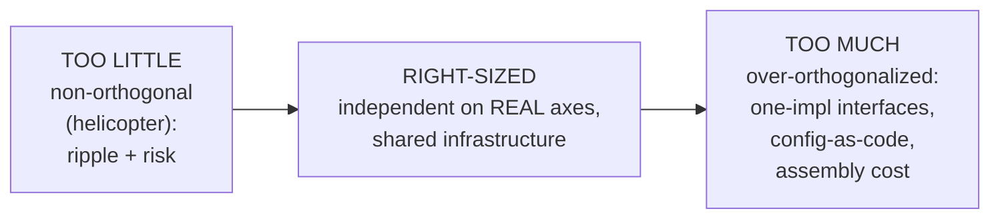
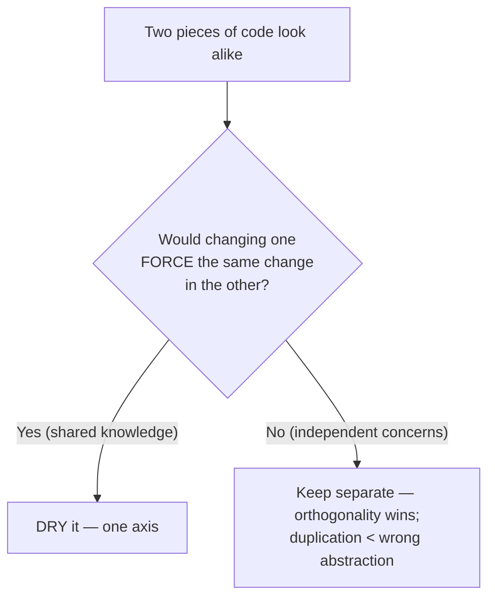

# Orthogonality — Senior

> **Category:** [Coupling & Cohesion](../../README.md) — designing a system so that unrelated parts stay unrelated: a change in one place has no effect on the others.

> **Prerequisites:** [Junior](junior.md) · [Middle](middle.md)
> **Focus:** **Design trade-offs** and **system-level reasoning**

---

## Introduction

> Focus: **design trade-offs** and **system-level reasoning**

At the senior level, orthogonality stops being "keep things independent" and becomes a question of **where to spend independence and where to refuse it.** Independence is not free, and it is not always right. Pushed too hard it produces the same disease it claims to cure — a system so atomized into "independent" pieces that understanding any behavior means assembling fifteen of them. Pushed too little it produces the helicopter: a tangle where every change is dangerous.

The senior skill is judging the **axes**: which concerns are *genuinely* unrelated and *likely to vary independently* (spend orthogonality there), and which are coincidentally similar, or share a real invariant, or are stable infrastructure (don't). This file covers the three hard questions:

1. **How orthogonal is "orthogonal enough"?** (Perfect orthogonality is unattainable; some coupling is healthy.)
2. **When does the principle invert into over-engineering?** (Over-orthogonalizing — needless layers and configuration.)
3. **When orthogonality and DRY conflict, how do you decide?** (Independence of concerns vs. single source of knowledge.)

---

## Orthogonality as a System-Level Property

The key reframing for seniors: orthogonality is not a property you add with a tool; it is the **emergent system-level consequence** of low coupling and high cohesion applied along the system's *concern axes*. You cannot "install" orthogonality — you achieve it by making each concern cohesive (it lives in one place) and each pair of unrelated concerns decoupled (they don't tug each other).

That means every technique for orthogonality is really a coupling or cohesion technique judged at a larger granularity:

| Technique | What it really is |
|---|---|
| Layering | Low coupling between layers + cohesion within each |
| Wrapping a library | Decoupling your code from a dependency you don't control |
| Decorators/middleware for cross-cutting concerns | Cohesion: each concern in its own place, not smeared |
| Dependency injection | Decoupling a module from concrete collaborators |
| No global state | Removing hidden coupling through shared data |

So the senior who wants to reason about orthogonality reasons in the vocabulary of **[coupling](../01-minimise-coupling/senior.md)** (and its precise refinement, **[connascence](../03-connascence/senior.md)**) and **[cohesion](../02-maximise-cohesion/senior.md)**. "How orthogonal is this design?" is answered by "how strong, and how widespread, is the connascence between concerns that should be independent?"

> Orthogonality is the *goal*; low coupling and high cohesion along feature axes are the *means*. Stating an orthogonality problem as a connascence problem usually tells you the exact refactoring.

---

## Perfect Orthogonality Is Unattainable — and Some Coupling Is Healthy

A junior hears "eliminate effects between unrelated things" and tries to drive non-orthogonality to zero. Seniors know that's both impossible and undesirable.

**Why it's impossible:** every real system shares *something*. There is a runtime, a language, a database, a configuration mechanism, a logging framework, a set of domain types that many modules legitimately use. These shared dependencies create real coupling. You cannot remove them without either duplicating infrastructure absurdly or building nothing.

**Why some coupling is healthy:** shared infrastructure is *leverage*. A common `Money` type, a shared `Result`/error model, one logging facade, one DI container — these are dependencies on purpose, and they make the system *more* coherent, not less. The orthogonality goal targets coupling between **unrelated business concerns**, not the existence of a shared platform. A system with zero shared infrastructure is not maximally orthogonal; it's maximally duplicated.

```
   HEALTHY shared coupling          HARMFUL hidden coupling
   ┌──────────────────┐             pricing ──(shared mutable
   │  Money, Logger,  │             reporting ─ global state)──┐
   │  Result, config  │  ← everyone    these LOOK unrelated but │
   └──────────────────┘    depends     silently affect each ───┘
     intentional platform   on it      other = the thing to kill
```

> The target is not "no coupling." It's **no coupling between things that are conceptually unrelated.** Distinguishing intentional infrastructure coupling from accidental concern coupling is the senior judgement. Audit for the second; cherish the first.

The practical posture: maximize independence along the axes where concerns are genuinely unrelated and likely to change, accept shared infrastructure as healthy, and treat "we share a global mutable thing between two unrelated features" as the real defect.

---

## Over-Orthogonalizing: The Symmetric Failure

Non-orthogonality (the helicopter) has a mirror-image failure that's just as damaging and far less discussed: **over-orthogonalizing.** In the name of independence, you split the system into so many "decoupled" pieces — interfaces with one implementation, configuration nobody configures, indirection layers, plugin systems for one plugin — that understanding any single behavior requires reassembling a dozen scattered fragments.

The tells:

- **Interfaces and indirection for axes that don't actually vary.** A `CurrencyFormatterStrategy` injected through three layers, with one implementation, because "we might add another format." That's speculative generality wearing orthogonality's clothes.
- **Configuration as a substitute for code.** Everything is a setting; behavior lives in YAML; reading the code tells you nothing because the real logic is the configuration graph. You've made the system "flexible" along axes nobody flexes.
- **A maze of tiny collaborators.** Each is independently testable and individually clean, but no human can hold the *composition* in their head. Local orthogonality, global incomprehensibility.

The deep point: **over-orthogonalizing trades one kind of cognitive load (ripple risk) for another (assembly cost).** A maximally independent system where you must mentally re-integrate fifteen pieces to understand one feature is *not* simple — it's the same complexity relocated. True orthogonality reduces *total* cognitive load; over-orthogonalizing just moves it.

> The corrective is the same one [YAGNI](../../01-generic/02-yagni/junior.md) gives everywhere: introduce an axis of independence when a concern *actually* varies, not when you imagine it might. Earn the seam; don't speculate it. An interface with one implementation isn't orthogonality — it's an unpaid abstraction tax.

This is also why orthogonality cross-links to **[Optimize for Deletion](../../01-generic/06-optimize-for-deletion/junior.md)**: the right test for "is this independence worth it?" is "does this seam make the concern easier to *delete or replace*?" If the abstraction doesn't make some future change cheaper, it's over-orthogonalization.

---

## The Orthogonality–DRY Tension, Resolved

The sharpest senior trade-off in this topic. **[DRY](../../01-generic/07-dry/senior.md)** wants every piece of knowledge in one place; orthogonality wants unrelated concerns independent. They agree almost always — and the rare conflict is one of the most important judgement calls in design.

The conflict's anatomy: two pieces of code look identical, so DRY says merge. But if they belong to **independent concerns**, merging *couples* those concerns through the shared abstraction, and the next time one needs to differ, you add a flag/parameter — re-introducing complexity *and* coupling. This is exactly Sandi Metz's "the wrong abstraction": you DRY'd coincidental similarity into a shared thing, and now it's load-bearing for callers that don't actually share knowledge.

The resolution is the **connascence test**, stated precisely:

> **DRY de-duplicates shared *knowledge*; it must not merge things that share only *appearance*. When "de-duplicate" would create connascence between concerns that are conceptually independent, orthogonality wins — keep the duplication.**

| Situation | Connascence between the two? | Verdict |
|---|---|---|
| Same business rule written twice (one regulated tax formula) | Yes — change one ⇒ change the other | **DRY it** (orthogonality agrees: one axis) |
| Signup vs. admin password rules, identical today | No — they're independent policies that may diverge | **Keep separate** (orthogonality wins) |
| Two validators that *must* always agree (an invariant) | Yes — coupled by a real invariant | **DRY it** (they're not actually independent) |

The decisive question is unchanged from [Middle](middle.md) but now understood through connascence: **would a change to one *necessarily* force the same change to the other?** If yes, they're one axis — DRY. If no, they're independent axes — duplication is the lesser evil, because the wrong abstraction is more expensive than duplication. (See [Connascence](../03-connascence/senior.md) for the full vocabulary; the rule is "prefer weak, local connascence — and don't *manufacture* connascence by over-DRYing.")

---

## Where to Spend Orthogonality: The Axes of Likely Change

Since orthogonality has a cost, seniors spend it where it pays. The heuristic: **isolate the axes most likely to change independently.** Identify the system's *axes of variation* — the dimensions along which requirements actually move — and put a seam there. Don't put seams on dimensions that don't vary.

Common high-value axes (worth isolating):

- **The persistence mechanism** — databases get swapped, migrated, sharded. Keep the domain orthogonal to it.
- **External vendors** — payment gateways, email providers, third-party APIs change. Wrap them.
- **Delivery/UI** — the same domain serves web, mobile, API. Keep it orthogonal to presentation.
- **Cross-cutting concerns** — logging/auth/metrics policies change org-wide; isolate them.
- **Volatile business policies** — pricing rules, discounts, tax — things that change quarterly.

Low-value axes (usually *not* worth a seam yet):

- A "currency formatter" when you have one currency and one format.
- A "notification channel" abstraction for one email path.
- A "rules engine" for three hard-coded rules.

> The orthogonality budget is finite (each seam costs comprehension). Spend it on the axes the *business* actually moves along, identified from real requirements and domain knowledge — not on every dimension you can imagine. This ties orthogonality directly to [Encapsulate What Changes](../../03-module-and-class/01-encapsulate-what-changes/junior.md): find the hotspot of change and put the seam *there*.

---

## AOP and the Limits of Mechanical Orthogonality

Aspect-Oriented Programming is the most aggressive orthogonality tool: it lets you declare a cross-cutting concern (logging, transactions, security) *entirely separately* and "weave" it into many modules without those modules knowing. Done well, it's perfect orthogonality for cross-cutting concerns — the business code is pristine, and the concern lives on one axis.

But seniors know AOP's sharp edge: **invisible weaving can destroy the very transparency orthogonality is supposed to provide.** When behavior is injected by aspects you can't see at the call site, a reader of the business method has *no local evidence* that a transaction starts here, that this method is retried, that arguments are logged. The orthogonality is real, but it's bought with **action at a distance** — and debugging "why did this run in a transaction?" now requires knowing the whole aspect configuration. You've traded ripple-coupling for hidden-behavior-coupling.

The senior stance: use declarative cross-cutting mechanisms (decorators, middleware, framework annotations like `@Transactional`) where the weaving is **visible at the call site** (an annotation you can read), and be cautious with fully invisible pointcut-based weaving. The goal — separating cross-cutting concerns onto their own axis — is right; the failure is when "separate" becomes "hidden," and orthogonality of *code* becomes opacity of *behavior*. Visible orthogonality beats invisible orthogonality.

---

## Orthogonality at Architectural Scale

Orthogonality scales up from functions to whole subsystems, and the same trade-offs recur with bigger stakes:

- **Microservices** are an orthogonality bet: each service owns a concern and can be deployed, scaled, and changed independently. When the service boundaries match true concern boundaries, you get orthogonality at the org level (teams ship independently). When they don't — when a "change one feature, redeploy six services" pattern appears — you've built a **distributed** helicopter, which is strictly worse than the monolithic one because the couplings now cross network and team boundaries.
- **Modular monoliths** seek the same orthogonality (independent modules, clear interfaces) without the distribution cost — often the better bet until the concerns genuinely need independent deployment.
- **The bounded context** (DDD) is orthogonality applied to the domain model: independent contexts with their own models, integrated through explicit contracts, so a model change in one doesn't ripple into another.

The recurring senior lesson: **orthogonality at any scale is only as real as the boundaries are true.** Drawing a service boundary or a module wall across a tightly coupled concern doesn't create independence — it just makes the coupling more expensive to traverse. Find the real seams (low connascence across them); don't impose seams on tight clusters.

---

## Code Example — Earning vs. Speculating an Axis

```python
# OVER-ORTHOGONALIZED (speculative axis): one impl, threaded through layers,
# for a "flexibility" no requirement asks for.
class PriceFormatterStrategy(ABC):
    @abstractmethod
    def format(self, amount: Decimal) -> str: ...

class UsdFormatter(PriceFormatterStrategy):
    def format(self, amount: Decimal) -> str: return f"${amount:.2f}"

class Checkout:
    def __init__(self, formatter: PriceFormatterStrategy): ...  # only ever UsdFormatter
# An axis that doesn't vary. The interface, the impl, the injection = pure cost.

# RIGHT-SIZED: concrete now; the seam returns when a 2nd currency is REAL.
def format_usd(amount: Decimal) -> str:
    return f"${amount:.2f}"
```

Contrast with an axis worth isolating *because it genuinely varies* — the payment vendor:

```python
# EARNED axis: payments WILL change vendor; isolate it behind a contract.
class PaymentGateway(Protocol):
    def charge(self, amount: Money) -> Receipt: ...

class StripeGateway:                       # one of several real, foreseeable vendors
    def charge(self, amount: Money) -> Receipt: ...

# checkout depends on the CONTRACT, orthogonal to which vendor runs.
def checkout(cart: Cart, gateway: PaymentGateway) -> Receipt:
    return gateway.charge(total(cart))
```

The difference isn't the technique — both use an interface — it's the **judgement**: the vendor is a real axis of variation (orthogonality earns its keep), the formatter is a speculative one (orthogonality is a tax). Same tool, opposite verdict, decided by whether the axis actually moves.

---

## Liabilities

### Liability 1: Chasing zero non-orthogonality

Driving every coupling to zero duplicates infrastructure and atomizes the system. Some coupling (shared platform) is healthy. The target is independence between *unrelated* concerns, not the absence of all dependency.

### Liability 2: Over-orthogonalizing into incomprehensibility

Speculative seams — one-impl interfaces, config-as-code, plugin systems for one plugin — relocate complexity from "ripple risk" to "assembly cost." Earn each axis from real variation; don't speculate it. ([YAGNI](../../01-generic/02-yagni/junior.md).)

### Liability 3: Over-DRYing into coupling

Merging coincidentally-similar code couples independent concerns through a shared abstraction; the next divergence adds a flag and the abstraction rots. When dedup would manufacture connascence between independent concerns, orthogonality wins — keep the duplication.

### Liability 4: Invisible orthogonality (AOP overreach)

Fully hidden aspect weaving separates code but hides behavior — action at a distance. Prefer cross-cutting mechanisms visible at the call site (annotations, decorators, middleware) over invisible pointcuts.

### Liability 5: False boundaries at scale

A service or module wall across a tightly coupled concern doesn't create independence; it makes the coupling cross a network or team boundary — a distributed helicopter. Boundaries are only orthogonal where connascence across them is genuinely low.

---

## Pros & Cons at the System Level

| Dimension | High orthogonality (right-sized) | Over-orthogonalized | Non-orthogonal (helicopter) |
|---|---|---|---|
| Cost of an unrelated change | Low — stays on one axis | Low ripple, **high assembly cost** | High — ripples everywhere |
| Comprehensibility of one behavior | High | **Low** — must reassemble fragments | Low — tangled |
| Reuse | High | High but awkward | Low |
| Test surface | Small, isolated | Small per piece, hard to integration-test | Large — whole system |
| Risk of unintended effects | Low | Low | High |
| Onboarding / parallel work | Fast | Slowed by indirection | Slow — everything entangled |
| Best when | Concerns genuinely independent & variable | (never the goal) | (never the goal) |

The senior reading: orthogonality is a U-shaped cost curve. Too little (non-orthogonal) → ripple and risk. Too much (over-orthogonalized) → indirection and assembly cost. The minimum sits at **"independent along the axes that actually vary, shared on stable infrastructure"** — found by spending the orthogonality budget on real axes of change and refusing to spend it on speculative ones.

---

## Diagrams

### The orthogonality cost curve



### Deciding orthogonality vs. DRY



---

## Related Topics

- **Means to the end:** [Minimise Coupling](../01-minimise-coupling/senior.md), [Maximise Cohesion](../02-maximise-cohesion/senior.md), [Connascence](../03-connascence/senior.md).
- **The cross-cutting case:** [Separation of Concerns](../../01-generic/03-separation-of-concerns/junior.md).
- **The key tension:** [DRY](../../01-generic/07-dry/senior.md); related: [Optimize for Deletion](../../01-generic/06-optimize-for-deletion/junior.md), [YAGNI](../../01-generic/02-yagni/junior.md).
- **Spending the budget:** [Encapsulate What Changes](../../03-module-and-class/01-encapsulate-what-changes/junior.md).

---


---

## Check your understanding

1. Explain Orthogonality — Senior Level in your own words and name the problem it solves.
2. How would you apply the ideas around Table of Contents, Introduction, Orthogonality as a System-Level Property in a realistic engineering change?
3. What failure mode or misuse should you look for, and what evidence would reveal it?
4. How would you validate a system-level decision about Orthogonality — Senior Level under uncertainty?
5. What observable result would convince you that the approach improved the system?
