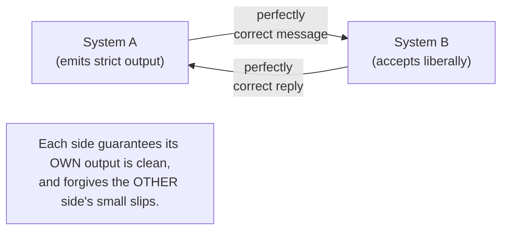
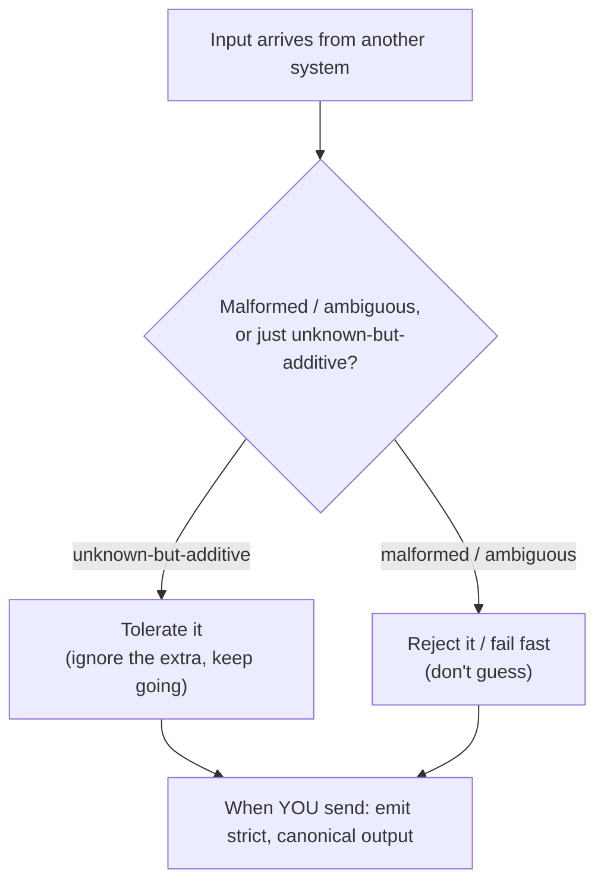

# Robustness Principle — Junior

> **Category:** [Coupling & Cohesion](../../README.md) — Jon Postel's interoperability rule: be conservative in what you send, be liberal in what you accept.

---

## Introduction

> Focus: **What is it?** and **How to use it?**

The **Robustness Principle** — also called **Postel's Law** — is one of the oldest pieces of advice in network engineering. In its classic form:

> **"Be conservative in what you do, be liberal in what you accept from others."**
> — Jon Postel, in the TCP specification (RFC 793, 1981); the idea first appeared in RFC 760 (1980).

Read it as two instructions to a program that talks to other programs:

1. **When you *send*** data — a message, a request, a file — make it **strictly correct.** Follow the spec to the letter. Don't take shortcuts that *happen* to work; don't rely on the other side being forgiving.
2. **When you *receive*** data from someone else, **tolerate small mistakes.** If their message is slightly malformed but you can still understand it, accept it rather than rejecting it outright.

The reasoning is interoperability: if every system emits perfect output but graciously forgives others' imperfect output, then independently-built systems — written by different people, in different decades, with different bugs — can still talk to each other.

### Why this matters

You will meet this principle constantly: in HTTP, in HTML, in email, in JSON parsers, in date libraries, in config-file loaders. It explains why your browser still renders web pages with broken tags, and why a sloppy API request sometimes works anyway. It is also one of the most **debated** principles in software — many senior engineers now argue its "be liberal" half causes serious long-term harm. As a junior you need both: what the principle says, *and* the honest warning that it is not an unqualified good. We introduce the debate gently here and go deep on it at the [Senior](senior.md) level.

---

## Prerequisites

- **Required:** You understand that programs communicate by exchanging **data in an agreed format** (JSON, an HTTP request, a CSV file).
- **Required:** You know what a **specification** (spec) or **schema** is — a written rule for what valid data looks like.
- **Helpful:** Basic familiarity with **parsing** — turning raw bytes/text into structured data.
- **Helpful:** A feel for [coupling](../01-minimise-coupling/junior.md) — how a change in one system can force a change in another.

---

## Glossary

| Term | Definition |
|------|-----------|
| **Robustness Principle / Postel's Law** | Be conservative in what you send, liberal in what you accept. |
| **Conservative (in sending)** | Emit only strictly spec-correct output; take no liberties. |
| **Liberal (in accepting)** | Tolerate minor deviations in received input rather than rejecting it. |
| **Interoperability** | The ability of independently-built systems to work together correctly. |
| **Spec / specification** | The written, authoritative definition of a valid message or format. |
| **Parser** | Code that reads raw input and turns it into structured data. |
| **Malformed input** | Input that violates the spec — wrong syntax, missing required parts, ambiguous. |
| **Unknown-but-additive input** | Input that has *extra* fields you don't recognise but that don't break the rest. |
| **Fail fast** | Reject bad input immediately and loudly, rather than guessing at its meaning. |
| **Tolerant reader** | A receiver that ignores parts it doesn't understand but still validates what it does. |

---

## The Principle, Stated Precisely

The principle has **two halves that point in opposite directions**, and getting them straight is the whole game:

```
            ┌──────────────────────────────────────────────┐
  SENDING   │  Be CONSERVATIVE / STRICT                     │
            │  → emit only perfectly spec-correct output    │
            ├──────────────────────────────────────────────┤
  RECEIVING │  Be LIBERAL / TOLERANT                         │
            │  → accept input even if slightly malformed    │
            └──────────────────────────────────────────────┘
```

A one-line memory hook: **"strict out, lenient in."**

The asymmetry is intentional. *You* control what you send, so you can guarantee it's perfect. You *don't* control what others send, so being forgiving lets you keep working when they're imperfect — which, across the whole internet, they always are.

---

## Where It Came From: The Early Internet

Jon Postel was one of the architects of the early internet — the editor of countless **RFCs** (the "Request for Comments" documents that define internet protocols). He wrote the robustness principle into the foundational TCP/IP specifications:

- **RFC 760** (1980), on the Internet Protocol, contains an early statement of the idea.
- **RFC 793** (1981), the Transmission Control Protocol spec, gives the canonical wording: *"TCP implementations should follow a general principle of robustness: be conservative in what you do, be liberal in what you accept from others."*

The context matters. In 1980–81, the internet was a handful of machines built by different research groups, each writing their own TCP implementation from a paper spec, with no shared test suite and no way to coordinate bug fixes. Two implementations would inevitably disagree on tiny details. Postel's rule was a survival strategy: **if each side forgives the other's quirks, the network keeps working even though no two implementations are identical.** It was the glue that let a decentralised, independently-built system function at all.

---

## Why It Mattered: Interoperability

The core problem Postel's Law solves is **interoperability between systems you don't control.**



Without the principle, the early internet faced a brittle stalemate: System A has a tiny bug producing a slightly-off message; System B rejects it; A and B can never communicate until someone patches A — which might be a different organisation on a different schedule. Multiply by hundreds of implementations and the network never works.

With the principle: B tolerates A's slip and keeps going. A's bug gets fixed eventually, but communication never stops in the meantime. Tolerance buys **resilience to the imperfection that's inevitable when many independent parties build to the same spec.**

---

## Real-World Analogies

| Concept | Analogy |
|---|---|
| **Strict out, lenient in** | A polite letter-writer: you spell and punctuate your own letters perfectly, but you can still read a friend's letter even if *their* grammar is sloppy. |
| **Liberal acceptance** | A bartender who understands "a coke" and "a Coke" and "one cola, please" as the same order — you don't refuse the customer over wording. |
| **Conservative sending** | A pharmacist writing a prescription: every abbreviation must be exact, because someone else's life depends on no ambiguity. |
| **Interoperability** | Electrical plugs: a well-made appliance draws clean power, and a good socket tolerates slightly different plug shapes — so devices from many makers all work. |
| **Where it goes wrong** (preview) | Always forgiving a friend who's *constantly* late trains them to stay late forever — your tolerance removes their reason to fix it. |

---

## Mental Models

**The core intuition:** *"I take full responsibility for the quality of what I emit; I extend grace to the quality of what I receive."*

A second model — the **handshake of imperfect partners**:

```
   You don't control others' output → forgive their small mistakes (lenient IN)
   You DO control your own output    → make it flawless           (strict OUT)
```

A third, crucial model for later — the **two kinds of "I don't understand this":**

```
   Input has an EXTRA field I don't recognise   → probably safe to ignore  (additive)
   Input is MALFORMED / ambiguous / broken      → dangerous to guess at     (malformed)
```

This last distinction is the key to using the principle *safely* in modern code, and we build on it at every level above this one.

---

## Everyday Examples You Already Use

You rely on liberal acceptance every day, often without noticing:

- **Web browsers and HTML.** Real web pages are full of malformed HTML — unclosed tags, missing quotes, elements in the wrong place. Browsers don't show an error; they *guess* what you meant and render the page anyway. This tolerance is why the web "just works" for billions of imperfect pages.
- **Email (SMTP).** Mail servers historically accepted messages with minor format violations rather than bouncing them, so that mail from old or buggy servers still got delivered.
- **Lenient JSON / date parsers.** Many libraries accept `"2026-6-1"`, `"2026/06/01"`, and `"June 1, 2026"` all as the same date, or tolerate trailing commas in JSON, to be friendly to whatever produced the input.
- **HTTP.** Servers and clients tolerate header casing differences, extra whitespace, and other small deviations.

Each of these is Postel's Law in action. Each is also — as you'll learn — a place where tolerance has caused real problems. Hold both thoughts at once.

---

## Code Examples

### A lenient receiver (the "be liberal" half)

A function that accepts a date written several ways:

```python
from datetime import date

def parse_date_lenient(text: str) -> date:
    text = text.strip().replace("/", "-")        # tolerate slashes and spaces
    parts = text.split("-")
    year, month, day = (int(p) for p in parts)   # tolerate "2026-6-1" (no zero-pad)
    return date(year, month, day)

parse_date_lenient(" 2026/6/1 ")   # -> date(2026, 6, 1)  ✓ forgiving
```

This is liberal acceptance: a sloppily-formatted date still works.

### A conservative sender (the "be strict" half)

When *you* produce a date string for someone else, emit one canonical, unambiguous form:

```python
def format_date_strict(d: date) -> str:
    return d.isoformat()             # always "YYYY-MM-DD", zero-padded, no surprises

format_date_strict(date(2026, 6, 1))   # -> "2026-06-01"  ✓ exact, every time
```

You never emit `2026/6/1` "because the other side accepts it." You send the one correct form. **That's the asymmetry: forgiving on the way in, flawless on the way out.**

### Where leniency gets risky (a first look)

What does `parse_date_lenient("01-02-03")` mean? Year 1, month 2, day 3? Or 2003, Feb 1? Or 2001, Feb 3? The lenient parser *guesses* — and different lenient parsers guess *differently*. That ambiguity is harmless for a toy, but in a real system two components that guess differently will silently disagree. Remember this; it's the seed of the whole critique. The [Middle](middle.md) and [Senior](senior.md) levels show how it turns into real bugs and security holes.

---

## The Two Halves Are Not Equal

A junior trap is treating "strict out" and "lenient in" as equally good advice. They are not, and modern practice strongly favours one over the other:

| Half | Modern verdict |
|---|---|
| **Be conservative in what you send** | **Almost universally good.** Emitting clean, spec-correct output rarely causes problems and helps everyone. Keep doing this, always. |
| **Be liberal in what you accept** | **Controversial.** Sometimes helpful (forward-compatibility), sometimes harmful (ambiguity, security holes, eroded specs). Apply with care. |

So the *safe, evergreen* takeaway is the first half. The second half is a tool with a sharp edge — useful, but easy to cut yourself on. The rest of this topic is largely about handling that edge.

---

## A First Taste of the Controversy

For decades Postel's Law was quoted as plain wisdom. Then experience accumulated, and respected engineers pushed back hard. You'll hear two names:

- **Eric Allman** (author of `sendmail`, the canonical email server) wrote an article titled *"The Robustness Principle Reconsidered,"* warning that liberal acceptance creates problems over time.
- **Martin Thomson** wrote an IETF draft bluntly titled *"The Harmful Consequences of Postel's Robustness Principle,"* arguing the "be liberal" half actively damages protocols.

Their core complaint, in plain terms: **when receivers are forgiving, senders get sloppy and never fix their bugs** — because the bugs "work." Over years, the *real* rule for what's valid stops being the written spec and becomes "whatever the most lenient parser happens to accept." That's a problem we'll name precisely at higher levels. For now, just absorb this: *the principle is genuinely debated, and "be strict in what you accept" is a serious, respected counter-position.*

> The mature view, which this whole topic builds toward: **be conservative in what you send; be strict — not liberal — in what you accept at trust boundaries; but evolve your formats gracefully.** Tolerate *unknown-but-additive* data; reject *malformed* data. Holding that nuance is the senior skill.

---

## Best Practices

1. **Always be conservative in what you send.** Emit one canonical, spec-correct form. This half is safe; never abandon it.
2. **Be cautious with leniency on input.** Default to validating input strictly, especially at the edge of your system (anything from a user or another team).
3. **Distinguish *additive* from *malformed*.** Ignoring an unknown extra field is usually safe; *guessing* the meaning of broken/ambiguous input is not.
4. **Never guess silently.** If input is ambiguous, prefer rejecting it (fail fast) over picking an interpretation the sender didn't intend.
5. **Write down what you accept.** If you do tolerate a deviation, document it — undocumented leniency becomes a hidden rule others depend on.

---

## Common Mistakes

1. **Treating both halves as equally good advice.** "Strict out" is safe; "lenient in" is a trade-off. They're not symmetric.
2. **Confusing "tolerate extra fields" with "tolerate malformed input."** The first is forward-compatibility; the second is guessing. They feel similar and are very different in risk.
3. **Being lenient on *output* "to match what others accept."** This spreads sloppiness. Always emit the strict form.
4. **Silently fixing bad input.** Quietly "correcting" a malformed message hides the sender's bug and may correct it *wrong*.
5. **Thinking Postel's Law is settled wisdom.** It's one of the most contested principles in the field. Treating it as gospel marks you as not having met the critique.

---

## Tricky Points

- **The two halves have different reputations.** Modern engineering keeps "conservative out" and is deeply skeptical of "liberal in." Don't quote the second half as if it were obviously good.
- **"Liberal" does not mean "accept anything."** Even Postel meant *tolerate minor, recoverable deviations*, not *accept arbitrary garbage and guess*. People who over-apply it cause the harms the critics describe.
- **Tolerating unknown additive fields ≠ tolerating malformed input.** This single distinction separates safe forward-compatibility from dangerous guessing. It recurs at every level.
- **Your tolerance becomes someone's contract.** The moment your parser accepts a deviation, some sender starts relying on it. Now that deviation is *de-facto* part of the spec, whether you wrote it down or not — a form of hidden coupling explored at [Middle](middle.md).

---

## Test Yourself

1. State the Robustness Principle in one sentence. Who wrote it, and in what document?
2. Which half of the principle applies when you *send* data, and which when you *receive*?
3. Why is the principle asymmetric — why strict on output but lenient on input?
4. Give two everyday examples of liberal acceptance you rely on.
5. What's the difference between tolerating an *unknown-but-additive* field and tolerating *malformed* input?
6. Name one engineer who criticised the principle, and summarise their core complaint.

---

## Cheat Sheet

```text
THE PRINCIPLE (Postel's Law, RFC 760/793, Jon Postel, 1980–81)
  "Be conservative in what you SEND, liberal in what you ACCEPT."

THE ASYMMETRY
  SEND     → strict   (you control your output → make it perfect)
  RECEIVE  → lenient  (you don't control input → forgive small slips)

THE TWO HALVES ARE NOT EQUAL
  conservative out   = almost always good     (keep it)
  liberal in         = controversial          (handle with care)

THE KEY DISTINCTION (for using it safely)
  unknown-but-ADDITIVE field  → usually safe to ignore (forward-compat)
  MALFORMED / ambiguous input → dangerous to guess     (fail fast instead)

THE MODERN COUNTER-MOVEMENT
  "be STRICT in what you accept" — fail fast, reject ambiguity
  critics: Allman (Reconsidered), Thomson (Harmful Consequences)
```

---

## Summary

- The **Robustness Principle (Postel's Law)** says: *be conservative in what you send, be liberal in what you accept.* Jon Postel, RFC 760 (1980) / RFC 793 (1981).
- It was born from the **early internet's interoperability problem**: independently-built systems forgiving each other's quirks so the network kept working.
- The principle is **asymmetric on purpose** — strict on the output you control, lenient on the input you don't.
- Everyday tools live by it: browsers tolerating bad HTML, lenient email/JSON/date parsers, forgiving HTTP.
- The **two halves are not equal**: "conservative out" is safe; "liberal in" is genuinely controversial (Allman, Thomson) and must be handled with care.
- The safe modern reading hinges on a distinction: tolerate **unknown-but-additive** data; reject **malformed** data.

---

## Further Reading

- Jon Postel, **RFC 793** (TCP, 1981) and **RFC 760** (IP, 1980) — the source.
- Eric Allman, *The Robustness Principle Reconsidered* (ACM Queue) — the critique, from the author of sendmail.
- Martin Thomson, *The Harmful Consequences of Postel's Robustness Principle* (IETF draft) — the protocol-ossification argument.
- The [Minimise Coupling](../01-minimise-coupling/junior.md) principle — why hidden, undocumented tolerance is a coupling problem.

---

## Related Topics

- **Sibling principles:** [Minimise Coupling](../01-minimise-coupling/junior.md), [Orthogonality](../06-orthogonality/junior.md).
- **Write for the next reader:** [Code For The Maintainer](../../01-generic/04-code-for-the-maintainer/junior.md).
- **Section index:** [Coupling & Cohesion](../../README.md).

---

## Diagrams




---

## Check your understanding

1. Explain Robustness Principle — Junior Level in your own words and name the problem it solves.
2. How would you apply the ideas around Table of Contents, Introduction, Prerequisites in a realistic engineering change?
3. What failure mode or misuse should you look for, and what evidence would reveal it?
4. What small example would prove that you can apply Robustness Principle — Junior Level correctly?
5. What observable result would convince you that the approach improved the system?
